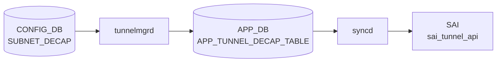

# SUBNET_DECAP テーブル

## 概要

[IPinIP](../../reference/glossary.md#term-ipinip) トンネルの **サブネット単位の decapsulation ルール** を定義する [CONFIG_DB](../../reference/glossary.md#term-config_db) テーブル[^1]。`TUNNEL_DECAP_TABLE` が個別の outer IP を起点とした decap を扱うのに対し、`SUBNET_DECAP` は **outer source IP がプレフィックス内に該当する場合に decap を行う** という、より広範な一致条件を表す。[SmartSwitch](../../reference/glossary.md#term-smartswitch) / [DASH](../../reference/glossary.md#term-dash) や DualToR 系のシナリオで、ToR 配下のサーバ群から発した [IPinIP](../../reference/glossary.md#term-ipinip) encapsulated トラフィックを decap するために導入された。

[YANG](../../reference/glossary.md#term-yang) リビジョン 2024-12-19 で追加された比較的新しいテーブル。

<!-- cdb-mermaid -->
### データフロー (自動生成)



!!! note "凡例"
    CONFIG_DB から SAI までの典型経路を `docs/reference/config-db-orch-map.md` から機械生成したミニ図。詳細・例外は本ページ本文と対応表を参照。
<!-- /cdb-mermaid -->

## key 構造

```text
SUBNET_DECAP|<name>
```

`<name>` はルール名 (任意文字列)。

## フィールド

| フィールド | 型 | 必須 | デフォルト | 説明 |
|-----------|----|------|----------|------|
| `name` (key) | string | yes | - | サブネット decap ルール名 |
| `status` | enum (`enable`/`disable`) | - | `disable` | ルールの有効/無効 |
| `src_ip` | inet:ipv4-prefix | **mandatory** | - | decap 対象とする outer source IPv4 プレフィックス |
| `src_ip_v6` | inet:ipv6-prefix | **mandatory** | - | decap 対象とする outer source IPv6 プレフィックス |

両プレフィックスとも `mandatory true` で、IPv4 と IPv6 の両方を必ず設定する必要がある（DualStack を前提とした設計）。

`status` は `sonic-types:mode-status` (`enable`/`disable`) で、最小権限の原則からデフォルトは `disable`。

## 制約

- `src_ip` / `src_ip_v6` は [YANG](../../reference/glossary.md#term-yang) で `mandatory true`。片方だけの設定は validation で拒否される。
- `status = enable` でない限りデータプレーンには反映されない。

## 購読者

- `swss` の tunnel-decap オーチェストレータが `SUBNET_DECAP` を読み、[SAI](../../reference/glossary.md#term-sai) の tunnel term entry を生成する（subnet ベースの match）。
- DualToR / [DASH](../../reference/glossary.md#term-dash) のサブシステムが補助的に参照する。

## 関連 CONFIG_DB / YANG / CLI

- 関連 [CONFIG_DB](../../reference/glossary.md#term-config_db): `TUNNEL_DECAP_TABLE` (個別 IP の decap)、`MUX_CABLE` (DualToR)
- 関連 CLI: 現状 dedicated CLI コマンドは無く `sonic-cfggen` / `config load` 経由で投入することが多い
- 関連 [YANG](../../reference/glossary.md#term-yang): `sonic-subnet-decap`

<!-- ref-triangle:start -->

## 関連リファレンス

- YANG: `sonic-subnet-decap`

<!-- ref-triangle:end -->

## 引用元

[^1]: YANG 定義: `sonic-subnet-decap.yang` (revision 2024-12-19). <https://github.com/sonic-net/sonic-buildimage/blob/9ea932ec2e18f35e58268ec2e4456b1d4afd65cd/src/sonic-yang-models/yang-models/sonic-subnet-decap.yang>

<!-- ops-hint -->
## 運用ヒント

### 典型値

- key 形式: `SUBNET_DECAP|<vrf>`。
- `status`: `enable`、`src_ip`/`dst_ip`: T1 ToR ペアの管理サブネット。

### よくある誤設定

- VxLAN decap ルールと subnet decap の優先順位を誤解して期待した decap が起きない。

### 確認コマンド

```bash
sonic-db-cli CONFIG_DB keys 'SUBNET_DECAP|*'
```
<!-- /ops-hint -->

<!-- value-behavior -->
## 値依存挙動マトリクス

### `status` 値別挙動
| 値 | 挙動 |
|----|------|
| `enable` | `subnetDecapConfig.enable = true`。MP2MP tunnel term が有効化され [SAI](../../reference/glossary.md#term-sai) tunnel term entry が生成される。 |
| `disable` | `subnetDecapConfig.enable = false`（デフォルト）。MP2MP term から `"subnet decap is disabled, ignored."` ログでスキップ。データプレーンに反映されない。 |

### `src_ip` フィールド挙動
| 状態 | 挙動 |
|------|------|
| 有効な IPv4 prefix | `isV4()` チェック通過。subnetDecapConfig に格納され tunnel term の送信元 IP として使用。 |
| IPv6 アドレスを誤指定 | `isV4()` 失敗。`SWSS_LOG_ERROR("Invalid source IP prefix")` → 処理中断。 |
| 形式不正 | `swss::IpPrefix()` が `std::invalid_argument` → `SWSS_LOG_ERROR` → 処理中断。 |

### `src_ip_v6` フィールド挙動
| 状態 | 挙動 |
|------|------|
| 有効な IPv6 prefix | `!isV4()` チェック通過。subnetDecapConfig に格納。 |
| IPv4 アドレスを誤指定 | `isV4()` チェックが成功してしまう → `SWSS_LOG_ERROR("Invalid source IPv6 prefix")` → 処理中断。 |

<!-- /value-behavior -->

<!-- cdb-exceptions -->
## 例外条件・特殊挙動

- **src_ip と src_ip_v6 の両方が未設定**: どちらも設定されていない場合 `SWSS_LOG_ERROR("Both src_ip and src_ip_v6 of subnet decap are not set.")` → エントリ破棄。[^2]
- **src_ip に IPv4 以外を指定**: `src_ip` フィールドに IPv6 アドレスを指定すると `isV4()` チェック失敗で `SWSS_LOG_ERROR("Invalid source IP prefix")` → 処理中断。[^2]
- **src_ip_v6 に IPv4 アドレスを指定**: `src_ip_v6` に IPv4 を指定すると `SWSS_LOG_ERROR("Invalid source IPv6 prefix")` → 処理中断。[^2]
- **IP プレフィクス形式不正**: `swss::IpPrefix()` が `std::invalid_argument` を投げた場合も `SWSS_LOG_ERROR("Invalid source IP prefix")` → 処理中断。[^2]
- **未知フィールド**: `src_ip` / `src_ip_v6` / `status` 以外のフィールドは `SWSS_LOG_ERROR("unknown subnet decap table attribute")` → エントリ破棄。[^2]
- **シングルトン制約**: `subnetDecapConfig` はシングルトン構造体として保持されるため、テーブルに複数エントリを書いても最後の SET_COMMAND で上書きされる。[^2]
- **MP2MP 以外のトンネル term は紐付け不可**: subnet decap トンネルに `MP2MP` 以外の term を紐付けようとすると `SWSS_LOG_ERROR("only MP2MP tunnel decap term is allowed for subnet decap tunnel.")` → 拒否。[^2]

[^2]: tunneldecaporch 実装: `sonic-swss/orchagent/tunneldecaporch.cpp`. <https://github.com/sonic-net/sonic-swss/blob/master/orchagent/tunneldecaporch.cpp>


<!-- defaults -->
## フィールド暗黙デフォルト (Phase A)

> コード精読由来。YANG `default` 値の外側にある実装上の暗黙挙動をまとめる。

| フィールド | YANG デフォルト | コード由来デフォルト | 乖離・注意点 |
|-----------|--------------|------------------|------------|
| `status` | `disable` | `false` (C++ bool、構造体初期化値) | YANG/実装一致。DEL_COMMAND 受信時も `false` にリセット[^3] |
| `src_ip` | なし (mandatory) | `""` 空文字列 | **YANG-実装 discrepancy**: 片方のみ未設定は silent 受理。両方未設定時のみエラー[^3] |
| `src_ip_v6` | なし (mandatory) | `""` 空文字列 | 同上。`src_ip` 未設定でも `src_ip_v6` だけで受理される[^3] |
| `tunnel` | (YANG に存在しない) | `"IPINIP_SUBNET"` **ハードコード** | CONFIG_DB から設定不可の隠し値。`tunneldecaporch.h` メンバ初期化[^3] |
| `tunnel_v6` | (YANG に存在しない) | `"IPINIP_SUBNET_V6"` **ハードコード** | 同上[^3] |
| `dscp_mode` (APP_DB へ) | (YANG に存在しない) | Broadcom T1: `"pipe"` / Broadcom 非T1: `"uniform"` / 他: `"pipe"` | **プラットフォーム依存**。`ipinip.json.j2` がビルド時に決定[^4] |
| `ecn_mode` (APP_DB へ) | (YANG に存在しない) | `"copy_from_outer"` | `ipinip.json.j2` にハードコード[^4] |
| `ttl_mode` (APP_DB へ) | (YANG に存在しない) | `"pipe"` | `ipinip.json.j2` にハードコード[^4] |

### 書込み順依存乖離

`status = disable` の状態で `src_ip` / `src_ip_v6` を変更すると:

- `subnetDecapConfig.src_ip` / `src_ip_v6` は更新される
- 既存の SAI tunnel term entry の送信元 IP は更新 **されない**（`setIpAttribute()` は `enable == true` 時のみ呼ばれる）

`enable` 後に `src_ip` を再設定すると SAI が更新される。先に `src_ip` を変えてから `enable` しても SAI 更新は走らない。

### YANG mandatory vs 実装の乖離

YANG は `src_ip` と `src_ip_v6` 両方を `mandatory true` とするが、実装の検査は「両方とも空の場合のみエラー」。
片方のみ設定した場合は YANG バリデーションを通過すれば orchagent もエラーにしない。
`sonic-cfggen` 経由の書き込みでは YANG validate が走るが、`sonic-db-cli` で直接書いた場合は実装側 validate のみ。

### シングルトン制約

`subnetDecapConfig` は orchagent 内でシングルトン保持。`SUBNET_DECAP|*` に複数エントリを書いた場合、最後に処理された SET_COMMAND で上書きされる（処理順序依存）。

[^3]: `tunneldecaporch.h` + `tunneldecaporch.cpp:566-699`. <https://github.com/sonic-net/sonic-swss/blob/master/orchagent/tunneldecaporch.cpp>
[^4]: `dockers/docker-orchagent/ipinip.json.j2`. <https://github.com/sonic-net/sonic-buildimage/blob/master/dockers/docker-orchagent/ipinip.json.j2>

<!-- /defaults -->

<!-- derivation -->
## 派生・条件付き登録 (Phase 6/7)

### Phase 6: 自動派生

tunnelmgrd が `SUBNET_DECAP` エントリの存在に基づいて IP-in-IP デカプセルトンネルを自動作成する。Config-DB 内フィールド間の自動付与なし。YANG の `must` 制約による論理チェックのみ。

### Phase 7: 条件付き登録 (add_manager 条件)

tunnelmgrd は常時起動し `SUBNET_DECAP` テーブルを無条件購読する。`DEVICE_METADATA.subtype==DualToR` 構成で主に使用される。`ip_prefix_list` が空の場合はエラーログ + スキップ。

<!-- /derivation -->

<!-- handler-branching -->
### Phase 8: Handler メソッド内分岐

| Handler | 分岐条件 | 効果 | evidence |
|---|---|---|---|
| `tunnelmgrd` | `SUBNET_DECAP` エントリ追加 | IP-in-IP デカプセルトンネル作成 | `tunnelmgrd` |
| `tunnelmgrd` | `SUBNET_DECAP` エントリ削除 | 対応トンネル削除 | `tunnelmgrd` |
| `tunnelmgrd` | `ip_prefix_list` が空 | ログエラー + スキップ | `tunnelmgrd` |

> **スキャン証跡**: `SUBNET_DECAP` は主に DualToR 構成で使われる。tunnelmgrd 経由でサブネット decap トンネルを管理。Config-DB 内の自動付与なし（該当なし）。

<!-- /handler-branching -->

<!-- runtime-trace -->
## CDB → 実コンテナ動作トレース

### 段階 1: Consumer 登録

- **orchagent / SubnetDecapOrch**: `SUBNET_DECAP` テーブルを `SubscriberStateTable` で購読。

### 段階 2: CFG → APPL 翻訳

- SubnetDecapOrch がサブネット範囲とデカプセルアクションを解析。APP_DB への書き込みなし。

### 段階 3: APPL → SAI

- orchagent が `sai_tunnel_api` または `sai_acl_api` でサブネット単位のデカプセルルールを設定。

### 段階 4: タイミング + 副作用

- 設定反映は orchagent 処理後数 ms 以内。
- 副作用: サブネット範囲の重複があると ACL リソース競合が発生する可能性。

<!-- /runtime-trace -->

<!-- ordering -->
## 処理順序と順序依存 (Phase B)

### orchagent 初期化順序

`TunnelDecapOrch` は orchdaemon 起動時に他の Orch より先に `CONFIG_DB` の
`SUBNET_DECAP` テーブルを **`pops()` で即時先読み** し、`subnetDecapConfig`
構造体を初期化する（`tunneldecaporch.cpp` コンストラクタ行 39-46）。
その後 Consumer として `addExecutor` に登録され、以降の差分変更を受信する。

この先読み設計は以下の順序依存を解決するためのものである:

1. **SUBNET_DECAP → TUNNEL_DECAP_TERM の前提関係**  
   `doDecapTunnelTermTask()` は `subnetDecapConfig.src_ip` / `src_ip_v6` を参照して
   MP2MP tunnel term の source IP を補完する。SUBNET_DECAP の設定が tunnel term 処理
   より前に確定していなければ、subnet decap term を正しく生成できない。

2. **PortsOrch 依存**  
   `doTask()` は `gPortsOrch->allPortsReady()` が `true` を返すまで早期リターンする。
   したがって SUBNET_DECAP の実際の反映はポート初期化完了後になる。

3. **TUNNEL_DECAP_TABLE の先行投入**  
   `ipinip.json.j2` が `SUBNET_DECAP.status == enable` を確認してから
   `TUNNEL_DECAP_TABLE:IPINIP_SUBNET` / `IPINIP_SUBNET_V6` を APP_DB に投入する。
   このトンネルオブジェクトが存在しない間は tunnel term が `unhandledDecapTerms`
   に積まれ、tunnel 追加後に再処理される。

### VIP ルートとの連動順序

`RouteOrch::addRoute()` および `VNetRouteOrch` は VIP ルート追加時に
`gTunneldecapOrch->getSubnetDecapConfig().enable` を参照して動的に
MP2MP tunnel term (`subnet_type: vip`) を生成する。

```
SUBNET_DECAP (enable) ──┐
                         ├─→ subnetDecapConfig.enable = true
                         │
RouteOrch::addRoute()   ─┤─→ createVipRouteSubnetDecapTerm()
                         │       └─→ APP_DB TUNNEL_DECAP_TERM_TABLE SET
                         │
VNetRouteOrch::set()    ─┘─→ createSubnetDecapTerm()
                                 └─→ APP_DB TUNNEL_DECAP_TERM_TABLE SET
```

SUBNET_DECAP の enable が確定する前にルートが先行投入された場合、
tunnel term は生成されない（ルート削除・再投入が必要）。

### ビルド時プロビジョニング順序

`dockers/docker-orchagent/ipinip.json.j2` の処理順序:

| 順序 | 生成エントリ | 条件 |
|------|-------------|------|
| 1 | `TUNNEL_DECAP_TABLE:IPINIP_SUBNET` | `subnet_decap.enable = true` かつ IPv4 loopback あり |
| 2 | `TUNNEL_DECAP_TERM_TABLE:IPINIP_SUBNET:<vlan-prefix>` (MP2MP, vlan) | 上記と同条件 |
| 3 | `TUNNEL_DECAP_TABLE:IPINIP_TUNNEL` | IPv4 loopback あり |
| 4 | `TUNNEL_DECAP_TABLE:IPINIP_SUBNET_V6` | `subnet_decap.enable = true` かつ IPv6 loopback あり |
| 5 | `TUNNEL_DECAP_TERM_TABLE:IPINIP_SUBNET_V6:<vlan-prefix>` (MP2MP, vlan) | 上記と同条件 |

VIP 系の MP2MP term (`subnet_type: vip`) はビルド時 JSON には含まれず、
routeorch / vnetorch が **ランタイムで動的生成** する。

### warm-reboot 挙動

`TunnelDecapOrch` に warm-reboot 固有のコードパスはない。

- orchagent 再起動時にコンストラクタの `pops()` が CONFIG_DB から再読み込みを行うため、
  `subnetDecapConfig` は自動的に復元される（CONFIG_DB は永続ストアのため設定値は保持）
- APP_DB の `TUNNEL_DECAP_TABLE` / `TUNNEL_DECAP_TERM_TABLE` は
  通常の warm-reboot SAI reconciliation フローで再プログラムされる
- `unhandledDecapTerms` はメモリ上の状態なので再起動でリセットされるが、
  APP_DB からの再投入で自動的に再処理される

### 削除時の順序

`SUBNET_DECAP` エントリの DEL 受信時:

- `subnetDecapConfig.enable = false` に即座に設定
- 既存の tunnel term エントリは **自動的には削除されない**（GC なし）
- 以降の新規 tunnel term 生成が抑止されるのみ
- 既存 term を削除するには `APP_TUNNEL_DECAP_TERM_TABLE` への明示的な DEL 操作が必要

> **コード証跡**: `tunneldecaporch.cpp` L39-48 (先読み初期化), L55-57 (PortsOrch ガード),
> L392-394 (is_subnet_decap_term 判定), L468-509 (src_ip 補完ロジック), L691-694 (DEL処理);
> `routeorch.cpp` L2714-2718, L3220-3235; `vnetorch.cpp` L1563-1594;
> `orchdaemon.cpp` L343-348; `ipinip.json.j2` L37-42, L93-123, L160-190

<!-- /ordering -->

<!-- cross-refs -->
## 暗黙参照 — Phase C (cross-table refs)

> **調査根拠**: `tunneldecaporch.cpp`, `tunneldecaporch.h`, `routeorch.cpp`, `vnetorch.cpp`, `ipinip.json.j2` 全行精読 (2026-05-18)
> 詳細証跡: `meta/_intermediate/cdb-flow/subnet-decap-ordering.md`

`SUBNET_DECAP` テーブルは直接の YANG leafref をほとんど持たないが、実行時に以下のテーブルを暗黙的に参照・連動する。

| 参照先 | DB | 参照方向 | YANG leafref | 実装上の必須度 | 証拠 |
|---|---|---|---|---|---|
| `TUNNEL_DECAP_TABLE:IPINIP_SUBNET` | APP_DB | 読み取り (tunnel オブジェクト存在確認) | なし | **実質必須** (ブート時 `ipinip.json.j2` が生成) | `tunneldecaporch.cpp:392` |
| `TUNNEL_DECAP_TABLE:IPINIP_SUBNET_V6` | APP_DB | 読み取り (IPv6 tunnel オブジェクト存在確認) | なし | **実質必須** | `tunneldecaporch.cpp:393` |
| `TUNNEL_DECAP_TERM_TABLE:IPINIP_SUBNET:*` | APP_DB | 読み取り (MP2MP vlan/vip term) | なし | 必須 | `tunneldecaporch.cpp:350-540` |
| `LOOPBACK_INTERFACE` | CONFIG_DB | 読み取り (`ipinip.json.j2` がビルド時参照) | なし | 実質必須 | `ipinip.json.j2:28-32` |
| `VLAN_INTERFACE` | CONFIG_DB | 読み取り (`ipinip.json.j2` が vlan term 生成に使用) | なし | VLAN subnet decap 必須 | `ipinip.json.j2:47-51` |
| `DEVICE_METADATA.localhost.switch_type` | CONFIG_DB | 読み取り (`ipinip.json.j2` が DPU で全設定をスキップ) | なし | platform 依存 | `ipinip.json.j2:1` |
| `DEVICE_METADATA.localhost.type` | CONFIG_DB | 読み取り (Broadcom T1 判定で dscp_mode 切り替え) | なし | platform 依存 | `ipinip.json.j2:13-14` |
| `STATE_TUNNEL_DECAP_TABLE` | STATE_DB | 書き込み (tunnel 状態を STATE_DB へ記録) | なし | 情報提供 | `tunneldecaporch.cpp:34, 287` |
| `STATE_TUNNEL_DECAP_TERM_TABLE` | STATE_DB | 書き込み (term 状態を STATE_DB へ記録) | なし | 情報提供 | `tunneldecaporch.cpp:35` |

### TUNNEL_DECAP_TABLE:IPINIP_SUBNET — 実質的な必須前提条件

`TunnelDecapOrch::doTunnelDecapTermTask()` は `tunnel_exists = (tunnelTable.find(tunnel_name) != tunnelTable.end())` でトンネルオブジェクトの存在を確認する。`IPINIP_SUBNET` が APP_DB に存在しない場合、subnet decap term は `unhandledDecapTerms` キューに積まれ SAI に反映されない。このトンネルは `ipinip.json.j2` がブート時に `SUBNET_DECAP[*].status == enable` を確認した場合のみ生成するため、**ブート前に `status=enable` が CONFIG_DB に存在すること**が実質的な必須条件となる（`tunneldecaporch.cpp:392-394, 516-521`）。

### RouteOrch / VNetRouteOrch — VIP ルート連動

`RouteOrch::addRoute()` および `VNetRouteOrch` は VIP ルート追加・削除時に `gTunneldecapOrch->getSubnetDecapConfig()` を参照する。`subnetDecapConfig.enable == true` の場合、VIP prefix に対する MP2MP tunnel term (`subnet_type: vip`) を動的に APP_DB へ書き込む。`SUBNET_DECAP` が disable / 未設定の場合は VIP ルートに対する decap term が生成されない（`routeorch.cpp:2714-2717, 3220-3251`; `vnetorch.cpp:1563-1594`）。

### VLAN_INTERFACE — ビルド時 vlan term 生成の前提

`ipinip.json.j2` は `VLAN_INTERFACE` から IPv4/IPv6 プレフィックスを取得し `TUNNEL_DECAP_TERM_TABLE:IPINIP_SUBNET:<prefix>` (MP2MP, vlan) を APP_DB へ注入する。VLAN_INTERFACE が存在しなければ vlan 型の decap term が生成されず、VLAN サブネット内からの IPinIP トラフィックが decap されない（`ipinip.json.j2:47-51`）。

### ASIC_VENDOR / DSCP_TO_TC_MAP — dscp_mode 自動決定

`ipinip.json.j2` が `ASIC_VENDOR` および `DEVICE_METADATA.localhost.type` を参照して `dscp_mode` (`pipe`/`uniform`) を決定する。また `DSCP_TO_TC_MAP.AZURE` が存在する場合は `decap_dscp_to_tc_map: AZURE` を付加する。CONFIG_DB の `SUBNET_DECAP` フィールドではなくビルド時テンプレートが決定するため、CONFIG_DB 側からの変更は不可（`ipinip.json.j2:8-25`）。

<!-- /cross-refs -->

<!-- failure -->
## 失敗挙動 (Phase D)

`SUBNET_DECAP` の処理は `doSubnetDecapTask()` 内の `valid` フラグで制御される。失敗時は CONFIG_DB エントリを書き戻さず、orchagent はリトライを行わない（即時破棄）。`STATE_DB` への failure ステータス書き込みはなく、エラーはすべて `SWSS_LOG_ERROR` でサイログに記録される。

### SET 時の失敗パターン

| 失敗ケース | 発生箇所 | 挙動 | retry |
|---|---|---|---|
| `src_ip` と `src_ip_v6` 両方未設定 | `doSubnetDecapTask()` L636-640 | `valid=false` → 即時破棄 | なし |
| `src_ip` に IPv6 アドレスを指定 (`isV4()` 失敗) | `doSubnetDecapTask()` L597-601 | `valid=false` + `break` → 即時破棄 | なし |
| `src_ip` 形式不正 (`std::invalid_argument`) | `doSubnetDecapTask()` L591-595 | `valid=false` + `break` → 即時破棄 | なし |
| `src_ip_v6` に IPv4 アドレスを指定 (`isV4()` 真) | `doSubnetDecapTask()` L617-621 | `valid=false` + `break` → 即時破棄 | なし |
| `src_ip_v6` 形式不正 (`std::invalid_argument`) | `doSubnetDecapTask()` L609-613 | `valid=false` + `break` → 即時破棄 | なし |
| 未知フィールド (`src_ip`/`src_ip_v6`/`status` 以外) | `doSubnetDecapTask()` L628-633 | `valid=false` + `break` → 即時破棄 | なし |

### DEL 時の挙動

`DEL_COMMAND` 受信時は `subnetDecapConfig.enable = false` に設定するのみで失敗パスはない。既存の tunnel term エントリは自動削除されない（GC なし）。

### tunnel term 側の失敗パターン

`SUBNET_DECAP` が enable の状態で `TUNNEL_DECAP_TERM_TABLE` 側の処理 (`doDecapTunnelTermTask()`) が失敗する場合:

| 失敗ケース | 発生箇所 | 挙動 | retry |
|---|---|---|---|
| MP2MP 以外の term を subnet decap トンネルに紐付け | `doDecapTunnelTermTask()` L446-449 | `valid=false` → 即時破棄 | なし |
| `subnet_decap` disabled 状態で subnet term を投入 | `doDecapTunnelTermTask()` L504-508 | `erase(it)` → 即時破棄 | なし |
| `src_ip` が未設定の状態で subnet term を投入 | `doDecapTunnelTermTask()` L482-486 | `erase(it)` → 即時破棄 | なし |
| `src_ip_v6` が未設定の状態で subnet term を投入 | `doDecapTunnelTermTask()` L495-499 | `erase(it)` → 即時破棄 | なし |
| SAI `addDecapTunnelTermEntry()` 失敗 | `doDecapTunnelTermTask()` L513-516 | `SWSS_LOG_ERROR` のみ、erase で破棄 | なし |
| tunnel オブジェクト未存在 (IPINIP_SUBNET 未生成) | `doDecapTunnelTermTask()` L511 | `unhandledDecapTerms` キューに積む | トンネル追加後に自動再処理 |

### エラーログ確認

```bash
# orchagent のエラーログを確認
sudo journalctl -u swss -n 100 | grep -E "subnet decap|Invalid source IP|Invalid source IPv6"
# または
sudo grep "subnet decap\|Invalid source" /var/log/syslog | tail -20
```

`ERROR_TABLE` への書き込みなし。`STATE_DB` への失敗ステータス書き込みもなし（成功時のみ `STATE_TUNNEL_DECAP_TABLE` が更新される）。

> **コード証跡**: `tunneldecaporch.cpp:566-699` (`doSubnetDecapTask()`), L368-549 (`doDecapTunnelTermTask()`), L280-334 (`doDecapTunnelTask()`)

<!-- /failure -->

<!-- entry-points -->
## 書き込み入り口 (Direction A)

SUBNET_DECAP テーブルへの書き込みが発生するコード経路を網羅的に調査した結果。

### CLI

  - 専用 CLI なし

### minigraph / sonic-cfggen

minigraph.py に SUBNET_DECAP 生成なし

### REST / gNMI

REST/gNMI 書き込み経路なし

### db_migrator

db_migrator.py での SUBNET_DECAP マイグレーションなし

### ビルド時デフォルト (build-time default)

**`dockers/docker-orchagent/ipinip.json.j2`** が SUBNET_DECAP テーブルのデフォルト値をビルド時に生成 (sonic-buildimage/dockers/docker-orchagent/ipinip.json.j2)

### ハードコードデフォルト / ランタイム注入

なし

### 死活・デッドコード

なし
<!-- /entry-points -->

<!-- glossary-links-injected: f9445b5b4106 -->
