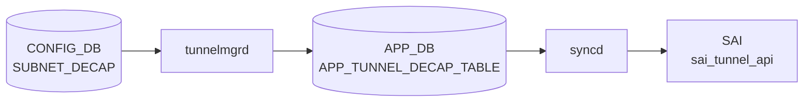

# SUBNET_DECAP テーブル

## 概要

[IPinIP](../../reference/glossary.md#term-ipinip) トンネルの **サブネット単位の decapsulation ルール** を定義する [CONFIG_DB](../../reference/glossary.md#term-config_db) テーブル[^1]。`TUNNEL_DECAP_TABLE` が個別の outer IP を起点とした decap を扱うのに対し、`SUBNET_DECAP` は **outer source IP がプレフィックス内に該当する場合に decap を行う** という、より広範な一致条件を表す。[SmartSwitch](../../reference/glossary.md#term-smartswitch) / [DASH](../../reference/glossary.md#term-dash) や DualToR 系のシナリオで、ToR 配下のサーバ群から発した [IPinIP](../../reference/glossary.md#term-ipinip) encapsulated トラフィックを decap するために導入された。

[YANG](../../reference/glossary.md#term-yang) リビジョン 2024-12-19 で追加された比較的新しいテーブル。

<!-- cdb-mermaid -->
### データフロー (自動生成)



!!! note "凡例"
    CONFIG_DB から SAI までの典型経路を `docs/reference/config-db-orch-map.md` から機械生成したミニ図。詳細・例外は本ページ本文と対応表を参照。
<!-- /cdb-mermaid -->

## key 構造

```text
SUBNET_DECAP|<name>
```

`<name>` はルール名 (任意文字列)。

## フィールド

| フィールド | 型 | 必須 | デフォルト | 説明 |
|-----------|----|------|----------|------|
| `name` (key) | string | yes | - | サブネット decap ルール名 |
| `status` | enum (`enable`/`disable`) | - | `disable` | ルールの有効/無効 |
| `src_ip` | inet:ipv4-prefix | **mandatory** | - | decap 対象とする outer source IPv4 プレフィックス |
| `src_ip_v6` | inet:ipv6-prefix | **mandatory** | - | decap 対象とする outer source IPv6 プレフィックス |

両プレフィックスとも `mandatory true` で、IPv4 と IPv6 の両方を必ず設定する必要がある（DualStack を前提とした設計）。

`status` は `sonic-types:mode-status` (`enable`/`disable`) で、最小権限の原則からデフォルトは `disable`。

## 制約

- `src_ip` / `src_ip_v6` は [YANG](../../reference/glossary.md#term-yang) で `mandatory true`。片方だけの設定は validation で拒否される。
- `status = enable` でない限りデータプレーンには反映されない。

## 購読者

- `swss` の tunnel-decap オーチェストレータが `SUBNET_DECAP` を読み、[SAI](../../reference/glossary.md#term-sai) の tunnel term entry を生成する（subnet ベースの match）。
- DualToR / [DASH](../../reference/glossary.md#term-dash) のサブシステムが補助的に参照する。

## 関連 CONFIG_DB / YANG / CLI

- 関連 [CONFIG_DB](../../reference/glossary.md#term-config_db): `TUNNEL_DECAP_TABLE` (個別 IP の decap)、`MUX_CABLE` (DualToR)
- 関連 CLI: 現状 dedicated CLI コマンドは無く `sonic-cfggen` / `config load` 経由で投入することが多い
- 関連 [YANG](../../reference/glossary.md#term-yang): `sonic-subnet-decap`

<!-- ref-triangle:start -->

## 関連リファレンス

- YANG: `sonic-subnet-decap`

<!-- ref-triangle:end -->

## 引用元

[^1]: YANG 定義: `sonic-subnet-decap.yang` (revision 2024-12-19). <https://github.com/sonic-net/sonic-buildimage/blob/9ea932ec2e18f35e58268ec2e4456b1d4afd65cd/src/sonic-yang-models/yang-models/sonic-subnet-decap.yang>

<!-- ops-hint -->
## 運用ヒント

### 典型値

- key 形式: `SUBNET_DECAP|<vrf>`。
- `status`: `enable`、`src_ip`/`dst_ip`: T1 ToR ペアの管理サブネット。

### よくある誤設定

- VxLAN decap ルールと subnet decap の優先順位を誤解して期待した decap が起きない。

### 確認コマンド

```bash
sonic-db-cli CONFIG_DB keys 'SUBNET_DECAP|*'
```
<!-- /ops-hint -->

<!-- value-behavior -->
## 値依存挙動マトリクス

### `status` 値別挙動
| 値 | 挙動 |
|----|------|
| `enable` | `subnetDecapConfig.enable = true`。MP2MP tunnel term が有効化され [SAI](../../reference/glossary.md#term-sai) tunnel term entry が生成される。 |
| `disable` | `subnetDecapConfig.enable = false`（デフォルト）。MP2MP term から `"subnet decap is disabled, ignored."` ログでスキップ。データプレーンに反映されない。 |

### `src_ip` フィールド挙動
| 状態 | 挙動 |
|------|------|
| 有効な IPv4 prefix | `isV4()` チェック通過。subnetDecapConfig に格納され tunnel term の送信元 IP として使用。 |
| IPv6 アドレスを誤指定 | `isV4()` 失敗。`SWSS_LOG_ERROR("Invalid source IP prefix")` → 処理中断。 |
| 形式不正 | `swss::IpPrefix()` が `std::invalid_argument` → `SWSS_LOG_ERROR` → 処理中断。 |

### `src_ip_v6` フィールド挙動
| 状態 | 挙動 |
|------|------|
| 有効な IPv6 prefix | `!isV4()` チェック通過。subnetDecapConfig に格納。 |
| IPv4 アドレスを誤指定 | `isV4()` チェックが成功してしまう → `SWSS_LOG_ERROR("Invalid source IPv6 prefix")` → 処理中断。 |

<!-- /value-behavior -->

<!-- cdb-exceptions -->
## 例外条件・特殊挙動

- **src_ip と src_ip_v6 の両方が未設定**: どちらも設定されていない場合 `SWSS_LOG_ERROR("Both src_ip and src_ip_v6 of subnet decap are not set.")` → エントリ破棄。[^2]
- **src_ip に IPv4 以外を指定**: `src_ip` フィールドに IPv6 アドレスを指定すると `isV4()` チェック失敗で `SWSS_LOG_ERROR("Invalid source IP prefix")` → 処理中断。[^2]
- **src_ip_v6 に IPv4 アドレスを指定**: `src_ip_v6` に IPv4 を指定すると `SWSS_LOG_ERROR("Invalid source IPv6 prefix")` → 処理中断。[^2]
- **IP プレフィクス形式不正**: `swss::IpPrefix()` が `std::invalid_argument` を投げた場合も `SWSS_LOG_ERROR("Invalid source IP prefix")` → 処理中断。[^2]
- **未知フィールド**: `src_ip` / `src_ip_v6` / `status` 以外のフィールドは `SWSS_LOG_ERROR("unknown subnet decap table attribute")` → エントリ破棄。[^2]
- **シングルトン制約**: `subnetDecapConfig` はシングルトン構造体として保持されるため、テーブルに複数エントリを書いても最後の SET_COMMAND で上書きされる。[^2]
- **MP2MP 以外のトンネル term は紐付け不可**: subnet decap トンネルに `MP2MP` 以外の term を紐付けようとすると `SWSS_LOG_ERROR("only MP2MP tunnel decap term is allowed for subnet decap tunnel.")` → 拒否。[^2]

[^2]: tunneldecaporch 実装: `sonic-swss/orchagent/tunneldecaporch.cpp`. <https://github.com/sonic-net/sonic-swss/blob/master/orchagent/tunneldecaporch.cpp>


<!-- derivation -->
## 派生・条件付き登録 (Phase 6/7)

### Phase 6: 自動派生

tunnelmgrd が `SUBNET_DECAP` エントリの存在に基づいて IP-in-IP デカプセルトンネルを自動作成する。Config-DB 内フィールド間の自動付与なし。YANG の `must` 制約による論理チェックのみ。

### Phase 7: 条件付き登録 (add_manager 条件)

tunnelmgrd は常時起動し `SUBNET_DECAP` テーブルを無条件購読する。`DEVICE_METADATA.subtype==DualToR` 構成で主に使用される。`ip_prefix_list` が空の場合はエラーログ + スキップ。

<!-- /derivation -->

<!-- handler-branching -->
### Phase 8: Handler メソッド内分岐

| Handler | 分岐条件 | 効果 | evidence |
|---|---|---|---|
| `tunnelmgrd` | `SUBNET_DECAP` エントリ追加 | IP-in-IP デカプセルトンネル作成 | `tunnelmgrd` |
| `tunnelmgrd` | `SUBNET_DECAP` エントリ削除 | 対応トンネル削除 | `tunnelmgrd` |
| `tunnelmgrd` | `ip_prefix_list` が空 | ログエラー + スキップ | `tunnelmgrd` |

> **スキャン証跡**: `SUBNET_DECAP` は主に DualToR 構成で使われる。tunnelmgrd 経由でサブネット decap トンネルを管理。Config-DB 内の自動付与なし（該当なし）。

<!-- /handler-branching -->

<!-- runtime-trace -->
## CDB → 実コンテナ動作トレース

### 段階 1: Consumer 登録

- **orchagent / SubnetDecapOrch**: `SUBNET_DECAP` テーブルを `SubscriberStateTable` で購読。

### 段階 2: CFG → APPL 翻訳

- SubnetDecapOrch がサブネット範囲とデカプセルアクションを解析。APP_DB への書き込みなし。

### 段階 3: APPL → SAI

- orchagent が `sai_tunnel_api` または `sai_acl_api` でサブネット単位のデカプセルルールを設定。

### 段階 4: タイミング + 副作用

- 設定反映は orchagent 処理後数 ms 以内。
- 副作用: サブネット範囲の重複があると ACL リソース競合が発生する可能性。

<!-- /runtime-trace -->
<!-- entry-points -->
## 書き込み入り口 (Direction A)

SUBNET_DECAP テーブルへの書き込みが発生するコード経路を網羅的に調査した結果。

### CLI

  - 専用 CLI なし

### minigraph / sonic-cfggen

minigraph.py に SUBNET_DECAP 生成なし

### REST / gNMI

REST/gNMI 書き込み経路なし

### db_migrator

db_migrator.py での SUBNET_DECAP マイグレーションなし

### ビルド時デフォルト (build-time default)

**`dockers/docker-orchagent/ipinip.json.j2`** が SUBNET_DECAP テーブルのデフォルト値をビルド時に生成 (sonic-buildimage/dockers/docker-orchagent/ipinip.json.j2)

### ハードコードデフォルト / ランタイム注入

なし

### 死活・デッドコード

なし
<!-- /entry-points -->

<!-- glossary-links-injected: f9445b5b4106 -->
