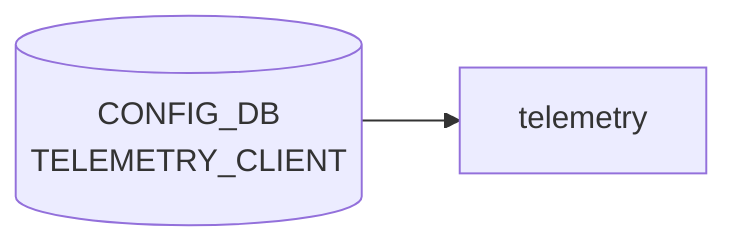

# TELEMETRY_CLIENT Subscription / DestinationGroup フィールド詳細

## 概要

`TELEMETRY_CLIENT` テーブルの `Subscription` および `DestinationGroup` エントリ、ならびに `Global` セクションのフィールド仕様を、[YANG](../../reference/glossary.md#term-yang) 定義とコード実装の両面から詳細に記述する。

概要・key 構造の全体像は [`TELEMETRY_CLIENT テーブル`](telemetry-client.md) を参照。本ページは **コード由来デフォルト・実装乖離 (discrepancy)** に焦点を当てる。

<!-- defaults -->
<!-- cdb-mermaid -->
### データフロー (自動生成)



!!! note "凡例"
    CONFIG_DB から SAI までの典型経路を `docs/reference/config-db-orch-map.md` から機械生成したミニ図。詳細・例外は本ページ本文と対応表を参照。
<!-- /cdb-mermaid -->

## 暗黙デフォルトとコード由来挙動

<!-- evidence: meta/_intermediate/cdb-flow/subscription-config-defaults.md -->

### 1. `report_interval` — YANG・実装ともに 5000 ms

**[YANG](../../reference/glossary.md#term-yang) 定義** (`sonic-telemetry_client.yang:134`):

```yang
leaf report_interval {
    type uint64;
    description "report_interval unit ms";
    default 5000;
}
```

**Go 実装** (`dialout_client.go:582`):

```go
cs := clientSubscription{
    interval: 5000, // default to 5000 milliseconds
    name:     name,
    cancel:   cancel,
}
```

YANG と実装が一致。`report_interval` を [CONFIG_DB](../../reference/glossary.md#term-config_db) に書かない場合、dial-out クライアントは **5000 ms (5 秒) 周期** で報告する。

---

### 2. `unidirectional` — 実装は常に `true` に固定 (YANG との discrepancy)

**YANG 定義** (`sonic-telemetry_client.yang:88`):

```yang
leaf unidirectional {
    type boolean;
    default true;
}
```

**Go 実装** (`dialout_client.go:503`):

```go
case "unidirectional":
    // No PublishResponse supported yet
    clientCfg.Unidirectional = true
```

!!! warning "YANG-実装 discrepancy"
    CONFIG_DB に `unidirectional = false` を設定しても、実装は常に `true` を代入する (コメント: "No PublishResponse supported yet")。双方向 RPC は現在未サポート。

---

### 3. `encoding` — 実装は常に `JSON_IETF` に固定 (YANG との discrepancy)

**YANG 定義** (`sonic-telemetry_client.yang:45`): enum `JSON_IETF` / `ASCII` / `BYTES` / `PROTO`

**Go 実装** (`dialout_client.go:500`):

```go
case "encoding":
    //Flexible encoding Not supported yet
    clientCfg.Encoding = gpb.Encoding_JSON_IETF
```

!!! warning "YANG-実装 discrepancy"
    `ASCII` / `BYTES` / `PROTO` を CONFIG_DB に設定しても、実装は常に `JSON_IETF` を使用する (コメント: "Flexible encoding Not supported yet")。

---

### 4. `retry_interval` — YANG optional・実装初期値 0 (要注意)

YANG に `default` 宣言なし。Go 構造体 `ClientConfig.RetryInterval` (`time.Duration`) はゼロ値 (`0`)。

ゼロ値のまま `newClient` を呼び出すと `context.WithTimeout(ctx, 0)` となり、**接続開始直後にタイムアウト** する可能性がある。実用上は `retry_interval` を明示設定する必要がある (例: `30` 秒)。

証跡: `dialout_client.go:260`

---

### 5. `path_target` — 省略時はエラー (実質 mandatory)

`path_target` を省略すると `cs.prefix.GetTarget()` が空文字列を返し、以下のエラーで Subscription が起動しない:

```go
if target == "" {
    return fmt.Errorf("Empty target data not supported yet")
}
```

YANG 上は optional だが、実装上は **事実上 mandatory**。

証跡: `dialout_client.go:187-189`

---

### 6. `dst_group` 省略時 — Subscription をサイレントに無効化

`dst_group` が空の Subscription エントリは登録されずに無視される:

```go
if cs.destGroupName == "" {
    // not destination configured, just return
    return nil
}
```

エラーは返さないため、`dst_group` の設定漏れは**気づきにくい**。

証跡: `dialout_client.go:622-625`

---

### デフォルト・挙動サマリ

| フィールド | スコープ | YANG default | コード実装値 | 備考 |
|-----------|---------|-------------|------------|------|
| `report_interval` | Subscription | `5000` ms | `5000` ms | YANG・実装一致 |
| `unidirectional` | Global | `true` | 常に `true` | discrepancy: `false` は無視 |
| `encoding` | Global | なし | 常に `JSON_IETF` | discrepancy: 他 enum は無視 |
| `retry_interval` | Global | なし | ゼロ値 (0) | 未設定時は即タイムアウト可能性 |
| `report_type` | Subscription | なし | ゼロ値 (未定義) | 省略時動作は未定義・実質必須 |
| `path_target` | Subscription | なし | 空値 → エラー | 実質 mandatory |
| `dst_group` | Subscription | なし | 空値 → サイレント無効 | エラーなし |
| `dst_addr` | DestinationGroup | なし | 必須 (空なら拒否) | `Destination.Addrs is empty` |

<!-- /defaults -->

## フィールド仕様

### `TELEMETRY_CLIENT|Global`

| フィールド | 型 | デフォルト | 実装値 | 説明 |
|-----------|----|-----------|--------|------|
| `retry_interval` | uint64 (秒) | なし | 0 (要設定) | 再接続リトライ間隔。未設定時は 0 秒でタイムアウト |
| `src_ip` | `inet:ip-address` | なし | なし | dial-out 送信元 IP アドレス |
| `encoding` | enum | なし | 常に `JSON_IETF` | テレメトリエンコーディング (他値は現状無視) |
| `unidirectional` | boolean | `true` | 常に `true` | 単方向ストリーム (現状 `false` は未サポート) |

### `TELEMETRY_CLIENT|DestinationGroup|<name>`

| フィールド | 型 | デフォルト | 説明 |
|-----------|----|-----------|------|
| `dst_addr` | `ipv4-port` (`host:port[,...]`) | なし (必須) | コレクタ宛先。カンマ区切りで複数指定可。空アドレスは拒否 |

### `TELEMETRY_CLIENT|Subscription|<name>`

| フィールド | 型 | デフォルト | 説明 |
|-----------|----|-----------|------|
| `dst_group` | string | なし (省略時サイレント無効) | 紐づける DestinationGroup 名 |
| `path_target` | enum `APPL_DB`/`CONFIG_DB`/`COUNTERS_DB`/`STATE_DB`/`OTHERS` | なし (実質必須) | 購読先 DB |
| `paths` | string (カンマ区切り) | なし | 購読するデータパス |
| `report_interval` | uint64 (ms) | `5000` | 報告周期 |
| `report_type` | enum `periodic`/`stream`/`once` | なし (実質必須) | 報告モード |

## 制約

- `ipv4-port` typedef: `dst_addr` は `IPv4:port` のカンマ区切りのみ許容。IPv6 リテラルは YANG で拒否
- `dst_group` は `must` 制約で同 list 内の既存 `name` との一致を要求
- `DestinationGroup` が参照中の場合、DEL 操作を拒否 (`"<name> is being used"`)
- `Global` キーへの DEL 操作は拒否 (`"Invalid delete operation"`)

## 運用ヒント

### 最小構成例 (init_cfg.json)

```json
{
  "TELEMETRY_CLIENT": {
    "Global": {
      "retry_interval": "30",
      "encoding": "JSON_IETF",
      "unidirectional": "true"
    },
    "TELEMETRY_CLIENT_LIST": [
      {
        "prefix": "DestinationGroup",
        "name": "MyCollector",
        "dst_addr": "192.0.2.10:8081"
      },
      {
        "prefix": "Subscription",
        "name": "MySubscription",
        "dst_group": "MyCollector",
        "path_target": "COUNTERS_DB",
        "paths": "COUNTERS/Ethernet*,COUNTERS_PORT_NAME_MAP",
        "report_interval": "5000",
        "report_type": "periodic"
      }
    ]
  }
}
```

### よくある誤設定

- `encoding` に `ASCII`/`BYTES`/`PROTO` を指定 → 現状は `JSON_IETF` として動作する (警告なし)
- `unidirectional = false` を設定 → 現状は `true` として動作する (警告なし)
- `retry_interval` を省略 → ゼロ値で接続タイムアウト。必ず設定すること
- `dst_group` を省略または誤字 → Subscription がサイレントに無効化される
- `path_target` を省略 → `"Empty target data not supported yet"` エラー

### 確認コマンド

```bash
sonic-db-cli CONFIG_DB keys 'TELEMETRY_CLIENT|*'
sonic-db-cli CONFIG_DB hgetall 'TELEMETRY_CLIENT|Global'
docker logs gnmi 2>&1 | grep -i "subscription\|dialout\|clientSubscription"
```

<!-- ordering -->
## 書込み順依存 (Phase B)

<!-- evidence: meta/_intermediate/cdb-flow/subscription-config-ordering.md -->

`DialOutRun()` / `processTelemetryClientConfig()` (`sonic-gnmi/dialout/dialout_client/dialout_client.go`) における
[CONFIG_DB](../../reference/glossary.md#term-config_db) エントリ処理の順序依存を以下に示す。

### 検出された順序依存

| # | 依存関係 | 方向 | 緩和策 |
|---|----------|------|--------|
| 1 | `DestinationGroup_<name>` → `Subscription_<name>` | **強制先行**（逆順は `NewInstance` 失敗） | Global 変更または Subscription 再設定で収束 |
| 2 | `Global` 変更 → 全 DestinationGroup / Subscription 再起動 | 即時（全接続リセット） | 運用開始前に Global を確定する |
| 3 | `DestinationGroup` 変更 → 参照 Subscription 再接続 | 即時（切断 → 自動再接続） | 変更中はテレメトリ送信が停止 |
| 4 | `Subscription_<name>` DEL → `DestinationGroup_<name>` DEL | **強制先行**（逆順は DestGrp DEL 失敗） | Subscription を先に DEL する |
| 5 | 初期ロード key 列挙順の非決定性 | startup 時のみ | `Global` エントリが存在すれば `setupDestGroupClients()` 呼び出しで自動収束 |

### 主要な制約詳細

**DestinationGroup → Subscription 先行必須 (依存 #1)**:
`processTelemetryClientConfig()` が `Subscription_<name>` を処理する際、
`cs.destGroupName` に指定した DestinationGroup が `destGrpNameMap` に未登録の場合、
`NewInstance()` は即座に失敗する (`dialout_client.go:181-184`)。

```go
dests, ok := destGrpNameMap[cs.destGroupName]
if !ok {
    return fmt.Errorf("Destination group %v doesn't exist", cs.destGroupName)
}
```

このため `TELEMETRY_CLIENT|DestinationGroup_<name>` は必ず `TELEMETRY_CLIENT|Subscription_<name>` より
先に [CONFIG_DB](../../reference/glossary.md#term-config_db) に存在している必要がある。

**Global 変更による全接続リセット (依存 #2)**:
`Global` の任意フィールドを変更すると、`processTelemetryClientConfig()` は `destGrpNameMap` の
全グループに対して `closeDestGroupClient()` → `setupDestGroupClients()` を実行し、
全 Subscription のダイアルアウト接続を一時切断・再起動する (`dialout_client.go:509-512`)。
送信途中のテレメトリメッセージは破棄される可能性がある。

**DEL 順序の強制 (依存 #4)**:
`DestGrp2ClientSubMap[destGroupName]` に参照中の Subscription が存在する間は
DestinationGroup の DEL が以下エラーで拒否される (`dialout_client.go:523-525`)。

```go
if _, ok := DestGrp2ClientSubMap[destGroupName]; ok {
    return fmt.Errorf("%v is being used: %v", destGroupName, DestGrp2ClientSubMap)
}
```

参照している `Subscription_<name>` エントリを全て削除してから `DestinationGroup_<name>` を削除する。

**startup 時の非決定的処理順 (依存 #5)**:
`DialOutRun()` 初期ロード時に `redisDb.Keys()` が返すキー順序は保証されない。
`Subscription_<name>` が `DestinationGroup_<name>` より先に処理された場合、
`NewInstance()` がエラーを返し Subscription が接続されない中間状態になる。
`Global` エントリが存在すれば Global 処理完了時に `setupDestGroupClients()` が呼ばれ自動収束するが、
Global エントリが省略された構成では収束トリガーが発生しないため注意が必要。

<!-- /ordering -->

<!-- cross-refs -->
## 暗黙テーブル参照 (Phase C)

> 詳細証跡: `meta/_intermediate/cdb-flow/subscription-config-cross-refs.md`

`DialOutRun()` が CONFIG_DB の `TELEMETRY_CLIENT` を購読・処理する際に暗黙的に参照するリソースを以下に示す。

### TELEMETRY_CLIENT が参照する下流テーブル / リソース

| 参照先 | 参照機構 | 条件 | evidence |
|--------|---------|------|---------|
| `/var/run/redis/sonic-db/database_config.json` | `sdcfg.GetDbId/GetDbSock/GetDbTcpAddr` — CONFIG_DB 接続確立に必須 | 常時 | `sonic_db_config/db_config.go:14`, `dialout_client.go:650-674` |
| `path_target` 指定の [Redis](../../reference/glossary.md#term-redis) DB (`APPL_DB` / `CONFIG_DB` / `COUNTERS_DB` / `STATE_DB` 等) | `sdc.NewDbClient` → `database_config.json` 経由でDB接続 | `Subscription_<name>` に有効な `path_target` が設定されている場合 | `dialout_client.go:199-200`, `sonic_data_client/db_client.go:186-207` |
| `paths` フィールドで指定するテーブルの実データ | `populateAllDbtablePath` が `paths` を実 [Redis](../../reference/glossary.md#term-redis) テーブルキーへ展開 | Subscription が接続済みかつ `paths` 非空の場合 | `sonic_data_client/db_client.go:204` |
| 外部 gRPC コレクタ (`dst_addr` の `host:port`) | TCP/gRPC ネットワーク接続 | `DestinationGroup_<name>` に有効な `dst_addr` が設定されている場合 | `dialout_client.go:531-543` |

### path_target による暗黙参照 DB の選択

`Subscription_<name>` の `path_target` フィールドにより、`NewInstance()` が選択するクライアントが変わる (`dialout_client.go:193-201`):

| `path_target` 値 | 使用クライアント | 暗黙参照 DB |
|-----------------|----------------|------------|
| `"OTHERS"` | `sdc.NewNonDbClient` | [Redis](../../reference/glossary.md#term-redis) DB 非経由（ファイルシステム等） |
| `"OC_YANG"` | `sdc.NewTranslClient` | `database_config.json` 経由で適切な DB |
| `APPL_DB` / `CONFIG_DB` / `COUNTERS_DB` / `STATE_DB` | `sdc.NewDbClient` | `database_config.json` で対応する Redis DB |

YANG (`sonic-telemetry_client.yang`) は `path_target` を enum として定義 (`APPL_DB` / `CONFIG_DB` / `COUNTERS_DB` / `STATE_DB` / `OTHERS`) しているが、
実装は任意の文字列を `NewDbClient` に渡すため、未定義の DB 名を指定すると `GetRedisClientsForDb` でエラーになる。

### TELEMETRY_CLIENT を参照する上流コンポーネント

| 参照元 | 参照機構 | 効果 |
|--------|---------|------|
| `dialout_client.go` (`DialOutRun`) | `PSubscribe("__keyspace@N__:TELEMETRY_CLIENT|*")` で CONFIG_DB キースペース通知を購読 | `hset` / `hdel` 発生時に `processTelemetryClientConfig` が呼ばれ、クライアント起動・停止・更新が行われる |
| `sonic-mgmt-framework` ([gNMI](../../reference/glossary.md#term-gnmi)/REST) | YANG `sonic-telemetry_client` モジュール経由でフィールド書き込み | CONFIG_DB への HSET が `DialOutRun` イベントループで拾われる |

!!! note "TELEMETRY テーブルとの関係"
    `TELEMETRY` テーブル（dial-in gnmi-server 設定）と `TELEMETRY_CLIENT` テーブル（dial-out）は同一 CONFIG_DB に存在するが、`dialout_client.go` は `TELEMETRY` テーブルを直接読まない。両者は設計上の姉妹テーブルであり、接続方向（in/out）のみが異なる。

<!-- /cross-refs -->

<!-- failure -->
## 失敗挙動 (Phase D)

<!-- evidence: meta/_intermediate/cdb-flow/subscription-config-failure.md -->

ソース: `sonic-net/sonic-gnmi/dialout/dialout_client/dialout_client.go`

### SET 処理における失敗経路

#### Global エントリ

| 失敗条件 | 検出箇所 | 結果 | ログ出力 | evidence |
|---|---|---|---|---|
| `retry_interval` が ParseUint 不能な文字列 | `processTelemetryClientConfig()` | `continue` でスキップ。`clientCfg.RetryInterval` はゼロ値のまま → 次接続試行で即タイムアウト | `log.V(2)` ("Invalid retry_interval...") | `dialout_client.go:495-498` |
| Global の DEL 操作 | L484-486 | エラー `"Invalid delete operation for <key>"` を返し処理中断。削除不可 | `log.V(2)` | `dialout_client.go:484-487` |
| `encoding` に `JSON_IETF` 以外の値を設定 | L500-502 | コメント "Flexible encoding Not supported yet" — 常に `JSON_IETF` を強制。エラー・ログなし（silent ignore） | なし | `dialout_client.go:500-502` |
| `unidirectional = false` を設定 | L503-505 | コメント "No PublishResponse supported yet" — 常に `true` を強制。エラー・ログなし（silent ignore） | なし | `dialout_client.go:503-505` |

#### DestinationGroup エントリ

| 失敗条件 | 検出箇所 | 結果 | ログ出力 | evidence |
|---|---|---|---|---|
| `dst_addr` に無効な `host:port` 値 | `dst.Validate()` | エラー `"Invalid destination address <addrs>"` を返す。DestinationGroup 全体が登録されない | `log.V(2)` | `dialout_client.go:538-543` |
| `dst_addr` 以外の未知フィールド | `switch field` の `default` | エラー `"Invalid DestinationGroup value <value>"` を返す。エントリ全体が登録されない | `log.V(2)` | `dialout_client.go:544-547` |
| DEL — Subscription から参照中 | L522-526 | エラー `"<name> is being used"` を返す。DEL が拒否されエントリは残存する | `log.V(1)` | `dialout_client.go:522-526` |

#### Subscription エントリ

| 失敗条件 | 検出箇所 | 結果 | ログ出力 | evidence |
|---|---|---|---|---|
| `paths` に解析不能なパス文字列 | `ygot.StringToPath()` | エラー `"Invalid paths <value>"` を返す。Subscription 全体が登録されない | `log.V(2)` | `dialout_client.go:607-613` |
| 未知フィールド名 | `switch field` の `default` | エラー `"Invalid field <field> value <value>"` を返す。Subscription 全体が登録されない | `log.V(2)` | `dialout_client.go:616-618` |
| `dst_group` 省略（空文字列） | L622-625 | エラーなしで `return nil`。Subscription はメモリ登録もされない（サイレント無効化） | なし | `dialout_client.go:622-625` |
| `dst_group` に存在しない DestinationGroup 名 | `NewInstance()` L181-185 | エラー `"Destination group <name> doesn't exist"`。接続は開始されない | `log.V(2)` | `dialout_client.go:181-185` |
| `path_target` 省略（空文字列） | `NewInstance()` L187-190 | エラー `"Empty target data not supported yet"`。接続は開始されない | なし | `dialout_client.go:187-190` |

### 接続・ストリーム層の失敗経路

| 失敗条件 | 検出箇所 | 結果 | ログ出力 | evidence |
|---|---|---|---|---|
| `retry_interval = 0`（ゼロ値）での gRPC dial | `context.WithTimeout(ctx, 0)` | `DialContext` が即タイムアウト → `goto restart` で無限高速リトライループ（CPU 高負荷） | `log.V(1)` ("Dialout connection ... failed") | `dialout_client.go:260-261, 314-317` |
| gRPC `DialContext` 失敗（コレクタ到達不能） | `publishRun()` L314-317 | `goto restart` でラウンドロビン次 `dst_addr` を試みる。全 addr 消化後も同サイクル反復 | `log.V(1)` | `dialout_client.go:306, 314-317` |
| `Publish()` RPC 失敗 | `publishRun()` L321-326 | `c.Close()` → `cs.Close()` → `goto restart` で再接続 | `log.V(1)` ("Publish ... failed, retrying") | `dialout_client.go:321-326` |
| Periodic モードの DB データ読み出しエラー | `cs.dc.Get()` L344-348 | `continue` でスキップ。インターバル後に再試行。ストリームは維持される（永続断でも終了しない） | `log.V(2)` ("Data read error") | `dialout_client.go:344-348` |

### retry / 復旧挙動補足

- **gRPC 再接続は上限なし**: `goto restart` ループに回数上限なし。`retry_interval` を必ず正値で設定すること
- **複数 `dst_addr` のフォールオーバー**: `publishRun` は `destIdx = (destIdx+1) % destNum` でラウンドロビン。1 台障害は次 addr への自動フォールオーバーで吸収
- **未知フィールドはエラー扱い（Global と異なる）**: `DestinationGroup` / `Subscription` エントリに未知フィールドがあるとエントリ全体が登録されない。`Global` は未知フィールドを静かに無視する点と対照的

<!-- /failure -->

<!-- constants -->
## ハードコード定数 (Phase E)

<!-- evidence: meta/_intermediate/cdb-flow/subscription-config-constants.md -->

`dialout_client.go` (`sonic-gnmi/dialout/dialout_client/`) に埋め込まれた、CONFIG_DB フィールドでは制御できない固定値を以下に示す。

| 定数 | 値 | 制御方法 | 影響 |
|------|----|---------|------|
| `report_interval` デフォルト | `5000` ms | CONFIG_DB `report_interval` で上書き可 | 未設定時の報告周期 |
| Stream モード起動待ち | `100` ms | 変更不可（ハードコード） | `StreamRun` goroutine の収束待ち (`dialout_client.go:392`) |
| pubsub ReceiveTimeout | `1000` ms | 変更不可（ハードコード） | CONFIG_DB 変更への最悪応答遅延 (`dialout_client.go:718`) |
| PriorityQueue 容量 | `1` | 変更不可（ハードコード） | 送信キューが 1 エントリ超過すると以降のデータは破棄 (`dialout_client.go:298`) |
| gRPC DialTimeout | `0` | 変更不可（ハードコード） | 実接続タイムアウトは `RetryInterval` に依存 (`dialout_client.go:666,678`) |
| `Unknown` reportType | `0` (iota) | YANG `report_type` フィールドで制御 | 空・未知値は `Unknown` → `publishRun` で動作未定義 |

### 主要定数の詳細

**`report_interval` デフォルト 5000 ms** (`dialout_client.go:582`):

```go
cs := clientSubscription{
    interval: 5000, // default to 5000 milliseconds
    name:     name,
    cancel:   cancel,
}
```

YANG `default 5000` と一致するため、YANG-実装 discrepancy はない。

**PriorityQueue 容量 1** (`dialout_client.go:298`):

```go
cs.q = queue.NewPriorityQueue(1, false)
```

`blocking=false` 設定のため、キュー満杯時に新データは即座に破棄される。
高頻度 Subscription（`report_interval` が短い場合）で送信遅延が生じると、データロストが発生する可能性がある。

**pubsub ReceiveTimeout 1000 ms** (`dialout_client.go:718`):

```go
msgi, err := pubsub.ReceiveTimeout(context.Background(), time.Millisecond*1000)
```

`DialOutRun()` のメインループが Redis keyspace 通知を待機する最大時間。
CONFIG_DB に変更を書き込んでから `dialout_client` が変更を検知するまで最大 **1 秒の遅延**が生じる。

**reportType 定数マッピング** (`dialout_client.go:27-35`):

```go
const (
    Unknown  reportType = iota  // 0 — 空文字列・未知値のフォールバック
    Once                        // 1
    Periodic                    // 2
    Stream                      // 3
)
```

`report_type` フィールドに `""` (空文字) または定義外の文字列を渡した場合、`NewReportType()` は `Unknown (0)` を返す。
`publishRun()` の `switch cs.reportType` に `Unknown` のケースは存在しないため、動作は未定義となる。

<!-- /constants -->

<!-- side-effects -->
## 副次 DB 書込 (Phase F)

<!-- evidence: meta/_intermediate/cdb-flow/subscription-config-side.md -->

CONFIG_DB `TELEMETRY_CLIENT` テーブルの変更に伴って `dialout_client.go` が副次的に書き込む DB エントリは **存在しない**。

| 副次 DB | 書込有無 | 根拠 |
|---|---|---|
| [APPL_DB](../../reference/glossary.md#term-appl_db) | なし | `redisDb.HGetAll` / `PSubscribe` / `Keys` 以外の Redis 操作なし (`dialout_client.go` 全行走査) |
| [STATE_DB](../../reference/glossary.md#term-state_db) | なし | `dialout_client.go` に `STATE_DB` 接続・参照なし |
| [COUNTERS_DB](../../reference/glossary.md#term-counters_db) | なし | `dialout_client.go` に `COUNTERS_DB` 参照なし。テレメトリ統計は外部コレクタ側で集計 |
| [ASIC_DB](../../reference/glossary.md#term-asic_db) / [FLEX_COUNTER_DB](../../reference/glossary.md#term-flex_counter_db) | なし | dialout は [SAI](../../reference/glossary.md#term-sai) 非経由。[orchagent](../../reference/glossary.md#term-orchagent) との連携なし |

`dialout_client.go` が CONFIG_DB に行う操作は以下の読み取りのみ (`dialout_client.go:471,690,707`):

- `redisDb.HGetAll(...)` — `TELEMETRY_CLIENT` エントリのフィールド読み取り
- `redisDb.PSubscribe(...)` — キースペース通知の購読（読み取り専用）
- `redisDb.Keys(...)` — `TELEMETRY_CLIENT|*` キーの列挙

外部への副作用は `dst_addr` に指定した gRPC コレクタへのテレメトリデータ送信（ネットワーク I/O）のみであり、Redis DB への書き込みには当たらない。

<!-- /side-effects -->

<!-- pubsub -->
## Redis 通知メカニズム (Phase G)

<!-- evidence: meta/_intermediate/cdb-flow/subscription-config-pubsub.md -->

`DialOutRun()` は swss-common の `SubscriberStateTable` を使わず、Go の `go-redis` クライアントが CONFIG_DB を **直接 PSUBSCRIBE** する独自実装である[^2]。

### PSUBSCRIBE パターン

```
__keyspace@<CONFIG_DB_ID>__:TELEMETRY_CLIENT|*
```

`CONFIG_DB_ID` は `sdcfg.GetDbId("CONFIG_DB", ns)` で実行時に解決（通常 `4`）。セパレータ `|` は `sdc.GetTableKeySeparator()` で解決。ワイルドカード `*` により `Global`・`DestinationGroup_*`・`Subscription_*` の全エントリを一括購読する（`dialout_client.go:682-690`）。

### 2 フェーズ初期化 → イベントループ

| フェーズ | 処理 | 実装箇所 |
|---------|------|---------|
| 1. ブルスキャン | `redisDb.Keys(ctx, "TELEMETRY_CLIENT\|*")` で既存エントリを全取得し各キーに `processTelemetryClientConfig(..., "hset")` を適用 | `dialout_client.go:707-715` |
| 2. イベントループ | `pubsub.ReceiveTimeout(ctx, 1000ms)` で常時ポーリング。ペイロード `"hset"` / `"del"` / `"hdel"` でそれぞれ更新・削除処理を実行 | `dialout_client.go:718-745` |

タイムアウト（1 秒）は `net.Error.Timeout()` で判定し `continue`（エラー扱いしない）。Redis からのプッシュがあれば最大 1 秒以内に処理される。明示的な sleep は存在しない。

### 受信後の処理分岐

受信キーのサフィックスにより 3 経路に分岐する（`dialout_client.go:482-643`）:

| キープレフィックス | 処理 |
|------------------|------|
| `Global` | グローバル設定 (`clientCfg`) を更新し、既存 gRPC 接続を全て `closeDestGroupClient()` + `setupDestGroupClients()` で再接続。`hdel` は不正操作として拒否 |
| `DestinationGroup_<name>` | `destGrpNameMap` にデスティネーションを登録し `setupDestGroupClients()` で gRPC 接続確立 |
| `Subscription_<name>` | `ClientSubscriptionNameMap` に `clientSubscription` を登録し `cs.NewInstance(ctx)` でデータ送信ゴルーチンを起動 |

### 購読テーブルまとめ

| DB | DB ID | テーブル | PSUBSCRIBE パターン |
|----|-------|---------|-------------------|
| CONFIG_DB | 動的取得 (通常 4) | `TELEMETRY_CLIENT\|*` | `__keyspace@<ID>__:TELEMETRY_CLIENT\|*` |

他の DB（[APPL_DB](../../reference/glossary.md#term-appl_db) / [STATE_DB](../../reference/glossary.md#term-state_db) / [COUNTERS_DB](../../reference/glossary.md#term-counters_db)）への通知購読は存在しない。

<!-- /pubsub -->

<!-- platform -->
## プラットフォーム差 (Phase H)

<!-- evidence: meta/_intermediate/cdb-flow/subscription-config-platform.md -->

### プラットフォーム固有分岐の有無

`dialout_client.go` 全 746 行において `HWSKU`・`is_multi_npu`・`platform`・`asic_id` 等のプラットフォーム固有分岐は**存在しない**。全プラットフォームで同一コードパスを実行する。

### multi-ASIC 構成での挙動

`dialout_client.go` は namespace を解決する際に常に `sdcfg.GetDbDefaultNamespace()` を使用し、常にホスト/グローバル namespace の CONFIG_DB のみを参照する (`dialout_client.go:465, 649`)。

```go
ns, _ := sdcfg.GetDbDefaultNamespace()  // 常に "" (デフォルト namespace) を返す
```

このため multi-[ASIC](../../reference/glossary.md#term-asic) 構成でも:

| 観点 | 挙動 |
|------|------|
| 参照 CONFIG_DB | ホスト global namespace の `TELEMETRY_CLIENT` のみ |
| per-[ASIC](../../reference/glossary.md#term-asic) namespace の `TELEMETRY_CLIENT` | 無視される（`dialout_client` には届かない） |
| `TELEMETRY_CLIENT` 設定の単位 | 全 [ASIC](../../reference/glossary.md#term-asic) 共通で 1 つの設定セット |

### ビルドフラグ

`rules/config:160`: デフォルト `INCLUDE_SYSTEM_GNMI = y`。`platform/*/` 全 `.mk` でこのフラグを `n` に上書きするプラットフォームは存在しない。**全プラットフォームで `docker-sonic-gnmi` はビルド・インストール対象**となる。

### Chassis 構成

Supervisor Card 上のホスト CONFIG_DB の `TELEMETRY_CLIENT` のみが有効。Linecard 個別の namespace に `TELEMETRY_CLIENT` を書いても `dialout_client` はそれを参照しない。

<!-- /platform -->

<!-- ref-triangle:start -->

## 関連リファレンス

- [YANG](../../reference/glossary.md#term-yang): `sonic-telemetry_client`
- [CONFIG_DB: TELEMETRY_CLIENT](telemetry-client.md) (テーブル全体の概要)
- [CONFIG_DB: TELEMETRY](telemetry.md) (dial-in 側設定)

<!-- ref-triangle:end -->

## 引用元

[^2]: Go 実装: `dialout_client.go`. <https://github.com/sonic-net/sonic-gnmi/blob/eb635b7679b260c3fd0786a6d0734fc8e82c9a22/dialout/dialout_client/dialout_client.go>

## 関連ページ

- [CONFIG_DB: TELEMETRY_CLIENT](telemetry-client.md)
- [CONFIG_DB: TELEMETRY](telemetry.md)

<!-- glossary-links-injected: subscription-config -->

<!-- glossary-links-injected: 31be2e7e39bf -->
