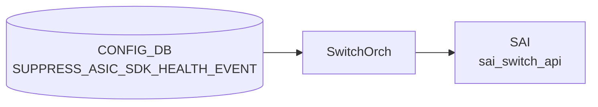

# SUPPRESS_ASIC_SDK_HEALTH_EVENT テーブル

## 概要

ASIC / SDK が発する health event のうち、重大度 (severity) ごとに**抑制ルールとカテゴリフィルタ**を定義するテーブル[^1]。
イベントの発火頻度が高いベンダーで、必要なものだけを `STATE_DB`/`SYSLOG` に通すために使う。

<!-- cdb-mermaid -->
### データフロー (自動生成)



!!! note "凡例"
    CONFIG_DB から SAI までの典型経路を `docs/reference/config-db-orch-map.md` から機械生成したミニ図。詳細・例外は本ページ本文と対応表を参照。
<!-- /cdb-mermaid -->

## key 構造

```text
SUPPRESS_ASIC_SDK_HEALTH_EVENT|<severity>
```

`<severity>`: `fatal` / `warning` / `notice` のいずれか。3 行が上限。

## フィールド

| フィールド | 型 | 説明 |
|-----------|----|------|
| `max_events` | uint32 | DB に保持できるイベント最大数。これを超えると古いものから捨てる |
| `categories` | leaf-list of enum (`software` / `firmware` / `cpu_hw` / `asic_hw`) | この severity で**抑制したい**カテゴリ集合。`ordered-by user` |

## 購読者

- `syncd` / `syncd-rpc` 内の [SAI](../../reference/glossary.md#term-sai) health monitor 拡張
- イベントは別途 `EVENT_HISTORY` 系テーブル ([STATE_DB](../../reference/glossary.md#term-state_db)) で観測可能

## 関連 YANG

- `sonic-suppress-asic-sdk-health-event`

<!-- ref-triangle:start -->

## 関連リファレンス

- [YANG](../../reference/glossary.md#term-yang): `sonic-suppress-asic-sdk-health-event`

<!-- ref-triangle:end -->

## 引用元

[^1]: [YANG](../../reference/glossary.md#term-yang) 定義: `sonic-suppress-asic-sdk-health-event.yang`. <https://github.com/sonic-net/sonic-buildimage/blob/9ea932ec2e18f35e58268ec2e4456b1d4afd65cd/src/sonic-yang-models/yang-models/sonic-suppress-asic-sdk-health-event.yang>; schema 定義は `sonic-swss-common/common/schema.h` の `CFG_SUPPRESS_ASIC_SDK_HEALTH_EVENT_NAME = "SUPPRESS_ASIC_SDK_HEALTH_EVENT"`

## 関連ページ
- [CONFIG_DB index](index.md)

<!-- ops-hint -->
## 運用ヒント

### 典型値

- key 形式: `SUPPRESS_ASIC_SDK_HEALTH_EVENT|<severity>` (`fatal`/`warning`/`notice`)。最大 3 行。
- `categories`: `software` / `firmware` / `cpu_hw` / `asic_hw` のうち抑制したいものを列挙。
- `max_events`: 数百〜数千程度を推奨。

### よくある誤設定

- `categories` に `fatal` 重大度のイベントを大量に抑制してしまい、本当に必要なアラートを見逃す。
- `<severity>` に許可外 (`error` / `info` 等) を入れて投入に失敗する。

### 確認コマンド

```bash
sonic-db-cli CONFIG_DB keys 'SUPPRESS_ASIC_SDK_HEALTH_EVENT|*'
sonic-db-cli STATE_DB keys 'ASIC_SDK_HEALTH_EVENT_TABLE|*'
```
<!-- /ops-hint -->

<!-- value-behavior -->
## 値依存挙動マトリクス

### `severity` (key) 値別挙動
| 値 | [SAI](../../reference/glossary.md#term-sai) 変換 | 挙動 |
|----|----------|------|
| `fatal` | `SAI_SWITCH_ATTR_REG_FATAL_SWITCH_ASIC_SDK_HEALTH_CATEGORY` | fatal 重大度の health event カテゴリを登録。 |
| `warning` | `SAI_SWITCH_ATTR_REG_WARNING_SWITCH_ASIC_SDK_HEALTH_CATEGORY` | warning 重大度のカテゴリを登録。 |
| `notice` | `SAI_SWITCH_ATTR_REG_NOTICE_SWITCH_ASIC_SDK_HEALTH_CATEGORY` | notice 重大度のカテゴリを登録。 |
| 空文字 | なし | `SWSS_LOG_ERROR("Failed to parse switch hash key: empty string")` → エントリ破棄。 |
| その他 | なし | `SWSS_LOG_ERROR("Unknown severity %s")` → エントリ破棄。 |
| プラットフォーム非対応 severity | なし | `SWSS_LOG_NOTICE("Unsupport to register categories on severity %d")` → スキップ。 |

### `categories` 値別挙動
| 値 | [SAI](../../reference/glossary.md#term-sai) 変換 | 挙動 |
|----|----------|------|
| `software` | `SAI_SWITCH_ASIC_SDK_HEALTH_CATEGORY_SW` | ソフトウェア起因イベントを抑制。 |
| `firmware` | `SAI_SWITCH_ASIC_SDK_HEALTH_CATEGORY_FW` | ファームウェア起因イベントを抑制。 |
| `cpu_hw` | `SAI_SWITCH_ASIC_SDK_HEALTH_CATEGORY_CPU_HW` | CPU ハードウェア起因イベントを抑制。 |
| `asic_hw` | `SAI_SWITCH_ASIC_SDK_HEALTH_CATEGORY_ASIC_HW` | ASIC ハードウェア起因イベントを抑制。 |
| 省略（未指定） | なし | 全カテゴリが抑制対象として登録される。DEL 操作時も同様に全カテゴリの抑制を解除。 |

<!-- /value-behavior -->

<!-- defaults -->
## 暗黙デフォルトとハードコード挙動

<!-- evidence: meta/_intermediate/cdb-flow/suppress-asic-sdk-health-event-defaults.md -->

### 1. `categories` 未設定 → 全カテゴリ購読 (= 抑制なし)

`switchorch.cpp:101-107` で「興味のあるカテゴリ集合」の初期値を全 4 カテゴリ (`software` / `firmware` / `cpu_hw` / `asic_hw`) で定義し、`registerAsicSdkHealthEventCategories` (`switchorch.cpp:1366-1408`) は `suppressed_category_list` が空の場合この `universal_set` をそのまま [SAI](../../reference/glossary.md#term-sai) へ登録する。

```cpp
const std::set<sai_switch_asic_sdk_health_category_t>
    switch_asic_sdk_health_event_category_universal_set =
{
    SAI_SWITCH_ASIC_SDK_HEALTH_CATEGORY_SW,
    SAI_SWITCH_ASIC_SDK_HEALTH_CATEGORY_FW,
    SAI_SWITCH_ASIC_SDK_HEALTH_CATEGORY_CPU_HW,
    SAI_SWITCH_ASIC_SDK_HEALTH_CATEGORY_ASIC_HW
};
```

→ CONFIG_DB に該当 severity 行がない、または `categories` が空 / 未設定の場合、**抑制なし = 全イベントを購読** が暗黙デフォルト。

証跡: `sonic-swss/orchagent/switchorch.cpp:101-107, 1366-1408`

---

### 2. 起動時に全カテゴリ抑制 (= `universal_set` が空) なら SAI 登録自体をスキップ

`switchorch.cpp:1390-1394`:

```cpp
if (isInitializing && interested_categories_set.empty())
{
    SWSS_LOG_INFO("All categories are suppressed for severity %s", ...);
    return;
}
```

起動時 (`initAsicSdkHealthEventNotification` 経由) で `categories` に全 4 カテゴリを列挙している severity 行が存在する場合、SAI への登録自体が走らず、その severity の health event 通知ハンドラ自体が有効化されない。実行中 (`SET_COMMAND`) の更新では同条件でも登録は試行される。

証跡: `sonic-swss/orchagent/switchorch.cpp:240-274, 1390-1394`

---

### 3. `max_events` 未設定 → 古いイベント自動削除なし (上限なし)

`eliminate_events.lua:15-23`:

```lua
local max_events = {}
for i = 1, #severity_keys do
    local max_event = redis.call('HGET', severity_keys[i], 'max_events')
    if max_event ~= false then
        max_events[string.sub(severity_keys[i], 32, -1)] = tonumber(max_event)
    end
end
if not next (max_events) then
    return result
end
```

どの severity 行にも `max_events` が無ければ Lua script は即 return。個別 severity 行で `max_events` が無い場合も後段 (`if max_events[severity] ~= nil then`) で削除対象から外れる。**=「上限なし、無制限保持」が暗黙デフォルト**。

証跡: `sonic-swss/orchagent/eliminate_events.lua:15-23, 38, 46-59`

---

### 4. イベント上限超過時の削除間隔は固定 3600 秒 (コンパイル時定数)

`switchorch.h:29`:

```cpp
#define ASIC_SDK_HEALTH_EVENT_ELIMINATE_INTERVAL 3600
```

`max_events` を超えても **即時削除されるわけではなく**、3600 秒周期の `SelectableTimer` (`switchorch.cpp:287-291`) が走るまで超過したまま `STATE_DB` に保持される。CONFIG_DB から変更不可。

証跡: `sonic-swss/orchagent/switchorch.h:29`, `switchorch.cpp:287-291`

<!-- /defaults -->

<!-- cdb-exceptions -->
## 例外条件・特殊挙動

- **key が空文字列**: key が空の場合 `SWSS_LOG_ERROR("Failed to parse switch hash key: empty string")` → エントリ破棄。[^2]
- **severity が未知の値**: key に設定された severity が SAI の severity map に存在しない場合 `SWSS_LOG_ERROR("Unknown severity %s")` → エントリ破棄。有効値は SAI 定義の `fatal` / `warning` / `notice` 等のみ。[^2]
- **SAI 非対応 severity**: `m_supportedAsicSdkHealthEventAttributes` に存在しない severity は `SWSS_LOG_NOTICE("Unsupport to register categories on severity %d")` → スキップ。プラットフォームによって対応 severity が異なる。[^2]
- **categories フィールド未指定でデフォルト全カテゴリ**: `categories` フィールドが存在しない場合は `registerAsicSdkHealthEventCategories(saiSeverity, key)` が引数なしで呼ばれ、全カテゴリが抑制対象として登録される。[^2]
- **DEL 操作は全カテゴリ抑制解除**: DEL_COMMAND 受信時も `registerAsicSdkHealthEventCategories(saiSeverity, key)` 引数なしが呼ばれ全カテゴリの抑制を解除する。[^2]

[^2]: switchorch 実装: `sonic-swss/orchagent/switchorch.cpp`. <https://github.com/sonic-net/sonic-swss/blob/master/orchagent/switchorch.cpp>


<!-- derivation -->
## 派生・条件付き登録 (Phase 6/7)

### Phase 6: 自動派生

SwitchOrch が `SUPPRESS_ASIC_SDK_HEALTH_EVENT` エントリの `event_category` フィールド値を対応する SAI health event suppression 属性へ自動マッピングする。Config-DB 内フィールド間の自動付与なし。

### Phase 7: 条件付き登録 (add_manager 条件)

SwitchOrch は常時登録し `SUPPRESS_ASIC_SDK_HEALTH_EVENT` テーブルを無条件購読する。SAI が health event suppression をサポートしない場合は SAI 属性設定がエラーになるが orchagent はログのみで継続する。

<!-- /derivation -->

<!-- handler-branching -->
### Phase 8: Handler メソッド内分岐

| Handler | 分岐条件 | 効果 | evidence |
|---|---|---|---|
| `SwitchOrch` | `event_category` フィールド値 | 対応する SAI health event カテゴリへの suppress 属性設定 | `switchorch.cpp` |
| `SwitchOrch` | エントリ削除 | 対応 SAI suppress 設定を解除 | `switchorch.cpp` |
| `SwitchOrch` | SAI 応答エラー | ログ出力 + 処理継続 (致命的エラーとしない) | `switchorch.cpp` |

> **スキャン証跡**: `SUPPRESS_ASIC_SDK_HEALTH_EVENT` は比較的新しいテーブル。SwitchOrch 経由で SAI の ASIC health event フィルタリングを制御。Config-DB 内フィールド間の自動派生なし（該当なし）。

<!-- /handler-branching -->

<!-- runtime-trace -->
## CDB → 実コンテナ動作トレース

### 段階 1: Consumer 登録

- **orchagent / AsicSdkHealthEventOrch**: `SUPPRESS_ASIC_SDK_HEALTH_EVENT` テーブルを `SubscriberStateTable` で購読。

### 段階 2: CFG → APPL 翻訳

- AsicSdkHealthEventOrch が抑制するイベントカテゴリ / 重大度リストを内部設定に格納。
- APP_DB への書き込みなし。

### 段階 3: APPL → SAI

- SAI: HealthEvent コールバックフィルタを設定 (SAI `sai_switch_api->set_switch_attribute` の `SAI_SWITCH_ATTR_*_HEALTH_EVENT_SUPPRESS`)。

### 段階 4: タイミング + 副作用

- 設定反映は即時。以降の ASIC SDK ヘルスイベントが抑制される。
- 副作用: 重要なイベントを抑制すると障害検知が遅れる。最小限の抑制に留めることを推奨。

<!-- /runtime-trace -->
<!-- entry-points -->
## 書き込み入り口 (Direction A)

SUPPRESS_ASIC_SDK_HEALTH_EVENT テーブルへの書き込みが発生するコード経路を網羅的に調査した結果。

### CLI

  - `config suppress-asic-sdk-health-event add/del ...` — `config/main.py` が `set_entry()` を呼ぶ (sonic-utilities/config/main.py)

### minigraph / sonic-cfggen

minigraph.py に SUPPRESS_ASIC_SDK_HEALTH_EVENT 生成なし

### REST / gNMI

REST/gNMI 書き込み経路なし

### db_migrator

db_migrator.py での SUPPRESS_ASIC_SDK_HEALTH_EVENT マイグレーションなし

### ビルド時デフォルト (build-time default)

なし

### ハードコードデフォルト / ランタイム注入

なし

### 死活・デッドコード

なし
<!-- /entry-points -->

<!-- glossary-links-injected: d2191ccfe0bd -->
