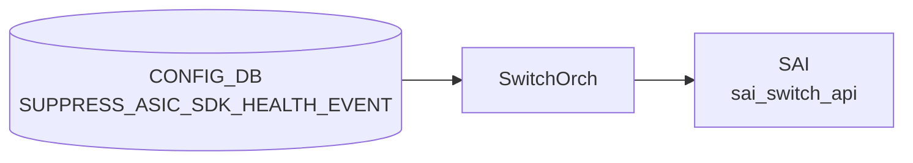

# SUPPRESS_ASIC_SDK_HEALTH_EVENT テーブル

## 概要

ASIC / SDK が発する health event のうち、重大度 (severity) ごとに**抑制ルールとカテゴリフィルタ**を定義するテーブル[^1]。
イベントの発火頻度が高いベンダーで、必要なものだけを `STATE_DB`/`SYSLOG` に通すために使う。

<!-- cdb-mermaid -->
### データフロー (自動生成)



!!! note "凡例"
    CONFIG_DB から SAI までの典型経路を `docs/reference/config-db-orch-map.md` から機械生成したミニ図。詳細・例外は本ページ本文と対応表を参照。
<!-- /cdb-mermaid -->

## key 構造

```
SUPPRESS_ASIC_SDK_HEALTH_EVENT|<severity>
```

`<severity>`: `fatal` / `warning` / `notice` のいずれか。3 行が上限。

## フィールド

| フィールド | 型 | 説明 |
|-----------|----|------|
| `max_events` | uint32 | DB に保持できるイベント最大数。これを超えると古いものから捨てる |
| `categories` | leaf-list of enum (`software` / `firmware` / `cpu_hw` / `asic_hw`) | この severity で**抑制したい**カテゴリ集合。`ordered-by user` |

## 購読者

- `syncd` / `syncd-rpc` 内の SAI health monitor 拡張
- イベントは別途 `EVENT_HISTORY` 系テーブル (STATE_DB) で観測可能

## 関連 YANG

- `sonic-suppress-asic-sdk-health-event`

<!-- ref-triangle:start -->

## 関連リファレンス

- YANG: `sonic-suppress-asic-sdk-health-event`

<!-- ref-triangle:end -->

## 引用元

[^1]: YANG 定義: `sonic-suppress-asic-sdk-health-event.yang`. <https://github.com/sonic-net/sonic-buildimage/blob/9ea932ec2e18f35e58268ec2e4456b1d4afd65cd/src/sonic-yang-models/yang-models/sonic-suppress-asic-sdk-health-event.yang>; schema 定義は `sonic-swss-common/common/schema.h` の `CFG_SUPPRESS_ASIC_SDK_HEALTH_EVENT_NAME = "SUPPRESS_ASIC_SDK_HEALTH_EVENT"`

## 関連ページ
- [CONFIG_DB index](index.md)

<!-- ops-hint -->
## 運用ヒント

### 典型値

- key 形式: `SUPPRESS_ASIC_SDK_HEALTH_EVENT|<severity>` (`fatal`/`warning`/`notice`)。最大 3 行。
- `categories`: `software` / `firmware` / `cpu_hw` / `asic_hw` のうち抑制したいものを列挙。
- `max_events`: 数百〜数千程度を推奨。

### よくある誤設定

- `categories` に `fatal` 重大度のイベントを大量に抑制してしまい、本当に必要なアラートを見逃す。
- `<severity>` に許可外 (`error` / `info` 等) を入れて投入に失敗する。

### 確認コマンド

```bash
sonic-db-cli CONFIG_DB keys 'SUPPRESS_ASIC_SDK_HEALTH_EVENT|*'
sonic-db-cli STATE_DB keys 'ASIC_SDK_HEALTH_EVENT_TABLE|*'
```
<!-- /ops-hint -->
