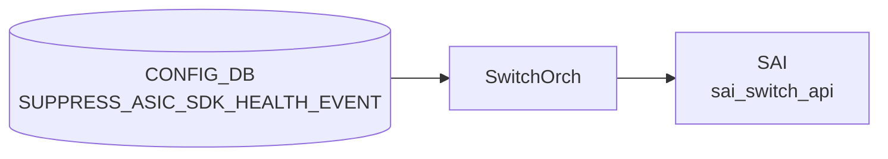

# SUPPRESS_ASIC_SDK_HEALTH_EVENT テーブル

## 概要

ASIC / SDK が発する health event のうち、重大度 (severity) ごとに**抑制ルールとカテゴリフィルタ**を定義するテーブル[^1]。
イベントの発火頻度が高いベンダーで、必要なものだけを `STATE_DB`/`SYSLOG` に通すために使う。

<!-- cdb-mermaid -->
### データフロー (自動生成)



!!! note "凡例"
    CONFIG_DB から SAI までの典型経路を `docs/reference/config-db-orch-map.md` から機械生成したミニ図。詳細・例外は本ページ本文と対応表を参照。
<!-- /cdb-mermaid -->

## key 構造

```text
SUPPRESS_ASIC_SDK_HEALTH_EVENT|<severity>
```

`<severity>`: `fatal` / `warning` / `notice` のいずれか。3 行が上限。

## フィールド

| フィールド | 型 | 説明 |
|-----------|----|------|
| `max_events` | uint32 | DB に保持できるイベント最大数。これを超えると古いものから捨てる |
| `categories` | leaf-list of enum (`software` / `firmware` / `cpu_hw` / `asic_hw`) | この severity で**抑制したい**カテゴリ集合。`ordered-by user` |

## 購読者

- `syncd` / `syncd-rpc` 内の [SAI](../../reference/glossary.md#term-sai) health monitor 拡張
- イベントは別途 `EVENT_HISTORY` 系テーブル ([STATE_DB](../../reference/glossary.md#term-state_db)) で観測可能

## 関連 YANG

- `sonic-suppress-asic-sdk-health-event`

<!-- ref-triangle:start -->

## 関連リファレンス

- [YANG](../../reference/glossary.md#term-yang): `sonic-suppress-asic-sdk-health-event`

<!-- ref-triangle:end -->

## 引用元

[^1]: [YANG](../../reference/glossary.md#term-yang) 定義: `sonic-suppress-asic-sdk-health-event.yang`. <https://github.com/sonic-net/sonic-buildimage/blob/9ea932ec2e18f35e58268ec2e4456b1d4afd65cd/src/sonic-yang-models/yang-models/sonic-suppress-asic-sdk-health-event.yang>; schema 定義は `sonic-swss-common/common/schema.h` の `CFG_SUPPRESS_ASIC_SDK_HEALTH_EVENT_NAME = "SUPPRESS_ASIC_SDK_HEALTH_EVENT"`

## 関連ページ
- [CONFIG_DB index](index.md)

<!-- ops-hint -->
## 運用ヒント

### 典型値

- key 形式: `SUPPRESS_ASIC_SDK_HEALTH_EVENT|<severity>` (`fatal`/`warning`/`notice`)。最大 3 行。
- `categories`: `software` / `firmware` / `cpu_hw` / `asic_hw` のうち抑制したいものを列挙。
- `max_events`: 数百〜数千程度を推奨。

### よくある誤設定

- `categories` に `fatal` 重大度のイベントを大量に抑制してしまい、本当に必要なアラートを見逃す。
- `<severity>` に許可外 (`error` / `info` 等) を入れて投入に失敗する。

### 確認コマンド

```bash
sonic-db-cli CONFIG_DB keys 'SUPPRESS_ASIC_SDK_HEALTH_EVENT|*'
sonic-db-cli STATE_DB keys 'ASIC_SDK_HEALTH_EVENT_TABLE|*'
```
<!-- /ops-hint -->

<!-- value-behavior -->
## 値依存挙動マトリクス

### `severity` (key) 値別挙動
| 値 | [SAI](../../reference/glossary.md#term-sai) 変換 | 挙動 |
|----|----------|------|
| `fatal` | `SAI_SWITCH_ATTR_REG_FATAL_SWITCH_ASIC_SDK_HEALTH_CATEGORY` | fatal 重大度の health event カテゴリを登録。 |
| `warning` | `SAI_SWITCH_ATTR_REG_WARNING_SWITCH_ASIC_SDK_HEALTH_CATEGORY` | warning 重大度のカテゴリを登録。 |
| `notice` | `SAI_SWITCH_ATTR_REG_NOTICE_SWITCH_ASIC_SDK_HEALTH_CATEGORY` | notice 重大度のカテゴリを登録。 |
| 空文字 | なし | `SWSS_LOG_ERROR("Failed to parse switch hash key: empty string")` → エントリ破棄。 |
| その他 | なし | `SWSS_LOG_ERROR("Unknown severity %s")` → エントリ破棄。 |
| プラットフォーム非対応 severity | なし | `SWSS_LOG_NOTICE("Unsupport to register categories on severity %d")` → スキップ。 |

### `categories` 値別挙動
| 値 | [SAI](../../reference/glossary.md#term-sai) 変換 | 挙動 |
|----|----------|------|
| `software` | `SAI_SWITCH_ASIC_SDK_HEALTH_CATEGORY_SW` | ソフトウェア起因イベントを抑制。 |
| `firmware` | `SAI_SWITCH_ASIC_SDK_HEALTH_CATEGORY_FW` | ファームウェア起因イベントを抑制。 |
| `cpu_hw` | `SAI_SWITCH_ASIC_SDK_HEALTH_CATEGORY_CPU_HW` | CPU ハードウェア起因イベントを抑制。 |
| `asic_hw` | `SAI_SWITCH_ASIC_SDK_HEALTH_CATEGORY_ASIC_HW` | ASIC ハードウェア起因イベントを抑制。 |
| 省略（未指定） | なし | 全カテゴリが抑制対象として登録される。DEL 操作時も同様に全カテゴリの抑制を解除。 |

<!-- /value-behavior -->

<!-- defaults -->
## 暗黙デフォルトとハードコード挙動

<!-- evidence: meta/_intermediate/cdb-flow/suppress-asic-sdk-health-event-defaults.md -->

### 1. `categories` 未設定 → 全カテゴリ購読 (= 抑制なし)

`switchorch.cpp:101-107` で「興味のあるカテゴリ集合」の初期値を全 4 カテゴリ (`software` / `firmware` / `cpu_hw` / `asic_hw`) で定義し、`registerAsicSdkHealthEventCategories` (`switchorch.cpp:1366-1408`) は `suppressed_category_list` が空の場合この `universal_set` をそのまま [SAI](../../reference/glossary.md#term-sai) へ登録する。

```cpp
const std::set<sai_switch_asic_sdk_health_category_t>
    switch_asic_sdk_health_event_category_universal_set =
{
    SAI_SWITCH_ASIC_SDK_HEALTH_CATEGORY_SW,
    SAI_SWITCH_ASIC_SDK_HEALTH_CATEGORY_FW,
    SAI_SWITCH_ASIC_SDK_HEALTH_CATEGORY_CPU_HW,
    SAI_SWITCH_ASIC_SDK_HEALTH_CATEGORY_ASIC_HW
};
```

→ CONFIG_DB に該当 severity 行がない、または `categories` が空 / 未設定の場合、**抑制なし = 全イベントを購読** が暗黙デフォルト。

証跡: `sonic-swss/orchagent/switchorch.cpp:101-107, 1366-1408`

---

### 2. 起動時に全カテゴリ抑制 (= `universal_set` が空) なら SAI 登録自体をスキップ

`switchorch.cpp:1390-1394`:

```cpp
if (isInitializing && interested_categories_set.empty())
{
    SWSS_LOG_INFO("All categories are suppressed for severity %s", ...);
    return;
}
```

起動時 (`initAsicSdkHealthEventNotification` 経由) で `categories` に全 4 カテゴリを列挙している severity 行が存在する場合、SAI への登録自体が走らず、その severity の health event 通知ハンドラ自体が有効化されない。実行中 (`SET_COMMAND`) の更新では同条件でも登録は試行される。

証跡: `sonic-swss/orchagent/switchorch.cpp:240-274, 1390-1394`

---

### 3. `max_events` 未設定 → 古いイベント自動削除なし (上限なし)

`eliminate_events.lua:15-23`:

```lua
local max_events = {}
for i = 1, #severity_keys do
    local max_event = redis.call('HGET', severity_keys[i], 'max_events')
    if max_event ~= false then
        max_events[string.sub(severity_keys[i], 32, -1)] = tonumber(max_event)
    end
end
if not next (max_events) then
    return result
end
```

どの severity 行にも `max_events` が無ければ Lua script は即 return。個別 severity 行で `max_events` が無い場合も後段 (`if max_events[severity] ~= nil then`) で削除対象から外れる。**=「上限なし、無制限保持」が暗黙デフォルト**。

証跡: `sonic-swss/orchagent/eliminate_events.lua:15-23, 38, 46-59`

---

### 4. イベント上限超過時の削除間隔は固定 3600 秒 (コンパイル時定数)

`switchorch.h:29`:

```cpp
#define ASIC_SDK_HEALTH_EVENT_ELIMINATE_INTERVAL 3600
```

`max_events` を超えても **即時削除されるわけではなく**、3600 秒周期の `SelectableTimer` (`switchorch.cpp:287-291`) が走るまで超過したまま `STATE_DB` に保持される。CONFIG_DB から変更不可。

証跡: `sonic-swss/orchagent/switchorch.h:29`, `switchorch.cpp:287-291`

<!-- /defaults -->

<!-- cdb-exceptions -->
## 例外条件・特殊挙動

- **key が空文字列**: key が空の場合 `SWSS_LOG_ERROR("Failed to parse switch hash key: empty string")` → エントリ破棄。[^2]
- **severity が未知の値**: key に設定された severity が SAI の severity map に存在しない場合 `SWSS_LOG_ERROR("Unknown severity %s")` → エントリ破棄。有効値は SAI 定義の `fatal` / `warning` / `notice` 等のみ。[^2]
- **SAI 非対応 severity**: `m_supportedAsicSdkHealthEventAttributes` に存在しない severity は `SWSS_LOG_NOTICE("Unsupport to register categories on severity %d")` → スキップ。プラットフォームによって対応 severity が異なる。[^2]
- **categories フィールド未指定でデフォルト全カテゴリ**: `categories` フィールドが存在しない場合は `registerAsicSdkHealthEventCategories(saiSeverity, key)` が引数なしで呼ばれ、全カテゴリが抑制対象として登録される。[^2]
- **DEL 操作は全カテゴリ抑制解除**: DEL_COMMAND 受信時も `registerAsicSdkHealthEventCategories(saiSeverity, key)` 引数なしが呼ばれ全カテゴリの抑制を解除する。[^2]

[^2]: switchorch 実装: `sonic-swss/orchagent/switchorch.cpp`. <https://github.com/sonic-net/sonic-swss/blob/master/orchagent/switchorch.cpp>


<!-- ordering -->
## 書込み順依存 (Phase B)

> 調査証跡: `meta/_intermediate/cdb-flow/suppress-asic-sdk-health-event-ordering.md`

### 1. orchagent 起動時の初期化順序

`orchdaemon.cpp:212` で `SwitchOrch` が生成されると、コンストラクタ内で即座に `initAsicSdkHealthEventNotification()` が呼ばれる。この関数が **CONFIG_DB を起動時スナップショット** として読み取り、SAI に初期登録する。

```
orchdaemon
  └─ gSwitchOrch = new SwitchOrch(...)
       └─ initAsicSdkHealthEventNotification()
            1. querySwitchCapability(SAI_SWITCH_ATTR_SWITCH_ASIC_SDK_HEALTH_EVENT_NOTIFY)
               └─ 非対応 → CAPABILITY=false を記録し return（以降の全登録スキップ）
            2. set_switch_attribute(NOTIFY コールバック登録)
            3. severity ごとに querySwitchCapability(REG_FATAL/WARNING/NOTICE_CATEGORY)
            4. 対応 severity → cfgSuppressASHETable.hget(severity, "categories")
            5. registerAsicSdkHealthEventCategories(attr, severity, categories, isInitializing=true)
```

→ **orchagent 起動前** に CONFIG_DB へ書き込んでおくと起動時スナップショットに取り込まれる。**起動後** に初めて書き込んだ場合は次の Consumer イベントで適用される。

### 2. 起動時 (isInitializing=true) と実行中 (false) の挙動差異

| タイミング | `isInitializing` | 全カテゴリ抑制時 (`categories` に全 4 種指定) |
|-----------|-----------------|----------------------------------------------|
| 起動時スナップショット | `true` | `interested_categories_set.empty()` → **SAI 登録自体をスキップ** — health event 通知ハンドラが有効にならない (`switchorch.cpp:1390-1394`) |
| 実行中 SET_COMMAND | `false` | SAI 登録は試行される（エラーになっても orch は継続） |

起動時に全カテゴリを抑制すると、その severity の health event がプラットフォームから届かない初期状態になる点が、実行中に全カテゴリ抑制を設定する場合と異なる。

### 3. SET/DEL 処理の内部順序 (`doCfgSuppressAsicSdkHealthEventTableTask`)

```
Consumer (SubscriberStateTable: CONFIG_DB SUPPRESS_ASIC_SDK_HEALTH_EVENT)
  └─ doTask() → doCfgSuppressAsicSdkHealthEventTableTask()
       1. key 空文字チェック → 空なら erase してスキップ         (switchorch.cpp:1427)
       2. severity → SAI 属性マッピング (map.at(key))             (:1435)
       3. m_supportedAsicSdkHealthEventAttributes 確認            (:1455)
          └─ 非対応 severity → syslog NOTICE のみで erase
       4. SET_COMMAND:
          a. categories フィールドあり → registerAsicSdkHealthEventCategories(attr, key, categories)
          b. categories フィールドなし → registerAsicSdkHealthEventCategories(attr, key)  [全購読]
       5. DEL_COMMAND → registerAsicSdkHealthEventCategories(attr, key)  [全購読 = 抑制解除]
```

SET / DEL ともに `registerAsicSdkHealthEventCategories` が唯一の SAI 書込み点であり、アトミックに `set_switch_attribute` を呼ぶ。APPL_DB 中継はなく CONFIG_DB → SAI の直接経路。

### 4. warm reboot との関係

orchagent が warm reboot で再起動すると `initAsicSdkHealthEventNotification()` が再度実行され、CONFIG_DB の最新値を読み取って SAI に再登録する。`RESTARTCHECK` 通知ハンドラ (`switchorch.cpp:1543-1564`) は SUPPRESS テーブルとは無関係で、suppression 状態の凍結・回復ロジックは存在しない。

### 5. 起動順依存まとめ

| 前提条件 | 不成立時の影響 |
|---------|--------------|
| SAI が health event notify をサポート (`querySwitchCapability` true) | CAPABILITY=false を記録し全 severity の初期登録をスキップ |
| 各 severity が SAI でサポート (`m_supportedAsicSdkHealthEventAttributes`) | 非対応 severity への SET は silent skip (syslog NOTICE) |
| orchagent 起動前に CONFIG_DB にエントリあり | 起動時スナップショットに取り込まれ初期 SAI 登録に反映 |
| orchagent 起動後に初めて CONFIG_DB に書き込む | Consumer イベント経由で反映。起動時点は抑制なし（全カテゴリ購読）のまま |

<!-- /ordering -->

<!-- cross-refs -->
## 暗黙参照テーブル (Phase C)

> 調査証跡: `meta/_intermediate/cdb-flow/suppress-asic-sdk-health-event-cross-refs.md`

`SUPPRESS_ASIC_SDK_HEALTH_EVENT` の処理において、SwitchOrch が参照・生成する他テーブル / リソースを網羅した。
このテーブルは APPL_DB 中継なしで CONFIG_DB → SAI の直接経路を取る点が特徴である。

| 参照先テーブル / リソース | 参照方向 | 条件 | 参照元 evidence |
|--------------------------|---------|------|----------------|
| `STATE_DB SWITCH_CAPABILITY\|switch.ASIC_SDK_HEALTH_EVENT` | 書き (SwitchOrch → STATE_DB) | orchagent 起動時 1 回。health event 通知サポート可否を `true`/`false` で記録 | `switchorch.cpp:231, 246` |
| `STATE_DB SWITCH_CAPABILITY\|switch.REG_{FATAL,WARNING,NOTICE}_ASIC_SDK_HEALTH_CATEGORY` | 書き | 各 severity の SAI capability 確認結果を記録 | `switchorch.cpp:265-269` |
| `STATE_DB ASIC_SDK_HEALTH_EVENT_TABLE` | 書き (SAI コールバック経由) | `onSwitchAsicSdkHealthEvent()` が SAI から受け取ったイベントを書き込む。SUPPRESS 設定が SAI フィルタを決定し書き込み数を制御する | `switchorch.cpp:1661` |
| SAI `SAI_SWITCH_ATTR_SWITCH_ASIC_SDK_HEALTH_EVENT_NOTIFY` capability | 読み (SAI クエリ) | 起動時。非対応なら全 severity の初期登録をスキップ | `switchorch.cpp:220` |
| SAI `SAI_SWITCH_ATTR_REG_{FATAL,WARNING,NOTICE}_SWITCH_ASIC_SDK_HEALTH_CATEGORY` | 書き (SAI set_switch_attribute) | SET/DEL ごとに `registerAsicSdkHealthEventCategories()` から呼ばれる | `switchorch.cpp:1366-1408` |
| CONFIG_DB `SUPPRESS_ASIC_SDK_HEALTH_EVENT` (起動時直接 `hget`) | 読み (起動時スナップショット) | `initAsicSdkHealthEventNotification()` が Consumer 非経由で直接読み取る唯一の経路 | `switchorch.cpp:240-274` |

!!! note "SWITCH_CAPABILITY への書き込みは起動時 1 回"
    `ASIC_SDK_HEALTH_EVENT` および `REG_*_ASIC_SDK_HEALTH_CATEGORY` フィールドは
    orchagent 起動時の `initAsicSdkHealthEventNotification()` 内でのみ書かれ、実行中に変化しない。
    `show event-driven-telemetry` / `show asic-sdk-health-event` (sonic-utilities/show/main.py:2803, 2849) が
    この値を読んでプラットフォームサポート有無を判断する。

!!! note "STATE_DB ASIC_SDK_HEALTH_EVENT_TABLE は SUPPRESS 設定の間接的な出力"
    `SUPPRESS_ASIC_SDK_HEALTH_EVENT` の設定が SAI に登録するカテゴリフィルタを決定する。
    結果として SAI から届く health event の数・種別が変わり、STATE_DB への書き込みも制御される。
    CONFIG_DB エントリが存在しない severity は全カテゴリを購読（= 抑制なし）。

<!-- /cross-refs -->

---

<!-- failure -->
## 失敗挙動 (Phase D)

> 調査証跡: `meta/_intermediate/cdb-flow/suppress-asic-sdk-health-event-failure.md`

Consumer: `SwitchOrch::doCfgSuppressAsicSdkHealthEventTableTask()` (`orchagent/switchorch.cpp:1410-1491`)

### SET 時の失敗パターン

| 失敗条件 | 検出箇所 | 挙動 | retry |
|---|---|---|---|
| key が空文字列 | `doTask()` L1425-1430 | `SWSS_LOG_ERROR("Failed to parse switch hash key: empty string")` → `erase(it)` でエントリ破棄 | なし |
| severity が未知の値 (`fatal`/`warning`/`notice` 以外) | `doTask()` L1432-1442 | `SWSS_LOG_ERROR("Unknown severity %s in SUPPRESS_ASIC_SDK_HEALTH_EVENT table")` → `erase(it)` でエントリ破棄 | なし |
| プラットフォームが該当 severity をサポートしない | `doTask()` L1455-1461 | `SWSS_LOG_NOTICE("Unsupport to register categories on severity %d")` → `erase(it)` でエントリ破棄 | なし |
| `categories` フィールドに未知の category 文字列 | `registerAsicSdkHealthEventCategories()` L1378-1386 | `SWSS_LOG_ERROR("Unknown ASIC/SDK health category %s to suppress")` → その値のみスキップ、残りの categories で処理継続 | なし（不正値を除いて継続） |
| SAI `set_switch_attribute` 失敗 | `registerAsicSdkHealthEventCategories()` L1404-1407 | `SWSS_LOG_ERROR("Failed to register ASIC/SDK health event categories for severity %s, status: %s")` → エントリは正常消費 | なし |
| 不明な op コマンド | `doTask()` L1484-1487 | `SWSS_LOG_ERROR("Unknown operation(%s)")` → `erase(it)` でエントリ破棄 | なし |

### DEL 時の失敗パターン

| 失敗条件 | 検出箇所 | 挙動 | retry |
|---|---|---|---|
| key が空文字列 | `doTask()` L1425-1430 | SET 時と同様。`SWSS_LOG_ERROR` → `erase(it)` | なし |
| severity が未知の値 | `doTask()` L1432-1442 | SET 時と同様。`SWSS_LOG_ERROR` → `erase(it)` | なし |
| SAI `set_switch_attribute` 失敗（抑制解除失敗） | `registerAsicSdkHealthEventCategories()` L1404-1407 | `SWSS_LOG_ERROR` → エントリは正常消費。SAI の抑制解除が反映されない状態が継続 | なし |

### 起動時 (`initAsicSdkHealthEventNotification`) の失敗パターン

| 失敗条件 | 検出箇所 | 挙動 |
|---|---|---|
| SAI が health event 通知をサポートしない | `switchorch.cpp:218-253` | `SWSS_LOG_NOTICE("ASIC/SDK health event is not supported")` → `STATE_DB SWITCH_CAPABILITY` に `false` 書き込み → 全 severity の初期登録をスキップして return |
| SAI コールバック登録失敗 | `switchorch.cpp:224-228` | `SWSS_LOG_ERROR("Failed to register ASIC/SDK health event handler: %s")` → `supported=false` → 全 severity の初期登録をスキップ |
| Lua スクリプト (`eliminate_events.lua`) ロード失敗 | `switchorch.cpp:280-297` | `SWSS_LOG_ERROR("Unable to load the Lua script to eliminate events")` → `max_events` によるイベント削除タイマーが機能しない。SUPPRESS 設定の処理は継続 |

### retry 挙動まとめ

| シナリオ | retry 上限 | 解消トリガー |
|---|---|---|
| key 空文字 / severity 不明 | **0 回**（即 erase） | CONFIG 修正 + 再投入が必要 |
| プラットフォーム非対応 severity | **0 回**（即 erase） | プラットフォーム変更以外に解消手段なし |
| `categories` 内の不明な値 | なし（値をスキップして継続） | 影響: 不正値が参照するカテゴリは抑制されず全購読になる |
| SAI `set_switch_attribute` 失敗 | **0 回**（ログのみ、正常消費） | なし。orchagent はエラーログのみで処理継続 |
| SAI 非対応（起動時） | **0 回**（全件スキップ） | ASIC が当該 SAI 属性に対応するまで機能しない |

### SAI エラーのサイレント消費に関する注意

`registerAsicSdkHealthEventCategories()` は `void` 関数であり、SAI 失敗時に呼び出し元へ `false` を返さない。このため `doCfgSuppressAsicSdkHealthEventTableTask()` は SAI 設定成否に関わらずエントリを `erase(it)` で消費し、次のエントリへ進む（`switchorch.cpp:1489`）。SAI 登録失敗が発生しても orchagent 内の `m_supportedAsicSdkHealthEventAttributes` は変化せず、**その severity の health event フィルタが意図通り設定されない状態が永続する**。復旧には当該エントリを再投入（DEL → SET）するか orchagent を再起動する必要がある。
<!-- /failure -->

<!-- derivation -->
## 派生・条件付き登録 (Phase 6/7)

### Phase 6: 自動派生

SwitchOrch が `SUPPRESS_ASIC_SDK_HEALTH_EVENT` エントリの `event_category` フィールド値を対応する SAI health event suppression 属性へ自動マッピングする。Config-DB 内フィールド間の自動付与なし。

### Phase 7: 条件付き登録 (add_manager 条件)

SwitchOrch は常時登録し `SUPPRESS_ASIC_SDK_HEALTH_EVENT` テーブルを無条件購読する。SAI が health event suppression をサポートしない場合は SAI 属性設定がエラーになるが orchagent はログのみで継続する。

<!-- /derivation -->

<!-- handler-branching -->
### Phase 8: Handler メソッド内分岐

| Handler | 分岐条件 | 効果 | evidence |
|---|---|---|---|
| `SwitchOrch` | `event_category` フィールド値 | 対応する SAI health event カテゴリへの suppress 属性設定 | `switchorch.cpp` |
| `SwitchOrch` | エントリ削除 | 対応 SAI suppress 設定を解除 | `switchorch.cpp` |
| `SwitchOrch` | SAI 応答エラー | ログ出力 + 処理継続 (致命的エラーとしない) | `switchorch.cpp` |

> **スキャン証跡**: `SUPPRESS_ASIC_SDK_HEALTH_EVENT` は比較的新しいテーブル。SwitchOrch 経由で SAI の ASIC health event フィルタリングを制御。Config-DB 内フィールド間の自動派生なし（該当なし）。

<!-- /handler-branching -->

<!-- runtime-trace -->
## CDB → 実コンテナ動作トレース

### 段階 1: Consumer 登録

- **orchagent / AsicSdkHealthEventOrch**: `SUPPRESS_ASIC_SDK_HEALTH_EVENT` テーブルを `SubscriberStateTable` で購読。

### 段階 2: CFG → APPL 翻訳

- AsicSdkHealthEventOrch が抑制するイベントカテゴリ / 重大度リストを内部設定に格納。
- APP_DB への書き込みなし。

### 段階 3: APPL → SAI

- SAI: HealthEvent コールバックフィルタを設定 (SAI `sai_switch_api->set_switch_attribute` の `SAI_SWITCH_ATTR_*_HEALTH_EVENT_SUPPRESS`)。

### 段階 4: タイミング + 副作用

- 設定反映は即時。以降の ASIC SDK ヘルスイベントが抑制される。
- 副作用: 重要なイベントを抑制すると障害検知が遅れる。最小限の抑制に留めることを推奨。

<!-- /runtime-trace -->
<!-- entry-points -->
## 書き込み入り口 (Direction A)

SUPPRESS_ASIC_SDK_HEALTH_EVENT テーブルへの書き込みが発生するコード経路を網羅的に調査した結果。

### CLI

  - `config suppress-asic-sdk-health-event add/del ...` — `config/main.py` が `set_entry()` を呼ぶ (sonic-utilities/config/main.py)

### minigraph / sonic-cfggen

minigraph.py に SUPPRESS_ASIC_SDK_HEALTH_EVENT 生成なし

### REST / gNMI

REST/gNMI 書き込み経路なし

### db_migrator

db_migrator.py での SUPPRESS_ASIC_SDK_HEALTH_EVENT マイグレーションなし

### ビルド時デフォルト (build-time default)

なし

### ハードコードデフォルト / ランタイム注入

なし

### 死活・デッドコード

なし
<!-- /entry-points -->

<!-- glossary-links-injected: d2191ccfe0bd -->
