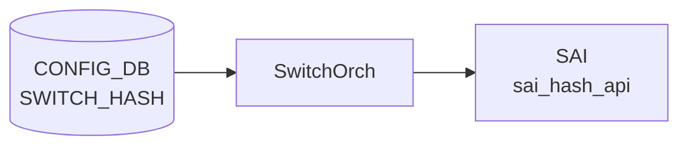

# SWITCH_HASH テーブル

## 概要

[ECMP](../../reference/glossary.md#term-ecmp) / [LAG](../../reference/glossary.md#term-lag) ハッシュに使うフィールド集合とハッシュアルゴリズムをスイッチ全体で設定する Generic Hash 設定テーブル[^1]。
`orchagent` が [CONFIG_DB](../../reference/glossary.md#term-config_db) から読んで [SAI](../../reference/glossary.md#term-sai) `SAI_SWITCH_ATTR_ECMP_DEFAULT_HASH_*` / `SAI_SWITCH_ATTR_LAG_DEFAULT_HASH_*` 系属性として [SAI](../../reference/glossary.md#term-sai) に push する。

<!-- cdb-mermaid -->
### データフロー (自動生成)



!!! note "凡例"
    CONFIG_DB から SAI までの典型経路を `docs/reference/config-db-orch-map.md` から機械生成したミニ図。詳細・例外は本ページ本文と対応表を参照。
<!-- /cdb-mermaid -->

## key 構造

```text
SWITCH_HASH|GLOBAL
```

シングルトン (`GLOBAL` の 1 行のみ)。

## フィールド

| フィールド | 型 | 説明 |
|-----------|----|------|
| `ecmp_hash` | leaf-list of `hash-field` enum | [ECMP](../../reference/glossary.md#term-ecmp) パケットを分散させるためのハッシュフィールド集合 |
| `lag_hash`  | leaf-list of `hash-field` enum | [LAG](../../reference/glossary.md#term-lag) メンバ間分散用のハッシュフィールド集合 |
| `ecmp_hash_algorithm` | `hash-algorithm` enum | [ECMP](../../reference/glossary.md#term-ecmp) に使うハッシュアルゴリズム (CRC / XOR / Random / CRC_32LO 等、`sonic-types`) |
| `lag_hash_algorithm` | `hash-algorithm` enum | [LAG](../../reference/glossary.md#term-lag) に使うハッシュアルゴリズム |

`hash-field` enum (`sonic-hash.yang`):

`IN_PORT` / `DST_MAC` / `SRC_MAC` / `ETHERTYPE` / `VLAN_ID` / `IP_PROTOCOL` / `DST_IP` / `SRC_IP` / `L4_DST_PORT` / `L4_SRC_PORT` / `INNER_*` 同等 / `IPV6_FLOW_LABEL`

`ordered-by user` が付くため、ユーザー設定順が保たれる (実装上はベンダーによっては順序を無視するが、[YANG](../../reference/glossary.md#term-yang) 上の意味は保存される)。

## 購読者

- `orchagent`（`SwitchOrch` の Generic Hash 拡張）

## 関連 CONFIG_DB / YANG / CLI

- 関連 CLI: `config switch-hash global ecmp` / `config switch-hash global lag`
- 関連 [YANG](../../reference/glossary.md#term-yang): `sonic-hash`
- 関連: `FG_NHG`（fine-grained ECMP）, `PORT.lag_hash` 等の per-port ハッシュは別経路

<!-- ref-triangle:start -->

## 関連リファレンス

- [YANG](../../reference/glossary.md#term-yang): [`sonic-hash`](../yang/sonic-hash.md)
- CLI: `config switch-hash`

<!-- ref-triangle:end -->

## 引用元

[^1]: YANG 定義: `sonic-hash.yang`. <https://github.com/sonic-net/sonic-buildimage/blob/9ea932ec2e18f35e58268ec2e4456b1d4afd65cd/src/sonic-yang-models/yang-models/sonic-hash.yang>

## 関連ページ
- [CONFIG_DB index](index.md)

<!-- value-behavior -->
## 値依存挙動マトリクス

### `ecmp_hash` / `lag_hash` — hash-field 全列挙

`IN_PORT` / `DST_MAC` / `SRC_MAC` / `ETHERTYPE` / `VLAN_ID` / `IP_PROTOCOL` / `DST_IP` / `SRC_IP` / `L4_DST_PORT` / `L4_SRC_PORT` / `INNER_DST_MAC` / `INNER_SRC_MAC` / `INNER_ETHERTYPE` / `INNER_IP_PROTOCOL` / `INNER_DST_IP` / `INNER_SRC_IP` / `INNER_L4_DST_PORT` / `INNER_L4_SRC_PORT` / `IPV6_FLOW_LABEL`

### `ecmp_hash_algorithm` / `lag_hash_algorithm` — hash-algorithm 全列挙

`CRC` / `XOR` / `RANDOM` / `CRC_32LO` / `CRC_32HI` / `CRC_CCITT` / `CRC_XOR`

| フィールド | 値 | [SAI](../../reference/glossary.md#term-sai) 挙動 |
|-----------|----|---------:|
| `ecmp_hash` / `lag_hash` | ASIC 非サポートフィールドを含む | SET 拒否 (`capability is not supported`) |
| `ecmp_hash_algorithm` | ASIC 非サポートアルゴリズム | SET 拒否 (同上) |
| 任意フィールド | DEL | 拒否 (`operation is not supported`) |

<!-- /value-behavior -->

<!-- cdb-exceptions -->
## 例外条件・特殊挙動

<!-- evidence: sonic-swss/orchagent/switchorch.cpp@4305596156d70e9797e8a881b3d19b46de0bce0d L797-989 -->

- **ASIC capability 未サポート**: `SwitchOrch` が SAI から取得した capability に設定値が含まれない場合、`"Failed to validate switch ECMP/LAG hash: capability is not supported"` を LOG_ERROR して SET を拒否する（`return false`）。適用されず [CONFIG_DB](../../reference/glossary.md#term-config_db) の値は保留状態のまま。
- **SAI set 失敗**: SAI API 呼び出しが `SAI_STATUS_SUCCESS` 以外を返すと `"Failed to set switch ECMP/LAG hash in SAI"` を LOG_ERROR して処理を中断する。
- **DEL 操作不可**: `ecmp_hash` / `lag_hash` / `ecmp_hash_algorithm` / `lag_hash_algorithm` はいずれも DEL 操作をサポートしない。削除を試みると `"Failed to remove switch ECMP/LAG hash configuration: operation is not supported"` を LOG_ERROR して `return false`。
- **ASIC/[CONFIG_DB](../../reference/glossary.md#term-config_db) 乖離**: 初期化時に ASIC 側と CONFIG_DB 側の値が食い違っている場合、SET 時に `"Failed to set switch hash: ASIC and CONFIG DB are diverged"`、DEL 時に `"Failed to remove switch hash: operation is not supported: ASIC and CONFIG DB are diverged"` を LOG_ERROR。
- **空キー**: key が空文字列だと `"Failed to parse switch hash key: empty string"` を LOG_ERROR してエントリをスキップする。

<!-- /cdb-exceptions -->

<!-- ops-hint -->
## 運用ヒント

### 典型値

- key 形式: `SWITCH_HASH|GLOBAL`。
- `ecmp_hash`: `DST_MAC,SRC_MAC,ETHERTYPE,IP_PROTOCOL,SRC_IP,DST_IP,L4_SRC_PORT,L4_DST_PORT`。LAG hash も同類。

### よくある誤設定

- hash 設定変更後 `config save` を忘れて reboot 後に既定値へ戻る。

### 確認コマンド

```bash
sonic-db-cli CONFIG_DB hgetall 'SWITCH_HASH|GLOBAL'
show switch-hash global
```
<!-- /ops-hint -->


<!-- defaults -->
## コード由来の暗黙デフォルト

<!-- evidence: meta/_intermediate/cdb-flow/switch-hash-defaults.md -->

### `ecmp_hash` / `lag_hash` field set — コード側デフォルトなし（SAI/ASIC 依存）

`SwitchHash` 構造体 (`sonic-swss/orchagent/switch/switch_container.h:18-26`) は `ecmp_hash` / `lag_hash` をいずれも `is_set = false` で初期化する。CONFIG_DB の `SWITCH_HASH|GLOBAL` エントリにフィールドが含まれない場合、`setSwitchHash()` (`switchorch.cpp:789-822`) は SAI への書き込みを行わず、**有効な hash field 集合は SAI ベンダー実装 / ASIC のデフォルト**（`SAI_SWITCH_ATTR_ECMP_HASH` / `SAI_SWITCH_ATTR_LAG_HASH` が指す hash オブジェクトの初期 `NATIVE_HASH_FIELD_LIST`）に従う。

`sonic-hash.yang` の `ecmp_hash` / `lag_hash` leaf-list には `default` 文が無く、YANG レベルでもデフォルトは規定されていない。SONiC orchagent 自身は IPv4 / IPv6 別の hash-field 集合をハードコードしておらず、`hash-field` enum も `SRC_IP` / `DST_IP` の単一集合で IPv4/IPv6 を区別しない（IPv6 対応は ASIC 側で自動的に handled）。

### `ecmp_hash_algorithm` / `lag_hash_algorithm` — コード側デフォルトなし

同じくフィールド未指定時は SAI 側のデフォルトアルゴリズム（典型的には `SAI_HASH_ALGORITHM_CRC`）が適用される。orchagent 経路でのハードコードデフォルトは存在しない。

### `querySwitchHashDefaults()` は OID キャッシュのみ

`SwitchOrch` コンストラクタ (`switchorch.cpp:169`) が起動時に `querySwitchHashDefaults()` (`switchorch.cpp:2030-2043`) を呼ぶが、これは `SAI_SWITCH_ATTR_ECMP_HASH` / `SAI_SWITCH_ATTR_LAG_HASH` の OID を `m_switchHashDefaults` にキャッシュする**のみ**で、SAI へ新規 SET は発行しない。OID 取得に失敗しても `LOG_WARN("Failed to get switch ECMP/LAG hash OID")` のみで起動は継続する。

### ASIC capability 不在時 — SET は warn skip でエラーにならない

```cpp
if (swCap.isSwitchEcmpHashSupported())
{
    if (!swCap.validateSwitchHashFieldCap(hash.ecmp_hash.value)) { LOG_ERROR; return false; }
    if (!setSwitchHashFieldListSai(hash, true))                  { LOG_ERROR; return false; }
    cfgUpd = true;
}
else
{
    SWSS_LOG_WARN("Switch ECMP hash configuration is not supported: skipping ...");
}
```

capability 機構自体が ASIC で未実装の場合 (`isSwitchEcmpHashSupported() / isSwitchLagHashSupported() / isSwitch*HashAlgorithmSupported()` が `false` を返す場合)、ユーザの SET は**エラーにならず**、警告ログのみで握り潰され SAI へ反映されない。`setSwitchHash()` 全体は `cfgUpd=false` のまま帰り、内部キャッシュ (`swHlpr.setSwHash()`) も更新されない。

これに対し「capability 機構は対応しているが指定された field 集合 / アルゴリズムが ASIC capability セットに含まれない」場合は `LOG_ERROR("Failed to validate switch ECMP/LAG hash: capability is not supported")` で `return false` → 上位で `"Failed to set switch hash: ASIC and CONFIG DB are diverged"` ログ（既存「例外条件」節に記載）。両者は混同しやすいので注意。

<!-- /defaults -->

<!-- derivation -->
## 派生・条件付き登録 (Phase 6/7)

### Phase 6: 自動派生

SwitchOrch が `ecmp_hash_algorithm` / `lag_hash_algorithm` フィールド値を SAI scheduling type enum へ自動変換する。`ecmp_hash` / `lag_hash` leaf-list の各 hash-field から対応する SAI hash field オブジェクト群を自動生成する。

### Phase 7: 条件付き登録 (add_manager 条件)

SwitchOrch は常時登録し `SWITCH_HASH` テーブルを無条件購読する。`SWITCH_HASH|GLOBAL` エントリのみ有効（シングルトン制約、YANG で強制）。SAI hash capability 未サポートの場合はログのみで継続。

<!-- /derivation -->

<!-- handler-branching -->
### Phase 8: Handler メソッド内分岐

| Handler | 分岐条件 | 効果 | evidence |
|---|---|---|---|
| `SwitchOrch` | `ecmp_hash_algorithm` フィールドあり | ECMP hash algorithm を SAI 属性として設定 | `switchorch.cpp` |
| `SwitchOrch` | `lag_hash_algorithm` フィールドあり | LAG hash algorithm を SAI 属性として設定 | `switchorch.cpp` |
| `SwitchOrch` | `ecmp_hash` leaf-list あり | ECMP 用 hash field オブジェクト群を生成して SAI に設定 | `switchorch.cpp` |
| `SwitchOrch` | `lag_hash` leaf-list あり | LAG 用 hash field オブジェクト群を生成して SAI に設定 | `switchorch.cpp` |
| `SwitchOrch` | SAI 設定エラー | ログ出力 + 処理継続 | `switchorch.cpp` |

> **スキャン証跡**: `SWITCH_HASH` はスイッチ全体の ECMP/LAG ハッシュポリシーの単一エントリ。SwitchOrch が SAI hash attribute を直接設定。`dscp_value` / `queue` の有無が SAI resolution mode を自動決定する点が主要 Phase 6。

<!-- /handler-branching -->

<!-- ordering -->
## 書込み順序依存・タイミング依存 (Phase B)

<!-- evidence: meta/_intermediate/cdb-flow/switch-hash-ordering.md -->

### SAI 初期化 → OID キャッシュ → SWITCH_HASH SET（先行必須）

`SwitchOrch` コンストラクタ (`switchorch.cpp:169`) は起動直後に `querySwitchHashDefaults()` (`switchorch.cpp:2030-2043`) を呼び、`SAI_SWITCH_ATTR_ECMP_HASH` / `SAI_SWITCH_ATTR_LAG_HASH` の OID を `m_switchHashDefaults` にキャッシュする。`setSwitchHashFieldListSai()` (`switchorch.cpp:750-769`) はこの OID を使って `sai_hash_api->set_hash_attribute()` を呼ぶため、OID キャッシュが取得できていない状態で CONFIG_DB に `SWITCH_HASH|GLOBAL` を書き込むと SAI の field-list SET が失敗する。OID 取得失敗時は `LOG_WARN` のみで起動継続するため、エラーが静かに握りつぶされる点に注意。

### Warm-reboot — `gSwitchOrch` は `m_orchList` 先頭で最初のイテレーションで再適用

`orchdaemon.cpp:500` で `m_orchList = { gSwitchOrch, gCrmOrch, gPortsOrch, ... }` が構築されており、`gSwitchOrch` は常に先頭に位置する。`warmRestoreAndSyncUp()` (`orchdaemon.cpp:1095-1172`) は 3 イテレーションで `m_orchList` 順に `doTask()` を実行する（コメント: 「First iteration: switchorch, Port init/hostif create part of portorch, buffers configuration」）。`SwitchOrch` には port 依存がないため `gPortsOrch->allPortsReady()` 待ちなしで即時処理される。`onWarmBootEnd()` のオーバーライドはなく、warm-reboot リストアは cold-reboot と同一経路 (`doCfgSwitchHashTableTask()` → `setSwitchHash()`) で行われる。

### `ecmp_hash` と `ecmp_hash_algorithm` を別 SET で送る場合の中間状態

`parseSwHash()` (`switch_helper.cpp:150-194`) は `hash.fieldValueMap` のフィールドを独立して解析するため、CONFIG_DB 内の届き順は無関係。ただし `ecmp_hash` と `ecmp_hash_algorithm` を **2 回の別 SET** として書き込む場合、1 回目の SET では `ecmp_hash_algorithm.is_set = false` のまま `setSwitchHash()` が呼ばれ、アルゴリズムは SAI デフォルト (`SAI_HASH_ALGORITHM_CRC`) のままになる。2 回目の SET でアルゴリズムが適用される。中間期にトラフィックの ECMP 分散は継続するが、意図したアルゴリズムが適用されない期間が生じる。**同一 SET にフィールドをまとめて書き込む**ことで中間状態を回避できる。

### SAI SET 失敗時のキャッシュ未更新と再試行不可

`setSwitchHash()` は SAI SET 成功時のみ `swHlpr.setSwHash(hash)` を呼んで内部キャッシュを更新する。SAI SET 失敗時はキャッシュが更新されないが、`doCfgSwitchHashTableTask()` は Consumer の `m_toSync` エントリを `map.erase(it)` で消費するため (`switchorch.cpp:996`)、Consumer レベルの自動再試行は行われない。CLI / `sonic-db-cli` で同値を再書き込みすることで再試行できる。

### 順序依存サマリ

| # | 依存関係 | 方向 | 緩和策 |
|---|----------|------|--------|
| 1 | SAI 初期化 → `querySwitchHashDefaults()` OID キャッシュ → SWITCH_HASH SET | 先行必須 | OID 取得失敗時は LOG_WARN のみ、SAI SET は失敗 |
| 2 | Warm-reboot: `gSwitchOrch` が `m_orchList` 先頭 → 第 1 イテレーションで再適用 | orchdaemon 設計による強制先行 | `onWarmBootEnd` オーバーライドなし、cold と同一経路 |
| 3 | `ecmp_hash` / `ecmp_hash_algorithm` を別 SET で送る | 推奨: 1 回の SET にまとめる | 2 回目 SET でアルゴリズム適用、中間期は SAI デフォルト |
| 4 | SAI SET 失敗 → キャッシュ未更新 → Consumer エントリ消費済み | 再試行不可 | CLI / sonic-db-cli で再書き込み |

<!-- /ordering -->

<!-- cross-refs -->
## 暗黙テーブル参照 (Phase C)

> 調査証跡: `meta/_intermediate/cdb-flow/switch-hash-cross-refs.md`

### YANG 明示 leafref

`sonic-hash.yang` の `SWITCH_HASH.GLOBAL` コンテナには他テーブルへの `leafref` が存在しない。フィールドはすべて自己完結した `hash-field` enum / `hash-algorithm` enum で定義される。

### 暗黙参照

| 参照元 | 参照先 | 種別 | 参照箇所 |
|--------|--------|------|---------|
| `SwitchOrch` コンストラクタ | SAI `SAI_SWITCH_ATTR_ECMP_HASH` / `SAI_SWITCH_ATTR_LAG_HASH` OID | ASIC 内部 OID（CONFIG_DB テーブルではない） | `switchorch.cpp:2030-2043` (`querySwitchHashDefaults`) |

### CONFIG_DB 他テーブルへの参照: なし

`doCfgSwitchHashTableTask()` は Consumer からフィールドを読み取り、`parseSwHash()` → `setSwitchHash()` を呼ぶだけで、`PORT` / `PORTCHANNEL` / `VRF` / `INTERFACE` / `FG_NHG` など他 CONFIG_DB テーブルを参照しない。Fine-Grained ECMP (`FG_NHG`) は `FgNhgOrch` が独立して管理し、`SwitchOrch` とは別経路で SAI に設定される。

<!-- /cross-refs -->

<!-- failure -->
## 失敗挙動 (Phase D)

> 調査証跡: `meta/_intermediate/cdb-flow/switch-hash-failure.md`

`SWITCH_HASH` の処理失敗は `doCfgSwitchHashTableTask()` / `setSwitchHash()` / `setSwitchHashFieldListSai()` 内で検出される。STATE_DB へのステータス書き込みはなく、エラー記録は syslog (`SWSS_LOG_ERROR` / `SWSS_LOG_WARN`) のみ。

### SET 時の失敗パターン

| 失敗ケース | 発生箇所 | 挙動 | retry |
|---|---|---|---|
| キーが空文字列 | `doCfgSwitchHashTableTask()` 冒頭 | `LOG_ERROR("Failed to parse switch hash key: empty string")` → erase | なし |
| ASIC capability 機構自体が未サポート (`isSwitchEcmpHashSupported()` = false) | `setSwitchHash()` capability チェック | `LOG_WARN("Switch ECMP hash configuration is not supported: skipping ...")` → erase、**サイレント握りつぶし** | なし |
| SAI capability セットに含まれない hash-field / hash-algorithm | `validateSwitchHashFieldCap()` / `validateSwitchHashAlgorithmCap()` | `LOG_ERROR("Failed to validate switch ECMP/LAG hash: capability is not supported")` → `"Failed to set switch hash: ASIC and CONFIG DB are diverged"` → erase | なし |
| SAI `set_hash_attribute()` 失敗 | `setSwitchHashFieldListSai()` L750-769 | `LOG_ERROR("Failed to set switch ECMP/LAG hash in SAI")` → キャッシュ未更新 → erase | なし（CLI 再書き込みが唯一の回復手段） |
| 起動時 OID キャッシュ未取得での SET | `querySwitchHashDefaults()` 失敗後の SAI SET | SAI SET 失敗（→ 上記 SAI 失敗パターンに帰着）; OID 取得失敗自体は `LOG_WARN` のみ | なし |

### DEL 時の失敗パターン

`ecmp_hash` / `lag_hash` / `ecmp_hash_algorithm` / `lag_hash_algorithm` はすべて DEL 非サポート。

| 失敗ケース | 挙動 | retry |
|---|---|---|
| DEL 操作（通常） | `LOG_ERROR("Failed to remove switch ECMP/LAG hash configuration: operation is not supported")` → erase | なし |
| DEL 操作（ASIC/CONFIG_DB 乖離時） | `LOG_ERROR("Failed to remove switch hash: operation is not supported: ASIC and CONFIG DB are diverged")` → erase | なし |

### 失敗時の挙動サマリ

```
SET 受信
  ├─ 空キー                                  → LOG_ERROR → erase（スキップ）
  ├─ capability 機構未サポート               → LOG_WARN  → erase（サイレント握りつぶし）
  ├─ capability セット外フィールド/アルゴリズム → LOG_ERROR → erase（CONFIG_DB 乖離ログ）
  └─ SAI SET 失敗 or OID 未取得             → LOG_ERROR → erase（CLI 再書き込みで回復）

DEL 受信
  └─ 全ケース                               → LOG_ERROR → erase（DEL 非サポート）
```

**自動再試行なし**: Consumer が `map.erase(it)` でエントリを消費するため、失敗後は CLI / `sonic-db-cli` による再書き込みが唯一の回復手段。`ERROR_TABLE` への書き込みもなし。CONFIG_DB のエントリは失敗後も残る（orchagent は書き戻さない）。

確認コマンド:
```bash
sudo grep "switch.*hash" /var/log/syslog | grep -E "ERROR|WARN"
sonic-db-cli CONFIG_DB hgetall 'SWITCH_HASH|GLOBAL'
```
<!-- /failure -->

<!-- constants -->
## ハードコード定数 (Phase E)

> 調査証跡: `meta/_intermediate/cdb-flow/switch-hash-constants.md`
> ソース: `sonic-swss/orchagent/switch/switch_schema.h` L1-37、`switch_helper.cpp` L22-53

### テーブルフィールド名定数 (switch_schema.h:25-37)

`parseSwHash()` (`switch_helper.cpp:159-180`) が field 名マッチングに使用するマクロ:

| マクロ名 | 値 |
|---|---|
| `SWITCH_HASH_ECMP_HASH` | `"ecmp_hash"` |
| `SWITCH_HASH_LAG_HASH` | `"lag_hash"` |
| `SWITCH_HASH_ECMP_HASH_ALGORITHM` | `"ecmp_hash_algorithm"` |
| `SWITCH_HASH_LAG_HASH_ALGORITHM` | `"lag_hash_algorithm"` |

これら 4 フィールド以外は `parseSwHash()` のマッチングに引っかからず、サイレントに無視される。

### hash-field 有効値定数 (switch_schema.h:5-23)

`swHashHashFieldMap` (`switch_helper.cpp:22-43`) がこれらを `sai_native_hash_field_t` にマッピング。19 値のみ有効:

| マクロ名 | 値 | SAI enum |
|---|---|---|
| `SWITCH_HASH_FIELD_IN_PORT` | `"IN_PORT"` | `SAI_NATIVE_HASH_FIELD_IN_PORT` |
| `SWITCH_HASH_FIELD_DST_MAC` | `"DST_MAC"` | `SAI_NATIVE_HASH_FIELD_DST_MAC` |
| `SWITCH_HASH_FIELD_SRC_MAC` | `"SRC_MAC"` | `SAI_NATIVE_HASH_FIELD_SRC_MAC` |
| `SWITCH_HASH_FIELD_ETHERTYPE` | `"ETHERTYPE"` | `SAI_NATIVE_HASH_FIELD_ETHERTYPE` |
| `SWITCH_HASH_FIELD_VLAN_ID` | `"VLAN_ID"` | `SAI_NATIVE_HASH_FIELD_VLAN_ID` |
| `SWITCH_HASH_FIELD_IP_PROTOCOL` | `"IP_PROTOCOL"` | `SAI_NATIVE_HASH_FIELD_IP_PROTOCOL` |
| `SWITCH_HASH_FIELD_DST_IP` | `"DST_IP"` | `SAI_NATIVE_HASH_FIELD_DST_IP` |
| `SWITCH_HASH_FIELD_SRC_IP` | `"SRC_IP"` | `SAI_NATIVE_HASH_FIELD_SRC_IP` |
| `SWITCH_HASH_FIELD_L4_DST_PORT` | `"L4_DST_PORT"` | `SAI_NATIVE_HASH_FIELD_L4_DST_PORT` |
| `SWITCH_HASH_FIELD_L4_SRC_PORT` | `"L4_SRC_PORT"` | `SAI_NATIVE_HASH_FIELD_L4_SRC_PORT` |
| `SWITCH_HASH_FIELD_INNER_DST_MAC` | `"INNER_DST_MAC"` | `SAI_NATIVE_HASH_FIELD_INNER_DST_MAC` |
| `SWITCH_HASH_FIELD_INNER_SRC_MAC` | `"INNER_SRC_MAC"` | `SAI_NATIVE_HASH_FIELD_INNER_SRC_MAC` |
| `SWITCH_HASH_FIELD_INNER_ETHERTYPE` | `"INNER_ETHERTYPE"` | `SAI_NATIVE_HASH_FIELD_INNER_ETHERTYPE` |
| `SWITCH_HASH_FIELD_INNER_IP_PROTOCOL` | `"INNER_IP_PROTOCOL"` | `SAI_NATIVE_HASH_FIELD_INNER_IP_PROTOCOL` |
| `SWITCH_HASH_FIELD_INNER_DST_IP` | `"INNER_DST_IP"` | `SAI_NATIVE_HASH_FIELD_INNER_DST_IP` |
| `SWITCH_HASH_FIELD_INNER_SRC_IP` | `"INNER_SRC_IP"` | `SAI_NATIVE_HASH_FIELD_INNER_SRC_IP` |
| `SWITCH_HASH_FIELD_INNER_L4_DST_PORT` | `"INNER_L4_DST_PORT"` | `SAI_NATIVE_HASH_FIELD_INNER_L4_DST_PORT` |
| `SWITCH_HASH_FIELD_INNER_L4_SRC_PORT` | `"INNER_L4_SRC_PORT"` | `SAI_NATIVE_HASH_FIELD_INNER_L4_SRC_PORT` |
| `SWITCH_HASH_FIELD_IPV6_FLOW_LABEL` | `"IPV6_FLOW_LABEL"` | `SAI_NATIVE_HASH_FIELD_IPV6_FLOW_LABEL` |

この 19 値以外の文字列が `ecmp_hash` / `lag_hash` leaf-list に含まれると `parseSwHashFieldList()` のルックアップが失敗し、`LOG_ERROR` → erase される。

### hash-algorithm 有効値定数 (switch_schema.h:28-34)

`swHashAlgorithmMap` (`switch_helper.cpp:45-53`) がこれらを `sai_hash_algorithm_t` にマッピング。7 値のみ有効:

| マクロ名 | 値 | SAI enum |
|---|---|---|
| `SWITCH_HASH_ALGORITHM_CRC` | `"CRC"` | `SAI_HASH_ALGORITHM_CRC` |
| `SWITCH_HASH_ALGORITHM_XOR` | `"XOR"` | `SAI_HASH_ALGORITHM_XOR` |
| `SWITCH_HASH_ALGORITHM_RANDOM` | `"RANDOM"` | `SAI_HASH_ALGORITHM_RANDOM` |
| `SWITCH_HASH_ALGORITHM_CRC_32LO` | `"CRC_32LO"` | `SAI_HASH_ALGORITHM_CRC_32LO` |
| `SWITCH_HASH_ALGORITHM_CRC_32HI` | `"CRC_32HI"` | `SAI_HASH_ALGORITHM_CRC_32HI` |
| `SWITCH_HASH_ALGORITHM_CRC_CCITT` | `"CRC_CCITT"` | `SAI_HASH_ALGORITHM_CRC_CCITT` |
| `SWITCH_HASH_ALGORITHM_CRC_XOR` | `"CRC_XOR"` | `SAI_HASH_ALGORITHM_CRC_XOR` |

YANG の `sonic-types.yang` で定義された `hash-algorithm` typedef の列挙値と完全一致する。

!!! note "YANG と lookup map の整合性"
    `sonic-hash.yang` の `ecmp_hash_algorithm` / `lag_hash_algorithm` フィールドの型は `stypes:hash-algorithm` で、`switch_schema.h` のマクロ値と一致している。YANG バリデーション段階で無効値は弾かれるが、orchagent コードも独自に `swHashAlgorithmMap` で再チェックするため、二重ガードになっている。

<!-- /constants -->

<!-- runtime-trace -->
## CDB → 実コンテナ動作トレース

### 段階 1: Consumer 登録

- **orchagent / SwitchOrch** (`sonic-swss/orchagent/switchorch.cpp`): `SWITCH_HASH` テーブルを `SubscriberStateTable` で購読。

### 段階 2: CFG → APPL 翻訳

- SwitchOrch がハッシュフィールドリスト (`hash_field_list`) と ECMP/LAG ハッシュ設定を解析。
- APP_DB への書き込みなし。

### 段階 3: APPL → SAI

- SwitchOrch が `sai_switch_api->set_switch_attribute()` で `SAI_SWITCH_ATTR_ECMP_DEFAULT_HASH_ALGORITHM` / `SAI_SWITCH_ATTR_LAG_DEFAULT_HASH_ALGORITHM` を設定。

### 段階 4: タイミング + 副作用

- 設定変更は即時有効。既存フローのハッシュ再計算によりトラフィック再分散が発生。
- 副作用: ハッシュフィールド変更でフローの ECMP メンバ割り当てが変わりパケット順序逆転が生じる可能性。

<!-- /runtime-trace -->
<!-- entry-points -->
## 書き込み入り口 (Direction A)

SWITCH_HASH テーブルへの書き込みが発生するコード経路を網羅的に調査した結果。

### CLI

  - `config switch-hash global ecmp/lag ...` — `config/plugins/sonic-hash.py` が `set_entry('SWITCH_HASH', ...)` を呼ぶ (sonic-utilities/config/plugins/sonic-hash.py)

### minigraph / sonic-cfggen

minigraph.py に SWITCH_HASH 生成なし

### REST / gNMI

REST/gNMI 書き込み経路なし

### db_migrator

db_migrator.py での SWITCH_HASH マイグレーションなし

### ビルド時デフォルト (build-time default)

なし

### ハードコードデフォルト / ランタイム注入

なし

### 死活・デッドコード

なし
<!-- /entry-points -->

<!-- glossary-links-injected: a26ef253c175 -->
