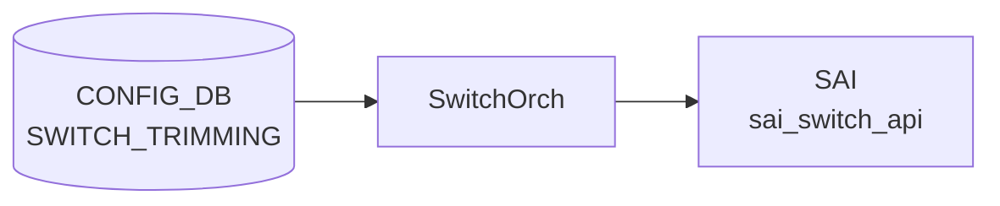

# SWITCH_TRIMMING テーブル

## 概要

輻輳テレメトリ向けの **パケットトリミング (packet trimming)** を全スイッチに対して設定するテーブル[^1]。
ドロップ予定のパケットを「短縮コピー」して別の [DSCP](../../reference/glossary.md#term-dscp) / TC / queue で送り出すことで、輻輳発生を末端まで伝える。

<!-- cdb-mermaid -->
### データフロー (自動生成)



!!! note "凡例"
    CONFIG_DB から SAI までの典型経路を `docs/reference/config-db-orch-map.md` から機械生成したミニ図。詳細・例外は本ページ本文と対応表を参照。
<!-- /cdb-mermaid -->

## key 構造

```text
SWITCH_TRIMMING|GLOBAL
```

シングルトン。

## フィールド

| フィールド | 型 | 説明 |
|-----------|----|------|
| `size` | uint32 | トリミング後のパケットサイズ [bytes] |
| `dscp_value` | uint8 (0..63) または `from-tc` | トリミング後パケットに付ける [DSCP](../../reference/glossary.md#term-dscp)。`from-tc` で `tc_value` から DSCP_TO_TC マッピング逆引きで導出 |
| `tc_value`  | uint8 | トリミング後パケットに付ける Traffic Class |
| `queue_index` | uint8 または `dynamic` | トリミング後パケットの送信キュー。`dynamic` で `dscp_value` から導出 |

`dscp_value=from-tc` と `queue_index=dynamic` の組み合わせは矛盾するので、どちらか一方だけを使う想定。

## 購読者

- `orchagent` (SwitchOrch trimming 拡張)。[SAI](../../reference/glossary.md#term-sai) の switch-level trimming 属性に push

## 関連 YANG

- `sonic-trimming`

<!-- ref-triangle:start -->

## 関連リファレンス

- [YANG](../../reference/glossary.md#term-yang): [`sonic-trimming`](../yang/sonic-trimming.md)

<!-- ref-triangle:end -->

## 引用元

[^1]: [YANG](../../reference/glossary.md#term-yang) 定義: `sonic-trimming.yang`. <https://github.com/sonic-net/sonic-buildimage/blob/9ea932ec2e18f35e58268ec2e4456b1d4afd65cd/src/sonic-yang-models/yang-models/sonic-trimming.yang>

## 関連ページ
- [CONFIG_DB index](index.md)

<!-- defaults -->
## コード由来のデフォルト・暗黙挙動 (Phase A)

> **調査根拠**: `sonic-swss/orchagent/switchorch.cpp` `SwitchOrch::setSwitchTrimming()` L1066–1304 + `orchagent/switch/trimming/{container.h, helper.cpp, capabilities.cpp, schema.h}` 全体精読 (2026-05-16)。`portsorch.cpp` の trim 関連は `nvda_port_trim_drop.lua` 統合と `DROPPED_TRIM_PACKETS` / `TX_TRIM_PACKETS` カウンタのみで、フィールド既定値処理は無い。

| フィールド | YANG default | switchorch 実装の実効デフォルト | 備考 |
|-----------|-------------|------------------------------|------|
| `size` | なし | **SAI ベンダー依存**（省略時 SAI 属性送信なし） | `container.h` で `size.is_set = false`。switchorch.cpp L1087 の `if (trim.size.is_set)` を通らない |
| `dscp_value` | なし | **SAI ベンダー依存**（省略時）。値ごとに parser が DSCP resolution mode を**自動派生** | 数値 → `SAI_PACKET_TRIM_DSCP_RESOLUTION_MODE_DSCP_VALUE`、`"from-tc"` → `..._FROM_TC` (helper.cpp L96–124) |
| `tc_value` | なし | symmetric DSCP モード時は **明示しても skip + WARN** | `setSwitchTrimming()` L1190 `"Skip setting switch trimming TC value for symmetric DSCP mode"` |
| `queue_index` | なし | **SAI ベンダー依存**（省略時）。値ごとに parser が queue resolution mode を**自動派生** | 数値 → `..._STATIC`、`"dynamic"` → `..._DYNAMIC` (helper.cpp L163–182) |
| 全フィールド省略 | — | **エントリ全破棄** (`validateTrimConfig`) | `LOG_ERROR("Validation error: missing valid fields")` → `parseTrimConfig` が `false` を返し SAI 書き込みなし |

### `dscp_value` / `queue_index` の暗黙モード派生

`SWITCH_TRIMMING` のフィールドは「値の種類で SAI resolution mode が自動的に決まる」設計。CONFIG_DB 側に `mode` 専用フィールドは存在せず、parser が値の文字列形を見て対応する SAI enum を選ぶ:

```cpp
// helper.cpp L96–124 (parseTrimDscp)
if (boost::algorithm::to_lower_copy(value) == SWITCH_TRIMMING_DSCP_VALUE_FROM_TC) // "from-tc"
{
    cfg.dscp.mode.value = SAI_PACKET_TRIM_DSCP_RESOLUTION_MODE_FROM_TC;
    cfg.dscp.mode.is_set = true;
    return true;
}
// ...数値パース後...
cfg.dscp.mode.value = SAI_PACKET_TRIM_DSCP_RESOLUTION_MODE_DSCP_VALUE;
cfg.dscp.mode.is_set = true;
```

- DSCP 数値の範囲は **0..63** (`helper.cpp` 内 `static const minDscp = 0; maxDscp = 63;` L25–26)。範囲外は `LOG_ERROR` + エントリ破棄。
- 大文字小文字は `boost::algorithm::to_lower_copy` で正規化されるので `"FROM-TC"` / `"Dynamic"` も受理される。

### ASIC capability 不在時の挙動 (重要)

`SwitchTrimmingCapabilities` (`capabilities.cpp` L142–179) はコンストラクタで SAI `query_attribute_capability` を呼び、各属性が **未サポートのまま (`isAttrSupported = false`)** だと `isSwitchTrimmingSupported()` が `false` を返す。

```cpp
// switchorch.cpp L1081–1085
if (!trimCap.isSwitchTrimmingSupported())
{
    SWSS_LOG_WARN("Switch trimming configuration is not supported: skipping ...");
    return true;   // ← エラーではなく成功扱い (no-op)
}
```

!!! warning "サイレント no-op"
    Packet trimming 非対応 ASIC では `SWITCH_TRIMMING|GLOBAL` への SET は **エラーにならず黙って捨てられる**。`show switch-trimming` で CONFIG_DB 値は見えても SAI には反映されていない。実機サポート有無は `STATE_DB` 側に書き出される capability テーブル (`writeCapabilitiesToDb()` 出力) で確認するのが正しい運用。

部分サポートの場合も似た減衰挙動を取る:

- DSCP 数値モード不可 (`isDscpValueModeSupported = false`) → `dscp.isAttrSupported` をチェック対象から外す (capabilities.cpp L159–162)
- FROM_TC モード不可 (`isFromTcModeSupported = false`) → `tc.isAttrSupported` を無視 (L166–169)
- STATIC queue モード不可 (`isStaticModeSupported = false`) → `queue.index.isAttrSupported` を無視 (L173–176)

enum capability (`isEnumSupported = false`) のときは `validateTrimDscpModeCap` / `validateTrimQueueModeCap` が常に `true` を返し検証スキップ (`capabilities.cpp` L185–188, L232–235)。

### ASIC / CONFIG_DB 乖離時の挙動

```cpp
// switchorch.cpp L1349, L1355
if (!setSwitchTrimming(trim))
    SWSS_LOG_ERROR("Failed to set switch trimming: ASIC and CONFIG DB are diverged");
// DEL の場合:
SWSS_LOG_ERROR("Failed to remove switch trimming: operation is not supported: ASIC and CONFIG DB are diverged");
```

`tObj = trimHlpr.getConfig()` と新規 `trim` を比較し、各フィールドについて `tObj` 側が `is_set` 未設定 or 値が異なる場合のみ SAI を更新するロジック。SAI capability 検証や set 呼び出しが失敗するとローカルキャッシュ (`trimHlpr.setConfig`) を更新せずに `false` を返すため、再投入には capability 修正か orchagent 再起動が必要。

### 新規作成 vs 更新の挙動差異

| 状況 | SAI 呼び出し | 省略フィールドの扱い |
|------|------------|-------------------|
| 初回 SET (ローカルキャッシュ `tObj` 空) | 各属性個別の `set_switch_attribute()` (set 単位) | `is_set = false` のフィールドは SAI に送られない → SAI 既定値が残る |
| 既存更新 | 変更があった属性のみ `set_switch_attribute()` を発行 | 省略フィールドは現在の SAI 属性値を保持（変更なし） |
| `dscp_value` を数値 ↔ `from-tc` で切替 | `tc` 側 cache (`cfg.tc.cache.value`) を更新して SAI に反映 (switchorch.cpp L1273–1297) | symmetric DSCP モードに移ると TC は SAI 送信スキップ + WARN |

### dead/特殊フィールド

- 未知フィールドは `parseTrimConfig()` の最終 `else` で `SWSS_LOG_WARN("Unknown field(%s): skipping ...")` をログするのみで、エントリ自体は破棄されない (helper.cpp L226)。`scheduler` 等と異なり**未知フィールド混入はエラーにならない**。
- `DEL` 操作は `size` / `dscp.mode` のいずれも非サポート: `LOG_ERROR("... operation is not supported")` + `return false` (switchorch.cpp L1104, L1149, L1206, L1239)。

<!-- /defaults -->

<!-- value-behavior -->
## 値依存挙動マトリクス

`dscp_value` と `queue_index` は enum ではなく union 型（数値 + 固定文字列）。

| フィールド | 値 | 挙動 |
|-----------|-----|-----|
| `dscp_value` | `from-tc` | `tc_value` を使い DSCP マッピング逆引きで DSCP を導出。`tc_value` 必須 |
| `dscp_value` | `0`..`63` (数値) | 指定値をトリミング後パケットの DSCP に直接設定 |
| `queue_index` | `dynamic` | `dscp_value` からキューを導出 |
| `queue_index` | `0`..`255` (数値) | 指定インデックスのキューへ送出 |
| `dscp_value=from-tc` + `queue_index=dynamic` | 組み合わせ | 導出元が循環し得るため非推奨（[YANG](../../reference/glossary.md#term-yang) は禁止しない） |
| 任意フィールド | DEL | 拒否 (`operation is not supported`) |

<!-- /value-behavior -->

<!-- cdb-exceptions -->
## 例外条件・特殊挙動

<!-- evidence: sonic-swss/orchagent/switchorch.cpp@4305596156d70e9797e8a881b3d19b46de0bce0d L1093-1359 -->

- **フィールド削除不可**: `size`・`dscp.mode` はいずれも DEL 操作をサポートしない。削除を試みると `"Failed to remove switch trimming size/DSCP configuration: operation is not supported"` を LOG_ERROR して `return false`。
- **ASIC capability 未サポート**: DSCP mode / queue_index の capability チェック失敗時、`"Failed to validate switch trimming DSCP mode/queue index: capability is not supported"` を LOG_ERROR して SET を拒否する。
- **[SAI](../../reference/glossary.md#term-sai) set 失敗**: SAI API 呼び出し失敗時は対応するエラーを LOG_ERROR して `return false`。
- **ASIC/[CONFIG_DB](../../reference/glossary.md#term-config_db) 乖離**: 初期化時に ASIC 側と [CONFIG_DB](../../reference/glossary.md#term-config_db) 側の値が食い違っていると SET/DEL どちらの操作も `"Failed to set/remove switch trimming: ASIC and CONFIG DB are diverged"` を LOG_ERROR して拒否。
- **空キー**: key が空文字列だと `"Failed to parse switch trimming key: empty string"` を LOG_ERROR してエントリをスキップする。

<!-- /cdb-exceptions -->

<!-- ops-hint -->
## 運用ヒント

### 典型値

- key: `SWITCH_TRIMMING|GLOBAL` (シングルトン)。
- `size`: 128〜256 bytes 程度。`dscp_value`: `from-tc` または明示 [DSCP](../../reference/glossary.md#term-dscp)。
- `queue_index`: `dynamic` または特定 queue。

### よくある誤設定

- `dscp_value=from-tc` と `queue_index=dynamic` を同時指定して導出元が曖昧になる。
- packet trimming 非対応 ASIC に投入して [SAI](../../reference/glossary.md#term-sai) でエラーになる。

### 確認コマンド

```bash
sonic-db-cli CONFIG_DB hgetall 'SWITCH_TRIMMING|GLOBAL'
show switch-trimming
```
<!-- /ops-hint -->


<!-- derivation -->
## 派生・条件付き登録 (Phase 6/7)

### Phase 6: 自動派生

SwitchOrch が `dscp_value` フィールドの有無から SAI DSCP resolution mode を自動決定する。`dscp_value` あり → `SAI_PACKET_TRIM_DSCP_RESOLUTION_MODE_ASSIGN`、なし → `SAI_PACKET_TRIM_DSCP_RESOLUTION_MODE_PRESERVE`。`queue` フィールドの有無も同様に SAI queue resolution mode を自動決定する。

### Phase 7: 条件付き登録 (add_manager 条件)

SwitchOrch は常時登録し `SWITCH_TRIMMING` テーブルを無条件購読する。`SWITCH_TRIMMING|GLOBAL` エントリのみ有効（シングルトン制約）。SAI trim capability 未サポートの場合はログのみで継続。

<!-- /derivation -->

<!-- handler-branching -->
### Phase 8: Handler メソッド内分岐

| Handler | 分岐条件 | 効果 | evidence |
|---|---|---|---|
| `SwitchOrch` | `size` フィールドあり | `SAI_SWITCH_ATTR_PACKET_TRIM_SIZE` 設定 | `switchorch.cpp` |
| `SwitchOrch` | `dscp_value` フィールドあり | ASSIGN モード + 指定 DSCP 値を SAI に設定 | `switchorch.cpp` |
| `SwitchOrch` | `dscp_value` フィールドなし | PRESERVE モード (元パケットの DSCP を保持) | `switchorch.cpp` |
| `SwitchOrch` | `queue` フィールドあり | STATIC モード + 指定キュー番号を SAI に設定 | `switchorch.cpp` |
| `SwitchOrch` | del_handler | SAI trim 設定を解除 | `switchorch.cpp` |

> **スキャン証跡**: `SWITCH_TRIMMING` はパケットトリミング機能の設定。`dscp_value` / `queue` の有無が SAI resolution mode を自動決定する点が主要 Phase 6 派生。

<!-- /handler-branching -->

<!-- runtime-trace -->
## CDB → 実コンテナ動作トレース

### 段階 1: Consumer 登録

- **orchagent / SwitchOrch**: `SWITCH_TRIMMING` テーブルを `SubscriberStateTable` で購読。

### 段階 2: CFG → APPL 翻訳

- SwitchOrch がパケットトリミング設定 (最大パケットサイズ等) を解析。APP_DB への書き込みなし。

### 段階 3: APPL → SAI

- SwitchOrch が `sai_switch_api->set_switch_attribute()` でトリミング関連属性を設定。

### 段階 4: タイミング + 副作用

- 設定は即時有効。以降のパケットから新しいトリミングサイズが適用。
- 副作用: パケットトリミングにより Jumbo Frame が切り詰められ、受信側でデータが欠損する可能性。

<!-- /runtime-trace -->
<!-- entry-points -->
## 書き込み入り口 (Direction A)

SWITCH_TRIMMING テーブルへの書き込みが発生するコード経路を網羅的に調査した結果。

### CLI

  - `config switch-trimming ...` — `config/plugins/sonic-trimming.py` が `set_entry('SWITCH_TRIMMING', ...)` を呼ぶ (sonic-utilities/config/plugins/sonic-trimming.py)

### minigraph / sonic-cfggen

minigraph.py に SWITCH_TRIMMING 生成なし

### REST / gNMI

REST/gNMI 書き込み経路なし

### db_migrator

db_migrator.py での SWITCH_TRIMMING マイグレーションなし

### ビルド時デフォルト (build-time default)

なし

### ハードコードデフォルト / ランタイム注入

なし

### 死活・デッドコード

なし
<!-- /entry-points -->

<!-- ordering -->
## 書込み順序依存 (Phase B)

<!-- evidence: meta/_intermediate/cdb-flow/switch-trimming-ordering.md -->

`SwitchOrch::doCfgSwitchTrimmingTableTask()` (`sonic-swss/orchagent/switchorch.cpp`) と
`SwitchTrimmingCapabilities` (`orchagent/switch/trimming/capabilities.cpp`) の実装から導出した順序制約。

### 検出された順序依存

| # | 依存関係 | 方向 | 緩和策 |
|---|---|---|---|
| 1 | SAI スイッチオブジェクト初期化 (`gSwitchId` 確立) → `SWITCH_TRIMMING\|GLOBAL` SET | **先行必須** (SwitchOrch コンストラクタで capability クエリが即実行される) | orchagent が SAI 初期化を完了してから CONFIG_DB に書き込む; 起動前書き込みはリプレイで問題なし |
| 2 | `dscp_value=from-tc` + `tc_value` の同時設定 | **推奨同時** (中間状態では TC が前回 SAI 値を保持) | 同一 `hset` / `sonic-db-cli` コールで両フィールドを渡す |
| 3 | `dscp_value=from-tc` と `queue_index=dynamic` の併用回避 | **設計上の注意** (導出元が循環し得るため非推奨) | どちらか一方のみを動的モードにする |
| 4 | `SWITCH_TRIMMING\|GLOBAL` DEL は不可 | **禁止** (`operation is not supported` を返し `return false`) | 削除が必要な場合は orchagent 再起動後に再設定 |

### 主要な制約詳細

**SAI 初期化先行必須 (依存 #1)**:
`SwitchOrch` コンストラクタ (`orchdaemon.cpp L213`) が実行される時点で
`SwitchTrimmingCapabilities` メンバー変数のコンストラクタ (`capabilities.cpp L142–146`) が
`queryCapabilities()` を呼び出し、`sai_switch_api->query_attribute_capability(gSwitchId, ...)` で
各属性の SAI サポート有無を確認する。結果が `trimCap` に格納され以降の全 SET 処理のフィルタとして機能する。
orchagent 起動前に CONFIG_DB に書き込んでも、orchagent 起動後に capability クエリ完了 → CONFIG_DB
リプレイという順序で処理されるため問題なし。

**`dscp_value` + `tc_value` の同時設定 (依存 #2)**:
SET ハンドラが受け取ったフィールド群を `parseTrimConfig()` で一括評価するため、
`from-tc` モードで `tc_value` が欠落した状態で SET が届くと SAI の TC 属性が前回値を保持したままになる。
中間状態の影響を避けるため 2 フィールドを同一トランザクションで書くことを推奨する
(`switchorch.cpp L1168–1207` で `tc.is_set` チェック)。

<!-- /ordering -->

---

<!-- cross-refs -->
## 暗黙参照テーブル (Phase C)

`SwitchOrch::doCfgSwitchTrimmingTableTask()` (`sonic-swss/orchagent/switchorch.cpp`) は他の Orch への依存が極めて少ない。CONFIG_DB の `SWITCH_TRIMMING` エントリを SAI へ直接マッピングするシンプルなフローだが、1 つの重要な副次書き込みが存在する。

### SWITCH_TRIMMING の参照

| 参照先 | 参照方向 | 条件 | 参照元 evidence |
|--------|---------|------|----------------|
| `STATE_DB: SWITCH_CAPABILITY\|switch` (書き込み) | capability クエリ結果の書き出し。orchagent 起動時に SAI へ問い合わせた trim 機能の有無と対応モード一覧を STATE_DB に格納する | `SwitchOrch` コンストラクタ内で無条件実行 | `capabilities.cpp:724` (`writeCapabilitiesToDb`)、`capabilities.cpp:145` (コンストラクタから呼び出し) |
| `SAI sai_switch_api` (必須) | `set_switch_attribute(gSwitchId, ...)` で ASIC に直接書き込む。他の Orch / DB への依存なし | SET ハンドラが valid なエントリを受け取るたび | `switchorch.cpp:1000–1065` (setSwitchTrimming 系各メソッド) |

### STATE_DB への書き込みフィールド

`SwitchTrimmingCapabilities::writeCapabilitiesToDb()` が `STATE_DB:SWITCH_CAPABILITY|switch` に書き込むフィールド一覧。`sonic-swss-common/common/schema.h:417` の `STATE_SWITCH_CAPABILITY_TABLE_NAME = "SWITCH_CAPABILITY"` が対象テーブル、キーは `"switch"` 固定 (`capabilities.cpp:39`)。

| フィールド名 | 値の形式 | 書込み元定数 |
|---|---|---|
| `SWITCH_TRIMMING_CAPABLE` | `"true"` / `"false"` | `CAPABILITY_SWITCH_TRIMMING_CAPABLE_FIELD` (`capabilities.cpp:37`) |
| `SWITCH\|PACKET_TRIMMING_DSCP_RESOLUTION_MODE` | サポートモードの comma-separated set (例: `"DSCP_VALUE,FROM_TC"`) または `"N/A"` | `CAPABILITY_SWITCH_DSCP_RESOLUTION_MODE_FIELD` (`capabilities.cpp:32`) |
| `SWITCH\|PACKET_TRIMMING_QUEUE_RESOLUTION_MODE` | サポートモードの comma-separated set (例: `"STATIC,DYNAMIC"`) または `"N/A"` | `CAPABILITY_SWITCH_QUEUE_RESOLUTION_MODE_FIELD` (`capabilities.cpp:33`) |
| `SWITCH\|NUMBER_OF_TRAFFIC_CLASSES` | 整数文字列 または `"N/A"` | `CAPABILITY_SWITCH_NUMBER_OF_TRAFFIC_CLASSES_FIELD` (`capabilities.cpp:34`) |
| `SWITCH\|NUMBER_OF_UNICAST_QUEUES` | 整数文字列 または `"N/A"` | `CAPABILITY_SWITCH_NUMBER_OF_UNICAST_QUEUES_FIELD` (`capabilities.cpp:35`) |

!!! note "他 Orch への依存なし"
    `doCfgSwitchTrimmingTableTask()` は `gPortsOrch`・`gNeighOrch`・`gRouteOrch` 等の global Orch を一切参照しない。orchdaemon は `SwitchOrch` を orchList の先頭に置き (`orchdaemon.cpp:500`)、他 Orch の初期化完了を待たずに SWITCH_TRIMMING エントリを処理できる。唯一の外部依存は `gSwitchId` (SAI スイッチオブジェクト) であり、これは `SwitchOrch` コンストラクタより前に確立されている。

!!! note "STATE_DB の利用方法"
    `STATE_DB:SWITCH_CAPABILITY|switch` の `SWITCH_TRIMMING_CAPABLE` フィールドを参照することで、現在の ASIC が packet trimming をサポートしているかを確認できる。CONFIG_DB への `SWITCH_TRIMMING|GLOBAL` 書き込みが SAI に反映されているかどうかは、この STATE_DB 値で判断するのが正しい運用 (`capabilities.cpp:130–131` の `SWSS_LOG_WARN("Switch trimming configuration is not supported: skipping ...")` と対応)。

詳細調査ログ: `meta/_intermediate/cdb-flow/switch-trimming-cross-refs.md`
<!-- /cross-refs -->

<!-- failure -->
## 失敗挙動 (Phase D)

<!-- evidence: meta/_intermediate/cdb-flow/switch-trimming-failure.md -->
<!-- source: sonic-swss/orchagent/switchorch.cpp L1066-1364 -->

### 失敗パス一覧

| # | 失敗トリガー | 挙動 | リトライ | SAI 影響 |
|---|------------|------|--------|---------|
| 1 | ASIC が packet trimming 非対応 (`isSwitchTrimmingSupported() = false`) | `SWSS_LOG_WARN` を出力して **成功扱いの no-op** (`return true`) | なし | SAI 属性設定なし；CONFIG_DB 値は残存 |
| 2 | `size` フィールドの SAI `set_switch_attribute` 失敗 | `SWSS_LOG_ERROR("Failed to set switch trimming size in SAI")` → `setSwitchTrimming` が `false` を返す | なし（エントリ erase） | SAI 未反映；キャッシュ更新なし |
| 3 | `dscp_value` モードが ASIC capability 非対応 | `SWSS_LOG_ERROR("...DSCP mode: capability is not supported")` → `false` | なし | SAI 未反映 |
| 4 | `dscp_value` の SAI set 失敗 | `SWSS_LOG_ERROR("Failed to set switch trimming DSCP mode in SAI")` → `false` | なし | SAI 未反映；DSCP mode キャッシュ更新なし |
| 5 | `tc_value` が ASIC capability 非対応 | `SWSS_LOG_ERROR("...TC value: capability is not supported")` → `false` | なし | SAI 未反映 |
| 6 | `tc_value` の SAI set 失敗 | `SWSS_LOG_ERROR("Failed to set switch trimming TC value in SAI")` → `false` | なし | SAI 未反映；TC キャッシュ更新なし |
| 7 | `queue_index` モードが ASIC capability 非対応 | `SWSS_LOG_ERROR("...queue mode: capability is not supported")` → `false` | なし | SAI 未反映 |
| 8 | `queue_index` の SAI set 失敗 | `SWSS_LOG_ERROR("Failed to set switch trimming queue index in SAI")` → `false` | なし | SAI 未反映；queue キャッシュ更新なし |
| 9 | `size`/`dscp`/`tc`/`queue` の削除試行 | `SWSS_LOG_ERROR("Failed to remove switch trimming * configuration: operation is not supported")` → `false` | なし | 削除不可；CONFIG_DB / SAI 乖離 |
| 10 | `parseTrimConfig` バリデーション失敗（全フィールド無効） | `LOG_ERROR("Validation error: missing valid fields")` → エントリ消去 | なし（エントリ erase） | SAI 未反映 |
| 11 | key が空文字列 | `SWSS_LOG_ERROR("Failed to parse switch trimming key: empty string")` → erase | なし | SAI 未反映 |
| 12 | DEL オペレーション | `SWSS_LOG_ERROR("Failed to remove switch trimming: operation is not supported: ASIC and CONFIG DB are diverged")` | なし | 削除不可；STATE 乖離 |

### 非対応 ASIC での no-op（重要）

`setSwitchTrimming()` 冒頭 (`switchorch.cpp:1081–1085`) で `isSwitchTrimmingSupported()` を確認する。
非対応のとき `SWSS_LOG_WARN` のみ出力して `return true`（成功扱い）のため、`doCfgSwitchTrimmingTableTask()` はエラーとみなさずエントリを erase する。
CONFIG_DB に `SWITCH_TRIMMING|GLOBAL` の値が残っていても SAI には一切反映されない。

!!! warning "サイレント no-op と STATE_DB での確認"
    非対応 ASIC では SET が成功ステータスで返るため CONFIG_DB の値は残存するが SAI は未設定のまま。
    `STATE_DB:SWITCH_CAPABILITY|switch.SWITCH_TRIMMING_CAPABLE` が `"false"` になっていないかを確認することで ASIC の対応有無を判断できる。

### SAI set 失敗時のキャッシュ未更新問題

`setSwitchTrimming()` は各属性 set 成功後にのみ `trimHlpr.setConfig(trim)` でローカルキャッシュを更新する (`switchorch.cpp:1298–1302`)。
途中の属性 set が失敗すると `false` を返し**キャッシュ更新を行わないまま処理を中断**する。
呼び出し元はこの戻り値を受けて `"ASIC and CONFIG DB are diverged"` を出力するが、**エントリを erase してリトライなし** (`switchorch.cpp:1347–1351, 1362`)。
SAI 上には一部の属性のみが適用された中間状態が固定されうる。

### 削除操作の完全非サポート

`SWITCH_TRIMMING|GLOBAL` へのフィールド削除および DEL オペレーションはすべて `false` を返して拒否される。
一度設定した trimming 設定をリセットする公式の方法は存在せず、orchagent 再起動後に CONFIG_DB を新値で書き直すことで間接的に再適用する必要がある。

> **Evidence**: `sonic-swss` `orchagent/switchorch.cpp:1066–1364`、`orchagent/switch/trimming/capabilities.cpp:142–188,724`

<!-- /failure -->

<!-- constants -->
## ハードコード定数 (Phase E)

<!-- evidence: meta/_intermediate/cdb-flow/switch-trimming-constants.md -->
<!-- source: sonic-swss/orchagent/switch/trimming/schema.h, helper.cpp L25-26, capabilities.cpp L32-41 -->

`SWITCH_TRIMMING` 処理に関わるハードコード定数の一覧。CONFIG_DB / YANG では管理されず、C++ ソース内でのみ定義される。

### フィールドキー定数 (`schema.h`)

CONFIG_DB フィールド名文字列および `dscp_value` / `queue_index` の特殊値文字列を `schema.h` が一元管理する。

| マクロ名 | 値 | 用途 |
|---|---|---|
| `SWITCH_TRIMMING_SIZE` | `"size"` | パケットトリミング後サイズフィールド名 |
| `SWITCH_TRIMMING_DSCP_VALUE` | `"dscp_value"` | DSCP 値フィールド名 |
| `SWITCH_TRIMMING_TC_VALUE` | `"tc_value"` | Traffic Class フィールド名 |
| `SWITCH_TRIMMING_QUEUE_INDEX` | `"queue_index"` | 送信キューインデックスフィールド名 |
| `SWITCH_TRIMMING_DSCP_VALUE_FROM_TC` | `"from-tc"` | `dscp_value` の特殊値。TC から DSCP を逆引きする (`SAI_PACKET_TRIM_DSCP_RESOLUTION_MODE_FROM_TC`) |
| `SWITCH_TRIMMING_QUEUE_INDEX_DYNAMIC` | `"dynamic"` | `queue_index` の特殊値。`dscp_value` からキューを動的に導出する (`SAI_PACKET_TRIM_QUEUE_RESOLUTION_MODE_DYNAMIC`) |

### モード文字列定数 (STATE_DB capability 書き込み用)

`writeCapabilitiesToDb()` が `STATE_DB:SWITCH_CAPABILITY|switch` に書き込む capability 値の文字列定数。

| マクロ名 | 値 | SAI enum |
|---|---|---|
| `SWITCH_TRIMMING_DSCP_MODE_DSCP_VALUE` | `"DSCP_VALUE"` | `SAI_PACKET_TRIM_DSCP_RESOLUTION_MODE_DSCP_VALUE` |
| `SWITCH_TRIMMING_DSCP_MODE_FROM_TC` | `"FROM_TC"` | `SAI_PACKET_TRIM_DSCP_RESOLUTION_MODE_FROM_TC` |
| `SWITCH_TRIMMING_QUEUE_MODE_STATIC` | `"STATIC"` | `SAI_PACKET_TRIM_QUEUE_RESOLUTION_MODE_STATIC` |
| `SWITCH_TRIMMING_QUEUE_MODE_DYNAMIC` | `"DYNAMIC"` | `SAI_PACKET_TRIM_QUEUE_RESOLUTION_MODE_DYNAMIC` |

### 数値範囲定数 (`helper.cpp`)

| 定数名 | 値 | 用途 |
|---|---|---|
| `minDscp` | `0` | `dscp_value` に許容する最小 DSCP 値 (helper.cpp L25) |
| `maxDscp` | `63` | `dscp_value` に許容する最大 DSCP 値 (helper.cpp L26) |

範囲外の `dscp_value`（数値が 63 超）は `helper.cpp` のバリデーション失敗 → `LOG_ERROR` + エントリ破棄。

### STATE_DB キー・フィールド名定数 (`capabilities.cpp`)

| マクロ名 | 値 |
|---|---|
| `CAPABILITY_KEY` | `"switch"` (STATE_DB の行キー固定値) |
| `CAPABILITY_SWITCH_TRIMMING_CAPABLE_FIELD` | `"SWITCH_TRIMMING_CAPABLE"` |
| `CAPABILITY_SWITCH_DSCP_RESOLUTION_MODE_FIELD` | `"SWITCH\|PACKET_TRIMMING_DSCP_RESOLUTION_MODE"` |
| `CAPABILITY_SWITCH_QUEUE_RESOLUTION_MODE_FIELD` | `"SWITCH\|PACKET_TRIMMING_QUEUE_RESOLUTION_MODE"` |
| `CAPABILITY_SWITCH_NUMBER_OF_TRAFFIC_CLASSES_FIELD` | `"SWITCH\|NUMBER_OF_TRAFFIC_CLASSES"` |
| `CAPABILITY_SWITCH_NUMBER_OF_UNICAST_QUEUES_FIELD` | `"SWITCH\|NUMBER_OF_UNICAST_QUEUES"` |
| `SWITCH_STATE_DB_NAME` | `"STATE_DB"` |
| `SWITCH_STATE_DB_TIMEOUT` | `0` (ブロッキングなし) |

!!! note "大文字小文字の正規化"
    `dscp_value` の `"from-tc"` は `boost::algorithm::to_lower_copy` で正規化されるため `"FROM-TC"` / `"From-Tc"` も受理される（`helper.cpp`）。`queue_index` の `"dynamic"` も同様に大文字小文字を問わない。

<!-- /constants -->

<!-- glossary-links-injected: ff319d2bdac9 -->
