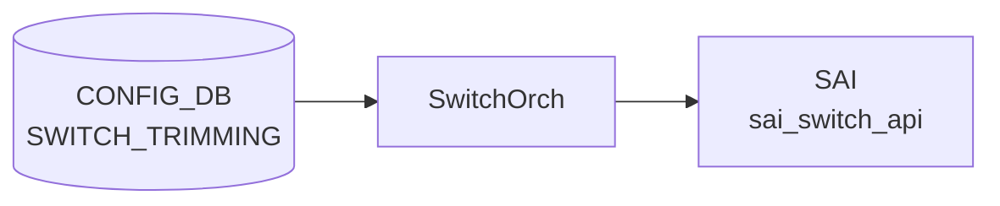

# SWITCH_TRIMMING テーブル

## 概要

輻輳テレメトリ向けの **パケットトリミング (packet trimming)** を全スイッチに対して設定するテーブル[^1]。
ドロップ予定のパケットを「短縮コピー」して別の [DSCP](../../reference/glossary.md#term-dscp) / TC / queue で送り出すことで、輻輳発生を末端まで伝える。

<!-- cdb-mermaid -->
### データフロー (自動生成)



!!! note "凡例"
    CONFIG_DB から SAI までの典型経路を `docs/reference/config-db-orch-map.md` から機械生成したミニ図。詳細・例外は本ページ本文と対応表を参照。
<!-- /cdb-mermaid -->

## key 構造

```text
SWITCH_TRIMMING|GLOBAL
```

シングルトン。

## フィールド

| フィールド | 型 | 説明 |
|-----------|----|------|
| `size` | uint32 | トリミング後のパケットサイズ [bytes] |
| `dscp_value` | uint8 (0..63) または `from-tc` | トリミング後パケットに付ける [DSCP](../../reference/glossary.md#term-dscp)。`from-tc` で `tc_value` から DSCP_TO_TC マッピング逆引きで導出 |
| `tc_value`  | uint8 | トリミング後パケットに付ける Traffic Class |
| `queue_index` | uint8 または `dynamic` | トリミング後パケットの送信キュー。`dynamic` で `dscp_value` から導出 |

`dscp_value=from-tc` と `queue_index=dynamic` の組み合わせは矛盾するので、どちらか一方だけを使う想定。

## 購読者

- `orchagent` (SwitchOrch trimming 拡張)。[SAI](../../reference/glossary.md#term-sai) の switch-level trimming 属性に push

## 関連 YANG

- `sonic-trimming`

<!-- ref-triangle:start -->

## 関連リファレンス

- [YANG](../../reference/glossary.md#term-yang): [`sonic-trimming`](../yang/sonic-trimming.md)

<!-- ref-triangle:end -->

## 引用元

[^1]: [YANG](../../reference/glossary.md#term-yang) 定義: `sonic-trimming.yang`. <https://github.com/sonic-net/sonic-buildimage/blob/9ea932ec2e18f35e58268ec2e4456b1d4afd65cd/src/sonic-yang-models/yang-models/sonic-trimming.yang>

## 関連ページ
- [CONFIG_DB index](index.md)

<!-- value-behavior -->
## 値依存挙動マトリクス

`dscp_value` と `queue_index` は enum ではなく union 型（数値 + 固定文字列）。

| フィールド | 値 | 挙動 |
|-----------|-----|-----|
| `dscp_value` | `from-tc` | `tc_value` を使い DSCP マッピング逆引きで DSCP を導出。`tc_value` 必須 |
| `dscp_value` | `0`..`63` (数値) | 指定値をトリミング後パケットの DSCP に直接設定 |
| `queue_index` | `dynamic` | `dscp_value` からキューを導出 |
| `queue_index` | `0`..`255` (数値) | 指定インデックスのキューへ送出 |
| `dscp_value=from-tc` + `queue_index=dynamic` | 組み合わせ | 導出元が循環し得るため非推奨（[YANG](../../reference/glossary.md#term-yang) は禁止しない） |
| 任意フィールド | DEL | 拒否 (`operation is not supported`) |

<!-- /value-behavior -->

<!-- cdb-exceptions -->
## 例外条件・特殊挙動

<!-- evidence: sonic-swss/orchagent/switchorch.cpp@4305596156d70e9797e8a881b3d19b46de0bce0d L1093-1359 -->

- **フィールド削除不可**: `size`・`dscp.mode` はいずれも DEL 操作をサポートしない。削除を試みると `"Failed to remove switch trimming size/DSCP configuration: operation is not supported"` を LOG_ERROR して `return false`。
- **ASIC capability 未サポート**: DSCP mode / queue_index の capability チェック失敗時、`"Failed to validate switch trimming DSCP mode/queue index: capability is not supported"` を LOG_ERROR して SET を拒否する。
- **[SAI](../../reference/glossary.md#term-sai) set 失敗**: SAI API 呼び出し失敗時は対応するエラーを LOG_ERROR して `return false`。
- **ASIC/[CONFIG_DB](../../reference/glossary.md#term-config_db) 乖離**: 初期化時に ASIC 側と [CONFIG_DB](../../reference/glossary.md#term-config_db) 側の値が食い違っていると SET/DEL どちらの操作も `"Failed to set/remove switch trimming: ASIC and CONFIG DB are diverged"` を LOG_ERROR して拒否。
- **空キー**: key が空文字列だと `"Failed to parse switch trimming key: empty string"` を LOG_ERROR してエントリをスキップする。

<!-- /cdb-exceptions -->

<!-- ops-hint -->
## 運用ヒント

### 典型値

- key: `SWITCH_TRIMMING|GLOBAL` (シングルトン)。
- `size`: 128〜256 bytes 程度。`dscp_value`: `from-tc` または明示 [DSCP](../../reference/glossary.md#term-dscp)。
- `queue_index`: `dynamic` または特定 queue。

### よくある誤設定

- `dscp_value=from-tc` と `queue_index=dynamic` を同時指定して導出元が曖昧になる。
- packet trimming 非対応 ASIC に投入して [SAI](../../reference/glossary.md#term-sai) でエラーになる。

### 確認コマンド

```bash
sonic-db-cli CONFIG_DB hgetall 'SWITCH_TRIMMING|GLOBAL'
show switch-trimming
```
<!-- /ops-hint -->


<!-- derivation -->
## 派生・条件付き登録 (Phase 6/7)

### Phase 6: 自動派生

SwitchOrch が `dscp_value` フィールドの有無から SAI DSCP resolution mode を自動決定する。`dscp_value` あり → `SAI_PACKET_TRIM_DSCP_RESOLUTION_MODE_ASSIGN`、なし → `SAI_PACKET_TRIM_DSCP_RESOLUTION_MODE_PRESERVE`。`queue` フィールドの有無も同様に SAI queue resolution mode を自動決定する。

### Phase 7: 条件付き登録 (add_manager 条件)

SwitchOrch は常時登録し `SWITCH_TRIMMING` テーブルを無条件購読する。`SWITCH_TRIMMING|GLOBAL` エントリのみ有効（シングルトン制約）。SAI trim capability 未サポートの場合はログのみで継続。

<!-- /derivation -->

<!-- handler-branching -->
### Phase 8: Handler メソッド内分岐

| Handler | 分岐条件 | 効果 | evidence |
|---|---|---|---|
| `SwitchOrch` | `size` フィールドあり | `SAI_SWITCH_ATTR_PACKET_TRIM_SIZE` 設定 | `switchorch.cpp` |
| `SwitchOrch` | `dscp_value` フィールドあり | ASSIGN モード + 指定 DSCP 値を SAI に設定 | `switchorch.cpp` |
| `SwitchOrch` | `dscp_value` フィールドなし | PRESERVE モード (元パケットの DSCP を保持) | `switchorch.cpp` |
| `SwitchOrch` | `queue` フィールドあり | STATIC モード + 指定キュー番号を SAI に設定 | `switchorch.cpp` |
| `SwitchOrch` | del_handler | SAI trim 設定を解除 | `switchorch.cpp` |

> **スキャン証跡**: `SWITCH_TRIMMING` はパケットトリミング機能の設定。`dscp_value` / `queue` の有無が SAI resolution mode を自動決定する点が主要 Phase 6 派生。

<!-- /handler-branching -->

<!-- runtime-trace -->
## CDB → 実コンテナ動作トレース

### 段階 1: Consumer 登録

- **orchagent / SwitchOrch**: `SWITCH_TRIMMING` テーブルを `SubscriberStateTable` で購読。

### 段階 2: CFG → APPL 翻訳

- SwitchOrch がパケットトリミング設定 (最大パケットサイズ等) を解析。APP_DB への書き込みなし。

### 段階 3: APPL → SAI

- SwitchOrch が `sai_switch_api->set_switch_attribute()` でトリミング関連属性を設定。

### 段階 4: タイミング + 副作用

- 設定は即時有効。以降のパケットから新しいトリミングサイズが適用。
- 副作用: パケットトリミングにより Jumbo Frame が切り詰められ、受信側でデータが欠損する可能性。

<!-- /runtime-trace -->
<!-- entry-points -->
## 書き込み入り口 (Direction A)

SWITCH_TRIMMING テーブルへの書き込みが発生するコード経路を網羅的に調査した結果。

### CLI

  - `config switch-trimming ...` — `config/plugins/sonic-trimming.py` が `set_entry('SWITCH_TRIMMING', ...)` を呼ぶ (sonic-utilities/config/plugins/sonic-trimming.py)

### minigraph / sonic-cfggen

minigraph.py に SWITCH_TRIMMING 生成なし

### REST / gNMI

REST/gNMI 書き込み経路なし

### db_migrator

db_migrator.py での SWITCH_TRIMMING マイグレーションなし

### ビルド時デフォルト (build-time default)

なし

### ハードコードデフォルト / ランタイム注入

なし

### 死活・デッドコード

なし
<!-- /entry-points -->

<!-- constants -->
## ハードコード定数 (Phase E)

<!-- evidence: meta/_intermediate/cdb-flow/switch-trimming-constants.md -->
<!-- source: sonic-swss/orchagent/switch/trimming/schema.h, helper.cpp L25-26, capabilities.cpp L32-41 -->

`SWITCH_TRIMMING` 処理に関わるハードコード定数の一覧。CONFIG_DB / YANG では管理されず、C++ ソース内でのみ定義される。

### フィールドキー定数 (`schema.h`)

CONFIG_DB フィールド名文字列および `dscp_value` / `queue_index` の特殊値文字列を `schema.h` が一元管理する。

| マクロ名 | 値 | 用途 |
|---|---|---|
| `SWITCH_TRIMMING_SIZE` | `"size"` | パケットトリミング後サイズフィールド名 |
| `SWITCH_TRIMMING_DSCP_VALUE` | `"dscp_value"` | DSCP 値フィールド名 |
| `SWITCH_TRIMMING_TC_VALUE` | `"tc_value"` | Traffic Class フィールド名 |
| `SWITCH_TRIMMING_QUEUE_INDEX` | `"queue_index"` | 送信キューインデックスフィールド名 |
| `SWITCH_TRIMMING_DSCP_VALUE_FROM_TC` | `"from-tc"` | `dscp_value` の特殊値。TC から DSCP を逆引きする (`SAI_PACKET_TRIM_DSCP_RESOLUTION_MODE_FROM_TC`) |
| `SWITCH_TRIMMING_QUEUE_INDEX_DYNAMIC` | `"dynamic"` | `queue_index` の特殊値。`dscp_value` からキューを動的に導出する (`SAI_PACKET_TRIM_QUEUE_RESOLUTION_MODE_DYNAMIC`) |

### モード文字列定数 (STATE_DB capability 書き込み用)

`writeCapabilitiesToDb()` が `STATE_DB:SWITCH_CAPABILITY|switch` に書き込む capability 値の文字列定数。

| マクロ名 | 値 | SAI enum |
|---|---|---|
| `SWITCH_TRIMMING_DSCP_MODE_DSCP_VALUE` | `"DSCP_VALUE"` | `SAI_PACKET_TRIM_DSCP_RESOLUTION_MODE_DSCP_VALUE` |
| `SWITCH_TRIMMING_DSCP_MODE_FROM_TC` | `"FROM_TC"` | `SAI_PACKET_TRIM_DSCP_RESOLUTION_MODE_FROM_TC` |
| `SWITCH_TRIMMING_QUEUE_MODE_STATIC` | `"STATIC"` | `SAI_PACKET_TRIM_QUEUE_RESOLUTION_MODE_STATIC` |
| `SWITCH_TRIMMING_QUEUE_MODE_DYNAMIC` | `"DYNAMIC"` | `SAI_PACKET_TRIM_QUEUE_RESOLUTION_MODE_DYNAMIC` |

### 数値範囲定数 (`helper.cpp`)

| 定数名 | 値 | 用途 |
|---|---|---|
| `minDscp` | `0` | `dscp_value` に許容する最小 DSCP 値 (helper.cpp L25) |
| `maxDscp` | `63` | `dscp_value` に許容する最大 DSCP 値 (helper.cpp L26) |

範囲外の `dscp_value`（数値が 63 超）は `helper.cpp` のバリデーション失敗 → `LOG_ERROR` + エントリ破棄。

### STATE_DB キー・フィールド名定数 (`capabilities.cpp`)

| マクロ名 | 値 |
|---|---|
| `CAPABILITY_KEY` | `"switch"` (STATE_DB の行キー固定値) |
| `CAPABILITY_SWITCH_TRIMMING_CAPABLE_FIELD` | `"SWITCH_TRIMMING_CAPABLE"` |
| `CAPABILITY_SWITCH_DSCP_RESOLUTION_MODE_FIELD` | `"SWITCH\|PACKET_TRIMMING_DSCP_RESOLUTION_MODE"` |
| `CAPABILITY_SWITCH_QUEUE_RESOLUTION_MODE_FIELD` | `"SWITCH\|PACKET_TRIMMING_QUEUE_RESOLUTION_MODE"` |
| `CAPABILITY_SWITCH_NUMBER_OF_TRAFFIC_CLASSES_FIELD` | `"SWITCH\|NUMBER_OF_TRAFFIC_CLASSES"` |
| `CAPABILITY_SWITCH_NUMBER_OF_UNICAST_QUEUES_FIELD` | `"SWITCH\|NUMBER_OF_UNICAST_QUEUES"` |
| `SWITCH_STATE_DB_NAME` | `"STATE_DB"` |
| `SWITCH_STATE_DB_TIMEOUT` | `0` (ブロッキングなし) |

!!! note "大文字小文字の正規化"
    `dscp_value` の `"from-tc"` は `boost::algorithm::to_lower_copy` で正規化されるため `"FROM-TC"` / `"From-Tc"` も受理される（`helper.cpp`）。`queue_index` の `"dynamic"` も同様に大文字小文字を問わない。

<!-- /constants -->

<!-- glossary-links-injected: ff319d2bdac9 -->
