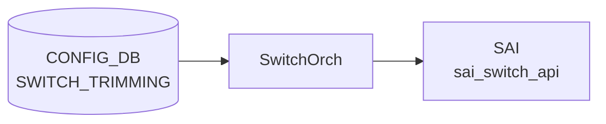

# SWITCH_TRIMMING テーブル

## 概要

輻輳テレメトリ向けの **パケットトリミング (packet trimming)** を全スイッチに対して設定するテーブル[^1]。
ドロップ予定のパケットを「短縮コピー」して別の [DSCP](../../reference/glossary.md#term-dscp) / TC / queue で送り出すことで、輻輳発生を末端まで伝える。

<!-- cdb-mermaid -->
### データフロー (自動生成)



!!! note "凡例"
    CONFIG_DB から SAI までの典型経路を `docs/reference/config-db-orch-map.md` から機械生成したミニ図。詳細・例外は本ページ本文と対応表を参照。
<!-- /cdb-mermaid -->

## key 構造

```text
SWITCH_TRIMMING|GLOBAL
```

シングルトン。

## フィールド

| フィールド | 型 | 説明 |
|-----------|----|------|
| `size` | uint32 | トリミング後のパケットサイズ [bytes] |
| `dscp_value` | uint8 (0..63) または `from-tc` | トリミング後パケットに付ける [DSCP](../../reference/glossary.md#term-dscp)。`from-tc` で `tc_value` から DSCP_TO_TC マッピング逆引きで導出 |
| `tc_value`  | uint8 | トリミング後パケットに付ける Traffic Class |
| `queue_index` | uint8 または `dynamic` | トリミング後パケットの送信キュー。`dynamic` で `dscp_value` から導出 |

`dscp_value=from-tc` と `queue_index=dynamic` の組み合わせは矛盾するので、どちらか一方だけを使う想定。

## 購読者

- `orchagent` (SwitchOrch trimming 拡張)。[SAI](../../reference/glossary.md#term-sai) の switch-level trimming 属性に push

## 関連 YANG

- `sonic-trimming`

<!-- ref-triangle:start -->

## 関連リファレンス

- [YANG](../../reference/glossary.md#term-yang): [`sonic-trimming`](../yang/sonic-trimming.md)

<!-- ref-triangle:end -->

## 引用元

[^1]: [YANG](../../reference/glossary.md#term-yang) 定義: `sonic-trimming.yang`. <https://github.com/sonic-net/sonic-buildimage/blob/9ea932ec2e18f35e58268ec2e4456b1d4afd65cd/src/sonic-yang-models/yang-models/sonic-trimming.yang>

## 関連ページ
- [CONFIG_DB index](index.md)

<!-- value-behavior -->
## 値依存挙動マトリクス

`dscp_value` と `queue_index` は enum ではなく union 型（数値 + 固定文字列）。

| フィールド | 値 | 挙動 |
|-----------|-----|-----|
| `dscp_value` | `from-tc` | `tc_value` を使い DSCP マッピング逆引きで DSCP を導出。`tc_value` 必須 |
| `dscp_value` | `0`..`63` (数値) | 指定値をトリミング後パケットの DSCP に直接設定 |
| `queue_index` | `dynamic` | `dscp_value` からキューを導出 |
| `queue_index` | `0`..`255` (数値) | 指定インデックスのキューへ送出 |
| `dscp_value=from-tc` + `queue_index=dynamic` | 組み合わせ | 導出元が循環し得るため非推奨（[YANG](../../reference/glossary.md#term-yang) は禁止しない） |
| 任意フィールド | DEL | 拒否 (`operation is not supported`) |

<!-- /value-behavior -->

<!-- cdb-exceptions -->
## 例外条件・特殊挙動

<!-- evidence: sonic-swss/orchagent/switchorch.cpp@4305596156d70e9797e8a881b3d19b46de0bce0d L1093-1359 -->

- **フィールド削除不可**: `size`・`dscp.mode` はいずれも DEL 操作をサポートしない。削除を試みると `"Failed to remove switch trimming size/DSCP configuration: operation is not supported"` を LOG_ERROR して `return false`。
- **ASIC capability 未サポート**: DSCP mode / queue_index の capability チェック失敗時、`"Failed to validate switch trimming DSCP mode/queue index: capability is not supported"` を LOG_ERROR して SET を拒否する。
- **[SAI](../../reference/glossary.md#term-sai) set 失敗**: SAI API 呼び出し失敗時は対応するエラーを LOG_ERROR して `return false`。
- **ASIC/[CONFIG_DB](../../reference/glossary.md#term-config_db) 乖離**: 初期化時に ASIC 側と [CONFIG_DB](../../reference/glossary.md#term-config_db) 側の値が食い違っていると SET/DEL どちらの操作も `"Failed to set/remove switch trimming: ASIC and CONFIG DB are diverged"` を LOG_ERROR して拒否。
- **空キー**: key が空文字列だと `"Failed to parse switch trimming key: empty string"` を LOG_ERROR してエントリをスキップする。

<!-- /cdb-exceptions -->

<!-- ops-hint -->
## 運用ヒント

### 典型値

- key: `SWITCH_TRIMMING|GLOBAL` (シングルトン)。
- `size`: 128〜256 bytes 程度。`dscp_value`: `from-tc` または明示 [DSCP](../../reference/glossary.md#term-dscp)。
- `queue_index`: `dynamic` または特定 queue。

### よくある誤設定

- `dscp_value=from-tc` と `queue_index=dynamic` を同時指定して導出元が曖昧になる。
- packet trimming 非対応 ASIC に投入して [SAI](../../reference/glossary.md#term-sai) でエラーになる。

### 確認コマンド

```bash
sonic-db-cli CONFIG_DB hgetall 'SWITCH_TRIMMING|GLOBAL'
show switch-trimming
```
<!-- /ops-hint -->

<!-- glossary-links-injected: ff319d2bdac9 -->
