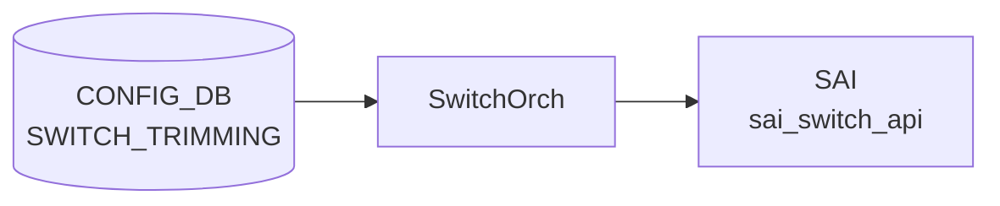

# SWITCH_TRIMMING テーブル

## 概要

輻輳テレメトリ向けの **パケットトリミング (packet trimming)** を全スイッチに対して設定するテーブル[^1]。
ドロップ予定のパケットを「短縮コピー」して別の [DSCP](../../reference/glossary.md#term-dscp) / TC / queue で送り出すことで、輻輳発生を末端まで伝える。

<!-- cdb-mermaid -->
### データフロー (自動生成)



!!! note "凡例"
    CONFIG_DB から SAI までの典型経路を `docs/reference/config-db-orch-map.md` から機械生成したミニ図。詳細・例外は本ページ本文と対応表を参照。
<!-- /cdb-mermaid -->

## key 構造

```text
SWITCH_TRIMMING|GLOBAL
```

シングルトン。

## フィールド

| フィールド | 型 | 説明 |
|-----------|----|------|
| `size` | uint32 | トリミング後のパケットサイズ [bytes] |
| `dscp_value` | uint8 (0..63) または `from-tc` | トリミング後パケットに付ける [DSCP](../../reference/glossary.md#term-dscp)。`from-tc` で `tc_value` から DSCP_TO_TC マッピング逆引きで導出 |
| `tc_value`  | uint8 | トリミング後パケットに付ける Traffic Class |
| `queue_index` | uint8 または `dynamic` | トリミング後パケットの送信キュー。`dynamic` で `dscp_value` から導出 |

`dscp_value=from-tc` と `queue_index=dynamic` の組み合わせは矛盾するので、どちらか一方だけを使う想定。

## 購読者

- `orchagent` (SwitchOrch trimming 拡張)。[SAI](../../reference/glossary.md#term-sai) の switch-level trimming 属性に push

## 関連 YANG

- `sonic-trimming`

<!-- ref-triangle:start -->

## 関連リファレンス

- [YANG](../../reference/glossary.md#term-yang): [`sonic-trimming`](../yang/sonic-trimming.md)

<!-- ref-triangle:end -->

## 引用元

[^1]: [YANG](../../reference/glossary.md#term-yang) 定義: `sonic-trimming.yang`. <https://github.com/sonic-net/sonic-buildimage/blob/9ea932ec2e18f35e58268ec2e4456b1d4afd65cd/src/sonic-yang-models/yang-models/sonic-trimming.yang>

## 関連ページ
- [CONFIG_DB index](index.md)

<!-- defaults -->
## コード由来のデフォルト・暗黙挙動 (Phase A)

> **調査根拠**: `sonic-swss/orchagent/switchorch.cpp` `SwitchOrch::setSwitchTrimming()` L1066–1304 + `orchagent/switch/trimming/{container.h, helper.cpp, capabilities.cpp, schema.h}` 全体精読 (2026-05-16)。`portsorch.cpp` の trim 関連は `nvda_port_trim_drop.lua` 統合と `DROPPED_TRIM_PACKETS` / `TX_TRIM_PACKETS` カウンタのみで、フィールド既定値処理は無い。

| フィールド | YANG default | switchorch 実装の実効デフォルト | 備考 |
|-----------|-------------|------------------------------|------|
| `size` | なし | **SAI ベンダー依存**（省略時 SAI 属性送信なし） | `container.h` で `size.is_set = false`。switchorch.cpp L1087 の `if (trim.size.is_set)` を通らない |
| `dscp_value` | なし | **SAI ベンダー依存**（省略時）。値ごとに parser が DSCP resolution mode を**自動派生** | 数値 → `SAI_PACKET_TRIM_DSCP_RESOLUTION_MODE_DSCP_VALUE`、`"from-tc"` → `..._FROM_TC` (helper.cpp L96–124) |
| `tc_value` | なし | symmetric DSCP モード時は **明示しても skip + WARN** | `setSwitchTrimming()` L1190 `"Skip setting switch trimming TC value for symmetric DSCP mode"` |
| `queue_index` | なし | **SAI ベンダー依存**（省略時）。値ごとに parser が queue resolution mode を**自動派生** | 数値 → `..._STATIC`、`"dynamic"` → `..._DYNAMIC` (helper.cpp L163–182) |
| 全フィールド省略 | — | **エントリ全破棄** (`validateTrimConfig`) | `LOG_ERROR("Validation error: missing valid fields")` → `parseTrimConfig` が `false` を返し SAI 書き込みなし |

### `dscp_value` / `queue_index` の暗黙モード派生

`SWITCH_TRIMMING` のフィールドは「値の種類で SAI resolution mode が自動的に決まる」設計。CONFIG_DB 側に `mode` 専用フィールドは存在せず、parser が値の文字列形を見て対応する SAI enum を選ぶ:

```cpp
// helper.cpp L96–124 (parseTrimDscp)
if (boost::algorithm::to_lower_copy(value) == SWITCH_TRIMMING_DSCP_VALUE_FROM_TC) // "from-tc"
{
    cfg.dscp.mode.value = SAI_PACKET_TRIM_DSCP_RESOLUTION_MODE_FROM_TC;
    cfg.dscp.mode.is_set = true;
    return true;
}
// ...数値パース後...
cfg.dscp.mode.value = SAI_PACKET_TRIM_DSCP_RESOLUTION_MODE_DSCP_VALUE;
cfg.dscp.mode.is_set = true;
```

- DSCP 数値の範囲は **0..63** (`helper.cpp` 内 `static const minDscp = 0; maxDscp = 63;` L25–26)。範囲外は `LOG_ERROR` + エントリ破棄。
- 大文字小文字は `boost::algorithm::to_lower_copy` で正規化されるので `"FROM-TC"` / `"Dynamic"` も受理される。

### ASIC capability 不在時の挙動 (重要)

`SwitchTrimmingCapabilities` (`capabilities.cpp` L142–179) はコンストラクタで SAI `query_attribute_capability` を呼び、各属性が **未サポートのまま (`isAttrSupported = false`)** だと `isSwitchTrimmingSupported()` が `false` を返す。

```cpp
// switchorch.cpp L1081–1085
if (!trimCap.isSwitchTrimmingSupported())
{
    SWSS_LOG_WARN("Switch trimming configuration is not supported: skipping ...");
    return true;   // ← エラーではなく成功扱い (no-op)
}
```

!!! warning "サイレント no-op"
    Packet trimming 非対応 ASIC では `SWITCH_TRIMMING|GLOBAL` への SET は **エラーにならず黙って捨てられる**。`show switch-trimming` で CONFIG_DB 値は見えても SAI には反映されていない。実機サポート有無は `STATE_DB` 側に書き出される capability テーブル (`writeCapabilitiesToDb()` 出力) で確認するのが正しい運用。

部分サポートの場合も似た減衰挙動を取る:

- DSCP 数値モード不可 (`isDscpValueModeSupported = false`) → `dscp.isAttrSupported` をチェック対象から外す (capabilities.cpp L159–162)
- FROM_TC モード不可 (`isFromTcModeSupported = false`) → `tc.isAttrSupported` を無視 (L166–169)
- STATIC queue モード不可 (`isStaticModeSupported = false`) → `queue.index.isAttrSupported` を無視 (L173–176)

enum capability (`isEnumSupported = false`) のときは `validateTrimDscpModeCap` / `validateTrimQueueModeCap` が常に `true` を返し検証スキップ (`capabilities.cpp` L185–188, L232–235)。

### ASIC / CONFIG_DB 乖離時の挙動

```cpp
// switchorch.cpp L1349, L1355
if (!setSwitchTrimming(trim))
    SWSS_LOG_ERROR("Failed to set switch trimming: ASIC and CONFIG DB are diverged");
// DEL の場合:
SWSS_LOG_ERROR("Failed to remove switch trimming: operation is not supported: ASIC and CONFIG DB are diverged");
```

`tObj = trimHlpr.getConfig()` と新規 `trim` を比較し、各フィールドについて `tObj` 側が `is_set` 未設定 or 値が異なる場合のみ SAI を更新するロジック。SAI capability 検証や set 呼び出しが失敗するとローカルキャッシュ (`trimHlpr.setConfig`) を更新せずに `false` を返すため、再投入には capability 修正か orchagent 再起動が必要。

### 新規作成 vs 更新の挙動差異

| 状況 | SAI 呼び出し | 省略フィールドの扱い |
|------|------------|-------------------|
| 初回 SET (ローカルキャッシュ `tObj` 空) | 各属性個別の `set_switch_attribute()` (set 単位) | `is_set = false` のフィールドは SAI に送られない → SAI 既定値が残る |
| 既存更新 | 変更があった属性のみ `set_switch_attribute()` を発行 | 省略フィールドは現在の SAI 属性値を保持（変更なし） |
| `dscp_value` を数値 ↔ `from-tc` で切替 | `tc` 側 cache (`cfg.tc.cache.value`) を更新して SAI に反映 (switchorch.cpp L1273–1297) | symmetric DSCP モードに移ると TC は SAI 送信スキップ + WARN |

### dead/特殊フィールド

- 未知フィールドは `parseTrimConfig()` の最終 `else` で `SWSS_LOG_WARN("Unknown field(%s): skipping ...")` をログするのみで、エントリ自体は破棄されない (helper.cpp L226)。`scheduler` 等と異なり**未知フィールド混入はエラーにならない**。
- `DEL` 操作は `size` / `dscp.mode` のいずれも非サポート: `LOG_ERROR("... operation is not supported")` + `return false` (switchorch.cpp L1104, L1149, L1206, L1239)。

<!-- /defaults -->

<!-- value-behavior -->
## 値依存挙動マトリクス

`dscp_value` と `queue_index` は enum ではなく union 型（数値 + 固定文字列）。

| フィールド | 値 | 挙動 |
|-----------|-----|-----|
| `dscp_value` | `from-tc` | `tc_value` を使い DSCP マッピング逆引きで DSCP を導出。`tc_value` 必須 |
| `dscp_value` | `0`..`63` (数値) | 指定値をトリミング後パケットの DSCP に直接設定 |
| `queue_index` | `dynamic` | `dscp_value` からキューを導出 |
| `queue_index` | `0`..`255` (数値) | 指定インデックスのキューへ送出 |
| `dscp_value=from-tc` + `queue_index=dynamic` | 組み合わせ | 導出元が循環し得るため非推奨（[YANG](../../reference/glossary.md#term-yang) は禁止しない） |
| 任意フィールド | DEL | 拒否 (`operation is not supported`) |

<!-- /value-behavior -->

<!-- cdb-exceptions -->
## 例外条件・特殊挙動

<!-- evidence: sonic-swss/orchagent/switchorch.cpp@4305596156d70e9797e8a881b3d19b46de0bce0d L1093-1359 -->

- **フィールド削除不可**: `size`・`dscp.mode` はいずれも DEL 操作をサポートしない。削除を試みると `"Failed to remove switch trimming size/DSCP configuration: operation is not supported"` を LOG_ERROR して `return false`。
- **ASIC capability 未サポート**: DSCP mode / queue_index の capability チェック失敗時、`"Failed to validate switch trimming DSCP mode/queue index: capability is not supported"` を LOG_ERROR して SET を拒否する。
- **[SAI](../../reference/glossary.md#term-sai) set 失敗**: SAI API 呼び出し失敗時は対応するエラーを LOG_ERROR して `return false`。
- **ASIC/[CONFIG_DB](../../reference/glossary.md#term-config_db) 乖離**: 初期化時に ASIC 側と [CONFIG_DB](../../reference/glossary.md#term-config_db) 側の値が食い違っていると SET/DEL どちらの操作も `"Failed to set/remove switch trimming: ASIC and CONFIG DB are diverged"` を LOG_ERROR して拒否。
- **空キー**: key が空文字列だと `"Failed to parse switch trimming key: empty string"` を LOG_ERROR してエントリをスキップする。

<!-- /cdb-exceptions -->

<!-- ops-hint -->
## 運用ヒント

### 典型値

- key: `SWITCH_TRIMMING|GLOBAL` (シングルトン)。
- `size`: 128〜256 bytes 程度。`dscp_value`: `from-tc` または明示 [DSCP](../../reference/glossary.md#term-dscp)。
- `queue_index`: `dynamic` または特定 queue。

### よくある誤設定

- `dscp_value=from-tc` と `queue_index=dynamic` を同時指定して導出元が曖昧になる。
- packet trimming 非対応 ASIC に投入して [SAI](../../reference/glossary.md#term-sai) でエラーになる。

### 確認コマンド

```bash
sonic-db-cli CONFIG_DB hgetall 'SWITCH_TRIMMING|GLOBAL'
show switch-trimming
```
<!-- /ops-hint -->


<!-- derivation -->
## 派生・条件付き登録 (Phase 6/7)

### Phase 6: 自動派生

SwitchOrch が `dscp_value` フィールドの有無から SAI DSCP resolution mode を自動決定する。`dscp_value` あり → `SAI_PACKET_TRIM_DSCP_RESOLUTION_MODE_ASSIGN`、なし → `SAI_PACKET_TRIM_DSCP_RESOLUTION_MODE_PRESERVE`。`queue` フィールドの有無も同様に SAI queue resolution mode を自動決定する。

### Phase 7: 条件付き登録 (add_manager 条件)

SwitchOrch は常時登録し `SWITCH_TRIMMING` テーブルを無条件購読する。`SWITCH_TRIMMING|GLOBAL` エントリのみ有効（シングルトン制約）。SAI trim capability 未サポートの場合はログのみで継続。

<!-- /derivation -->

<!-- handler-branching -->
### Phase 8: Handler メソッド内分岐

| Handler | 分岐条件 | 効果 | evidence |
|---|---|---|---|
| `SwitchOrch` | `size` フィールドあり | `SAI_SWITCH_ATTR_PACKET_TRIM_SIZE` 設定 | `switchorch.cpp` |
| `SwitchOrch` | `dscp_value` フィールドあり | ASSIGN モード + 指定 DSCP 値を SAI に設定 | `switchorch.cpp` |
| `SwitchOrch` | `dscp_value` フィールドなし | PRESERVE モード (元パケットの DSCP を保持) | `switchorch.cpp` |
| `SwitchOrch` | `queue` フィールドあり | STATIC モード + 指定キュー番号を SAI に設定 | `switchorch.cpp` |
| `SwitchOrch` | del_handler | SAI trim 設定を解除 | `switchorch.cpp` |

> **スキャン証跡**: `SWITCH_TRIMMING` はパケットトリミング機能の設定。`dscp_value` / `queue` の有無が SAI resolution mode を自動決定する点が主要 Phase 6 派生。

<!-- /handler-branching -->

<!-- runtime-trace -->
## CDB → 実コンテナ動作トレース

### 段階 1: Consumer 登録

- **orchagent / SwitchOrch**: `SWITCH_TRIMMING` テーブルを `SubscriberStateTable` で購読。

### 段階 2: CFG → APPL 翻訳

- SwitchOrch がパケットトリミング設定 (最大パケットサイズ等) を解析。APP_DB への書き込みなし。

### 段階 3: APPL → SAI

- SwitchOrch が `sai_switch_api->set_switch_attribute()` でトリミング関連属性を設定。

### 段階 4: タイミング + 副作用

- 設定は即時有効。以降のパケットから新しいトリミングサイズが適用。
- 副作用: パケットトリミングにより Jumbo Frame が切り詰められ、受信側でデータが欠損する可能性。

<!-- /runtime-trace -->
<!-- entry-points -->
## 書き込み入り口 (Direction A)

SWITCH_TRIMMING テーブルへの書き込みが発生するコード経路を網羅的に調査した結果。

### CLI

  - `config switch-trimming ...` — `config/plugins/sonic-trimming.py` が `set_entry('SWITCH_TRIMMING', ...)` を呼ぶ (sonic-utilities/config/plugins/sonic-trimming.py)

### minigraph / sonic-cfggen

minigraph.py に SWITCH_TRIMMING 生成なし

### REST / gNMI

REST/gNMI 書き込み経路なし

### db_migrator

db_migrator.py での SWITCH_TRIMMING マイグレーションなし

### ビルド時デフォルト (build-time default)

なし

### ハードコードデフォルト / ランタイム注入

なし

### 死活・デッドコード

なし
<!-- /entry-points -->

<!-- glossary-links-injected: ff319d2bdac9 -->
