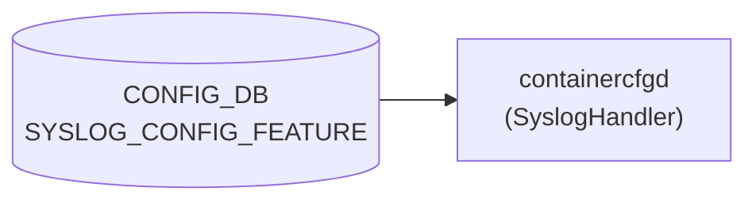

# SYSLOG_CONFIG_FEATURE テーブル

## 概要

`SYSLOG_CONFIG.GLOBAL` の rate-limit を `FEATURE` (docker) ごとに上書きするテーブル[^1]。`containercfgd` (`SyslogHandler`) が読み出し、対象 docker のコンテナ内 rsyslog 設定 (例 `/etc/rsyslog.d/`) を再生成する。`hostcfgd` は本テーブルを購読しない（Phase G 参照）。

<!-- cdb-mermaid -->
### データフロー (自動生成)



!!! note "凡例"
    CONFIG_DB から SAI までの典型経路を `docs/reference/config-db-orch-map.md` から機械生成したミニ図。詳細・例外は本ページ本文と対応表を参照。
<!-- /cdb-mermaid -->

## key 構造

```text
SYSLOG_CONFIG_FEATURE|<service>
```

`<service>` は `FEATURE.name` への leafref (`/feature:sonic-feature/feature:FEATURE/feature:FEATURE_LIST/feature:name`)[^1]。

## フィールド

| フィールド | 型 | デフォルト | 説明 |
|-----------|----|-----------|------|
| `rate_limit_interval` | uint32 (0..2147483647 秒) | なし | サービスごとの rate-limit インターバル |
| `rate_limit_burst` | uint32 (0..2147483647 件) | なし | サービスごとの最大バースト件数 |

`SYSLOG_CONFIG` と異なり、`format`/`severity` 等は持たない (rate-limit 専用テーブル)。

<!-- defaults -->
## フィールド暗黙デフォルト (Phase A — コード由来)

YANG `default` 文を持たないフィールドについて、`containercfgd` (`sonic-buildimage/src/sonic-containercfgd/containercfgd/containercfgd.py`) が実行時に与える暗黙デフォルト[^defaults-cfgd]。

| フィールド | コード由来デフォルト | fallback 源 |
|-----------|-------------------|------------|
| `rate_limit_interval` | `'0'` (rate-limit 機能オフ) | `containercfgd.py:143` `new_interval = '0' if not data else data.get(SYSLOG_RATE_LIMIT_INTERVAL, '0')` |
| `rate_limit_burst` | `'0'` (burst 上限 0) | `containercfgd.py:144` `new_burst = '0' if not data else data.get(SYSLOG_RATE_LIMIT_BURST, '0')` |
| `severity` | — (テーブルにフィールドなし) | 親 `SYSLOG_CONFIG.severity` (YANG default `notice`) を rsyslog レベルで継承 |

### 補足

- **`interval=0` は rate-limit オフ**: rsyslog 側の `$SystemLogRateLimitInterval 0` は rate-limit 機能を無効化する仕様。CONFIG_DB にエントリが無い場合は `data` が falsy となり `'0'` が選ばれるため、デフォルトでは **per-container rate-limit は無効** となる。
- **`burst=0` 単独設定は危険**: `interval` を未設定 (=`'0'`) のまま `burst` だけ非ゼロにしても rate-limit はオフ。逆に `interval > 0` で `burst` を省略すると `'0'` 適用 → 全ログがドロップされる。両フィールドはセットで設定すること。
- **起動時キャッシュ**: `SyslogHandler.__init__` は `/etc/rsyslog.conf` を `parse_syslog_conf()` で読んで `current_interval` / `current_burst` を初期化する (`containercfgd.py:163-184`)。conf に該当行が無い場合も `'0'` を採用するため、CONFIG_DB エントリ不在＋conf 行不在 でも `update_syslog_config()` は「変更なし」と判定し `rsyslogd` 再起動をスキップする (L146-148)。
- **`severity` はテーブル外**: 本テーブルは rate-limit 専用。container 単位の severity 上書きは存在せず、グローバル `SYSLOG_CONFIG.severity` (YANG `default notice`) がそのまま適用される。

[^defaults-cfgd]: `src/sonic-containercfgd/containercfgd/containercfgd.py` (`SyslogHandler.update_syslog_config`, L137-161). <https://github.com/sonic-net/sonic-buildimage/blob/9ea932ec2e18f35e58268ec2e4456b1d4afd65cd/src/sonic-containercfgd/containercfgd/containercfgd.py#L137-L161>

<!-- /defaults -->

## 制約

- key は `service` で `FEATURE_LIST.name` を leafref 参照 → 未登録の docker は設定不可
- list 名は `SYSLOG_CONFIG_FEATURE_LIST`

## 購読者

- `containercfgd` (`sonic-containercfgd` の `SyslogHandler`): [CONFIG_DB](../../reference/glossary.md#term-config_db) → 当該 docker コンテナ内の rsyslog 設定を再生成（`hostcfgd` は本テーブルを購読しない）

## 関連 CONFIG_DB / YANG / CLI

- 関連 [CONFIG_DB](../../reference/glossary.md#term-config_db): [`SYSLOG_CONFIG`](syslog-config.md), [`FEATURE`](feature.md)
- 関連 CLI: `config syslog rate-limit-container <service>`
- 関連 [YANG](../../reference/glossary.md#term-yang): `sonic-syslog`

<!-- ref-triangle:start -->

## 関連リファレンス

- [YANG](../../reference/glossary.md#term-yang): [`sonic-syslog`](../yang/sonic-syslog.md)
- CLI: [`config syslog`](../cli/config-syslog.md)

<!-- ref-triangle:end -->

## 引用元

[^1]: `src/sonic-yang-models/yang-models/sonic-syslog.yang` (container `SYSLOG_CONFIG_FEATURE` / list `SYSLOG_CONFIG_FEATURE_LIST`、leaf `service` の leafref). <https://github.com/sonic-net/sonic-buildimage/blob/9ea932ec2e18f35e58268ec2e4456b1d4afd65cd/src/sonic-yang-models/yang-models/sonic-syslog.yang>

## 関連ページ
- [CONFIG_DB: SYSLOG_CONFIG](syslog-config.md)
- [CONFIG_DB: FEATURE](feature.md)

<!-- ordering -->
## 書込み順依存 (Phase B)

`containercfgd` (`SyslogHandler`) は `ConfigDBConnector.connect(wait_for_init=True, retry_on=True)` で CONFIG DB 初期化完了を待ってから変更を受信する。CLI 経由の書き込みでは `FEATURE` テーブルの先行存在が強制される。

### 検出された順序依存

| # | 依存関係 | 方向 | 緩和策 |
|---|----------|------|--------|
| 1 | `FEATURE\|<service>` → `SYSLOG_CONFIG_FEATURE\|<service>` | **先行必須**（CLI が `service_validator` で FEATURE 未登録を拒否） | YANG leafref も同制約。事前に `FEATURE` テーブルへ登録すること |
| 2 | `SYSLOG_CONFIG\|GLOBAL` → `SYSLOG_CONFIG_FEATURE\|<service>` 適用 | 推奨先行（`sonic-cfggen` テンプレート展開時に参照） | 欠落時は rsyslog 組み込みデフォルトが使用される可能性あり |
| 3 | `containercfgd` 起動完了 → 変更反映 | 起動順序依存（`wait_for_init=True`） | DB 再接続まで変更は pending。コンテナ再起動後に `init_data_handler` が再適用 |

### 主要な制約詳細

**FEATURE 先行必須 (依存 #1)**: `config syslog rate-limit-container <service>` は `db.cfgdb.get_table(FEATURE_TABLE)` を呼び出し、`service_validator(features, service_name)` で存在チェックを行う。未登録の場合は `ClickException` を raise して書き込みをキャンセルする (`config/syslog.py:476-477`)。YANG `leafref` 制約も同様に未登録 service への書き込みを拒否する。

**SYSLOG_CONFIG|GLOBAL の影響 (依存 #2)**: `containercfgd` は `SYSLOG_CONFIG` テーブルを直接購読しない。テンプレート `rsyslog-container.conf.j2` を `sonic-cfggen -d` で展開する際、DB スナップショットから GLOBAL rate-limit 値が参照される。`SYSLOG_CONFIG|GLOBAL` が未設定の場合、テンプレートはフォールバック値（rsyslog 組み込みデフォルト）を使用するが、`containercfgd` 自体はエラーを返さない (`containercfgd.py:156`)。

<!-- evidence: sonic-utilities/config/syslog.py:476-477, containercfgd/containercfgd.py:48,121,133-135 -->
<!-- /ordering -->

<!-- cross-refs -->
## 暗黙参照 — Phase C (cross-table refs)

> **調査根拠**: `containercfgd.py`・`feature.py`・`rsyslog-container.conf.j2` 全行精読 (2026-05-17)
> 詳細証跡: `meta/_intermediate/cdb-flow/syslog-config-feature-cross-refs.md`

`SYSLOG_CONFIG_FEATURE` テーブルは実行時に以下のテーブルを暗黙参照する。

| 参照先 | DB | 参照方向 | YANG leafref | 実装上の必須度 | 証拠 |
|---|---|---|---|---|---|
| `FEATURE\|<service>` | CONFIG_DB | 読み取り (leafref + CLI バリデーション) | あり | **必須** | `sonic-syslog.yang` leafref / `config/syslog.py:476-477` |
| `SYSLOG_CONFIG\|GLOBAL` | CONFIG_DB | 読み取り (フォールバック値) | なし | 推奨 | `rsyslog-container.conf.j2` `\|default('300')` / `\|default('20000')` |
| `FEATURE\|<service>.support_syslog_rate_limit` | CONFIG_DB | 読み取り (登録可否ガード) | なし | 任意 | `feature.py:register_syslog_config()` 呼び出し条件 |

### FEATURE テーブル — 必須先行条件

YANG `sonic-syslog.yang` の `leaf service` が `FEATURE_LIST.name` を `leafref` 参照するため、`FEATURE` テーブルへの登録が YANG レベルで必須。CLI `config syslog rate-limit-container <service>` は `service_validator(features, service_name)` で `FEATURE` テーブルを照合し、未登録 service は `ClickException` で拒否する (`config/syslog.py:476-477`)[^cross-cli]。`containercfgd` の `handle_config()` も `key != service_name` の early return により自コンテナのエントリのみを処理し、他コンテナのエントリを無視する構造になっている。

### SYSLOG_CONFIG|GLOBAL — フォールバック値の提供元

`containercfgd` は `sonic-cfggen -d -t rsyslog-container.conf.j2` を実行して各コンテナの `/etc/rsyslog.conf` を再生成する (`containercfgd.py:156`)。テンプレートでは `SYSLOG_CONFIG_FEATURE[container_name].rate_limit_interval` が未定義の場合に `|default('300')`、`rate_limit_burst` には `|default('20000')` が適用される[^cross-j2]。`SYSLOG_CONFIG|GLOBAL` 自体は `containercfgd` が直接購読しないが、`sonic-cfggen -d` が渡す DB スナップショットに含まれる。

### FEATURE.support_syslog_rate_limit — パッケージ登録連動

`sonic_package_manager` の `FeatureRegistry.register()` は manifest の `syslog.support-rate-limit` フラグが `true` のときのみ `SYSLOG_CONFIG_FEATURE|<service>` にデフォルト値 (`rate_limit_interval=300`, `rate_limit_burst=20000`) を書き込む (`feature.py:register_syslog_config()`)[^cross-pkg]。Feature 削除時 (`deregister()`) は対応する `SYSLOG_CONFIG_FEATURE` エントリを同時削除する。ビルド時は `init_cfg.json.j2` が全対象 feature の `SYSLOG_CONFIG_FEATURE` エントリを生成する。

[^cross-cli]: `sonic-utilities/config/syslog.py` (`service_validator` 呼び出し, L476-477). <https://github.com/sonic-net/sonic-utilities/blob/master/config/syslog.py>
[^cross-j2]: `sonic-buildimage/files/image_config/rsyslog/rsyslog-container.conf.j2` (`default` フィルタ). <https://github.com/sonic-net/sonic-buildimage/blob/master/files/image_config/rsyslog/rsyslog-container.conf.j2>
[^cross-pkg]: `sonic-utilities/sonic_package_manager/service_creator/feature.py` (`register_syslog_config`). <https://github.com/sonic-net/sonic-utilities/blob/master/sonic_package_manager/service_creator/feature.py>

<!-- /cross-refs -->

<!-- failure -->
## 障害モード・エラー伝播 (Phase D)

> **調査根拠**: `containercfgd.py` 全行精読 (2026-05-17)
> 詳細証跡: `meta/_intermediate/cdb-flow/syslog-config-feature-failure.md`

### 障害経路一覧

| # | 障害 | 検出 | 影響 | 回復方法 |
|---|------|------|------|---------|
| 1 | `sonic-cfggen` コマンド失敗 (`CalledProcessError`) | ERR ログ: `"Failed to config syslog for container {} with data {} - {}"` | DB 値は反映済み・rsyslog は旧設定のまま。`current_interval`/`current_burst` 更新されず再試行されない | 設定値を変えて再書き込みし差分を発生させる |
| 2 | `supervisorctl restart rsyslogd` 失敗 | 同上 ERR ログ | rsyslogd は旧設定で稼働継続。次回変更時に再試行 | 設定値を変えて再書き込み |
| 3 | `/etc/rsyslog.conf` 不在 (起動時 `parse_syslog_conf` 失敗) | `FileNotFoundError` — containercfgd クラッシュ | CONFIG_DB 変更を全く受け付けられない | コンテナ再起動（rsyslog conf を先に生成してから） |
| 4 | CONFIG_DB と rsyslog 設定の乖離 | `docker exec <svc> cat /etc/rsyslog.conf` と DB 値を目視比較 | rate-limit が意図しない値で動作 | 設定値を変えて再書き込み |

### 主要な挙動詳細

**汎用 try/except による silent failure**: `handle_config()` は `update_syslog_config()` 全体を `try/except Exception` で囲み、例外時は ERR ログのみ出力して戻る (`containercfgd.py:120-125`)。CONFIG_DB 書き込みは既に完了しているため、DB 値と実コンテナ rsyslog 設定が乖離した状態が持続する。

**冪等性の欠如**: `current_interval` / `current_burst` は成功時のみ更新される (`containercfgd.py:161-162`)。失敗後に同じ値を再書き込みしても「変更なし」と判定されてスキップされる。**意図的に値を別の値へ変更してから元の値に戻す**操作が必要。

**`handle_init_data` の例外伝播**: `handle_init_data()` に独立した try/except がないため、例外は swsscommon の listen ループに伝播する可能性がある (`containercfgd.py:127-132`)。

<!-- /failure -->

<!-- constants -->
## ハードコード定数 (Phase E)

`containercfgd` (`SyslogHandler`) および `rsyslog-container.conf.j2` テンプレートに存在する、CONFIG_DB / YANG で管理されないハードコード定数の一覧。

### ファイルパス定数

| 定数名 | 値 | 用途 |
|-------|----|------|
| `SYSLOG_CONF_PATH` | `/etc/rsyslog.conf` | コンテナ内 rsyslog 設定ファイル（`sonic-cfggen` 出力で上書きする対象）|
| `TMP_SYSLOG_CONF_PATH` | `/tmp/rsyslog.conf` | `sonic-cfggen` の出力先一時ファイル（上書き後に `cp` で本番パスへ移動）|

evidence: `containercfgd.py:101,103`

### 既存 conf 解析用正規表現

| 定数名 | 値 | 用途 |
|-------|----|------|
| `INTERVAL_PATTERN` | `r'.*SysSock.RateLimit.Interval="(\d+)".*'` | 起動時に `/etc/rsyslog.conf` から現在の interval を抽出してキャッシュ |
| `BURST_PATTERN` | `r'.*SysSock.RateLimit.Burst="(\d+)".*'` | 起動時に `/etc/rsyslog.conf` から現在の burst を抽出してキャッシュ |

evidence: `containercfgd.py:106-107`

### Jinja2 テンプレートデフォルト値

`rsyslog-container.conf.j2` の `|default()` フィルタで定義される DB 欠落時フォールバック値。

| フィールド | テンプレートデフォルト | 適用条件 |
|-----------|---------------------|---------|
| `rate_limit_interval` | **`300`** 秒 | `SYSLOG_CONFIG_FEATURE[container_name]` にキーが存在しない場合 |
| `rate_limit_burst` | **`20000`** 件 | 同上 |

evidence: `rsyslog-container.conf.j2:27`:
```
module(load="imuxsock" SysSock.RateLimit.Interval="{{ rate_limit_interval|default('300') }}" SysSock.RateLimit.Burst="{{ rate_limit_burst|default('20000') }}")
```

!!! warning "DB エントリ「なし」と値「`0`」の違い"
    `containercfgd.update_syslog_config()` は DB エントリが空の場合に `new_interval='0'`、`new_burst='0'` を採用するが (`containercfgd.py:143-144`)、これはコード内部のキャッシュ比較に使われる値であり、実際に rsyslog.conf を生成する `sonic-cfggen -d` は DB を直接参照する。**DB にキーが存在しない状態**では Jinja2 の `|default()` が `300` / `20000` を採用し、DB に **`rate_limit_interval=0`** が明示的に設定されている場合は `0` が書き込まれる。「エントリなし」と「エントリあり・値 `0`」では rsyslog の動作が異なる点に注意。

### sonic-cfggen 呼び出し（固定引数）

| 項目 | 固定値 |
|------|--------|
| テンプレートパス | `/usr/share/sonic/templates/rsyslog-container.conf.j2` |
| JSON 変数 | `{"container_name": "<service_name>"}` |
| 再起動コマンド | `supervisorctl restart rsyslogd` |

evidence: `containercfgd.py:155-159`

### OMRELP リモート転送固定値

コンテナ内の rsyslog がリモートに転送する際の固定 rsyslog オプション（CONFIG_DB フィールドなし・変更不可）。

| rsyslog オプション | 固定値 | 意味 |
|-------------------|--------|------|
| `action.resumeRetryCount` | `"60"` | 接続失敗時の再試行上限 |
| `queue.type` | `"LinkedList"` | 転送キュータイプ |
| `queue.size` | `"20000"` | 転送キューサイズ（メッセージ数） |
| OMRELP ポート | `"2514"` | `$SYSLOG_TARGET_IP` 宛転送ポート |

evidence: `rsyslog-container.conf.j2:63` / `meta/_intermediate/cdb-flow/syslog-config-feature-constants.md`

<!-- /constants -->

<!-- side-effects -->
## 副次 DB 書込 (Phase F)

> **調査根拠**: `containercfgd.py` 全行精読 (2026-05-18)
> 詳細証跡: `meta/_intermediate/cdb-flow/syslog-config-feature-side-effects.md`

`containercfgd` (`SyslogHandler`) は `SYSLOG_CONFIG_FEATURE` を **CONFIG_DB からの読取専用**で使用し、いかなる DB へも書き戻さない。副次書込はファイルシステムおよびプロセス管理に閉じる。

### 副次 DB 書込一覧

| 経路 | 操作 | 対象 DB / テーブル | トリガ条件 | evidence |
|------|------|--------------------|-----------|---------|
| — | なし | CONFIG_DB | — | `containercfgd.py` に `set`/`hset`/`publish` 呼び出しなし |
| — | なし | APPL_DB / STATE_DB / その他 | — | DB 接続自体が存在しない |

### ファイルシステム・プロセスへの副次作用

| 操作 | 対象 | 条件 | evidence |
|------|------|------|---------|
| 書込 (新規/上書き) | `/tmp/rsyslog.conf` (一時ファイル) | `rate_limit_interval` / `rate_limit_burst` 変更検知時 | `containercfgd.py:152-158` |
| コピー | `/tmp/rsyslog.conf` → `/etc/rsyslog.conf` | 同上 | `containercfgd.py:158` |
| プロセス再起動 | `supervisorctl restart rsyslogd` | 同上 | `containercfgd.py:159` |
| 削除 | `/tmp/rsyslog.conf` | 次回 `update_syslog_config()` 呼出の冒頭 | `containercfgd.py:152-153` |

### ノーオペレーション条件

値が変化しない場合 (`new_interval == current_interval` かつ `new_burst == current_burst`) は
`"Syslog rate limit configuration does not change, ignore it"` を LOG_NOTICE してファイル書込もプロセス再起動も行わない (`containercfgd.py:146-148`)。

<!-- evidence: sonic-buildimage/src/sonic-containercfgd/containercfgd/containercfgd.py L137-161 -->
<!-- /side-effects -->

<!-- pubsub -->
## 通信メカニズム (Phase G)

> **調査根拠**: `containercfgd/containercfgd.py` 全行精読 (2026-05-18)
> 詳細証跡: `meta/_intermediate/cdb-flow/syslog-config-feature-pubsub.md`

### Redis 購読方式

`SYSLOG_CONFIG_FEATURE` テーブルは **`containercfgd` (`SyslogHandler`) が `ConfigDBConnector.subscribe()` + `listen()` で常駐購読** する。`hostcfgd` は本テーブルを購読しない (`sonic-host-services/` 全体で `SYSLOG_CONFIG_FEATURE` の grep 0 hit)。

| 消費者 | 起動方式 | DB アクセス API | Redis primitive |
|--------|---------|----------------|-----------------|
| `containercfgd` (`SyslogHandler`) | 常駐 daemon（各コンテナ内で `supervisord` 経由起動） | `ConfigDBConnector.subscribe()` + `listen()` | `psubscribe __keyevent@<dbId>__:*` → `HGETALL` |
| `hostcfgd` | 常駐 daemon | — | **購読しない** |

### トリガ経路

```
CLI: config syslog rate-limit-container <service> --interval N --burst M
  ↓  sonic-utilities/config/syslog.py
  ↓  cfgdb.mod_entry("SYSLOG_CONFIG_FEATURE", service_name, {...})
     → Redis HSET SYSLOG_CONFIG_FEATURE|<service> rate_limit_interval N rate_limit_burst M

CONFIG_DB (Redis)
  └── keyspace notification ──▶ containercfgd (SyslogHandler.handle_config)
        ├─ key == service_name? → 自コンテナのエントリのみ通過（他は早期 return）
        ├─ update_syslog_config(data)
        │    ├─ new_interval / new_burst を data から取得（欠落時 '0'）
        │    ├─ 変更なし → LOG_NOTICE + return (no-op)
        │    ├─ sonic-cfggen -d -t rsyslog-container.conf.j2 → /tmp/rsyslog.conf
        │    ├─ cp /tmp/rsyslog.conf /etc/rsyslog.conf
        │    └─ supervisorctl restart rsyslogd
        └─ current_interval, current_burst を更新
```

### 起動時初期化 (init_data_handler)

```
containercfgd 起動
  ↓  RestartWaiter.waitAdvancedBootDone()        ← advanced boot 完了待ち
  ↓  ConfigDBConnector.connect(wait_for_init=True, retry_on=True)
  ↓  subscribe(SYSLOG_CONFIG_FEATURE_TABLE, handle_config)
  ↓  listen(init_data_handler=init_data_handler) ← 全エントリスナップショット受信
       ↓  SyslogHandler.handle_init_data(init_data)
            ├─ SYSLOG_CONFIG_FEATURE テーブルに自 service_name のエントリがあれば
            └─ update_syslog_config() → rsyslogd 再起動（初期設定適用）
```

### 重要な特性

- **常駐 daemon による即時反映**: CLI 書き込み後、コンテナ内 `containercfgd` が keyspace 通知を受信して数百ミリ秒以内に rsyslog を再設定する（ポーリング不要）。
- **per-container 分離**: 各コンテナが独立した `containercfgd` インスタンスを保持し、`key != service_name` で他コンテナ向けエントリを無視。同一 Redis の変更通知を全コンテナが受信しても、自コンテナ分のみ処理する。
- **APPL_DB / STATE_DB 非使用**: CONFIG_DB のみ。pub/sub チャンネル (`PUBLISH`/`SUBSCRIBE`) や `NotificationProducer`/`NotificationConsumer` は不使用。
- **冪等性の欠如**: `current_interval` / `current_burst` キャッシュが成功時のみ更新されるため、失敗後の再適用には意図的に値を変えてから戻す操作が必要（Phase D 参照）。

<!-- evidence: sonic-buildimage/src/sonic-containercfgd/containercfgd/containercfgd.py L44-61,112-135 -->
<!-- /pubsub -->

<!-- platform -->
## プラットフォーム差 (Phase H)

`SYSLOG_CONFIG_FEATURE` は `containercfgd` が CONFIG_DB のみを参照し SAI を経由しないため、ASIC ベンダー差異は存在しない。multi-asic 環境では CLI と `containercfgd` の連携に固有の挙動がある。

| 観点 | 結果 | 根拠 |
|------|------|------|
| ASIC ベンダー (Broadcom / Mellanox / Marvell / Innovium / Cisco) | 差異なし | SAI 非経由。`containercfgd.py` を `platform\|vendor\|broadcom` でスキャンして 0 ヒット |
| multi-asic (`is_multi_asic() == True`) | CLI が namespace 分散書込み、`containercfgd` が `NAMESPACE_ID` で service_name を正規化 | `containercfgd.py:190-195`、`syslog_util/common.py:92-104`、`config/syslog.py:469-501` |
| VOQ chassis (supervisor + line card) | 各 host で独立動作 | `containercfgd.py` に `chassisdb` / `REDIS_CHASSIS_SERVER` 参照なし |
| namespace (asic0..asicN) | 各 asic namespace の `containercfgd` インスタンスが独立して CONFIG_DB を購読 | `ConfigDBConnector` は host ローカル Redis のみ接続 |
| SmartSwitch DPU | 差異なし | `containercfgd.py` に `DPU` / `smartswitch` 分岐なし |

### multi-asic 環境の挙動詳細

**containercfgd 側 (`NAMESPACE_ID` strip)**:
各コンテナは `NAMESPACE_ID` 環境変数に namespace 識別子 (`"0"`, `"1"` 等) を持つ。
`containercfgd/main()` は `container_name.rstrip(namespace_id)` でコンテナ名末尾の識別子を除去し、
CONFIG_DB キー名 (`service_name`) を生成する (`containercfgd.py:190-195`)。
例: `container_name="swss0"`, `NAMESPACE_ID="0"` → `service_name="swss"`。
CONFIG_DB に書き込む際も `SYSLOG_CONFIG_FEATURE|swss` 形式（asic suffix なし）を使用する。

**CLI 側 (`--namespace` オプション)**:
`config syslog rate-limit-container <service> --namespace <ns>` で書込み先 namespace を選択できる。
`syslog_util/common.py:extract_feature_data()` が `FEATURE` テーブルの `has_global_scope` / `has_per_asic_scope` フラグを参照し、feature ごとに書込み先 namespace を振り分ける (`syslog_util/common.py:92-104`)。
- `has_global_scope=True` の feature → 全 namespace の CONFIG_DB に書込み
- `has_per_asic_scope=True` の feature → 各 asic namespace の CONFIG_DB のみに書込み

!!! warning "`rstrip` による予期しない除去"
    Python の `str.rstrip(chars)` は引数を **文字集合**として扱うため、`NAMESPACE_ID="10"` のとき `"syncd10".rstrip("10")` は `"syncd"` ではなく `"sync"` になる場合がある（末尾の `'1'` と `'0'` を個別に除去）。これはコード上の既知の制約であり、実運用では単一数字の namespace id (`0`..`9`) が前提となっている。

詳細調査ログは `meta/_intermediate/cdb-flow/syslog-config-feature-platform.md` を参照。

<!-- evidence: containercfgd/containercfgd.py:190-195, syslog_util/common.py:92-104, config/syslog.py:469-501 -->
<!-- /platform -->

<!-- value-behavior -->
## 値依存挙動マトリクス

本テーブルは enum フィールドを持たない（rate-limit 専用）。

| フィールド | 値 | 挙動 |
|-----------|-----|-----|
| `rate_limit_interval` | `0` | rate-limit 無効化（interval=0 で rsyslog の rate limit off） |
| `rate_limit_burst` | `0` | バースト上限 0 = 当該コンテナの全ログがドロップ |
| `rate_limit_interval` / `rate_limit_burst` | 未設定 (エントリなし) | `SYSLOG_CONFIG|GLOBAL` のグローバル設定にフォールバック |
| key (`service`) | `FEATURE` テーブルに未登録の名前 | [YANG](../../reference/glossary.md#term-yang) leafref 違反で [CONFIG_DB](../../reference/glossary.md#term-config_db) 書き込み拒否 |

<!-- /value-behavior -->

<!-- cdb-exceptions -->
## 例外条件・特殊挙動

<!-- evidence: sonic-buildimage/src/sonic-containercfgd/containercfgd/containercfgd.py@9ea932ec2e18f35e58268ec2e4456b1d4afd65cd L98-160 -->

- **自 container のみ処理**: `ContainerConfigDaemon` は `key != service_name` の場合に早期 return し、他 container 向けのエントリを無視する。異なる container のレート制限設定が混在しても互いに干渉しない。
- **変更なしはノーオペレーション**: `rate_limit_interval` / `rate_limit_burst` が現在値と同一の場合、`"Syslog rate limit configuration does not change, ignore it"` を LOG_NOTICE して rsyslogd 再起動をスキップする（キャッシュ比較による最適化）。
- **例外発生時はログのみ**: `update_syslog_config()` 内で例外が発生すると `"Failed to config syslog for container {} with data {} - {}"` を LOG_ERROR してスキップ。設定は反映されず次回変更検知まで旧設定が維持される。
- **テンプレート生成失敗**: `sonic-cfggen` 実行失敗や一時ファイル操作エラーも上位の try/except で吸収され、rsyslogd は再起動されない。

<!-- /cdb-exceptions -->

<!-- ops-hint -->
## 運用ヒント

### 典型値

- key 形式: `SYSLOG_CONFIG_FEATURE|<service>` (例 `SYSLOG_CONFIG_FEATURE|swss`)。
- `rate_limit_interval`: 5〜30 秒、`rate_limit_burst`: 数百〜数千。

### よくある誤設定

- `FEATURE` テーブルに未登録の docker 名を指定して leafref エラー。
- `rate_limit_burst=0` を意図せず設定し、すべての syslog がドロップされる。

### 確認コマンド

```bash
sonic-db-cli CONFIG_DB keys 'SYSLOG_CONFIG_FEATURE|*'
show syslog rate-limit-container
docker exec swss cat /etc/rsyslog.d/*.conf
```
<!-- /ops-hint -->


<!-- derivation -->
## 派生・条件付き登録 (Phase 6/7)

### Phase 6: 自動派生

`containercfgd` が `SYSLOG_CONFIG_FEATURE` の per-feature rate limit 設定を読み、未設定の場合は `SYSLOG_CONFIG` グローバル値を継承させる（フォールバック自動派生）。`rate_limit_interval` / `rate_limit_burst` が設定されている feature のみ個別 rsyslog conf ファイルが生成される。

### Phase 7: 条件付き登録 (add_manager 条件)

`containercfgd` は対象コンテナ内で常駐し `SYSLOG_CONFIG_FEATURE` テーブルを無条件購読する。Feature が `FEATURE` テーブルに登録されていない場合は per-feature syslog 設定が参照されない。

<!-- /derivation -->

<!-- handler-branching -->
### Phase 8: Handler メソッド内分岐

| Handler | 分岐条件 | 効果 | evidence |
|---|---|---|---|
| `containercfgd` (`SyslogHandler`) | `rate_limit_interval` フィールドあり | feature 別 rsyslog rate limit 設定を生成 | `containercfgd.py` |
| `containercfgd` (`SyslogHandler`) | `rate_limit_burst` フィールドあり | feature 別 rsyslog burst 設定を生成 | `containercfgd.py` |
| `containercfgd` (`SyslogHandler`) | フィールド未設定 | グローバル `SYSLOG_CONFIG` の値にフォールバック | `containercfgd.py` |
| `containercfgd` (`SyslogHandler`) | エントリ削除 | feature 別 conf ファイルを削除して rsyslog reload | `containercfgd.py` |

> **スキャン証跡**: `SYSLOG_CONFIG_FEATURE` は per-feature の syslog rate limit 設定。未設定時は `SYSLOG_CONFIG` グローバル値への暗黙的なフォールバックが Phase 6 派生相当。

<!-- /handler-branching -->

<!-- runtime-trace -->
## CDB → 実コンテナ動作トレース

### 段階 1: Consumer 登録

- **containercfgd** (`SyslogHandler`): `SYSLOG_CONFIG_FEATURE` テーブルを `ConfigDBConnector` で購読。

### 段階 2: CFG → APPL 翻訳

- `containercfgd` がコンテナ別 syslog 設定 (ログレベル, フィルタ等) を `/etc/rsyslog.d/` に書き込み rsyslog を再起動。
- APP_DB への書き込みなし。

### 段階 3: APPL → SAI

- SAI 経由なし。syslog はコントロールプレーンのロギング機能。

### 段階 4: タイミング + 副作用

- rsyslog 再起動まで数秒。再起動中のログが欠落する可能性。

<!-- /runtime-trace -->
<!-- entry-points -->
## 書き込み入り口 (Direction A)

SYSLOG_CONFIG_FEATURE テーブルへの書き込みが発生するコード経路を網羅的に調査した結果。

### CLI

  - `config syslog rate-limit-feature ...` — `config/syslog.py` が SYSLOG_CONFIG_FEATURE を書き込む (sonic-utilities/config/syslog.py)

### minigraph / sonic-cfggen

minigraph.py に SYSLOG_CONFIG_FEATURE 生成なし

### REST / gNMI

REST/gNMI 書き込み経路なし

### db_migrator

db_migrator.py での SYSLOG_CONFIG_FEATURE マイグレーションなし

### ビルド時デフォルト (build-time default)

なし

### ハードコードデフォルト / ランタイム注入

なし

### 死活・デッドコード

なし
<!-- /entry-points -->

<!-- ordering -->
## 書込み順依存 (Phase B)

`SYSLOG_CONFIG_FEATURE` は per-container の syslog rate-limit 設定テーブルで、
`containercfgd` (`sonic-buildimage/src/sonic-containercfgd/containercfgd/containercfgd.py`) が購読する。
APPL_DB / SAI は経由しないため、書込み順依存はコントロールプレーン内の CONFIG_DB 購読チェーンに限定される。

### 検出された順序依存

| # | 依存関係 | 方向 | 強度 | 根拠 |
|---|----------|------|------|------|
| 1 | `FEATURE\|<service>` → `SYSLOG_CONFIG_FEATURE\|<service>` | YANG leafref 強制先行 | **強**（書込み拒否） | `sonic-syslog.yang` `leaf service` leafref |
| 2 | containercfgd 起動 → `init_data_handler` で初期スナップショット適用 | 起動前存在が推奨 | **弱**（後書きでも `handle_config` で反映） | `containercfgd.py` L52-61 |
| 3 | 削除時: `SYSLOG_CONFIG_FEATURE\|<service>` DEL → `FEATURE\|<service>` DEL | 先行推奨 | **弱**（強制なし） | YANG leafref は DEL 後に解消 |
| 4 | `SYSLOG_CONFIG` と `SYSLOG_CONFIG_FEATURE` は独立購読チェーン | 直接依存なし | N/A | hostcfgd vs containercfgd |

### 主要な制約詳細

**FEATURE leafref 制約 (依存 #1)**: `sonic-syslog.yang` の `SYSLOG_CONFIG_FEATURE_LIST` の `leaf service` は
`/feature:sonic-feature/feature:FEATURE/feature:FEATURE_LIST/feature:name` への leafref である。
`FEATURE` テーブルに未登録の docker 名を key にした書込みは YANG バリデーション層で拒否されるため、
`FEATURE|<service>` の登録は `SYSLOG_CONFIG_FEATURE|<service>` の書込みより**必ず先行**しなければならない。

**containercfgd init スナップショット (依存 #2)**: `ContainerConfigDaemon.run()` は `wait_for_init=True` で
CONFIG_DB に接続し、`listen(init_data_handler=self.init_data_handler)` を呼ぶ。
`SyslogHandler.handle_init_data` は `init_data[SYSLOG_CONFIG_FEATURE_TABLE].get(service_name)` を参照し、
エントリが存在すれば `update_syslog_config()` → rsyslogd 再起動を行う。
起動後に書き込まれた変更は `handle_config` コールバックで逐次処理されるため、
**containercfgd 起動後に SYSLOG_CONFIG_FEATURE を書き込んでも適切に反映される**（中断なし）。

**コンテナ間独立 (依存 #4)**: `handle_config` の冒頭で `if key != service_name: return` による早期 return があり、
各コンテナの `containercfgd` は自コンテナの `service_name` に一致するエントリのみ処理する。
複数コンテナへの `SYSLOG_CONFIG_FEATURE` 同時書込みは相互に干渉しない。

<!-- evidence: sonic-buildimage/src/sonic-containercfgd/containercfgd/containercfgd.py L44-61,112-135 -->
<!-- evidence: sonic-buildimage/src/sonic-yang-models/yang-models/sonic-syslog.yang (leaf service leafref) -->

<!-- /ordering -->

<!-- glossary-links-injected: 9dae6d74c08e -->
