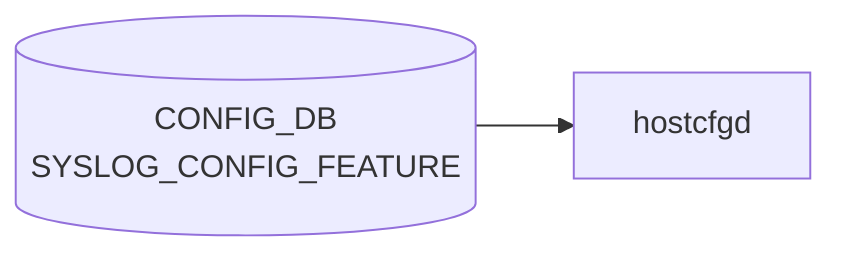

# SYSLOG_CONFIG_FEATURE テーブル

## 概要

`SYSLOG_CONFIG.GLOBAL` の rate-limit を `FEATURE` (docker) ごとに上書きするテーブル[^1]。`hostcfgd` が読み出し、対象 docker のコンテナ内 rsyslog 設定 (例 `/etc/rsyslog.d/`) を再生成する。

<!-- cdb-mermaid -->
### データフロー (自動生成)



!!! note "凡例"
    CONFIG_DB から SAI までの典型経路を `docs/reference/config-db-orch-map.md` から機械生成したミニ図。詳細・例外は本ページ本文と対応表を参照。
<!-- /cdb-mermaid -->

## key 構造

```text
SYSLOG_CONFIG_FEATURE|<service>
```

`<service>` は `FEATURE.name` への leafref (`/feature:sonic-feature/feature:FEATURE/feature:FEATURE_LIST/feature:name`)[^1]。

## フィールド

| フィールド | 型 | デフォルト | 説明 |
|-----------|----|-----------|------|
| `rate_limit_interval` | uint32 (0..2147483647 秒) | なし | サービスごとの rate-limit インターバル |
| `rate_limit_burst` | uint32 (0..2147483647 件) | なし | サービスごとの最大バースト件数 |

`SYSLOG_CONFIG` と異なり、`format`/`severity` 等は持たない (rate-limit 専用テーブル)。

<!-- defaults -->
## フィールド暗黙デフォルト (Phase A — コード由来)

YANG `default` 文を持たないフィールドについて、`containercfgd` (`sonic-buildimage/src/sonic-containercfgd/containercfgd/containercfgd.py`) が実行時に与える暗黙デフォルト[^defaults-cfgd]。

| フィールド | コード由来デフォルト | fallback 源 |
|-----------|-------------------|------------|
| `rate_limit_interval` | `'0'` (rate-limit 機能オフ) | `containercfgd.py:143` `new_interval = '0' if not data else data.get(SYSLOG_RATE_LIMIT_INTERVAL, '0')` |
| `rate_limit_burst` | `'0'` (burst 上限 0) | `containercfgd.py:144` `new_burst = '0' if not data else data.get(SYSLOG_RATE_LIMIT_BURST, '0')` |
| `severity` | — (テーブルにフィールドなし) | 親 `SYSLOG_CONFIG.severity` (YANG default `notice`) を rsyslog レベルで継承 |

### 補足

- **`interval=0` は rate-limit オフ**: rsyslog 側の `$SystemLogRateLimitInterval 0` は rate-limit 機能を無効化する仕様。CONFIG_DB にエントリが無い場合は `data` が falsy となり `'0'` が選ばれるため、デフォルトでは **per-container rate-limit は無効** となる。
- **`burst=0` 単独設定は危険**: `interval` を未設定 (=`'0'`) のまま `burst` だけ非ゼロにしても rate-limit はオフ。逆に `interval > 0` で `burst` を省略すると `'0'` 適用 → 全ログがドロップされる。両フィールドはセットで設定すること。
- **起動時キャッシュ**: `SyslogHandler.__init__` は `/etc/rsyslog.conf` を `parse_syslog_conf()` で読んで `current_interval` / `current_burst` を初期化する (`containercfgd.py:163-184`)。conf に該当行が無い場合も `'0'` を採用するため、CONFIG_DB エントリ不在＋conf 行不在 でも `update_syslog_config()` は「変更なし」と判定し `rsyslogd` 再起動をスキップする (L146-148)。
- **`severity` はテーブル外**: 本テーブルは rate-limit 専用。container 単位の severity 上書きは存在せず、グローバル `SYSLOG_CONFIG.severity` (YANG `default notice`) がそのまま適用される。

[^defaults-cfgd]: `src/sonic-containercfgd/containercfgd/containercfgd.py` (`SyslogHandler.update_syslog_config`, L137-161). <https://github.com/sonic-net/sonic-buildimage/blob/9ea932ec2e18f35e58268ec2e4456b1d4afd65cd/src/sonic-containercfgd/containercfgd/containercfgd.py#L137-L161>

<!-- /defaults -->

## 制約

- key は `service` で `FEATURE_LIST.name` を leafref 参照 → 未登録の docker は設定不可
- list 名は `SYSLOG_CONFIG_FEATURE_LIST`

## 購読者

- `hostcfgd` (`sonic-host-services` の syslog handler): [CONFIG_DB](../../reference/glossary.md#term-config_db) → 当該 docker の rsyslog 設定再生成

## 関連 CONFIG_DB / YANG / CLI

- 関連 [CONFIG_DB](../../reference/glossary.md#term-config_db): [`SYSLOG_CONFIG`](syslog-config.md), [`FEATURE`](feature.md)
- 関連 CLI: `config syslog rate-limit-container <service>`
- 関連 [YANG](../../reference/glossary.md#term-yang): `sonic-syslog`

<!-- ref-triangle:start -->

## 関連リファレンス

- [YANG](../../reference/glossary.md#term-yang): [`sonic-syslog`](../yang/sonic-syslog.md)
- CLI: [`config syslog`](../cli/config-syslog.md)

<!-- ref-triangle:end -->

## 引用元

[^1]: `src/sonic-yang-models/yang-models/sonic-syslog.yang` (container `SYSLOG_CONFIG_FEATURE` / list `SYSLOG_CONFIG_FEATURE_LIST`、leaf `service` の leafref). <https://github.com/sonic-net/sonic-buildimage/blob/9ea932ec2e18f35e58268ec2e4456b1d4afd65cd/src/sonic-yang-models/yang-models/sonic-syslog.yang>

## 関連ページ
- [CONFIG_DB: SYSLOG_CONFIG](syslog-config.md)
- [CONFIG_DB: FEATURE](feature.md)

<!-- value-behavior -->
## 値依存挙動マトリクス

本テーブルは enum フィールドを持たない（rate-limit 専用）。

| フィールド | 値 | 挙動 |
|-----------|-----|-----|
| `rate_limit_interval` | `0` | rate-limit 無効化（interval=0 で rsyslog の rate limit off） |
| `rate_limit_burst` | `0` | バースト上限 0 = 当該コンテナの全ログがドロップ |
| `rate_limit_interval` / `rate_limit_burst` | 未設定 (エントリなし) | `SYSLOG_CONFIG|GLOBAL` のグローバル設定にフォールバック |
| key (`service`) | `FEATURE` テーブルに未登録の名前 | [YANG](../../reference/glossary.md#term-yang) leafref 違反で [CONFIG_DB](../../reference/glossary.md#term-config_db) 書き込み拒否 |

<!-- /value-behavior -->

<!-- cdb-exceptions -->
## 例外条件・特殊挙動

<!-- evidence: sonic-buildimage/src/sonic-containercfgd/containercfgd/containercfgd.py@9ea932ec2e18f35e58268ec2e4456b1d4afd65cd L98-160 -->

- **自 container のみ処理**: `ContainerConfigDaemon` は `key != service_name` の場合に早期 return し、他 container 向けのエントリを無視する。異なる container のレート制限設定が混在しても互いに干渉しない。
- **変更なしはノーオペレーション**: `rate_limit_interval` / `rate_limit_burst` が現在値と同一の場合、`"Syslog rate limit configuration does not change, ignore it"` を LOG_NOTICE して rsyslogd 再起動をスキップする（キャッシュ比較による最適化）。
- **例外発生時はログのみ**: `update_syslog_config()` 内で例外が発生すると `"Failed to config syslog for container {} with data {} - {}"` を LOG_ERROR してスキップ。設定は反映されず次回変更検知まで旧設定が維持される。
- **テンプレート生成失敗**: `sonic-cfggen` 実行失敗や一時ファイル操作エラーも上位の try/except で吸収され、rsyslogd は再起動されない。

<!-- /cdb-exceptions -->

<!-- ops-hint -->
## 運用ヒント

### 典型値

- key 形式: `SYSLOG_CONFIG_FEATURE|<service>` (例 `SYSLOG_CONFIG_FEATURE|swss`)。
- `rate_limit_interval`: 5〜30 秒、`rate_limit_burst`: 数百〜数千。

### よくある誤設定

- `FEATURE` テーブルに未登録の docker 名を指定して leafref エラー。
- `rate_limit_burst=0` を意図せず設定し、すべての syslog がドロップされる。

### 確認コマンド

```bash
sonic-db-cli CONFIG_DB keys 'SYSLOG_CONFIG_FEATURE|*'
show syslog rate-limit-container
docker exec swss cat /etc/rsyslog.d/*.conf
```
<!-- /ops-hint -->


<!-- derivation -->
## 派生・条件付き登録 (Phase 6/7)

### Phase 6: 自動派生

hostcfgd が `SYSLOG_CONFIG_FEATURE` の per-feature rate limit 設定を読み、未設定の場合は `SYSLOG_CONFIG` グローバル値を継承させる（フォールバック自動派生）。`rate_limit_interval` / `rate_limit_burst` が設定されている feature のみ個別 rsyslog conf ファイルが生成される。

### Phase 7: 条件付き登録 (add_manager 条件)

hostcfgd は常時起動し `SYSLOG_CONFIG_FEATURE` テーブルを無条件購読する。Feature が `FEATURE` テーブルに登録されていない場合は per-feature syslog 設定が参照されない。

<!-- /derivation -->

<!-- handler-branching -->
### Phase 8: Handler メソッド内分岐

| Handler | 分岐条件 | 効果 | evidence |
|---|---|---|---|
| `hostcfgd` | `rate_limit_interval` フィールドあり | feature 別 rsyslog rate limit 設定を生成 | `hostcfgd.py` |
| `hostcfgd` | `rate_limit_burst` フィールドあり | feature 別 rsyslog burst 設定を生成 | `hostcfgd.py` |
| `hostcfgd` | フィールド未設定 | グローバル `SYSLOG_CONFIG` の値にフォールバック | `hostcfgd.py` |
| `hostcfgd` | エントリ削除 | feature 別 conf ファイルを削除して rsyslog reload | `hostcfgd.py` |

> **スキャン証跡**: `SYSLOG_CONFIG_FEATURE` は per-feature の syslog rate limit 設定。未設定時は `SYSLOG_CONFIG` グローバル値への暗黙的なフォールバックが Phase 6 派生相当。

<!-- /handler-branching -->

<!-- runtime-trace -->
## CDB → 実コンテナ動作トレース

### 段階 1: Consumer 登録

- **hostcfgd**: `SYSLOG_CONFIG_FEATURE` テーブルを `ConfigDBConnector` で購読。

### 段階 2: CFG → APPL 翻訳

- hostcfgd がコンテナ別 syslog 設定 (ログレベル, フィルタ等) を `/etc/rsyslog.d/` に書き込み rsyslog を再起動。
- APP_DB への書き込みなし。

### 段階 3: APPL → SAI

- SAI 経由なし。syslog はコントロールプレーンのロギング機能。

### 段階 4: タイミング + 副作用

- rsyslog 再起動まで数秒。再起動中のログが欠落する可能性。

<!-- /runtime-trace -->
<!-- entry-points -->
## 書き込み入り口 (Direction A)

SYSLOG_CONFIG_FEATURE テーブルへの書き込みが発生するコード経路を網羅的に調査した結果。

### CLI

  - `config syslog rate-limit-feature ...` — `config/syslog.py` が SYSLOG_CONFIG_FEATURE を書き込む (sonic-utilities/config/syslog.py)

### minigraph / sonic-cfggen

minigraph.py に SYSLOG_CONFIG_FEATURE 生成なし

### REST / gNMI

REST/gNMI 書き込み経路なし

### db_migrator

db_migrator.py での SYSLOG_CONFIG_FEATURE マイグレーションなし

### ビルド時デフォルト (build-time default)

なし

### ハードコードデフォルト / ランタイム注入

なし

### 死活・デッドコード

なし
<!-- /entry-points -->

<!-- glossary-links-injected: 9dae6d74c08e -->
