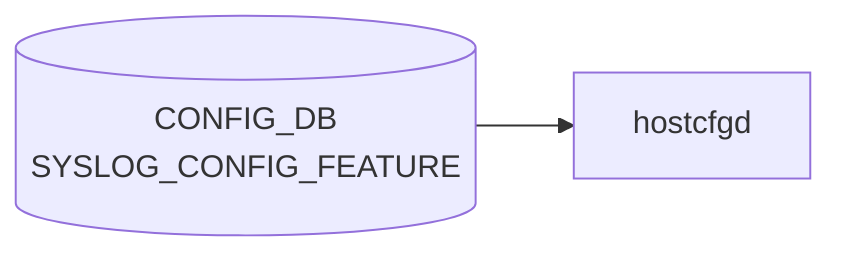

# SYSLOG_CONFIG_FEATURE テーブル

## 概要

`SYSLOG_CONFIG.GLOBAL` の rate-limit を `FEATURE` (docker) ごとに上書きするテーブル[^1]。`hostcfgd` が読み出し、対象 docker のコンテナ内 rsyslog 設定 (例 `/etc/rsyslog.d/`) を再生成する。

<!-- cdb-mermaid -->
### データフロー (自動生成)



!!! note "凡例"
    CONFIG_DB から SAI までの典型経路を `docs/reference/config-db-orch-map.md` から機械生成したミニ図。詳細・例外は本ページ本文と対応表を参照。
<!-- /cdb-mermaid -->

## key 構造

```text
SYSLOG_CONFIG_FEATURE|<service>
```

`<service>` は `FEATURE.name` への leafref (`/feature:sonic-feature/feature:FEATURE/feature:FEATURE_LIST/feature:name`)[^1]。

## フィールド

| フィールド | 型 | デフォルト | 説明 |
|-----------|----|-----------|------|
| `rate_limit_interval` | uint32 (0..2147483647 秒) | なし | サービスごとの rate-limit インターバル |
| `rate_limit_burst` | uint32 (0..2147483647 件) | なし | サービスごとの最大バースト件数 |

`SYSLOG_CONFIG` と異なり、`format`/`severity` 等は持たない (rate-limit 専用テーブル)。

## 制約

- key は `service` で `FEATURE_LIST.name` を leafref 参照 → 未登録の docker は設定不可
- list 名は `SYSLOG_CONFIG_FEATURE_LIST`

## 購読者

- `hostcfgd` (`sonic-host-services` の syslog handler): [CONFIG_DB](../../reference/glossary.md#term-config_db) → 当該 docker の rsyslog 設定再生成

## 関連 CONFIG_DB / YANG / CLI

- 関連 [CONFIG_DB](../../reference/glossary.md#term-config_db): [`SYSLOG_CONFIG`](syslog-config.md), [`FEATURE`](feature.md)
- 関連 CLI: `config syslog rate-limit-container <service>`
- 関連 [YANG](../../reference/glossary.md#term-yang): `sonic-syslog`

<!-- ref-triangle:start -->

## 関連リファレンス

- [YANG](../../reference/glossary.md#term-yang): [`sonic-syslog`](../yang/sonic-syslog.md)
- CLI: [`config syslog`](../cli/config-syslog.md)

<!-- ref-triangle:end -->

## 引用元

[^1]: `src/sonic-yang-models/yang-models/sonic-syslog.yang` (container `SYSLOG_CONFIG_FEATURE` / list `SYSLOG_CONFIG_FEATURE_LIST`、leaf `service` の leafref). <https://github.com/sonic-net/sonic-buildimage/blob/9ea932ec2e18f35e58268ec2e4456b1d4afd65cd/src/sonic-yang-models/yang-models/sonic-syslog.yang>

## 関連ページ
- [CONFIG_DB: SYSLOG_CONFIG](syslog-config.md)
- [CONFIG_DB: FEATURE](feature.md)

<!-- value-behavior -->
## 値依存挙動マトリクス

本テーブルは enum フィールドを持たない（rate-limit 専用）。

| フィールド | 値 | 挙動 |
|-----------|-----|-----|
| `rate_limit_interval` | `0` | rate-limit 無効化（interval=0 で rsyslog の rate limit off） |
| `rate_limit_burst` | `0` | バースト上限 0 = 当該コンテナの全ログがドロップ |
| `rate_limit_interval` / `rate_limit_burst` | 未設定 (エントリなし) | `SYSLOG_CONFIG|GLOBAL` のグローバル設定にフォールバック |
| key (`service`) | `FEATURE` テーブルに未登録の名前 | [YANG](../../reference/glossary.md#term-yang) leafref 違反で [CONFIG_DB](../../reference/glossary.md#term-config_db) 書き込み拒否 |

<!-- /value-behavior -->

<!-- cdb-exceptions -->
## 例外条件・特殊挙動

<!-- evidence: sonic-buildimage/src/sonic-containercfgd/containercfgd/containercfgd.py@9ea932ec2e18f35e58268ec2e4456b1d4afd65cd L98-160 -->

- **自 container のみ処理**: `ContainerConfigDaemon` は `key != service_name` の場合に早期 return し、他 container 向けのエントリを無視する。異なる container のレート制限設定が混在しても互いに干渉しない。
- **変更なしはノーオペレーション**: `rate_limit_interval` / `rate_limit_burst` が現在値と同一の場合、`"Syslog rate limit configuration does not change, ignore it"` を LOG_NOTICE して rsyslogd 再起動をスキップする（キャッシュ比較による最適化）。
- **例外発生時はログのみ**: `update_syslog_config()` 内で例外が発生すると `"Failed to config syslog for container {} with data {} - {}"` を LOG_ERROR してスキップ。設定は反映されず次回変更検知まで旧設定が維持される。
- **テンプレート生成失敗**: `sonic-cfggen` 実行失敗や一時ファイル操作エラーも上位の try/except で吸収され、rsyslogd は再起動されない。

<!-- /cdb-exceptions -->

<!-- ops-hint -->
## 運用ヒント

### 典型値

- key 形式: `SYSLOG_CONFIG_FEATURE|<service>` (例 `SYSLOG_CONFIG_FEATURE|swss`)。
- `rate_limit_interval`: 5〜30 秒、`rate_limit_burst`: 数百〜数千。

### よくある誤設定

- `FEATURE` テーブルに未登録の docker 名を指定して leafref エラー。
- `rate_limit_burst=0` を意図せず設定し、すべての syslog がドロップされる。

### 確認コマンド

```bash
sonic-db-cli CONFIG_DB keys 'SYSLOG_CONFIG_FEATURE|*'
show syslog rate-limit-container
docker exec swss cat /etc/rsyslog.d/*.conf
```
<!-- /ops-hint -->


<!-- runtime-trace -->
## CDB → 実コンテナ動作トレース

### 段階 1: Consumer 登録

- **hostcfgd**: `SYSLOG_CONFIG_FEATURE` テーブルを `ConfigDBConnector` で購読。

### 段階 2: CFG → APPL 翻訳

- hostcfgd がコンテナ別 syslog 設定 (ログレベル, フィルタ等) を `/etc/rsyslog.d/` に書き込み rsyslog を再起動。
- APP_DB への書き込みなし。

### 段階 3: APPL → SAI

- SAI 経由なし。syslog はコントロールプレーンのロギング機能。

### 段階 4: タイミング + 副作用

- rsyslog 再起動まで数秒。再起動中のログが欠落する可能性。

<!-- /runtime-trace -->

<!-- glossary-links-injected: 9dae6d74c08e -->
