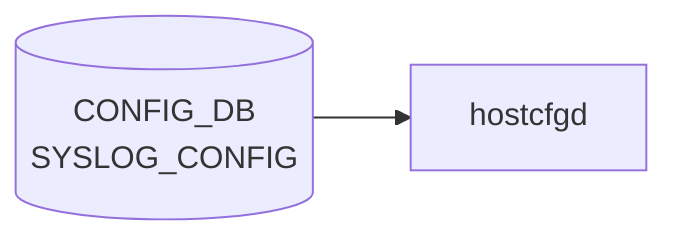

# SYSLOG_CONFIG テーブル

## 概要

ホスト全体の rsyslog グローバル設定を [CONFIG_DB](../../reference/glossary.md#term-config_db) に保持するシングルトンテーブル[^1]。`hostcfgd` (`sonic-host-services` 内 `syslog` ハンドラ) が `/etc/rsyslog.conf` および各 docker の rsyslog テンプレに反映する。

<!-- cdb-mermaid -->
### データフロー (自動生成)



!!! note "凡例"
    CONFIG_DB から SAI までの典型経路を `docs/reference/config-db-orch-map.md` から機械生成したミニ図。詳細・例外は本ページ本文と対応表を参照。
<!-- /cdb-mermaid -->

## key 構造

```text
SYSLOG_CONFIG|GLOBAL
```

固定キー `GLOBAL` のみのシングルトン container (`SYSLOG_CONFIG.GLOBAL`)。

## フィールド

| フィールド | 型 | デフォルト | 説明 |
|-----------|----|-----------|------|
| `rate_limit_interval` | uint32 (0..2147483647 秒) | なし | rsyslog rate-limit インターバル (`syslog-rate-limit-interval` typedef) |
| `rate_limit_burst` | uint32 (0..2147483647 件) | なし | rate-limit バースト件数 (`syslog-rate-limit-burst` typedef) |
| `format` | enum `welf`/`standard` | `standard` | ログ書式 (`log-format` typedef) |
| `welf_firewall_name` | string | なし | WELF 形式時のファイアウォール名 (`format != 'standard'` の must 制約あり) |
| `severity` | enum `none`/`debug`/`info`/`notice`/`warn`/`error`/`crit` | `notice` | ローカル最低 severity (`rsyslog-severity` typedef) |

## 制約

- `welf_firewall_name` は `must "(../format != 'standard')"` で WELF 形式時にのみ意味を持つ
- container 名 `SYSLOG_CONFIG`、内部 container 名 `GLOBAL` ([YANG](../../reference/glossary.md#term-yang) コメントには `SYSLOG_CONFIG_LIST` と書かれているが、実体は container)[^1]

## 購読者

- `hostcfgd` (`sonic-host-services`): [CONFIG_DB](../../reference/glossary.md#term-config_db) → rsyslog テンプレ展開 → systemd reload
- 各 docker 内の `rsyslogd`: ホスト側 rsyslog にフォワード後、グローバル設定で集約

## 関連 CONFIG_DB / YANG / CLI

- 関連 [CONFIG_DB](../../reference/glossary.md#term-config_db): [`SYSLOG_CONFIG_FEATURE`](syslog-config-feature.md), [`SYSLOG_SERVER`](syslog-server.md)
- 関連 CLI: `config syslog rate-limit-host` / `config syslog level`
- 関連 [YANG](../../reference/glossary.md#term-yang): `sonic-syslog`

<!-- ref-triangle:start -->

## 関連リファレンス

- [YANG](../../reference/glossary.md#term-yang): [`sonic-syslog`](../yang/sonic-syslog.md)
- CLI: [`config syslog`](../cli/config-syslog.md)

<!-- ref-triangle:end -->

## 引用元

[^1]: `src/sonic-yang-models/yang-models/sonic-syslog.yang` (container `SYSLOG_CONFIG` / `GLOBAL`、typedef `log-format`/`rsyslog-severity`). <https://github.com/sonic-net/sonic-buildimage/blob/9ea932ec2e18f35e58268ec2e4456b1d4afd65cd/src/sonic-yang-models/yang-models/sonic-syslog.yang>

## 関連ページ
- [CONFIG_DB: SYSLOG_CONFIG_FEATURE](syslog-config-feature.md)
- [CONFIG_DB: SYSLOG_SERVER](syslog-server.md)

<!-- value-behavior -->
## 値依存挙動マトリクス

### `format` (log-format): `welf` / `standard` (default)

### `severity` (rsyslog-severity): `none` / `debug` / `info` / `notice` (default) / `warn` / `error` / `crit`

| フィールド | 値 | 挙動 |
|-----------|-----|-----|
| `format` | `standard` | 標準 rsyslog フォーマットで書き込み。`welf_firewall_name` は無視 |
| `format` | `welf` | WELF フォーマット出力。`welf_firewall_name` の設定が必須（YANG must 制約） |
| `welf_firewall_name` | 設定あり + `format=standard` | YANG must 制約違反で書き込み拒否 |
| `rate_limit_interval` | `0` | rate-limit 無効化 |
| `rate_limit_burst` | `0` | バースト上限 0 = 全ログドロップ |
| `severity` | `none` | フィルタなし（全 severity を出力） |

<!-- /value-behavior -->

<!-- cdb-exceptions -->
## 例外条件・特殊挙動

<!-- evidence: sonic-host-services/scripts/hostcfgd@c5bbbe8b07b96f078fa4b761316627404b01bd04 L1715-1743 -->

- **rsyslog 再起動失敗時は設定不反映**: `systemctl restart rsyslog-config` が失敗すると `"RSyslogCfg: Failed to restart rsyslog service"` を LOG_ERR してキャッシュ更新せずに return する。CONFIG_DB の値は書き込まれているが rsyslog には反映されない（次回 [hostcfgd](../../reference/glossary.md#term-hostcfgd) 再起動またはテーブル変更時に再試行される）。
- **変更なしはノーオペレーション**: `SYSLOG_CONFIG` と `SYSLOG_SERVER` をまとめてキャッシュと比較し、変更がなければ `systemctl restart` をスキップする。
- **YANG must 制約**: `welf_firewall_name` は `format != 'standard'` の must 制約を持ち、`format = standard` のまま書き込もうとすると YANG バリデーション層で拒否される（[hostcfgd](../../reference/glossary.md#term-hostcfgd) レベルの追加チェックはなし）。

<!-- /cdb-exceptions -->

<!-- ops-hint -->
## 運用ヒント

### 典型値

- key 形式: `SYSLOG_CONFIG|GLOBAL`。
- `format`: `standard`、`welf_facility`: 任意、`rate_limit_interval`/`rate_limit_burst` でドロップ閾値。

### よくある誤設定

- rate_limit_burst が小さすぎて障害発生時に重要 syslog が捨てられる。

### 確認コマンド

```bash
sonic-db-cli CONFIG_DB hgetall 'SYSLOG_CONFIG|GLOBAL'
show syslog
```
<!-- /ops-hint -->

<!-- ordering -->
## 書込み順依存 (Phase B)

### SYSLOG_CONFIG と SYSLOG_SERVER のペア書込み

`rsyslog_handler()` は `SYSLOG_CONFIG` と `SYSLOG_SERVER` の**両テーブルを毎回まとめて読み直す**。どちらのテーブルへの変更も `rsyslog-config` サービスの再起動を引き起こす。

| 操作順序 | rsyslog-config 再起動回数 | 備考 |
|----------|--------------------------|------|
| `SYSLOG_SERVER` を先に投入 → `SYSLOG_CONFIG` を書き込む | **1 回** | 推奨パターン |
| `SYSLOG_CONFIG` を先に書き込む → `SYSLOG_SERVER` を後から追加 | **2 回** | 最終状態は同じだが再起動が増える |
| 同一値を再書き込み | **0 回** | キャッシュ比較でスキップ (hostcfgd:1725) |

**推奨書込み順序**:

```
# 1. リモートサーバ設定（先に投入）
SET SYSLOG_SERVER|<ip>  port=514  ...

# 2. グローバル設定（後から書き込む）
SET SYSLOG_CONFIG|GLOBAL  format=standard  rate_limit_interval=300  rate_limit_burst=20000
```

### welf_firewall_name の順序制約

YANG `must "(../format != 'standard')"` 制約により、`welf_firewall_name` は `format = welf` に変更した**後**でなければ書き込めない。

| ステップ | 操作 | 結果 |
|---------|------|------|
| 1 | `SYSLOG_CONFIG|GLOBAL format=welf` | OK |
| 2 | `SYSLOG_CONFIG|GLOBAL welf_firewall_name=<name>` | OK (YANG 制約満足) |
| × | `format=standard` のまま `welf_firewall_name` を書く | YANG バリデーションエラーで拒否 |

<!-- evidence: sonic-host-services/scripts/hostcfgd L2410-2415, L1725-1726; sonic-syslog.yang must "(../format != 'standard')" -->
<!-- /ordering -->

<!-- derivation -->
## 派生・条件付き登録 (Phase 6/7)

### Phase 6: 自動派生

hostcfgd が `rate_limit_interval==0` の場合に rate limit 無効化設定を自動生成する（特殊値による分岐）。`SYSLOG_CONFIG_FEATURE` が未設定の feature に対してグローバル値のフォールバックが発生する（間接的な Phase 6 派生）。

### Phase 7: 条件付き登録 (add_manager 条件)

hostcfgd は常時起動し `SYSLOG_CONFIG` テーブルを無条件購読する。`SYSLOG_CONFIG|GLOBAL` エントリのみ処理するシングルトン制約あり（YANG で強制）。

<!-- /derivation -->

<!-- handler-branching -->
### Phase 8: Handler メソッド内分岐

| Handler | 分岐条件 | 効果 | evidence |
|---|---|---|---|
| `hostcfgd` | `rate_limit_interval==0` | rate limit 無効化設定を生成 | `hostcfgd.py` |
| `hostcfgd` | `rate_limit_interval>0` | 指定インターバルで rate limit 設定を生成 | `hostcfgd.py` |
| `hostcfgd` | `rate_limit_burst==0` | burst limit 無効化 | `hostcfgd.py` |
| `hostcfgd` | 設定変更 | rsyslog サービスを reload | `hostcfgd.py` |

> **スキャン証跡**: `SYSLOG_CONFIG` はグローバル syslog rate limit 設定。`rate_limit_interval==0` での無効化分岐が主要ポイント。`SYSLOG_CONFIG_FEATURE` への値の伝播が Phase 6 自動派生相当。

<!-- /handler-branching -->

<!-- defaults -->
## コード由来の暗黙デフォルト (Phase A)

YANG default 宣言 (`format=standard` / `severity=notice`) を補完する形で、テンプレート fallback や `containercfgd` のローカル fallback が複層に効く。CONFIG_DB に行が無い／フィールドが欠落した場合の実効値を以下にまとめる。

| フィールド | YANG default | コード由来デフォルト | 発生源 |
|---|---|---|---|
| `rate_limit_interval` | なし | **未指定 (rsyslog ディレクティブ非出力 → `imuxsock` 既定で実効 rate limit 無効)** | `rsyslog.conf.j2` L17, L22 `is not none` ガード |
| `rate_limit_burst` | なし | **未指定 (同上、rsyslog `imuxsock` 既定値)** | `rsyslog.conf.j2` L18, L22 `is not none` ガード |
| `format` | `standard` | **`standard`** (二重防御) | YANG `default standard` + `rsyslog.conf.j2` L51 `gconf.get('format', 'standard')` |
| `welf_firewall_name` | なし | **`{{ hostname }}`** (DEVICE_METADATA 由来) | `rsyslog.conf.j2` L52 `gconf.get('welf_firewall_name', hostname)` |
| `severity` | `notice` | **`notice`** (YANG default) / `*` (テーブル全欠落時の per-server fallback) | YANG `default notice` + `rsyslog.conf.j2` L92 `gconf.get('severity', '*')` |

### `format` の詳細

YANG が `default standard` を宣言しているため、CLI / sonic-cfggen / YANG-aware 書き込み経路では `format` 欠落時に `standard` が自動付与される。`rsyslog.conf.j2` L51 はこの YANG default をバイパスする経路（直接 redis-cli 書き込み、`SYSLOG_CONFIG|GLOBAL` 行欠落）に備えた二重防御で、`gconf.get('format', 'standard')` で `'standard'` を最終フォールバックとする。

### `severity` の詳細

YANG default `notice` は `SYSLOG_CONFIG.GLOBAL.severity` に対するもの。テンプレート L92 では per-server severity の fallback として `gconf.get('severity', '*')` を使うため、`SYSLOG_CONFIG` テーブル自体が CONFIG_DB に存在しない場合は per-server に対して `'*'`（rsyslog の全 severity 構文）が適用される。これは YANG-実装 discrepancy（YANG 通過時は `notice`、未通過時は `*`）として `syslog-server` 側にも影響する。

### `welf_firewall_name` の暗黙ホスト名フォールバック

`format='welf'` で `welf_firewall_name` を未指定にすると、テンプレート L52 がデバイス hostname（`sonic-cfggen` が `DEVICE_METADATA` から注入）を `fw="..."` として埋め込む。YANG の `must "(../format != 'standard')"` 制約は `format='welf'` 時には必須化を強制しないため、welf_firewall_name 欠落 + format=welf という組み合わせは合法だが、実効的にホスト名がそのまま外部 syslog サーバへ送られる。

### `SYSLOG_CONFIG_FEATURE` への local fallback（コンテナ側）

`SYSLOG_CONFIG` (GLOBAL) はコンテナ内 rsyslog では参照されない（`rsyslog-container.conf.j2` は `SYSLOG_CONFIG_FEATURE` のみ参照）。コンテナ側 rate limit のハードコードフォールバックは `interval=300` / `burst=20000`（テンプレート L27 の `default()` フィルタ）。ただし `containercfgd.py` L143-144 が `data.get(..., '0')` で空 dict 経由でも `'0'` を渡すため、ハードコード fallback `300/20000` が発動するのは sonic-cfggen をスタンドアロン呼び出した特殊ケースに限られる。

> **スキャン証跡**: `sonic-syslog.yang` L156-191、`rsyslog.conf.j2` L16-22 / L51-52 / L92、`rsyslog-container.conf.j2` L16-27、`containercfgd.py` L98-160、`hostcfgd` L1695-1743 を精読。詳細は `meta/_intermediate/cdb-flow/syslog-config-defaults.md`。

<!-- /defaults -->

<!-- runtime-trace -->
## CDB → 実コンテナ動作トレース

### 段階 1: Consumer 登録

- **hostcfgd**: `SYSLOG_CONFIG` テーブルを `ConfigDBConnector` で購読。

### 段階 2: CFG → APPL 翻訳

- hostcfgd がグローバル syslog 設定 (リモートサーバ転送等) を rsyslog 設定ファイルに書き込み再起動。

### 段階 3: APPL → SAI

- SAI 経由なし。rsyslog がネットワーク経由でリモート syslog サーバへ転送。

### 段階 4: タイミング + 副作用

- 設定変更後 rsyslog 再起動まで数秒。リモートサーバ到達不能の場合はバッファリングまたはログ欠落。

<!-- /runtime-trace -->
<!-- entry-points -->
## 書き込み入り口 (Direction A)

SYSLOG_CONFIG テーブルへの書き込みが発生するコード経路を網羅的に調査した結果。

### CLI

  - `config syslog rate-limit ...` / `config syslog format ...` — `config/syslog.py` が SYSLOG_CONFIG を書き込む (sonic-utilities/config/syslog.py)

### minigraph / sonic-cfggen

minigraph.py に SYSLOG_CONFIG 生成なし

### REST / gNMI

REST/gNMI 書き込み経路なし

### db_migrator

db_migrator.py での SYSLOG_CONFIG マイグレーションなし

### ビルド時デフォルト (build-time default)

なし

### ハードコードデフォルト / ランタイム注入

なし

### 死活・デッドコード

なし
<!-- /entry-points -->

<!-- glossary-links-injected: f29534787f37 -->
