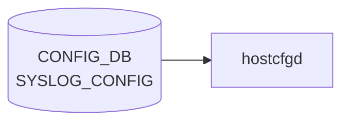

# SYSLOG_CONFIG テーブル

## 概要

ホスト全体の rsyslog グローバル設定を [CONFIG_DB](../../reference/glossary.md#term-config_db) に保持するシングルトンテーブル[^1]。`hostcfgd` (`sonic-host-services` 内 `syslog` ハンドラ) が `/etc/rsyslog.conf` および各 docker の rsyslog テンプレに反映する。

<!-- cdb-mermaid -->
### データフロー (自動生成)



!!! note "凡例"
    CONFIG_DB から SAI までの典型経路を `docs/reference/config-db-orch-map.md` から機械生成したミニ図。詳細・例外は本ページ本文と対応表を参照。
<!-- /cdb-mermaid -->

## key 構造

```text
SYSLOG_CONFIG|GLOBAL
```

固定キー `GLOBAL` のみのシングルトン container (`SYSLOG_CONFIG.GLOBAL`)。

## フィールド

| フィールド | 型 | デフォルト | 説明 |
|-----------|----|-----------|------|
| `rate_limit_interval` | uint32 (0..2147483647 秒) | なし | rsyslog rate-limit インターバル (`syslog-rate-limit-interval` typedef) |
| `rate_limit_burst` | uint32 (0..2147483647 件) | なし | rate-limit バースト件数 (`syslog-rate-limit-burst` typedef) |
| `format` | enum `welf`/`standard` | `standard` | ログ書式 (`log-format` typedef) |
| `welf_firewall_name` | string | なし | WELF 形式時のファイアウォール名 (`format != 'standard'` の must 制約あり) |
| `severity` | enum `none`/`debug`/`info`/`notice`/`warn`/`error`/`crit` | `notice` | ローカル最低 severity (`rsyslog-severity` typedef) |

## 制約

- `welf_firewall_name` は `must "(../format != 'standard')"` で WELF 形式時にのみ意味を持つ
- container 名 `SYSLOG_CONFIG`、内部 container 名 `GLOBAL` ([YANG](../../reference/glossary.md#term-yang) コメントには `SYSLOG_CONFIG_LIST` と書かれているが、実体は container)[^1]

## 購読者

- `hostcfgd` (`sonic-host-services`): [CONFIG_DB](../../reference/glossary.md#term-config_db) → rsyslog テンプレ展開 → systemd reload
- 各 docker 内の `rsyslogd`: ホスト側 rsyslog にフォワード後、グローバル設定で集約

## 関連 CONFIG_DB / YANG / CLI

- 関連 [CONFIG_DB](../../reference/glossary.md#term-config_db): [`SYSLOG_CONFIG_FEATURE`](syslog-config-feature.md), [`SYSLOG_SERVER`](syslog-server.md)
- 関連 CLI: `config syslog rate-limit-host` / `config syslog level`
- 関連 [YANG](../../reference/glossary.md#term-yang): `sonic-syslog`

<!-- ref-triangle:start -->

## 関連リファレンス

- [YANG](../../reference/glossary.md#term-yang): [`sonic-syslog`](../yang/sonic-syslog.md)
- CLI: [`config syslog`](../cli/config-syslog.md)

<!-- ref-triangle:end -->

## 引用元

[^1]: `src/sonic-yang-models/yang-models/sonic-syslog.yang` (container `SYSLOG_CONFIG` / `GLOBAL`、typedef `log-format`/`rsyslog-severity`). <https://github.com/sonic-net/sonic-buildimage/blob/9ea932ec2e18f35e58268ec2e4456b1d4afd65cd/src/sonic-yang-models/yang-models/sonic-syslog.yang>

## 関連ページ
- [CONFIG_DB: SYSLOG_CONFIG_FEATURE](syslog-config-feature.md)
- [CONFIG_DB: SYSLOG_SERVER](syslog-server.md)

<!-- cdb-exceptions -->
## 例外条件・特殊挙動

<!-- evidence: sonic-host-services/scripts/hostcfgd@c5bbbe8b07b96f078fa4b761316627404b01bd04 L1715-1743 -->

- **rsyslog 再起動失敗時は設定不反映**: `systemctl restart rsyslog-config` が失敗すると `"RSyslogCfg: Failed to restart rsyslog service"` を LOG_ERR してキャッシュ更新せずに return する。CONFIG_DB の値は書き込まれているが rsyslog には反映されない（次回 hostcfgd 再起動またはテーブル変更時に再試行される）。
- **変更なしはノーオペレーション**: `SYSLOG_CONFIG` と `SYSLOG_SERVER` をまとめてキャッシュと比較し、変更がなければ `systemctl restart` をスキップする。
- **YANG must 制約**: `welf_firewall_name` は `format != 'standard'` の must 制約を持ち、`format = standard` のまま書き込もうとすると YANG バリデーション層で拒否される（hostcfgd レベルの追加チェックはなし）。

<!-- /cdb-exceptions -->

<!-- ops-hint -->
## 運用ヒント

### 典型値

- key 形式: `SYSLOG_CONFIG|GLOBAL`。
- `format`: `standard`、`welf_facility`: 任意、`rate_limit_interval`/`rate_limit_burst` でドロップ閾値。

### よくある誤設定

- rate_limit_burst が小さすぎて障害発生時に重要 syslog が捨てられる。

### 確認コマンド

```bash
sonic-db-cli CONFIG_DB hgetall 'SYSLOG_CONFIG|GLOBAL'
show syslog
```
<!-- /ops-hint -->

<!-- glossary-links-injected: 32758c44ab11 -->
