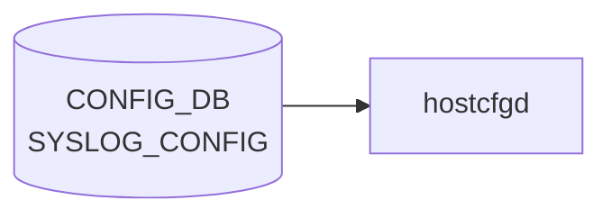

# SYSLOG_CONFIG テーブル

## 概要

ホスト全体の rsyslog グローバル設定を [CONFIG_DB](../../reference/glossary.md#term-config_db) に保持するシングルトンテーブル[^1]。`hostcfgd` (`sonic-host-services` 内 `syslog` ハンドラ) が `/etc/rsyslog.conf` および各 docker の rsyslog テンプレに反映する。

<!-- cdb-mermaid -->
### データフロー (自動生成)



!!! note "凡例"
    CONFIG_DB から SAI までの典型経路を `docs/reference/config-db-orch-map.md` から機械生成したミニ図。詳細・例外は本ページ本文と対応表を参照。
<!-- /cdb-mermaid -->

## key 構造

```text
SYSLOG_CONFIG|GLOBAL
```

固定キー `GLOBAL` のみのシングルトン container (`SYSLOG_CONFIG.GLOBAL`)。

## フィールド

| フィールド | 型 | デフォルト | 説明 |
|-----------|----|-----------|------|
| `rate_limit_interval` | uint32 (0..2147483647 秒) | なし | rsyslog rate-limit インターバル (`syslog-rate-limit-interval` typedef) |
| `rate_limit_burst` | uint32 (0..2147483647 件) | なし | rate-limit バースト件数 (`syslog-rate-limit-burst` typedef) |
| `format` | enum `welf`/`standard` | `standard` | ログ書式 (`log-format` typedef) |
| `welf_firewall_name` | string | なし | WELF 形式時のファイアウォール名 (`format != 'standard'` の must 制約あり) |
| `severity` | enum `none`/`debug`/`info`/`notice`/`warn`/`error`/`crit` | `notice` | ローカル最低 severity (`rsyslog-severity` typedef) |

## 制約

- `welf_firewall_name` は `must "(../format != 'standard')"` で WELF 形式時にのみ意味を持つ
- container 名 `SYSLOG_CONFIG`、内部 container 名 `GLOBAL` ([YANG](../../reference/glossary.md#term-yang) コメントには `SYSLOG_CONFIG_LIST` と書かれているが、実体は container)[^1]

## 購読者

- `hostcfgd` (`sonic-host-services`): [CONFIG_DB](../../reference/glossary.md#term-config_db) → rsyslog テンプレ展開 → systemd reload
- 各 docker 内の `rsyslogd`: ホスト側 rsyslog にフォワード後、グローバル設定で集約

## 関連 CONFIG_DB / YANG / CLI

- 関連 [CONFIG_DB](../../reference/glossary.md#term-config_db): [`SYSLOG_CONFIG_FEATURE`](syslog-config-feature.md), [`SYSLOG_SERVER`](syslog-server.md)
- 関連 CLI: `config syslog rate-limit-host` / `config syslog level`
- 関連 [YANG](../../reference/glossary.md#term-yang): `sonic-syslog`

<!-- ref-triangle:start -->

## 関連リファレンス

- [YANG](../../reference/glossary.md#term-yang): [`sonic-syslog`](../yang/sonic-syslog.md)
- CLI: [`config syslog`](../cli/config-syslog.md)

<!-- ref-triangle:end -->

## 引用元

[^1]: `src/sonic-yang-models/yang-models/sonic-syslog.yang` (container `SYSLOG_CONFIG` / `GLOBAL`、typedef `log-format`/`rsyslog-severity`). <https://github.com/sonic-net/sonic-buildimage/blob/9ea932ec2e18f35e58268ec2e4456b1d4afd65cd/src/sonic-yang-models/yang-models/sonic-syslog.yang>

## 関連ページ
- [CONFIG_DB: SYSLOG_CONFIG_FEATURE](syslog-config-feature.md)
- [CONFIG_DB: SYSLOG_SERVER](syslog-server.md)

<!-- value-behavior -->
## 値依存挙動マトリクス

### `format` (log-format): `welf` / `standard` (default)

### `severity` (rsyslog-severity): `none` / `debug` / `info` / `notice` (default) / `warn` / `error` / `crit`

| フィールド | 値 | 挙動 |
|-----------|-----|-----|
| `format` | `standard` | 標準 rsyslog フォーマットで書き込み。`welf_firewall_name` は無視 |
| `format` | `welf` | WELF フォーマット出力。`welf_firewall_name` の設定が必須（YANG must 制約） |
| `welf_firewall_name` | 設定あり + `format=standard` | YANG must 制約違反で書き込み拒否 |
| `rate_limit_interval` | `0` | rate-limit 無効化 |
| `rate_limit_burst` | `0` | バースト上限 0 = 全ログドロップ |
| `severity` | `none` | フィルタなし（全 severity を出力） |

<!-- /value-behavior -->

<!-- cdb-exceptions -->
## 例外条件・特殊挙動

<!-- evidence: sonic-host-services/scripts/hostcfgd@c5bbbe8b07b96f078fa4b761316627404b01bd04 L1715-1743 -->

- **rsyslog 再起動失敗時は設定不反映**: `systemctl restart rsyslog-config` が失敗すると `"RSyslogCfg: Failed to restart rsyslog service"` を LOG_ERR してキャッシュ更新せずに return する。CONFIG_DB の値は書き込まれているが rsyslog には反映されない（次回 [hostcfgd](../../reference/glossary.md#term-hostcfgd) 再起動またはテーブル変更時に再試行される）。
- **変更なしはノーオペレーション**: `SYSLOG_CONFIG` と `SYSLOG_SERVER` をまとめてキャッシュと比較し、変更がなければ `systemctl restart` をスキップする。
- **YANG must 制約**: `welf_firewall_name` は `format != 'standard'` の must 制約を持ち、`format = standard` のまま書き込もうとすると YANG バリデーション層で拒否される（[hostcfgd](../../reference/glossary.md#term-hostcfgd) レベルの追加チェックはなし）。

<!-- /cdb-exceptions -->

<!-- ops-hint -->
## 運用ヒント

### 典型値

- key 形式: `SYSLOG_CONFIG|GLOBAL`。
- `format`: `standard`、`welf_facility`: 任意、`rate_limit_interval`/`rate_limit_burst` でドロップ閾値。

### よくある誤設定

- rate_limit_burst が小さすぎて障害発生時に重要 syslog が捨てられる。

### 確認コマンド

```bash
sonic-db-cli CONFIG_DB hgetall 'SYSLOG_CONFIG|GLOBAL'
show syslog
```
<!-- /ops-hint -->

<!-- ordering -->
## 書込み順依存 (Phase B)

### SYSLOG_CONFIG と SYSLOG_SERVER のペア書込み

`rsyslog_handler()` は `SYSLOG_CONFIG` と `SYSLOG_SERVER` の**両テーブルを毎回まとめて読み直す**。どちらのテーブルへの変更も `rsyslog-config` サービスの再起動を引き起こす。

| 操作順序 | rsyslog-config 再起動回数 | 備考 |
|----------|--------------------------|------|
| `SYSLOG_SERVER` を先に投入 → `SYSLOG_CONFIG` を書き込む | **1 回** | 推奨パターン |
| `SYSLOG_CONFIG` を先に書き込む → `SYSLOG_SERVER` を後から追加 | **2 回** | 最終状態は同じだが再起動が増える |
| 同一値を再書き込み | **0 回** | キャッシュ比較でスキップ ([hostcfgd](../../reference/glossary.md#term-hostcfgd):1725) |

**推奨書込み順序**:

```
# 1. リモートサーバ設定（先に投入）
SET SYSLOG_SERVER|<ip>  port=514  ...

# 2. グローバル設定（後から書き込む）
SET SYSLOG_CONFIG|GLOBAL  format=standard  rate_limit_interval=300  rate_limit_burst=20000
```

### welf_firewall_name の順序制約

YANG `must "(../format != 'standard')"` 制約により、`welf_firewall_name` は `format = welf` に変更した**後**でなければ書き込めない。

| ステップ | 操作 | 結果 |
|---------|------|------|
| 1 | `SYSLOG_CONFIG|GLOBAL format=welf` | OK |
| 2 | `SYSLOG_CONFIG|GLOBAL welf_firewall_name=<name>` | OK (YANG 制約満足) |
| × | `format=standard` のまま `welf_firewall_name` を書く | YANG バリデーションエラーで拒否 |

<!-- evidence: sonic-host-services/scripts/hostcfgd L2410-2415, L1725-1726; sonic-syslog.yang must "(../format != 'standard')" -->
<!-- /ordering -->

<!-- cross-refs -->
## 暗黙参照 — Phase C (cross-table refs)

> **調査根拠**: `hostcfgd` (`RSyslogCfg.update_rsyslog_config`, `rsyslog_handler`)・`rsyslog.conf.j2` 全行精読 (2026-05-18)
> 詳細証跡: `meta/_intermediate/cdb-flow/syslog-config-cross-refs.md`

`SYSLOG_CONFIG` テーブルは実行時に以下のテーブルを暗黙参照する。

| 参照先 | DB | 参照方向 | YANG leafref | 実装上の必須度 | 証拠 |
|---|---|---|---|---|---|
| `SYSLOG_SERVER` | CONFIG_DB | 読み取り (毎回ペア取得 + テンプレート展開) | なし | 任意 (0件でも動作) | `hostcfgd:2410-2415`, `rsyslog.conf.j2:84-125` |
| `DEVICE_METADATA\|localhost.hostname` | CONFIG_DB | 読み取り (welf_firewall_name フォールバック) | なし | 条件付き必須 (format=welf かつ welf_firewall_name 未設定時) | `rsyslog.conf.j2:52` |
| `SYSLOG_CONFIG_FEATURE` | CONFIG_DB | 参照元として rate-limit 提供 (ホスト側のみ) | なし | アーキテクチャ上の独立 | `rsyslog-container.conf.j2` defaults |

### SYSLOG_SERVER — 常にペアで読まれる

`rsyslog_handler()` は `SYSLOG_CONFIG` と `SYSLOG_SERVER` を同時に `get_table()` で取得し (`hostcfgd:2410-2415`)、`RSyslogCfg.update_rsyslog_config(rsyslog_config, rsyslog_servers)` へ渡す。`rsyslog.conf.j2` の `` ループ (L84-125) が全サーバエントリを展開する。`SYSLOG_CONFIG|GLOBAL.format = welf` の場合、テンプレート内でサーバ側の出力テンプレートも `WelfRemoteFormat` に切り替わるため (L99-105)、`SYSLOG_CONFIG.format` 値が `SYSLOG_SERVER` の出力形式を間接的に制御する[^cross-server]。

### DEVICE_METADATA|localhost.hostname — welf_firewall_name フォールバック

`rsyslog.conf.j2` L52: `` — `welf_firewall_name` が未設定の場合、`sonic-cfggen -d` が `DEVICE_METADATA|localhost.hostname` から取得した `hostname` 変数がフォールバックとして WELF ログのファイアウォール名になる[^cross-hostname]。`format = welf` 時に `welf_firewall_name` を省略すると、意図しないホスト名がログに含まれる。

### SYSLOG_CONFIG_FEATURE との独立性

`SYSLOG_CONFIG|GLOBAL` の rate-limit 設定はホスト側 rsyslog にのみ反映される。各コンテナの rsyslog は `containercfgd` が `rsyslog-container.conf.j2` を展開し、`SYSLOG_CONFIG_FEATURE` が未設定のコンテナにはテンプレートのハードコードデフォルト (`interval=300`, `burst=20000`) が使われる。`SYSLOG_CONFIG|GLOBAL` の値はコンテナ rsyslog には**直接継承されない**[^cross-feature]。

[^cross-server]: `sonic-host-services/scripts/hostcfgd` L2410-2415 (`rsyslog_handler`), `sonic-buildimage/files/image_config/rsyslog/rsyslog.conf.j2` L84-125. <https://github.com/sonic-net/sonic-buildimage/blob/master/files/image_config/rsyslog/rsyslog.conf.j2>
[^cross-hostname]: `sonic-buildimage/files/image_config/rsyslog/rsyslog.conf.j2` L52 (`welf_firewall_name` フォールバック). <https://github.com/sonic-net/sonic-buildimage/blob/master/files/image_config/rsyslog/rsyslog.conf.j2>
[^cross-feature]: `sonic-buildimage/files/image_config/rsyslog/rsyslog-container.conf.j2` (`|default('300')`, `|default('20000')`). <https://github.com/sonic-net/sonic-buildimage/blob/master/files/image_config/rsyslog/rsyslog-container.conf.j2>

<!-- /cross-refs -->

<!-- failure -->
## 失敗挙動マトリクス (Phase D)

ソース: `sonic-net/sonic-host-services/scripts/hostcfgd` (`RSyslogCfg` クラス, L1695-1743)
詳細証跡: `meta/_intermediate/cdb-flow/syslog-config-failure.md`

### SET 処理における失敗経路

| 失敗条件 | 検出箇所 | 結果 | ログ出力 | evidence |
|---|---|---|---|---|
| `systemctl reset-failed rsyslog-config rsyslog` が `CalledProcessError` | `update_rsyslog_config()` L1731-1739 | `return` でキャッシュ未更新・rsyslog 設定**未反映** | LOG_ERR ("RSyslogCfg: Failed to restart rsyslog service") | `hostcfgd:1731-1739` |
| `systemctl restart rsyslog-config` が `CalledProcessError` | `update_rsyslog_config()` L1734-1739 | 同上（`raise_exception=True` で例外捕捉 → LOG_ERR + return） | LOG_ERR | `hostcfgd:1734-1739` |
| config/servers 内容が前回と同一（キャッシュ一致） | `update_rsyslog_config()` L1725-1726 | `systemctl restart` をスキップ (ノーオペレーション) | LOG_DEBUG のみ | `hostcfgd:1724-1726` |
| YANG must 制約違反 — `format=standard` のまま `welf_firewall_name` を書き込む | YANG バリデーション層 | CONFIG_DB への書き込みが reject（hostcfgd には到達しない） | YANG バリデーションエラー | `sonic-syslog.yang must "(../format != 'standard')"` |

### DEL 処理における失敗経路

| 失敗条件 | 検出箇所 | 結果 | evidence |
|---|---|---|---|
| `SYSLOG_CONFIG\|GLOBAL` を DEL → `rsyslog_handler()` が空 dict でテーブル取得 | `update_rsyslog_config()` L1725 | 差分あり判定で `rsyslog-config` を再起動・Jinja2 テンプレートが空設定で rsyslog.conf を再生成 | `hostcfgd:2410-2415`, L1725 |

### 補足

- **restart 失敗時のキャッシュ非更新**: `return` 前にキャッシュを更新しないため、次回テーブル変更時に「差分あり」と判定され再度 restart が試みられる（実質的な自動リトライ）。
- **`rsyslog-config` サービス**: このサービスが Jinja2 テンプレートを展開し `rsyslog.conf` を生成後に `rsyslogd` を再起動する。`reset-failed` を先に行うのは前回の `failed` 状態をクリアするためで、これも失敗すると restart は試みられない。
- **SYSLOG_SERVER 変更による連鎖**: `rsyslog_server_handler()` も同一 `rsyslog_handler()` を呼ぶため、`SYSLOG_SERVER` の追加/削除時に `rsyslog-config` restart が失敗した場合も同様（LOG_ERR + キャッシュ非更新）。

<!-- /failure -->

<!-- constants -->
## ハードコード定数 (Phase E)

`SYSLOG_CONFIG` の処理に関与する `hostcfgd` および rsyslog Jinja2 テンプレートに存在する、CONFIG_DB / YANG で管理されないハードコード定数の一覧。
詳細証跡: `meta/_intermediate/cdb-flow/syslog-config-constants.md`

### rsyslog.conf.j2 — テンプレートフォールバック値

| 定数 / フォールバック | 値 | 用途 | ソース |
|---|---|---|---|
| `format` フォールバック | `'standard'` | `gconf.get('format', 'standard')` — SYSLOG_CONFIG\|GLOBAL 欠落・`format` 未設定時の最終フォールバック（YANG default と二重防御） | `rsyslog.conf.j2` L51 |
| `welf_firewall_name` フォールバック | `hostname` ([DEVICE_METADATA](../../reference/glossary.md#term-device_metadata) 由来) | `gconf.get('welf_firewall_name', hostname)` — `format=welf` かつ `welf_firewall_name` 未設定時にデバイスホスト名を WELF `fw=` フィールドへ埋め込む | `rsyslog.conf.j2` L52 |
| `severity` フォールバック (per-server) | `'*'` (全 severity) | `conf.get('severity', gconf.get('severity', '*'))` — per-server および GLOBAL severity ともに未設定の場合 | `rsyslog.conf.j2` L92 |
| `port` フォールバック (per-server) | `514` | SYSLOG_SERVER エントリの `port` 未設定時のデフォルト転送ポート | `rsyslog.conf.j2` L89 |
| `protocol` フォールバック (per-server) | `'udp'` | SYSLOG_SERVER エントリの `protocol` 未設定時 | `rsyslog.conf.j2` L90 |
| `vrf` フォールバック (per-server) | `'default'` | SYSLOG_SERVER エントリの `vrf` 未設定時 | `rsyslog.conf.j2` L91 |

### rsyslog.conf.j2 — ハードコードポート・パーミッション

| 定数 | 値 | 用途 | ソース |
|---|---|---|---|
| UDP 受信ポート | `514` | `input(type="imudp" ... port="514")` — ホスト rsyslog の UDP 受信ポート（コンテナからの imudp 転送先） | `rsyslog.conf.j2` L31, L33 |
| RELP 受信ポート | `2514` | `input(type="imrelp" ... port="2514")` — コンテナ rsyslog からの RELP 受信ポート | `rsyslog.conf.j2` L42, L44 |
| omfwd キュータイプ | `LinkedList` | `queue.type="LinkedList"` — 転送アクションの非同期キュー種別 | `rsyslog.conf.j2` L124 |
| omfwd キューサイズ | `20000` | `queue.size="20000"` — 転送キューの最大エントリ数 | `rsyslog.conf.j2` L124 |
| omfwd リトライ回数 | `60` | `action.resumeRetryCount="60"` — 転送失敗時の最大リトライ数 | `rsyslog.conf.j2` L124 |
| スプールディレクトリ | `/var/spool/rsyslog` | `$WorkDirectory` — キューのディスクスプール先 | `rsyslog.conf.j2` L144 |
| インクルードディレクトリ | `/etc/rsyslog.d/*.conf` | `$IncludeConfig` — 追加設定ファイルのインクルードパターン | `rsyslog.conf.j2` L149 |
| ファイルパーミッション | `0640` / `0755` | `$FileCreateMode` / `$DirCreateMode` | `rsyslog.conf.j2` L136-L137 |
| 重複抑制 | `on` | `$RepeatedMsgReduction on` — 重複ログの "message repeated N times" 集約 | `rsyslog.conf.j2` L154 |

### rsyslog-container.conf.j2 — コンテナ側デフォルト

| 定数 | 値 | 用途 | ソース |
|---|---|---|---|
| `rate_limit_interval` デフォルト (コンテナ) | `'300'` 秒 | `rate_limit_interval\|default('300')` — `SYSLOG_CONFIG_FEATURE` 未設定コンテナへの imuxsock rate limit デフォルト | `rsyslog-container.conf.j2` L27 |
| `rate_limit_burst` デフォルト (コンテナ) | `'20000'` 件 | `rate_limit_burst\|default('20000')` — 同上 | `rsyslog-container.conf.j2` L27 |
| RELP 転送先ポート (コンテナ→ホスト) | `2514` | `port="2514"` — ホスト rsyslog の RELP 受信ポートへの omrelp 転送 | `rsyslog-container.conf.j2` L63 |

### hostcfgd — systemd サービス名

| 定数 | 値 | 用途 | ソース |
|---|---|---|---|
| config 反映サービス | `'rsyslog-config'` | `systemctl reset-failed rsyslog-config` / `restart rsyslog-config` — Jinja2 テンプレート展開 + rsyslogd 再起動を行うサービス | `hostcfgd` L1732-1734 |
| rsyslog デーモン名 | `'rsyslog'` | `systemctl reset-failed rsyslog` — failed 状態クリア対象 | `hostcfgd` L1732-1733 |

!!! note "コンテナ側デフォルト値は SYSLOG_CONFIG|GLOBAL と独立"
    `rsyslog-container.conf.j2` の `rate_limit_interval/burst` デフォルト (`300/20000`) は `SYSLOG_CONFIG_FEATURE` が参照するものであり、`SYSLOG_CONFIG|GLOBAL` の rate limit 設定はコンテナ側 rsyslog には伝播しない。

<!-- /constants -->

<!-- side-effects -->
## 副次 DB 書込 (Phase F)

`SYSLOG_CONFIG` テーブルの変更に伴って `hostcfgd` の `RSyslogCfg` ハンドラが副次的に書き込む DB エントリは **存在しない**。副作用はすべて Linux ホスト OS の設定ファイル再生成と `rsyslogd` 再起動に閉じる。

| 副次 DB | 書込有無 | 根拠 |
|---|---|---|
| [APPL_DB](../../reference/glossary.md#term-appl_db) | なし | `RSyslogCfg` クラス内 (hostcfgd:1695-1743) に `ProducerStateTable` / `Table.set()` / `hset` の呼び出しが 0 件 |
| [STATE_DB](../../reference/glossary.md#term-state_db) | なし | `hostcfgd` の `STATE_DB` 参照は `FipsCfg` (L1759-1821) と起動時 `RestartWaiter` のみ。`RSyslogCfg` は `state_db_conn` を保持しない |
| [COUNTERS_DB](../../reference/glossary.md#term-counters_db) | なし | `hostcfgd` 全体に [COUNTERS_DB](../../reference/glossary.md#term-counters_db) 参照なし。syslog はコントロールプレーンのロギング機能で統計テーブルも存在しない |
| [ASIC_DB](../../reference/glossary.md#term-asic_db) / [FLEX_COUNTER_DB](../../reference/glossary.md#term-flex_counter_db) | なし | [SAI](../../reference/glossary.md#term-sai) 非経由。rsyslog の設定変更は [ASIC](../../reference/glossary.md#term-asic) に影響しない |
| [LOGLEVEL_DB](../../reference/glossary.md#term-loglevel_db) | なし | `hostcfgd` が [LOGLEVEL_DB](../../reference/glossary.md#term-loglevel_db) を書くのは起動時の自身のログレベル登録のみ |

**DB 外の副作用** (OS レベル):

- `rsyslog-config.service` が Jinja2 テンプレートを展開して `/etc/rsyslog.conf` を再生成する
- `rsyslogd` が再起動される（再起動中の数秒間、ホストとコンテナ間の RELP/UDP 転送が途絶する可能性がある）
- 各 docker の rsyslog は RELP または UDP でホスト rsyslog に転送しているため、ホスト rsyslog 再起動中のログが欠落する可能性がある

詳細スキャン手順と grep 結果は `meta/_intermediate/cdb-flow/syslog-config-side-effects.md` を参照。
<!-- /side-effects -->

<!-- pubsub -->
## 通信メカニズム (Phase G)

### Redis 購読方式

`SYSLOG_CONFIG` への変更通知は、`hostcfgd` が **`ConfigDBConnector.subscribe()` + `listen()`** で登録する **[Redis](../../reference/glossary.md#term-redis) keyspace 通知 (PSUBSCRIBE `__keyspace@<dbId>__:<TABLE>|*`)** によって配信される。`swsscommon.SubscriberStateTable` や `ConsumerStateTable` は **使用しない**。CONFIG_DB は永続前提のため TTL は設定されない。

| 購読者 | 購読 API | 購読テーブル | ハンドラ |
|--------|---------|--------------|---------|
| `hostcfgd` (`RSyslogCfg` 経由) | `ConfigDBConnector.subscribe()` | `SYSLOG_CONFIG` | `rsyslog_config_handler` → `rsyslog_handler` → `RSyslogCfg.update_rsyslog_config` |
| `hostcfgd` | 同上 | `SYSLOG_SERVER` | `rsyslog_server_handler` → `rsyslog_handler` → `RSyslogCfg.update_rsyslog_config` |

`hostcfgd` 以外で `SYSLOG_CONFIG` テーブルを購読するプロセスは存在しない。`rsyslogd` 自体は CONFIG_DB を直接購読せず、`hostcfgd` が生成した設定ファイル (`/etc/rsyslog.conf`) を読み込んで動作する。

### keyspace 通知 → ハンドラ呼び出しの流れ

```
config syslog rate-limit-host --interval 300 --burst 20000
  ↓ HSET "SYSLOG_CONFIG|GLOBAL" rate_limit_interval "300" rate_limit_burst "20000"
Redis keyspace PUBLISH "__keyspace@4__:SYSLOG_CONFIG|GLOBAL"  "hset"
  ↓ ConfigDBConnector.listen() がパターンマッチ
make_callback() で (key, op, data) を生成
  ↓ rsyslog_config_handler(key="GLOBAL", op=SET, data={...})
  ↓ rsyslog_handler()  ← SYSLOG_CONFIG と SYSLOG_SERVER の両テーブルを再取得
  ↓ RSyslogCfg.update_rsyslog_config(rsyslog_config, rsyslog_servers)
  ↓ キャッシュ比較: 変更あり → systemctl restart rsyslog-config
  ↓ rsyslog-config.service: Jinja2 テンプレートで /etc/rsyslog.conf 再生成 + rsyslogd 再起動
```

- keyspace 通知のペイロードは操作名 (`hset`/`del` 等) のみ。フィールド値は内部で `get_table()` により再取得する。
- 起動時は `config_db.listen(init_data_handler=self.load)` (hostcfgd L2528) により、Subscribe ループ開始前に `RSyslogCfg.load()` が `init_data['SYSLOG_CONFIG']` / `init_data['SYSLOG_SERVER']` を一括スナップショットで適用する。

### サービス再起動トリガー

| 契機 | 操作 | コード |
|------|------|--------|
| `SYSLOG_CONFIG` または `SYSLOG_SERVER` 変更 (キャッシュ差分あり) | `systemctl reset-failed rsyslog-config rsyslog` + `systemctl restart rsyslog-config` | `RSyslogCfg.update_rsyslog_config` — hostcfgd L1731-1735 |
| 変更なし (キャッシュ一致) | ノーオペレーション（再起動スキップ） | `RSyslogCfg.update_rsyslog_config` — hostcfgd L1725-1726 |
| `rsyslog-config` 再起動失敗 | キャッシュ更新をスキップ、LOG_ERR のみ | `RSyslogCfg.update_rsyslog_config` — hostcfgd L1736-1739 |

> **Evidence**: `sonic-host-services/scripts/hostcfgd` L2499-2503 (subscribe)、L2410-2423 (rsyslog_handler/rsyslog_config_handler/rsyslog_server_handler)、L1695-1743 (RSyslogCfg クラス)、L2528 (listen/init_data_handler); 詳細分析 `meta/_intermediate/cdb-flow/syslog-config-pubsub.md`
<!-- /pubsub -->

<!-- platform -->
## プラットフォーム差 (Phase H)

**プラットフォーム差なし**: `SYSLOG_CONFIG|GLOBAL` の各フィールド (`format` / `severity` / `rate_limit_interval` / `rate_limit_burst` / `welf_firewall_name`) の処理ロジックに [ASIC](../../reference/glossary.md#term-asic) 種別・multi-asic 構成・chassis 構成・ベンダー固有の分岐はない。

| 観点 | 結果 | 根拠 |
|------|------|------|
| [ASIC](../../reference/glossary.md#term-asic) 種別 (Broadcom / Mellanox / Marvell / Innovium 等) | 影響なし | `SYSLOG_CONFIG` は [SAI](../../reference/glossary.md#term-sai) 非経由。`hostcfgd RSyslogCfg` クラス (L1695-1743) 全体に `platform` / `asic` / `vendor` 参照なし |
| multi-asic (`NUM_ASIC > 1`) | 受信 IP のみ変化、設定処理は同一 | `rsyslog-config.sh` が [Multi-ASIC](../../reference/glossary.md#term-multi-asic) で `docker0` IP を選択するが、`SYSLOG_CONFIG|GLOBAL` フィールドの処理経路 (`RSyslogCfg.update_rsyslog_config`) には影響しない。`is_multi_npu` フラグは `HostConfigDaemon.__init__` で設定されるが `RSyslogCfg` には渡されない |
| [VOQ](../../reference/glossary.md#term-voq) chassis (supervisor + line cards) | 各 host で独立適用 | `SYSLOG_CONFIG` は host scope。各 line card host の `hostcfgd` が独立に `rsyslog.conf` を再生成 |
| [SmartSwitch](../../reference/glossary.md#term-smartswitch) / [DPU](../../reference/glossary.md#term-dpu) | 影響なし | `hostcfgd` / `rsyslog.conf.j2` / `rsyslog-config.sh` のいずれにも [SmartSwitch](../../reference/glossary.md#term-smartswitch) / [DPU](../../reference/glossary.md#term-dpu) 固有の分岐なし |
| テンプレート内分岐 (`rsyslog.conf.j2`) | プラットフォーム条件なし | L51-52 (`format` / `welf_firewall_name`) / L92 (`severity`) に `platform` / `chassis` / `namespace` 条件なし |

**補足 — [Multi-ASIC](../../reference/glossary.md#term-multi-asic) での受信 IP 変化について**:

[Multi-ASIC](../../reference/glossary.md#term-multi-asic) 構成では `rsyslog-config.sh` が `udp_server_ip` に `docker0` の IP を採用する（シングル [NPU](../../reference/glossary.md#term-npu) では `lo` アドレス）。この変化は rsyslog の**受信側**設定（どの IP でコンテナからのログを受け取るか）であり、`SYSLOG_CONFIG|GLOBAL` の `format` / `severity` / `rate_limit_*` を処理する経路とは独立している。

詳細根拠は `meta/_intermediate/cdb-flow/syslog-config-platform.md` を参照。
<!-- /platform -->

<!-- derivation -->
## 派生・条件付き登録 (Phase 6/7)

### Phase 6: 自動派生

hostcfgd が `rate_limit_interval==0` の場合に rate limit 無効化設定を自動生成する（特殊値による分岐）。`SYSLOG_CONFIG_FEATURE` が未設定の feature に対してグローバル値のフォールバックが発生する（間接的な Phase 6 派生）。

### Phase 7: 条件付き登録 (add_manager 条件)

hostcfgd は常時起動し `SYSLOG_CONFIG` テーブルを無条件購読する。`SYSLOG_CONFIG|GLOBAL` エントリのみ処理するシングルトン制約あり（YANG で強制）。

<!-- /derivation -->

<!-- handler-branching -->
### Phase 8: Handler メソッド内分岐

| Handler | 分岐条件 | 効果 | evidence |
|---|---|---|---|
| `hostcfgd` | `rate_limit_interval==0` | rate limit 無効化設定を生成 | `hostcfgd.py` |
| `hostcfgd` | `rate_limit_interval>0` | 指定インターバルで rate limit 設定を生成 | `hostcfgd.py` |
| `hostcfgd` | `rate_limit_burst==0` | burst limit 無効化 | `hostcfgd.py` |
| `hostcfgd` | 設定変更 | rsyslog サービスを reload | `hostcfgd.py` |

> **スキャン証跡**: `SYSLOG_CONFIG` はグローバル syslog rate limit 設定。`rate_limit_interval==0` での無効化分岐が主要ポイント。`SYSLOG_CONFIG_FEATURE` への値の伝播が Phase 6 自動派生相当。

<!-- /handler-branching -->

<!-- defaults -->
## コード由来の暗黙デフォルト (Phase A)

YANG default 宣言 (`format=standard` / `severity=notice`) を補完する形で、テンプレート fallback や `containercfgd` のローカル fallback が複層に効く。CONFIG_DB に行が無い／フィールドが欠落した場合の実効値を以下にまとめる。

| フィールド | YANG default | コード由来デフォルト | 発生源 |
|---|---|---|---|
| `rate_limit_interval` | なし | **未指定 (rsyslog ディレクティブ非出力 → `imuxsock` 既定で実効 rate limit 無効)** | `rsyslog.conf.j2` L17, L22 `is not none` ガード |
| `rate_limit_burst` | なし | **未指定 (同上、rsyslog `imuxsock` 既定値)** | `rsyslog.conf.j2` L18, L22 `is not none` ガード |
| `format` | `standard` | **`standard`** (二重防御) | YANG `default standard` + `rsyslog.conf.j2` L51 `gconf.get('format', 'standard')` |
| `welf_firewall_name` | なし | **`{{ hostname }}`** ([DEVICE_METADATA](../../reference/glossary.md#term-device_metadata) 由来) | `rsyslog.conf.j2` L52 `gconf.get('welf_firewall_name', hostname)` |
| `severity` | `notice` | **`notice`** (YANG default) / `*` (テーブル全欠落時の per-server fallback) | YANG `default notice` + `rsyslog.conf.j2` L92 `gconf.get('severity', '*')` |

### `format` の詳細

YANG が `default standard` を宣言しているため、CLI / [sonic-cfggen](../../reference/glossary.md#term-sonic-cfggen) / YANG-aware 書き込み経路では `format` 欠落時に `standard` が自動付与される。`rsyslog.conf.j2` L51 はこの YANG default をバイパスする経路（直接 redis-cli 書き込み、`SYSLOG_CONFIG|GLOBAL` 行欠落）に備えた二重防御で、`gconf.get('format', 'standard')` で `'standard'` を最終フォールバックとする。

### `severity` の詳細

YANG default `notice` は `SYSLOG_CONFIG.GLOBAL.severity` に対するもの。テンプレート L92 では per-server severity の fallback として `gconf.get('severity', '*')` を使うため、`SYSLOG_CONFIG` テーブル自体が CONFIG_DB に存在しない場合は per-server に対して `'*'`（rsyslog の全 severity 構文）が適用される。これは YANG-実装 discrepancy（YANG 通過時は `notice`、未通過時は `*`）として `syslog-server` 側にも影響する。

### `welf_firewall_name` の暗黙ホスト名フォールバック

`format='welf'` で `welf_firewall_name` を未指定にすると、テンプレート L52 がデバイス hostname（`sonic-cfggen` が `DEVICE_METADATA` から注入）を `fw="..."` として埋め込む。YANG の `must "(../format != 'standard')"` 制約は `format='welf'` 時には必須化を強制しないため、welf_firewall_name 欠落 + format=welf という組み合わせは合法だが、実効的にホスト名がそのまま外部 syslog サーバへ送られる。

### `SYSLOG_CONFIG_FEATURE` への local fallback（コンテナ側）

`SYSLOG_CONFIG` (GLOBAL) はコンテナ内 rsyslog では参照されない（`rsyslog-container.conf.j2` は `SYSLOG_CONFIG_FEATURE` のみ参照）。コンテナ側 rate limit のハードコードフォールバックは `interval=300` / `burst=20000`（テンプレート L27 の `default()` フィルタ）。ただし `containercfgd.py` L143-144 が `data.get(..., '0')` で空 dict 経由でも `'0'` を渡すため、ハードコード fallback `300/20000` が発動するのは [sonic-cfggen](../../reference/glossary.md#term-sonic-cfggen) をスタンドアロン呼び出した特殊ケースに限られる。

> **スキャン証跡**: `sonic-syslog.yang` L156-191、`rsyslog.conf.j2` L16-22 / L51-52 / L92、`rsyslog-container.conf.j2` L16-27、`containercfgd.py` L98-160、`hostcfgd` L1695-1743 を精読。詳細は `meta/_intermediate/cdb-flow/syslog-config-defaults.md`。

<!-- /defaults -->

<!-- runtime-trace -->
## CDB → 実コンテナ動作トレース

### 段階 1: Consumer 登録

- **hostcfgd**: `SYSLOG_CONFIG` テーブルを `ConfigDBConnector` で購読。

### 段階 2: CFG → APPL 翻訳

- hostcfgd がグローバル syslog 設定 (リモートサーバ転送等) を rsyslog 設定ファイルに書き込み再起動。

### 段階 3: APPL → SAI

- [SAI](../../reference/glossary.md#term-sai) 経由なし。rsyslog がネットワーク経由でリモート syslog サーバへ転送。

### 段階 4: タイミング + 副作用

- 設定変更後 rsyslog 再起動まで数秒。リモートサーバ到達不能の場合はバッファリングまたはログ欠落。

<!-- /runtime-trace -->
<!-- entry-points -->
## 書き込み入り口 (Direction A)

SYSLOG_CONFIG テーブルへの書き込みが発生するコード経路を網羅的に調査した結果。

### CLI

  - `config syslog rate-limit ...` / `config syslog format ...` — `config/syslog.py` が SYSLOG_CONFIG を書き込む ([sonic-utilities](../../reference/glossary.md#term-sonic-utilities)/config/syslog.py)

### minigraph / sonic-cfggen

minigraph.py に SYSLOG_CONFIG 生成なし

### REST / gNMI

REST/[gNMI](../../reference/glossary.md#term-gnmi) 書き込み経路なし

### db_migrator

db_migrator.py での SYSLOG_CONFIG マイグレーションなし

### ビルド時デフォルト (build-time default)

なし

### ハードコードデフォルト / ランタイム注入

なし

### 死活・デッドコード

なし
<!-- /entry-points -->

<!-- glossary-links-injected: f9445b5b4106 -->
