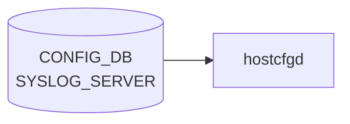

# SYSLOG_SERVER テーブル

## 概要

リモート syslog 送信先を保持する[^1]。`hostcfgd` の `SyslogHandler` がこのテーブルを購読し、`/etc/rsyslog.d/<n>-remote.conf` を生成して `rsyslogd` を再ロードする。

<!-- cdb-mermaid -->
### データフロー (自動生成)



!!! note "凡例"
    CONFIG_DB から SAI までの典型経路を `docs/reference/config-db-orch-map.md` から機械生成したミニ図。詳細・例外は本ページ本文と対応表を参照。
<!-- /cdb-mermaid -->

## key 構造

```text
SYSLOG_SERVER|<server_address>
```

`<server_address>` は `inet:host`（IP アドレスまたはホスト名）。

## フィールド一覧

| フィールド | 型 | 必須 | 説明 |
|-----------|----|------|------|
| `server_address` (key) | `inet:host` | ✅ | サーバアドレス |
| `source` | ip-address | - | 送信元 IP。`server_address` と同 family である `must` |
| `port` | port-number | - | UDP/TCP ポート |
| `vrf` | leafref `VRF.name` または enum (`default`/`mgmt`) | - | 経路 [VRF](../../reference/glossary.md#term-vrf)。`mgmt` 指定時は `MGMT_VRF_CONFIG.mgmtVrfEnabled = true` 必須 (`must`) |
| `filter` | enum `include`/`exclude` | - | フィルタタイプ |
| `filter_regex` | string (`[^\n\r]+`) | - | フィルタ正規表現 |
| `protocol` | enum `tcp`/`udp` | - | 転送プロトコル |
| `severity` | enum `none`/`debug`/`info`/`notice`/`warn`/`error`/`crit` | - | 最低重大度 |

## 関連サブテーブル

- `SYSLOG_CONFIG|GLOBAL`: 全体 syslog 設定（rate limit、format、severity）
    - `format` (welf/standard, default standard)、`welf_firewall_name` (`format != standard` 必須)
- `SYSLOG_CONFIG_FEATURE|<service>` (key: leafref `FEATURE.name`): サービス単位 rate-limit

## 購読者

- `hostcfgd` `SyslogHandler`: rsyslog 設定生成

## 関連 CONFIG_DB / YANG / CLI

- 関連 [CONFIG_DB](../../reference/glossary.md#term-config_db): `VRF`、`MGMT_VRF_CONFIG`、`FEATURE`、`SYSLOG_CONFIG`
- 関連 CLI: `config syslog add/del`
- 関連 [YANG](../../reference/glossary.md#term-yang): `sonic-syslog`

<!-- ref-triangle:start -->

## 関連リファレンス

- [YANG](../../reference/glossary.md#term-yang): [`sonic-syslog`](../yang/sonic-syslog.md)
- CLI: [`config syslog`](../cli/config-syslog.md)

<!-- ref-triangle:end -->

## 引用元

[^1]: [YANG](../../reference/glossary.md#term-yang) 定義: `sonic-syslog.yang`. <https://github.com/sonic-net/sonic-buildimage/blob/9ea932ec2e18f35e58268ec2e4456b1d4afd65cd/src/sonic-yang-models/yang-models/sonic-syslog.yang>

## 関連ページ
- [HLD: Syslog Source IP](../../system/sonic-syslog-source-ip.md)
- [CLI: config syslog](../cli/config-syslog.md)
- [YANG: sonic-syslog](../yang/sonic-syslog.md)

<!-- topics-back-ref -->
## 関連 Topics

- [Topics: Telemetry / SNMP / Observability](../../topics/09-telemetry-snmp/index.md)

<!-- /topics-back-ref -->

<!-- value-behavior -->
## 値依存挙動マトリクス

### `vrf`: `default` / `mgmt` / VRF 名 (leafref)

### `filter` (syslog-filter-type): `include` / `exclude`

### `protocol` (rsyslog-protocol): `tcp` / `udp`

### `severity` (rsyslog-severity): `none` / `debug` / `info` / `notice` / `warn` / `error` / `crit`

| フィールド | 値 | 挙動 |
|-----------|-----|-----|
| `vrf` | `mgmt` | 管理 [VRF](../../reference/glossary.md#term-vrf) 経由。`MGMT_VRF_CONFIG.mgmtVrfEnabled != true` なら YANG must 違反で拒否 |
| `vrf` | `default` | デフォルト [VRF](../../reference/glossary.md#term-vrf) 経由で転送 |
| `filter` | `include` | `filter_regex` にマッチするメッセージのみ転送 |
| `filter` | `exclude` | `filter_regex` にマッチするメッセージを除外して転送 |
| `source` | `server_address` と異なる IP family | YANG must 制約違反で書き込み拒否 |
| `protocol` | `tcp` | rsyslog が TCP で転送。接続失敗時はキュー蓄積 |
| `protocol` | `udp` | rsyslog が UDP で転送。パケットロスあり |
| `severity` | `none` | フィルタなし（全 severity を転送） |

<!-- /value-behavior -->

<!-- cdb-exceptions -->
## 例外条件・特殊挙動

<!-- evidence: sonic-host-services/scripts/hostcfgd@c5bbbe8b07b96f078fa4b761316627404b01bd04 L2417-2415 -->

- **SYSLOG_CONFIG と合算で再評価**: `rsyslog_server_handler()` はエントリの追加/削除/変更のいずれでも `SYSLOG_CONFIG` と `SYSLOG_SERVER` 両テーブルを再取得し `rsyslog-config` サービスを再起動する。サーバ 1 台の変更でも全設定が再生成される点に注意。
- **全エントリ削除時の挙動**: `SYSLOG_SERVER` エントリが 0 件になるとリモート転送設定が空のテンプレートが生成される。ローカルログは継続されるが rsyslog のリモート転送は停止する。
- **rsyslog 再起動失敗時は設定不反映**: `systemctl restart rsyslog-config` が失敗すると `"RSyslogCfg: Failed to restart rsyslog service"` を LOG_ERR してキャッシュを更新せずに return する（次回テーブル変更時に再試行）。
- **IP バリデーションは YANG 層**: key（サーバ IP / ホスト名）の構文チェックは `sonic-syslog.yang` の `inet:ip-address` / `inet:host` 型制約で行われ、`hostcfgd` 層での追加チェックはない。

<!-- /cdb-exceptions -->

<!-- ops-hint -->
## 運用ヒント

### 典型値

- key 形式: `SYSLOG_SERVER|<ip>`。
- `source`: `Loopback0` 等。
- `vrf`: `default` / `mgmt`。
- `port`: 514。

### よくある誤設定

- `vrf: mgmt` で `source` を data-plane IP にすると syslog が出ない。

### 確認コマンド

```bash
sonic-db-cli CONFIG_DB keys 'SYSLOG_SERVER|*'
show syslog
```
<!-- /ops-hint -->

<!-- derivation -->
## 派生・条件付き登録 (Phase 6/7)

### Phase 6: 自動派生

[hostcfgd](../../reference/glossary.md#term-hostcfgd) が `protocol` フィールド値から rsyslog forwarding 形式を自動決定する。`udp` → `@<host>:<port>` 形式、`tcp` → `@@<host>:<port>` 形式。`port` フィールド未設定の場合はデフォルト UDP/514 を補完する。`vrf==mgmt` の場合は VRF バインド設定を自動付与する。

### Phase 7: 条件付き登録 (add_manager 条件)

[hostcfgd](../../reference/glossary.md#term-hostcfgd) は常時起動し `SYSLOG_SERVER` テーブルを無条件購読する。`DEVICE_METADATA.hostname` が必要（hostname ベースのフィルタ設定）。

<!-- /derivation -->

<!-- handler-branching -->
### Phase 8: Handler メソッド内分岐

| Handler | 分岐条件 | 効果 | evidence |
|---|---|---|---|
| `hostcfgd` | `protocol==udp` | rsyslog `@<host>:<port>` 形式 | `hostcfgd.py` |
| `hostcfgd` | `protocol==tcp` | rsyslog `@@<host>:<port>` 形式 | `hostcfgd.py` |
| `hostcfgd` | `vrf==mgmt` | VRF バインド設定を追加 | `hostcfgd.py` |
| `hostcfgd` | `vrf==default` または未設定 | デフォルト VRF で転送 | `hostcfgd.py` |
| `hostcfgd` | `source_interface` フィールドあり | rsyslog source IP 設定 | `hostcfgd.py` |
| `hostcfgd` | サーバ削除 | 対応 rsyslog 設定を削除して reload | `hostcfgd.py` |

> **スキャン証跡**: `SYSLOG_SERVER` はリモート syslog 転送先の設定。`protocol` フィールドと `vrf` フィールドの組み合わせが主要分岐。ポートデフォルト値の補完が Phase 6 相当。

<!-- /handler-branching -->

<!-- failure -->
## 失敗挙動マトリクス (Phase D)

ソース: `rsyslog-config.sh`, `rsyslog.conf.j2`, `hostcfgd` (RSyslogCfg), `config/syslog.py`

### CLI (config syslog add) における失敗経路

| 失敗条件 | 検出箇所 | 結果 | ログ出力 | evidence |
|---|---|---|---|---|
| `server_ip_address` が不正 IP 文字列 | `ip_addr_validator()` L208-211 | `click.UsageError` → CLI エラー終了・DB 書き込みなし | `"Invalid value for {}: {}"` | `syslog.py:208-211` |
| 指定サーバが既に DB に存在（重複 add） | `server_validator()` L186-188 | `click.UsageError` → CLI エラー終了・DB 書き込みなし | `"Invalid value for {}: {} is a valid syslog server"` | `syslog.py:186-188` |
| `source` がループバック/マルチキャスト/リンクローカル IP | `source_validator()` L227-229 | `click.UsageError` → CLI エラー終了・DB 書き込みなし | `"Invalid value for {}: {} is a loopback/multicast/link-local IP address"` | `syslog.py:227-229` |
| `source` と `server_ip_address` の IP ファミリ不一致 | `source_validator()` L233-235 | `click.UsageError` → CLI エラー終了・DB 書き込みなし | `"Invalid value for {} / {}: {} / {} IP address family mismatch"` | `syslog.py:233-235` |
| `vrf` が Linux カーネルに存在しない VRF 名 | `source_to_vrf_validator()` L336-338 | `click.UsageError` → CLI エラー終了・DB 書き込みなし | `"Invalid value for {}: {} VRF doesn't exist in Linux"` | `syslog.py:336-338` |
| `source` IP が指定 VRF のインターフェースに未設定 | `source_to_vrf_validator()` L343-345 | `click.UsageError` → CLI エラー終了・DB 書き込みなし | `"Invalid value for {}: {} IP doesn't exist in Linux {} VRF"` | `syslog.py:343-345` |
| DB 書き込み後の `systemctl restart rsyslog-config` 失敗 | `add()` L423-425 | `log_error` → `ctx.fail()` でCLI エラー終了（DB エントリは既に書き込み済みで残存） | LOG_ERROR: `"Failed to add remote syslog logging: {}"` | `syslog.py:423-425` |

### CLI (config syslog del) における失敗経路

| 失敗条件 | 検出箇所 | 結果 | ログ出力 | evidence |
|---|---|---|---|---|
| 削除対象サーバが DB に不在 | `server_validator()` L182-184 | `click.UsageError` → CLI エラー終了・DB 変更なし | `"Invalid value for {}: {} is not a valid syslog server"` | `syslog.py:182-184` |
| DB 削除後の `systemctl restart rsyslog-config` 失敗 | `delete()` L450-452 | `log_error` → `ctx.fail()` でCLI エラー終了（DB エントリは既に削除済み） | LOG_ERROR: `"Failed to remove remote syslog logging: {}"` | `syslog.py:450-452` |

### hostcfgd RSyslogCfg における失敗経路

| 失敗条件 | 検出箇所 | 結果 | ログ出力 | evidence |
|---|---|---|---|---|
| `systemctl reset-failed rsyslog-config rsyslog` 失敗 | `update_rsyslog_config()` L1732-1733 | 例外 → キャッチ → `return`（キャッシュ未更新、次回テーブル変更時に再試行） | LOG_ERR: `"RSyslogCfg: Failed to restart rsyslog service"` | `hostcfgd:1732-1739` |
| `systemctl restart rsyslog-config` 非ゼロ終了 | `update_rsyslog_config()` L1734-1738 | 同上（`raise_exception=True` で例外 raise → キャッチ → `return`） | LOG_ERR: `"RSyslogCfg: Failed to restart rsyslog service"` | `hostcfgd:1734-1739` |

### rsyslog-config.sh における失敗経路

| 失敗条件 | 検出箇所 | 結果 | ログ出力 | evidence |
|---|---|---|---|---|
| `cp "$TMPFILE" /etc/rsyslog.conf` 失敗 | `rsyslog-config.sh` L64-68 | `stderr` にエラー出力 → `exit 1`（rsyslog 再起動せず前回設定を保持） | `"Failed to update /etc/rsyslog.conf; not restarting rsyslog"` | `rsyslog-config.sh:67-68` |
| `systemctl restart rsyslog` 失敗 | `rsyslog-config.sh` L65 | 非ゼロ終了（明示的エラーハンドリングなし、systemctl の stderr 出力のみ） | なし（systemctl の stderr のみ） | `rsyslog-config.sh:65` |

### YANG バリデーション層における失敗（書き込み前拒否）

| 失敗条件 | 検出箇所 | 結果 | evidence |
|---|---|---|---|
| `server_address` が `inet:host` 型制約違反 | `sonic-syslog.yang` (inet:host) | YANG バリデーション失敗 → DB 書き込みなし | `sonic-syslog.yang` |
| `source` と `server_address` の IP ファミリ不一致 | `sonic-syslog.yang` (must) | YANG `must` 制約違反で書き込み拒否 | `sonic-syslog.yang` |
| `vrf == "mgmt"` かつ `mgmtVrfEnabled != true` | `sonic-syslog.yang` (must) | YANG `must` 制約違反で書き込み拒否 | `sonic-syslog.yang` |

### 補足

- **CLI と [hostcfgd](../../reference/glossary.md#term-hostcfgd) の二重再起動**: `config syslog add/del` が CLI 側で `systemctl restart rsyslog-config` を直接実行し、さらに hostcfgd も SYSLOG_SERVER 変更を検知して同サービスを再起動する。CLI 経由では rsyslog-config が二重再起動される設計。
- **DB 書き込み後 restart 失敗時の不整合**: `add` / `del` は DB 書き込み後に restart を試みる。restart 失敗時は DB と実際の rsyslog 設定が乖離し、次回 hostcfgd による再試行まで古い設定で動作し続ける。
- **hostcfgd の YANG 再チェックなし**: `RSyslogCfg` は受け取ったテーブル値をそのままテンプレートに渡す。不正 IP・ポート値の再バリデーションは行わない（YANG 層で弾かれた前提）。

<!-- /failure -->

<!-- runtime-trace -->
## CDB → 実コンテナ動作トレース

### 段階 1: Consumer 登録

- **hostcfgd**: `SYSLOG_SERVER` テーブルを `ConfigDBConnector` で購読。

### 段階 2: CFG → APPL 翻訳

- hostcfgd の `syslogHandler` がリモート syslog サーバ宛の転送設定を `/etc/rsyslog.d/` に書き込み rsyslog 再起動。

### 段階 3: APPL → SAI

- [SAI](../../reference/glossary.md#term-sai) 経由なし。rsyslog が UDP/TCP 514 番でリモートサーバへ転送。

### 段階 4: タイミング + 副作用

- rsyslog 再起動まで数秒。VRF を使用する場合は rsyslog の VRF バインド設定が必要。

<!-- /runtime-trace -->
<!-- entry-points -->
## 書き込み入り口 (Direction A)

SYSLOG_SERVER テーブルへの書き込みが発生するコード経路を網羅的に調査した結果。

### CLI

  - `config syslog add/del ...` — `config/main.py` または `config/syslog.py` が `set_entry('SYSLOG_SERVER', ...)` を呼ぶ ([sonic-utilities](../../reference/glossary.md#term-sonic-utilities)/config/main.py, config/syslog.py)

### minigraph / sonic-cfggen

**minigraph.py** が `<SyslogServer>` タグから SYSLOG_SERVER エントリを生成 ([sonic-buildimage](../../reference/glossary.md#term-sonic-buildimage)/src/sonic-config-engine/minigraph.py)

### REST / gNMI

REST/[gNMI](../../reference/glossary.md#term-gnmi) 書き込み経路なし

### db_migrator

db_migrator.py での SYSLOG_SERVER マイグレーションなし

### ビルド時デフォルト (build-time default)

なし

### ハードコードデフォルト / ランタイム注入

なし

### 死活・デッドコード

なし
<!-- /entry-points -->

<!-- side-effects -->
## 副次 DB 書込 (Phase F)

[CONFIG_DB](../../reference/glossary.md#term-config_db) `SYSLOG_SERVER` テーブルの変更に伴って `hostcfgd` の `RSyslogCfg` ハンドラが副次的に書き込む DB エントリは **存在しない**。副作用はすべて Linux ホスト OS のファイル書き換えおよび systemd サービス制御に閉じる。

| 副次 DB | 書込有無 | 根拠 |
|---|---|---|
| [APPL_DB](../../reference/glossary.md#term-appl_db) | なし | `RSyslogCfg.update_rsyslog_config()` 内に Producer/Table 書込呼出なし (`sonic-host-services/scripts/hostcfgd:1715-1743`) |
| [STATE_DB](../../reference/glossary.md#term-state_db) | なし | `hostcfgd` の `STATE_DB` 参照は `FipsCfg` (`hostcfgd:1759`) と `RestartWaiter` 用 (`hostcfgd:2160`) のみ。`RSyslogCfg` は `state_db_conn` を保持しない |
| [COUNTERS_DB](../../reference/glossary.md#term-counters_db) | なし | `hostcfgd` 全体に [COUNTERS_DB](../../reference/glossary.md#term-counters_db) 参照なし。syslog 転送経路は [SAI](../../reference/glossary.md#term-sai) を経由しない |
| [ASIC_DB](../../reference/glossary.md#term-asic_db) / [FLEX_COUNTER_DB](../../reference/glossary.md#term-flex_counter_db) | なし | [SAI](../../reference/glossary.md#term-sai) 非経由。rsyslog は UDP/TCP でリモートサーバへ直接転送 |

### 実際の副作用（ファイル書換 + systemd 制御）

`RSyslogCfg.update_rsyslog_config()` がトリガされると以下の順序でホスト OS への書込が発生する。

```
SYSLOG_SERVER SET/DEL (CONFIG_DB)
  └─ hostcfgd rsyslog_server_handler()
       └─ RSyslogCfg.update_rsyslog_config()
            ├─ systemctl reset-failed rsyslog-config rsyslog
            └─ systemctl restart rsyslog-config
                 └─ /usr/bin/rsyslog-config.sh
                      ├─ sonic-cfggen -d -t rsyslog.conf.j2 → /tmp/rsyslog.conf.XXXXXX (一時ファイル)
                      ├─ cmp /tmp/rsyslog.conf.XXXXXX /etc/rsyslog.conf
                      │    ├─ 差分あり → cp /tmp/rsyslog.conf.XXXXXX /etc/rsyslog.conf  ← ファイル書込
                      │    │               systemctl restart rsyslog              ← サービス再起動
                      │    └─ 差分なし → systemctl kill -s HUP rsyslog            ← SIGHUP のみ
                      └─ rm /tmp/rsyslog.conf.XXXXXX
```

| 副作用 | 対象 | 条件 |
|--------|------|------|
| `/etc/rsyslog.conf` 上書き | ホスト OS ファイルシステム | 設定内容が変化した場合のみ |
| `rsyslog-config.service` 再起動 | systemd | `SYSLOG_SERVER` または `SYSLOG_CONFIG` のキャッシュ差分があるとき |
| `rsyslog.service` 再起動 | systemd | `/etc/rsyslog.conf` に差分があるとき |
| `rsyslog.service` SIGHUP | systemd | `/etc/rsyslog.conf` に差分がないとき（ログファイル再オープン目的） |

> **evidence**: `sonic-buildimage/files/image_config/rsyslog/rsyslog-config.sh`、`sonic-host-services/scripts/hostcfgd:1715-1743`

<!-- /side-effects -->

<!-- pubsub -->
## 通信メカニズム (Phase G)

### CONFIG_DB 購読 API

`hostcfgd` は `swsscommon.ConfigDBConnector` の `subscribe()` で `SYSLOG_SERVER` テーブルを購読する。`ConsumerStateTable`（channel ベース）は使用しない。

```python
# sonic-host-services/scripts/hostcfgd L2499-2503
# Handle SYSLOG_CONFIG and SYSLOG_SERVER changes
self.config_db.subscribe(swsscommon.CFG_SYSLOG_CONFIG_TABLE_NAME,
                         make_callback(self.rsyslog_config_handler))
self.config_db.subscribe(swsscommon.CFG_SYSLOG_SERVER_TABLE_NAME,
                         make_callback(self.rsyslog_server_handler))
```

- `ConfigDBConnector.listen()` が内部で [Redis](../../reference/glossary.md#term-redis) **keyspace 通知** (`__keyspace@4__:SYSLOG_SERVER|*` への PSUBSCRIBE) を購読する。
- `SYSLOG_SERVER` と `SYSLOG_CONFIG` を独立して登録するが、両ハンドラとも同じ `rsyslog_handler()` を呼び、**両テーブルを一括再取得**してキャッシュ比較後に `systemctl restart rsyslog-config` を発行する。

### ハンドラ呼び出しフロー

```
SYSLOG_SERVER|<ip> 変更 (hset/del)
  → keyspace 通知 (__keyspace@4__:SYSLOG_SERVER|<ip>)
  → rsyslog_server_handler(key, op, data)          # hostcfgd L2417-2419
  → rsyslog_handler()                              # hostcfgd L2410-2415
      → get_table(SYSLOG_CONFIG) + get_table(SYSLOG_SERVER)
      → RSyslogCfg.update_rsyslog_config()         # L1715-1743
          → キャッシュ差分あり → systemctl restart rsyslog-config
```

### rsyslog SIGHUP / restart 経路

`rsyslog-config.service` の `ExecStart=/usr/bin/rsyslog-config.sh` が実際の設定反映を行う。

```bash
# sonic-buildimage/files/image_config/rsyslog/rsyslog-config.sh L58-73
sonic-cfggen -d -t rsyslog.conf.j2 ... > "$TMPFILE"

if [ ! -f /etc/rsyslog.conf ] || ! cmp -s "$TMPFILE" /etc/rsyslog.conf; then
    cp "$TMPFILE" /etc/rsyslog.conf
    systemctl restart rsyslog      # 設定変更あり → rsyslogd 完全再起動
else
    systemctl kill -s HUP rsyslog  # 設定変更なし → SIGHUP のみ（ログファイル再オープン）
fi
```

| 状況 | 操作 | 意味 |
|------|------|------|
| `/etc/rsyslog.conf` 変化あり | `systemctl restart rsyslog` | rsyslogd プロセス完全再起動（設定全再読込） |
| `/etc/rsyslog.conf` 変化なし | `systemctl kill -s HUP rsyslog` | SIGHUP でログファイル再オープン（ログローテーション対応）のみ |

!!! note "SIGHUP の役割"
    SIGHUP は「設定変更なし時」のログローテーション対応専用。通常の設定反映は `systemctl restart rsyslog` が担う。`hostcfgd` 自身は SIGHUP を受信しても無視する（L111-112）。

### keyspace 通知パターン

| [Redis](../../reference/glossary.md#term-redis) keyspace 通知 | hostcfgd ハンドラ |
|---------------------|------------------|
| `__keyspace@4__:SYSLOG_SERVER\|192.168.1.1` `hset` | `rsyslog_server_handler("192.168.1.1", SET, {...})` |
| `__keyspace@4__:SYSLOG_SERVER\|192.168.1.1` `del` | `rsyslog_server_handler("192.168.1.1", DEL, {})` |
| `__keyspace@4__:SYSLOG_CONFIG\|GLOBAL` `hset` | `rsyslog_config_handler("GLOBAL", SET, {...})` |

- [APPL_DB](../../reference/glossary.md#term-appl_db) / [STATE_DB](../../reference/glossary.md#term-state_db) への中継なし。SAI 経路なし。
- 経路: [CONFIG_DB](../../reference/glossary.md#term-config_db) → hostcfgd (keyspace 通知) → rsyslog-config.service → rsyslogd restart/SIGHUP

<!-- /pubsub -->

<!-- constants -->
## ハードコード定数 (Phase E)

`rsyslog.conf.j2` および `rsyslog-config.sh` に直接埋め込まれた定数。CONFIG_DB フィールドや YANG で変更不可。

### ポート・プロトコルデフォルト定数 (rsyslog.conf.j2)

| 定数 / 用途 | 値 | ソース |
|------------|-----|--------|
| デフォルト UDP ポート | **514** | `rsyslog.conf.j2` L89: `conf.get('port', 514)` |
| デフォルトプロトコル | **`udp`** | `rsyslog.conf.j2` L90: `conf.get('protocol', 'udp')` |
| デフォルト VRF | **`default`** | `rsyslog.conf.j2` L91: `conf.get('vrf', 'default')` → `device` を付与しない |

### プロトコル enum 文字列定数 (rsyslog.conf.j2)

`protocol` フィールドの値は以下の 2 択のみ。Jinja2 テンプレートは値をそのまま `Protocol=` オプションに渡す。

| 値 | rsyslog Action オプション | 効果 |
|----|--------------------------|------|
| `udp` | `Protocol="udp"` | rsyslog omfwd が UDP で転送。パケットロスあり。 |
| `tcp` | `Protocol="tcp"` | rsyslog omfwd が TCP で転送。接続失敗時はキュー蓄積。 |

`@` / `@@` 形式は古い rsyslog レガシー構文。現実装 (`rsyslog.conf.j2`) は `omfwd` アクション + `Protocol=` オプション形式を使用する。

### 受信ポート定数 (rsyslog.conf.j2)

rsyslog がローカルで待ち受けるポートは固定値でハードコードされている。

| ポート | プロトコル | 用途 | ソース |
|-------|-----------|------|--------|
| **514** | UDP | コンテナ → ホスト syslog 受信 (`imudp`) | `rsyslog.conf.j2` L31 |
| **2514** | RELP | コンテナ → ホスト RELP syslog 受信 (`imrelp`) | `rsyslog.conf.j2` L42 |

### Action 固定オプション定数 (rsyslog.conf.j2 L124)

リモート転送 `action()` に常時付与されるハードコードオプション。CONFIG_DB で変更不可。

| rsyslog オプション | 固定値 | 意味 |
|-------------------|--------|------|
| `action.resumeRetryCount` | **`"60"`** | 接続失敗時の再試行上限 |
| `queue.type` | **`"LinkedList"`** | 転送キュータイプ |
| `queue.size` | **`"20000"`** | 転送キューサイズ（メッセージ数） |

### VRF 判定文字列定数 (rsyslog.conf.j2 L97)

```jinja2

```

- `'default'` および空文字列は「VRF バインドなし」と判定される文字列定数。
- `'mgmt'` や任意 VRF 名の場合は `Device="<vrf>"` オプションを付与。

<!-- evidence: sonic-buildimage/files/image_config/rsyslog/rsyslog.conf.j2 L84-125 -->
<!-- evidence: sonic-buildimage/files/image_config/rsyslog/rsyslog-config.sh -->
<!-- /constants -->

<!-- defaults -->
## 暗黙デフォルト (Phase A)

YANG に `default` 宣言がなく、コード（Jinja2 テンプレート）側でフォールバックが注入されるフィールド一覧。

| フィールド | YANG default | コード由来暗黙デフォルト | 根拠 |
|-----------|-------------|------------------------|------|
| `port` | なし | **514** | `rsyslog.conf.j2` L89: `conf.get('port', 514)` |
| `protocol` | なし | **`udp`** | `rsyslog.conf.j2` L90: `conf.get('protocol', 'udp')` → rsyslog `Protocol="udp"` |
| `vrf` | なし | **`default`** | `rsyslog.conf.j2` L91: `conf.get('vrf', 'default')` → `Device=` オプション付与なし |
| `severity` | なし (per-server) | **3段階カスケード** (下記参照) | `rsyslog.conf.j2` L92 |
| `source` | なし | **省略**（rsyslog がルーティングに従い自動選択） | `if source:` ガード → `Address=` 非出力 |
| `filter` / `filter_regex` | なし | **省略**（全メッセージ転送） | `` ガード → フィルタ行非出力 |

### `severity` 3段階カスケード

```
per-server severity 設定あり
  → そのまま使用
per-server 未設定 かつ SYSLOG_CONFIG|GLOBAL.severity 設定あり
  → GLOBAL severity を使用（YANG default: notice）
per-server 未設定 かつ SYSLOG_CONFIG|GLOBAL 未設定
  → rsyslog の `*`（全 severity）にフォールバック
```

**YANG-実装 discrepancy**: YANG の per-server `severity` leaf は `default` なしだが、テンプレートは `SYSLOG_CONFIG.GLOBAL.severity`（YANG default `notice`）を暗黙継承するため、`SYSLOG_CONFIG.GLOBAL` が存在する場合は per-server 未設定でも実質 `notice` として動作する。

### ハードコード固定値（設定不可）

以下の値は CONFIG_DB フィールドなし・YANG 未定義で `rsyslog.conf.j2` にハードコードされており、ユーザは変更不可:

| rsyslog オプション | 固定値 | 意味 |
|-------------------|--------|------|
| `action.resumeRetryCount` | `60` | 接続失敗時の再試行上限 |
| `queue.type` | `LinkedList` | 転送キュータイプ |
| `queue.size` | `20000` | 転送キューサイズ（メッセージ数） |

### VRF + source 組み合わせ依存挙動

`rsyslog.conf.j2` L113: `source` フィールドが設定されている場合、`device='eth0'` なら `device` を空にクリアする。  
`vrf='mgmt'` かつ `source=<eth0 IP>` の組み合わせでは mgmt VRF の `Device=` バインドが消去される。

<!-- evidence: sonic-buildimage/files/image_config/rsyslog/rsyslog.conf.j2 L84-125 -->
<!-- evidence: sonic-host-services/scripts/hostcfgd L1695-1743 (RSyslogCfg) -->
<!-- /defaults -->

<!-- ordering -->
## 書込み順依存 (Phase B)

`hostcfgd` (`RSyslogCfg`) は `SYSLOG_SERVER` と `SYSLOG_CONFIG` の **両テーブルをまとめて再読込** して `rsyslog-config.service` を再起動する。このため書込み順序が中間状態の整合性に直結する。

### systemd 起動順序

```
config-setup.service (Requires/After)
  └─ rsyslog-config.service
       ├─ After=config-setup.service
       ├─ After=sonic.target
       └─ After=interfaces-config.service
            └─ ExecStart=/usr/bin/rsyslog-config.sh
                 └─ sonic-cfggen -d -t rsyslog.conf.j2 → /etc/rsyslog.conf
                      └─ systemctl restart rsyslog
```

`rsyslog-config.service` は `config-setup.service` 完了後かつ `interfaces-config.service` 完了後に起動する。インターフェース設定（`source` フィールド向け送信元 IP や VRF デバイス名）が確定してから rsyslog.conf が生成される。

### hostcfgd ロード時の順序

```
HostConfigDaemon.load(init_data)
  │
  ├─ load_independent_config()   # AAA/TACACS/RADIUS/LDAP（systemd 待機前）
  │
  ├─ wait_till_system_init_done()  # systemctl is-system-running --wait
  │
  ├─ rsyslogcfg.load(syslog_cfg, syslog_srv)   # L2269
  │   └─ キャッシュに SYSLOG_CONFIG + SYSLOG_SERVER を格納（サービス再起動なし）
  │
  └─ register_callbacks()
      ├─ subscribe(SYSLOG_CONFIG, rsyslog_config_handler)   # L2500-2501
      └─ subscribe(SYSLOG_SERVER, rsyslog_server_handler)   # L2502-2503
```

### 検出された順序依存

| # | 依存関係 | 方向 | 緩和策 |
|---|----------|------|--------|
| 1 | `SYSLOG_CONFIG` を先書き → `SYSLOG_SERVER` 追加 | 推奨（中間状態最小化） | runtime は両テーブルを再読込するため最終的に整合 |
| 2 | `MGMT_VRF_CONFIG.mgmtVrfEnabled=true` → `SYSLOG_SERVER.<key>.vrf=mgmt` | **先行必須**（YANG must 違反で書き込み拒否） | YANG バリデーション層で reject |
| 3 | `VRF.<name>` 作成 → `SYSLOG_SERVER.<key>.vrf=<name>` (leafref) | **先行必須**（YANG leafref 参照未解決で reject） | YANG バリデーション層で reject |
| 4 | サーバ変更 or 削除 → `rsyslog-config.service` 再起動 | 原子操作なし（再起動中は旧設定）| `RemainAfterExit=yes` で完了状態を保持 |
| 5 | 複数 `SYSLOG_SERVER` エントリ追加 | 順序不問（全エントリを一括再生成） | `update_rsyslog_config()` はキャッシュ比較後に一括適用 |

### 主要な制約詳細

**VRF 先行必須（依存 #2/#3）**: `vrf=mgmt` を使用する場合は `MGMT_VRF_CONFIG|mgmtVrfEnabled=true` を先に設定すること。YANG `must` 制約が DB 書き込み時に評価されるため、VRF 未設定のままサーバエントリを追加しようとすると CLI/REST いずれからも reject される。VRF 名を leafref で参照する場合は `VRF` テーブルのエントリ作成が先行必須。

**SYSLOG_CONFIG と SYSLOG_SERVER の結合再生成（依存 #1/#5）**: `rsyslog_server_handler()` は `SYSLOG_SERVER` への変更（追加・削除・変更）をトリガーに `SYSLOG_CONFIG` テーブルも再取得してから `rsyslog-config.service` を再起動する。これは `severity` の 3 段階カスケード（per-server → GLOBAL → rsyslog デフォルト）を正しく計算するために両テーブルが必要なため。`SYSLOG_SERVER` を追加する前に `SYSLOG_CONFIG|GLOBAL` の設定（特に `severity`）を確定させることを推奨する。

**再起動中の中間状態（依存 #4）**: `rsyslog-config.service` 再起動中（`rsyslog.conf.j2` テンプレート展開 + `systemctl restart rsyslog`）の数秒間はリモート転送が停止する。複数サーバを追加する場合は一括での `config reload` を利用することでサービス再起動回数を 1 回に抑制できる。

<!-- /ordering -->

<!-- cross-refs -->
## 暗黙参照 — rsyslog 設定生成時に参照される CONFIG_DB テーブル (Phase C)

`SYSLOG_SERVER` エントリが変化すると `hostcfgd` の `rsyslog_server_handler` が `rsyslog_handler()` を呼び出し、`SYSLOG_CONFIG` と `SYSLOG_SERVER` の**両テーブルを再取得**して `rsyslog-config.service` を restart する。さらに起動された `rsyslog-config.sh` が `sonic-db-cli` で `DEVICE_METADATA|localhost` を直接参照する。この二段階の暗黙参照が存在する。

### CONFIG_DB レベル — 共同再取得

`rsyslog_handler()` (hostcfgd:2410-2415) は `SYSLOG_SERVER` イベントを契機に呼ばれるが、`SYSLOG_CONFIG` テーブルも必ず読み直す。

```python
# hostcfgd:2410-2415
def rsyslog_handler(self):
    rsyslog_config = self.config_db.get_table(CFG_SYSLOG_CONFIG_TABLE_NAME)
    rsyslog_servers = self.config_db.get_table(CFG_SYSLOG_SERVER_TABLE_NAME)
    self.rsyslogcfg.update_rsyslog_config(rsyslog_config, rsyslog_servers)
```

| テーブル | 参照タイミング | 用途 | evidence |
|---|---|---|---|
| `SYSLOG_CONFIG` | `rsyslog_server_handler` 経由で毎回 | `GLOBAL.severity` / `rate_limit_interval` / `rate_limit_burst` / `format` / `welf_firewall_name` を `rsyslog.conf.j2` に渡す | hostcfgd:2410-2415 / rsyslog.conf.j2:16-18,51-52 |

> **影響**: `SYSLOG_SERVER` を 1 エントリ追加するだけで全体設定が再生成される。`SYSLOG_CONFIG` 側の値がその時点で確定していない場合は意図しないデフォルト値で rsyslog が再生成される。

### `DEVICE_METADATA` (rsyslog-config.sh 経由)

`hostcfgd` が `systemctl restart rsyslog-config` を発行すると `rsyslog-config.sh` が起動し、`sonic-db-cli HGET` で `DEVICE_METADATA|localhost` の以下フィールドを読む。

| フィールド | 変数名 | 用途 | evidence |
|---|---|---|---|
| `platform` | `$PLATFORM` | [ASIC](../../reference/glossary.md#term-asic) 設定ファイルのパス決定 → Multi-[NPU](../../reference/glossary.md#term-npu) 判定 (複数 [ASIC](../../reference/glossary.md#term-asic) 時は `docker0` IP をリッスン) | rsyslog-config.sh:3,6-8,15-18 |
| `syslog_with_osversion` | `$syslog_with_osversion` | `true` の場合 rsyslog フォーマットを `SONiCForwardFormatWithOsVersion` に変更（OS バージョン付き） | rsyslog-config.sh:28-31 / rsyslog.conf.j2:63,65-69 |
| `syslog_counter` | `$syslog_counter` | `true` の場合 `omprog` モジュール + `/usr/bin/syslog-counter` が有効化 | rsyslog-config.sh:38-41 / rsyslog.conf.j2:25-27,127-129 |

> `hostname` は `hostname` コマンドで OS から直接取得する (rsyslog-config.sh:26)。`DEVICE_METADATA.localhost.hostname` は CONFIG_DB 経由では読まれないが、システム hostname と一致する前提で動作する。

### `MGMT_VRF_CONFIG` / `MGMT_INTERFACE` (VRF バインド前提条件)

`SYSLOG_SERVER` エントリの `vrf` フィールドを `mgmt` に設定すると rsyslog が `Device="mgmt"` でパケットを発出する。この動作は `MGMT_VRF_CONFIG.mgmtVrfEnabled == true` を前提とする (`sonic-syslog.yang` の `must` 制約)。`hostcfgd` の `RSyslogCfg` は `MGMT_VRF_CONFIG` を直接 `get_table` しないが、YANG バリデーション層でのエントリ受け付けが前提条件となる。

| テーブル | 参照種別 | 効果 | evidence |
|---|---|---|---|
| `MGMT_VRF_CONFIG.mgmtVrfEnabled` | YANG `must` 制約 | `vrf==mgmt` エントリは `mgmtVrfEnabled==true` が前提。違反時は YANG バリデーションで拒否 | sonic-syslog.yang |
| `MGMT_INTERFACE` | ルーティング依存（間接） | `vrf==mgmt` 時に rsyslog が `Device=mgmt` で発出する宛先インターフェース | rsyslog.conf.j2:116-118 |

### 範囲外 (誤解されやすい隣接テーブル)

- **`VRF`**: `vrf` フィールドが `VRF.name` への leafref だが、`RSyslogCfg` は `VRF` テーブルを `get_table` しない。YANG 制約レベルのみ
- **`FEATURE`**: `SYSLOG_CONFIG_FEATURE` が leafref で参照するが、rsyslog 設定生成パスで直接読まれない
- **`DEVICE_METADATA.localhost.hostname`**: rsyslog-config.sh は `hostname` コマンドを使い CONFIG_DB から直接読まない

詳細スキャン手順と grep 結果は `meta/_intermediate/cdb-flow/syslog-server-cross-refs.md` を参照。
<!-- /cross-refs -->

<!-- platform -->
## プラットフォーム差異 (Phase H)

rsyslog 設定生成スクリプト (`rsyslog-config.sh`) および Jinja2 テンプレートに含まれるプラットフォーム固有分岐を示す。

### Multi-ASIC プラットフォーム差異

`rsyslog-config.sh` は起動時に `DEVICE_METADATA|localhost` の `platform` フィールドから `asic.conf` を読み込み、`NUM_ASIC` 値に応じて rsyslog 受信 IP アドレスを切り替える。

| 条件 | `udp_server_ip` の決定方法 | 理由 |
|------|--------------------------|------|
| `NUM_ASIC == 1`（シングル [NPU](../../reference/glossary.md#term-npu)） | `lo` (loopback) の先頭 IPv4 アドレス | コンテナがホストの loopback 経由で syslog を送信するため |
| `NUM_ASIC > 1`（マルチ [NPU](../../reference/glossary.md#term-npu)） | `docker0` の IPv4 アドレス | ネットワーク namespace 内のコンテナが docker0 ブリッジ経由で syslog を送信するため |

また、`rsyslog.conf.j2` は `docker0_ip` 変数が非空かつ `udp_server_ip` と異なる場合にのみ、`docker0` 上への追加 UDP/RELP 受信設定を出力する。シングル NPU では `docker0_ip` は空のままとなる（`dhcp_server` Feature が有効な場合を除く）。

```bash
# rsyslog-config.sh L15-18
if [[ ($NUM_ASIC -gt 1) ]]; then
    udp_server_ip=$(ip -o -4 addr list docker0 | awk '{print $4}' | cut -d/ -f1)
else
    udp_server_ip=$(ip -j -4 addr list lo scope host | jq -r -M '.[0].addr_info[0].local')
fi
```

<!-- evidence: sonic-buildimage/files/image_config/rsyslog/rsyslog-config.sh L3-19 -->

### コンテナ内 rsyslog のプラットフォームフィルタ (pmon)

`rsyslog-container.conf.j2` は `pmon` コンテナ向けに Mellanox 特定プラットフォーム (MSN2700 / MSN2700a1 / MSN2410) 上で PSU ファームウェアに起因するノイズログを抑制するフィルタを適用する。このフィルタは `pmon` コンテナに限定される。SYSLOG_SERVER テーブルのリモート転送設定には影響しない。

```jinja2
# rsyslog-container.conf.j2 L54-56
if ($.PLATFORM == "x86_64-mlnx_msn2700-r0" or $.PLATFORM == "x86_64-mlnx_msn2700a1-r0"
    or $.PLATFORM == "x86_64-mlnx_msn2410-r0") then {
    if $programname contains "sensord" and $msg contains "Error getting sensor data: dps460/#" then stop
}
```

<!-- evidence: sonic-buildimage/files/image_config/rsyslog/rsyslog-container.conf.j2 L44-57 -->

### SmartSwitch / DPU

ソースコード調査の結果、[SmartSwitch](../../reference/glossary.md#term-smartswitch) [DPU](../../reference/glossary.md#term-dpu) 固有の rsyslog 設定生成ロジックは確認されなかった。[DPU](../../reference/glossary.md#term-dpu) 上でも同一の `rsyslog-config.sh` + `rsyslog.conf.j2` が使用される。[DPU](../../reference/glossary.md#term-dpu) の `NUM_ASIC` は通常 1 であるため、シングル NPU と同等の loopback 受信設定となる。

<!-- /platform -->

<!-- glossary-links-injected: 02f6c7cb23dd -->
