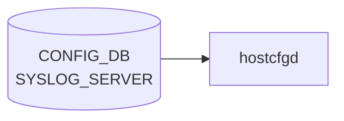

# SYSLOG_SERVER テーブル

## 概要

リモート syslog 送信先を保持する[^1]。`hostcfgd` の `SyslogHandler` がこのテーブルを購読し、`/etc/rsyslog.d/<n>-remote.conf` を生成して `rsyslogd` を再ロードする。

<!-- cdb-mermaid -->
### データフロー (自動生成)



!!! note "凡例"
    CONFIG_DB から SAI までの典型経路を `docs/reference/config-db-orch-map.md` から機械生成したミニ図。詳細・例外は本ページ本文と対応表を参照。
<!-- /cdb-mermaid -->

## key 構造

```text
SYSLOG_SERVER|<server_address>
```

`<server_address>` は `inet:host`（IP アドレスまたはホスト名）。

## フィールド一覧

| フィールド | 型 | 必須 | 説明 |
|-----------|----|------|------|
| `server_address` (key) | `inet:host` | ✅ | サーバアドレス |
| `source` | ip-address | - | 送信元 IP。`server_address` と同 family である `must` |
| `port` | port-number | - | UDP/TCP ポート |
| `vrf` | leafref `VRF.name` または enum (`default`/`mgmt`) | - | 経路 [VRF](../../reference/glossary.md#term-vrf)。`mgmt` 指定時は `MGMT_VRF_CONFIG.mgmtVrfEnabled = true` 必須 (`must`) |
| `filter` | enum `include`/`exclude` | - | フィルタタイプ |
| `filter_regex` | string (`[^\n\r]+`) | - | フィルタ正規表現 |
| `protocol` | enum `tcp`/`udp` | - | 転送プロトコル |
| `severity` | enum `none`/`debug`/`info`/`notice`/`warn`/`error`/`crit` | - | 最低重大度 |

## 関連サブテーブル

- `SYSLOG_CONFIG|GLOBAL`: 全体 syslog 設定（rate limit、format、severity）
    - `format` (welf/standard, default standard)、`welf_firewall_name` (`format != standard` 必須)
- `SYSLOG_CONFIG_FEATURE|<service>` (key: leafref `FEATURE.name`): サービス単位 rate-limit

## 購読者

- `hostcfgd` `SyslogHandler`: rsyslog 設定生成

## 関連 CONFIG_DB / YANG / CLI

- 関連 [CONFIG_DB](../../reference/glossary.md#term-config_db): `VRF`、`MGMT_VRF_CONFIG`、`FEATURE`、`SYSLOG_CONFIG`
- 関連 CLI: `config syslog add/del`
- 関連 [YANG](../../reference/glossary.md#term-yang): `sonic-syslog`

<!-- ref-triangle:start -->

## 関連リファレンス

- [YANG](../../reference/glossary.md#term-yang): [`sonic-syslog`](../yang/sonic-syslog.md)
- CLI: [`config syslog`](../cli/config-syslog.md)

<!-- ref-triangle:end -->

## 引用元

[^1]: [YANG](../../reference/glossary.md#term-yang) 定義: `sonic-syslog.yang`. <https://github.com/sonic-net/sonic-buildimage/blob/9ea932ec2e18f35e58268ec2e4456b1d4afd65cd/src/sonic-yang-models/yang-models/sonic-syslog.yang>

## 関連ページ
- [HLD: Syslog Source IP](../../system/sonic-syslog-source-ip.md)
- [CLI: config syslog](../cli/config-syslog.md)
- [YANG: sonic-syslog](../yang/sonic-syslog.md)

<!-- topics-back-ref -->
## 関連 Topics

- [Topics: Telemetry / SNMP / Observability](../../topics/09-telemetry-snmp/index.md)

<!-- /topics-back-ref -->

<!-- value-behavior -->
## 値依存挙動マトリクス

### `vrf`: `default` / `mgmt` / VRF 名 (leafref)

### `filter` (syslog-filter-type): `include` / `exclude`

### `protocol` (rsyslog-protocol): `tcp` / `udp`

### `severity` (rsyslog-severity): `none` / `debug` / `info` / `notice` / `warn` / `error` / `crit`

| フィールド | 値 | 挙動 |
|-----------|-----|-----|
| `vrf` | `mgmt` | 管理 [VRF](../../reference/glossary.md#term-vrf) 経由。`MGMT_VRF_CONFIG.mgmtVrfEnabled != true` なら YANG must 違反で拒否 |
| `vrf` | `default` | デフォルト [VRF](../../reference/glossary.md#term-vrf) 経由で転送 |
| `filter` | `include` | `filter_regex` にマッチするメッセージのみ転送 |
| `filter` | `exclude` | `filter_regex` にマッチするメッセージを除外して転送 |
| `source` | `server_address` と異なる IP family | YANG must 制約違反で書き込み拒否 |
| `protocol` | `tcp` | rsyslog が TCP で転送。接続失敗時はキュー蓄積 |
| `protocol` | `udp` | rsyslog が UDP で転送。パケットロスあり |
| `severity` | `none` | フィルタなし（全 severity を転送） |

<!-- /value-behavior -->

<!-- cdb-exceptions -->
## 例外条件・特殊挙動

<!-- evidence: sonic-host-services/scripts/hostcfgd@c5bbbe8b07b96f078fa4b761316627404b01bd04 L2417-2415 -->

- **SYSLOG_CONFIG と合算で再評価**: `rsyslog_server_handler()` はエントリの追加/削除/変更のいずれでも `SYSLOG_CONFIG` と `SYSLOG_SERVER` 両テーブルを再取得し `rsyslog-config` サービスを再起動する。サーバー 1 台の変更でも全設定が再生成される点に注意。
- **全エントリ削除時の挙動**: `SYSLOG_SERVER` エントリが 0 件になるとリモート転送設定が空のテンプレートが生成される。ローカルログは継続されるが rsyslog のリモート転送は停止する。
- **rsyslog 再起動失敗時は設定不反映**: `systemctl restart rsyslog-config` が失敗すると `"RSyslogCfg: Failed to restart rsyslog service"` を LOG_ERR してキャッシュを更新せずに return する（次回テーブル変更時に再試行）。
- **IP バリデーションは YANG 層**: key（サーバー IP / ホスト名）の構文チェックは `sonic-syslog.yang` の `inet:ip-address` / `inet:host` 型制約で行われ、`hostcfgd` 層での追加チェックはない。

<!-- /cdb-exceptions -->

<!-- ops-hint -->
## 運用ヒント

### 典型値

- key 形式: `SYSLOG_SERVER|<ip>`。
- `source`: `Loopback0` 等。
- `vrf`: `default` / `mgmt`。
- `port`: 514。

### よくある誤設定

- `vrf: mgmt` で `source` を data-plane IP にすると syslog が出ない。

### 確認コマンド

```bash
sonic-db-cli CONFIG_DB keys 'SYSLOG_SERVER|*'
show syslog
```
<!-- /ops-hint -->


<!-- derivation -->
## 派生・条件付き登録 (Phase 6/7)

### Phase 6: 自動派生

hostcfgd が `protocol` フィールド値から rsyslog forwarding 形式を自動決定する。`udp` → `@<host>:<port>` 形式、`tcp` → `@@<host>:<port>` 形式。`port` フィールド未設定の場合はデフォルト UDP/514 を補完する。`vrf==mgmt` の場合は VRF バインド設定を自動付与する。

### Phase 7: 条件付き登録 (add_manager 条件)

hostcfgd は常時起動し `SYSLOG_SERVER` テーブルを無条件購読する。`DEVICE_METADATA.hostname` が必要（hostname ベースのフィルタ設定）。

<!-- /derivation -->

<!-- handler-branching -->
### Phase 8: Handler メソッド内分岐

| Handler | 分岐条件 | 効果 | evidence |
|---|---|---|---|
| `hostcfgd` | `protocol==udp` | rsyslog `@<host>:<port>` 形式 | `hostcfgd.py` |
| `hostcfgd` | `protocol==tcp` | rsyslog `@@<host>:<port>` 形式 | `hostcfgd.py` |
| `hostcfgd` | `vrf==mgmt` | VRF バインド設定を追加 | `hostcfgd.py` |
| `hostcfgd` | `vrf==default` または未設定 | デフォルト VRF で転送 | `hostcfgd.py` |
| `hostcfgd` | `source_interface` フィールドあり | rsyslog source IP 設定 | `hostcfgd.py` |
| `hostcfgd` | サーバー削除 | 対応 rsyslog 設定を削除して reload | `hostcfgd.py` |

> **スキャン証跡**: `SYSLOG_SERVER` はリモート syslog 転送先の設定。`protocol` フィールドと `vrf` フィールドの組み合わせが主要分岐。ポートデフォルト値の補完が Phase 6 相当。

<!-- /handler-branching -->

<!-- runtime-trace -->
## CDB → 実コンテナ動作トレース

### 段階 1: Consumer 登録

- **hostcfgd**: `SYSLOG_SERVER` テーブルを `ConfigDBConnector` で購読。

### 段階 2: CFG → APPL 翻訳

- hostcfgd の `syslogHandler` がリモート syslog サーバ宛の転送設定を `/etc/rsyslog.d/` に書き込み rsyslog 再起動。

### 段階 3: APPL → SAI

- SAI 経由なし。rsyslog が UDP/TCP 514 番でリモートサーバへ転送。

### 段階 4: タイミング + 副作用

- rsyslog 再起動まで数秒。VRF を使用する場合は rsyslog の VRF バインド設定が必要。

<!-- /runtime-trace -->
<!-- entry-points -->
## 書き込み入り口 (Direction A)

SYSLOG_SERVER テーブルへの書き込みが発生するコード経路を網羅的に調査した結果。

### CLI

  - `config syslog add/del ...` — `config/main.py` または `config/syslog.py` が `set_entry('SYSLOG_SERVER', ...)` を呼ぶ (sonic-utilities/config/main.py, config/syslog.py)

### minigraph / sonic-cfggen

**minigraph.py** が `<SyslogServer>` タグから SYSLOG_SERVER エントリを生成 (sonic-buildimage/src/sonic-config-engine/minigraph.py)

### REST / gNMI

REST/gNMI 書き込み経路なし

### db_migrator

db_migrator.py での SYSLOG_SERVER マイグレーションなし

### ビルド時デフォルト (build-time default)

なし

### ハードコードデフォルト / ランタイム注入

なし

### 死活・デッドコード

なし
<!-- /entry-points -->

<!-- defaults -->
## 暗黙デフォルト (Phase A)

YANG に `default` 宣言がなく、コード（Jinja2 テンプレート）側でフォールバックが注入されるフィールド一覧。

| フィールド | YANG default | コード由来暗黙デフォルト | 根拠 |
|-----------|-------------|------------------------|------|
| `port` | なし | **514** | `rsyslog.conf.j2` L89: `conf.get('port', 514)` |
| `protocol` | なし | **`udp`** | `rsyslog.conf.j2` L90: `conf.get('protocol', 'udp')` → rsyslog `Protocol="udp"` |
| `vrf` | なし | **`default`** | `rsyslog.conf.j2` L91: `conf.get('vrf', 'default')` → `Device=` オプション付与なし |
| `severity` | なし (per-server) | **3段階カスケード** (下記参照) | `rsyslog.conf.j2` L92 |
| `source` | なし | **省略**（rsyslog がルーティングに従い自動選択） | `if source:` ガード → `Address=` 非出力 |
| `filter` / `filter_regex` | なし | **省略**（全メッセージ転送） | `` ガード → フィルタ行非出力 |

### `severity` 3段階カスケード

```
per-server severity 設定あり
  → そのまま使用
per-server 未設定 かつ SYSLOG_CONFIG|GLOBAL.severity 設定あり
  → GLOBAL severity を使用（YANG default: notice）
per-server 未設定 かつ SYSLOG_CONFIG|GLOBAL 未設定
  → rsyslog の `*`（全 severity）にフォールバック
```

**YANG-実装 discrepancy**: YANG の per-server `severity` leaf は `default` なしだが、テンプレートは `SYSLOG_CONFIG.GLOBAL.severity`（YANG default `notice`）を暗黙継承するため、`SYSLOG_CONFIG.GLOBAL` が存在する場合は per-server 未設定でも実質 `notice` として動作する。

### ハードコード固定値（設定不可）

以下の値は CONFIG_DB フィールドなし・YANG 未定義で `rsyslog.conf.j2` にハードコードされており、ユーザーは変更不可:

| rsyslog オプション | 固定値 | 意味 |
|-------------------|--------|------|
| `action.resumeRetryCount` | `60` | 接続失敗時の再試行上限 |
| `queue.type` | `LinkedList` | 転送キュータイプ |
| `queue.size` | `20000` | 転送キューサイズ（メッセージ数） |

### VRF + source 組み合わせ依存挙動

`rsyslog.conf.j2` L113: `source` フィールドが設定されている場合、`device='eth0'` なら `device` を空にクリアする。  
`vrf='mgmt'` かつ `source=<eth0 IP>` の組み合わせでは mgmt VRF の `Device=` バインドが消去される。

<!-- evidence: sonic-buildimage/files/image_config/rsyslog/rsyslog.conf.j2 L84-125 -->
<!-- evidence: sonic-host-services/scripts/hostcfgd L1695-1743 (RSyslogCfg) -->
<!-- /defaults -->

<!-- ordering -->
## 書込み順依存 (Phase B)

`hostcfgd` (`RSyslogCfg`) は `SYSLOG_SERVER` と `SYSLOG_CONFIG` の **両テーブルをまとめて再読込** して `rsyslog-config.service` を再起動する。このため書込み順序が中間状態の整合性に直結する。

### systemd 起動順序

```
config-setup.service (Requires/After)
  └─ rsyslog-config.service
       ├─ After=config-setup.service
       ├─ After=sonic.target
       └─ After=interfaces-config.service
            └─ ExecStart=/usr/bin/rsyslog-config.sh
                 └─ sonic-cfggen -d -t rsyslog.conf.j2 → /etc/rsyslog.conf
                      └─ systemctl restart rsyslog
```

`rsyslog-config.service` は `config-setup.service` 完了後かつ `interfaces-config.service` 完了後に起動する。インターフェース設定（`source` フィールド向け送信元 IP や VRF デバイス名）が確定してから rsyslog.conf が生成される。

### hostcfgd ロード時の順序

```
HostConfigDaemon.load(init_data)
  │
  ├─ load_independent_config()   # AAA/TACACS/RADIUS/LDAP（systemd 待機前）
  │
  ├─ wait_till_system_init_done()  # systemctl is-system-running --wait
  │
  ├─ rsyslogcfg.load(syslog_cfg, syslog_srv)   # L2269
  │   └─ キャッシュに SYSLOG_CONFIG + SYSLOG_SERVER を格納（サービス再起動なし）
  │
  └─ register_callbacks()
      ├─ subscribe(SYSLOG_CONFIG, rsyslog_config_handler)   # L2500-2501
      └─ subscribe(SYSLOG_SERVER, rsyslog_server_handler)   # L2502-2503
```

### 検出された順序依存

| # | 依存関係 | 方向 | 緩和策 |
|---|----------|------|--------|
| 1 | `SYSLOG_CONFIG` を先書き → `SYSLOG_SERVER` 追加 | 推奨（中間状態最小化） | runtime は両テーブルを再読込するため最終的に整合 |
| 2 | `MGMT_VRF_CONFIG.mgmtVrfEnabled=true` → `SYSLOG_SERVER.<key>.vrf=mgmt` | **先行必須**（YANG must 違反で書き込み拒否） | YANG バリデーション層で reject |
| 3 | `VRF.<name>` 作成 → `SYSLOG_SERVER.<key>.vrf=<name>` (leafref) | **先行必須**（YANG leafref 参照未解決で reject） | YANG バリデーション層で reject |
| 4 | サーバー変更 or 削除 → `rsyslog-config.service` 再起動 | 原子操作なし（再起動中は旧設定）| `RemainAfterExit=yes` で完了状態を保持 |
| 5 | 複数 `SYSLOG_SERVER` エントリ追加 | 順序不問（全エントリを一括再生成） | `update_rsyslog_config()` はキャッシュ比較後に一括適用 |

### 主要な制約詳細

**VRF 先行必須（依存 #2/#3）**: `vrf=mgmt` を使用する場合は `MGMT_VRF_CONFIG|mgmtVrfEnabled=true` を先に設定すること。YANG `must` 制約が DB 書き込み時に評価されるため、VRF 未設定のままサーバーエントリを追加しようとすると CLI/REST いずれからも reject される。VRF 名を leafref で参照する場合は `VRF` テーブルのエントリ作成が先行必須。

**SYSLOG_CONFIG と SYSLOG_SERVER の結合再生成（依存 #1/#5）**: `rsyslog_server_handler()` は `SYSLOG_SERVER` への変更（追加・削除・変更）をトリガーに `SYSLOG_CONFIG` テーブルも再取得してから `rsyslog-config.service` を再起動する。これは `severity` の 3 段階カスケード（per-server → GLOBAL → rsyslog デフォルト）を正しく計算するために両テーブルが必要なため。`SYSLOG_SERVER` を追加する前に `SYSLOG_CONFIG|GLOBAL` の設定（特に `severity`）を確定させることを推奨する。

**再起動中の中間状態（依存 #4）**: `rsyslog-config.service` 再起動中（`rsyslog.conf.j2` テンプレート展開 + `systemctl restart rsyslog`）の数秒間はリモート転送が停止する。複数サーバーを追加する場合は一括での `config reload` を利用することでサービス再起動回数を 1 回に抑制できる。

<!-- /ordering -->

<!-- glossary-links-injected: 639b97382f4c -->
