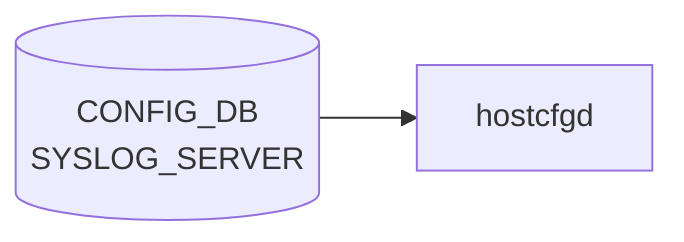

# SYSLOG_SERVER テーブル

## 概要

リモート syslog 送信先を保持する[^1]。`hostcfgd` の `SyslogHandler` がこのテーブルを購読し、`/etc/rsyslog.d/<n>-remote.conf` を生成して `rsyslogd` を再ロードする。

<!-- cdb-mermaid -->
### データフロー (自動生成)



!!! note "凡例"
    CONFIG_DB から SAI までの典型経路を `docs/reference/config-db-orch-map.md` から機械生成したミニ図。詳細・例外は本ページ本文と対応表を参照。
<!-- /cdb-mermaid -->

## key 構造

```
SYSLOG_SERVER|<server_address>
```

`<server_address>` は `inet:host`（IP アドレスまたはホスト名）。

## フィールド一覧

| フィールド | 型 | 必須 | 説明 |
|-----------|----|------|------|
| `server_address` (key) | `inet:host` | ✅ | サーバアドレス |
| `source` | ip-address | - | 送信元 IP。`server_address` と同 family である `must` |
| `port` | port-number | - | UDP/TCP ポート |
| `vrf` | leafref `VRF.name` または enum (`default`/`mgmt`) | - | 経路 [VRF](../../reference/glossary.md#term-vrf)。`mgmt` 指定時は `MGMT_VRF_CONFIG.mgmtVrfEnabled = true` 必須 (`must`) |
| `filter` | enum `include`/`exclude` | - | フィルタタイプ |
| `filter_regex` | string (`[^\n\r]+`) | - | フィルタ正規表現 |
| `protocol` | enum `tcp`/`udp` | - | 転送プロトコル |
| `severity` | enum `none`/`debug`/`info`/`notice`/`warn`/`error`/`crit` | - | 最低重大度 |

## 関連サブテーブル

- `SYSLOG_CONFIG|GLOBAL`: 全体 syslog 設定（rate limit、format、severity）
    - `format` (welf/standard, default standard)、`welf_firewall_name` (`format != standard` 必須)
- `SYSLOG_CONFIG_FEATURE|<service>` (key: leafref `FEATURE.name`): サービス単位 rate-limit

## 購読者

- `hostcfgd` `SyslogHandler`: rsyslog 設定生成

## 関連 CONFIG_DB / YANG / CLI

- 関連 [CONFIG_DB](../../reference/glossary.md#term-config_db): `VRF`、`MGMT_VRF_CONFIG`、`FEATURE`、`SYSLOG_CONFIG`
- 関連 CLI: `config syslog add/del`
- 関連 [YANG](../../reference/glossary.md#term-yang): `sonic-syslog`

<!-- ref-triangle:start -->

## 関連リファレンス

- YANG: [`sonic-syslog`](../yang/sonic-syslog.md)
- CLI: [`config syslog`](../cli/config-syslog.md)

<!-- ref-triangle:end -->

## 引用元

[^1]: YANG 定義: `sonic-syslog.yang`. <https://github.com/sonic-net/sonic-buildimage/blob/9ea932ec2e18f35e58268ec2e4456b1d4afd65cd/src/sonic-yang-models/yang-models/sonic-syslog.yang>

## 関連ページ
- [HLD: Syslog Source IP](../../system/sonic-syslog-source-ip.md)
- [CLI: config syslog](../cli/config-syslog.md)
- [YANG: sonic-syslog](../yang/sonic-syslog.md)

<!-- topics-back-ref -->
## 関連 Topics

- [Topics: Telemetry / SNMP / Observability](../../topics/09-telemetry-snmp/index.md)

<!-- /topics-back-ref -->

<!-- ops-hint -->
## 運用ヒント

### 典型値

- key 形式: `SYSLOG_SERVER|<ip>`。
- `source`: `Loopback0` 等。
- `vrf`: `default` / `mgmt`。
- `port`: 514。

### よくある誤設定

- `vrf: mgmt` で `source` を data-plane IP にすると syslog が出ない。

### 確認コマンド

```bash
sonic-db-cli CONFIG_DB keys 'SYSLOG_SERVER|*'
show syslog
```
<!-- /ops-hint -->

<!-- glossary-links-injected: a6c6612be307 -->
