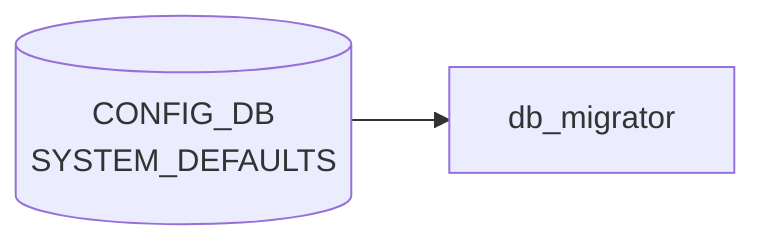

# SYSTEM_DEFAULTS テーブル

## 概要

システム共通の機能既定値 (デフォルトの enable / disable 状態) を定義する。`init_cfg.json` 由来の値を保持し、`db_migrator` が初期化時にエントリの有無を確認する[^1]。具体的なキーは `tunnel_qos_remap`、`synchronous_mode`、`dhcp_server` など (時期により異なる) で、各機能の起動前提として参照される。

<!-- cdb-mermaid -->
### データフロー (自動生成)



!!! note "凡例"
    CONFIG_DB から SAI までの典型経路を `docs/reference/config-db-orch-map.md` から機械生成したミニ図。詳細・例外は本ページ本文と対応表を参照。
<!-- /cdb-mermaid -->

## key 構造

```
SYSTEM_DEFAULTS|<name>
```

`<name>` は string (1..32)。

## 主要フィールド

| フィールド | 型 | 説明 |
|-----------|----|------|
| `status` | enum `enabled`/`disabled` (`admin_mode`) | 機能既定状態 |

## 設計上の位置づけ

- 単一の "ツマミ" として ON/OFF を保持し、より詳細な動作は対応する機能の設定テーブル (`FEATURE` 含む) で行う
- `db_migrator.py` が古い image からアップグレードした際にデフォルト値を補完する

## 購読者

- 各 daemon が起動時に該当 `<name>` を読み、自身の動作を切替

## 関連 CONFIG_DB / YANG / CLI

- 関連 [CONFIG_DB](../../reference/glossary.md#term-config_db): `FEATURE`、`DEVICE_METADATA`
- 関連 [YANG](../../reference/glossary.md#term-yang): `sonic-system-defaults`

<!-- ref-triangle:start -->

## 関連リファレンス

- YANG: [`sonic-system-defaults`](../yang/sonic-system-defaults.md)

<!-- ref-triangle:end -->

## 引用元

[^1]: YANG 定義: `sonic-system-defaults.yang`. <https://github.com/sonic-net/sonic-buildimage/blob/9ea932ec2e18f35e58268ec2e4456b1d4afd65cd/src/sonic-yang-models/yang-models/sonic-system-defaults.yang>

<!-- ops-hint -->
## 運用ヒント

### 典型値

- key 形式: `SYSTEM_DEFAULTS|<feature>`。
- `tunnel_qos_remap` / `synchronous_mode` 等のフラグを `enabled`/`disabled` で制御。

### よくある誤設定

- synchronous_mode=enabled のままで遅い [orchagent](../../reference/glossary.md#term-orchagent) と組み合わせると config push 全体が詰まる。

### 確認コマンド

```bash
sonic-db-cli CONFIG_DB keys 'SYSTEM_DEFAULTS|*'
```
<!-- /ops-hint -->

<!-- glossary-links-injected: 7c7c96ee6ab8 -->
