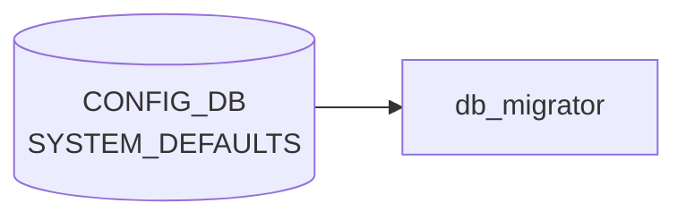

# SYSTEM_DEFAULTS テーブル

## 概要

システム共通の機能既定値 (デフォルトの enable / disable 状態) を定義する。`init_cfg.json` 由来の値を保持し、`db_migrator` が初期化時にエントリの有無を確認する[^1]。具体的なキーは `tunnel_qos_remap`、`synchronous_mode`、`dhcp_server` など (時期により異なる) で、各機能の起動前提として参照される。

<!-- cdb-mermaid -->
### データフロー (自動生成)



!!! note "凡例"
    CONFIG_DB から SAI までの典型経路を `docs/reference/config-db-orch-map.md` から機械生成したミニ図。詳細・例外は本ページ本文と対応表を参照。
<!-- /cdb-mermaid -->

## key 構造

```text
SYSTEM_DEFAULTS|<name>
```

`<name>` は string (1..32)。

## 主要フィールド

| フィールド | 型 | 説明 |
|-----------|----|------|
| `status` | enum `enabled`/`disabled` (`admin_mode`) | 機能既定状態 |

## 設計上の位置づけ

- 単一の "ツマミ" として ON/OFF を保持し、より詳細な動作は対応する機能の設定テーブル (`FEATURE` 含む) で行う
- `db_migrator.py` が古い image からアップグレードした際にデフォルト値を補完する

## 購読者

- 各 daemon が起動時に該当 `<name>` を読み、自身の動作を切替

## 関連 CONFIG_DB / YANG / CLI

- 関連 [CONFIG_DB](../../reference/glossary.md#term-config_db): `FEATURE`、`DEVICE_METADATA`
- 関連 [YANG](../../reference/glossary.md#term-yang): `sonic-system-defaults`

<!-- ref-triangle:start -->

## 関連リファレンス

- [YANG](../../reference/glossary.md#term-yang): [`sonic-system-defaults`](../yang/sonic-system-defaults.md)

<!-- ref-triangle:end -->

## 引用元

[^1]: [YANG](../../reference/glossary.md#term-yang) 定義: `sonic-system-defaults.yang`. <https://github.com/sonic-net/sonic-buildimage/blob/9ea932ec2e18f35e58268ec2e4456b1d4afd65cd/src/sonic-yang-models/yang-models/sonic-system-defaults.yang>

<!-- value-behavior -->
## 値依存挙動マトリクス

### `status` (admin_mode): `enabled` / `disabled`

代表的な `<name>` エントリと各値の意味:

| name | `enabled` 時 | `disabled` 時 |
|------|-------------|--------------|
| `tunnel_qos_remap` | [IPinIP](../../reference/glossary.md#term-ipinip) デカプセル時の [QoS](../../reference/glossary.md#term-qos) リマップを有効化 (muxorch 起動時のみ参照) | [QoS](../../reference/glossary.md#term-qos) リマップなし |
| `synchronous_mode` | [orchagent](../../reference/glossary.md#term-orchagent) が [SAI](../../reference/glossary.md#term-sai) 操作を同期実行 (P4RT 連携時に必要) | 非同期実行 |
| `dhcp_server` | 組み込み DHCP サーバを有効化 | 無効 |
| `mux_tunnel_egress_acl` | Dual-ToR mux [ACL](../../reference/glossary.md#term-acl) を適用 (Mellanox: enabled が init_cfg デフォルト) | [ACL](../../reference/glossary.md#term-acl) 未適用 |

| 状態 | 挙動 |
|------|-----|
| エントリ不在 (DEL 後) | 各機能は不在を `disabled` として扱う |
| `tunnel_qos_remap` 実行中変更 | muxorch は起動時のみ参照のため、サービス再起動まで反映されない |

<!-- /value-behavior -->

<!-- cdb-exceptions -->
## 例外条件・特殊挙動

<!-- evidence: sonic-buildimage/src/sonic-config-engine/config_samples.py@9ea932ec2e18f35e58268ec2e4456b1d4afd65cd L160-186; sonic-swss/orchagent/muxorch.cpp@4305596156d70e9797e8a881b3d19b46de0bce0d L1388 -->

- **テーブル不在時の安全フォールバック**: `config_samples.py` はテーブルが存在しない場合に空 dict を補完する。各機能コードもエントリ不在を "disabled" として扱い KeyError を起こさない。
- **`tunnel_qos_remap` は起動時のみ参照**: `muxorch` が起動時に `SYSTEM_DEFAULTS` を一回だけ読み取り [QoS](../../reference/glossary.md#term-qos) remap の有効/無効を決定する。実行中に [CONFIG_DB](../../reference/glossary.md#term-config_db) を書き換えてもサービス再起動なしには反映されない。
- **enum 制約違反は YANG 層でブロック**: `status` フィールドは `admin_mode` enum（`enabled`/`disabled`）で制約されており、不正値は [CONFIG_DB](../../reference/glossary.md#term-config_db) への書き込み時に YANG バリデーション層で拒否される。
- **エントリ削除の副作用**: 機能コードがエントリ不在をデフォルト（通常 disabled）として扱うため、エントリを DEL すると機能が暗黙的に無効化される。

<!-- /cdb-exceptions -->

<!-- ops-hint -->
## 運用ヒント

### 典型値

- key 形式: `SYSTEM_DEFAULTS|<feature>`。
- `tunnel_qos_remap` / `synchronous_mode` 等のフラグを `enabled`/`disabled` で制御。

### よくある誤設定

- synchronous_mode=enabled のままで遅い [orchagent](../../reference/glossary.md#term-orchagent) と組み合わせると config push 全体が詰まる。

### 確認コマンド

```bash
sonic-db-cli CONFIG_DB keys 'SYSTEM_DEFAULTS|*'
```
<!-- /ops-hint -->


<!-- derivation -->
## 派生・条件付き登録 (Phase 6/7)

### Phase 6: 自動派生

各サービスが `SYSTEM_DEFAULTS` を参照して起動時のデフォルト動作を決定する。`synchronous_mode==enable` → orchagent が SAI call を synchronous モードで実行。`interface_naming_mode==alias` → portsyncd / intfmgrd がエイリアス名を使用。`frr_mgmt_framework_config==true` → sonic-mgmt-framework が FRR 設定を管理。

### Phase 7: 条件付き登録 (add_manager 条件)

db_migrator が起動時に `SYSTEM_DEFAULTS` テーブルを初期化・マイグレーションする。orchagent は起動時に `synchronous_mode` を読み取って起動モードを決定する（起動後の変更は無効）。`SYSTEM_DEFAULTS|GLOBAL` エントリのみ有効（シングルトン制約）。

<!-- /derivation -->

<!-- handler-branching -->
### Phase 8: Handler メソッド内分岐

| Handler | 分岐条件 | 効果 | evidence |
|---|---|---|---|
| `orchagent` 起動 | `synchronous_mode==enable` | SAI API を synchronous モードで呼び出し | `orchagent/main.cpp` |
| `orchagent` 起動 | `synchronous_mode==disable` または未設定 | SAI API を asynchronous モードで呼び出し | `orchagent/main.cpp` |
| 各サービス | `frr_mgmt_framework_config==true` | sonic-mgmt-framework による FRR 設定管理を有効化 | 複数サービス |
| `portsyncd` / `intfmgrd` | `interface_naming_mode==alias` | インターフェース alias 名を使用 | `portsyncd` |
| `portsyncd` / `intfmgrd` | `interface_naming_mode==default` | 標準 IF 名を使用 | `portsyncd` |

> **スキャン証跡**: `SYSTEM_DEFAULTS` は複数のシステム全体設定を束ねるシングルトンテーブル。`synchronous_mode` の分岐が orchagent 起動時の動作に直結する主要な Phase 8 分岐。

<!-- /handler-branching -->

<!-- runtime-trace -->
## CDB → 実コンテナ動作トレース

### 段階 1: Consumer 登録

- **各種 mgrd / orchagent**: `SYSTEM_DEFAULTS` テーブルを起動時に `ConfigDBConnector` で読み込む。
- 主に `switch_type` (L2, L3, VOQ 等) の判定に使用される。

### 段階 2: CFG → APPL 翻訳

- orchagent 起動時に `SYSTEM_DEFAULTS` を読み込んでスイッチモードを決定。動的変更は基本的に非サポート。

### 段階 3: APPL → SAI

- SAI 初期化時に `sai_switch_api->create_switch()` のパラメータとして switch_type 等が渡される。

### 段階 4: タイミング + 副作用

- SYSTEM_DEFAULTS は主に起動時設定。変更時はサービス再起動が必要。
- 副作用: switch_type の変更は swss/syncd の完全再起動が必要でサービス断が生じる。

<!-- /runtime-trace -->

<!-- defaults -->
## コード由来の暗黙デフォルト・Fallback

`SYSTEM_DEFAULTS` テーブルは [YANG](../../reference/glossary.md#term-yang) (`sonic-system-defaults.yang`) 上で `status` を `admin_mode` enum (`enabled`/`disabled`) として宣言しているが、YANG 側に `default` 宣言は無く、コード側は「エントリ不在 = `disabled` として扱う」という runtime fallback と、ビルド時テンプレートでの条件付き注入の組み合わせで動作する。

### `mux_tunnel_egress_acl` — Mellanox `"enabled"` / 他 `"disabled"` (`include_mux=y` ビルド時のみ)

`init_cfg.json.j2:188-197` で `include_mux == "y"` のビルド時に Dual-ToR ACL エントリを `sonic_asic_platform == "mellanox"` なら `enabled`、それ以外 (Broadcom 等) は `disabled` として焼き込む。`include_mux` を有効にしないビルドではエントリ自体が生成されず、`muxorch` 側で「不在 = `disabled`」として扱われる。

### `software_bfd` — SmartSwitch DPU プロファイルで `"enabled"`

`sonic-config-engine/config_samples.py:186-188` の `generate_smartswitch_dpu` プロファイルが `data["SYSTEM_DEFAULTS"]["software_bfd"] = {"status": "enabled"}` を強制注入する。通常スイッチ（非 SmartSwitch DPU）には付かない。

### `polaris` — Pensando hwsku のみ `"enabled"`

`config_samples.py:179-184` で `'pensando' in hwsku.lower()` のときに `SYSTEM_DEFAULTS = {"polaris": {"status": "enabled"}}` を上書き設定する。Pensando DPU 向け SmartSwitch プロファイル限定の fallback。

### `tunnel_qos_remap` — ビルド時注入なし、不在 = `disabled` 扱い

`init_cfg.json.j2` / `config_samples.py` のいずれにも `tunnel_qos_remap` の自動生成コードは無い。`muxorch` (sonic-swss) が起動時に `SYSTEM_DEFAULTS|tunnel_qos_remap` の `status` を参照するのみで、エントリ不在時は [QoS](../../reference/glossary.md#term-qos) remap を行わない（概念的 `disabled` 扱い）。コード由来のデフォルトは「エントリ不在」そのもの。

### `synchronous_mode` / `dhcp_server` — テーブル外で管理

文書概要に併記されているが、`synchronous_mode` の実コード反映先は `DEVICE_METADATA|localhost` (`init_cfg.json.j2:5`、`include_p4rt=y` ビルド時に `"enable"`)、`dhcp_server` の実体は `FEATURE` テーブル (`init_cfg.json.j2:77`、`include_dhcp_server=y` ビルド時に `state=disabled` で登録) であり、`SYSTEM_DEFAULTS` テーブル自体には注入されない。

### `status` 全般 — YANG `default` 無し、runtime fallback は "absent = disabled"

`sonic-system-defaults.yang` の `status` leaf は `admin_mode` enum 制約のみで `default` 宣言を持たない。各 daemon (`muxorch`、`orchagent` 等) は該当 `<name>` エントリ不在を `disabled` として扱い `KeyError` を出さない設計。

> **Evidence**: `sonic-buildimage/files/build_templates/init_cfg.json.j2:5, 77, 188-197` および `src/sonic-config-engine/config_samples.py:160-188`、SHA `9ea932ec2e18f35e58268ec2e4456b1d4afd65cd`。`sonic-utilities/scripts/db_migrator.py:670-677` (`synchronous_mode` の DEVICE_METADATA 側補完)、SHA `39732bceb8bdefe706518ab40623bbbba6ff33b9`。詳細は `meta/_intermediate/cdb-flow/system-defaults-defaults.md` を参照。
<!-- /defaults -->

<!-- entry-points -->
## 書き込み入り口 (Direction A)

SYSTEM_DEFAULTS テーブルへの書き込みが発生するコード経路を網羅的に調査した結果。

### CLI

  - 専用 CLI なし

### minigraph / sonic-cfggen

minigraph.py に SYSTEM_DEFAULTS 生成なし

### REST / gNMI

REST/gNMI 書き込み経路なし

### db_migrator

db_migrator.py での SYSTEM_DEFAULTS マイグレーションなし

### ビルド時デフォルト (build-time default)

**`files/build_templates/init_cfg.json.j2`** に SYSTEM_DEFAULTS エントリ (IPv6 forwarding 等) がビルド時に投入 (sonic-buildimage/files/build_templates/init_cfg.json.j2); **`files/build_templates/qos_config.j2`** と **`files/build_templates/buffers_config.j2`** も参照

### ハードコードデフォルト / ランタイム注入

なし

### 死活・デッドコード

なし
<!-- /entry-points -->

<!-- ordering -->
## 処理順・起動順 (Phase B)

### ステージ 0: ビルド時テンプレート展開

`sonic-cfggen` が `init_cfg.json.j2` / `swss_vars.j2` / `docker-fpm-frr/supervisord.conf.j2` を展開し、`SYSTEM_DEFAULTS` のエントリ（`mux_tunnel_egress_acl`、`software_bfd`、`polaris` 等）とそれに依存する値（`dscp_remapping` フラグ）を成果物に焼き込む。`software_bfd.status == "enabled"` のとき `bfdmon` プロセスが supervisord 設定へ追加される。

### ステージ 1: swss コンテナ起動シーケンス

docker-orchagent 内の `supervisord.conf.j2` は `dependent_startup` プラグインで以下の順に各プロセスを起動する。`SYSTEM_DEFAULTS` はこのシーケンス中の **priority=4**（orchagent 起動直前）に参照される。

| priority | プロセス | 起動待機条件 | SYSTEM_DEFAULTS との関係 |
|---------|---------|-------------|--------------------------|
| 1 | `rsyslogd` | — | なし |
| 3 | `portsyncd` | `rsyslogd:running` | なし |
| 3 | `gearsyncd` | `rsyslogd:running` | なし |
| **4** | **`orchagent`** | `portsyncd:running`（fabric の場合は `rsyslogd:running`） | **`orchagent.sh` が `sonic-cfggen -d -t swss_vars.j2` を実行し `synchronous_mode`/`dscp_remapping` を読み取り、`-s` フラグ（同期モード）付与を決定** |
| 5 | `swssconfig` | `orchagent:running` | なし（FDB/ARP/ports/switch.json 適用） |
| 6–18 | `coppmgrd` / `neighsyncd` / `vlanmgrd` / `intfmgrd` / `buffermgrd` 等 | `swssconfig:exited` | なし（[DEVICE_METADATA](../../reference/glossary.md#term-device_metadata) 経由で `interface_naming_mode` 等を読む） |

> **証跡**: `sonic-buildimage/dockers/docker-orchagent/supervisord.conf.j2` および `orchagent.sh`、SHA `9ea932ec2e18f35e58268ec2e4456b1d4afd65cd`

### ステージ 2: ランタイム参照（orchagent 内 MuxAclHandler）

`MuxAclHandler::MuxAclHandler()` のコンストラクタ（`sonic-swss/orchagent/muxorch.cpp:1388`）が [MuxPort](../../reference/glossary.md#term-mux) 初期化のたびに `CONFIG_DB` の `SYSTEM_DEFAULTS|mux_tunnel_egress_acl` を `hget` で読む。これは orchagent が起動済みの状態（ランタイム）でポート追加イベント処理時に逐次発生する。

> **証跡**: `sonic-swss/orchagent/muxorch.cpp` L1388–1390、SHA `4305596156d70e9797e8a881b3d19b46de0bce0d`

### ステージ 3: docker-fpm-frr コンテナ

`docker-fpm-frr/frr/supervisord/supervisord.conf.j2` の Jinja2 展開時（コンテナ起動前のテンプレート生成時）に `SYSTEM_DEFAULTS.software_bfd.status == "enabled"` を評価し、`bfdmon` を supervisord に登録するかを決定する。登録された場合は `bgpd:running` を待機してから `bfdmon` が起動する。

> **証跡**: `sonic-buildimage/dockers/docker-fpm-frr/frr/supervisord/supervisord.conf.j2` L213、SHA `9ea932ec2e18f35e58268ec2e4456b1d4afd65cd`

### まとめ

SYSTEM_DEFAULTS の処理順は 3 段階に整理できる:

1. **ビルド時** — `sonic-cfggen` テンプレート展開で `init_cfg.json`・`swss_vars.j2`・`supervisord.conf.j2` へ値が焼き込まれる
2. **起動時（swss priority=4、orchagent 直前）** — `orchagent.sh` が `SYSTEM_DEFAULTS` を参照して `synchronous_mode` / `dscp_remapping` 引数を決定する（起動後の変更は無効）
3. **ランタイム** — `MuxAclHandler` が [MuxPort](../../reference/glossary.md#term-mux) 初期化ごとに `mux_tunnel_egress_acl` を CONFIG_DB から逐次読む

<!-- /ordering -->

<!-- cross-refs -->
## 暗黙参照マップ (Phase C)

| 参照方向 | このテーブル / キー | 相手テーブル / ページ | 条件 |
|---------|-------------------|---------------------|------|
| → SYSTEM_DEFAULTS | `tunnel_qos_remap` | [`TUNNEL`](./tunnel.md) / `swss_vars.j2` で `dscp_remapping` フラグを決定 | orchagent 起動時（`swss_vars.j2:14`） |
| → SYSTEM_DEFAULTS | `tunnel_qos_remap` | `buffers_config.j2` / `qos_config.j2` でバッファ・[QoS](../../reference/glossary.md#term-qos) パラメータを分岐 | ビルド時テンプレート展開（`buffers_config.j2:208`、`qos_config.j2:143`） |
| → SYSTEM_DEFAULTS | `tunnel_qos_remap` | `minigraph.py` が `TUNNEL` テーブルエントリを生成 | minigraph 変換時（`minigraph.py:2212-2215`） |
| → SYSTEM_DEFAULTS | `mux_tunnel_egress_acl` | `muxorch` が Dual-ToR [ACL](../../reference/glossary.md#term-acl) 適用を決定 | [MuxPort](../../reference/glossary.md#term-mux) 初期化のたびにランタイム参照（`muxorch.cpp:1388`） |
| → SYSTEM_DEFAULTS | `software_bfd` | `docker-fpm-frr supervisord.conf.j2` が `bfdmon` プロセス登録を決定 | コンテナ起動テンプレート展開時（`supervisord.conf.j2:213`） |
| 概念的 | `synchronous_mode` | [`DEVICE_METADATA`](./device-metadata.md) — 実体は `DEVICE_METADATA\|localhost.synchronous_mode` | SYSTEM_DEFAULTS には格納されない (よくある誤解) |
| 概念的 | `dhcp_server` | [`FEATURE`](./feature.md) — 実体は `FEATURE\|dhcp_server.state` | SYSTEM_DEFAULTS には格納されない (よくある誤解) |

> **Evidence**: `sonic-buildimage/files/build_templates/swss_vars.j2:14`; `buffers_config.j2:208`; `qos_config.j2:143`; `sonic-buildimage/src/sonic-config-engine/minigraph.py:2212-2215`; `sonic-buildimage/src/sonic-config-engine/config_samples.py:179-188`; `sonic-buildimage/dockers/docker-fpm-frr/frr/supervisord/supervisord.conf.j2:213`; `sonic-swss/orchagent/muxorch.cpp:1388-1390`; `sonic-buildimage/files/build_templates/init_cfg.json.j2:188-197`; 詳細分析 `meta/_intermediate/cdb-flow/system-defaults-cross-refs.md`
<!-- /cross-refs -->

<!-- glossary-links-injected: 90fa20b1e615 -->
