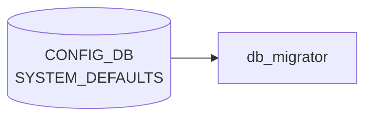

# SYSTEM_DEFAULTS テーブル

## 概要

システム共通の機能既定値 (デフォルトの enable / disable 状態) を定義する。`init_cfg.json` 由来の値を保持し、`db_migrator` が初期化時にエントリの有無を確認する[^1]。具体的なキーは `tunnel_qos_remap`、`synchronous_mode`、`dhcp_server` など (時期により異なる) で、各機能の起動前提として参照される。

<!-- cdb-mermaid -->
### データフロー (自動生成)



!!! note "凡例"
    CONFIG_DB から SAI までの典型経路を `docs/reference/config-db-orch-map.md` から機械生成したミニ図。詳細・例外は本ページ本文と対応表を参照。
<!-- /cdb-mermaid -->

## key 構造

```text
SYSTEM_DEFAULTS|<name>
```

`<name>` は string (1..32)。

## 主要フィールド

| フィールド | 型 | 説明 |
|-----------|----|------|
| `status` | enum `enabled`/`disabled` (`admin_mode`) | 機能既定状態 |

## 設計上の位置づけ

- 単一の "ツマミ" として ON/OFF を保持し、より詳細な動作は対応する機能の設定テーブル (`FEATURE` 含む) で行う
- `db_migrator.py` が古い image からアップグレードした際にデフォルト値を補完する

## 購読者

- 各 daemon が起動時に該当 `<name>` を読み、自身の動作を切替

## 関連 CONFIG_DB / YANG / CLI

- 関連 [CONFIG_DB](../../reference/glossary.md#term-config_db): `FEATURE`、`DEVICE_METADATA`
- 関連 [YANG](../../reference/glossary.md#term-yang): `sonic-system-defaults`

<!-- ref-triangle:start -->

## 関連リファレンス

- [YANG](../../reference/glossary.md#term-yang): [`sonic-system-defaults`](../yang/sonic-system-defaults.md)

<!-- ref-triangle:end -->

## 引用元

[^1]: [YANG](../../reference/glossary.md#term-yang) 定義: `sonic-system-defaults.yang`. <https://github.com/sonic-net/sonic-buildimage/blob/9ea932ec2e18f35e58268ec2e4456b1d4afd65cd/src/sonic-yang-models/yang-models/sonic-system-defaults.yang>

<!-- value-behavior -->
## 値依存挙動マトリクス

### `status` (admin_mode): `enabled` / `disabled`

代表的な `<name>` エントリと各値の意味:

| name | `enabled` 時 | `disabled` 時 |
|------|-------------|--------------|
| `tunnel_qos_remap` | [IPinIP](../../reference/glossary.md#term-ipinip) デカプセル時の [QoS](../../reference/glossary.md#term-qos) リマップを有効化 ([muxorch](../../reference/glossary.md#term-muxorch) 起動時のみ参照) | [QoS](../../reference/glossary.md#term-qos) リマップなし |
| `synchronous_mode` | [orchagent](../../reference/glossary.md#term-orchagent) が [SAI](../../reference/glossary.md#term-sai) 操作を同期実行 ([P4RT](../../reference/glossary.md#term-p4rt) 連携時に必要) | 非同期実行 |
| `dhcp_server` | 組み込み DHCP サーバを有効化 | 無効 |
| `mux_tunnel_egress_acl` | Dual-ToR mux [ACL](../../reference/glossary.md#term-acl) を適用 (Mellanox: enabled が init_cfg デフォルト) | [ACL](../../reference/glossary.md#term-acl) 未適用 |

| 状態 | 挙動 |
|------|-----|
| エントリ不在 (DEL 後) | 各機能は不在を `disabled` として扱う |
| `tunnel_qos_remap` 実行中変更 | [muxorch](../../reference/glossary.md#term-muxorch) は起動時のみ参照のため、サービス再起動まで反映されない |

<!-- /value-behavior -->

<!-- cdb-exceptions -->
## 例外条件・特殊挙動

<!-- evidence: sonic-buildimage/src/sonic-config-engine/config_samples.py@9ea932ec2e18f35e58268ec2e4456b1d4afd65cd L160-186; sonic-swss/orchagent/muxorch.cpp@4305596156d70e9797e8a881b3d19b46de0bce0d L1388 -->

- **テーブル不在時の安全フォールバック**: `config_samples.py` はテーブルが存在しない場合に空 dict を補完する。各機能コードもエントリ不在を "disabled" として扱い KeyError を起こさない。
- **`tunnel_qos_remap` は起動時のみ参照**: `muxorch` が起動時に `SYSTEM_DEFAULTS` を一回だけ読み取り [QoS](../../reference/glossary.md#term-qos) remap の有効/無効を決定する。実行中に [CONFIG_DB](../../reference/glossary.md#term-config_db) を書き換えてもサービス再起動なしには反映されない。
- **enum 制約違反は YANG 層でブロック**: `status` フィールドは `admin_mode` enum（`enabled`/`disabled`）で制約されており、不正値は [CONFIG_DB](../../reference/glossary.md#term-config_db) への書き込み時に YANG バリデーション層で拒否される。
- **エントリ削除の副作用**: 機能コードがエントリ不在をデフォルト（通常 disabled）として扱うため、エントリを DEL すると機能が暗黙的に無効化される。

<!-- /cdb-exceptions -->

<!-- ops-hint -->
## 運用ヒント

### 典型値

- key 形式: `SYSTEM_DEFAULTS|<feature>`。
- `tunnel_qos_remap` / `synchronous_mode` 等のフラグを `enabled`/`disabled` で制御。

### よくある誤設定

- synchronous_mode=enabled のままで遅い [orchagent](../../reference/glossary.md#term-orchagent) と組み合わせると config push 全体が詰まる。

### 確認コマンド

```bash
sonic-db-cli CONFIG_DB keys 'SYSTEM_DEFAULTS|*'
```
<!-- /ops-hint -->

<!-- derivation -->
## 派生・条件付き登録 (Phase 6/7)

### Phase 6: 自動派生

各サービスが `SYSTEM_DEFAULTS` を参照して起動時のデフォルト動作を決定する。`synchronous_mode==enable` → [orchagent](../../reference/glossary.md#term-orchagent) が [SAI](../../reference/glossary.md#term-sai) call を synchronous モードで実行。`interface_naming_mode==alias` → [portsyncd](../../reference/glossary.md#term-portsyncd) / [intfmgrd](../../reference/glossary.md#term-intfmgrd) がエイリアス名を使用。`frr_mgmt_framework_config==true` → [sonic-mgmt](../../reference/glossary.md#term-sonic-mgmt)-framework が [FRR](../../reference/glossary.md#term-frr) 設定を管理。

### Phase 7: 条件付き登録 (add_manager 条件)

db_migrator が起動時に `SYSTEM_DEFAULTS` テーブルを初期化・マイグレーションする。orchagent は起動時に `synchronous_mode` を読み取って起動モードを決定する（起動後の変更は無効）。`SYSTEM_DEFAULTS|GLOBAL` エントリのみ有効（シングルトン制約）。

<!-- /derivation -->

<!-- handler-branching -->
### Phase 8: Handler メソッド内分岐

| Handler | 分岐条件 | 効果 | evidence |
|---|---|---|---|
| `orchagent` 起動 | `synchronous_mode==enable` | [SAI](../../reference/glossary.md#term-sai) API を synchronous モードで呼び出し | `orchagent/main.cpp` |
| `orchagent` 起動 | `synchronous_mode==disable` または未設定 | SAI API を asynchronous モードで呼び出し | `orchagent/main.cpp` |
| 各サービス | `frr_mgmt_framework_config==true` | [sonic-mgmt](../../reference/glossary.md#term-sonic-mgmt)-framework による [FRR](../../reference/glossary.md#term-frr) 設定管理を有効化 | 複数サービス |
| `portsyncd` / `intfmgrd` | `interface_naming_mode==alias` | インターフェース alias 名を使用 | `portsyncd` |
| `portsyncd` / `intfmgrd` | `interface_naming_mode==default` | 標準 IF 名を使用 | `portsyncd` |

> **スキャン証跡**: `SYSTEM_DEFAULTS` は複数のシステム全体設定を束ねるシングルトンテーブル。`synchronous_mode` の分岐が orchagent 起動時の動作に直結する主要な Phase 8 分岐。

<!-- /handler-branching -->

<!-- runtime-trace -->
## CDB → 実コンテナ動作トレース

### 段階 1: Consumer 登録

- **各種 mgrd / orchagent**: `SYSTEM_DEFAULTS` テーブルを起動時に `ConfigDBConnector` で読み込む。
- 主に `switch_type` (L2, L3, [VOQ](../../reference/glossary.md#term-voq) 等) の判定に使用される。

### 段階 2: CFG → APPL 翻訳

- orchagent 起動時に `SYSTEM_DEFAULTS` を読み込んでスイッチモードを決定。動的変更は基本的に非サポート。

### 段階 3: APPL → SAI

- SAI 初期化時に `sai_switch_api->create_switch()` のパラメータとして switch_type 等が渡される。

### 段階 4: タイミング + 副作用

- SYSTEM_DEFAULTS は主に起動時設定。変更時はサービス再起動が必要。
- 副作用: switch_type の変更は swss/[syncd](../../reference/glossary.md#term-syncd) の完全再起動が必要でサービス断が生じる。

<!-- /runtime-trace -->

<!-- defaults -->
## コード由来の暗黙デフォルト・Fallback

`SYSTEM_DEFAULTS` テーブルは [YANG](../../reference/glossary.md#term-yang) (`sonic-system-defaults.yang`) 上で `status` を `admin_mode` enum (`enabled`/`disabled`) として宣言しているが、YANG 側に `default` 宣言は無く、コード側は「エントリ不在 = `disabled` として扱う」という runtime fallback と、ビルド時テンプレートでの条件付き注入の組み合わせで動作する。

### `mux_tunnel_egress_acl` — Mellanox `"enabled"` / 他 `"disabled"` (`include_mux=y` ビルド時のみ)

`init_cfg.json.j2:188-197` で `include_mux == "y"` のビルド時に Dual-ToR ACL エントリを `sonic_asic_platform == "mellanox"` なら `enabled`、それ以外 (Broadcom 等) は `disabled` として焼き込む。`include_mux` を有効にしないビルドではエントリ自体が生成されず、`muxorch` 側で「不在 = `disabled`」として扱われる。

### `software_bfd` — SmartSwitch DPU プロファイルで `"enabled"`

`sonic-config-engine/config_samples.py:186-188` の `generate_smartswitch_dpu` プロファイルが `data["SYSTEM_DEFAULTS"]["software_bfd"] = {"status": "enabled"}` を強制注入する。通常スイッチ（非 [SmartSwitch](../../reference/glossary.md#term-smartswitch) [DPU](../../reference/glossary.md#term-dpu)）には付かない。

### `polaris` — Pensando hwsku のみ `"enabled"`

`config_samples.py:179-184` で `'pensando' in hwsku.lower()` のときに `SYSTEM_DEFAULTS = {"polaris": {"status": "enabled"}}` を上書き設定する。Pensando [DPU](../../reference/glossary.md#term-dpu) 向け [SmartSwitch](../../reference/glossary.md#term-smartswitch) プロファイル限定の fallback。

### `tunnel_qos_remap` — ビルド時注入なし、不在 = `disabled` 扱い

`init_cfg.json.j2` / `config_samples.py` のいずれにも `tunnel_qos_remap` の自動生成コードは無い。`muxorch` ([sonic-swss](../../reference/glossary.md#term-sonic-swss)) が起動時に `SYSTEM_DEFAULTS|tunnel_qos_remap` の `status` を参照するのみで、エントリ不在時は [QoS](../../reference/glossary.md#term-qos) remap を行わない（概念的 `disabled` 扱い）。コード由来のデフォルトは「エントリ不在」そのもの。

### `synchronous_mode` / `dhcp_server` — テーブル外で管理

文書概要に併記されているが、`synchronous_mode` の実コード反映先は `DEVICE_METADATA|localhost` (`init_cfg.json.j2:5`、`include_p4rt=y` ビルド時に `"enable"`)、`dhcp_server` の実体は `FEATURE` テーブル (`init_cfg.json.j2:77`、`include_dhcp_server=y` ビルド時に `state=disabled` で登録) であり、`SYSTEM_DEFAULTS` テーブル自体には注入されない。

### `status` 全般 — YANG `default` 無し、runtime fallback は "absent = disabled"

`sonic-system-defaults.yang` の `status` leaf は `admin_mode` enum 制約のみで `default` 宣言を持たない。各 daemon (`muxorch`、`orchagent` 等) は該当 `<name>` エントリ不在を `disabled` として扱い `KeyError` を出さない設計。

> **Evidence**: `sonic-buildimage/files/build_templates/init_cfg.json.j2:5, 77, 188-197` および `src/sonic-config-engine/config_samples.py:160-188`、SHA `9ea932ec2e18f35e58268ec2e4456b1d4afd65cd`。`sonic-utilities/scripts/db_migrator.py:670-677` (`synchronous_mode` の [DEVICE_METADATA](../../reference/glossary.md#term-device_metadata) 側補完)、SHA `39732bceb8bdefe706518ab40623bbbba6ff33b9`。詳細は `meta/_intermediate/cdb-flow/system-defaults-defaults.md` を参照。
<!-- /defaults -->

<!-- entry-points -->
## 書き込み入り口 (Direction A)

SYSTEM_DEFAULTS テーブルへの書き込みが発生するコード経路を網羅的に調査した結果。

### CLI

  - 専用 CLI なし

### minigraph / sonic-cfggen

minigraph.py に SYSTEM_DEFAULTS 生成なし

### REST / gNMI

REST/[gNMI](../../reference/glossary.md#term-gnmi) 書き込み経路なし

### db_migrator

db_migrator.py での SYSTEM_DEFAULTS マイグレーションなし

### ビルド時デフォルト (build-time default)

**`files/build_templates/init_cfg.json.j2`** に SYSTEM_DEFAULTS エントリ (IPv6 forwarding 等) がビルド時に投入 ([sonic-buildimage](../../reference/glossary.md#term-sonic-buildimage)/files/build_templates/init_cfg.json.j2); **`files/build_templates/qos_config.j2`** と **`files/build_templates/buffers_config.j2`** も参照

### ハードコードデフォルト / ランタイム注入

なし

### 死活・デッドコード

なし
<!-- /entry-points -->

<!-- ordering -->
## 処理順・起動順 (Phase B)

### ステージ 0: ビルド時テンプレート展開

`sonic-cfggen` が `init_cfg.json.j2` / `swss_vars.j2` / `docker-fpm-frr/supervisord.conf.j2` を展開し、`SYSTEM_DEFAULTS` のエントリ（`mux_tunnel_egress_acl`、`software_bfd`、`polaris` 等）とそれに依存する値（`dscp_remapping` フラグ）を成果物に焼き込む。`software_bfd.status == "enabled"` のとき `bfdmon` プロセスが supervisord 設定へ追加される。

### ステージ 1: swss コンテナ起動シーケンス

docker-orchagent 内の `supervisord.conf.j2` は `dependent_startup` プラグインで以下の順に各プロセスを起動する。`SYSTEM_DEFAULTS` はこのシーケンス中の **priority=4**（orchagent 起動直前）に参照される。

| priority | プロセス | 起動待機条件 | SYSTEM_DEFAULTS との関係 |
|---------|---------|-------------|--------------------------|
| 1 | `rsyslogd` | — | なし |
| 3 | `portsyncd` | `rsyslogd:running` | なし |
| 3 | `gearsyncd` | `rsyslogd:running` | なし |
| **4** | **`orchagent`** | `portsyncd:running`（fabric の場合は `rsyslogd:running`） | **`orchagent.sh` が `sonic-cfggen -d -t swss_vars.j2` を実行し `synchronous_mode`/`dscp_remapping` を読み取り、`-s` フラグ（同期モード）付与を決定** |
| 5 | `swssconfig` | `orchagent:running` | なし（[FDB](../../reference/glossary.md#term-fdb)/[ARP](../../reference/glossary.md#term-arp)/ports/switch.json 適用） |
| 6–18 | `coppmgrd` / `neighsyncd` / `vlanmgrd` / `intfmgrd` / `buffermgrd` 等 | `swssconfig:exited` | なし（[DEVICE_METADATA](../../reference/glossary.md#term-device_metadata) 経由で `interface_naming_mode` 等を読む） |

> **証跡**: `sonic-buildimage/dockers/docker-orchagent/supervisord.conf.j2` および `orchagent.sh`、SHA `9ea932ec2e18f35e58268ec2e4456b1d4afd65cd`

### ステージ 2: ランタイム参照（orchagent 内 MuxAclHandler）

`MuxAclHandler::MuxAclHandler()` のコンストラクタ（`sonic-swss/orchagent/muxorch.cpp:1388`）が [MuxPort](../../reference/glossary.md#term-mux) 初期化のたびに `CONFIG_DB` の `SYSTEM_DEFAULTS|mux_tunnel_egress_acl` を `hget` で読む。これは orchagent が起動済みの状態（ランタイム）でポート追加イベント処理時に逐次発生する。

> **証跡**: `sonic-swss/orchagent/muxorch.cpp` L1388–1390、SHA `4305596156d70e9797e8a881b3d19b46de0bce0d`

### ステージ 3: docker-fpm-frr コンテナ

`docker-fpm-frr/frr/supervisord/supervisord.conf.j2` の Jinja2 展開時（コンテナ起動前のテンプレート生成時）に `SYSTEM_DEFAULTS.software_bfd.status == "enabled"` を評価し、`bfdmon` を supervisord に登録するかを決定する。登録された場合は `bgpd:running` を待機してから `bfdmon` が起動する。

> **証跡**: `sonic-buildimage/dockers/docker-fpm-frr/frr/supervisord/supervisord.conf.j2` L213、SHA `9ea932ec2e18f35e58268ec2e4456b1d4afd65cd`

### まとめ

SYSTEM_DEFAULTS の処理順は 3 段階に整理できる:

1. **ビルド時** — `sonic-cfggen` テンプレート展開で `init_cfg.json`・`swss_vars.j2`・`supervisord.conf.j2` へ値が焼き込まれる
2. **起動時（swss priority=4、orchagent 直前）** — `orchagent.sh` が `SYSTEM_DEFAULTS` を参照して `synchronous_mode` / `dscp_remapping` 引数を決定する（起動後の変更は無効）
3. **ランタイム** — `MuxAclHandler` が [MuxPort](../../reference/glossary.md#term-mux) 初期化ごとに `mux_tunnel_egress_acl` を CONFIG_DB から逐次読む

<!-- /ordering -->

<!-- cross-refs -->
## 暗黙参照マップ (Phase C)

| 参照方向 | このテーブル / キー | 相手テーブル / ページ | 条件 |
|---------|-------------------|---------------------|------|
| → SYSTEM_DEFAULTS | `tunnel_qos_remap` | [`TUNNEL`](./tunnel.md) / `swss_vars.j2` で `dscp_remapping` フラグを決定 | orchagent 起動時（`swss_vars.j2:14`） |
| → SYSTEM_DEFAULTS | `tunnel_qos_remap` | `buffers_config.j2` / `qos_config.j2` でバッファ・[QoS](../../reference/glossary.md#term-qos) パラメータを分岐 | ビルド時テンプレート展開（`buffers_config.j2:208`、`qos_config.j2:143`） |
| → SYSTEM_DEFAULTS | `tunnel_qos_remap` | `minigraph.py` が `TUNNEL` テーブルエントリを生成 | minigraph 変換時（`minigraph.py:2212-2215`） |
| → SYSTEM_DEFAULTS | `mux_tunnel_egress_acl` | `muxorch` が Dual-ToR [ACL](../../reference/glossary.md#term-acl) 適用を決定 | [MuxPort](../../reference/glossary.md#term-mux) 初期化のたびにランタイム参照（`muxorch.cpp:1388`） |
| → SYSTEM_DEFAULTS | `software_bfd` | `docker-fpm-frr supervisord.conf.j2` が `bfdmon` プロセス登録を決定 | コンテナ起動テンプレート展開時（`supervisord.conf.j2:213`） |
| 概念的 | `synchronous_mode` | [`DEVICE_METADATA`](./device-metadata.md) — 実体は `DEVICE_METADATA\|localhost.synchronous_mode` | SYSTEM_DEFAULTS には格納されない (よくある誤解) |
| 概念的 | `dhcp_server` | [`FEATURE`](./feature.md) — 実体は `FEATURE\|dhcp_server.state` | SYSTEM_DEFAULTS には格納されない (よくある誤解) |

> **Evidence**: `sonic-buildimage/files/build_templates/swss_vars.j2:14`; `buffers_config.j2:208`; `qos_config.j2:143`; `sonic-buildimage/src/sonic-config-engine/minigraph.py:2212-2215`; `sonic-buildimage/src/sonic-config-engine/config_samples.py:179-188`; `sonic-buildimage/dockers/docker-fpm-frr/frr/supervisord/supervisord.conf.j2:213`; `sonic-swss/orchagent/muxorch.cpp:1388-1390`; `sonic-buildimage/files/build_templates/init_cfg.json.j2:188-197`; 詳細分析 `meta/_intermediate/cdb-flow/system-defaults-cross-refs.md`
<!-- /cross-refs -->

<!-- failure -->
## 失敗挙動マトリクス (Phase D)

`SYSTEM_DEFAULTS` はイベント駆動のハンドラを持たず、起動時に読み取られるだけのテーブルである。そのため「書き込みに失敗する」より「読み取り側が不正値・エントリ不在を受け取ったとき」の挙動が主要な障害パターンとなる。

### SET 処理における失敗経路

| 失敗条件 | 検出箇所 | 結果 | ログ出力 | evidence |
|---|---|---|---|---|
| `status` に `enabled`/`disabled` 以外を書き込もうとする | YANG バリデーション層 (`admin_mode` typedef) | CONFIG_DB への書き込みをブロック。DB には不正値が残らない | YANG エラー | `sonic-system-defaults.yang` `admin_mode` typedef |
| `tunnel_qos_remap.status=enabled` を orchagent 起動後に書き込む | `muxorch.cpp` L1388（`hget` 1 回限り参照） | orchagent 再起動まで変更が反映されない。ランタイム中の書き込みは silent ignore | なし（コード側 warning なし） | `muxorch.cpp:1388-1390` |
| `mux_tunnel_egress_acl.status` がエントリ不在 | `muxorch.cpp` L1389-1390 — `hget` が false を返す | `value` が空文字列 → `is_ingress_acl_ = value != "enabled"` が `true`（ingress [ACL](../../reference/glossary.md#term-acl) として処理） | なし | `muxorch.cpp:1390` |
| `software_bfd.status` が `"enabled"` 以外または不在 | `bgpcfgd/main.py` L118 | `BfdMgr` を登録しない。[BFD](../../reference/glossary.md#term-bfd) ソフトウェアセッション管理が無効のまま起動 | なし | `bgpcfgd/main.py:118` |

### DEL 処理における失敗経路

| 失敗条件 | 検出箇所 | 結果 | evidence |
|---|---|---|---|
| エントリ DEL 後に読み取り側 daemon が起動 | 各 daemon の `hget` / `get_table` | エントリ不在を `disabled` として扱う (safe fallback)。`KeyError` は発生しない | `config_samples.py:160-161`、`muxorch.cpp:1390` |
| テーブル全体が不在で orchagent が起動 | `config_samples.py` L160-161 | 空 dict を補完してテーブル不在を回避。各機能は disabled 扱いで起動 | `config_samples.py:160-161` |

### swss_vars.j2 / orchagent.sh の失敗経路

| 失敗条件 | 検出箇所 | 結果 | evidence |
|---|---|---|---|
| `SYSTEM_DEFAULTS.tunnel_qos_remap` 不在時に `swss_vars.j2` を展開 | `swss_vars.j2` L14 — Jinja2 `is defined` ガード | `dscp_remapping` が `"disable"` になる（フォールバック正常動作） | `swss_vars.j2:14` |
| `sonic-cfggen -d -t swss_vars.j2` 実行時に CONFIG_DB 接続失敗 | `orchagent.sh` L8 — `\|\| exit 1` | orchagent.sh が exit 1 で終了 → supervisord がコンテナを再起動 | `orchagent.sh:8` |

### 補足

- **`SYSTEM_DEFAULTS` はイベント駆動ではない**: `ConsumerStateTable` / `SubscriberStateTable` 等の pub/sub 機構を使用しないため、値変更の失敗（pub 失敗）は概念として存在しない。
- **YANG バリデーション層のブロック**: `status` フィールドへの不正値書き込みは YANG で拒否されるため、不正値が CONFIG_DB に残存するシナリオは正規経路では発生しない。
- **`polaris` / `software_bfd`**: `config_samples.py` が [SmartSwitch](../../reference/glossary.md#term-smartswitch) [DPU](../../reference/glossary.md#term-dpu) プロファイル生成時に無条件で上書き注入する (L179-188)。不在時はコード参照先が存在しないため、影響なし。

> Evidence: `sonic-swss/orchagent/muxorch.cpp:1388-1390`; `sonic-buildimage/src/sonic-bgpcfgd/bgpcfgd/main.py:117-119`; `sonic-buildimage/src/sonic-config-engine/config_samples.py:160-188`; `sonic-buildimage/files/build_templates/swss_vars.j2:9,14`; `sonic-buildimage/dockers/docker-orchagent/orchagent.sh:8,37-42`; SHA `9ea932ec2e18f35e58268ec2e4456b1d4afd65cd` / `4305596156d70e9797e8a881b3d19b46de0bce0d`。詳細分析 `meta/_intermediate/cdb-flow/system-defaults-failure.md`
<!-- /failure -->

<!-- constants -->
## ハードコード定数 (Phase E)

`SYSTEM_DEFAULTS` テーブルを参照・生成するコード内に存在する、CONFIG_DB / YANG で管理されないハードコード文字列・数値の一覧。出典は `sonic-buildimage` および `sonic-swss` の各ファイル。

### YANG 制約定数

| 定数 | 値 | 用途 | ソース |
|------|----|------|--------|
| `name` 最大長 | `32` 文字 | `SYSTEM_DEFAULTS_LIST.name` leaf の `length 1..32` 制約 | `sonic-system-defaults.yang` L27-29 |
| `status` 許容値 | `"enabled"` / `"disabled"` | `admin_mode` typedef の enum 定義。この 2 値以外は YANG バリデーション層でブロック | `sonic-types.yang` L113-118 |

### swss_vars.j2 内の文字列リテラル

| 定数 | 値 | 用途 | ソース |
|------|----|------|--------|
| `dscp_remapping` 値 (enabled 側) | `"enable"` | `SYSTEM_DEFAULTS.tunnel_qos_remap.status == "enabled"` のとき orchagent に渡す値 (YANG の `enabled` と末尾 `d` の有無が異なる) | `swss_vars.j2:14` |
| `dscp_remapping` 値 (disabled 側) | `"disable"` | それ以外 (エントリ不在含む) のとき orchagent に渡す値 | `swss_vars.j2:14` |

### config_samples.py 内の文字列リテラル

| 定数 | 値 | 用途 | ソース |
|------|----|------|--------|
| キー名 | `"polaris"` | Pensando hwsku (`'pensando' in hwsku.lower()`) のみ `SYSTEM_DEFAULTS = {"polaris": {"status": "enabled"}}` を設定する固定キー | `config_samples.py:181` |
| キー名 | `"software_bfd"` | SmartSwitch DPU プロファイル生成時に `SYSTEM_DEFAULTS["software_bfd"] = {"status": "enabled"}` を無条件注入する固定キー | `config_samples.py:186` |
| 注入値 | `"enabled"` | 上記 2 キーへの固定注入値 | `config_samples.py:182, 187` |

### docker-fpm-frr supervisord.conf.j2 内のリテラル

| 定数 | 値 | 用途 | ソース |
|------|----|------|--------|
| bfdmon バイナリパス | `/usr/local/bin/bfdmon` | `software_bfd.status == "enabled"` のとき supervisord が起動する bfdmon プロセスの実行ファイルパス (固定) | `supervisord.conf.j2:215` |

### muxorch.cpp 内の文字列リテラル

| 定数 | 値 | 用途 | ソース |
|------|----|------|--------|
| hget キー | `"mux_tunnel_egress_acl"` | `SYSTEM_DEFAULTS` テーブルから読み取る際の固定エントリ名 | `muxorch.cpp:1389` |
| 比較値 | `"enabled"` | `value != "enabled"` で `is_ingress_acl_` フラグを決定するハードコード比較文字列 | `muxorch.cpp:1390` |
| ACL テーブル名 (ingress) | `"IngressTableDrop"` (`INGRESS_TABLE_DROP` = `MUX_ACL_TABLE_NAME`) | `mux_tunnel_egress_acl` が `enabled` 以外のとき（通常 Broadcom）使用する mux drop ACL テーブル名 | `aclorch.h:111`, `muxorch.cpp:48, 1393` |
| ACL テーブル名 (egress) | `"EgressTableDrop"` (`EGRESS_TABLE_DROP`) | `mux_tunnel_egress_acl == "enabled"` のとき（Mellanox）使用する mux drop ACL テーブル名 | `aclorch.h:112`, `muxorch.cpp:1393` |

> **注意**: `swss_vars.j2` が orchagent.sh に渡す `dscp_remapping` 値は `"enable"`/`"disable"` (末尾 d なし) であり、CONFIG_DB の `status` フィールド値 `"enabled"`/`"disabled"` とスペルが異なる。これはビルド時テンプレートと orchagent 引数の慣例差によるもので、混同しないよう注意が必要。

> **Evidence**: `sonic-buildimage/files/build_templates/swss_vars.j2:14`; `src/sonic-config-engine/config_samples.py:179-188`; `dockers/docker-fpm-frr/frr/supervisord/supervisord.conf.j2:213-220`; `sonic-swss/orchagent/muxorch.cpp:1388-1393`; `sonic-swss/orchagent/aclorch.h:111-112`; `sonic-buildimage/src/sonic-yang-models/yang-models/sonic-system-defaults.yang:27-35`; SHA `9ea932ec2e18f35e58268ec2e4456b1d4afd65cd` (buildimage) / `4305596156d70e9797e8a881b3d19b46de0bce0d` (swss)。詳細は `meta/_intermediate/cdb-flow/system-defaults-constants.md` を参照。
<!-- /constants -->

<!-- side-effects -->
## 副次 DB 書込 (Phase F)

`SYSTEM_DEFAULTS` はイベント駆動ハンドラを持たず、`ConsumerStateTable` / `SubscriberStateTable` による pub/sub 購読を行わない。そのため CONFIG_DB の `SYSTEM_DEFAULTS` 変更に直接反応して副次 DB を書き込む処理は存在しない。

| 副次 DB | 書込有無 | 根拠 |
|---|---|---|
| [APPL_DB](../../reference/glossary.md#term-appl_db) | なし | `orchagent.sh` / `muxorch` / `bgpcfgd` いずれも SYSTEM_DEFAULTS への反応として [APPL_DB](../../reference/glossary.md#term-appl_db) 書込を行わない |
| [STATE_DB](../../reference/glossary.md#term-state_db) | なし（間接的あり） | `BfdMgr` は `software_bfd=enabled` のとき起動時に [STATE_DB](../../reference/glossary.md#term-state_db) `BFD_SESSION_TABLE` を管理するが、これは SYSTEM_DEFAULTS 変更への動的反応ではなく起動時の条件付き有効化 (`bgpcfgd/main.py:117-121`) |
| [ASIC_DB](../../reference/glossary.md#term-asic_db) | 間接的あり | `MuxAclHandler::MuxAclHandler()` が `mux_tunnel_egress_acl` を読み取って ACL テーブル / ルールを SAI API 経由で生成する (`muxorch.cpp:1388-1416`)。ただし CONFIG_DB には書き込まない |
| [COUNTERS_DB](../../reference/glossary.md#term-counters_db) / [FLEX_COUNTER_DB](../../reference/glossary.md#term-flex_counter_db) | なし | SYSTEM_DEFAULTS を参照するコードに [COUNTERS_DB](../../reference/glossary.md#term-counters_db) 書込なし |
| CONFIG_DB（自己書込） | なし | SYSTEM_DEFAULTS は init_cfg.json / [sonic-cfggen](../../reference/glossary.md#term-sonic-cfggen) によって初期化されるのみ。実行時に自己更新はしない |

主な副作用は DB ではなくコンテナ起動引数（`orchagent.sh` が `swss_vars.j2` をレンダリングして `dscp_remapping` を `-s` フラグ等として orchagent に渡す）と、[MuxPort](../../reference/glossary.md#term-mux) 初期化時の SAI ACL オブジェクト生成に閉じる。

> **Evidence**: `sonic-swss/orchagent/muxorch.cpp:1388-1416`（SHA `4305596156d70e9797e8a881b3d19b46de0bce0d`）; `sonic-buildimage/src/sonic-bgpcfgd/bgpcfgd/main.py:117-121`; `sonic-buildimage/dockers/docker-orchagent/orchagent.sh:8-42`; 詳細スキャン結果は `meta/_intermediate/cdb-flow/system-defaults-side.md` を参照。
<!-- /side-effects -->

<!-- pubsub -->
## Redis 通知メカニズム (Phase G)

`SYSTEM_DEFAULTS` は `ConsumerStateTable` / `SubscriberStateTable` による pub/sub 駆動のハンドラを持たない。各サービスは**起動時に一度だけ**スナップショット読み取りを行い、その後は再購読しない。

### 通信方式まとめ

| 読み取り元 | 通信方式 | タイミング | 購読 |
|-----------|---------|----------|------|
| `muxorch` (`MuxAclHandler`) | `Table::hget()` — 同期 one-shot | [MuxPort](../../reference/glossary.md#term-mux) 初期化のたびに実行 | **なし** |
| `orchagent.sh` (`swss_vars.j2`) | `sonic-cfggen -d -t` — 同期 HGETALL スナップショット | orchagent コンテナ起動時 (priority=4) | **なし** |
| `docker-fpm-frr supervisord.conf.j2` | Jinja2 テンプレート展開 — 同期スナップショット | docker-fpm-frr コンテナ起動前 | **なし** |

### pub/sub チャネル

| チャネル | DB | 使用有無 | 理由 |
|---------|-----|---------|------|
| `SYSTEM_DEFAULTS_CHANNEL@4` ([ProducerStateTable](../../reference/glossary.md#term-producerstatetable)) | 4 | **使用なし** | 書き込みは JSON 一括投入（direct HSET）のみ |
| `__keyspace@4__:SYSTEM_DEFAULTS\|*` (keyspace notification) | 4 | **使用なし** | どのプロセスも PSUBSCRIBE していない |

### 動的変更への非対応

`SYSTEM_DEFAULTS` は「起動時設定」として設計されており、実行中の変更は各サービスに自動反映されない:

- `mux_tunnel_egress_acl`: `MuxAclHandler` コンストラクタは既存インスタンスに対して再実行されない。ACL は作成時の値で固定される。
- `tunnel_qos_remap` / `dscp_remapping`: orchagent 起動時に `swss_vars.j2` で確定済みのため、orchagent 再起動が必要。
- `software_bfd`: supervisord.conf は静的ファイルとして生成済みのため、docker-fpm-frr コンテナの再起動が必要。

これらの制約は pub/sub を意図的に使わない設計上の選択であり、バグではない。

> **Evidence**: `sonic-swss/orchagent/muxorch.cpp:1388-1390`（SHA `4305596156d70e9797e8a881b3d19b46de0bce0d`）; `sonic-buildimage/files/build_templates/swss_vars.j2:14`; `sonic-buildimage/dockers/docker-fpm-frr/frr/supervisord/supervisord.conf.j2:213`（SHA `9ea932ec2e18f35e58268ec2e4456b1d4afd65cd`）; 詳細は `meta/_intermediate/cdb-flow/system-defaults-pubsub.md` を参照。
<!-- /pubsub -->

<!-- platform -->
## プラットフォーム / SAI Capability 差異 (Phase H)

<!-- evidence: meta/_intermediate/cdb-flow/system-defaults-platform.md -->

`SYSTEM_DEFAULTS` はビルド時テンプレート (`init_cfg.json.j2`) とランタイムコード (`muxorch.cpp`) の両方でプラットフォーム分岐を持つ。YANG スキーマ自体はプラットフォーム非依存だが、エントリの有無・値の初期値がプラットフォームによって異なる。

### mux_tunnel_egress_acl — ASIC プラットフォームによる初期値差異

`init_cfg.json.j2` L191-195 (`sonic_asic_platform` 分岐):

| プラットフォーム | `mux_tunnel_egress_acl.status` 初期値 | ACL 適用方向 | 使用 ACL テーブル名 |
|---|---|---|---|
| Mellanox | `"enabled"` | egress | `EgressTableDrop` (`EGRESS_TABLE_DROP`) |
| Broadcom / その他 | `"disabled"` | ingress | `IngressTableDrop` (`MUX_ACL_TABLE_NAME`) |
| 非 Dual-ToR ビルド (`include_mux == "n"`) | エントリなし | — (Dual-ToR 無効) | — |

> `muxorch.cpp:1390`: `is_ingress_acl_ = value != "enabled"` — エントリ不在時 (`value == ""`) は ingress フォールバックとなる。

### tunnel_qos_remap — デバイス種別と冗長化タイプの組み合わせ

`minigraph.py` L2202-2215 が以下の条件でのみ `tunnel_qos_remap.status = "enabled"` を生成する:

| デバイス種別 | 冗長化タイプ | tunnel_qos_remap |
|---|---|---|
| LeafRouter (T1) | Gemini または Libra | `enabled` |
| ToRRouter (T0) | Gemini または Libra | `enabled` |
| KVM プラットフォーム | 任意 | **強制除外** (不在) |
| その他種別・非 Gemini/Libra | — | エントリなし (不在 = disabled) |

### platform 別 SYSTEM_DEFAULTS エントリ一覧

| エントリキー | Mellanox | Broadcom | KVM/VS | SmartSwitch DPU (Pensando hwsku) |
|---|---|---|---|---|
| `mux_tunnel_egress_acl` | `enabled` | `disabled` | Dual-ToR ビルド次第 | Dual-ToR ビルド次第 |
| `tunnel_qos_remap` | Gemini/Libra 構成時 `enabled`、それ以外不在 | 同左 | **常に不在** | — |
| `software_bfd` | 通常不在 | 通常不在 | 通常不在 | **`enabled` 強制注入** (`config_samples.py:186`) |
| `polaris` | 不在 | 不在 | 不在 | **`enabled` 強制注入** (hwsku に `"pensando"` 含む時) |

> **Evidence**: `sonic-buildimage/files/build_templates/init_cfg.json.j2:188-197`（SHA `9ea932ec2e18f35e58268ec2e4456b1d4afd65cd`）; `sonic-buildimage/src/sonic-config-engine/minigraph.py:2202-2215`; `sonic-buildimage/src/sonic-config-engine/config_samples.py:179-188`; `sonic-swss/orchagent/muxorch.cpp:1389-1393`; `sonic-swss/orchagent/aclorch.h:111-112`（SHA `4305596156d70e9797e8a881b3d19b46de0bce0d`）。詳細は `meta/_intermediate/cdb-flow/system-defaults-platform.md` を参照。
<!-- /platform -->

<!-- glossary-links-injected: 33e760a5e1b0 -->
