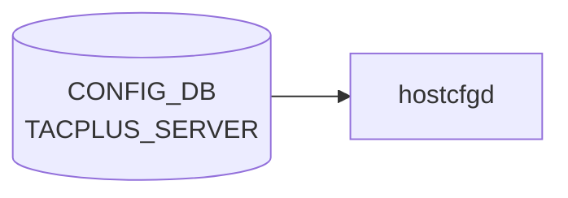

# TACPLUS_SERVER テーブル

## 概要

TACACS+ 認証サーバの一覧と global TACACS+ クライアント設定を保持する。最大 8 サーバ。`hostcfgd` が [CONFIG_DB](../../reference/glossary.md#term-config_db) を購読して `/etc/pam.d/*`, `/etc/nss-tacplus.conf`, `/etc/tacplus_nss.conf` を生成する[^1]。

<!-- cdb-mermaid -->
### データフロー (自動生成)



!!! note "凡例"
    CONFIG_DB から SAI までの典型経路を `docs/reference/config-db-orch-map.md` から機械生成したミニ図。詳細・例外は本ページ本文と対応表を参照。
<!-- /cdb-mermaid -->

## key 構造

```text
TACPLUS_SERVER|<ipaddress>
TACPLUS|global
```

`<ipaddress>` は `inet:host` (FQDN または IPv4/IPv6)。

## TACPLUS_SERVER

| フィールド | 型 | 既定 | 説明 |
|-----------|----|------|------|
| `priority` | uint8 (1..64) | 1 | サーバ選択優先度 (大きいほど先) |
| `tcp_port` | inet:port-number | 49 | TACACS+ サーバ TCP ポート |
| `timeout` | uint16 (1..60) | 5 | per-server 応答 timeout [秒] |
| `auth_type` | enum `pap`/`chap`/`mschap`/`login` | `pap` | per-server 認証プロトコル |
| `key_encrypt` | boolean | false | passkey 暗号化保存フラグ |
| `passkey` | string (1..256, no SPACE/`#`/`,`) | - | per-server 共有秘密 |
| `vrf` | string `mgmt`/`default` | - | サーバ到達 [VRF](../../reference/glossary.md#term-vrf) |

## TACPLUS|global

| フィールド | 型 | 既定 | 説明 |
|-----------|----|------|------|
| `auth_type` | enum (同上) | `pap` | デフォルト認証プロトコル |
| `timeout` | uint16 (1..60) | 5 | デフォルト timeout |
| `key_encrypt` | boolean | false | passkey 暗号化保存フラグ |
| `passkey` | string (1..256) | - | デフォルト共有秘密 |
| `src_intf` | union leafref `PORT`/`PORTCHANNEL`/`LOOPBACK_INTERFACE`/`MGMT_PORT` または Vlan pattern | - | TACACS+ パケット送信元 interface |

## 購読者

- `hostcfgd`: [CONFIG_DB](../../reference/glossary.md#term-config_db) → PAM / NSS 設定の再生成
- 関連: `pam_tacplus`, `libnss_tacplus`

## 関連 CONFIG_DB / YANG / CLI

- 関連 [CONFIG_DB](../../reference/glossary.md#term-config_db): `AAA`、`LDAP_SERVER`、`RADIUS_SERVER`
- 関連 CLI: `config tacacs add/delete/passkey/timeout/authtype/default`、`show tacacs`
- 関連 [YANG](../../reference/glossary.md#term-yang): `sonic-system-tacacs`、`sonic-system-aaa`

<!-- ref-triangle:start -->

## 関連リファレンス

- [YANG](../../reference/glossary.md#term-yang): [`sonic-system-tacacs`](../yang/sonic-system-tacacs.md)
- CLI: `config tacacs`

<!-- ref-triangle:end -->

## 引用元

[^1]: [YANG](../../reference/glossary.md#term-yang) 定義: `sonic-system-tacacs.yang`. <https://github.com/sonic-net/sonic-buildimage/blob/9ea932ec2e18f35e58268ec2e4456b1d4afd65cd/src/sonic-yang-models/yang-models/sonic-system-tacacs.yang>

## 関連ページ
- [HLD: TACACS+ 認証](../../management/tacacs-authentication.md)
- [CLI: config aaa / tacacs](../cli/config-aaa.md)
- [YANG: sonic-system-aaa](../yang/sonic-system-aaa.md)

<!-- topics-back-ref -->
## 関連 Topics

- [Topics: Security / AAA / FIPS / Hardening](../../topics/15-security-aaa/index.md)

<!-- /topics-back-ref -->

<!-- value-behavior -->
## 値依存挙動マトリクス

### `auth_type` (auth_type_enumeration): `pap` (default) / `chap` / `mschap` / `login`

### `vrf` (TACPLUS_SERVER): `mgmt` / `default`

### `key_encrypt` (boolean): `false` (default) / `true`

| フィールド | 値 | 挙動 |
|-----------|-----|-----|
| `auth_type` | `pap` | PAM pam_tacplus でパスワードを平文送信。最も広くサポートされる |
| `auth_type` | `chap` | CHAP でネゴシエーション。TACACS+ サーバ側も CHAP 対応が必要 |
| `auth_type` | `mschap` | MS-CHAP でネゴシエーション |
| `auth_type` | `login` | ASCII ログインシーケンスで認証 |
| `vrf` | `mgmt` | pam_tacplus が管理 [VRF](../../reference/glossary.md#term-vrf) デバイスに bind して接続 |
| `vrf` | `default` | データプレーン [VRF](../../reference/glossary.md#term-vrf) を使用 |
| `key_encrypt` | `true` | passkey は暗号化保存。[hostcfgd](../../reference/glossary.md#term-hostcfgd) が復号してテンプレートに展開 |
| `key_encrypt` | `false` | passkey を平文保存（CONFIG_DB に平文で格納） |
| `passkey` (per-server) | 設定あり | per-server の値が `TACPLUS|global.passkey` より優先 |
| `passkey` (per-server) | 未設定 | `TACPLUS|global.passkey` にフォールバック |
| `priority` | 大きい値 | [hostcfgd](../../reference/glossary.md#term-hostcfgd) がソートして PAM 設定に先に記載（高優先度） |

<!-- /value-behavior -->

<!-- cdb-exceptions -->
## 例外条件・特殊挙動

<!-- evidence: sonic-host-services/scripts/hostcfgd@c5bbbe8b07b96f078fa4b761316627404b01bd04 L473-492 L641-725 -->

- **DEL 操作でエントリ削除**: `tacacs_server_update()` は `data == {}` のとき内部辞書からエントリを削除し `modify_conf_file()` で設定ファイルを再生成する。PAM / NSS 設定ファイルへの反映は同期的に行われる。
- **`priority` の型変換失敗**: `modify_conf_file()` は `priority` を `int()` でソートする。`priority` に整数として解釈できない文字列が入ると `ValueError` が発生し設定ファイル生成が中断する。
- **`src_ip` 未設定時**: `tacplus_global` に `src_ip` がない場合は送信元 IP なしでテンプレートを生成する（デバイス側のルーティングに依存）。
- **audisp-tacplus SIGHUP 失敗**: accounting 連携の PID が見つからないか `os.kill()` が失敗した場合、`"Send SIGHUP to audisp-tacplus failed with exception: {}"` を LOG_WARNING して続行する（認証設定自体は更新される）。
- **テンプレート展開失敗**: Jinja2 テンプレートや設定ファイル書き込みに失敗すると `"Failed generate_file_from_template error={e}"` を LOG_ERR し、設定は反映されない。

<!-- /cdb-exceptions -->

<!-- ops-hint -->
## 運用ヒント

### 典型値

- key 形式: `TACPLUS_SERVER|<ip>`。
- `priority`: 1〜、`tcp_port`: `49`、`timeout`: `5`、`auth_type`: `pap`、`vrf`: `mgmt`。

### よくある誤設定

- passkey を平文で複数台にバラつかせて一部サーバだけ 401 になる。

### 確認コマンド

```bash
sonic-db-cli CONFIG_DB keys 'TACPLUS_SERVER|*'
show tacacs
```
<!-- /ops-hint -->


<!-- derivation -->
## 派生・条件付き登録 (Phase 6/7)

### Phase 6: 自動派生

hostcfgd が `TACPLUS_SERVER.tcp_port` 未設定の場合にデフォルト `49` を補完し、`timeout` 未設定の場合にデフォルト `5` を補完する。`priority` フィールドの昇順でサーバーを PAM 設定に並べる（ソート派生）。

### Phase 7: 条件付き登録 (add_manager 条件)

hostcfgd は常時起動し `TACPLUS_SERVER` テーブルを無条件購読する。ただし `aaa.authentication.login` に `tacacs+` が含まれない場合、TACACS+ サーバー設定があっても PAM に反映されない。

<!-- /derivation -->

<!-- handler-branching -->
### Phase 8: Handler メソッド内分岐

| Handler | 分岐条件 | 効果 | evidence |
|---|---|---|---|
| `hostcfgd` TACACS+ handler | `auth_type==ascii` | PAM に ascii 認証設定 | `hostcfgd.py` |
| `hostcfgd` TACACS+ handler | `auth_type==pap` | PAM に pap 認証設定 | `hostcfgd.py` |
| `hostcfgd` TACACS+ handler | `auth_type==chap` | PAM に chap 認証設定 | `hostcfgd.py` |
| `hostcfgd` TACACS+ handler | `passkey` フィールドあり | `secret=<passkey>` を設定 | `hostcfgd.py` |
| `hostcfgd` TACACS+ handler | `vrf_name` フィールドあり | VRF バインドで TACACS+ サーバーに接続 | `hostcfgd.py` |
| `hostcfgd` TACACS+ handler | `src_ip` フィールドあり | ソース IP を指定して接続 | `hostcfgd.py` |

> **スキャン証跡**: `TACPLUS_SERVER` は TACACS+ 認証の設定テーブル。`auth_type` の分岐と `priority` による順序付けが主要な Phase 8 ポイント。デフォルト値補完が Phase 6 相当。

<!-- /handler-branching -->

<!-- runtime-trace -->
## CDB → 実コンテナ動作トレース

### 段階 1: Consumer 登録

- **hostcfgd**: `TACPLUS` / `TACPLUS_SERVER` テーブルを `ConfigDBConnector` で購読。

### 段階 2: CFG → APPL 翻訳

- hostcfgd の `tacplusHandler` が `/etc/tacplus_servers` / PAM 設定を更新し認証デーモンを再起動。
- APP_DB への書き込みなし。

### 段階 3: APPL → SAI

- SAI 経由なし。TACACS+ は SSH/コンソール認証のコントロールプレーン処理。

### 段階 4: タイミング + 副作用

- 設定変更は次回ログインから有効。既存 SSH セッションには影響なし。
- 副作用: TACACS+ サーバ到達不能時に `auth_type=local` フォールバックが必要。

<!-- /runtime-trace -->
<!-- entry-points -->
## 書き込み入り口 (Direction A)

TACPLUS_SERVER / TACPLUS テーブルへの書き込みが発生するコード経路を網羅的に調査した結果。

### CLI

  - `config tacacs add/delete/set ...` — `config/aaa.py` が TACPLUS_SERVER を書き込む (sonic-utilities/config/aaa.py)

### minigraph / sonic-cfggen

minigraph.py に TACPLUS_SERVER 生成なし

### REST / gNMI

REST/gNMI 書き込み経路なし

### db_migrator

**db_migrator.py** が TACPLUS のマイグレーション処理を実装 (sonic-utilities/scripts/db_migrator.py)

### ビルド時デフォルト (build-time default)

なし

### ハードコードデフォルト / ランタイム注入

なし

### 死活・デッドコード

なし
<!-- /entry-points -->

<!-- defaults -->
## コード由来の暗黙デフォルト (Phase A)

<!-- evidence: sonic-host-services/scripts/hostcfgd L87-89 L366-370 L648-665, sonic-utilities/config/aaa.py L266-267 L283-286, sonic-host-services/data/templates/common-auth-sonic.j2, sonic-host-services/data/templates/tacplus_nss.conf.j2 -->

### ハードコードデフォルト (hostcfgd モジュール定数)

| フィールド | コード定数 | 値 | 適用タイミング |
|-----------|----------|-----|-------------|
| `timeout` | `TACPLUS_SERVER_TIMEOUT_DEFAULT` | `"5"` | `TACPLUS\|global` 未設定時に全サーバーへ fallback |
| `auth_type` | `TACPLUS_SERVER_AUTH_TYPE_DEFAULT` | `"pap"` | 同上 |
| `passkey` | `TACPLUS_SERVER_PASSKEY_DEFAULT` | `""` (空文字) | 同上。空文字は pam_tacplus に渡され認証失敗の可能性あり（silent） |

`tacplus_global_default` が `modify_conf_file()` 冒頭で常に初期化され、`TACPLUS|global` 取得値で上書きされる。つまり `TACPLUS|global` 自体が存在しなくても上記 3 値が補完される。

### CLI 書き込み時デフォルト

`config tacacs add <ip>` は以下を**常に** CONFIG_DB へ書き込む（オプション省略時も）:

| フィールド | CLI デフォルト | 証跡 |
|-----------|-------------|------|
| `tcp_port` | `49` | `aaa.py L266: default=49` |
| `priority` | `1` | `aaa.py L267: default=1` |

`auth_type`、`timeout`、`passkey`、`vrf` は CLI オプションが渡された場合のみ書き込まれる。

### global → per-server 継承

`modify_conf_file()` はサーバーごとに `tacplus_global.copy()` をベースとして per-server の値で上書きする。`TACPLUS|global.auth_type` / `timeout` / `passkey` が per-server の未設定フィールドに自動継承される。

### dead field: `key_encrypt`

YANG では `key_encrypt` フィールドが両テーブルに定義されデフォルト `false`。しかし hostcfgd の `modify_conf_file()` および全テンプレートで `key_encrypt` への参照がゼロ。passkey は CONFIG_DB 値をそのまま pam_tacplus に展開する。`key_encrypt=true` に設定しても暗号化/復号処理は行われず、暗号文が secret として渡り認証失敗になる。**YANG-実装 discrepancy**。

### dead consumer: `src_intf`

YANG: `TACPLUS|global.src_intf` (leafref union)。hostcfgd は `if 'src_ip' in tacplus_global` を参照するが、`src_intf` を IP アドレスに解決するコードがない (RADIUS には実装済み)。`src_intf` を設定しても PAM / NSS 設定に `source_ip=` は挿入されない。TACPLUS の送信元 interface 指定機能は実質的に動作しない。**YANG-実装 discrepancy**。

### `priority` 未設定時の KeyError リスク

hostcfgd は `sorted(..., key=lambda t: int(t['priority']))` でソートする。`priority` が DB に存在しない場合 `KeyError` 後に `int()` で `ValueError` が発生し設定ファイル生成が中断する。CLI は常に `priority=1` を書くが、直接 DB 操作時は注意。

### `aaa.authentication.login` 経路依存

`TACPLUS_SERVER` にエントリがあっても `AAA|authentication.login` に `tacacs+` が含まれない場合、hostcfgd は PAM への TACACS+ 行生成をスキップし nsswitch.conf への `tacplus` 追加も行わない。設定値が存在しても認証に効果なし (silent skip)。

<!-- /defaults -->

<!-- glossary-links-injected: e0332a023fdb -->
