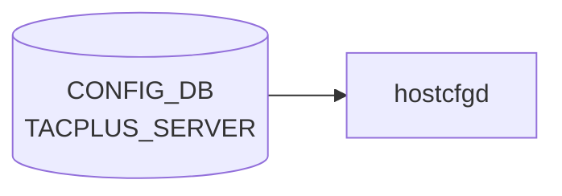

# TACPLUS_SERVER テーブル

## 概要

TACACS+ 認証サーバの一覧と global TACACS+ クライアント設定を保持する。最大 8 サーバ。`hostcfgd` が [CONFIG_DB](../../reference/glossary.md#term-config_db) を購読して `/etc/pam.d/*`, `/etc/nss-tacplus.conf`, `/etc/tacplus_nss.conf` を生成する[^1]。

<!-- cdb-mermaid -->
### データフロー (自動生成)



!!! note "凡例"
    CONFIG_DB から SAI までの典型経路を `docs/reference/config-db-orch-map.md` から機械生成したミニ図。詳細・例外は本ページ本文と対応表を参照。
<!-- /cdb-mermaid -->

## key 構造

```text
TACPLUS_SERVER|<ipaddress>
TACPLUS|global
```

`<ipaddress>` は `inet:host` (FQDN または IPv4/IPv6)。

## TACPLUS_SERVER

| フィールド | 型 | 既定 | 説明 |
|-----------|----|------|------|
| `priority` | uint8 (1..64) | 1 | サーバ選択優先度 (大きいほど先) |
| `tcp_port` | inet:port-number | 49 | TACACS+ サーバ TCP ポート |
| `timeout` | uint16 (1..60) | 5 | per-server 応答 timeout [秒] |
| `auth_type` | enum `pap`/`chap`/`mschap`/`login` | `pap` | per-server 認証プロトコル |
| `key_encrypt` | boolean | false | passkey 暗号化保存フラグ |
| `passkey` | string (1..256, no SPACE/`#`/`,`) | - | per-server 共有秘密 |
| `vrf` | string `mgmt`/`default` | - | サーバ到達 [VRF](../../reference/glossary.md#term-vrf) |

## TACPLUS|global

| フィールド | 型 | 既定 | 説明 |
|-----------|----|------|------|
| `auth_type` | enum (同上) | `pap` | デフォルト認証プロトコル |
| `timeout` | uint16 (1..60) | 5 | デフォルト timeout |
| `key_encrypt` | boolean | false | passkey 暗号化保存フラグ |
| `passkey` | string (1..256) | - | デフォルト共有秘密 |
| `src_intf` | union leafref `PORT`/`PORTCHANNEL`/`LOOPBACK_INTERFACE`/`MGMT_PORT` または Vlan pattern | - | TACACS+ パケット送信元 interface |

## 購読者

- `hostcfgd`: [CONFIG_DB](../../reference/glossary.md#term-config_db) → PAM / NSS 設定の再生成
- 関連: `pam_tacplus`, `libnss_tacplus`

## 関連 CONFIG_DB / YANG / CLI

- 関連 [CONFIG_DB](../../reference/glossary.md#term-config_db): `AAA`、`LDAP_SERVER`、`RADIUS_SERVER`
- 関連 CLI: `config tacacs add/delete/passkey/timeout/authtype/default`、`show tacacs`
- 関連 [YANG](../../reference/glossary.md#term-yang): `sonic-system-tacacs`、`sonic-system-aaa`

<!-- ref-triangle:start -->

## 関連リファレンス

- [YANG](../../reference/glossary.md#term-yang): [`sonic-system-tacacs`](../yang/sonic-system-tacacs.md)
- CLI: `config tacacs`

<!-- ref-triangle:end -->

## 引用元

[^1]: [YANG](../../reference/glossary.md#term-yang) 定義: `sonic-system-tacacs.yang`. <https://github.com/sonic-net/sonic-buildimage/blob/9ea932ec2e18f35e58268ec2e4456b1d4afd65cd/src/sonic-yang-models/yang-models/sonic-system-tacacs.yang>

## 関連ページ
- [HLD: TACACS+ 認証](../../management/tacacs-authentication.md)
- [CLI: config aaa / tacacs](../cli/config-aaa.md)
- [YANG: sonic-system-aaa](../yang/sonic-system-aaa.md)

<!-- topics-back-ref -->
## 関連 Topics

- [Topics: Security / AAA / FIPS / Hardening](../../topics/15-security-aaa/index.md)

<!-- /topics-back-ref -->

<!-- value-behavior -->
## 値依存挙動マトリクス

### `auth_type` (auth_type_enumeration): `pap` (default) / `chap` / `mschap` / `login`

### `vrf` (TACPLUS_SERVER): `mgmt` / `default`

### `key_encrypt` (boolean): `false` (default) / `true`

| フィールド | 値 | 挙動 |
|-----------|-----|-----|
| `auth_type` | `pap` | PAM pam_tacplus でパスワードを平文送信。最も広くサポートされる |
| `auth_type` | `chap` | CHAP でネゴシエーション。TACACS+ サーバ側も CHAP 対応が必要 |
| `auth_type` | `mschap` | MS-CHAP でネゴシエーション |
| `auth_type` | `login` | ASCII ログインシーケンスで認証 |
| `vrf` | `mgmt` | pam_tacplus が管理 [VRF](../../reference/glossary.md#term-vrf) デバイスに bind して接続 |
| `vrf` | `default` | データプレーン [VRF](../../reference/glossary.md#term-vrf) を使用 |
| `key_encrypt` | `true` | passkey は暗号化保存。[hostcfgd](../../reference/glossary.md#term-hostcfgd) が復号してテンプレートに展開 |
| `key_encrypt` | `false` | passkey を平文保存（CONFIG_DB に平文で格納） |
| `passkey` (per-server) | 設定あり | per-server の値が `TACPLUS|global.passkey` より優先 |
| `passkey` (per-server) | 未設定 | `TACPLUS|global.passkey` にフォールバック |
| `priority` | 大きい値 | [hostcfgd](../../reference/glossary.md#term-hostcfgd) がソートして PAM 設定に先に記載（高優先度） |

<!-- /value-behavior -->

<!-- cdb-exceptions -->
## 例外条件・特殊挙動

<!-- evidence: sonic-host-services/scripts/hostcfgd@c5bbbe8b07b96f078fa4b761316627404b01bd04 L473-492 L641-725 -->

- **DEL 操作でエントリ削除**: `tacacs_server_update()` は `data == {}` のとき内部辞書からエントリを削除し `modify_conf_file()` で設定ファイルを再生成する。PAM / NSS 設定ファイルへの反映は同期的に行われる。
- **`priority` の型変換失敗**: `modify_conf_file()` は `priority` を `int()` でソートする。`priority` に整数として解釈できない文字列が入ると `ValueError` が発生し設定ファイル生成が中断する。
- **`src_ip` 未設定時**: `tacplus_global` に `src_ip` がない場合は送信元 IP なしでテンプレートを生成する（デバイス側のルーティングに依存）。
- **audisp-tacplus SIGHUP 失敗**: accounting 連携の PID が見つからないか `os.kill()` が失敗した場合、`"Send SIGHUP to audisp-tacplus failed with exception: {}"` を LOG_WARNING して続行する（認証設定自体は更新される）。
- **テンプレート展開失敗**: Jinja2 テンプレートや設定ファイル書き込みに失敗すると `"Failed generate_file_from_template error={e}"` を LOG_ERR し、設定は反映されない。

<!-- /cdb-exceptions -->

<!-- ops-hint -->
## 運用ヒント

### 典型値

- key 形式: `TACPLUS_SERVER|<ip>`。
- `priority`: 1〜、`tcp_port`: `49`、`timeout`: `5`、`auth_type`: `pap`、`vrf`: `mgmt`。

### よくある誤設定

- passkey を平文で複数台にバラつかせて一部サーバだけ 401 になる。

### 確認コマンド

```bash
sonic-db-cli CONFIG_DB keys 'TACPLUS_SERVER|*'
show tacacs
```
<!-- /ops-hint -->

<!-- ordering -->
## 書込み順依存 (Phase B)

`hostcfgd` (`AaaCfg`) の `modify_conf_file()` は `TACPLUS_SERVER` / `TACPLUS|global` / `AAA` いずれかが更新されるたびに `/etc/pam.d/common-auth-sonic`・`/etc/tacplus_nss.conf`・`/etc/nsswitch.conf` を**丸ごと再生成**する。このため書き込み順序が中間状態の整合性に直結する。

<!-- evidence: sonic-host-services/scripts/hostcfgd L399-417 L641-816 -->

### AAA 設定生成順（load フェーズ）

`AaaCfg.load()` は起動時に次の順序で CONFIG_DB を読み込み、最後に `modify_conf_file()` を **1 回だけ**呼ぶ:

1. `AAA` テーブル全行を `aaa_update(..., modify_conf=False)` で取り込む
2. `TACPLUS|global` 行を `tacacs_global_update(..., modify_conf=False)` で取り込む
3. `TACPLUS_SERVER` 全行を `tacacs_server_update(..., modify_conf=False)` で取り込む
4. `RADIUS|global` / `RADIUS_SERVER` / `LDAP|global` / `LDAP_SERVER` を同様に取り込む
5. `modify_conf_file()` を 1 回実行して PAM / NSS を確定する

この順序は `load_independent_config()` → `AaaCfg.load()` の呼び出し連鎖で保証されており、load フェーズ内での中間 PAM 再生成は起きない。

### PAM 設定書込順（runtime イベント）

runtime 中はテーブル更新のたびに `modify_conf_file()` が呼ばれる。各ハンドラは次の流れで設定ファイルを生成する:

1. `tacplus_global_default`（定数: `timeout=5`, `auth_type=pap`, `passkey=""`）をベースにコピー
2. `TACPLUS|global` の実値で上書き (`tacplus_global.update(self.tacplus_global)`)
3. `TACPLUS_SERVER` の各エントリに対して `tacplus_global.copy()` をベースとして per-server 値で上書き
4. `servers_conf` を `priority` 降順でソート (`sorted(..., key=lambda t: int(t['priority']), reverse=True)`)
5. Jinja2 テンプレートで `/etc/pam.d/common-auth-sonic.tmp` に展開 → `os.rename()` でアトミックに置換
6. `/etc/pam.d/sshd` / `/etc/pam.d/login` の `@include` 行を `common-auth-sonic` に書き換え
7. `nsswitch.conf` の `passwd` 行を `authentication.login` の値に応じて書き換え（tacplus/radius/ldap/none の排他処理）
8. `/etc/tacplus_nss.conf` を `NSS_TACPLUS_CONF_TEMPLATE` から生成
9. `audisp-tacplus` に SIGHUP を送信してアカウンティング設定をリロード

### 検出された順序依存

| # | 依存関係 | 方向 | 緩和策 |
|---|----------|------|--------|
| 1 | `TACPLUS_SERVER` エントリを先書き → `AAA` 書き込み | 推奨（中間不整合最小化） | runtime は subscribe 後追いで自動更新 |
| 2 | `TACPLUS\|global.passkey` 設定 → `AAA\|authentication.login = "tacacs+"` 書き込み | **先行必須**（YANG reject + db_migrator が authorization 削除） | 手動 CLI 再設定が必要 |
| 3 | `AAA\|authentication.login` に `tacacs+` を含む場合のみ nsswitch.conf / PAM に TACACS+ 行が生成 | 機能前提 | `tacacs+` が `login` に含まれない間は servers_conf に値があっても PAM に反映されない |
| 4 | `priority` 値によるサーバ順序 | 降順ソート（大きい値ほど PAM の先頭）; `priority` が欠如すると `KeyError` → `ValueError` で設定生成中断 | CLI は常に `priority=1` を書く; 直接 DB 操作時は注意 |
| 5 | `TACPLUS\|global.passkey` → `AAA\|authorization` (db_migrator) | **先行必須**（passkey 未設定で migration が走ると authorization エントリが削除される） | 手動 `config aaa authorization login tacacs+` で再設定 |

### 主要な制約詳細

**TACPLUS_SERVER 先行推奨 (依存 #1)**: `AAA|authentication.login = "tacacs+"` を先に書き込み `TACPLUS_SERVER` エントリを後から追加すると、[AAA](../../reference/glossary.md#term-aaa) 書き込み時点で `servers_conf` が空になり `common-auth-sonic` は TACACS+ サーバなしで生成される（実質 `local` 相当）。`TACPLUS_SERVER` 追加後に再度 `modify_conf_file()` が呼ばれて正しい設定になるが、その間 TACACS+ 認証は機能しない（evidence: `hostcfgd:641-725`）。

**passkey 先行必須 (依存 #2 / #5)**: `db_migrator.migrate_aaa()` は `TACPLUS|global.passkey` が空の場合に `AAA|authorization` を削除する。YANG must 制約により `AAA|authentication.login` に `tacacs+` を含む場合、passkey が存在しなければ CLI 書き込み自体が reject される（evidence: `db_migrator.py:869-900`, `sonic-system-aaa.yang:must`）。

**PAM アトミック書き換え**: `common-auth-sonic` は `.tmp` ファイルに書いてから `os.rename()` でアトミックに置換する。書き込み中の部分読み込みは起きないが、rename 前後の 2 つの PAM 状態間に「中間状態ウィンドウ」は存在する（evidence: `hostcfgd:727-731`）。

<!-- /ordering -->

<!-- cross-refs -->
## 暗黙参照・共依存テーブル (Phase C)

<!-- evidence: sonic-host-services/scripts/hostcfgd L2221-2230 L641-816 L754-783, sonic-utilities/scripts/db_migrator.py L856-903, sonic-buildimage/src/sonic-yang-models/yang-models/sonic-system-aaa.yang L50-52 -->

`hostcfgd` の `AaaCfg.modify_conf_file()` は `TACPLUS_SERVER` テーブルの変化をトリガーとして、以下のテーブルを**同時に**読み込んで PAM / NSS 設定を再生成する。`TACPLUS_SERVER` 単独では PAM 設定を決定できず、これらのテーブルとの協調が前提となる。

### 共依存テーブル群 — 起動時一括ロード

`load_independent_config()` → `AaaCfg.load()` ([hostcfgd](../../reference/glossary.md#term-hostcfgd):2221-2230) で 7 テーブルを一括ロードし、`modify_conf_file()` を **1 回**だけ呼んで PAM/NSS を確定する。

| テーブル | TACPLUS_SERVER への影響 | evidence |
|---|---|---|
| `AAA` | `authentication.login` に `tacacs+` が含まれる場合のみ PAM 行と nsswitch.conf への TACACS+ エントリを生成する。このテーブルがなければ `TACPLUS_SERVER` にエントリがあっても PAM に反映されない | hostcfgd:755 |
| `TACPLUS` | `auth_type` / `timeout` / `passkey` / `src_ip` の global デフォルトを提供。per-server 値の継承元 (per-server で未指定のフィールドは global 値で補完される) | hostcfgd:648-665 |
| `RADIUS` / `RADIUS_SERVER` | nsswitch.conf の `passwd` 行を tacplus/radius で排他制御するため `modify_conf_file()` が同時参照する | hostcfgd:757-783 |
| `LDAP` / `LDAP_SERVER` | 同上。LDAP 有効時は nsswitch の `group`/`shadow` 行も書き換えるため同時参照される | hostcfgd:770-783 |

### nsswitch.conf 排他制御 — tacplus / radius / ldap の優先順位

`modify_conf_file()` は `AAA|authentication.login` の値に基づいて nsswitch.conf の `passwd` 行を **排他 elif** で書き換える。複数プロトコルが列挙されていても最初にマッチした 1 つのみが有効になる。

| 優先順 | 条件 | nsswitch.conf passwd 行の結果 |
|--------|------|-------------------------------|
| 1 | `tacacs+` in login かつ `servers_conf` が非空 | `tacplus files` または `tacplus compat` に上書き |
| 2 | `radius` in login | `files radius` または `compat radius` に上書き |
| 3 | `ldap` in login | `files ldap` または `compat ldap` に上書き |
| 4 | いずれも含まれない | tacplus / radius / ldap 行を全削除して `files` のみに戻す |

### YANG 制約による外部依存

`sonic-system-aaa.yang` の `must` 制約が `TACPLUS|global.passkey` を**外部参照**する。

```
must 'not(./type = "authentication" and contains(./login, "tacacs+")
      and not(/sonic-system-tacacs/TACPLUS/global/passkey))'
error-message: "Authentication with 'tacacs+' is not allowed when passkey not exists."
```

`TACPLUS|global.passkey` が未設定の状態で `AAA|authentication.login = "tacacs+"` を CLI から書き込もうとすると YANG バリデーションで reject される。

### db_migrator — `migrate_aaa()` による条件付き削除

`db_migrator.py` の `migrate_aaa()` は `TACPLUS|global.passkey` の有無を確認してから `AAA|authorization` を設定する (L890-903)。

| 条件 | 動作 |
|---|---|
| `TACPLUS\|global.passkey` が存在し非空 | `AAA\|authorization` を migration ソースの値で設定 |
| `TACPLUS\|global.passkey` が空または欠如 | `AAA\|authorization` エントリを DB から削除してコマンド認可を無効化 |

これにより、アップグレード時に passkey が引き継がれない場合、コマンド認可設定が消えて認可が `local` に戻る。

<!-- /cross-refs -->

<!-- derivation -->
## 派生・条件付き登録 (Phase 6/7)

### Phase 6: 自動派生

hostcfgd が `TACPLUS_SERVER.tcp_port` 未設定の場合にデフォルト `49` を補完し、`timeout` 未設定の場合にデフォルト `5` を補完する。`priority` フィールドの降順 (`sorted(..., reverse=True)`) でサーバを PAM 設定に並べる。大きい値ほど PAM の先頭に記載され高優先度として扱われる。

### Phase 7: 条件付き登録 (add_manager 条件)

hostcfgd は常時起動し `TACPLUS_SERVER` テーブルを無条件購読する。ただし `aaa.authentication.login` に `tacacs+` が含まれない場合、TACACS+ サーバ設定があっても PAM に反映されない。

<!-- /derivation -->

<!-- handler-branching -->
### Phase 8: Handler メソッド内分岐

| Handler | 分岐条件 | 効果 | evidence |
|---|---|---|---|
| `hostcfgd` TACACS+ handler | `auth_type==login` | PAM に ASCII ログインシーケンス認証設定 (TACACS+ enum `login`) | `hostcfgd.py` |
| `hostcfgd` TACACS+ handler | `auth_type==pap` | PAM に pap 認証設定 | `hostcfgd.py` |
| `hostcfgd` TACACS+ handler | `auth_type==chap` | PAM に chap 認証設定 | `hostcfgd.py` |
| `hostcfgd` TACACS+ handler | `passkey` フィールドあり | `secret=<passkey>` を設定 | `hostcfgd.py` |
| `hostcfgd` TACACS+ handler | `vrf_name` フィールドあり | VRF バインドで TACACS+ サーバに接続 | `hostcfgd.py` |
| `hostcfgd` TACACS+ handler | `src_ip` フィールドあり | ソース IP を指定して接続 | `hostcfgd.py` |

> **スキャン証跡**: `TACPLUS_SERVER` は TACACS+ 認証の設定テーブル。`auth_type` の分岐と `priority` による順序付けが主要な Phase 8 ポイント。デフォルト値補完が Phase 6 相当。

<!-- /handler-branching -->

<!-- runtime-trace -->
## CDB → 実コンテナ動作トレース

### 段階 1: Consumer 登録

- **hostcfgd**: `TACPLUS` / `TACPLUS_SERVER` テーブルを `ConfigDBConnector` で購読。

### 段階 2: CFG → APPL 翻訳

- hostcfgd の `tacplusHandler` が `/etc/tacplus_servers` / PAM 設定を更新し認証デーモンを再起動。
- APP_DB への書き込みなし。

### 段階 3: APPL → SAI

- [SAI](../../reference/glossary.md#term-sai) 経由なし。TACACS+ は SSH/コンソール認証のコントロールプレーン処理。

### 段階 4: タイミング + 副作用

- 設定変更は次回ログインから有効。既存 SSH セッションには影響なし。
- 副作用: TACACS+ サーバ到達不能時に `auth_type=local` フォールバックが必要。

<!-- /runtime-trace -->
<!-- entry-points -->
## 書き込み入り口 (Direction A)

TACPLUS_SERVER / TACPLUS テーブルへの書き込みが発生するコード経路を網羅的に調査した結果。

### CLI

  - `config tacacs add/delete/set ...` — `config/aaa.py` が TACPLUS_SERVER を書き込む ([sonic-utilities](../../reference/glossary.md#term-sonic-utilities)/config/aaa.py)

### minigraph / sonic-cfggen

minigraph.py に TACPLUS_SERVER 生成なし

### REST / gNMI

REST/[gNMI](../../reference/glossary.md#term-gnmi) 書き込み経路なし

### db_migrator

**db_migrator.py** が TACPLUS のマイグレーション処理を実装 ([sonic-utilities](../../reference/glossary.md#term-sonic-utilities)/scripts/db_migrator.py)

### ビルド時デフォルト (build-time default)

なし

### ハードコードデフォルト / ランタイム注入

なし

### 死活・デッドコード

なし
<!-- /entry-points -->

<!-- defaults -->
## コード由来の暗黙デフォルト (Phase A)

<!-- evidence: sonic-host-services/scripts/hostcfgd L87-89 L366-370 L648-665, sonic-utilities/config/aaa.py L266-267 L283-286, sonic-host-services/data/templates/common-auth-sonic.j2, sonic-host-services/data/templates/tacplus_nss.conf.j2 -->

### ハードコードデフォルト (hostcfgd モジュール定数)

| フィールド | コード定数 | 値 | 適用タイミング |
|-----------|----------|-----|-------------|
| `timeout` | `TACPLUS_SERVER_TIMEOUT_DEFAULT` | `"5"` | `TACPLUS\|global` 未設定時に全サーバへ fallback |
| `auth_type` | `TACPLUS_SERVER_AUTH_TYPE_DEFAULT` | `"pap"` | 同上 |
| `passkey` | `TACPLUS_SERVER_PASSKEY_DEFAULT` | `""` (空文字) | 同上。空文字は pam_tacplus に渡され認証失敗の可能性あり（silent） |

`tacplus_global_default` が `modify_conf_file()` 冒頭で常に初期化され、`TACPLUS|global` 取得値で上書きされる。つまり `TACPLUS|global` 自体が存在しなくても上記 3 値が補完される。

### CLI 書き込み時デフォルト

`config tacacs add <ip>` は以下を**常に** CONFIG_DB へ書き込む（オプション省略時も）:

| フィールド | CLI デフォルト | 証跡 |
|-----------|-------------|------|
| `tcp_port` | `49` | `aaa.py L266: default=49` |
| `priority` | `1` | `aaa.py L267: default=1` |

`auth_type`、`timeout`、`passkey`、`vrf` は CLI オプションが渡された場合のみ書き込まれる。

### global → per-server 継承

`modify_conf_file()` はサーバごとに `tacplus_global.copy()` をベースとして per-server の値で上書きする。`TACPLUS|global.auth_type` / `timeout` / `passkey` が per-server の未設定フィールドに自動継承される。

### dead field: `key_encrypt`

YANG では `key_encrypt` フィールドが両テーブルに定義されデフォルト `false`。しかし hostcfgd の `modify_conf_file()` および全テンプレートで `key_encrypt` への参照がゼロ。passkey は CONFIG_DB 値をそのまま pam_tacplus に展開する。`key_encrypt=true` に設定しても暗号化/復号処理は行われず、暗号文が secret として渡り認証失敗になる。**YANG-実装 discrepancy**。

### dead consumer: `src_intf`

YANG: `TACPLUS|global.src_intf` (leafref union)。hostcfgd は `if 'src_ip' in tacplus_global` を参照するが、`src_intf` を IP アドレスに解決するコードがない ([RADIUS](../../reference/glossary.md#term-radius) には実装済み)。`src_intf` を設定しても PAM / NSS 設定に `source_ip=` は挿入されない。TACPLUS の送信元 interface 指定機能は実質的に動作しない。**YANG-実装 discrepancy**。

### `priority` 未設定時の KeyError リスク

hostcfgd は `sorted(..., key=lambda t: int(t['priority']))` でソートする。`priority` が DB に存在しない場合 `KeyError` 後に `int()` で `ValueError` が発生し設定ファイル生成が中断する。CLI は常に `priority=1` を書くが、直接 DB 操作時は注意。

### `aaa.authentication.login` 経路依存

`TACPLUS_SERVER` にエントリがあっても `AAA|authentication.login` に `tacacs+` が含まれない場合、hostcfgd は PAM への TACACS+ 行生成をスキップし nsswitch.conf への `tacplus` 追加も行わない。設定値が存在しても認証に効果なし (silent skip)。

<!-- /defaults -->

<!-- constants -->
## ハードコード定数 (Phase E)

<!-- evidence: sonic-host-services/scripts/hostcfgd L86-89 L366-370 L665, sonic-utilities/config/aaa.py L229 L263-267, sonic-host-services/data/templates/tacplus_nss.conf.j2 L46-50 -->

### モジュール定数 (hostcfgd)

| 定数名 | 値 | フィールド | 説明 |
|--------|----|-----------|----|
| `TACPLUS_SERVER_TIMEOUT_DEFAULT` | `"5"` | `timeout` | `TACPLUS\|global.timeout` 未設定時のデフォルト応答タイムアウト [秒] |
| `TACPLUS_SERVER_AUTH_TYPE_DEFAULT` | `"pap"` | `auth_type` | `TACPLUS\|global.auth_type` 未設定時のデフォルト認証プロトコル |
| `TACPLUS_SERVER_PASSKEY_DEFAULT` | `""` (空文字列) | `passkey` | 共有秘密未設定時のフォールバック。空文字列が pam_tacplus に渡され、サーバ設定と不一致なら認証失敗 (silent) |

### TCP ポートデフォルト

TACACS+ 標準 TCP ポートは **49** (IANA well-known)。

| 定義箇所 | 値 | 備考 |
|---------|----|------|
| `aaa.py L266` CLI `--port` デフォルト | `49` | `config tacacs add` で省略時に CONFIG_DB へ書き込まれる値 |
| `sonic-system-tacacs.yang` `tcp_port` leaf | `49` | YANG モデルのデフォルト |
| `hostcfgd` 内部 | 定数なし | `CONFIG_DB.TACPLUS_SERVER.tcp_port` をそのまま `tacplus_nss.conf.j2` テンプレートに渡す |

### priority レンジ

| 定義箇所 | 範囲 | デフォルト |
|---------|------|-----------|
| `aaa.py L267` CLI `--pri` | `IntRange(1, 64)` | `1` |
| `sonic-system-tacacs.yang` `priority` leaf | `uint8 1..64` | `1` |
| `hostcfgd L665` ソートロジック | — | 降順 (`reverse=True`)。大きい値ほど PAM 設定で先に記載（高優先度） |

### auth_type 列挙値

`aaa.py L229/L265` および `sonic-system-tacacs.yang` が定義する 4 値:

| 値 | 意味 |
|----|----|
| `pap` | PAP (Password Authentication Protocol)。デフォルト。最広互換 |
| `chap` | CHAP (Challenge Handshake Authentication Protocol) |
| `mschap` | MS-CHAP (Microsoft CHAP) |
| `login` | ASCII ログインシーケンス認証 |

<!-- /constants -->

<!-- failure -->
## 失敗挙動 (Phase D)

<!-- evidence: sonic-host-services/scripts/hostcfgd@c5bbbe8b07b96f078fa4b761316627404b01bd04 L665 L728-731 L483-493 L816, sonic-host-services/data/templates/common-auth-sonic.j2 L18 -->

### 不正 `priority` による設定生成中断 (ValueError)

`modify_conf_file()` はサーバリストを `sorted(..., key=lambda t: int(t['priority']), reverse=True)` でソートする（`hostcfgd L665`）。`priority` フィールドに整数として解釈できない文字列が含まれる場合、`int()` が `ValueError` を送出し `modify_conf_file()` 全体が中断する。PAM 設定ファイル (`/etc/pam.d/common-auth-sonic`) および NSS 設定は更新されず、直前の状態のまま残る。例外はキャッチされず呼び出し元に伝播する（unhandled exception）。CLI (`config tacacs add`) は常に `priority=1` を書き込むため通常経路では発生しないが、`sonic-db-cli` 等による直接 DB 操作時に注意が必要。

### PAM 設定ファイル生成失敗

`modify_conf_file()` は Jinja2 テンプレートをレンダリングし `/etc/pam.d/common-auth-sonic.tmp` に書き込んだ後 atomic rename する（`hostcfgd L728-731`）。ファイルシステムの権限不足・ディスクフル・テンプレートレンダリングエラー等が発生した場合、例外は `modify_conf_file()` 内でキャッチされず上位に伝播する。`generate_file_from_template()` 関数経由のパスでは `LOG_ERR: 'Failed generate_file_from_template error={e}'` が出力されるが、`modify_conf_file()` の直接 `open/write/rename` パスでは同等のキャッチがない。認証設定は前回生成済みファイルのまま残る。

### 不正 `auth_type` による pam_tacplus 認証プロトコル失敗 (silent)

hostcfgd は `auth_type` の値を検証せずテンプレートに直接渡す（`hostcfgd L725`）。PAM 設定行は `login={{ server.auth_type }}` として生成される（`common-auth-sonic.j2 L18`）。YANG 列挙 (`pap`/`chap`/`mschap`/`login`) 以外の文字列が設定されると、無効な `login=<値>` が PAM 行に書き込まれる。pam_tacplus はサーバへの接続を試みるが認証プロトコルのネゴシエーションに失敗し認証拒否 (`auth_err`) となる。hostcfgd 側にはエラーログが出力されない（silent failure）。

### audisp-tacplus SIGHUP 失敗 (accounting への影響)

`notify_audisp_tacplus_reload_config()` は audisp-tacplus プロセスに SIGHUP を送信して accounting 設定を再読み込みさせる（`hostcfgd L483-493`）。PID ファイルが存在しないか `os.kill()` が失敗した場合は `LOG_WARNING: 'Send SIGHUP to audisp-tacplus failed with exception: {}'` を出力して継続する。PAM 認証設定自体は更新済みのため **ログイン認証には影響しない** が、TACACS+ accounting ログが古い設定で動作し続ける。audisp-tacplus が起動していない環境では常に発生する。

<!-- /failure -->

<!-- side-effects -->
## 副次 DB 書込 (Phase F)

CONFIG_DB `TACPLUS_SERVER` / `TACPLUS|global` テーブルの変更に伴って `hostcfgd` の `AaaCfg` ハンドラが副次的に書き込む DB エントリは **存在しない**。副作用はすべて Linux ホスト OS の設定ファイル書き換えおよびプロセスシグナル送信に閉じる。

| 副次 DB | 書込有無 | 根拠 |
|---|---|---|
| [APPL_DB](../../reference/glossary.md#term-appl_db) | なし | `AaaCfg` クラス内に `Producer` / `Table` / `hset` / `Notification` の呼び出しが 0 件。`modify_conf_file()` (hostcfgd:641-870) を `Producer`/`set(`/`hset` で grep して 0 ヒット |
| [STATE_DB](../../reference/glossary.md#term-state_db) | なし | `state_db_conn` は `FipsCfg` (hostcfgd:1792) と `RestartWaiter` (hostcfgd:2160) のみが保持。`AaaCfg` は `state_db_conn` を保持しない |
| [COUNTERS_DB](../../reference/glossary.md#term-counters_db) | なし | `hostcfgd` 全体に [COUNTERS_DB](../../reference/glossary.md#term-counters_db) 参照なし。[AAA](../../reference/glossary.md#term-aaa) / TACACS+ はコントロールプレーン処理のため統計テーブルも存在しない |
| [ASIC_DB](../../reference/glossary.md#term-asic_db) / [FLEX_COUNTER_DB](../../reference/glossary.md#term-flex_counter_db) | なし | [SAI](../../reference/glossary.md#term-sai) 非経由 (runtime-trace 段階 3 参照)。`TACPLUS_SERVER` を購読する [orchagent](../../reference/glossary.md#term-orchagent) は存在しない |
| [LOGLEVEL_DB](../../reference/glossary.md#term-loglevel_db) | なし | hostcfgd 全体に [LOGLEVEL_DB](../../reference/glossary.md#term-loglevel_db) 参照なし |

### 実際の副作用 (ファイル書き換え・プロセスシグナル)

`TACPLUS_SERVER` / `TACPLUS|global` の変更がトリガーとなって `modify_conf_file()` が呼ぶ副作用は以下の通り:

| 副作用 | 対象ファイル / 操作 | 条件 | evidence |
|---|---|---|---|
| PAM 認証設定再生成 | `/etc/pam.d/common-auth-sonic` (`.tmp` → atomic rename) | 常時 | `hostcfgd:728-731` |
| sshd / login include 書換 | `/etc/pam.d/sshd`, `/etc/pam.d/login` の `@include` 行 | 常時 | `hostcfgd:755-783` |
| NSS passwd 行書換 | `/etc/nsswitch.conf` の `passwd:` 行 | `tacacs+` が `login` に含まれる場合 | `hostcfgd:756-783` |
| TACACS+ NSS 設定再生成 | `/etc/tacplus_nss.conf` | 常時 | `hostcfgd:800-815` |
| audisp-tacplus へ SIGHUP | `os.kill(pid, SIGHUP)` — アカウンティング設定リロード | 常時 (プロセス不在時は LOG_WARNING のみ) | `hostcfgd:483-493` |

> **Evidence**: `sonic-host-services/scripts/hostcfgd:354-870` を `Producer`/`set(`/`hset`/`Notification`/`state_db` でスキャンして 0 ヒット。副作用は Linux ファイルシステム操作と `os.kill()` のみ (hostcfgd:641-870)。詳細スキャン手順は `meta/_intermediate/cdb-flow/tacplus-server-ordering.md` を参照。
<!-- /side-effects -->

<!-- pubsub -->
## 通信メカニズム (Phase G)

### Redis 購読方式

`TACPLUS_SERVER` および `TACPLUS`（global）テーブルへの変更通知は、`hostcfgd` が **`ConfigDBConnector.subscribe()` + `listen()`** で登録する **[Redis](../../reference/glossary.md#term-redis) keyspace 通知 (PSUBSCRIBE `__keyspace@<dbId>__:<TABLE>|*`)** によって配信される。`swsscommon.SubscriberStateTable` や `ConsumerStateTable`（channel ベース PUBLISH/SUBSCRIBE）は**使用しない**。CONFIG_DB は永続前提のため TTL は設定されない。

| 購読者 | 購読 API | 購読テーブル | ハンドラ |
|--------|---------|--------------|---------|
| `hostcfgd` (`AaaCfg` 経由) | `ConfigDBConnector.subscribe()` | `TACPLUS_SERVER` | `tacacs_server_handler` → `tacacs_server_update` |
| `hostcfgd` (`AaaCfg` 経由) | 同上 | `TACPLUS` | `tacacs_global_handler` → `tacacs_global_update` |

`hostcfgd` 以外で `TACPLUS_SERVER` を CONFIG_DB から購読するプロセスは存在しない（[orchagent](../../reference/glossary.md#term-orchagent) / [syncd](../../reference/glossary.md#term-syncd) / bgpd 等で `TACPLUS_SERVER` を grep して 0 ヒット）。PAM モジュール（`pam_tacplus`）は [Redis](../../reference/glossary.md#term-redis) を購読せず、`/etc/pam.d/common-auth-sonic` を認証時にファイルから読む。

### keyspace 通知 → ハンドラ呼び出しの流れ

```
config tacacs add <ip> ...
  ↓ HSET "TACPLUS_SERVER|<ip>" priority "1" auth_type "pap" ...
Redis keyspace PUBLISH "__keyspace@4__:TACPLUS_SERVER|<ip>"  "hset"
  ↓ ConfigDBConnector.listen() がパターンマッチ
make_callback() で (key=<ip>, op=SET, data=HGETALL結果) を生成
  ↓ tacacs_server_handler(key, op="SET", data={...})  [hostcfgd:2303-2308]
     → AaaCfg.tacacs_server_update(key, data)         [hostcfgd:473-481]
          → self.tacplus_servers[key] = data
          → modify_conf_file()                         [hostcfgd:641-870]
               → TACPLUS_SERVER × TACPLUS|global マージ + priority ソート
               → common-auth-sonic.j2 展開 → /etc/pam.d/common-auth-sonic (atomic rename)
               → tacplus_nss.conf.j2 展開 → /etc/tacplus_nss.conf
               → /etc/nsswitch.conf の passwd 行書換
               → notify_audisp_tacplus_reload_config() → audisp-tacplus へ SIGHUP
```

- keyspace 通知のペイロードは操作名（`hset`/`del` 等）のみ。フィールド値は `HGETALL` で取得する。
- `op` は `data is None ? DEL : SET` の 2 値判定（`make_callback()` — hostcfgd:2458-2466）。`HDEL`/`HSET` の [Redis](../../reference/glossary.md#term-redis) 操作種別自体は区別しない。
- DEL 時は `data={}` が渡るため `tacacs_server_update()` の `data == {}` 分岐でサーバエントリを削除する（hostcfgd:474-476）。

### 起動時スナップショット

`config_db.listen(init_data_handler=self.load)` (hostcfgd:2528) により、subscribe ループ開始前に `HostConfigDaemon.load()` → `load_independent_config()` が呼ばれ、`AaaCfg.load(aaa, tac_global_conf, tacplus_conf, ...)` (hostcfgd:399-417) が `init_data['TACPLUS_SERVER']` / `init_data['TACPLUS']` を一括スナップショットで適用する。各エントリは `tacacs_server_update(row, data, modify_conf=False)` でメモリに反映され、最後に `modify_conf_file()` を 1 回呼ぶ（hostcfgd:417）。

### 非同期性・タイミング

- 設定変更から PAM ファイル反映まで数十ミリ秒〜数秒のラグが生じる場合がある（poll ループの実行タイミングに依存）。
- PAM ファイルが書き換わった直後から新規 SSH セッション / console ログインに反映される。既存セッションは影響を受けない。

> **Evidence**: `sonic-host-services/scripts/hostcfgd:2471-2472` (subscribe 登録)、`hostcfgd:2458-2466` (make_callback)、`hostcfgd:2303-2315` (tacacs_server_handler / tacacs_global_handler)、`hostcfgd:473-481` (tacacs_server_update)、`hostcfgd:399-417` (AaaCfg.load 起動時スナップショット)、`hostcfgd:2528` (listen)、`hostcfgd:641-870` (modify_conf_file); 詳細分析 `meta/_intermediate/cdb-flow/tacplus-server-pubsub.md`
<!-- /pubsub -->

<!-- platform -->
## プラットフォーム差 (Phase H)

ソース: `sonic-net/sonic-host-services/scripts/hostcfgd`, `sonic-net/sonic-host-services/data/templates/tacplus_nss.conf.j2`, `sonic-net/sonic-buildimage/files/build_templates/sonic_debian_extension.j2`

### 結論

**プラットフォーム差なし**。TACPLUS_SERVER 処理は host 単位で適用され、[ASIC](../../reference/glossary.md#term-asic) 種別・multi-asic / [VOQ](../../reference/glossary.md#term-voq) chassis 構成・[SmartSwitch](../../reference/glossary.md#term-smartswitch) [DPU](../../reference/glossary.md#term-dpu)・ベンダー固有 PAM モジュールに依存しない。

### 根拠

#### 1. multi-asic: `is_multi_npu` は AaaCfg に渡されない

`hostcfgd` 行 2182 で `self.is_multi_npu = device_info.is_multi_npu()` を取得するが、行 2185 の `AaaCfg(self.config_db)` コンストラクタには渡されない。`AaaCfg.__init__` は `ConfigDBConnector` 1 個のみを保持し、`asic0..N` namespace への接続や iteration を一切しない。`TACPLUS_SERVER` / `TACPLUS|global` テーブルは host CONFIG_DB のみに置かれ、`asicN` namespace の CONFIG_DB には存在しない。

#### 2. VOQ chassis / line card

`hostcfgd` ソース全体を `chassis`, `supervisor`, `linecard` で検索してもゼロヒット。[VOQ](../../reference/glossary.md#term-voq) chassis の各 line card / supervisor は独立した host `hostcfgd` を持ち、それぞれが自身の host CONFIG_DB の `TACPLUS_SERVER` テーブルを処理する。chassis 全体での集中適用機構は存在しない。オペレータが各 host に同一の TACACS+ サーバ設定を流す運用が前提。

#### 3. SmartSwitch / DPU

`AaaCfg` クラスに `has_per_dpu_scope` や `num_dpus` を参照する箇所はない。`DEVICE_METADATA.localhost.subtype` は `AaaCfg` の処理で参照されない。[SmartSwitch](../../reference/glossary.md#term-smartswitch) 固有の TACACS+ 処理分岐は存在しない。

#### 4. ビルド時インストールにプラットフォーム固有条件なし

`sonic_debian_extension.j2` 行 317–335 の TACACS+ インストールブロックに `` 等の条件ブロックなし。`libpam-tacplus`, `libnss-tacplus`, `bash-tacplus`, `audisp-tacplus` は全プラットフォーム共通でインストールされ、デフォルトで PAM auth-update から除外 (`pam-auth-update --remove tacplus ldap`) される。

#### 5. テンプレートにプラットフォーム分岐なし

`tacplus_nss.conf.j2` を `platform|asic|chassis|namespace|vendor` で検索してもヒットなし。条件分岐は `debug`, `local_accounting`, `tacacs_accounting`, `local_authorization`, `tacacs_authorization` ブールフラグおよび `servers[]` リストのみ。`common-auth-sonic.j2` にも platform キーワードはなく、条件分岐は `AAA.authentication.login` 文字列・`failthrough` / `debug` / `trace` ブールのみ。

#### 6. 管理 VRF の注意点（構成差ではなく運用上の注意）

`TACPLUS_SERVER.vrf` フィールドに `mgmt` を設定すると、テンプレートで PAM 行に `vrf=mgmt` が挿入される。管理 VRF 自体の有効/無効は `MGMT_VRF_CONFIG.mgmtVrfEnabled` で制御されるが、`AaaCfg` はこの値を読まない。管理 VRF が未有効の状態で `vrf=mgmt` を設定すると `pam_tacplus` が mgmt VRF ルーティングテーブルを参照し認証失敗する。これはプラットフォーム差ではなく運用上の設定整合性の問題。

> **Evidence**: `hostcfgd:2182-2185` (is_multi_npu / AaaCfg 初期化)、`hostcfgd:641-816` (modify_conf_file)、`sonic_debian_extension.j2:317-335` (インストールブロック)、`tacplus_nss.conf.j2` (テンプレート全行)、`common-auth-sonic.j2` (テンプレート全行); 詳細分析 `meta/_intermediate/cdb-flow/tacplus-server-platform.md`
<!-- /platform -->

<!-- glossary-links-injected: 30e1ce753e5d -->
