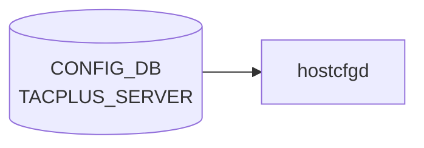

# TACPLUS_SERVER テーブル

## 概要

TACACS+ 認証サーバの一覧と global TACACS+ クライアント設定を保持する。最大 8 サーバ。`hostcfgd` が [CONFIG_DB](../../reference/glossary.md#term-config_db) を購読して `/etc/pam.d/*`, `/etc/nss-tacplus.conf`, `/etc/tacplus_nss.conf` を生成する[^1]。

<!-- cdb-mermaid -->
### データフロー (自動生成)



!!! note "凡例"
    CONFIG_DB から SAI までの典型経路を `docs/reference/config-db-orch-map.md` から機械生成したミニ図。詳細・例外は本ページ本文と対応表を参照。
<!-- /cdb-mermaid -->

## key 構造

```
TACPLUS_SERVER|<ipaddress>
TACPLUS|global
```

`<ipaddress>` は `inet:host` (FQDN または IPv4/IPv6)。

## TACPLUS_SERVER

| フィールド | 型 | 既定 | 説明 |
|-----------|----|------|------|
| `priority` | uint8 (1..64) | 1 | サーバ選択優先度 (大きいほど先) |
| `tcp_port` | inet:port-number | 49 | TACACS+ サーバ TCP ポート |
| `timeout` | uint16 (1..60) | 5 | per-server 応答 timeout [秒] |
| `auth_type` | enum `pap`/`chap`/`mschap`/`login` | `pap` | per-server 認証プロトコル |
| `key_encrypt` | boolean | false | passkey 暗号化保存フラグ |
| `passkey` | string (1..256, no SPACE/`#`/`,`) | - | per-server 共有秘密 |
| `vrf` | string `mgmt`/`default` | - | サーバ到達 [VRF](../../reference/glossary.md#term-vrf) |

## TACPLUS|global

| フィールド | 型 | 既定 | 説明 |
|-----------|----|------|------|
| `auth_type` | enum (同上) | `pap` | デフォルト認証プロトコル |
| `timeout` | uint16 (1..60) | 5 | デフォルト timeout |
| `key_encrypt` | boolean | false | passkey 暗号化保存フラグ |
| `passkey` | string (1..256) | - | デフォルト共有秘密 |
| `src_intf` | union leafref `PORT`/`PORTCHANNEL`/`LOOPBACK_INTERFACE`/`MGMT_PORT` または Vlan pattern | - | TACACS+ パケット送信元 interface |

## 購読者

- `hostcfgd`: CONFIG_DB → PAM / NSS 設定の再生成
- 関連: `pam_tacplus`, `libnss_tacplus`

## 関連 CONFIG_DB / YANG / CLI

- 関連 CONFIG_DB: `AAA`、`LDAP_SERVER`、`RADIUS_SERVER`
- 関連 CLI: `config tacacs add/delete/passkey/timeout/authtype/default`、`show tacacs`
- 関連 [YANG](../../reference/glossary.md#term-yang): `sonic-system-tacacs`、`sonic-system-aaa`

<!-- ref-triangle:start -->

## 関連リファレンス

- YANG: [`sonic-system-tacacs`](../yang/sonic-system-tacacs.md)
- CLI: `config tacacs`

<!-- ref-triangle:end -->

## 引用元

[^1]: YANG 定義: `sonic-system-tacacs.yang`. <https://github.com/sonic-net/sonic-buildimage/blob/9ea932ec2e18f35e58268ec2e4456b1d4afd65cd/src/sonic-yang-models/yang-models/sonic-system-tacacs.yang>

## 関連ページ
- [HLD: TACACS+ 認証](../../management/tacacs-authentication.md)
- [CLI: config aaa / tacacs](../cli/config-aaa.md)
- [YANG: sonic-system-aaa](../yang/sonic-system-aaa.md)

<!-- topics-back-ref -->
## 関連 Topics

- [Topics: Security / AAA / FIPS / Hardening](../../topics/15-security-aaa/index.md)

<!-- /topics-back-ref -->

<!-- ops-hint -->
## 運用ヒント

### 典型値

- key 形式: `TACPLUS_SERVER|<ip>`。
- `priority`: 1〜、`tcp_port`: `49`、`timeout`: `5`、`auth_type`: `pap`、`vrf`: `mgmt`。

### よくある誤設定

- passkey を平文で複数台にバラつかせて一部サーバだけ 401 になる。

### 確認コマンド

```bash
sonic-db-cli CONFIG_DB keys 'TACPLUS_SERVER|*'
show tacacs
```
<!-- /ops-hint -->

<!-- glossary-links-injected: a6c6612be307 -->
