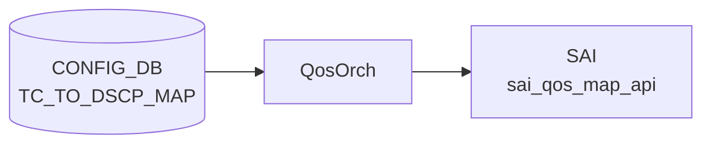

# TC_TO_DSCP_MAP テーブル

## 概要

Traffic Class (TC) を [DSCP](../../reference/glossary.md#term-dscp) 値へマップする egress [QoS](../../reference/glossary.md#term-qos) リマーキング定義[^1]。`qosorch` が [SAI](../../reference/glossary.md#term-sai) [QoS](../../reference/glossary.md#term-qos) map (`SAI_QOS_MAP_TYPE_TC_AND_COLOR_TO_DSCP`) を生成する。`PORT_QOS_MAP.tc_to_dscp_map` でポートに、`TUNNEL.encap_tc_to_dscp_map` でトンネル encap 時の DSCP 上書きに使用される。

<!-- cdb-mermaid -->
### データフロー (自動生成)



!!! note "凡例"
    CONFIG_DB から SAI までの典型経路を `docs/reference/config-db-orch-map.md` から機械生成したミニ図。詳細・例外は本ページ本文と対応表を参照。
<!-- /cdb-mermaid -->

## key 構造

```text
TC_TO_DSCP_MAP|<name>|<tc>
```

`<name>` はマップ名（1..32 文字、`[a-zA-Z0-9][-a-zA-Z0-9_]*`）。`<tc>` は 0..15（YANG 定義上）。

## フィールド一覧

| フィールド | 型 | 必須 | 説明 |
|-----------|----|------|------|
| `name` (key) | string (1..32) | ✅ | マップ名 |
| `tc` (key) | `tc_type` (0..15) | ✅ | 送信元 Traffic Class |
| `dscp` | string `0..63` | - | egress 時に書き込む [DSCP](../../reference/glossary.md#term-dscp) 値 |

[YANG](../../reference/glossary.md#term-yang) 上は親子 list 構造。[Redis](../../reference/glossary.md#term-redis) に展開すると `TC_TO_DSCP_MAP|<name>` の hash field として `<tc>: <dscp>` ペアが格納される。

<!-- value-behavior -->
## 値依存挙動マトリクス

### `tc` (key: tc_type 0..15)

| 値 | 挙動 |
|----|------|
| `0`..`7` | qosorch が `SAI_QOS_MAP_TYPE_TC_AND_COLOR_TO_DSCP` エントリを生成 |
| `8`..`15` | YANG は許可するが大多数の ASIC は TC 0..7 のみサポート → SAI エラー (`task_failed`) |
| 非数値文字列 | `stoi()` 例外 → `task_invalid_entry` |

### `dscp` (string 0..63)

| 値 | 挙動 |
|----|------|
| `0`..`63` | qosorch が SAI エントリを生成 |
| 負値 | 明示的エラーログ → `task_invalid_entry` |
| `64` 以上 | `DSCP_MAX_VAL=63` 超過を明示チェック → `task_invalid_entry` |
| 非数値文字列 | `invalid_argument` 例外 → `task_invalid_entry`（try-catch あり） |

> スパース定義可能。未定義 TC の egress DSCP はデフォルト値なし（ASIC/SAI 実装依存）。
> `PORT_QOS_MAP.tc_to_dscp_map` または `TUNNEL.encap_tc_to_dscp_map` から参照されない限り SAI に反映されない。

<!-- /value-behavior -->

## 購読者

- `qosorch`: [SAI](../../reference/glossary.md#term-sai) [QoS](../../reference/glossary.md#term-qos) map 生成（直接 CONFIG_DB 購読）

## 関連 CONFIG_DB / YANG / CLI

- 関連 [CONFIG_DB](../../reference/glossary.md#term-config_db): `PORT_QOS_MAP`、`TUNNEL`、`DSCP_TO_TC_MAP`
- 関連 CLI: なし
- 関連 [YANG](../../reference/glossary.md#term-yang): `sonic-tc-dscp-map`

<!-- ref-triangle:start -->

## 関連リファレンス

- [YANG](../../reference/glossary.md#term-yang): [`sonic-tc-dscp-map`](../yang/sonic-tc-dscp-map.md)

<!-- ref-triangle:end -->

## 引用元

[^1]: YANG 定義: `sonic-tc-dscp-map.yang`. <https://github.com/sonic-net/sonic-buildimage/blob/9ea932ec2e18f35e58268ec2e4456b1d4afd65cd/src/sonic-yang-models/yang-models/sonic-tc-dscp-map.yang>

<!-- topics-back-ref -->
## 関連 Topics

- [Topics: QoS / Buffer / PFC / Watermark](../../topics/08-qos-buffer/index.md)

<!-- /topics-back-ref -->

<!-- ops-hint -->
## 運用ヒント

### 典型値

- key 形式: `TC_TO_DSCP_MAP|<name>` (例 `AZURE_TUNNEL`)。
- 値: `0:8`, `5:46`, `7:48` 等の TC→DSCP マップ。
- 主な用途はトンネル encap 時の egress DSCP 上書き（`TUNNEL.encap_tc_to_dscp_map` 経由）。

### よくある誤設定

- TC を 8 以上に書くと ASIC が拒否（TC は実運用上 0..7 のみ有効）。
- DSCP を 63 超に書くと qosorch がエラーで reject する。

### 確認コマンド

```bash
sonic-db-cli CONFIG_DB hgetall 'TC_TO_DSCP_MAP|AZURE_TUNNEL'
show qos map tc-dscp
```
<!-- /ops-hint -->

<!-- cdb-exceptions -->
## 例外条件・特殊挙動

| consumer | 条件 | 挙動 |
|---|---|---|
| [orchagent](../../reference/glossary.md#term-orchagent) | DEL 時に PORT_QOS_MAP または TUNNEL から参照中 | `m_pendingRemove=true` を立てて `task_need_retry` を返す（qosorch.cpp:181-186） |
| [orchagent](../../reference/glossary.md#term-orchagent) | `dscp` が負値 | 明示エラーログ後 `false` 返却 → `task_invalid_entry` |
| [orchagent](../../reference/glossary.md#term-orchagent) | `dscp` が 63 超 | `DSCP_MAX_VAL` チェックで明示エラーログ → `task_invalid_entry` |
| [orchagent](../../reference/glossary.md#term-orchagent) | `dscp` が非数値文字列 | `invalid_argument` 例外を catch → `task_invalid_entry`（silent drop でない） |
| orchagent | SAI 生成・変更・削除失敗 | `task_failed` を返す（qosorch.cpp:162-166） |

> **Evidence**: `sonic-swss/orchagent/qosorch.cpp:1216-1260` (convertFieldValuesToAttributes), `orchagent/qosorch.cpp:181-186` (pending remove)
<!-- /cdb-exceptions -->

<!-- runtime-trace -->
## 実コンテナ動作トレース

### 段階 1 — Consumer 登録

`QosOrch` (orchagent 直接 CFG 購読) が CONFIG_DB の `TC_TO_DSCP_MAP` テーブルを購読する。key はマップ名 (例: `AZURE_TUNNEL`)。

### 段階 2 — CFG→APPL 翻訳

なし（orchagent が直接 CONFIG_DB を購読）。

### 段階 3 — APPL→SAI

`sai_qos_map_api->create_qos_map()` で `SAI_QOS_MAP_TYPE_TC_AND_COLOR_TO_DSCP` 型 QoS map を作成（qosorch.cpp:1270-1282）。

### 段階 4 — タイミングと副作用

**適用タイミング**: orchagent が CONFIG_DB 変化を検知後即座に SAI QoS map を作成/更新。ポート/トンネルへの割り当ては `PORT_QOS_MAP.tc_to_dscp_map` または `TUNNEL.encap_tc_to_dscp_map` で行う。

**副作用**: マップ変更はそのマップを参照するすべてのポート・トンネルの egress DSCP リマーキングに即座に影響。
<!-- /runtime-trace -->

<!-- entry-points -->
## 書き込み入り口 (Direction A)

対象テーブル: `TC_TO_DSCP_MAP`

### CLI
- なし（TC_TO_DSCP_MAP の直接 CLI コマンドは標準 SONiC に存在しない）

### minigraph / sonic-cfggen
- なし

### REST / gNMI (sonic-mgmt-common)
- なし（対応 OpenConfig/SONiC YANG transformer なし）

### db_migrator
- なし

### ビルド時デフォルト (init_cfg / j2 テンプレート)
- `qos_config.j2` L334-337: `generate_tc_to_dscp_map`（`tunnel_qos_remap_enable` かつ定義済み時）または `generate_tc_to_dscp_map_per_sku`（定義済み時）が呼ばれる
- **フォールバック else 節なし**。どちらの関数も未定義のプラットフォームでは TABLE 非生成
- 例: common/profiles/th2/7260 系では `AZURE_TUNNEL` マップ（TC 0-8 → DSCP）が生成される

### ハードコードデフォルト
- なし

### ランタイム注入 (デーモン自動書き込み)
- なし
<!-- /entry-points -->

<!-- defaults -->
## コード由来の暗黙デフォルト・制約

### `dscp` フィールド — 検証ロジック

| 観点 | 内容 |
|------|------|
| YANG 定義 | pattern `"6[0-3]|[1-5][0-9]?|[0-9]?"` — 0..63 の string |
| 上限定数 | `#define DSCP_MAX_VAL 63` (qosorch.cpp:119) |
| 実装検証 | 負値と 63 超を明示チェック。非数値は try-catch で捕捉 → `task_invalid_entry` |
| 結論 | YANG と実装の範囲は一致（両方 0..63）。例外処理も適切に実装 |

### `tc` フィールド (key) — YANG-実装 discrepancy

| 観点 | 内容 |
|------|------|
| YANG 定義 | `stypes:tc_type` = `uint8 range "0..15"` (sonic-types.yang.j2:338) |
| SAI/ASIC 実態 | 大多数の ASIC は TC 0..7 のみサポート。TC 8..15 を設定すると SAI エラー → `task_failed` |
| 結論 | **YANG は 0..15 を許可するが、実運用上 8..15 は ASIC に reject される**（silent エラーでなく task_failed） |

### SAI MAP TYPE ハードコード

`TcToDscpMapHandler::addQosItem()` にて SAI map type がハードコード:

```cpp
// qosorch.cpp:1271
qos_map_attr.value.u32 = SAI_QOS_MAP_TYPE_TC_AND_COLOR_TO_DSCP;
```

ポート attribute も対応する `SAI_PORT_ATTR_QOS_TC_AND_COLOR_TO_DSCP_MAP` が qosorch.cpp:66 にハードコード。

### ビルド時デフォルトの欠如

- TC_TO_QUEUE_MAP（フォールバック恒等写像あり）と異なり、TC_TO_DSCP_MAP は qos_config.j2 にフォールバック else 節が存在しない
- プラットフォーム関数未定義時は TABLE 自体が非生成 → CONFIG_DB にエントリなしが正常動作

### 書込み順依存

- `TC_TO_DSCP_MAP` 作成前に `PORT_QOS_MAP` または `TUNNEL` で参照した場合、参照側が `task_need_retry` でキューイング
- **DEL 保留**: 参照中は DEL が `m_pendingRemove=true` でキューイングされ、参照解放まで SAI remove は呼ばれない（qosorch.cpp:181-186）

> **Evidence**: `sonic-swss/orchagent/qosorch.cpp:1216-1290` (TcToDscpMapHandler 実装全体); `sonic-buildimage/files/build_templates/qos_config.j2:334-337`; `sonic-buildimage/device/common/profiles/th2/7260/BALANCED/qos.json.j2:422`
<!-- /defaults -->
