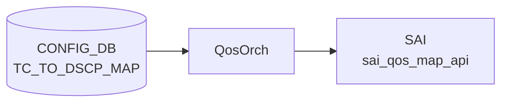

# TC_TO_DSCP_MAP テーブル

## 概要

Traffic Class (TC) を [DSCP](../../reference/glossary.md#term-dscp) 値へマップする egress [QoS](../../reference/glossary.md#term-qos) リマーキング定義[^1]。`qosorch` が [SAI](../../reference/glossary.md#term-sai) [QoS](../../reference/glossary.md#term-qos) map (`SAI_QOS_MAP_TYPE_TC_AND_COLOR_TO_DSCP`) を生成する。`PORT_QOS_MAP.tc_to_dscp_map` でポートに、`TUNNEL.encap_tc_to_dscp_map` でトンネル encap 時の [DSCP](../../reference/glossary.md#term-dscp) 上書きに使用される。

<!-- cdb-mermaid -->
### データフロー (自動生成)



!!! note "凡例"
    CONFIG_DB から SAI までの典型経路を `docs/reference/config-db-orch-map.md` から機械生成したミニ図。詳細・例外は本ページ本文と対応表を参照。
<!-- /cdb-mermaid -->

## key 構造

```text
TC_TO_DSCP_MAP|<name>|<tc>
```

`<name>` はマップ名（1..32 文字、`[a-zA-Z0-9][-a-zA-Z0-9_]*`）。`<tc>` は 0..15（YANG 定義上）。

## フィールド一覧

| フィールド | 型 | 必須 | 説明 |
|-----------|----|------|------|
| `name` (key) | string (1..32) | ✅ | マップ名 |
| `tc` (key) | `tc_type` (0..15) | ✅ | 送信元 Traffic Class |
| `dscp` | string `0..63` | - | egress 時に書き込む [DSCP](../../reference/glossary.md#term-dscp) 値 |

[YANG](../../reference/glossary.md#term-yang) 上は親子 list 構造。[Redis](../../reference/glossary.md#term-redis) に展開すると `TC_TO_DSCP_MAP|<name>` の hash field として `<tc>: <dscp>` ペアが格納される。

<!-- value-behavior -->
## 値依存挙動マトリクス

### `tc` (key: tc_type 0..15)

| 値 | 挙動 |
|----|------|
| `0`..`7` | qosorch が `SAI_QOS_MAP_TYPE_TC_AND_COLOR_TO_DSCP` エントリを生成 |
| `8`..`15` | YANG は許可するが大多数の [ASIC](../../reference/glossary.md#term-asic) は TC 0..7 のみサポート → [SAI](../../reference/glossary.md#term-sai) エラー (`task_failed`) |
| 非数値文字列 | `stoi()` 例外 → `task_invalid_entry` |

### `dscp` (string 0..63)

| 値 | 挙動 |
|----|------|
| `0`..`63` | qosorch が SAI エントリを生成 |
| 負値 | 明示的エラーログ → `task_invalid_entry` |
| `64` 以上 | `DSCP_MAX_VAL=63` 超過を明示チェック → `task_invalid_entry` |
| 非数値文字列 | `invalid_argument` 例外 → `task_invalid_entry`（try-catch あり） |

> スパース定義可能。未定義 TC の egress DSCP はデフォルト値なし（[ASIC](../../reference/glossary.md#term-asic)/SAI 実装依存）。
> `PORT_QOS_MAP.tc_to_dscp_map` または `TUNNEL.encap_tc_to_dscp_map` から参照されない限り SAI に反映されない。

<!-- /value-behavior -->

## 購読者

- `qosorch`: [SAI](../../reference/glossary.md#term-sai) [QoS](../../reference/glossary.md#term-qos) map 生成（直接 [CONFIG_DB](../../reference/glossary.md#term-config_db) 購読）

## 関連 CONFIG_DB / YANG / CLI

- 関連 [CONFIG_DB](../../reference/glossary.md#term-config_db): `PORT_QOS_MAP`、`TUNNEL`、`DSCP_TO_TC_MAP`
- 関連 CLI: なし
- 関連 [YANG](../../reference/glossary.md#term-yang): `sonic-tc-dscp-map`

<!-- ref-triangle:start -->

## 関連リファレンス

- [YANG](../../reference/glossary.md#term-yang): `sonic-tc-dscp-map`

<!-- ref-triangle:end -->

## 引用元

[^1]: YANG 定義: `sonic-tc-dscp-map.yang`. <https://github.com/sonic-net/sonic-buildimage/blob/9ea932ec2e18f35e58268ec2e4456b1d4afd65cd/src/sonic-yang-models/yang-models/sonic-tc-dscp-map.yang>

<!-- topics-back-ref -->
## 関連 Topics

- [Topics: QoS / Buffer / PFC / Watermark](../../topics/08-qos-buffer/index.md)

<!-- /topics-back-ref -->

<!-- ops-hint -->
## 運用ヒント

### 典型値

- key 形式: `TC_TO_DSCP_MAP|<name>` (例 `AZURE_TUNNEL`)。
- 値: `0:8`, `5:46`, `7:48` 等の TC→DSCP マップ。
- 主な用途はトンネル encap 時の egress DSCP 上書き（`TUNNEL.encap_tc_to_dscp_map` 経由）。

### よくある誤設定

- TC を 8 以上に書くと [ASIC](../../reference/glossary.md#term-asic) が拒否（TC は実運用上 0..7 のみ有効）。
- DSCP を 63 超に書くと qosorch がエラーで reject する。

### 確認コマンド

```bash
sonic-db-cli CONFIG_DB hgetall 'TC_TO_DSCP_MAP|AZURE_TUNNEL'
show qos map tc-dscp
```
<!-- /ops-hint -->

<!-- cdb-exceptions -->
## 例外条件・特殊挙動

| consumer | 条件 | 挙動 |
|---|---|---|
| [orchagent](../../reference/glossary.md#term-orchagent) | DEL 時に PORT_QOS_MAP または TUNNEL から参照中 | `m_pendingRemove=true` を立てて `task_need_retry` を返す（qosorch.cpp:181-186） |
| [orchagent](../../reference/glossary.md#term-orchagent) | `dscp` が負値 | 明示エラーログ後 `false` 返却 → `task_invalid_entry` |
| [orchagent](../../reference/glossary.md#term-orchagent) | `dscp` が 63 超 | `DSCP_MAX_VAL` チェックで明示エラーログ → `task_invalid_entry` |
| [orchagent](../../reference/glossary.md#term-orchagent) | `dscp` が非数値文字列 | `invalid_argument` 例外を catch → `task_invalid_entry`（silent drop でない） |
| orchagent | SAI 生成・変更・削除失敗 | `task_failed` を返す（qosorch.cpp:162-166） |

> **Evidence**: `sonic-swss/orchagent/qosorch.cpp:1216-1260` (convertFieldValuesToAttributes), `orchagent/qosorch.cpp:181-186` (pending remove)
<!-- /cdb-exceptions -->

<!-- runtime-trace -->
## 実コンテナ動作トレース

### 段階 1 — Consumer 登録

`QosOrch` (orchagent 直接 CFG 購読) が CONFIG_DB の `TC_TO_DSCP_MAP` テーブルを購読する。key はマップ名 (例: `AZURE_TUNNEL`)。

### 段階 2 — CFG→APPL 翻訳

なし（orchagent が直接 CONFIG_DB を購読）。

### 段階 3 — APPL→SAI

`sai_qos_map_api->create_qos_map()` で `SAI_QOS_MAP_TYPE_TC_AND_COLOR_TO_DSCP` 型 QoS map を作成（qosorch.cpp:1270-1282）。

### 段階 4 — タイミングと副作用

**適用タイミング**: orchagent が CONFIG_DB 変化を検知後即座に SAI QoS map を作成/更新。ポート/トンネルへの割り当ては `PORT_QOS_MAP.tc_to_dscp_map` または `TUNNEL.encap_tc_to_dscp_map` で行う。

**副作用**: マップ変更はそのマップを参照するすべてのポート・トンネルの egress DSCP リマーキングに即座に影響。
<!-- /runtime-trace -->

<!-- entry-points -->
## 書き込み入り口 (Direction A)

対象テーブル: `TC_TO_DSCP_MAP`

### CLI
- なし（TC_TO_DSCP_MAP の直接 CLI コマンドは標準 [SONiC](../../reference/glossary.md#term-sonic) に存在しない）

### minigraph / sonic-cfggen
- なし

### REST / gNMI (sonic-mgmt-common)
- なし（対応 OpenConfig/[SONiC](../../reference/glossary.md#term-sonic) YANG transformer なし）

### db_migrator
- なし

### ビルド時デフォルト (init_cfg / j2 テンプレート)
- `qos_config.j2` L334-337: `generate_tc_to_dscp_map`（`tunnel_qos_remap_enable` かつ定義済み時）または `generate_tc_to_dscp_map_per_sku`（定義済み時）が呼ばれる
- **フォールバック else 節なし**。どちらの関数も未定義のプラットフォームでは TABLE 非生成
- 例: common/profiles/th2/7260 系では `AZURE_TUNNEL` マップ（TC 0-8 → DSCP）が生成される

### ハードコードデフォルト
- なし

### ランタイム注入 (デーモン自動書き込み)
- なし
<!-- /entry-points -->

<!-- defaults -->
## コード由来の暗黙デフォルト・制約

### `dscp` フィールド — 検証ロジック

| 観点 | 内容 |
|------|------|
| YANG 定義 | pattern `"6[0-3]|[1-5][0-9]?|[0-9]?"` — 0..63 の string |
| 上限定数 | `#define DSCP_MAX_VAL 63` (qosorch.cpp:119) |
| 実装検証 | 負値と 63 超を明示チェック。非数値は try-catch で捕捉 → `task_invalid_entry` |
| 結論 | YANG と実装の範囲は一致（両方 0..63）。例外処理も適切に実装 |

### `tc` フィールド (key) — YANG-実装 discrepancy

| 観点 | 内容 |
|------|------|
| YANG 定義 | `stypes:tc_type` = `uint8 range "0..15"` (sonic-types.yang.j2:338) |
| SAI/ASIC 実態 | 大多数の ASIC は TC 0..7 のみサポート。TC 8..15 を設定すると SAI エラー → `task_failed` |
| 結論 | **YANG は 0..15 を許可するが、実運用上 8..15 は ASIC に reject される**（silent エラーでなく task_failed） |

### SAI MAP TYPE ハードコード

`TcToDscpMapHandler::addQosItem()` にて SAI map type がハードコード:

```cpp
// qosorch.cpp:1271
qos_map_attr.value.u32 = SAI_QOS_MAP_TYPE_TC_AND_COLOR_TO_DSCP;
```

ポート attribute も対応する `SAI_PORT_ATTR_QOS_TC_AND_COLOR_TO_DSCP_MAP` が qosorch.cpp:66 にハードコード。

### ビルド時デフォルトの欠如

- TC_TO_QUEUE_MAP（フォールバック恒等写像あり）と異なり、TC_TO_DSCP_MAP は qos_config.j2 にフォールバック else 節が存在しない
- プラットフォーム関数未定義時は TABLE 自体が非生成 → CONFIG_DB にエントリなしが正常動作

### 書込み順依存

- `TC_TO_DSCP_MAP` 作成前に `PORT_QOS_MAP` または `TUNNEL` で参照した場合、参照側が `task_need_retry` でキューイング
- **DEL 保留**: 参照中は DEL が `m_pendingRemove=true` でキューイングされ、参照解放まで SAI remove は呼ばれない（qosorch.cpp:181-186）

> **Evidence**: `sonic-swss/orchagent/qosorch.cpp:1216-1290` (TcToDscpMapHandler 実装全体); `sonic-buildimage/files/build_templates/qos_config.j2:334-337`; `sonic-buildimage/device/common/profiles/th2/7260/BALANCED/qos.json.j2:422`
<!-- /defaults -->

<!-- ordering -->
## 書込み順依存 (Phase B)

> 調査証跡: `meta/_intermediate/cdb-flow/tc-to-dscp-map-ordering.md`

### SET 時の先行必須テーブル

| 先行テーブル | 理由 | ソース |
|---|---|---|
| `TC_TO_DSCP_MAP`（本テーブル）を先に作成 | `PORT_QOS_MAP` ハンドラが `resolveFieldRefValue` で本マップの OID を参照。未解決なら `task_need_retry`（自動リトライ） | `qosorch.cpp:2124-2129` |
| `TC_TO_DSCP_MAP`（本テーブル）を先に作成 | `TUNNEL.encap_tc_to_dscp_map` 設定時に `resolveTunnelQosMap` が同様に OID 解決。未解決なら `SAI_NULL_OBJECT_ID` → handler が `task_need_retry` | `qosorch.cpp:2318` |

!!! info "doTask() 実行順保証"
    `QosOrch::doTask()` は map 系テーブル（DSCP_TO_TC / TC_TO_QUEUE / TC_TO_DSCP_MAP 等）を
    **PORT_QOS_MAP・QUEUE より先に drain** する (`qosorch.cpp:2235-2251`)。
    同一 QosOrch サイクル内で config を一括投入した場合でも、本マップが先に SAI 登録される。

### SAI qos_map 制約

`TcToDscpMapHandler::addQosItem()` は `SAI_QOS_MAP_TYPE_TC_AND_COLOR_TO_DSCP` 型で
`sai_qos_map_api->create_qos_map()` を呼び出す (`qosorch.cpp:1271-1285`)。
SAI 仕様上、`SAI_PORT_ATTR_QOS_TC_AND_COLOR_TO_DSCP_MAP` へ有効 OID を渡すには
map object が事前に存在している必要がある。

### DEL 時の順序制約

DEL ハンドラ (`qosorch.cpp:181-189`) は `isObjectBeingReferenced()` で参照チェックを行い、
`PORT_QOS_MAP` または `TUNNEL` から参照中の場合は `m_pendingRemove = true` をセットして `task_need_retry` を返す。
**`PORT_QOS_MAP.tc_to_dscp_map` フィールドおよび `TUNNEL.encap_tc_to_dscp_map` を解除（NULL 設定または DEL）してから**
本マップを削除しなければ、削除は保留され続ける。

### 起動時シーケンス

```
config qos reload
  └─ sonic-cfggen が qos_config.j2 を展開
       ├─ TC_TO_DSCP_MAP エントリ書込み（例: AZURE_TUNNEL マップ）
       └─ PORT_QOS_MAP.tc_to_dscp_map / TUNNEL.encap_tc_to_dscp_map 書込み
             └─ QosOrch::doTask() が map 系を先に drain → OID 解決後に PORT_QOS_MAP を適用
```

<!-- /ordering -->

<!-- cross-refs -->
## 暗黙参照 — `QosOrch` が TC_TO_DSCP_MAP を基点に連鎖参照する CONFIG_DB テーブル (Phase C)

`QosOrch` は `TC_TO_DSCP_MAP` を `SAI_QOS_MAP_TYPE_TC_AND_COLOR_TO_DSCP` として SAI 登録した後、
`PORT_QOS_MAP` および `TUNNEL` ハンドラを通じてポート/トンネルに bind する。
`qos_to_ref_table_map` (qosorch.cpp:L100-116) と `m_qos_maps` 参照カウンタ管理 (qosorch.cpp:L81-96)
により、以下のテーブルとの連鎖参照が発生する。

### 上流参照元 (TC_TO_DSCP_MAP を参照するテーブル)

| テーブル | フィールド | 参照タイミング | 用途 | evidence |
|---|---|---|---|---|
| [`PORT_QOS_MAP`](port-qos-map.md) | `tc_to_dscp_map` | SET 処理時 `resolveFieldRefValue()` | ポートに bind する TC→DSCP マップ名を解決。未作成なら `task_need_retry` | qosorch.cpp:L105,L2077-2133 |
| `TUNNEL` | `encap_tc_to_dscp_map` | SET 処理時 `gQosOrch->resolveTunnelQosMap()` | トンネル encap 時の DSCP 書換えマップを OID 解決。未解決なら `task_need_retry` | tunneldecaporch.cpp:L245-250; qosorch.cpp:L115 |

`PORT_QOS_MAP` が `tc_to_dscp_map` フィールドで `TC_TO_DSCP_MAP` の名前を参照し、`QosOrch` が OID を解決して
`SAI_PORT_ATTR_QOS_TC_AND_COLOR_TO_DSCP_MAP` をポートにセットする（qosorch.cpp:L66）。
`TUNNEL` の `encap_tc_to_dscp_map` は `tunneldecaporch` が `resolveTunnelQosMap()` 経由で同じ `TC_TO_DSCP_MAP` テーブルの OID を参照し、`tunnelTable[key].encap_tc_to_dscp_map_id` に格納する（tunneldecaporch.cpp:L257）。

いずれも `TC_TO_DSCP_MAP` が未作成の場合は `task_need_retry` でキューに戻される。

### パイプライン上流 (TC を生成する先行テーブル)

| テーブル | 役割 | TC_TO_DSCP_MAP との関係 | evidence |
|---|---|---|---|
| [`DSCP_TO_TC_MAP`](dscp-to-tc-map.md) | ingress DSCP → TC 変換 | 受信パケットの DSCP を TC に変換するパイプライン前段。変換後の TC を egress 時に TC_TO_DSCP_MAP が DSCP に再マップする | qosorch.cpp:L61,L81,L100 |
| [`DOT1P_TO_TC_MAP`](dot1p-to-tc-map.md) | 802.1p PCP → TC 変換 | L2 フレームの TC 源泉。egress では TC_TO_DSCP_MAP が DSCP rewrite に使用される | qosorch.cpp:L62,L101 |

### 参照カウンタ連動 (DEL 保留メカニズム)

`QosOrch::m_qos_maps` の `object_reference_map`（qosorch.cpp:L95）が `TC_TO_DSCP_MAP` への参照を追跡する。
`PORT_QOS_MAP` または `TUNNEL` がマップを参照している間は `TC_TO_DSCP_MAP` の DEL は `m_pendingRemove=true` で保留され、
参照解放まで SAI `remove_qos_map()` は呼ばれない（qosorch.cpp:L181-186）。

### 範囲外 (誤解されやすい隣接テーブル)

- `TC_TO_QUEUE_MAP`: egress queue 方向のマップで、TC_TO_DSCP_MAP ハンドラからの直接参照はない。別ハンドラ (`handleTcToQueueTable`) が独立に処理する。
- `WRED_PROFILE`: DROP profile。TC_TO_DSCP_MAP ハンドラからの参照なし。
- `DSCP_TO_FC_MAP` / `EXP_TO_FC_MAP`: Forwarding Class 系は別系統で TC_TO_DSCP_MAP と直接連鎖しない。

詳細スキャン手順と grep 結果は `meta/_intermediate/cdb-flow/tc-to-dscp-map-cross-refs.md` を参照。
<!-- /cross-refs -->

<!-- failure -->
## 失敗挙動 (Phase D)

`QosOrch` が `TC_TO_DSCP_MAP` の SET / DEL を処理する際、失敗種別に応じて `task_invalid_entry` / `task_failed` / `task_need_retry` の 3 種類のステータスを返す。

<!-- evidence: meta/_intermediate/cdb-flow/tc-to-dscp-map-failure.md -->

### タスク処理ステータスと対応挙動

| ステータス | 発生条件 | doTask の動作 | 再試行 |
|-----------|---------|--------------|--------|
| `task_success` | SAI QoS map 作成 / 更新 / 削除が正常完了 | キューから除去 | なし |
| `task_invalid_entry` | バリデーション失敗（下記参照） | キューから除去（永久破棄） | なし |
| `task_failed` | SAI API がエラーを返した | キューから除去 | なし |
| `task_need_retry` | 参照解決失敗またはDEL保留 | キューに残留（自動リトライ） | あり |

### `task_invalid_entry` を返す失敗パス

| # | 条件 | ログ | 行番号 |
|---|------|------|--------|
| 1 | `dscp` が負値 | `SWSS_LOG_ERROR("Invalid DSCP value %s")` | `qosorch.cpp:1219-1223` |
| 2 | `dscp` が `DSCP_MAX_VAL=63` 超 | `SWSS_LOG_ERROR("DSCP value %s exceed maximum")` | `qosorch.cpp:1225-1229` |
| 3 | `dscp` が非数値文字列 | `std::invalid_argument` / `std::out_of_range` 例外を catch → `false` 返却 | `qosorch.cpp:1216-1260` |
| 4 | `tc` (key) が解析不能 | key 解析失敗 → `task_invalid_entry` | `qosorch.cpp` key parse |

これらはいずれも再試行なしで永久破棄される。YANG バリデーション（`0..63` / `0..15`）では弾かれず orchagent 実装でのみ検出されるため、YANG 準拠の設定ツールを迂回して [Redis](../../reference/glossary.md#term-redis) に直接書き込んだ場合に発生しうる。

### `task_need_retry` を返す失敗パス

**DEL 時の参照残留 (`qosorch.cpp:181-186`)**:
`isObjectBeingReferenced()` が `true`（`PORT_QOS_MAP.tc_to_dscp_map` または `TUNNEL.encap_tc_to_dscp_map` から参照中）の場合、`m_pendingRemove = true` をセットして `task_need_retry` を返す。参照が解除されるまで SAI `remove_qos_map()` は呼ばれない。

### `task_failed` を返す失敗パス

`sai_qos_map_api->create_qos_map()` / `set_qos_map_attribute()` / `remove_qos_map()` が SAI エラーコードを返した場合に `task_failed` となる (`qosorch.cpp:162-166`)。SAI エラーはハードウェア / ASIC ドライバの不整合で発生し、再試行なしで破棄される。TC 値が 8..15 の場合、多くの ASIC が SAI レベルで reject するためこのパスを経由する。

### STATE_DB / ERROR_TABLE へのフィードバックなし

`QosOrch` は失敗を `SWSS_LOG_ERROR` で syslog に記録するのみで、[STATE_DB](../../reference/glossary.md#term-state_db) や ERROR_TABLE への書き込みを行わない。失敗確認は以下のログで行う:

```bash
journalctl -u swss | grep -i "tc.*dscp\|qosorch"
# または
sudo grep -i "tc.*dscp\|Invalid DSCP\|qosorch" /var/log/syslog
```

<!-- /failure -->

<!-- constants -->
## ハードコード定数 (Phase E)

`TC_TO_DSCP_MAP` の処理に関わる定数はすべてソースコードに固定されており、CONFIG_DB や [DEVICE_METADATA](../../reference/glossary.md#term-device_metadata) から変更できない。

> 調査証跡: `meta/_intermediate/cdb-flow/tc-to-dscp-map-constants.md`

### テーブル名・フィールド名定数

| 定数名 | 値 | 定義箇所 |
|---|---|---|
| `CFG_TC_TO_DSCP_MAP_TABLE_NAME` | `"TC_TO_DSCP_MAP"` | swsscommon / `test_qos_map.py:6` |
| `tc_to_dscp_field_name` | `"tc_to_dscp_map"` | `qosorch.cpp:21` |
| `encap_tc_to_dscp_field_name` | `"encap_tc_to_dscp_map"` | `qosorch.cpp:37` |

`tc_to_dscp_field_name` は `PORT_QOS_MAP` の参照フィールド名として `qos_to_attr_map`（qosorch.cpp:66）および `qos_to_ref_table_map`（qosorch.cpp:105）に登録される。`encap_tc_to_dscp_field_name` は `TUNNEL` の参照フィールド名として `tunnel_qos_to_ref_table_map`（qosorch.cpp:115）に登録される。

### バリデーション上限定数

```cpp
// qosorch.cpp:119
#define DSCP_MAX_VAL 63
```

`convertFieldValuesToAttributes()`（qosorch.cpp:1238-1241）が `value > DSCP_MAX_VAL` を明示チェックし、超過した場合は `SWSS_LOG_ERROR` を出力して `task_invalid_entry` を返す。YANG 側の `dscp` 型定義（`"6[0-3]|[1-5][0-9]?|[0-9]?"` pattern）と一致。

### SAI 型定数（ハードコード）

| 定数 | 用途 | 定義箇所 |
|---|---|---|
| `SAI_QOS_MAP_TYPE_TC_AND_COLOR_TO_DSCP` | `create_qos_map()` の map type 引数 | `qosorch.cpp:1271` |
| `SAI_PORT_ATTR_QOS_TC_AND_COLOR_TO_DSCP_MAP` | ポートへの bind 時の SAI 属性 ID | `qosorch.cpp:66` |

`TcToDscpMapHandler::addQosItem()` がこれらを直接コードに埋め込んでいるため、map type を変更する設定パスは存在しない。

### YANG 型定数

| typedef | 範囲 | 実態上の制約 | 定義箇所 |
|---|---|---|---|
| `tc_type` (TC キー) | `uint8 range "0..15"` | 大多数の ASIC は 0..7 のみ対応。8..15 は SAI `task_failed` | `sonic-types.yang.j2:338` |
| `dscp` フィールド | `"0..63"` (string pattern) | `DSCP_MAX_VAL=63` と一致 | `sonic-tc-dscp-map.yang:58` |

!!! warning "YANG と ASIC の乖離"
    YANG は TC キーを 0..15 と定義するが、実装上の有効範囲は 0..7。8..15 を設定すると YANG バリデーションは通過するが、
    orchagent が SAI エラーを受けて `task_failed` を返す（Silent drop ではなく syslog にエラー出力あり）。

<!-- /constants -->

<!-- side-effects -->
## 副次 DB 書込 (Phase F)

ソース: `sonic-swss/orchagent/qosorch.cpp`、`sonic-swss/orchagent/tunneldecaporch.cpp`

`TC_TO_DSCP_MAP` の SET/DEL を受けた `QosOrch` が書き込む副次 DB を示す。cfgmgr 中間層はなく [CONFIG_DB](../../reference/glossary.md#term-config_db) → orchagent 直結。[STATE_DB](../../reference/glossary.md#term-state_db) / [APPL_DB](../../reference/glossary.md#term-appl_db) への書き込みはない。[CRM](../../reference/glossary.md#term-crm) カウンタ・[FlexCounter](../../reference/glossary.md#term-flexcounter) も使用しない。

> 調査証跡: `meta/_intermediate/cdb-flow/tc-to-dscp-map-side-effects.md`

### SET — TC_TO_DSCP_MAP 作成・更新

| 操作 | 対象 DB / テーブル | キー / フィールド | 条件 |
|------|------------------|-----------------|------|
| `sai_qos_map_api->create_qos_map(SAI_QOS_MAP_TYPE_TC_AND_COLOR_TO_DSCP, ...)` | [ASIC_DB](../../reference/glossary.md#term-asic_db) ([syncd](../../reference/glossary.md#term-syncd) 経由) / `ASIC_STATE:SAI_OBJECT_TYPE_QOS_MAP` | `<qos_map_oid>` | 新規マップ作成 (`qosorch.cpp:1271-1285`) |
| `sai_qos_map_api->set_qos_map_attribute(SAI_QOS_MAP_ATTR_MAP_TO_VALUE_LIST, ...)` | [ASIC_DB](../../reference/glossary.md#term-asic_db) ([syncd](../../reference/glossary.md#term-syncd) 経由) / `ASIC_STATE:SAI_OBJECT_TYPE_QOS_MAP` | `<qos_map_oid>` field=`SAI_QOS_MAP_ATTR_MAP_TO_VALUE_LIST` | 既存マップ更新時 (`qosorch.cpp:204-215`) |

### SET — PORT_QOS_MAP によるポートバインド

`PORT_QOS_MAP|<port>` の `tc_to_dscp_map` フィールドが本マップを参照した際の副次書き込み:

| 操作 | 対象 DB / テーブル | キー / フィールド | 条件 |
|------|------------------|-----------------|------|
| `sai_port_api->set_port_attribute(SAI_PORT_ATTR_QOS_TC_AND_COLOR_TO_DSCP_MAP, oid)` | [ASIC_DB](../../reference/glossary.md#term-asic_db) ([syncd](../../reference/glossary.md#term-syncd) 経由) / `ASIC_STATE:SAI_OBJECT_TYPE_PORT` | `<port_oid>` field=`SAI_PORT_ATTR_QOS_TC_AND_COLOR_TO_DSCP_MAP` | 参照先マップが SAI 解決済みの各ポート (`qosorch.cpp:66, 2077-2133`) |

`qos_to_attr_map`（`qosorch.cpp:66`）に `{tc_to_dscp_field_name, SAI_PORT_ATTR_QOS_TC_AND_COLOR_TO_DSCP_MAP}` が登録されており、`PORT_QOS_MAP` の SET 時に `resolveFieldRefValue()` が OID を解決してポートに適用する。

### TUNNEL 経由の副次書き込み

`TUNNEL.encap_tc_to_dscp_map` フィールドで本マップを参照した際の挙動:

`tunneldecaporch` の `resolveTunnelQosMap()` が OID を解決し、`tunnelTable[key].encap_tc_to_dscp_map_id` に格納する（`tunneldecaporch.cpp:257`）。ただし、OID はメモリ上の struct にのみ保持され、`addDecapTunnel()` の SAI `create_tunnel()` 引数には渡されない（`tunneldecaporch.cpp:300-301`）。`setDecapTunnelStatus()` での [STATE_DB](../../reference/glossary.md#term-state_db) 書き込みにも `encap_tc_to_dscp_map_id` は含まれない（`tunneldecaporch.cpp:1526-1531`）。

### DEL — TC_TO_DSCP_MAP 削除

| 操作 | 対象 DB / テーブル | キー / フィールド | 条件 |
|------|------------------|-----------------|------|
| `sai_qos_map_api->remove_qos_map(sai_object)` | ASIC_DB (syncd 経由) / `ASIC_STATE:SAI_OBJECT_TYPE_QOS_MAP` 削除 | `<qos_map_oid>` | PORT_QOS_MAP / TUNNEL 非参照時 (`qosorch.cpp:188-201`) |
| `pending_remove=true` → `task_need_retry`（削除スキップ） | — | — | PORT_QOS_MAP または TUNNEL から参照中 (`qosorch.cpp:181-186`) |

### 副次書き込みサマリ

| DB | テーブル / 属性 | SET 時 | DEL 時 |
|----|----------------|--------|--------|
| ASIC_DB | `ASIC_STATE:SAI_OBJECT_TYPE_QOS_MAP` | create / update (syncd 経由) | remove (syncd 経由, 非参照時のみ) |
| ASIC_DB | `ASIC_STATE:SAI_OBJECT_TYPE_PORT` field=`SAI_PORT_ATTR_QOS_TC_AND_COLOR_TO_DSCP_MAP` | set_port_attribute (PORT_QOS_MAP 経由, syncd 経由) | SAI_NULL_OBJECT_ID (PORT_QOS_MAP DEL 時) |
| STATE_DB | — | なし | なし |
| [APPL_DB](../../reference/glossary.md#term-appl_db) | — | なし | なし |
| [COUNTERS_DB](../../reference/glossary.md#term-counters_db) | — | なし | なし |

```bash
# SAI QoS map の ASIC_DB エントリ確認
sonic-db-cli ASIC_DB keys 'ASIC_STATE:SAI_OBJECT_TYPE_QOS_MAP:*'
```
<!-- /side-effects -->

<!-- pubsub -->
## 通信メカニズム (Phase G)

### 購読 API

CONFIG_DB の `TC_TO_DSCP_MAP` は `orchdaemon.cpp` の `qos_tables` ベクタ経由で `QosOrch` に登録される。`Orch::addConsumer()` が CONFIG_DB を検出し **`swss::SubscriberStateTable`** を選択する。

- 購読方式: [Redis](../../reference/glossary.md#term-redis) **keyspace 通知** (`__keyspace@<dbId>__:TC_TO_DSCP_MAP|*` への `PSUBSCRIBE`)
- 通知到着時に `HGETALL` で値を再取得し `(key, op, fvs)` タプルとして `pops()` で返す
- バッチサイズ: `TableConsumable::DEFAULT_POP_BATCH_SIZE = 128`（`table.h:164`、ハードコード）
- `orchagent -b` オプションの影響なし（[APPL_DB](../../reference/glossary.md#term-appl_db) 側 `ConsumerStateTable` のみに作用）

### 書き込み側 (publisher)

CLI `config qos reload`（`sonic-cfggen` + `qos_config.j2`）またはプラットフォーム `qos.json` 投入が `swss::Table::set()` / `HSET` を発行。明示的 `PUBLISH` は行われず Redis keyspace 通知で購読者に伝達。

### ディスパッチ経路

```
SubscriberStateTable (PSUBSCRIBE keyspace)
  → Consumer::execute() → pops() (HGETALL)
  → QosOrch::doTask(Consumer&)
  → m_qos_handler_map[CFG_TC_TO_DSCP_MAP_TABLE_NAME]
  → QosOrch::handleTcToDscpTable()
  → TcToDscpMapHandler::processWorkItem()
  → addQosItem(): sai_qos_map_api->create_qos_map() [SAI_QOS_MAP_TYPE_TC_AND_COLOR_TO_DSCP]
```

`QosOrch::doTask()` は `TC_TO_DSCP_MAP` を PORT_QOS_MAP / QUEUE より先に drain する順序制御あり（`qosorch.cpp:2231-2252`）。

### select タイムアウト・リトライ

- select タイムアウト: **1000 ms** (`SELECT_TIMEOUT`, `orchdaemon.cpp:23`)
- `task_need_retry` 時は `m_toSync` にエントリを残置して次サイクルで再処理
- サービス再起動トリガーなし（SAI ライブ操作のみで完結）

| 観点 | 値 |
|---|---|
| 購読方式 | `SubscriberStateTable` (keyspace `PSUBSCRIBE`) |
| バッチサイズ | 128 (`DEFAULT_POP_BATCH_SIZE`) |
| select タイムアウト | 1000 ms |
| ハンドラ | `QosOrch::handleTcToDscpTable()` → `TcToDscpMapHandler` |
| channel PUBLISH | 使わない |
| TTL | 未使用 |

> **Evidence**: `sonic-swss/orchagent/orchdaemon.cpp`（`qos_tables` ベクタ定義）、`sonic-swss/orchagent/qosorch.cpp:2231-2252`（drain 順序制御）、`sonic-swss-common/common/table.h:164`（`DEFAULT_POP_BATCH_SIZE`）。詳細スキャンと grep 結果は `meta/_intermediate/cdb-flow/tc-to-dscp-map-pubsub.md` を参照。

<!-- /pubsub -->

<!-- platform -->
## プラットフォーム差分 (Phase H)

> 調査証跡: `meta/_intermediate/cdb-flow/tc-to-dscp-map-platform.md`

### ビルド時注入の有無

`qos_config.j2:334-337` は次の分岐で TC_TO_DSCP_MAP を生成する。どちらの条件も満たさない場合、テーブル自体が CONFIG_DB に存在しない（フォールバック else 節なし）:

```
(generate_tc_to_dscp_map is defined) AND tunnel_qos_remap_enable
→ generate_tc_to_dscp_map() を呼び出す（AZURE_TUNNEL マップ注入）

(generate_tc_to_dscp_map_per_sku is defined)
→ generate_tc_to_dscp_map_per_sku() を呼び出す（SKU 個別マップ注入）
```

`tunnel_qos_remap_enable` は `SYSTEM_DEFAULTS.tunnel_qos_remap.status == 'enabled'` の場合に `true` になる（`qos_config.j2:142-145`）。

### ASIC / プラットフォーム別マップ内容

| プラットフォーム | 関数 | マップ名 | 特記事項 |
|----------------|------|---------|---------|
| Broadcom TH2 (common/profiles/th2/7260/BALANCED, RDMA-CENTRIC) | `generate_tc_to_dscp_map()` | `AZURE_TUNNEL` | TC 0-8 → DSCP。TC 8=33（ASIC 非対応の場合 `task_failed`） |
| Arista 7050CX3-32S (BALANCED) | `generate_tc_to_dscp_map()` | `AZURE_TUNNEL` | TH2 系と同一の値 |
| Mellanox SN4600C | `generate_tc_to_dscp_map()` | `AZURE_TUNNEL` | TC 2=2、TC 6=6（Broadcom の TC 2=0、TC 6=0 と相違） |
| Arista 7060X6-64PE-B | `generate_tc_to_dscp_map_per_sku()` | `AZURE_DOWNLINK_BT1` | TC 8→DSCP 11 のみ定義。`tunnel_qos_remap_enable` 不問 |
| Mellanox SN5600 (NVIDIA) | `generate_tc_to_dscp_map_per_sku()` | ToRRouter: `AZURE_DOWNLINK_BT0` / `AZURE_UPLINK_BT0`; LeafRouter: `AZURE_DOWNLINK_BT1` | `DEVICE_METADATA.localhost.type` でロール分岐。TC 8 のみ定義、DSCP 値はロールで異なる |
| 上記以外（多数の汎用プラットフォーム） | 未定義 | なし | TC_TO_DSCP_MAP は生成されない。手動設定が必要な場合 `sonic-db-cli CONFIG_DB hset` で投入 |

!!! note "Mellanox SN4600C と Broadcom 系の差分"
    SN4600C の `AZURE_TUNNEL` マップは TC 2 → DSCP 2、TC 6 → DSCP 6 となっており、Broadcom TH2 系の TC 2 → 0、TC 6 → 0 と異なる。同一名 `AZURE_TUNNEL` でも ASIC により DSCP 割り当てが異なることに注意。

### スイッチレベル適用なし

`QosOrch::handleGlobalQosMap()` はスイッチレベルへの適用として `DSCP_TO_TC_MAP` のみを対象とする。`TC_TO_DSCP_MAP` を `PORT_QOS_MAP|global` に設定した場合は `"Qos map type %s is not supported at global level"` の WARN を出力してスキップされる（`qosorch.cpp:2012`）。TC_TO_DSCP_MAP は常に**ポート単位**または**トンネル単位**でのみ適用される。

### multi-ASIC / VOQ chassis

- `handleTcToDscpTable()` に multi-ASIC 判定なし。[VOQ](../../reference/glossary.md#term-voq) 分岐（`gMySwitchType == "voq"` チェック）は SCHEDULER / QUEUE 系のみで TC_TO_DSCP_MAP は対象外。
- multi-ASIC 環境では各 ASIC の orchagent が自 namespace の CONFIG_DB を独立して処理する。TC_TO_DSCP_MAP の namespace 間伝播機構はない。

<!-- /platform -->

<!-- glossary-links-injected: a146501e9f25 -->
