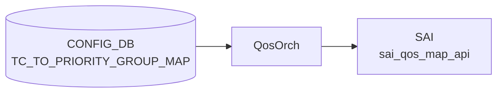

# TC_TO_PRIORITY_GROUP_MAP テーブル

## 概要

Traffic Class (TC) を ingress [Priority Group](../../reference/glossary.md#term-priority-group) (PG) へマップする[^1]。PG はバッファ admission control（`BUFFER_PG`）と [PFC](../../reference/glossary.md#term-pfc) の対象グループを決定し、lossless トラフィック (TC 3, 4) が正しい PG に割り当てられることで [PFC](../../reference/glossary.md#term-pfc) が動作する。`qosorch` が [SAI](../../reference/glossary.md#term-sai) map (`SAI_QOS_MAP_TYPE_TC_TO_PRIORITY_GROUP`) を生成し、`PORT_QOS_MAP.tc_to_pg_map` で各ポートに適用する。

<!-- cdb-mermaid -->
### データフロー (自動生成)



!!! note "凡例"
    CONFIG_DB から SAI までの典型経路を `docs/reference/config-db-orch-map.md` から機械生成したミニ図。詳細・例外は本ページ本文と対応表を参照。
<!-- /cdb-mermaid -->

## key 構造

```text
TC_TO_PRIORITY_GROUP_MAP|<name>|<tc>
```

`<name>` は 1..32 文字（`[a-zA-Z0-9]{1}([-a-zA-Z0-9_]{0,31})`）、`<tc>` は `tc_type` (uint8 0..15、実用範囲は 0..7)。

## フィールド一覧

| フィールド | 型 | 必須 | 説明 |
|-----------|----|------|------|
| `name` (key lv1) | string 1..32 | ✅ | マップ名（例: `AZURE`） |
| `tc` (key lv2) | `tc_type` (0..15) | ✅ | 入力 Traffic Class |
| `pg` (value) | string `[0-7]?` | ✅ | 出力 [Priority Group](../../reference/glossary.md#term-priority-group) (0-7) |

## 購読者

- `qosorch`: [SAI](../../reference/glossary.md#term-sai) [QoS](../../reference/glossary.md#term-qos) map 生成・管理
- `tunneldecaporch`: トンネル decap 時の TC→PG 再マッピング (`SAI_TUNNEL_ATTR_DECAP_QOS_TC_TO_PRIORITY_GROUP_MAP`)

## 関連 CONFIG_DB / YANG / CLI

- 関連 [CONFIG_DB](../../reference/glossary.md#term-config_db): `PORT_QOS_MAP`、`BUFFER_PG`、`PFC_PRIORITY_TO_PRIORITY_GROUP_MAP`
- 関連 CLI: なし（`config qos reload` で一括再生成）
- 関連 [YANG](../../reference/glossary.md#term-yang): `sonic-tc-priority-group-map`

<!-- ref-triangle:start -->

## 関連リファレンス

- [YANG](../../reference/glossary.md#term-yang): [`sonic-tc-priority-group-map`](../yang/sonic-tc-priority-group-map.md)

<!-- ref-triangle:end -->

## 引用元

[^1]: [YANG](../../reference/glossary.md#term-yang) 定義: `sonic-tc-priority-group-map.yang`. <https://github.com/sonic-net/sonic-buildimage/blob/master/src/sonic-yang-models/yang-models/sonic-tc-priority-group-map.yang>

<!-- topics-back-ref -->
## 関連 Topics

- [Topics: QoS / Buffer / PFC / Watermark](../../topics/08-qos-buffer/index.md)

<!-- /topics-back-ref -->

<!-- value-behavior -->
## 値依存挙動マトリクス

| フィールド | 値 | 挙動 |
|-----------|-----|-----|
| `tc` | `0`..`7` | 有効な Traffic Class。実用範囲 |
| `tc` | `8`..`15` | YANG 許容（uint8 0..15）だが [ASIC](../../reference/glossary.md#term-asic)/[SAI](../../reference/glossary.md#term-sai) が拒否する場合が多い（プラットフォーム依存） |
| `pg` | `"0"`..`"7"` | 対応する ingress [Priority Group](../../reference/glossary.md#term-priority-group) にマッピング |
| `pg` | 空文字列 | YANG pattern `[0-7]?` は許容するが `stoi()` 例外 → `task_invalid_entry` でエントリ破棄 |
| `pg` | 数字以外の文字列 | `stoi()` 例外 → `task_invalid_entry` でエントリ破棄 |
| マップ全体 | PORT_QOS_MAP / TUNNEL_DECAP_TABLE 参照中に DEL | DEL 保留 (`m_pendingRemove=true`)。参照解放まで待機 |
| マップ全体 | 参照なし + DEL | SAI `remove_qos_map()` を即時呼び出し |
| count=0 | サブキーなしで SET | SAI create_qos_map(count=0) が呼ばれる。[ASIC](../../reference/glossary.md#term-asic) が空マップを拒否するかは実装依存 |

<!-- /value-behavior -->

<!-- cdb-exceptions -->
## 例外条件・特殊挙動

<!-- evidence: sonic-swss/orchagent/qosorch.cpp L884-934 L124-201 -->
<!-- evidence: sonic-swss/orchagent/tunneldecaporch.cpp L230-243 -->

- **参照中のエントリは DEL 保留**: ポートまたはトンネルに割り当てられているマップを DEL しようとすると `"Can't remove object <name> due to being referenced"` を LOG_NOTICE して `m_pendingRemove = true` をセット、`task_need_retry` を返す。
- **pending remove 中の SET はリトライ**: DEL 保留中エントリへの SET は `task_need_retry` を返す。
- **SAI create/modify 失敗**: `sai_qos_map_api->create_qos_map()` 失敗時に `"Failed to create tc_to_pg map. status:%d"` を LOG_ERROR して `task_failed`。
- **存在しない object への DEL**: `"Object with name:<name> not found."` を LOG_ERROR して `task_invalid_entry`。
- **フィールド値の型変換失敗**: `pg` が空文字列または非数値の場合 `stoi()` が例外を投げ `task_invalid_entry`（silent drop）。
- **書込み順依存**: `TUNNEL_DECAP_TABLE` の `decap_tc_to_pg_map` フィールドより先に本マップが作成されている必要がある。マップ未作成の場合 `task_need_retry` を繰り返し、順序が解消されるまでトンネルエントリが pending になる。

<!-- /cdb-exceptions -->

<!-- ops-hint -->
## 運用ヒント

### 典型値（AZURE デフォルト）

```text
TC_TO_PRIORITY_GROUP_MAP|AZURE|0  →  0   (ベストエフォート)
TC_TO_PRIORITY_GROUP_MAP|AZURE|1  →  0
TC_TO_PRIORITY_GROUP_MAP|AZURE|2  →  0
TC_TO_PRIORITY_GROUP_MAP|AZURE|3  →  3   (lossless / PFC 対象)
TC_TO_PRIORITY_GROUP_MAP|AZURE|4  →  4   (lossless / PFC 対象)
TC_TO_PRIORITY_GROUP_MAP|AZURE|5  →  0
TC_TO_PRIORITY_GROUP_MAP|AZURE|6  →  0
TC_TO_PRIORITY_GROUP_MAP|AZURE|7  →  7   (high priority control)
```

`PORT_DPC` 有効環境では追加で `AZURE_DPC`（TC7→PG7、他は PG0）が生成される。

### よくある誤設定

- TC 8..15 の PG マッピングを書いても [ASIC](../../reference/glossary.md#term-asic) が TC 0..7 しかサポートしない場合、SAI が拒否し当該エントリが install されない。
- `pg` フィールドに空文字列を書くと YANG 検証を通過するが [orchagent](../../reference/glossary.md#term-orchagent) で silent drop される。
- lossless PG（3,4）を [BUFFER_PG](../../reference/glossary.md#term-buffer-pg) の `profile` で lossless 設定しないと [PFC](../../reference/glossary.md#term-pfc) が動作しない。

### 確認コマンド

```bash
sonic-db-cli CONFIG_DB hgetall 'TC_TO_PRIORITY_GROUP_MAP|AZURE'
show qos map tc-pg
```
<!-- /ops-hint -->

<!-- derivation -->
## 派生・条件付き登録 (Phase 6/7)

### Phase 6: 自動派生

`qosorch.cpp` の `addQosItem()` で SAI map type `SAI_QOS_MAP_TYPE_TC_TO_PRIORITY_GROUP` をコード内にハードコード。テーブル名 `TC_TO_PRIORITY_GROUP_MAP` と SAI type の対応はコード固定であり、[CONFIG_DB](../../reference/glossary.md#term-config_db) フィールドで変更不可。

### Phase 7: 条件付き登録

`QosOrch` は常時 `TC_TO_PRIORITY_GROUP_MAP` テーブルを購読する。マップ登録は無条件だが、ポートへの **適用** は `PORT_QOS_MAP.<ifname>.tc_to_pg_map` で参照されたときのみ発生する。トンネルへの適用は `TUNNEL_DECAP_TABLE.<name>.decap_tc_to_pg_map` 参照時。

<!-- /derivation -->

<!-- handler-branching -->
### Phase 8: Handler メソッド内分岐

| Handler | 分岐条件 | 効果 | evidence |
|---|---|---|---|
| `TcToPgHandler::convertFieldValuesToAttributes` | エントリ数 = kfvFieldsValues.size() | count 分の SAI map list を確保 | `qosorch.cpp` L888-900 |
| `TcToPgHandler::addQosItem` | SAI create 成功 | map OID を `m_qos_maps` に登録 | `qosorch.cpp` L904-928 |
| `TcToPgHandler::addQosItem` | SAI create 失敗 | `SAI_NULL_OBJECT_ID` 返却 → `task_failed` | `qosorch.cpp` L921-924 |
| `QosMapHandler::processWorkItem` | 参照中 + DEL | `m_pendingRemove=true` → `task_need_retry` | `qosorch.cpp` L181-186 |
| `TunnelDecapOrch` | decap_tc_to_pg_map OID 未解決 | `task_need_retry`（マップ作成待ち） | `tunneldecaporch.cpp` L230-237 |

> **スキャン証跡**: `TC_TO_PRIORITY_GROUP_MAP` は TC から ingress PG へのマッピングテーブル。`QosOrch` が SAI [QoS](../../reference/glossary.md#term-qos) map として管理し、`TunnelDecapOrch` が tunnel decap 経路でも参照する。

<!-- /handler-branching -->

<!-- runtime-trace -->
## CDB → 実コンテナ動作トレース

### 段階 1: Consumer 登録

- **[orchagent](../../reference/glossary.md#term-orchagent) / QosOrch**: `TC_TO_PRIORITY_GROUP_MAP` テーブルを `SubscriberStateTable` で購読。
- **[orchagent](../../reference/glossary.md#term-orchagent) / TunnelDecapOrch**: `APP_TUNNEL_DECAP_TABLE` 経由で `decap_tc_to_pg_map` フィールドを参照（間接）。

### 段階 2: CFG → APPL 翻訳

- QosOrch が TC→PG マッピングエントリを解析。APP_DB への書き込みなし。
- `tc` (field key) → `uint8_t`, `pg` (field value) → `uint8_t` にキャスト（`stoi()` 使用）。

### 段階 3: APPL → SAI

- QosOrch が `sai_qos_map_api->create_qos_map()` で `SAI_QOS_MAP_TYPE_TC_TO_PRIORITY_GROUP` マップを作成。
- PORT_QOS_MAP での参照でポートに `SAI_PORT_ATTR_QOS_TC_TO_PRIORITY_GROUP_MAP` として適用。
- TUNNEL_DECAP_TABLE 参照で `SAI_TUNNEL_ATTR_DECAP_QOS_TC_TO_PRIORITY_GROUP_MAP` として適用。

### 段階 4: タイミング + 副作用

- マップ作成後、PORT_QOS_MAP または TUNNEL_DECAP_TABLE が参照したときに即時適用。
- 副作用: TC→PG 変更で ingress バッファ割り当てが変わり、PFC の動作対象 PG が変化する。lossless 設定との整合が必要。

<!-- /runtime-trace -->

<!-- entry-points -->
## 書き込み入り口 (Direction A)

TC_TO_PRIORITY_GROUP_MAP テーブルへの書き込みが発生するコード経路を調査した結果。

### CLI

- `config qos reload` — [sonic-cfggen](../../reference/glossary.md#term-sonic-cfggen) が `files/build_templates/qos_config.j2` を展開し `TC_TO_PRIORITY_GROUP_MAP` エントリを生成。

### minigraph / sonic-cfggen

`qos_config.j2` テンプレート経由。minigraph.py に直接生成なし。

### REST / gNMI

REST/[gNMI](../../reference/glossary.md#term-gnmi) 書き込み経路なし。

### db_migrator

`db_migrator.py` での `TC_TO_PRIORITY_GROUP_MAP` マイグレーションなし。

### ビルド時デフォルト (build-time default)

`qos_config.j2` の `AZURE` マップ定義（TC 0,1,2,5,6→PG0 / TC3→PG3 / TC4→PG4 / TC7→PG7）がビルド時デフォルト。プラットフォームが `generate_tc_to_pg_map()` / `generate_tc_to_pg_map_per_sku()` を定義する場合はその値が優先（SKU 依存）。

### ハードコードデフォルト / ランタイム注入

なし（ランタイムに orchagent が自動生成するデフォルト値はない）。

### 死活・デッドコード

なし。`QosOrch` と `TunnelDecapOrch` どちらも実稼働 consumer。

<!-- /entry-points -->

<!-- ordering -->
## 書込み順依存 (Phase B)

`TC_TO_PRIORITY_GROUP_MAP` は `PORT_QOS_MAP` および `TUNNEL_DECAP_TABLE` の両方から参照される。`QosOrch` と `TunnelDecapOrch` はそれぞれ参照先マップの存在を確認してから SAI 適用を行い、未登録の場合は `task_need_retry` で自動待機する。

### 検出された順序依存

| # | 依存関係 | 方向 | 緩和策 |
|---|----------|------|--------|
| 1 | `TC_TO_PRIORITY_GROUP_MAP` SAI 登録 → `PORT_QOS_MAP.tc_to_pg_map` 適用 | **強制先行** | PORT_QOS_MAP は `task_need_retry` で自動待機、マップ登録後に自動解消 |
| 2 | `TC_TO_PRIORITY_GROUP_MAP` SAI 登録 → `TUNNEL_DECAP_TABLE.decap_tc_to_pg_map` 適用 | **強制先行** | TunnelDecapOrch は `task_need_retry` で自動待機 |
| 3 | PORT_QOS_MAP / TUNNEL_DECAP_TABLE 参照解除 → `TC_TO_PRIORITY_GROUP_MAP` DEL | **強制先行** | 参照中は `m_pendingRemove=true` で SAI remove をブロック |
| 4 | マップ DEL 完了 → 同名マップへの SET | 強制先行 | `m_pendingRemove` 中の SET は `task_need_retry` |

### 主要な制約詳細

**PORT_QOS_MAP との順序依存 (依存 #1)**: `handlePortQosMapTable` は `PORT_QOS_MAP|<port>.tc_to_pg_map` の値を `resolveFieldRefValue` で解決する際、`m_qos_maps[CFG_TC_TO_PRIORITY_GROUP_MAP_TABLE_NAME]` にマップが未登録なら `task_need_retry` を返す (qosorch.cpp:2124-2130)。[CONFIG_DB](../../reference/glossary.md#term-config_db) へ同時書き込みしても orchagent の処理順により `PORT_QOS_MAP` が先に処理された場合、自動的に retry が発生し `TC_TO_PRIORITY_GROUP_MAP` 登録後に解消される。

**TUNNEL_DECAP_TABLE との順序依存 (依存 #2)**: `TunnelDecapOrch::doTask` は `decap_tc_to_pg_map` フィールドを `gQosOrch->resolveTunnelQosMap()` で解決する。`SAI_NULL_OBJECT_ID` が返った場合 `"QoS map decap_tc_to_pg_map is not ready yet"` を LOG_NOTICE して `task_need_retry` を返す (tunneldecaporch.cpp:232-237)。マップが後から登録されると次のイテレーションで自動的にトンネルエントリが処理される。

**参照中の DEL はブロック (依存 #3)**: `processWorkItem` の DEL ハンドラは `isObjectBeingReferenced()` で PORT_QOS_MAP または TUNNEL_DECAP_TABLE からの参照を確認し、参照が残る場合は `m_pendingRemove = true` をセットして `task_need_retry` を返す。SAI `remove_qos_map()` は参照が解放されるまで呼ばれない。参照解放後も orchagent の次回イテレーションまで DEL は pending のままとなる。

> **Evidence**: `sonic-swss` `orchagent/qosorch.cpp:124-201` (processWorkItem DEL ブロック); `qosorch.cpp:2118-2134` (PORT_QOS_MAP resolveFieldRefValue); `orchagent/tunneldecaporch.cpp:230-243` (decap_tc_to_pg_map 未解決時の retry)

<!-- /ordering -->

<!-- cross-refs -->
## 暗黙参照テーブル (Phase C)

`TC_TO_PRIORITY_GROUP_MAP` は**被参照側**テーブルであり、本テーブル自身が他テーブルへ leafref を持つ構造ではない。`PORT_QOS_MAP` および `TUNNEL_DECAP_TABLE` が本テーブルのマップ名を参照し、`QosOrch` の参照カウント機構（`object_reference_map`）で追跡される。

| 依存方向 | 参照元フィールド | 参照先テーブル | 参照先キー形式 | 依存内容 | 証跡 |
|---------|----------------|--------------|--------------|---------|------|
| 逆参照（被参照） | `PORT_QOS_MAP\|<port>.tc_to_pg_map` | `TC_TO_PRIORITY_GROUP_MAP`（本テーブル） | `TC_TO_PRIORITY_GROUP_MAP\|<name>` | `handlePortQosMapTable` が `resolveFieldRefValue` でマップ OID を解決。未登録なら `task_need_retry`。参照中は本テーブルの DEL が `m_pendingRemove=true` でブロックされる | `qosorch.cpp:2118-2134`, `qosorch.cpp:181-186` |
| 逆参照（被参照） | `TUNNEL_DECAP_TABLE\|<name>.decap_tc_to_pg_map` ([APPL_DB](../../reference/glossary.md#term-appl_db)) | `TC_TO_PRIORITY_GROUP_MAP`（本テーブル） | `TC_TO_PRIORITY_GROUP_MAP\|<name>` | `TunnelDecapOrch::doTask` が `gQosOrch->resolveTunnelQosMap()` で OID を解決。`SAI_NULL_OBJECT_ID` 返却時は `"QoS map decap_tc_to_pg_map is not ready yet"` を LOG_NOTICE して `task_need_retry` | `tunneldecaporch.cpp:230-237` |

### 参照カウント機構

`QosOrch::m_qos_maps` の `object_reference_map` は参照元テーブル・キー・フィールド名をキーとして参照カウントを保持する。`setObjectReference()` で参照を記録し、`removeMeFromObjsReferencedByMe()` で解放。`isObjectBeingReferenced()` が DEL 時の参照有無を判定する (qosorch.cpp:181)。

PORT_QOS_MAP と TUNNEL_DECAP_TABLE のいずれか一方でも参照が残る限り、本テーブルのマップは SAI から削除されない（`m_pendingRemove = true` で保留）。両参照が解放された後の次回 orchagent イテレーションで `remove_qos_map()` が呼ばれる。

> **詳細証跡**: `meta/_intermediate/cdb-flow/tc-to-priority-group-map-cross-refs.md`

<!-- /cross-refs -->

<!-- failure -->
## 失敗挙動 (Phase D)

> 調査証跡: `meta/_intermediate/cdb-flow/tc-to-priority-group-map-failure.md`

対象テーブル: `TC_TO_PRIORITY_GROUP_MAP`。Consumer: `QosOrch::handleTcToPgTable()` / `QosOrch::doTask()` (`orchagent/qosorch.cpp`)。

### 起動ガード

`QosOrch::doTask()` 冒頭で `gPortsOrch->allPortsReady()` を確認する (`qosorch.cpp:2253-2258`)。ポート構成完了前は即時 `return` し `Consumer::m_toSync` のエントリが滞留したまま暗黙 retry される（ログなし・CONFIG_DB 変更なし）。

### SET 時の失敗パターン

| 失敗ケース | 発生箇所 | 挙動 | retry |
|---|---|---|---|
| `allPortsReady() == false` | `doTask()` L2258-2261 | 早期 return、`m_toSync` 滞留 | ポート準備完了まで暗黙 retry |
| SAI `create_qos_map` 失敗（新規） | `addQosItem()` L921-924 | `SWSS_LOG_ERROR("Failed to create tc_to_pg map")` → `task_failed` → erase + `return` | なし（後続エントリもブロック） |
| SAI `set_qos_map_attribute` 失敗（既存上書き） | `modifyQosItem()` L207-210 | `SWSS_LOG_ERROR("Failed to modify map")` → `task_failed` → erase + `return` | なし |
| `m_pendingRemove == true`（DEL pending 中に SET） | `processWorkItem()` L136-140 | `SWSS_LOG_NOTICE` → `task_need_retry` → `it++` | PORT_QOS_MAP / TUNNEL 参照解除後に自動解消 |

> **実装ノート**: `TcToPgHandler::convertFieldValuesToAttributes()` は `stoi()` を try/catch なしで呼ぶ（`qosorch.cpp:894-895`）。`ExpToFcMapHandler` が try/catch で `task_invalid_entry` を返すのとは対照的。YANG バリデーションで `tc_type` (uint8 0..15) と `[0-7]?` パターンが強制されるため、正規 API 経由では非数値は到達しない。直接 `sonic-db-cli` 等で非数値を書いた場合は例外が try/catch 外を伝播する可能性がある。

### DEL 時の失敗パターン

| 失敗ケース | 発生箇所 | 挙動 | retry |
|---|---|---|---|
| エントリ未登録（SAI oid なし） | `processWorkItem()` L177-181 | `SWSS_LOG_ERROR("Object with name:%s not found")` → `task_invalid_entry` → erase | なし |
| PORT_QOS_MAP または TUNNEL_DECAP_TABLE から参照中 | `isObjectBeingReferenced()` L182-187 | `m_pendingRemove=true` + `task_need_retry` → `it++` | 両参照解除まで無制限 retry |
| SAI `remove_qos_map` 失敗 | `removeQosItem()` L218-222 | `SWSS_LOG_ERROR("Failed to remove map")` → `task_failed` → erase + `return` | なし |

### `task_failed` 時の特殊挙動

`doTask()` は `task_failed` で該当エントリを erase した後 `return` するため、同一 Consumer キュー内の後続エントリも当該イテレーションでは未処理となる（`qosorch.cpp:2284-2288`）。次の orchagent イベントループで再試行される。

### エラー通知先

- `SWSS_LOG_ERROR` / `SWSS_LOG_NOTICE` → syslog のみ
- `ERROR_TABLE` への書き込みなし
- [STATE_DB](../../reference/glossary.md#term-state_db) への反映なし（`TC_TO_PRIORITY_GROUP_MAP` は [STATE_DB](../../reference/glossary.md#term-state_db) を持たない）
- CONFIG_DB のエントリは失敗後も残存（`task_invalid_entry` の erase はメモリ上の `m_toSync` のみ）

> **Evidence**: `qosorch.cpp:2253-2300` (`QosOrch::doTask(Consumer&)`); `qosorch.cpp:124-201` (`QosMapHandler::processWorkItem()`); `qosorch.cpp:884-934` (`TcToPgHandler::convertFieldValuesToAttributes()`, `addQosItem()`); `tunneldecaporch.cpp:230-243`

<!-- /failure -->

<!-- constants -->
## ハードコード定数 (Phase E)

<!-- evidence: meta/_intermediate/cdb-flow/tc-to-priority-group-map-constants.md -->

`TC_TO_PRIORITY_GROUP_MAP` の処理でコード内に固定された定数の一覧。

### フィールド名文字列定数 (`qosorch.h`)

| 定数名 | 値 | 用途 | 行 |
|---|---|---|---|
| `tc_to_pg_map_field_name` | `"tc_to_pg_map"` | `PORT_QOS_MAP` での参照フィールド名 | `qosorch.h:18` |
| `decap_tc_to_pg_field_name` | `"decap_tc_to_pg_map"` | `TUNNEL_DECAP_TABLE` での参照フィールド名 | `qosorch.h:35` |

### SAI 属性 ID 定数

| 定数名 | 用途 | ソース |
|---|---|---|
| `SAI_QOS_MAP_TYPE_TC_TO_PRIORITY_GROUP` | map 作成時の type 指定（`SAI_QOS_MAP_ATTR_TYPE`） | `qosorch.cpp:912-913` |
| `SAI_QOS_MAP_ATTR_MAP_TO_VALUE_LIST` | TC→PG エントリリストの属性 ID | `qosorch.cpp:897`, `qosorch.cpp:915` |
| `SAI_PORT_ATTR_QOS_TC_TO_PRIORITY_GROUP_MAP` | ポートへのマップ適用属性 ID（`PORT_QOS_MAP` 経由） | `qosorch.cpp:67` |

### `tc` / `pg` の型キャスト定数

`convertFieldValuesToAttributes` (qosorch.cpp:894-895) は `stoi()` の返り値を `(uint8_t)` へ明示キャストする。値の範囲検査はコード上存在しない。

| フィールド | 宣言型 | 実効制約 |
|---|---|---|
| `tc` (key の第2トークン) | `uint8_t` | YANG: `uint8 0..15`（`tc_type`）。実用 0..7 |
| `pg` (value) | `uint8_t` | YANG: pattern `[0-7]?`。`stoi()` 後 `uint8_t` キャスト |

### ビルド時デフォルト値 (`qos_config.j2`)

`config qos reload` が展開する `AZURE` マップのデフォルト TC→PG 対応:

| TC | PG | 備考 |
|---|---|---|
| 0, 1, 2, 5, 6 | 0 | Best-effort |
| 3 | 3 | Lossless（PFC 対象） |
| 4 | 4 | Lossless（PFC 対象） |
| 7 | 7 | High-priority control |

`PORT_DPC` 有効環境では追加マップ `"AZURE_DPC"` も生成される（TC7→PG7、他は PG0）。これらのマップ名・値はコード外の Jinja2 テンプレートで決定されるため、プラットフォームが `generate_tc_to_pg_map_per_sku()` を定義する場合は SKU 固有値が優先される。

<!-- /constants -->

<!-- side-effects -->
## 副作用・波及効果 (Phase F)

> 調査証跡: `meta/_intermediate/cdb-flow/tc-to-priority-group-map-side.md`

`TC_TO_PRIORITY_GROUP_MAP` の SET/DEL が引き起こす ASIC・他テーブルへの波及効果。

### ASIC 側の副作用

| # | 副作用 | トリガー | evidence |
|---|--------|---------|---------|
| 1 | ASIC に SAI [QoS](../../reference/glossary.md#term-qos) map オブジェクト生成（`SAI_QOS_MAP_TYPE_TC_TO_PRIORITY_GROUP`） | SET（新規） | `qosorch.cpp:904-928` |
| 2 | ポートの ingress TC→PG マッピング変更（`SAI_PORT_ATTR_QOS_TC_TO_PRIORITY_GROUP_MAP`） | `PORT_QOS_MAP|<port>.tc_to_pg_map` 参照時に適用 | `qosorch.cpp:2060-2175` |
| 3 | トンネル decap の TC→PG マッピング変更（`SAI_TUNNEL_ATTR_DECAP_QOS_TC_TO_PRIORITY_GROUP_MAP`） | `TUNNEL_DECAP_TABLE|<name>.decap_tc_to_pg_map` 参照時に適用 | `tunneldecaporch.cpp:230-243` |
| 4 | 参照中ポート・トンネルへの即時反映（`set_qos_map_attribute()`） | SET（既存マップ上書き） | `qosorch.cpp:204-213` |
| 5 | SAI QoS map オブジェクト削除（`remove_qos_map()`） | DEL（参照解放後） | `qosorch.cpp:188-195` |

### PFC・lossless バッファへの波及

TC→PG マッピングは PFC の動作に直結する。`BUFFER_PG|<port>|<pg>` で lossless プロファイルが割り当てられた PG（通常 PG3, PG4）に対し、TC→PG マッピングが一致しなくなると **lossless パスが無効化**される。

- lossless PG（3, 4）に割り当てる TC を変更する場合、`BUFFER_PG` の lossless profile 設定との整合を確認すること。
- 上書き（modify）は参照中のポート・トンネルに**即時反映**されるため、稼働中トラフィックの ingress バッファ割り当てが変化する。

### STATE_DB / 通知チャネルへの副作用

| 副作用先 | 内容 |
|---------|------|
| [STATE_DB](../../reference/glossary.md#term-state_db) | **書き込みなし**。`TC_TO_PRIORITY_GROUP_MAP` は STATE_DB テーブルを持たない |
| [APPL_DB](../../reference/glossary.md#term-appl_db) | **書き込みなし**。CONFIG_DB → SAI ダイレクトルートであり [APPL_DB](../../reference/glossary.md#term-appl_db) は経由しない |
| ERROR_TABLE | なし |
| 通知チャネル | なし（syslog のみ） |

<!-- /side-effects -->

<!-- pubsub -->
## 通信メカニズム (Phase G)

<!-- evidence: sonic-swss/orchagent/qosorch.cpp L1342 -->
<!-- evidence: sonic-swss/orchagent/qosorch.cpp L2231-2252 -->
<!-- evidence: sonic-swss/orchagent/qosorch.cpp L2254-2261 -->

### Producer/Consumer ペア

TC_TO_PRIORITY_GROUP_MAP テーブルは CONFIG_DB → SAI の **直接経路**をとる。APPL_DB への中継は行わない。

| 区間 | 方式 | チャンネル/パターン |
|------|------|--------------------|
| CONFIG_DB → QosOrch | `SubscriberStateTable` | `__keyspace@{config_db_id}__:TC_TO_PRIORITY_GROUP_MAP\|*` |
| QosOrch → SAI | SAI API 直接呼び出し | `sai_qos_map_api` (`SAI_QOS_MAP_TYPE_TC_TO_PRIORITY_GROUP`) |

### SubscriberStateTable の動作

`QosOrch` は `Orch(db, tableNames)` 基底クラスの `addConsumer()` を通じて `CFG_TC_TO_PRIORITY_GROUP_MAP_TABLE_NAME` に対する `SubscriberStateTable` を生成する（`qosorch.cpp:1342`）。CONFIG_DB の keyspace notification でエントリ変化を検出し `pops()` で現在値を読み出す。初回起動時は既存エントリを先読みして起動前設定を取りこぼさない。

### select() ループと doTask 実行順序

orchdaemon は `Select::select()` を 1000 ms タイムアウトで実行する。イベント受信時は `Consumer::drain()` → `QosOrch::doTask()` が呼ばれる。

`QosOrch::doTask()` （`qosorch.cpp:2231`）はカスタム実行順序を実装する:

1. `PORT_QOS_MAP` / `QUEUE` **以外**の全テーブル（TC_TO_PRIORITY_GROUP_MAP を含む）を先に drain
2. `PORT_QOS_MAP` を drain（マップ登録済みを前提にポート適用）
3. 最後に `QUEUE` を drain

TC_TO_PRIORITY_GROUP_MAP は **step 1** で処理されるため、同一イベントループ内で本テーブルが登録された後、直ちに PORT_QOS_MAP / QUEUE の処理が続く。`task_need_retry` を最小化する設計。

`doTask(Consumer&)` 冒頭では `gPortsOrch->allPortsReady()` チェックがあり、全ポート初期化完了まで処理を保留する（`qosorch.cpp:2258`）。

### retry メカニズム

`PORT_QOS_MAP.tc_to_pg_map` や `TUNNEL_DECAP_TABLE.decap_tc_to_pg_map` から本テーブルへの参照が未解決の場合は `task_need_retry` が返り、エントリは `m_toSync` に残留する。本テーブルの登録イベントが来ると doTask の実行順序制御により直ちに参照側の再試行が実行される。

### データフロー図

```
CONFIG_DB[TC_TO_PRIORITY_GROUP_MAP|<name>|<tc>]
  ↓ SubscriberStateTable (keyspace notification)
  ↓ PSUBSCRIBE __keyspace@config_db_id__:TC_TO_PRIORITY_GROUP_MAP|*
orchdaemon select() loop (SELECT_TIMEOUT=1000ms)
  ↓ Consumer::drain() → QosOrch::doTask()
  ↓   [allPortsReady() チェック]
  ↓   [実行順序: TC_TO_PRIORITY_GROUP_MAP → PORT_QOS_MAP → QUEUE]
  ↓ handleTcToPgTable() → TcToPgHandler::processWorkItem()
    ↓ addQosItem() / modifyQosItem() / removeQosItem()
    ↓   → sai_qos_map_api
    ↓     SAI_QOS_MAP_TYPE_TC_TO_PRIORITY_GROUP
ASIC (sairedis → ASIC_DB 経由)

APPL_DB 書き込み: なし
STATE_DB 書き込み: なし
NotificationConsumer: なし
```

<!-- /pubsub -->

<!-- platform -->
## プラットフォーム差異 (Phase H)

<!-- evidence: meta/_intermediate/cdb-flow/tc-to-priority-group-map-platform.md -->
<!-- source: sonic-buildimage/files/build_templates/qos_config.j2 ref:master -->
<!-- source: sonic-swss/orchagent/qosorch.cpp ref:master -->

`TC_TO_PRIORITY_GROUP_MAP` の **orchagent 側処理**（`QosOrch`）はプラットフォーム非依存だが、**マップの内容（Config 生成）**はプラットフォーム・SKU・デプロイ構成によって異なる。

### A. qos_config.j2 — マップ生成の優先順位

`qos_config.j2:170-179` に 4 段の条件分岐がある:

```jinja2

    {{- generate_tc_to_pg_map() }}          {# トンネル QoS 対応プラットフォーム #}

    {{- generate_tc_to_pg_map() }}          {# Azure ComputeAI バックエンド #}

    {{- generate_tc_to_pg_map_per_sku() }}  {# SKU 固有マクロ #}

    "TC_TO_PRIORITY_GROUP_MAP": { "AZURE": {...} }  {# 標準デフォルト #}

```

| 条件 | 適用対象 | 生成マップ |
|------|---------|-----------|
| `generate_tc_to_pg_map` + `tunnel_qos_remap_enable=true` | VxLAN decap TC→PG 再マッピング対応プラットフォーム (Broadcom 等) | SKU 定義関数が生成 |
| `generate_tc_to_pg_map` + `backend_device_types` + `ComputeAI` | Azure AI ラック向け BackEndToRRouter / BackEndLeafRouter | SKU 定義関数が生成 |
| `generate_tc_to_pg_map_per_sku` | 一部 Mellanox / Broadcom SKU | SKU ごとに異なる TC→PG 対応表 |
| その他（デフォルト） | 一般コミュニティ [SONiC](../../reference/glossary.md#term-sonic) | `AZURE`（TC3→PG3, TC4→PG4, 他→PG0） |

### B. SmartSwitch / DPU — AZURE_DPC マップ

`PORT_DPC`（[DPU](../../reference/glossary.md#term-dpu) 接続ポート）が存在する環境では `AZURE_DPC` マップが追加生成される (`qos_config.j2:182-193`):

```json
"AZURE_DPC": {
    "0": "0", "1": "0", "2": "0", "3": "0",
    "4": "0", "5": "0", "6": "0", "7": "7"
}
```

全 TC を PG0（ベストエフォート）に割り当て、TC7 のみ PG7 に割り当てる。PFC は TC7/PG7 のみ対象となる。[DPU](../../reference/glossary.md#term-dpu) 接続ポートは `PORT_QOS_MAP.tc_to_pg_map = "AZURE_DPC"` で参照される (`qos_config.j2:476`)。

### C. トンネル QoS 再マッピング対応プラットフォーム

`DEVICE_METADATA.tunnel_qos_remap_enable = "true"` が設定されたプラットフォームでは `TUNNEL_DECAP_TABLE.decap_tc_to_pg_map` フィールドが有効になる。`TunnelDecapOrch` が `TC_TO_PRIORITY_GROUP_MAP` の SKU 固有マップを `SAI_TUNNEL_ATTR_DECAP_QOS_TC_TO_PRIORITY_GROUP_MAP` に適用し、トンネル decap 後のパケットに別の TC→PG マッピングを施す。一般プラットフォーム（`tunnel_qos_remap_enable=false`）では `decap_tc_to_pg_map` フィールド自体が使用されない。

### D. ASIC の TC 範囲制限

YANG の `tc_type` は `uint8 0..15` を許容するが、実用上 TC 8..15 をサポートする ASIC は少ない。`sai_qos_map_api->create_qos_map()` は TC 8..15 を含むマップでプラットフォーム依存の挙動を示す:

| プラットフォーム | TC 8..15 の扱い |
|-----------------|----------------|
| Broadcom 等物理 ASIC | SAI が TC 0..7 のみ有効化し TC 8..15 エントリを無視するか、マップ全体を拒否する（SAI 実装依存） |
| VS (仮想スイッチ) | `create_qos_map()` は成功するが ASIC 反映なし |

### プラットフォーム差異サマリ

| 観点 | 標準プラットフォーム | SKU 固有 (`per_sku` マクロあり) | [SmartSwitch](../../reference/glossary.md#term-smartswitch) [DPU](../../reference/glossary.md#term-dpu) ポート | トンネル QoS 対応 |
|------|------------------|--------------------------------|----------------------|------------------|
| 生成マップ名 | `AZURE` | SKU 依存 | `AZURE` + `AZURE_DPC` | SKU 依存 |
| TC3/TC4 の PG | PG3 / PG4（lossless） | プラットフォーム依存 | PG0（lossy） | プラットフォーム依存 |
| `decap_tc_to_pg_map` | 不使用 | 不使用 | 不使用 | 使用（SAI tunnel 属性） |
| TC 8..15 サポート | ASIC 依存（多くは拒否） | ASIC 依存 | ASIC 依存 | ASIC 依存 |

<!-- /platform -->

<!-- defaults -->
## コード由来の暗黙デフォルト (Phase A)

<!-- evidence: sonic-swss/orchagent/qosorch.cpp L884-934 -->
<!-- evidence: sonic-swss/orchagent/qosorch.h L18,35 -->
<!-- evidence: sonic-buildimage/files/build_templates/qos_config.j2 L181-204 -->
<!-- evidence: sonic-buildimage/src/sonic-yang-models/yang-models/sonic-tc-priority-group-map.yang L56-69 -->

### 暗黙デフォルト一覧

| フィールド | YANG default | コード由来デフォルト | 種別 | 備考 |
|-----------|-------------|---------------------|------|------|
| `tc` | なし | なし | — | key フィールド、省略不可 |
| `pg` | なし | なし | — | 値フィールド、省略不可。空文字 → `stoi()` silent drop |
| SAI map type | N/A | `SAI_QOS_MAP_TYPE_TC_TO_PRIORITY_GROUP` | ハードコード | `qosorch.cpp` `addQosItem()` で固定 |
| `AZURE` マップ内容 | なし | TC0,1,2,5,6→PG0 / TC3→PG3 / TC4→PG4 / TC7→PG7 | ビルド時デフォルト | `qos_config.j2` で生成 |

### YANG-実装 discrepancy

| 項目 | YANG 定義 | 実装挙動 | 影響 |
|------|----------|---------|------|
| `tc` 範囲 | `uint8 0..15`（tc_type） | 実用は 0..7。8..15 は SAI/ASIC がプラットフォーム依存で拒否 | TC 8..15 を書いても install されない可能性 |
| `pg` 空文字 | pattern `[0-7]?` → 空文字を構文上許容 | `stoi()` 例外 → silent drop（`task_invalid_entry`） | YANG 検証通過後に orchagent でエントリ破棄 |

### 書込み順依存

`TUNNEL_DECAP_TABLE.decap_tc_to_pg_map` は本テーブルへの参照を持つ。本テーブルのマップが未作成の状態でトンネルエントリが先に来ると `task_need_retry` が繰り返され、マップ作成後に自動解消される。CONFIG_DB を一括 reload する場合は通常問題ないが、動的に tunnel を追加する場合は本マップを先に作成すること。

### プラットフォーム依存

プラットフォームベンダーが `generate_tc_to_pg_map_per_sku()` Jinja2 マクロを定義している場合、SKU 固有の TC→PG マッピングが `AZURE` マップに代わって（または追加で）生成される。実際のデフォルト値はプラットフォームによって異なる。

<!-- /defaults -->

<!-- glossary-links-injected: tc-to-priority-group-map -->

<!-- glossary-links-injected: f9445b5b4106 -->
