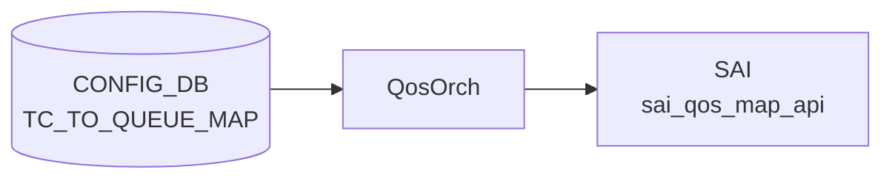

# TC_TO_QUEUE_MAP テーブル

## 概要

Traffic Class (TC) を egress queue インデックスへマップする[^1]。`DSCP_TO_TC_MAP` で TC 化された値が、このマップで物理キューに振り分けられる。`qosorch` が [SAI](../../reference/glossary.md#term-sai) map (`SAI_QOS_MAP_TYPE_TC_TO_QUEUE`) を生成し、`PORT_QOS_MAP.tc_to_queue_map` で各ポートに適用する。

<!-- cdb-mermaid -->
### データフロー (自動生成)



!!! note "凡例"
    CONFIG_DB から SAI までの典型経路を `docs/reference/config-db-orch-map.md` から機械生成したミニ図。詳細・例外は本ページ本文と対応表を参照。
<!-- /cdb-mermaid -->

## key 構造

```
TC_TO_QUEUE_MAP|<name>|<tc>
```

`<name>` は 1..32 文字、`<tc>` は `tc_type` (0..7)。

## フィールド一覧

| フィールド | 型 | 必須 | 説明 |
|-----------|----|------|------|
| `name` (key) | string (1..32) | ✅ | マップ名 |
| `tc` (key) | `tc_type` (0..7) | ✅ | TC |
| `qindex` | string (0..9) | - | egress queue index |

## 購読者

- `qosorch`: [SAI](../../reference/glossary.md#term-sai) [QoS](../../reference/glossary.md#term-qos) map 生成

## 関連 CONFIG_DB / YANG / CLI

- 関連 [CONFIG_DB](../../reference/glossary.md#term-config_db): `PORT_QOS_MAP`、`QUEUE`、`DSCP_TO_TC_MAP`
- 関連 CLI: なし
- 関連 [YANG](../../reference/glossary.md#term-yang): `sonic-tc-queue-map`

<!-- ref-triangle:start -->

## 関連リファレンス

- [YANG](../../reference/glossary.md#term-yang): [`sonic-tc-queue-map`](../yang/sonic-tc-queue-map.md)

<!-- ref-triangle:end -->

## 引用元

[^1]: [YANG](../../reference/glossary.md#term-yang) 定義: `sonic-tc-queue-map.yang`. <https://github.com/sonic-net/sonic-buildimage/blob/9ea932ec2e18f35e58268ec2e4456b1d4afd65cd/src/sonic-yang-models/yang-models/sonic-tc-queue-map.yang>

<!-- topics-back-ref -->
## 関連 Topics

- [Topics: QoS / Buffer / PFC / Watermark](../../topics/08-qos-buffer/index.md)

<!-- /topics-back-ref -->

<!-- ops-hint -->
## 運用ヒント

### 典型値

- key 形式: `TC_TO_QUEUE_MAP|<name>` (例 `AZURE`)。
- 値: `0:0`, `1:1`, `3:3`, `4:4` 等。

### よくある誤設定

- TC→queue を 0..7 範囲外に書くと [SAI](../../reference/glossary.md#term-sai) が拒否し、マップ全体が install されない。

### 確認コマンド

```bash
sonic-db-cli CONFIG_DB hgetall 'TC_TO_QUEUE_MAP|AZURE'
show qos map tc-queue
```
<!-- /ops-hint -->

<!-- glossary-links-injected: 16a5b728a75a -->
