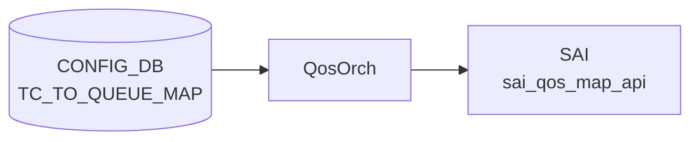

# TC_TO_QUEUE_MAP テーブル

## 概要

Traffic Class (TC) を egress queue インデックスへマップする[^1]。`DSCP_TO_TC_MAP` で TC 化された値が、このマップで物理キューに振り分けられる。`qosorch` が [SAI](../../reference/glossary.md#term-sai) map (`SAI_QOS_MAP_TYPE_TC_TO_QUEUE`) を生成し、`PORT_QOS_MAP.tc_to_queue_map` で各ポートに適用する。

<!-- cdb-mermaid -->
### データフロー (自動生成)



!!! note "凡例"
    CONFIG_DB から SAI までの典型経路を `docs/reference/config-db-orch-map.md` から機械生成したミニ図。詳細・例外は本ページ本文と対応表を参照。
<!-- /cdb-mermaid -->

## key 構造

```text
TC_TO_QUEUE_MAP|<name>|<tc>
```

`<name>` は 1..32 文字、`<tc>` は `tc_type` (0..7)。

## フィールド一覧

| フィールド | 型 | 必須 | 説明 |
|-----------|----|------|------|
| `name` (key) | string (1..32) | ✅ | マップ名 |
| `tc` (key) | `tc_type` (0..7) | ✅ | TC |
| `qindex` | string (0..9) | - | egress queue index |

## 購読者

- `qosorch`: [SAI](../../reference/glossary.md#term-sai) [QoS](../../reference/glossary.md#term-qos) map 生成

## 関連 CONFIG_DB / YANG / CLI

- 関連 [CONFIG_DB](../../reference/glossary.md#term-config_db): `PORT_QOS_MAP`、`QUEUE`、`DSCP_TO_TC_MAP`
- 関連 CLI: なし
- 関連 [YANG](../../reference/glossary.md#term-yang): `sonic-tc-queue-map`

<!-- ref-triangle:start -->

## 関連リファレンス

- [YANG](../../reference/glossary.md#term-yang): [`sonic-tc-queue-map`](../yang/sonic-tc-queue-map.md)

<!-- ref-triangle:end -->

## 引用元

[^1]: [YANG](../../reference/glossary.md#term-yang) 定義: `sonic-tc-queue-map.yang`. <https://github.com/sonic-net/sonic-buildimage/blob/9ea932ec2e18f35e58268ec2e4456b1d4afd65cd/src/sonic-yang-models/yang-models/sonic-tc-queue-map.yang>

<!-- topics-back-ref -->
## 関連 Topics

- [Topics: QoS / Buffer / PFC / Watermark](../../topics/08-qos-buffer/index.md)

<!-- /topics-back-ref -->

<!-- value-behavior -->
## 値依存挙動マトリクス

`tc` / `qindex` は enum 型ではなく数値 / 文字列型。

| フィールド | 値 | 挙動 |
|-----------|-----|-----|
| `tc` | `0`..`7` | 有効な Traffic Class インデックス |
| `qindex` | `"0"`..`"9"` | 対応する egress queue インデックスにマッピング |
| `qindex` | 空文字列 / 数字以外 | `stoi()` 例外 → `task_invalid_entry`（エントリ破棄） |
| マップ全体 | PORT_QOS_MAP から参照中に DEL | DEL 保留 (`m_pendingRemove=true`)。参照解放まで待機 |
| マップ全体 | PORT_QOS_MAP 参照なし + DEL | SAI `remove_qos_map()` を即時呼び出し |

<!-- /value-behavior -->

<!-- cdb-exceptions -->
## 例外条件・特殊挙動

<!-- evidence: sonic-swss/orchagent/qosorch.cpp@4305596156d70e9797e8a881b3d19b46de0bce0d L124-201 L449-479 -->

- **参照中のエントリは DEL 保留**: ポートに割り当てられているマップを DEL しようとすると `"Can't remove object <name> due to being referenced"` を LOG_NOTICE して `m_pendingRemove = true` をセット、`task_need_retry` を返す。参照が外れるまで削除は保留される。
- **pending remove 中の SET はリトライ**: DEL 保留中のエントリへの SET は `task_need_retry` を返し、参照解放後に再処理される。
- **SAI create/modify 失敗**: `sai_qos_map_api->create_qos_map()` 失敗時に `"Failed to create tc_to_queue map. status:%d"` を LOG_ERROR して `task_failed` を返す。既存マップの変更失敗時も `"Failed to set [TC_TO_QUEUE_MAP:<name>]"` を LOG_ERROR して `task_failed` を返す。
- **存在しない object への DEL**: SAI オブジェクトが未作成のエントリを DEL しようとすると `"Object with name:<name> not found."` を LOG_ERROR して `task_invalid_entry` を返す（エントリはキューから除去される）。
- **フィールド値の型変換失敗**: TC 値または queue_index が整数として解釈できない場合、`stoi()` が例外を投げ `task_invalid_entry` を返す。

<!-- /cdb-exceptions -->

<!-- ops-hint -->
## 運用ヒント

### 典型値

- key 形式: `TC_TO_QUEUE_MAP|<name>` (例 `AZURE`)。
- 値: `0:0`, `1:1`, `3:3`, `4:4` 等。

### よくある誤設定

- TC→queue を 0..7 範囲外に書くと [SAI](../../reference/glossary.md#term-sai) が拒否し、マップ全体が install されない。

### 確認コマンド

```bash
sonic-db-cli CONFIG_DB hgetall 'TC_TO_QUEUE_MAP|AZURE'
show qos map tc-queue
```
<!-- /ops-hint -->


<!-- runtime-trace -->
## CDB → 実コンテナ動作トレース

### 段階 1: Consumer 登録

- **orchagent / QosOrch**: `TC_TO_QUEUE_MAP` テーブルを `SubscriberStateTable` で購読。

### 段階 2: CFG → APPL 翻訳

- QosOrch が TC→Queue マッピングエントリを解析。APP_DB への書き込みなし。

### 段階 3: APPL → SAI

- QosOrch が `sai_qos_map_api->create_qos_map()` で `SAI_QOS_MAP_TYPE_TC_TO_QUEUE` マップを作成。
- PORT_QOS_MAP での参照でポートに適用。

### 段階 4: タイミング + 副作用

- マップ作成後、PORT_QOS_MAP が参照したときに即時ポートに適用。
- 副作用: TC→Queue マッピング変更でトラフィックの queue 割り当てが変わり QoS 特性が変化。

<!-- /runtime-trace -->

<!-- glossary-links-injected: 16a5b728a75a -->
