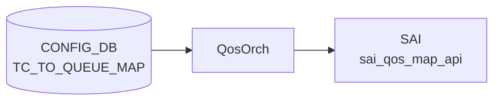

# TC_TO_QUEUE_MAP テーブル

## 概要

Traffic Class (TC) を egress queue インデックスへマップする[^1]。`DSCP_TO_TC_MAP` で TC 化された値が、このマップで物理キューに振り分けられる。`qosorch` が [SAI](../../reference/glossary.md#term-sai) map (`SAI_QOS_MAP_TYPE_TC_TO_QUEUE`) を生成し、`PORT_QOS_MAP.tc_to_queue_map` で各ポートに適用する。

<!-- cdb-mermaid -->
### データフロー (自動生成)



!!! note "凡例"
    CONFIG_DB から SAI までの典型経路を `docs/reference/config-db-orch-map.md` から機械生成したミニ図。詳細・例外は本ページ本文と対応表を参照。
<!-- /cdb-mermaid -->

## key 構造

```text
TC_TO_QUEUE_MAP|<name>|<tc>
```

`<name>` は 1..32 文字、`<tc>` は `tc_type` (0..7)。

## フィールド一覧

| フィールド | 型 | 必須 | 説明 |
|-----------|----|------|------|
| `name` (key) | string (1..32) | ✅ | マップ名 |
| `tc` (key) | `tc_type` (0..7) | ✅ | TC |
| `qindex` | string (0..9) | - | egress queue index |

## 購読者

- `qosorch`: [SAI](../../reference/glossary.md#term-sai) [QoS](../../reference/glossary.md#term-qos) map 生成

## 関連 CONFIG_DB / YANG / CLI

- 関連 [CONFIG_DB](../../reference/glossary.md#term-config_db): `PORT_QOS_MAP`、`QUEUE`、`DSCP_TO_TC_MAP`
- 関連 CLI: なし
- 関連 [YANG](../../reference/glossary.md#term-yang): `sonic-tc-queue-map`

<!-- ref-triangle:start -->

## 関連リファレンス

- [YANG](../../reference/glossary.md#term-yang): [`sonic-tc-queue-map`](../yang/sonic-tc-queue-map.md)

<!-- ref-triangle:end -->

## 引用元

[^1]: [YANG](../../reference/glossary.md#term-yang) 定義: `sonic-tc-queue-map.yang`. <https://github.com/sonic-net/sonic-buildimage/blob/9ea932ec2e18f35e58268ec2e4456b1d4afd65cd/src/sonic-yang-models/yang-models/sonic-tc-queue-map.yang>

<!-- topics-back-ref -->
## 関連 Topics

- [Topics: QoS / Buffer / PFC / Watermark](../../topics/08-qos-buffer/index.md)

<!-- /topics-back-ref -->

<!-- value-behavior -->
## 値依存挙動マトリクス

`tc` / `qindex` は enum 型ではなく数値 / 文字列型。

| フィールド | 値 | 挙動 |
|-----------|-----|-----|
| `tc` | `0`..`7` | 有効な Traffic Class インデックス |
| `qindex` | `"0"`..`"9"` | 対応する egress queue インデックスにマッピング |
| `qindex` | 空文字列 / 数字以外 | `stoi()` 例外 → `task_invalid_entry`（エントリ破棄） |
| マップ全体 | PORT_QOS_MAP から参照中に DEL | DEL 保留 (`m_pendingRemove=true`)。参照解放まで待機 |
| マップ全体 | PORT_QOS_MAP 参照なし + DEL | SAI `remove_qos_map()` を即時呼び出し |

<!-- /value-behavior -->

<!-- cdb-exceptions -->
## 例外条件・特殊挙動

<!-- evidence: sonic-swss/orchagent/qosorch.cpp@4305596156d70e9797e8a881b3d19b46de0bce0d L124-201 L449-479 -->

- **参照中のエントリは DEL 保留**: ポートに割り当てられているマップを DEL しようとすると `"Can't remove object <name> due to being referenced"` を LOG_NOTICE して `m_pendingRemove = true` をセット、`task_need_retry` を返す。参照が外れるまで削除は保留される。
- **pending remove 中の SET はリトライ**: DEL 保留中のエントリへの SET は `task_need_retry` を返し、参照解放後に再処理される。
- **SAI create/modify 失敗**: `sai_qos_map_api->create_qos_map()` 失敗時に `"Failed to create tc_to_queue map. status:%d"` を LOG_ERROR して `task_failed` を返す。既存マップの変更失敗時も `"Failed to set [TC_TO_QUEUE_MAP:<name>]"` を LOG_ERROR して `task_failed` を返す。
- **存在しない object への DEL**: SAI オブジェクトが未作成のエントリを DEL しようとすると `"Object with name:<name> not found."` を LOG_ERROR して `task_invalid_entry` を返す（エントリはキューから除去される）。
- **フィールド値の型変換失敗**: TC 値または queue_index が整数として解釈できない場合、`stoi()` が例外を投げ `task_invalid_entry` を返す。

<!-- /cdb-exceptions -->

<!-- ops-hint -->
## 運用ヒント

### 典型値

- key 形式: `TC_TO_QUEUE_MAP|<name>` (例 `AZURE`)。
- 値: `0:0`, `1:1`, `3:3`, `4:4` 等。

### よくある誤設定

- TC→queue を 0..7 範囲外に書くと [SAI](../../reference/glossary.md#term-sai) が拒否し、マップ全体が install されない。

### 確認コマンド

```bash
sonic-db-cli CONFIG_DB hgetall 'TC_TO_QUEUE_MAP|AZURE'
show qos map tc-queue
```
<!-- /ops-hint -->

<!-- derivation -->
## 派生・条件付き登録 (Phase 6/7)

### Phase 6: 自動派生

QosOrch が `TC_TO_QUEUE_MAP` テーブル名から SAI map type `SAI_QOS_MAP_TYPE_TC_TO_QUEUE` を自動決定する。テーブル名による種別自動解決が Phase 6 相当。Config-DB 内フィールド間の自動付与なし。

### Phase 7: 条件付き登録 (add_manager 条件)

QosOrch は常時登録し `TC_TO_QUEUE_MAP` テーブルを無条件購読する。`PORT.tc_to_queue_map` から参照されている場合のみ SAI port [QoS](../../reference/glossary.md#term-qos) map として bind される。未参照の場合は map オブジェクトが作成されるが port に適用されない。

<!-- /derivation -->

<!-- handler-branching -->
### Phase 8: Handler メソッド内分岐

| Handler | 分岐条件 | 効果 | evidence |
|---|---|---|---|
| `QosOrch` | map エントリ追加 | SAI `sai_qos_map_api->create_qos_map()` 呼び出し | `qosorch.cpp` |
| `QosOrch` | map エントリ更新 | SAI qos map attribute を set (既存 map OID に対して) | `qosorch.cpp` |
| `QosOrch` | del_handler | SAI qos map 削除、port 参照を解除してから削除 | `qosorch.cpp` |
| `QosOrch` | TC 値が範囲外 (0-7 以外) | ログエラー + スキップ | `qosorch.cpp` |

> **スキャン証跡**: `TC_TO_QUEUE_MAP` は Traffic Class からキュー番号へのマッピングテーブル。QosOrch が SAI [QoS](../../reference/glossary.md#term-qos) map として管理。テーブル名からの map type 自動解決が Phase 6 相当。

<!-- /handler-branching -->

<!-- runtime-trace -->
## CDB → 実コンテナ動作トレース

### 段階 1: Consumer 登録

- **[orchagent](../../reference/glossary.md#term-orchagent) / QosOrch**: `TC_TO_QUEUE_MAP` テーブルを `SubscriberStateTable` で購読。

### 段階 2: CFG → APPL 翻訳

- QosOrch が TC→Queue マッピングエントリを解析。APP_DB への書き込みなし。

### 段階 3: APPL → SAI

- QosOrch が `sai_qos_map_api->create_qos_map()` で `SAI_QOS_MAP_TYPE_TC_TO_QUEUE` マップを作成。
- PORT_QOS_MAP での参照でポートに適用。

### 段階 4: タイミング + 副作用

- マップ作成後、PORT_QOS_MAP が参照したときに即時ポートに適用。
- 副作用: TC→Queue マッピング変更でトラフィックの queue 割り当てが変わり QoS 特性が変化。

<!-- /runtime-trace -->
<!-- entry-points -->
## 書き込み入り口 (Direction A)

TC_TO_QUEUE_MAP テーブルへの書き込みが発生するコード経路を網羅的に調査した結果。

### CLI

  - `config qos reload` — [sonic-cfggen](../../reference/glossary.md#term-sonic-cfggen) が `files/build_templates/qos_config.j2` を展開し TC_TO_QUEUE_MAP エントリを生成 ([sonic-buildimage](../../reference/glossary.md#term-sonic-buildimage)/files/build_templates/qos_config.j2)

### minigraph / sonic-cfggen

minigraph.py に TC_TO_QUEUE_MAP 直接生成なし — `qos_config.j2` テンプレート経由

### REST / gNMI

REST/[gNMI](../../reference/glossary.md#term-gnmi) 書き込み経路なし

### db_migrator

db_migrator.py での TC_TO_QUEUE_MAP マイグレーションなし

### ビルド時デフォルト (build-time default)

各プラットフォームの `qos.json.j2` に TC_TO_QUEUE_MAP エントリが定義され、ビルド時に投入

### ハードコードデフォルト / ランタイム注入

なし

### 死活・デッドコード

なし
<!-- /entry-points -->

<!-- defaults -->
## 暗黙デフォルト・コード由来挙動 (Phase A)

### ビルド時デフォルト

`config qos reload` が展開する `qos_config.j2` は以下の優先順で `TC_TO_QUEUE_MAP` を生成する。

1. `generate_tc_to_queue_map` 関数定義あり **かつ** `tunnel_qos_remap_enable=true` → プラットフォーム固有関数（`AZURE_UPLINK` 等）
2. `generate_tc_to_queue_map_per_sku` 定義あり → SKU 別マップ
3. **フォールバック（デフォルト）**: TC 0–7 → queue 0–7 の恒等写像（マップ名 `AZURE`）

### フィールド別暗黙挙動

| フィールド | YANG デフォルト | コード挙動 | 備考 |
|-----------|--------------|----------|------|
| `qindex` | なし | `stoi()` 変換のみ。空/非数値 → 例外 → `task_invalid_entry`（silent drop） | YANG は 1 桁 (0–9) を pattern で制約するが実装は上限チェックなし |
| `tc` (key) | なし（型: `tc_type` 0–7） | `stoi()` 変換のみ。無効値 → `task_invalid_entry` | try-catch なし |

### ハードコード

`TcToQueueMapHandler::addQosItem()` 内で SAI map type が静的にハードコードされている。

```cpp
qos_map_attr.value.s32 = SAI_QOS_MAP_TYPE_TC_TO_QUEUE;
```

テーブル名から動的解決ではなく、ハンドラクラスに埋め込み固定。

### 書込み順依存

- `PORT_QOS_MAP` が参照する前に `TC_TO_QUEUE_MAP` が存在しない場合、`PORT_QOS_MAP` 処理は `task_need_retry` で再キューイングされる。
- `TC_TO_QUEUE_MAP` DEL 時に `PORT_QOS_MAP` 参照中であれば `m_pendingRemove=true` でキューイング、参照解放まで SAI remove は呼ばれない。

### 経路依存乖離

PORT_QOS_MAP への適用マップ名は `qos_config.j2` の条件分岐で決定する。

```
uplink ポート + different_tc_to_queue_map + tunnel_qos_remap_enable → AZURE_UPLINK
それ以外 → AZURE（デフォルト恒等写像）
```

<!-- /defaults -->

<!-- cross-refs -->
## 暗黙参照 — `QosOrch` が TC_TO_QUEUE_MAP を基点に連鎖参照する CONFIG_DB テーブル (Phase C)

`QosOrch` は `TC_TO_QUEUE_MAP` を `SAI_QOS_MAP_TYPE_TC_TO_QUEUE` として作成した後、`PORT_QOS_MAP` ハンドラを通じてポートに bind する。`qos_to_ref_table_map` (qosorch.cpp:L100-116) および `m_qos_maps` 参照カウンタ管理 (qosorch.cpp:L81-87) により、以下のテーブルとの連鎖参照が発生する。

### 上流参照元 (TC_TO_QUEUE_MAP を参照するテーブル)

| テーブル | フィールド | 参照タイミング | 用途 | evidence |
|---|---|---|---|---|
| [`PORT_QOS_MAP`](port-qos-map.md) | `tc_to_queue_map` | SET 処理時 `resolveFieldRefValue()` | ポートに bind する TC→Queue マップ名を解決。未作成なら `task_need_retry` | qosorch.cpp:L64,L103,L2077-2133 |
| [`PORT_QOS_MAP`](port-qos-map.md) | `encap_tc_to_queue_map` | SET 処理時 `resolveFieldRefValue()` | トンネル encap 用 TC→Queue マップ。同じ `TC_TO_QUEUE_MAP` テーブルを参照 | qosorch.cpp:L116 |

`PORT_QOS_MAP` が `tc_to_queue_map` フィールドで `TC_TO_QUEUE_MAP` の名前を参照し、`QosOrch` が OID を解決して `SAI_PORT_ATTR_QOS_TC_TO_QUEUE_MAP` をポートにセットする。`TC_TO_QUEUE_MAP` が未作成の場合、`PORT_QOS_MAP` 処理は `task_need_retry` でキューに戻される。

### パイプライン上流 (TC を生成する先行テーブル)

| テーブル | 役割 | TC_TO_QUEUE_MAP との関係 | evidence |
|---|---|---|---|
| [`DSCP_TO_TC_MAP`](dscp-to-tc-map.md) | [DSCP](../../reference/glossary.md#term-dscp) → TC 変換マップ | パイプライン前段。受信パケットの [DSCP](../../reference/glossary.md#term-dscp) 値を TC に変換し、TC_TO_QUEUE_MAP が TC → egress queue に変換する | qosorch.cpp:L61,L81,L100,L1329 |

### パイプライン下流 (Queue 番号を消費するテーブル)

| テーブル | 役割 | TC_TO_QUEUE_MAP との関係 | evidence |
|---|---|---|---|
| [`SCHEDULER`](scheduler.md) | キュースケジューラプロファイル | TC_TO_QUEUE_MAP が決定した queue index に対して `SCHEDULER` プロファイルが適用される。`PORT_QOS_MAP.scheduler` フィールドで参照 | qosorch.cpp:L70,L85,L109,L1333 |

### 参照カウンタ連動 (DEL 保留メカニズム)

`QosOrch::m_qos_maps` の `object_reference_map` (qosorch.cpp:L84,L87) が `TC_TO_QUEUE_MAP` と `PORT_QOS_MAP` の参照を追跡する。`PORT_QOS_MAP` がマップを参照している間は `TC_TO_QUEUE_MAP` の DEL は `m_pendingRemove=true` で保留され、参照解放まで SAI `remove_qos_map()` は呼ばれない。

### 範囲外 (誤解されやすい隣接テーブル)

- `QUEUE`: `TC_TO_QUEUE_MAP` が解決した queue index が対象 queue を指定するが、`QosOrch` の `TC_TO_QUEUE_MAP` ハンドラが `QUEUE` テーブルを直接参照するわけではない。`QUEUE` は別途 `handleQueueTable()` が購読する独立テーブル。
- `WRED_PROFILE`: queue に適用される drop profile だが、`TC_TO_QUEUE_MAP` ハンドラからの直接参照はない。

詳細スキャン手順と grep 結果は `meta/_intermediate/cdb-flow/tc-to-queue-map-cross-refs.md` を参照。
<!-- /cross-refs -->

<!-- constants -->
## ハードコード定数 (Phase E)

ソース: `sonic-swss/orchagent/qosorch.cpp`、`sonic-swss/orchagent/qosorch.h`

### TC / queue インデックス範囲

| 定数 | 値 | 説明 |
|------|----|------|
| TC 最小値 | `0` | `tc_type` YANG typedef 下限 |
| TC 最大値 | `7` | `tc_type` YANG typedef 上限 |
| queue インデックス最小値 | `0` | `sai_qos_map_t.value.queue_index` 下限 |
| queue インデックス最大値 | プラットフォーム依存 | SAI / [ASIC](../../reference/glossary.md#term-asic) が許容する物理キュー数に依存（典型値 8〜12）。YANG 制約は `0..9` だが実装はチェックしない |

### デフォルトマップ名

| 定数 | 値 | 箇所 |
|------|----|------|
| デフォルトマップ名 | `"AZURE"` | `qos_config.j2` フォールバック定義。テスト: `qosorch_ut.cpp` L648, L683, L943 |
| アップリンク用マップ名 | `"AZURE_UPLINK"` | `generate_tc_to_queue_map` 関数が `tunnel_qos_remap_enable=true` 時に生成 |

### SAI 定数

| 定数 | 値 | 箇所 |
|------|----|------|
| `SAI_QOS_MAP_ATTR_TYPE` | `SAI_QOS_MAP_TYPE_TC_TO_QUEUE` | `addQosItem()` L458 にハードコード |
| `SAI_QOS_MAP_ATTR_MAP_TO_VALUE_LIST` | — | `convertFieldValuesToAttributes()` L442 |
| `SAI_PORT_ATTR_QOS_TC_TO_QUEUE_MAP` | — | PORT_QOS_MAP バインド時に使用 (L64) |

### フィールド名定数 (qosorch.h)

| 定数 | 値 | 説明 |
|------|----|------|
| `tc_to_queue_field_name` | `"tc_to_queue_map"` | PORT_QOS_MAP フィールド名 |
| `encap_tc_to_queue_field_name` | `"encap_tc_to_queue_map"` | トンネルアップリンク用フィールド名 |

### デフォルト恒等写像

`qos_config.j2` フォールバック時の TC→queue 対応（マップ名 `AZURE`）:

```
TC 0 → queue 0
TC 1 → queue 1
TC 2 → queue 2
TC 3 → queue 3
TC 4 → queue 4
TC 5 → queue 5
TC 6 → queue 6
TC 7 → queue 7
```

<!-- /constants -->

<!-- ordering -->
## 適用順序依存 (Phase B)

<!-- evidence: sonic-swss/orchagent/qosorch.cpp L103 L116 L136-139 L181-191 L433-469 L2118-2129 L2231-2251 -->

### MAP 適用の前提順序

`TC_TO_QUEUE_MAP` は `PORT_QOS_MAP` より**先に** [CONFIG_DB](../../reference/glossary.md#term-config_db) へ書き込む必要がある。

`QosOrch::handlePortQosMapTable()` は `tc_to_queue_map` フィールドを処理する際、`resolveFieldRefValue()` で対応する `TC_TO_QUEUE_MAP|<name>` の SAI オブジェクト存在を確認する（qosorch.cpp:2118-2129）。SAI オブジェクトが未作成であれば `task_need_retry` を返し、Consumer がバックオフ後に再処理する。

```
推奨書き込み順序:
  1. TC_TO_QUEUE_MAP|<name>   ← SAI sai_qos_map_api->create_qos_map() 完了まで待機
  2. PORT_QOS_MAP|<port> tc_to_queue_map=<name>
```

### doTask() の drain 順序による自動保証

`QosOrch::doTask()` (qosorch.cpp:2231-2251) は以下の順で Consumer を drain する。

1. TC_TO_QUEUE_MAP を含む**すべての map 系テーブル**（`port_qos_map_cfg_exec` と `queue_exec` 以外）
2. `PORT_QOS_MAP`（port_qos_map_cfg_exec）
3. `QUEUE`（queue_exec）

この固定順序により、同一 `doTask()` 呼び出し内に TC_TO_QUEUE_MAP と PORT_QOS_MAP が同時到着しても TC_TO_QUEUE_MAP の SAI 作成が先行する。ただし SAI create 失敗（task_failed）は retry されないため、当該ターンでは PORT_QOS_MAP の bind もスキップされる。

### PORT_QOS_MAP からの参照フィールド

| PORT_QOS_MAP フィールド | 参照先テーブル | SAI 属性 |
|------------------------|--------------|----------|
| `tc_to_queue_map` | `TC_TO_QUEUE_MAP` | `SAI_PORT_ATTR_QOS_TC_TO_QUEUE_MAP` |
| `encap_tc_to_queue_map` | `TC_TO_QUEUE_MAP` | （encap 経路） |

`qos_to_ref_table_map` でどちらのフィールドも `CFG_TC_TO_QUEUE_MAP_TABLE_NAME` にマッピングされており、Tunnel encap 経路でも同テーブルが参照先となる（qosorch.cpp:103, 116）。

### DEL 時の逆順序要件

マップを削除する場合は参照を先に除去する。

```
推奨削除順序:
  1. PORT_QOS_MAP|<port> の tc_to_queue_map フィールドを除去（または PORT_QOS_MAP エントリ DEL）
  2. TC_TO_QUEUE_MAP|<name> を DEL
```

PORT_QOS_MAP から参照中の状態で TC_TO_QUEUE_MAP を DEL しようとすると `m_pendingRemove = true` がセットされ、SAI `remove_qos_map()` は参照解放まで実行されない（qosorch.cpp:181-191）。pending_remove 中は SET も `task_need_retry` でブロックされる（qosorch.cpp:136-139）。

### SAI 制約

`TcToQueueMapHandler::addQosItem()` は `SAI_QOS_MAP_ATTR_TYPE = SAI_QOS_MAP_TYPE_TC_TO_QUEUE` をハードコードし、`SAI_QOS_MAP_ATTR_MAP_TO_VALUE_LIST` と同時に 1 回の `create_qos_map()` で作成する（qosorch.cpp:457-466）。map type は動的解決ではなくハンドラクラスに埋め込み固定であるため、テーブル名を変更しても SAI map type は変わらない。

<!-- /ordering -->

<!-- failure -->
## 失敗挙動 (Phase D)

<!-- evidence: sonic-swss/orchagent/qosorch.cpp L124-200 L429-479 -->

| 状況 | 戻り値 | ログレベル | ログメッセージ |
|------|--------|-----------|--------------|
| TC または queue インデックスが非数値（`stoi()` 例外） | `task_invalid_entry` | — | — （silent drop） |
| `SAI sai_qos_map_api->create_qos_map()` 失敗 | `task_failed` | ERROR | `"Failed to create tc_to_queue map. status:%d"` |
| `SAI sai_qos_map_api->set_qos_map_attribute()` 失敗（既存マップ更新時） | `task_failed` | ERROR | `"Failed to set [TC_TO_QUEUE_MAP:<name>]"` |
| DEL 対象 SAI オブジェクトが未作成（存在チェック失敗） | `task_invalid_entry` | ERROR | `"Object with name:<name> not found."` |
| `PORT_QOS_MAP` 参照中のマップへの DEL | `task_need_retry` | NOTICE | `"Can't remove object <name> due to being referenced"` |
| pending remove 中のエントリへの SET | `task_need_retry` | NOTICE | `"Entry ... is pending remove, need retry"` |

### 詳細

- **不正 TC/queue 値**: `convertFieldValuesToAttributes()` 内で `stoi()` を try-catch なしで呼び出す。TC フィールドまたは queue インデックスが整数に変換できない場合は例外が伝播し `task_invalid_entry` となる（エントリはキューから silent drop）。
- **SAI qos_map 作成失敗**: `addQosItem()` が `SAI_NULL_OBJECT_ID` を返した場合、`processWorkItem()` が `task_failed` を返す。SAI ドライバのエラーコードは `"Failed to create tc_to_queue map. status:%d"` でログ出力される。
- **参照存在チェック (DEL 時)**: DEL 操作前に `isObjectBeingReferenced()` で `PORT_QOS_MAP` 等の参照を確認する。参照中の場合は `m_pendingRemove = true` をセットして `task_need_retry` を返し、SAI `remove_qos_map()` を呼ばない。参照が解放されると自動的に再処理される。

<!-- /failure -->

<!-- side-effects -->
## 副次 DB 書込 (Phase F)

<!-- evidence: sonic-swss/orchagent/qosorch.cpp L64 L103 L116 L204-230 L449-473 L2115-2204 -->

### ASIC_DB への書込

`TcToQueueMapHandler::addQosItem()` が `sai_qos_map_api->create_qos_map()` を呼び出すと、[syncd](../../reference/glossary.md#term-syncd) が `ASIC_DB` の `ASIC_STATE:SAI_OBJECT_TYPE_QOS_MAP:<oid>` を自動生成する（[orchagent](../../reference/glossary.md#term-orchagent) → [syncd](../../reference/glossary.md#term-syncd) → [ASIC_DB](../../reference/glossary.md#term-asic_db) 経路）。

| [ASIC_DB](../../reference/glossary.md#term-asic_db) キー | 属性 | 値 |
|-------------|------|-----|
| `ASIC_STATE:SAI_OBJECT_TYPE_QOS_MAP:<oid>` | `SAI_QOS_MAP_ATTR_TYPE` | `SAI_QOS_MAP_TYPE_TC_TO_QUEUE` |
| 同上 | `SAI_QOS_MAP_ATTR_MAP_TO_VALUE_LIST` | `[(tc=0,queue=0), ...]` |

更新時は `set_qos_map_attribute()` (qosorch.cpp:204-213)、DEL 時は `remove_qos_map()` (qosorch.cpp:216-230) により同エントリが更新・削除される。

### APPL_STATE_DB への書込

**書込なし。** QosOrch は `TC_TO_QUEUE_MAP` 処理において APPL_STATE_DB / [APPL_DB](../../reference/glossary.md#term-appl_db) への書き込みを一切行わない。[CONFIG_DB](../../reference/glossary.md#term-config_db) → SAI ([ASIC_DB](../../reference/glossary.md#term-asic_db)) の直接経路のみ。

### PORT への副次反映（SAI port 属性書込）

`PORT_QOS_MAP` テーブルに `tc_to_queue_map=<name>` が設定された際、`QosOrch::handlePortQosMapTable()` (qosorch.cpp:2115-2204) は参照先ポート全台に対して以下を実行する。

```cpp
attr.id = SAI_PORT_ATTR_QOS_TC_TO_QUEUE_MAP;   // qos_to_attr_map L64
attr.value.oid = <TC_TO_QUEUE_MAP の SAI OID>;
sai_port_api->set_port_attribute(port.m_port_id, &attr);  // qosorch.cpp L2193
```

これにより [syncd](../../reference/glossary.md#term-syncd) 経由で `ASIC_STATE:SAI_OBJECT_TYPE_PORT:<port_oid>` の `SAI_PORT_ATTR_QOS_TC_TO_QUEUE_MAP` が更新される。`encap_tc_to_queue_map` フィールドも同テーブルを参照し (qosorch.cpp:116)、Tunnel QoS remap 有効時は Tunnel encap 経路でも同 map OID が書き込まれる。

| 副次書込先 | 書込タイミング | SAI 属性 / キー | 備考 |
|-----------|--------------|----------------|------|
| `ASIC_DB` `SAI_OBJECT_TYPE_QOS_MAP` | `TC_TO_QUEUE_MAP` SET 時 | `SAI_QOS_MAP_ATTR_TYPE`, `SAI_QOS_MAP_ATTR_MAP_TO_VALUE_LIST` | syncd 経由 |
| `ASIC_DB` `SAI_OBJECT_TYPE_PORT` | `PORT_QOS_MAP.tc_to_queue_map` 設定時 | `SAI_PORT_ATTR_QOS_TC_TO_QUEUE_MAP` | 参照ポート全台 |
| APPL_STATE_DB | — | なし | 書込経路なし |
| [APPL_DB](../../reference/glossary.md#term-appl_db) | — | なし | 書込経路なし |

<!-- /side-effects -->

<!-- platform -->
## プラットフォーム差 (Phase H)

### ASIC キャパビリティ

`TC_TO_QUEUE_MAP` ハンドラは SAI の `create_qos_map()` を直接呼ぶのみで、[ASIC](../../reference/glossary.md#term-asic) ケーパビリティクエリ（`querySwitchCapability`）を実施しない。`DSCP_TO_TC_MAP` が `SAI_SWITCH_ATTR_QOS_DSCP_TO_TC_MAP` でクエリを行うのと異なり、TC→queue マップの対応可否判定は SAI ベンダー実装に委ねられる。`create_qos_map()` 失敗時は `"Failed to create tc_to_queue map. status:%d"` を LOG_ERROR して `task_failed` を返す。

### ベンダー別 queue 数差

`qos_config.j2` の生成優先順:

1. `generate_tc_to_queue_map()` 定義あり かつ `tunnel_qos_remap_enable=true` → プラットフォーム固有関数（`AZURE_UPLINK` 等の追加マップを含む）
2. `generate_tc_to_queue_map_per_sku()` 定義あり → HWSKU 別マップ
3. **フォールバック（デフォルト）**: TC 0–7 → queue 0–7 の恒等写像（マップ名 `AZURE`）

`different_tc_to_queue_map=true` かつ `tunnel_qos_remap_enable=true` かつ uplink ポートの条件が揃う場合、PORT_QOS_MAP の `tc_to_queue_map` フィールドに `"AZURE_UPLINK"` が適用される。`AZURE_UPLINK` マップの内容（queue 数を含む）はプラットフォーム固有関数が決定する。

### VOQ chassis 差

`DEVICE_METADATA['localhost']['switch_type'] == 'voq'` のとき [VOQ](../../reference/glossary.md#term-voq) chassis モードとなる。

- `TC_TO_QUEUE_MAP` テーブル本体の生成ロジックは標準と同一（[VOQ](../../reference/glossary.md#term-voq) 固有の分岐なし）
- `QUEUE` テーブルは SYSTEM_PORT 単位で生成され、queue 3/4 を lossless (`AZURE_LOSSLESS`)、queue 0/1/2/5/6 を best-effort として active ポートのみ明示設定する（通常モードのポートごと 0–7 全指定とは異なる）
- [orchagent](../../reference/glossary.md#term-orchagent) の `applyWredProfileToQueue()` では `gMySwitchType == "voq"` 判定があり、[VOQ](../../reference/glossary.md#term-voq) モード時は `getPortVoQIds()` でキュー OID を解決する（通常は `port.m_queue_ids`）。TC_TO_QUEUE_MAP の SAI map 作成パス自体は共通

| 観点 | 通常モード | VOQ chassis |
|------|-----------|------------|
| TC_TO_QUEUE_MAP 生成 | qos_config.j2 共通パス | 同上（変化なし） |
| queue 数 | HWSKU 依存（デフォルト 0–7） | SYSTEM_PORT ベース、一部キューのみ明示 |
| ポート適用時のキュー ID 解決 | `port.m_queue_ids` | `getPortVoQIds()` |
| [ASIC](../../reference/glossary.md#term-asic) ケーパビリティクエリ | なし | なし |
| uplink 別マップ | `AZURE_UPLINK`（条件付き） | 非適用 |

<!-- /platform -->

<!-- glossary-links-injected: 16a5b728a75a -->

<!-- pubsub -->
## 通信メカニズム (Phase G)

### 購読 API

CONFIG_DB の `TC_TO_QUEUE_MAP` は `orchdaemon.cpp` の `qos_tables` ベクタ経由で `QosOrch` に登録される。`Orch::addConsumer()` が CONFIG_DB を検出し **`swss::SubscriberStateTable`** を選択する。

- 購読方式: [Redis](../../reference/glossary.md#term-redis) **keyspace 通知** (`__keyspace@<dbId>__:TC_TO_QUEUE_MAP|*` への `PSUBSCRIBE`)
- 通知到着時に `HGETALL` で値を再取得し `(key, op, fvs)` タプルとして `pops()` で返す
- バッチサイズ: `TableConsumable::DEFAULT_POP_BATCH_SIZE = 128`（`table.h:164`、ハードコード）
- `orchagent -b` オプションの影響なし（[APPL_DB](../../reference/glossary.md#term-appl_db) 側 `ConsumerStateTable` のみに作用）

### 書き込み側 (publisher)

CLI `config qos reload`（`sonic-cfggen` + `qos_config.j2`）またはプラットフォーム `qos.json` 投入が `swss::Table::set()` / `HSET` を発行。明示的 `PUBLISH` は行われず [Redis](../../reference/glossary.md#term-redis) keyspace 通知で購読者に伝達。

### ディスパッチ経路

```
SubscriberStateTable (PSUBSCRIBE keyspace)
  → Consumer::execute() → pops() (HGETALL)
  → QosOrch::doTask(Consumer&)
  → m_qos_handler_map[CFG_TC_TO_QUEUE_MAP_TABLE_NAME]
  → QosOrch::handleTcToQueueTable()
  → TcToQueueMapHandler::processWorkItem()
  → addQosItem(): sai_qos_map_api->create_qos_map() [SAI_QOS_MAP_TYPE_TC_TO_QUEUE]
```

`QosOrch::doTask()` は `TC_TO_QUEUE_MAP` を PORT_QOS_MAP / QUEUE より先に drain する順序制御あり（`qosorch.cpp:2231-2252`）。

### select タイムアウト・リトライ

- select タイムアウト: **1000 ms** (`SELECT_TIMEOUT`, `orchdaemon.cpp:23`)
- `task_need_retry` 時は `m_toSync` にエントリを残置して次サイクルで再処理
- サービス再起動トリガーなし（SAI ライブ操作のみで完結）

| 観点 | 値 |
|---|---|
| 購読方式 | `SubscriberStateTable` (keyspace `PSUBSCRIBE`) |
| バッチサイズ | 128 (`DEFAULT_POP_BATCH_SIZE`) |
| select タイムアウト | 1000 ms |
| ハンドラ | `QosOrch::handleTcToQueueTable()` → `TcToQueueMapHandler` |
| channel PUBLISH | 使わない |
| TTL | 未使用 |

<!-- /pubsub -->

<!-- glossary-links-injected: 5ce0fe87aa8f -->
