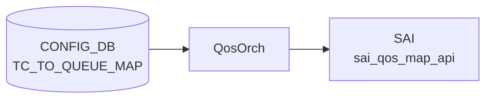

# TC_TO_QUEUE_MAP テーブル

## 概要

Traffic Class (TC) を egress queue インデックスへマップする[^1]。`DSCP_TO_TC_MAP` で TC 化された値が、このマップで物理キューに振り分けられる。`qosorch` が [SAI](../../reference/glossary.md#term-sai) map (`SAI_QOS_MAP_TYPE_TC_TO_QUEUE`) を生成し、`PORT_QOS_MAP.tc_to_queue_map` で各ポートに適用する。

<!-- cdb-mermaid -->
### データフロー (自動生成)



!!! note "凡例"
    CONFIG_DB から SAI までの典型経路を `docs/reference/config-db-orch-map.md` から機械生成したミニ図。詳細・例外は本ページ本文と対応表を参照。
<!-- /cdb-mermaid -->

## key 構造

```text
TC_TO_QUEUE_MAP|<name>|<tc>
```

`<name>` は 1..32 文字、`<tc>` は `tc_type` (0..7)。

## フィールド一覧

| フィールド | 型 | 必須 | 説明 |
|-----------|----|------|------|
| `name` (key) | string (1..32) | ✅ | マップ名 |
| `tc` (key) | `tc_type` (0..7) | ✅ | TC |
| `qindex` | string (0..9) | - | egress queue index |

## 購読者

- `qosorch`: [SAI](../../reference/glossary.md#term-sai) [QoS](../../reference/glossary.md#term-qos) map 生成

## 関連 CONFIG_DB / YANG / CLI

- 関連 [CONFIG_DB](../../reference/glossary.md#term-config_db): `PORT_QOS_MAP`、`QUEUE`、`DSCP_TO_TC_MAP`
- 関連 CLI: なし
- 関連 [YANG](../../reference/glossary.md#term-yang): `sonic-tc-queue-map`

<!-- ref-triangle:start -->

## 関連リファレンス

- [YANG](../../reference/glossary.md#term-yang): [`sonic-tc-queue-map`](../yang/sonic-tc-queue-map.md)

<!-- ref-triangle:end -->

## 引用元

[^1]: [YANG](../../reference/glossary.md#term-yang) 定義: `sonic-tc-queue-map.yang`. <https://github.com/sonic-net/sonic-buildimage/blob/9ea932ec2e18f35e58268ec2e4456b1d4afd65cd/src/sonic-yang-models/yang-models/sonic-tc-queue-map.yang>

<!-- topics-back-ref -->
## 関連 Topics

- [Topics: QoS / Buffer / PFC / Watermark](../../topics/08-qos-buffer/index.md)

<!-- /topics-back-ref -->

<!-- value-behavior -->
## 値依存挙動マトリクス

`tc` / `qindex` は enum 型ではなく数値 / 文字列型。

| フィールド | 値 | 挙動 |
|-----------|-----|-----|
| `tc` | `0`..`7` | 有効な Traffic Class インデックス |
| `qindex` | `"0"`..`"9"` | 対応する egress queue インデックスにマッピング |
| `qindex` | 空文字列 / 数字以外 | `stoi()` 例外 → `task_invalid_entry`（エントリ破棄） |
| マップ全体 | PORT_QOS_MAP から参照中に DEL | DEL 保留 (`m_pendingRemove=true`)。参照解放まで待機 |
| マップ全体 | PORT_QOS_MAP 参照なし + DEL | SAI `remove_qos_map()` を即時呼び出し |

<!-- /value-behavior -->

<!-- cdb-exceptions -->
## 例外条件・特殊挙動

<!-- evidence: sonic-swss/orchagent/qosorch.cpp@4305596156d70e9797e8a881b3d19b46de0bce0d L124-201 L449-479 -->

- **参照中のエントリは DEL 保留**: ポートに割り当てられているマップを DEL しようとすると `"Can't remove object <name> due to being referenced"` を LOG_NOTICE して `m_pendingRemove = true` をセット、`task_need_retry` を返す。参照が外れるまで削除は保留される。
- **pending remove 中の SET はリトライ**: DEL 保留中のエントリへの SET は `task_need_retry` を返し、参照解放後に再処理される。
- **SAI create/modify 失敗**: `sai_qos_map_api->create_qos_map()` 失敗時に `"Failed to create tc_to_queue map. status:%d"` を LOG_ERROR して `task_failed` を返す。既存マップの変更失敗時も `"Failed to set [TC_TO_QUEUE_MAP:<name>]"` を LOG_ERROR して `task_failed` を返す。
- **存在しない object への DEL**: SAI オブジェクトが未作成のエントリを DEL しようとすると `"Object with name:<name> not found."` を LOG_ERROR して `task_invalid_entry` を返す（エントリはキューから除去される）。
- **フィールド値の型変換失敗**: TC 値または queue_index が整数として解釈できない場合、`stoi()` が例外を投げ `task_invalid_entry` を返す。

<!-- /cdb-exceptions -->

<!-- ops-hint -->
## 運用ヒント

### 典型値

- key 形式: `TC_TO_QUEUE_MAP|<name>` (例 `AZURE`)。
- 値: `0:0`, `1:1`, `3:3`, `4:4` 等。

### よくある誤設定

- TC→queue を 0..7 範囲外に書くと [SAI](../../reference/glossary.md#term-sai) が拒否し、マップ全体が install されない。

### 確認コマンド

```bash
sonic-db-cli CONFIG_DB hgetall 'TC_TO_QUEUE_MAP|AZURE'
show qos map tc-queue
```
<!-- /ops-hint -->


<!-- derivation -->
## 派生・条件付き登録 (Phase 6/7)

### Phase 6: 自動派生

QosOrch が `TC_TO_QUEUE_MAP` テーブル名から SAI map type `SAI_QOS_MAP_TYPE_TC_TO_QUEUE` を自動決定する。テーブル名による種別自動解決が Phase 6 相当。Config-DB 内フィールド間の自動付与なし。

### Phase 7: 条件付き登録 (add_manager 条件)

QosOrch は常時登録し `TC_TO_QUEUE_MAP` テーブルを無条件購読する。`PORT.tc_to_queue_map` から参照されている場合のみ SAI port QoS map として bind される。未参照の場合は map オブジェクトが作成されるが port に適用されない。

<!-- /derivation -->

<!-- handler-branching -->
### Phase 8: Handler メソッド内分岐

| Handler | 分岐条件 | 効果 | evidence |
|---|---|---|---|
| `QosOrch` | map エントリ追加 | SAI `sai_qos_map_api->create_qos_map()` 呼び出し | `qosorch.cpp` |
| `QosOrch` | map エントリ更新 | SAI qos map attribute を set (既存 map OID に対して) | `qosorch.cpp` |
| `QosOrch` | del_handler | SAI qos map 削除、port 参照を解除してから削除 | `qosorch.cpp` |
| `QosOrch` | TC 値が範囲外 (0-7 以外) | ログエラー + スキップ | `qosorch.cpp` |

> **スキャン証跡**: `TC_TO_QUEUE_MAP` は Traffic Class からキュー番号へのマッピングテーブル。QosOrch が SAI QoS map として管理。テーブル名からの map type 自動解決が Phase 6 相当。

<!-- /handler-branching -->

<!-- runtime-trace -->
## CDB → 実コンテナ動作トレース

### 段階 1: Consumer 登録

- **orchagent / QosOrch**: `TC_TO_QUEUE_MAP` テーブルを `SubscriberStateTable` で購読。

### 段階 2: CFG → APPL 翻訳

- QosOrch が TC→Queue マッピングエントリを解析。APP_DB への書き込みなし。

### 段階 3: APPL → SAI

- QosOrch が `sai_qos_map_api->create_qos_map()` で `SAI_QOS_MAP_TYPE_TC_TO_QUEUE` マップを作成。
- PORT_QOS_MAP での参照でポートに適用。

### 段階 4: タイミング + 副作用

- マップ作成後、PORT_QOS_MAP が参照したときに即時ポートに適用。
- 副作用: TC→Queue マッピング変更でトラフィックの queue 割り当てが変わり QoS 特性が変化。

<!-- /runtime-trace -->
<!-- entry-points -->
## 書き込み入り口 (Direction A)

TC_TO_QUEUE_MAP テーブルへの書き込みが発生するコード経路を網羅的に調査した結果。

### CLI

  - `config qos reload` — sonic-cfggen が `files/build_templates/qos_config.j2` を展開し TC_TO_QUEUE_MAP エントリを生成 (sonic-buildimage/files/build_templates/qos_config.j2)

### minigraph / sonic-cfggen

minigraph.py に TC_TO_QUEUE_MAP 直接生成なし — `qos_config.j2` テンプレート経由

### REST / gNMI

REST/gNMI 書き込み経路なし

### db_migrator

db_migrator.py での TC_TO_QUEUE_MAP マイグレーションなし

### ビルド時デフォルト (build-time default)

各プラットフォームの `qos.json.j2` に TC_TO_QUEUE_MAP エントリが定義され、ビルド時に投入

### ハードコードデフォルト / ランタイム注入

なし

### 死活・デッドコード

なし
<!-- /entry-points -->

<!-- defaults -->
## 暗黙デフォルト・コード由来挙動 (Phase A)

### ビルド時デフォルト

`config qos reload` が展開する `qos_config.j2` は以下の優先順で `TC_TO_QUEUE_MAP` を生成する。

1. `generate_tc_to_queue_map` 関数定義あり **かつ** `tunnel_qos_remap_enable=true` → プラットフォーム固有関数（`AZURE_UPLINK` 等）
2. `generate_tc_to_queue_map_per_sku` 定義あり → SKU 別マップ
3. **フォールバック（デフォルト）**: TC 0–7 → queue 0–7 の恒等写像（マップ名 `AZURE`）

### フィールド別暗黙挙動

| フィールド | YANG デフォルト | コード挙動 | 備考 |
|-----------|--------------|----------|------|
| `qindex` | なし | `stoi()` 変換のみ。空/非数値 → 例外 → `task_invalid_entry`（silent drop） | YANG は 1 桁 (0–9) を pattern で制約するが実装は上限チェックなし |
| `tc` (key) | なし（型: `tc_type` 0–7） | `stoi()` 変換のみ。無効値 → `task_invalid_entry` | try-catch なし |

### ハードコード

`TcToQueueMapHandler::addQosItem()` 内で SAI map type が静的にハードコードされている。

```cpp
qos_map_attr.value.s32 = SAI_QOS_MAP_TYPE_TC_TO_QUEUE;
```

テーブル名から動的解決ではなく、ハンドラクラスに埋め込み固定。

### 書込み順依存

- `PORT_QOS_MAP` が参照する前に `TC_TO_QUEUE_MAP` が存在しない場合、`PORT_QOS_MAP` 処理は `task_need_retry` で再キューイングされる。
- `TC_TO_QUEUE_MAP` DEL 時に `PORT_QOS_MAP` 参照中であれば `m_pendingRemove=true` でキューイング、参照解放まで SAI remove は呼ばれない。

### 経路依存乖離

PORT_QOS_MAP への適用マップ名は `qos_config.j2` の条件分岐で決定する。

```
uplink ポート + different_tc_to_queue_map + tunnel_qos_remap_enable → AZURE_UPLINK
それ以外 → AZURE（デフォルト恒等写像）
```

<!-- /defaults -->

<!-- constants -->
## ハードコード定数 (Phase E)

ソース: `sonic-swss/orchagent/qosorch.cpp`、`sonic-swss/orchagent/qosorch.h`

### TC / queue インデックス範囲

| 定数 | 値 | 説明 |
|------|----|------|
| TC 最小値 | `0` | `tc_type` YANG typedef 下限 |
| TC 最大値 | `7` | `tc_type` YANG typedef 上限 |
| queue インデックス最小値 | `0` | `sai_qos_map_t.value.queue_index` 下限 |
| queue インデックス最大値 | プラットフォーム依存 | SAI / ASIC が許容する物理キュー数に依存（典型値 8〜12）。YANG 制約は `0..9` だが実装はチェックしない |

### デフォルトマップ名

| 定数 | 値 | 箇所 |
|------|----|------|
| デフォルトマップ名 | `"AZURE"` | `qos_config.j2` フォールバック定義。テスト: `qosorch_ut.cpp` L648, L683, L943 |
| アップリンク用マップ名 | `"AZURE_UPLINK"` | `generate_tc_to_queue_map` 関数が `tunnel_qos_remap_enable=true` 時に生成 |

### SAI 定数

| 定数 | 値 | 箇所 |
|------|----|------|
| `SAI_QOS_MAP_ATTR_TYPE` | `SAI_QOS_MAP_TYPE_TC_TO_QUEUE` | `addQosItem()` L458 にハードコード |
| `SAI_QOS_MAP_ATTR_MAP_TO_VALUE_LIST` | — | `convertFieldValuesToAttributes()` L442 |
| `SAI_PORT_ATTR_QOS_TC_TO_QUEUE_MAP` | — | PORT_QOS_MAP バインド時に使用 (L64) |

### フィールド名定数 (qosorch.h)

| 定数 | 値 | 説明 |
|------|----|------|
| `tc_to_queue_field_name` | `"tc_to_queue_map"` | PORT_QOS_MAP フィールド名 |
| `encap_tc_to_queue_field_name` | `"encap_tc_to_queue_map"` | トンネルアップリンク用フィールド名 |

### デフォルト恒等写像

`qos_config.j2` フォールバック時の TC→queue 対応（マップ名 `AZURE`）:

```
TC 0 → queue 0
TC 1 → queue 1
TC 2 → queue 2
TC 3 → queue 3
TC 4 → queue 4
TC 5 → queue 5
TC 6 → queue 6
TC 7 → queue 7
```

<!-- /constants -->

<!-- glossary-links-injected: 16a5b728a75a -->
