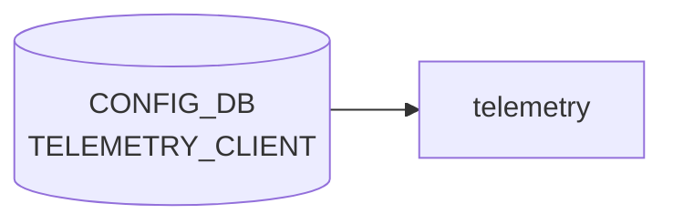

# TELEMETRY_CLIENT テーブル

## 概要

`docker-sonic-gnmi` (旧 `docker-sonic-telemetry`) の **dial-out** モードで使う、コレクタ宛のサブスクリプション情報を [CONFIG_DB](../../reference/glossary.md#term-config_db) に登録するテーブル[^1]。`Global` (共通設定) と、`Subscription` / `DestinationGroup` の 2 種類のエントリリストから成る。

<!-- cdb-mermaid -->
### データフロー (自動生成)



!!! note "凡例"
    CONFIG_DB から SAI までの典型経路を `docs/reference/config-db-orch-map.md` から機械生成したミニ図。詳細・例外は本ページ本文と対応表を参照。
<!-- /cdb-mermaid -->

## key 構造

```text
TELEMETRY_CLIENT|Global
TELEMETRY_CLIENT|Subscription|<name>
TELEMETRY_CLIENT|DestinationGroup|<name>
```

`Global` はシングルトン container。それ以外は `(prefix, name)` 複合キーの list `TELEMETRY_CLIENT_LIST` で、`prefix` は `Subscription|DestinationGroup` の enum (string pattern)。

## フィールド

### `TELEMETRY_CLIENT|Global`

| フィールド | 型 | デフォルト | 説明 |
|-----------|----|-----------|------|
| `retry_interval` | uint64 (秒) | なし | 再接続リトライ間隔 |
| `src_ip` | `inet:ip-address` | なし | dial-out 送信元アドレス |
| `encoding` | enum `JSON_IETF`/`ASCII`/`BYTES`/`PROTO` | `JSON_IETF` (コード強制) | テレメトリのエンコーディング。実装未対応のため DB 値を無視して常に `JSON_IETF` が使用される |
| `unidirectional` | boolean | `true` (コード強制) | 単方向ストリームか。実装未対応のため DB 値を無視して常に `true` |

### `TELEMETRY_CLIENT|Subscription|<name>` / `TELEMETRY_CLIENT|DestinationGroup|<name>`

| フィールド | 型 | デフォルト | 説明 |
|-----------|----|-----------|------|
| `prefix` | enum `Subscription`/`DestinationGroup` | - | エントリ種別 (key) |
| `name` | string | - | 名前 (key) |
| `dst_addr` | `ipv4-port` (`host:port[,host:port,...]`) | なし | コレクタ宛先。複数カンマ区切り可 (DestinationGroup で主に使用) |
| `dst_group` | string | なし | 紐づける DestinationGroup 名 (Subscription 側で使用)。must で同 list 内 `name` に存在することを要求 |
| `path_target` | enum `APPL_DB`/`CONFIG_DB`/`COUNTERS_DB`/`STATE_DB`/`OTHERS` | なし | 購読先 DB |
| `paths` | string (カンマ区切り) | なし | 購読するデータパス |
| `report_interval` | uint64 (ms) | `5000` (YANG + コード一致) | 報告周期 (ms 単位) |
| `report_type` | enum `periodic`/`stream`/`once` | なし (省略時サイレント無効) | 報告モード |

<!-- defaults -->
## コード由来デフォルト (Phase A)

> **調査対象**: `sonic-gnmi/dialout/dialout_client/dialout_client.go` (processTelemetryClientConfig / clientSubscription struct)、`sonic-telemetry_client.yang`

| フィールド | スコープ | コード由来デフォルト | YANG デフォルト | 根拠 |
|-----------|--------|-------------------|----------------|------|
| `unidirectional` | Global | `true` **強制固定** | `true` | `dialout_client.go` L503-505: DB 値を無視して `clientCfg.Unidirectional = true` |
| `encoding` | Global | `JSON_IETF` **強制固定** | なし | `dialout_client.go` L501-503: "Flexible encoding Not supported yet" コメントで `gpb.Encoding_JSON_IETF` に固定 |
| `report_interval` | Subscription | `5000` ms | `5000` | `dialout_client.go` L582: `interval: 5000`、YANG L134: `default 5000` で一致 |
| `retry_interval` | Global | 呼び出し元 CLI 依存 | なし | 未設定時は `ccfg` (起動オプション) の値を引き継ぐ |
| `src_ip` | Global | `""` (OS のルーティング依存) | なし | 省略時 gRPC が OS のデフォルト送信元を使用 |
| `report_type` | Subscription | `Unknown` (= 無効) | なし | 省略時 `publishRun()` が `"Unsupported report type"` をログして処理を行わない |
| `dst_addr` | DestinationGroup | (必須) | なし | `Destination.Validate()` が空なら `"Destination.Addrs is empty"` を返す |

**重要**: `encoding` と `unidirectional` は YANG に定義が存在するが、現行 Go 実装では DB の値を読み込んでもランタイムで上書きするため、CONFIG_DB への設定変更が反映されない。これは既知の未実装事項 ("Not supported yet") である。

<!-- /defaults -->

<!-- ordering -->
## 書込み順依存 (Phase B — コード由来)

`dialout_client_cli` (`sonic-gnmi/dialout/dialout_client/dialout_client.go`) の `DialOutRun()` / `processTelemetryClientConfig()` を精読して検出した順序依存・タイミング依存。詳細スキャンノート: [`meta/_intermediate/cdb-flow/telemetry-client-ordering.md`](https://github.com/aoki-taquan/sonic-unofficial-docs/blob/main/meta/_intermediate/cdb-flow/telemetry-client-ordering.md)。

| # | 依存関係 | 方向 | 緩和策 / 備考 |
|---|----------|------|--------------|
| 1 | `TELEMETRY_CLIENT\|DestinationGroup_<name>` 書込み → `TELEMETRY_CLIENT\|Subscription_<name>` 書込み | 先行推奨 | 起動時一括読み込みは Redis `KEYS` ランダム順。Subscription を先に処理した場合は `destGroupName` 未解決でサイレントスキップ (`dialout_client.go:622-625`)。keyspace notification 経由のオンライン変更では自動回復する |
| 2 | `gnmi-native` プロセス `running` → `dialout` (dialout_client_cli) 起動 | supervisord `dependent_startup_wait_for` 強制 | `supervisord.conf:68`。gNMI サーバが listen 前に dialout が起動することはない。CONFIG_DB への事前書き込みは可（起動時一括読み込みで反映） |
| 3 | `database.service` 起動完了 → `gnmi.service` 起動 | systemd `After=` 強制 | `gnmi.service.j2:3-4`。Redis 未起動時に `TELEMETRY_CLIENT` が参照されることはない |
| 4 | `TELEMETRY_CLIENT\|Global` 書込み → `TELEMETRY_CLIENT\|DestinationGroup_*` 書込み | 推奨先行 | 逆順でも機能するが、後から Global を変更すると `destGrpNameMap` 全グループの gRPC セッションが再起動される (`dialout_client.go:508-512`)。Global → DestinationGroup → Subscription の順が推奨 |
| 5 | 使用中 `DestinationGroup` DEL → 参照 `Subscription` DEL | 先行必須 | 参照中 DestinationGroup を DEL しようとすると `"<name> is being used"` を返して拒否 (`dialout_client.go:519-522`)。先に Subscription を削除すること |

### 補足

- 依存 #1 は起動時のみの問題。runtime では keyspace notification を受けた `processTelemetryClientConfig()` が再呼び出しされるため、先に Subscription が書かれていても DestinationGroup が後追いで書かれると `setupDestGroupClients()` 経由で自動的にセッションが確立される。
- 依存 #4 は操作コストの話であり機能上は逆順でも動作する。ただしカットオーバー時のセッション再起動ウィンドウを最小化するため、Global を最初に確定しておくことを推奨。
<!-- /ordering -->

<!-- cross-refs -->
## 暗黙テーブル参照 (Phase C)

`TELEMETRY_CLIENT` テーブルは `dialout_client.go` が直接購読するが、`dialout` プロセスの起動は `gnmi-native` プロセス経由で以下のテーブルに間接依存する。詳細スキャンノート: [`meta/_intermediate/cdb-flow/telemetry-client-cross-refs.md`](https://github.com/aoki-taquan/sonic-unofficial-docs/blob/main/meta/_intermediate/cdb-flow/telemetry-client-cross-refs.md)。

| 参照先テーブル | 参照フィールド | 方向 | 直接/間接 | 証跡 |
|--------------|-------------|------|-----------|------|
| `CONFIG_DB.TELEMETRY\|gnmi` / `TELEMETRY\|certs` | `port`, `server_crt`, `server_key`, `ca_crt` | TELEMETRY_CLIENT → TELEMETRY | 間接（`supervisord.conf` の `dependent_startup_wait_for=gnmi-native:running` により `dialout` は gnmi-native 起動後に起動） | `gnmi-native.sh:L18`, `supervisord.conf:L70` |
| `CONFIG_DB.DEVICE_METADATA\|x509` | `server_crt`, `server_key`, `ca_crt` | TELEMETRY_CLIENT → DEVICE_METADATA | 間接（gnmi-native.sh が `TELEMETRY\|certs` 非設定時のフォールバックとして使用） | `telemetry_vars.j2:L4`, `gnmi-native.sh:L44-55` |
| `CONFIG_DB.DEVICE_METADATA\|localhost` | `subtype` | TELEMETRY_CLIENT → DEVICE_METADATA | 間接（gnmi-native.sh が SmartSwitch 判定 → ZMQ ポート追加） | `gnmi-native.sh:L88-90` |
| `CONFIG_DB.MGMT_VRF_CONFIG\|vrf_global` | `mgmtVrfEnabled` | TELEMETRY_CLIENT → MGMT_VRF_CONFIG | 間接（gnmi-native.sh が管理 VRF バインド → dial-out も mgmt VRF 経由になる） | `gnmi-native.sh:L93-96` |

### 補足

- `dialout_client.go` 自体は `TELEMETRY_CLIENT` 以外の CONFIG_DB テーブルを直接読み取らない。上記の間接参照はすべて `gnmi-native.sh` 経由のコンテナ起動時処理。
- `TELEMETRY` テーブルの `certs` または `DEVICE_METADATA.x509` が未設定の場合、`gnmi-native.sh` は `--noTLS` モードで gNMI サーバを起動する。この場合、dial-out コレクタへの接続も非 TLS になる。
- 管理 VRF が有効な環境では `MGMT_VRF_CONFIG|vrf_global.mgmtVrfEnabled=true` を先に設定しないと、gnmi-native が mgmt VRF 外でバインドされ dial-out が期待する送信元 VRF と乖離する可能性がある。

<!-- /cross-refs -->

## 制約

- `ipv4-port` typedef で `dst_addr` は IPv4:port のカンマ区切りに制約 (IPv6 リテラルは現状不可)[^1]
- `dst_group` は `must "(contains(../../TELEMETRY_CLIENT_LIST/name, current()))"` で参照整合性をチェック
- `prefix` enum は `Subscription` または `DestinationGroup` のみ

## 購読者

- `docker-sonic-gnmi` (旧 `telemetry` コンテナ) の dial-out クライアント: [CONFIG_DB](../../reference/glossary.md#term-config_db) → gRPC dial-out 接続を確立

## 関連 CONFIG_DB / YANG / CLI

- 関連 [CONFIG_DB](../../reference/glossary.md#term-config_db): [`TELEMETRY`](telemetry.md) (dial-in 側設定)
- CLI: 標準 CLI ラッパなし。CONFIG_DB / init_cfg.json で直接設定
- 関連 [YANG](../../reference/glossary.md#term-yang): `sonic-telemetry_client`

<!-- ref-triangle:start -->

## 関連リファレンス

- [YANG](../../reference/glossary.md#term-yang): `sonic-telemetry_client`

<!-- ref-triangle:end -->

## 引用元

[^1]: `src/sonic-yang-models/yang-models/sonic-telemetry_client.yang` (container `TELEMETRY_CLIENT` / `Global` / list `TELEMETRY_CLIENT_LIST`、typedef `report-type`/`path_target`/`encoding`/`ipv4-port`). <https://github.com/sonic-net/sonic-buildimage/blob/9ea932ec2e18f35e58268ec2e4456b1d4afd65cd/src/sonic-yang-models/yang-models/sonic-telemetry_client.yang>

## 関連ページ
- [CONFIG_DB: TELEMETRY](telemetry.md)

<!-- value-behavior -->
## 値依存挙動マトリクス

### `encoding` (encoding typedef): `JSON_IETF` / `ASCII` / `BYTES` / `PROTO`

### `report_type` (report-type typedef): `periodic` / `stream` / `once`

### `path_target` (path_target typedef): `APPL_DB` / `CONFIG_DB` / `COUNTERS_DB` / `STATE_DB` / `OTHERS`

### `prefix` (string pattern): `Subscription` / `DestinationGroup`

| フィールド | 値 | 挙動 |
|-----------|-----|-----|
| `report_type` | `periodic` | `report_interval` [ms] ごとに定期送信 (default 5000ms) |
| `report_type` | `stream` | ON_CHANGE — データ変化時に即送信 |
| `report_type` | `once` | 1 回取得して切断。`report_interval` は無視 |
| `unidirectional` | `true` (default) | dial-out は一方向ストリーム |
| `unidirectional` | `false` | 双方向 RPC (コレクタからの応答を期待) |
| `dst_addr` | IPv6 リテラル | `ipv4-port` typedef の pattern で [YANG](../../reference/glossary.md#term-yang) 拒否 |
| `dst_group` (Subscription) | 存在しない DestinationGroup 名 | `must` 制約違反で YANG バリデーション失敗 |
| `TELEMETRY_CLIENT|Global` | DEL 操作 | 拒否 (`"Invalid delete operation"`) |

<!-- /value-behavior -->

<!-- cdb-exceptions -->
## 例外条件・特殊挙動

<!-- evidence: sonic-gnmi/dialout/dialout_client/dialout_client.go@eb635b7679b260c3fd0786a6d0734fc8e82c9a22 L464-580 -->

- **`Global` キーの DEL 不可**: `TELEMETRY_CLIENT|Global` は DEL 操作をサポートしない。`"Invalid delete operation for TELEMETRY_CLIENT|Global"` を返す。
- **`retry_interval` 型変換失敗は無視**: `retry_interval` が `uint64` として解釈できない場合、`"Invalid retry_interval <value>"` をログして当該フィールドをスキップし旧設定を維持する。
- **使用中の DestinationGroup は DEL 不可**: Subscription から参照されている DestinationGroup を DEL しようとすると `"<name> is being used"` を返す。先に Subscription を削除する必要がある。
- **空の `dst_addr`**: DestinationGroup の `dst_addr` が空のアドレスを含む場合、`"Destination.Addrs is empty"` を返してエントリを拒否する。
- **DestinationGroup / Subscription の空名**: `DestinationGroup_` または `Subscription_` プレフィックス後が空文字列の場合はエラーを返す。
- **DestinationGroup 参照エラー**: Subscription が参照する DestinationGroup が未作成または削除済みの場合、`"Destination group <name> doesn't exist"` を返す。

<!-- /cdb-exceptions -->

<!-- ops-hint -->
## 運用ヒント

### 典型値

- key 形式: `TELEMETRY_CLIENT|Global` / `TELEMETRY_CLIENT|Subscription|<n>` / `TELEMETRY_CLIENT|DestinationGroup|<n>`。
- `encoding=JSON_IETF`、`report_type=stream`、`report_interval=5000` (ms)。

### よくある誤設定

- `dst_addr` に IPv6 リテラルを入れて pattern で reject される (`ipv4-port` typedef のみ)。
- `Subscription` の `dst_group` が `DestinationGroup` のいずれの `name` にも一致せず must 制約で失敗。
- `paths` を空にして購読が成立しない。

### 確認コマンド

```bash
sonic-db-cli CONFIG_DB keys 'TELEMETRY_CLIENT|*'
docker logs gnmi | grep -i dial-out
```
<!-- /ops-hint -->


<!-- derivation -->
## 派生・条件付き登録 (Phase 6/7)

### Phase 6: 自動派生

telemetry サービスが `tls_cert` / `tls_key` フィールドの有無から接続モードを自動決定する。両方あり → mTLS 接続、なし → 平文または server-only TLS。`enabled` フィールドにより dial-out クライアントの起動/停止が制御される。

### Phase 7: 条件付き登録 (add_manager 条件)

telemetry サービスが有効の場合のみ `TELEMETRY_CLIENT` テーブルを消費するプロセスが存在する。`TELEMETRY_CLIENT.enabled==false` の場合は dial-out クライアントを起動しない。

<!-- /derivation -->

<!-- handler-branching -->
### Phase 8: Handler メソッド内分岐

| Handler | 分岐条件 | 効果 | evidence |
|---|---|---|---|
| `telemetry_client` | `enabled==true` | gRPC 接続を確立して subscription 開始 | `telemetry_client` |
| `telemetry_client` | `enabled==false` | gRPC 接続を切断 | `telemetry_client` |
| `telemetry_client` | `tls_cert` / `tls_key` あり | mTLS 証明書を使用して接続 | `telemetry_client` |
| `telemetry_client` | TLS 設定なし | 平文または server-only TLS で接続 | `telemetry_client` |
| `telemetry_client` | `retry_interval` 設定 | 接続失敗時の再試行インターバルを設定 | `telemetry_client` |

> **スキャン証跡**: `TELEMETRY_CLIENT` は gNMI dial-out のクライアント設定。`enabled` フィールドが主要分岐。TLS フィールドの有無が接続モードを決定（Phase 6 派生相当）。

<!-- /handler-branching -->

<!-- runtime-trace -->
## CDB → 実コンテナ動作トレース

### 段階 1: Consumer 登録

- **gnmi-telemetry** または **sonic-gnmi**: `TELEMETRY_CLIENT` テーブルを `ConfigDBConnector` で購読。

### 段階 2: CFG → APPL 翻訳

- gnmi-telemetry がテレメトリクライアント設定 (サブスクリプション対象, エンドポイント, 認証) を読み込みセッションを確立。

### 段階 3: APPL → SAI

- SAI 経由なし。gNMI Dial-Out でリモートコレクタへ購読データを Push。

### 段階 4: タイミング + 副作用

- 設定変更後 gnmi-telemetry が再起動されるまで数秒。サブスクリプション確立に数秒かかる場合あり。

<!-- /runtime-trace -->
<!-- entry-points -->
## 書き込み入り口 (Direction A)

TELEMETRY_CLIENT テーブルへの書き込みが発生するコード経路を網羅的に調査した結果。

### CLI

  - `config hft target/session ...` — `config/hft.py` が TELEMETRY_CLIENT を書き込む (sonic-utilities/config/hft.py)

### minigraph / sonic-cfggen

**minigraph.py** が `<TelemetryInfo>` タグから TELEMETRY_CLIENT エントリを生成 (sonic-buildimage/src/sonic-config-engine/minigraph.py)

### REST / gNMI

REST/gNMI 書き込み経路なし

### db_migrator

**db_migrator.py** が TELEMETRY_CLIENT のマイグレーション処理を実装 (sonic-utilities/scripts/db_migrator.py)

### ビルド時デフォルト (build-time default)

なし

### ハードコードデフォルト / ランタイム注入

なし

### 死活・デッドコード

なし
<!-- /entry-points -->

<!-- glossary-links-injected: d5320e852f7a -->
