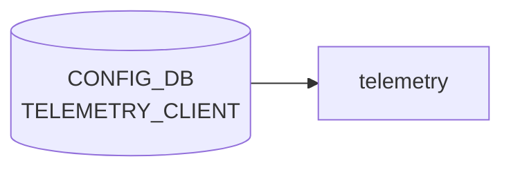

# TELEMETRY_CLIENT テーブル

## 概要

`docker-sonic-gnmi` (旧 `docker-sonic-telemetry`) の **dial-out** モードで使う、コレクタ宛のサブスクリプション情報を [CONFIG_DB](../../reference/glossary.md#term-config_db) に登録するテーブル[^1]。`Global` (共通設定) と、`Subscription` / `DestinationGroup` の 2 種類のエントリリストから成る。

<!-- cdb-mermaid -->
### データフロー (自動生成)



!!! note "凡例"
    CONFIG_DB から SAI までの典型経路を `docs/reference/config-db-orch-map.md` から機械生成したミニ図。詳細・例外は本ページ本文と対応表を参照。
<!-- /cdb-mermaid -->

## key 構造

```text
TELEMETRY_CLIENT|Global
TELEMETRY_CLIENT|Subscription|<name>
TELEMETRY_CLIENT|DestinationGroup|<name>
```

`Global` はシングルトン container。それ以外は `(prefix, name)` 複合キーの list `TELEMETRY_CLIENT_LIST` で、`prefix` は `Subscription|DestinationGroup` の enum (string pattern)。

## フィールド

### `TELEMETRY_CLIENT|Global`

| フィールド | 型 | デフォルト | 説明 |
|-----------|----|-----------|------|
| `retry_interval` | uint64 (秒) | なし | 再接続リトライ間隔 |
| `src_ip` | `inet:ip-address` | なし | dial-out 送信元アドレス |
| `encoding` | enum `JSON_IETF`/`ASCII`/`BYTES`/`PROTO` | なし | テレメトリのエンコーディング |
| `unidirectional` | boolean | `true` | 単方向ストリームか |

### `TELEMETRY_CLIENT|Subscription|<name>` / `TELEMETRY_CLIENT|DestinationGroup|<name>`

| フィールド | 型 | デフォルト | 説明 |
|-----------|----|-----------|------|
| `prefix` | enum `Subscription`/`DestinationGroup` | - | エントリ種別 (key) |
| `name` | string | - | 名前 (key) |
| `dst_addr` | `ipv4-port` (`host:port[,host:port,...]`) | なし | コレクタ宛先。複数カンマ区切り可 (DestinationGroup で主に使用) |
| `dst_group` | string | なし | 紐づける DestinationGroup 名 (Subscription 側で使用)。must で同 list 内 `name` に存在することを要求 |
| `path_target` | enum `APPL_DB`/`CONFIG_DB`/`COUNTERS_DB`/`STATE_DB`/`OTHERS` | なし | 購読先 DB |
| `paths` | string (カンマ区切り) | なし | 購読するデータパス |
| `report_interval` | uint64 (ms) | `5000` | 報告周期 (ms 単位) |
| `report_type` | enum `periodic`/`stream`/`once` | なし | 報告モード |

## 制約

- `ipv4-port` typedef で `dst_addr` は IPv4:port のカンマ区切りに制約 (IPv6 リテラルは現状不可)[^1]
- `dst_group` は `must "(contains(../../TELEMETRY_CLIENT_LIST/name, current()))"` で参照整合性をチェック
- `prefix` enum は `Subscription` または `DestinationGroup` のみ

## 購読者

- `docker-sonic-gnmi` (旧 `telemetry` コンテナ) の dial-out クライアント: [CONFIG_DB](../../reference/glossary.md#term-config_db) → gRPC dial-out 接続を確立

## 関連 CONFIG_DB / YANG / CLI

- 関連 [CONFIG_DB](../../reference/glossary.md#term-config_db): [`TELEMETRY`](telemetry.md) (dial-in 側設定)
- CLI: 標準 CLI ラッパなし。CONFIG_DB / init_cfg.json で直接設定
- 関連 [YANG](../../reference/glossary.md#term-yang): `sonic-telemetry_client`

<!-- ref-triangle:start -->

## 関連リファレンス

- [YANG](../../reference/glossary.md#term-yang): `sonic-telemetry_client`

<!-- ref-triangle:end -->

## 引用元

[^1]: `src/sonic-yang-models/yang-models/sonic-telemetry_client.yang` (container `TELEMETRY_CLIENT` / `Global` / list `TELEMETRY_CLIENT_LIST`、typedef `report-type`/`path_target`/`encoding`/`ipv4-port`). <https://github.com/sonic-net/sonic-buildimage/blob/9ea932ec2e18f35e58268ec2e4456b1d4afd65cd/src/sonic-yang-models/yang-models/sonic-telemetry_client.yang>

## 関連ページ
- [CONFIG_DB: TELEMETRY](telemetry.md)

<!-- value-behavior -->
## 値依存挙動マトリクス

### `encoding` (encoding typedef): `JSON_IETF` / `ASCII` / `BYTES` / `PROTO`

### `report_type` (report-type typedef): `periodic` / `stream` / `once`

### `path_target` (path_target typedef): `APPL_DB` / `CONFIG_DB` / `COUNTERS_DB` / `STATE_DB` / `OTHERS`

### `prefix` (string pattern): `Subscription` / `DestinationGroup`

| フィールド | 値 | 挙動 |
|-----------|-----|-----|
| `report_type` | `periodic` | `report_interval` [ms] ごとに定期送信 (default 5000ms) |
| `report_type` | `stream` | ON_CHANGE — データ変化時に即送信 |
| `report_type` | `once` | 1 回取得して切断。`report_interval` は無視 |
| `unidirectional` | `true` (default) | dial-out は一方向ストリーム |
| `unidirectional` | `false` | 双方向 RPC (コレクタからの応答を期待) |
| `dst_addr` | IPv6 リテラル | `ipv4-port` typedef の pattern で [YANG](../../reference/glossary.md#term-yang) 拒否 |
| `dst_group` (Subscription) | 存在しない DestinationGroup 名 | `must` 制約違反で YANG バリデーション失敗 |
| `TELEMETRY_CLIENT|Global` | DEL 操作 | 拒否 (`"Invalid delete operation"`) |

<!-- /value-behavior -->

<!-- cdb-exceptions -->
## 例外条件・特殊挙動

<!-- evidence: sonic-gnmi/dialout/dialout_client/dialout_client.go@eb635b7679b260c3fd0786a6d0734fc8e82c9a22 L464-580 -->

- **`Global` キーの DEL 不可**: `TELEMETRY_CLIENT|Global` は DEL 操作をサポートしない。`"Invalid delete operation for TELEMETRY_CLIENT|Global"` を返す。
- **`retry_interval` 型変換失敗は無視**: `retry_interval` が `uint64` として解釈できない場合、`"Invalid retry_interval <value>"` をログして当該フィールドをスキップし旧設定を維持する。
- **使用中の DestinationGroup は DEL 不可**: Subscription から参照されている DestinationGroup を DEL しようとすると `"<name> is being used"` を返す。先に Subscription を削除する必要がある。
- **空の `dst_addr`**: DestinationGroup の `dst_addr` が空のアドレスを含む場合、`"Destination.Addrs is empty"` を返してエントリを拒否する。
- **DestinationGroup / Subscription の空名**: `DestinationGroup_` または `Subscription_` プレフィックス後が空文字列の場合はエラーを返す。
- **DestinationGroup 参照エラー**: Subscription が参照する DestinationGroup が未作成または削除済みの場合、`"Destination group <name> doesn't exist"` を返す。

<!-- /cdb-exceptions -->

<!-- ops-hint -->
## 運用ヒント

### 典型値

- key 形式: `TELEMETRY_CLIENT|Global` / `TELEMETRY_CLIENT|Subscription|<n>` / `TELEMETRY_CLIENT|DestinationGroup|<n>`。
- `encoding=JSON_IETF`、`report_type=stream`、`report_interval=5000` (ms)。

### よくある誤設定

- `dst_addr` に IPv6 リテラルを入れて pattern で reject される (`ipv4-port` typedef のみ)。
- `Subscription` の `dst_group` が `DestinationGroup` のいずれの `name` にも一致せず must 制約で失敗。
- `paths` を空にして購読が成立しない。

### 確認コマンド

```bash
sonic-db-cli CONFIG_DB keys 'TELEMETRY_CLIENT|*'
docker logs gnmi | grep -i dial-out
```
<!-- /ops-hint -->

<!-- glossary-links-injected: d5320e852f7a -->
