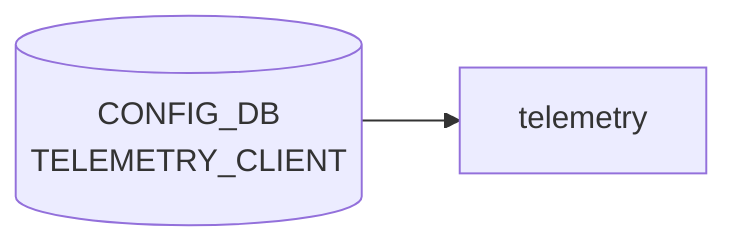

# TELEMETRY_CLIENT テーブル

## 概要

`docker-sonic-gnmi` (旧 `docker-sonic-telemetry`) の **dial-out** モードで使う、コレクタ宛のサブスクリプション情報を [CONFIG_DB](../../reference/glossary.md#term-config_db) に登録するテーブル[^1]。`Global` (共通設定) と、`Subscription` / `DestinationGroup` の 2 種類のエントリリストから成る。

<!-- cdb-mermaid -->
### データフロー (自動生成)



!!! note "凡例"
    CONFIG_DB から SAI までの典型経路を `docs/reference/config-db-orch-map.md` から機械生成したミニ図。詳細・例外は本ページ本文と対応表を参照。
<!-- /cdb-mermaid -->

## key 構造

```text
TELEMETRY_CLIENT|Global
TELEMETRY_CLIENT|Subscription|<name>
TELEMETRY_CLIENT|DestinationGroup|<name>
```

`Global` はシングルトン container。それ以外は `(prefix, name)` 複合キーの list `TELEMETRY_CLIENT_LIST` で、`prefix` は `Subscription|DestinationGroup` の enum (string pattern)。

## フィールド

### `TELEMETRY_CLIENT|Global`

| フィールド | 型 | デフォルト | 説明 |
|-----------|----|-----------|------|
| `retry_interval` | uint64 (秒) | なし | 再接続リトライ間隔 |
| `src_ip` | `inet:ip-address` | なし | dial-out 送信元アドレス |
| `encoding` | enum `JSON_IETF`/`ASCII`/`BYTES`/`PROTO` | `JSON_IETF` (コード強制) | テレメトリのエンコーディング。実装未対応のため DB 値を無視して常に `JSON_IETF` が使用される |
| `unidirectional` | boolean | `true` (コード強制) | 単方向ストリームか。実装未対応のため DB 値を無視して常に `true` |

### `TELEMETRY_CLIENT|Subscription|<name>` / `TELEMETRY_CLIENT|DestinationGroup|<name>`

| フィールド | 型 | デフォルト | 説明 |
|-----------|----|-----------|------|
| `prefix` | enum `Subscription`/`DestinationGroup` | - | エントリ種別 (key) |
| `name` | string | - | 名前 (key) |
| `dst_addr` | `ipv4-port` (`host:port[,host:port,...]`) | なし | コレクタ宛先。複数カンマ区切り可 (DestinationGroup で主に使用) |
| `dst_group` | string | なし | 紐づける DestinationGroup 名 (Subscription 側で使用)。must で同 list 内 `name` に存在することを要求 |
| `path_target` | enum `APPL_DB`/`CONFIG_DB`/`COUNTERS_DB`/`STATE_DB`/`OTHERS` | なし | 購読先 DB |
| `paths` | string (カンマ区切り) | なし | 購読するデータパス |
| `report_interval` | uint64 (ms) | `5000` (YANG + コード一致) | 報告周期 (ms 単位) |
| `report_type` | enum `periodic`/`stream`/`once` | なし (省略時サイレント無効) | 報告モード |

<!-- defaults -->
## コード由来デフォルト

| フィールド | スコープ | コード由来デフォルト | YANG デフォルト | 根拠 |
|-----------|--------|-------------------|----------------|------|
| `unidirectional` | Global | `true` **強制固定** | `true` | `dialout_client.go` L503-505: DB 値を無視して `clientCfg.Unidirectional = true` |
| `encoding` | Global | `JSON_IETF` **強制固定** | なし | `dialout_client.go` L501-503: "Flexible encoding Not supported yet" コメントで `gpb.Encoding_JSON_IETF` に固定 |
| `report_interval` | Subscription | `5000` ms | `5000` | `dialout_client.go` L582: `interval: 5000`、YANG L134: `default 5000` で一致 |
| `retry_interval` | Global | 呼び出し元 CLI 依存 | なし | 未設定時は `ccfg` (起動オプション) の値を引き継ぐ |
| `src_ip` | Global | `""` (OS のルーティング依存) | なし | 省略時 gRPC が OS のデフォルト送信元を使用 |
| `report_type` | Subscription | `Unknown` (= 無効) | なし | 省略時 `publishRun()` が `"Unsupported report type"` をログして処理を行わない |
| `dst_addr` | DestinationGroup | (必須) | なし | `Destination.Validate()` が空なら `"Destination.Addrs is empty"` を返す |

**重要**: `encoding` と `unidirectional` は YANG に定義が存在するが、現行 Go 実装では DB の値を読み込んでもランタイムで上書きするため、CONFIG_DB への設定変更が反映されない。これは既知の未実装事項 ("Not supported yet") である。

<!-- /defaults -->

<!-- ordering -->
## 書込み順依存

`dialout_client_cli` (`sonic-gnmi/dialout/dialout_client/dialout_client.go`) の `DialOutRun()` / `processTelemetryClientConfig()` を精読して検出した順序依存・タイミング依存。

| # | 依存関係 | 方向 | 緩和策 / 備考 |
|---|----------|------|--------------|
| 1 | `TELEMETRY_CLIENT\|DestinationGroup_<name>` 書込み → `TELEMETRY_CLIENT\|Subscription_<name>` 書込み | 先行推奨 | 起動時一括読み込みは [Redis](../../reference/glossary.md#term-redis) `KEYS` ランダム順。Subscription を先に処理した場合は `destGroupName` 未解決でサイレントスキップ (`dialout_client.go:622-625`)。keyspace notification 経由のオンライン変更では自動回復する |
| 2 | `gnmi-native` プロセス `running` → `dialout` (dialout_client_cli) 起動 | supervisord `dependent_startup_wait_for` 強制 | `supervisord.conf:68`。[gNMI](../../reference/glossary.md#term-gnmi) サーバが listen 前に dialout が起動することはない。CONFIG_DB への事前書き込みは可（起動時一括読み込みで反映） |
| 3 | `database.service` 起動完了 → `gnmi.service` 起動 | systemd `After=` 強制 | `gnmi.service.j2:3-4`。[Redis](../../reference/glossary.md#term-redis) 未起動時に `TELEMETRY_CLIENT` が参照されることはない |
| 4 | `TELEMETRY_CLIENT\|Global` 書込み → `TELEMETRY_CLIENT\|DestinationGroup_*` 書込み | 推奨先行 | 逆順でも機能するが、後から Global を変更すると `destGrpNameMap` 全グループの gRPC セッションが再起動される (`dialout_client.go:508-512`)。Global → DestinationGroup → Subscription の順が推奨 |
| 5 | 使用中 `DestinationGroup` DEL → 参照 `Subscription` DEL | 先行必須 | 参照中 DestinationGroup を DEL しようとすると `"<name> is being used"` を返して拒否 (`dialout_client.go:519-522`)。先に Subscription を削除すること |

### 補足

- 依存 #1 は起動時のみの問題。runtime では keyspace notification を受けた `processTelemetryClientConfig()` が再呼び出しされるため、先に Subscription が書かれていても DestinationGroup が後追いで書かれると `setupDestGroupClients()` 経由で自動的にセッションが確立される。
- 依存 #4 は操作コストの話であり機能上は逆順でも動作する。ただしカットオーバー時のセッション再起動ウィンドウを最小化するため、Global を最初に確定しておくことを推奨。
<!-- /ordering -->

<!-- cross-refs -->
## 暗黙テーブル参照

`TELEMETRY_CLIENT` テーブルは `dialout_client.go` が直接購読するが、`dialout` プロセスの起動は `gnmi-native` プロセス経由で以下のテーブルに間接依存する。

| 参照先テーブル | 参照フィールド | 方向 | 直接/間接 | 証跡 |
|--------------|-------------|------|-----------|------|
| `CONFIG_DB.TELEMETRY\|gnmi` / `TELEMETRY\|certs` | `port`, `server_crt`, `server_key`, `ca_crt` | TELEMETRY_CLIENT → TELEMETRY | 間接（`supervisord.conf` の `dependent_startup_wait_for=gnmi-native:running` により `dialout` は gnmi-native 起動後に起動） | `gnmi-native.sh:L18`, `supervisord.conf:L70` |
| `CONFIG_DB.DEVICE_METADATA\|x509` | `server_crt`, `server_key`, `ca_crt` | TELEMETRY_CLIENT → [DEVICE_METADATA](../../reference/glossary.md#term-device_metadata) | 間接（gnmi-native.sh が `TELEMETRY\|certs` 非設定時のフォールバックとして使用） | `telemetry_vars.j2:L4`, `gnmi-native.sh:L44-55` |
| `CONFIG_DB.DEVICE_METADATA\|localhost` | `subtype` | TELEMETRY_CLIENT → [DEVICE_METADATA](../../reference/glossary.md#term-device_metadata) | 間接（gnmi-native.sh が [SmartSwitch](../../reference/glossary.md#term-smartswitch) 判定 → ZMQ ポート追加） | `gnmi-native.sh:L88-90` |
| `CONFIG_DB.MGMT_VRF_CONFIG\|vrf_global` | `mgmtVrfEnabled` | TELEMETRY_CLIENT → MGMT_VRF_CONFIG | 間接（gnmi-native.sh が管理 [VRF](../../reference/glossary.md#term-vrf) バインド → dial-out も mgmt [VRF](../../reference/glossary.md#term-vrf) 経由になる） | `gnmi-native.sh:L93-96` |

### 補足

- `dialout_client.go` 自体は `TELEMETRY_CLIENT` 以外の CONFIG_DB テーブルを直接読み取らない。上記の間接参照はすべて `gnmi-native.sh` 経由のコンテナ起動時処理。
- `TELEMETRY` テーブルの `certs` または `DEVICE_METADATA.x509` が未設定の場合、`gnmi-native.sh` は `--noTLS` モードで [gNMI](../../reference/glossary.md#term-gnmi) サーバを起動する。この場合、dial-out コレクタへの接続も非 TLS になる。
- 管理 [VRF](../../reference/glossary.md#term-vrf) が有効な環境では `MGMT_VRF_CONFIG|vrf_global.mgmtVrfEnabled=true` を先に設定しないと、gnmi-native が mgmt VRF 外でバインドされ dial-out が期待する送信元 VRF と乖離する可能性がある。

<!-- /cross-refs -->

<!-- failure -->
## 失敗挙動

ソース: `sonic-net/sonic-gnmi/dialout/dialout_client/dialout_client.go` @ eb635b7679b260c3fd0786a6d0734fc8e82c9a22

### SET 処理における失敗経路

#### `TELEMETRY_CLIENT|Global`

| 失敗条件 | 検出箇所 | 結果 | ログ出力 | evidence |
|---|---|---|---|---|
| `op == "hdel"` — Global への DEL 操作 | `processTelemetryClientConfig()` | `"Invalid delete operation for TELEMETRY_CLIENT|Global"` を返す。既存設定は維持 | `log.V(2)` | L484-486 |
| `retry_interval` が uint64 に変換不可 | `processTelemetryClientConfig()` | `"Invalid retry_interval <value>"` をログして当該フィールドをスキップ (`continue`)。旧値を維持 | `log.V(2)` | L494-499 |
| Global 変更後 `setupDestGroupClients()` 内で gRPC 接続タイムアウト | `newClient()` L260-272 | `goto restart` で無限再試行。`processTelemetryClientConfig()` はエラーを返さない | `log.V(1)` | L306-317 |

#### `TELEMETRY_CLIENT|DestinationGroup_<name>`

| 失敗条件 | 検出箇所 | 結果 | ログ出力 | evidence |
|---|---|---|---|---|
| 空の DestinationGroup 名 (`DestinationGroup_` のみ) | L516-518 | `"Empty Destination Group name <key>"` を返す | なし | L516-518 |
| DEL 対象が Subscription から参照中 | L522-525 | `"<name> is being used: <map>"` を返して DEL 拒否。先に Subscription を削除が必要 | `log.V(1)` | L522-525 |
| `dst_addr` アドレス検証失敗 (`Destination.Validate()`) | L538-541 | `"Invalid destination address <addrs>"` を返す。`destGrpNameMap` は更新されない | `log.V(2)` | L538-541 |
| `dst_addr` 以外の未知フィールド | L544-546 | `"Invalid DestinationGroup value <value>"` を返す。`destGrpNameMap` は更新されない | `log.V(2)` | L544-546 |
| gRPC 接続失敗 (コレクタ到達不能) | `newClient()` L260-272 | `goto restart` で無限再試行。コンテキストキャンセルまで継続 | `log.V(1)` | L314-316 |

#### `TELEMETRY_CLIENT|Subscription_<name>`

| 失敗条件 | 検出箇所 | 結果 | ログ出力 | evidence |
|---|---|---|---|---|
| 空の Subscription 名 (`Subscription_` のみ) | L554-556 | `"Empty Subscription_ name <key>"` を返す | なし | L554-556 |
| `report_interval` が uint64 に変換不可 | L593-597 | `"Invalid report_interval <value>"` をログして `continue`。デフォルト 5000 ms を維持 | `log.V(2)` | L593-597 |
| `paths` が ygot StringToPath でパース失敗 | L607-611 | `"Invalid paths <value>"` を返す。Subscription は登録されない | `log.V(2)` | L607-611 |
| 未知フィールドが含まれる | L616-618 | `"Invalid field <field> value <value>"` を返す | `log.V(2)` | L616-618 |
| `dst_group` が未設定 (空文字列) | L622-624 | サイレントリターン (`return nil`)。エラーなしで Subscription が登録されない | なし | L622-624 |

### retry / 復旧挙動補足

- **gRPC 接続失敗の無限 retry**: `publishRun()` は `goto restart` でコンテキストキャンセルまで無限再試行。コレクタが一時的に到達不能でも自動復旧する。
- **Periodic モードのデータ読み取りエラー**: `cs.dc.Get()` が失敗しても `continue` でスキップし次のポーリング周期を待つ。エラーログ (`log.V(2)`) のみ出力。
- **Stream モードの Send 失敗**: `cs.Close()` → `cs.w.Wait()` → `time.Sleep(clientCfg.RetryInterval)` → `goto restart`。`RetryInterval == 0` の場合は即再試行でCPUスピン状態になりえる。
- **processTelemetryClientConfig() のエラーは非致命的**: エラーを返しても `DialOutRun()` のイベントループは継続する。設定変更失敗が上位ループに伝播しない点に注意。

<!-- /failure -->

<!-- constants -->
## ハードコード定数

`sonic-gnmi/dialout/dialout_client/dialout_client.go` に埋め込まれた数値・文字列定数で、CONFIG_DB の値では上書きできないもの。

### タイマー・サイズ定数

| 定数 | 値 | 適用箇所 | evidence |
|------|----|---------|----------|
| `interval` デフォルト | `5000` ms | `Subscription_*` 処理時の `cs.interval` 初期値。`report_interval` 未設定時はこの値で `time.Sleep` | `dialout_client.go:582` |
| keyspace notification ReceiveTimeout | `1000` ms (`time.Millisecond*1000`) | `DialOutRun()` イベントループ内 `pubsub.ReceiveTimeout()` のタイムアウト。1 秒ごとに poll してコンテキストキャンセルを確認 | `dialout_client.go:718` |
| Stream モード StreamRun wait | `100` ms (`100 * time.Millisecond`) | `Stream` reportType 時に `cs.dc.StreamRun()` 起動直後に挿入される固定 sleep。データ収集の安定待ち | `dialout_client.go:392` |
| 優先キューサイズ | `1`、`false` (non-blocking) | `queue.NewPriorityQueue(1, false)` — Subscription ごとの内部送信キュー容量。溢れた更新はドロップ | `dialout_client.go:298` |

### エンコーディング・プロトコル固定値

| 定数 | 値 | 適用箇所 | evidence |
|------|----|---------|----------|
| `clientCfg.Encoding` | `gpb.Encoding_JSON_IETF` (= `0`) | `Global.encoding` フィールドを無視し常に `JSON_IETF` を代入。"Flexible encoding Not supported yet" | `dialout_client.go:500-502` |
| `clientCfg.Unidirectional` | `true` | `Global.unidirectional` フィールドを無視し常に `true` を代入。"No PublishResponse supported yet" | `dialout_client.go:503-505` |

### reportType 文字列マッピング (静的 map)

`typeConst` / `typeString` で固定:

| 文字列 | 内部 enum |
|--------|-----------|
| `"unknown"` | `Unknown` (= 0) |
| `"once"` | `Once` |
| `"periodic"` | `Periodic` |
| `"stream"` | `Stream` |

`report_type` に上記以外の値を設定すると `NewReportType()` が `Unknown` を返し、`publishRun()` が `"Unsupported report type"` をログして goroutine が終了する。

!!! note "定数は外部設定不可"
    上記の全定数はソースコードにハードコードされており、CONFIG_DB・環境変数・コマンドライン引数でオーバーライドする手段は現時点でない。`report_interval` のみ CONFIG_DB 値 (`report_interval` フィールド) で上書き可能。

<!-- /constants -->

<!-- side-effects -->
## 副次 DB 書込

ソース: `sonic-net/sonic-gnmi/dialout/dialout_client/dialout_client.go` @ eb635b7679b260c3fd0786a6d0734fc8e82c9a22

`dialout_client.go` を全行スキャンした結果、**副次 DB 書込は存在しない**。

| 副次 DB | テーブル/キー | 書込内容 | 根拠 |
|---|---|---|---|
| なし | — | — | — |

### 根拠

`DialOutRun()` および `processTelemetryClientConfig()` は CONFIG_DB に対して読み取り操作 (`PSubscribe`, `Keys`, `HGetAll`) のみを行う。`Set` / `HSet` / `Del` 系の [Redis](../../reference/glossary.md#term-redis) 書込呼び出しは存在しない。設定変更時の副作用はネットワーク層 (gRPC dial-out ストリームの再起動・再接続) であり、Redis DB 上には現れない。

```go
// 読み取り専用操作のみ
pubsub := redisDb.PSubscribe(context.Background(), pattern)
dbkeys, err = redisDb.Keys(context.Background(), dbkey_prefix+"*").Result()
fv, err := redisDb.HGetAll(context.Background(), tableKey).Result()
```

`STATE_DB`、`APPL_DB`、`COUNTERS_DB` 等への書込は検出されなかった。

<!-- /side-effects -->

<!-- pubsub -->
## 通信メカニズム

ソース: `sonic-net/sonic-gnmi/dialout/dialout_client/dialout_client.go` @ eb635b7679b260c3fd0786a6d0734fc8e82c9a22

### 購読 API

`DialOutRun()` は `swsscommon.ConfigDBConnector` を経由せず、`go-redis` クライアントの `PSubscribe` を直接呼び出して CONFIG_DB の keyspace 通知を購読する。

```go
// dialout_client.go:L686-690
pattern := "__keyspace@" + strconv.Itoa(int(dbn)) + "__:TELEMETRY_CLIENT" + separator
pattern += "*"
pubsub := redisDb.PSubscribe(context.Background(), pattern)
```

- `separator` は `sdc.GetTableKeySeparator("CONFIG_DB")` で取得（通常 `|`）。
- DB 番号は `sdc.GetDbNum("CONFIG_DB")` で動的取得（通常 `4`）。
- `ConsumerStateTable`（channel ベース）および `NotificationProducer` は使用しない。

### 起動時スナップショット

`PSubscribe` 確立後、`redis.Keys()` で `TELEMETRY_CLIENT|*` の全キーを一括取得して `processTelemetryClientConfig()` に渡す（evidence: `dialout_client.go:L705-715`）。pubsub 購読を先に確立してから Keys を呼ぶため、購読確立後に届く通知はイベントループで捕捉される。

### イベントループ受信

`ReceiveTimeout(1000 ms)` でポーリング（evidence: `dialout_client.go:L718`）。payload の値に応じてハンドラを振り分ける:

- `"hset"` → SET 操作として処理（`HGetAll` で最新値を再取得）
- `"del"` / `"hdel"` → DEL 操作として処理
- その他（`"expire"` 等）→ `log.V(2)` のみでスキップ

### keyspace 通知パターン

| Redis 通知 channel | payload | 処理 |
|-------------------|---------|------|
| `__keyspace@4__:TELEMETRY_CLIENT\|Global` | `hset` | `processTelemetryClientConfig("Global", "hset")` → 全 DestinationGroup の gRPC セッション再起動 |
| `__keyspace@4__:TELEMETRY_CLIENT\|Global` | `del` / `hdel` | `"Invalid delete operation"` を返してスキップ |
| `__keyspace@4__:TELEMETRY_CLIENT\|DestinationGroup_<n>` | `hset` | `dst_addr` 更新 → `setupDestGroupClients()` で gRPC セッション再確立 |
| `__keyspace@4__:TELEMETRY_CLIENT\|DestinationGroup_<n>` | `del` | DestinationGroup 削除（Subscription 参照中は `"is being used"` で拒否） |
| `__keyspace@4__:TELEMETRY_CLIENT\|Subscription_<n>` | `hset` | Subscription 更新 → `cs.NewInstance()` で gRPC goroutine 再起動 |
| `__keyspace@4__:TELEMETRY_CLIENT\|Subscription_<n>` | `del` | Subscription 削除 → `cs.Close()` / `cs.cancel()` でgoroutine 停止 |

### 書き込み側（Producer）

書き込みは通常の `HSET` 操作（`sonic-db-cli`、`init_cfg.json` ロード、`minigraph.py` 生成等）。明示的な `PUBLISH` はなく、Redis keyspace notification 機能が `HSET` / `DEL` を自動的に上記チャネルへ通知する。

<!-- /pubsub -->

<!-- platform -->
## プラットフォーム差

**プラットフォーム差なし。** `TELEMETRY_CLIENT` テーブルを消費する dial-out クライアントは全プラットフォームで同一動作する。

### 根拠

| 確認観点 | 結果 | ソース |
|---------|------|--------|
| ビルドフラグ `INCLUDE_SYSTEM_GNMI` | `rules/config:160` でデフォルト `y`。`platform/**/*.mk` による上書き **0 ヒット** | `sonic-buildimage/rules/config:160` |
| `dialout_client.go` のプラットフォーム分岐 | `platform` / `DEVICE_METADATA` / `ASIC` / `namespace` / `multi_npu` への参照が全 746 行で **0 ヒット** | `sonic-gnmi/dialout/dialout_client/dialout_client.go` 全行 |
| `Dockerfile.j2` のプラットフォーム条件 | プラットフォーム固有の `` 分岐なし。ベースは `docker-config-engine-bookworm` のみ | `dockers/docker-sonic-gnmi/Dockerfile.j2` |
| [SAI](../../reference/glossary.md#term-sai) / [ASIC SDK](../../reference/glossary.md#term-asic-sdk) 依存 | dial-out は TCP/gRPC レベルのアプリケーション。[SAI](../../reference/glossary.md#term-sai) 非経由 | アーキテクチャ上自明 |
| multi-[ASIC](../../reference/glossary.md#term-asic) / namespace | `dialout_client.go` は `asicN` namespace への接続切り替えを実装しない。host CONFIG_DB の `TELEMETRY_CLIENT` のみ購読 | `dialout_client.go` 全行、`db_client.go:524`（dial-in 側の実装） |

<!-- /platform -->

## 制約

- `ipv4-port` typedef で `dst_addr` は IPv4:port のカンマ区切りに制約 (IPv6 リテラルは現状不可)[^1]
- `dst_group` は `must "(contains(../../TELEMETRY_CLIENT_LIST/name, current()))"` で参照整合性をチェック
- `prefix` enum は `Subscription` または `DestinationGroup` のみ

## 購読者

- `docker-sonic-gnmi` (旧 `telemetry` コンテナ) の dial-out クライアント: [CONFIG_DB](../../reference/glossary.md#term-config_db) → gRPC dial-out 接続を確立

## 関連 CONFIG_DB / YANG / CLI

- 関連 [CONFIG_DB](../../reference/glossary.md#term-config_db): [`TELEMETRY`](telemetry.md) (dial-in 側設定)
- CLI: 標準 CLI ラッパなし。CONFIG_DB / init_cfg.json で直接設定
- 関連 [YANG](../../reference/glossary.md#term-yang): `sonic-telemetry_client`

<!-- ref-triangle:start -->

## 関連リファレンス

- [YANG](../../reference/glossary.md#term-yang): `sonic-telemetry_client`

<!-- ref-triangle:end -->

## 引用元

[^1]: `src/sonic-yang-models/yang-models/sonic-telemetry_client.yang` (container `TELEMETRY_CLIENT` / `Global` / list `TELEMETRY_CLIENT_LIST`、typedef `report-type`/`path_target`/`encoding`/`ipv4-port`). <https://github.com/sonic-net/sonic-buildimage/blob/9ea932ec2e18f35e58268ec2e4456b1d4afd65cd/src/sonic-yang-models/yang-models/sonic-telemetry_client.yang>

## 関連ページ
- [CONFIG_DB: TELEMETRY](telemetry.md)

<!-- value-behavior -->
## 値依存挙動マトリクス

### `encoding` (encoding typedef): `JSON_IETF` / `ASCII` / `BYTES` / `PROTO`

### `report_type` (report-type typedef): `periodic` / `stream` / `once`

### `path_target` (path_target typedef): `APPL_DB` / `CONFIG_DB` / `COUNTERS_DB` / `STATE_DB` / `OTHERS`

### `prefix` (string pattern): `Subscription` / `DestinationGroup`

| フィールド | 値 | 挙動 |
|-----------|-----|-----|
| `report_type` | `periodic` | `report_interval` [ms] ごとに定期送信 (default 5000ms) |
| `report_type` | `stream` | ON_CHANGE — データ変化時に即送信 |
| `report_type` | `once` | 1 回取得して切断。`report_interval` は無視 |
| `unidirectional` | `true` (default) | dial-out は一方向ストリーム |
| `unidirectional` | `false` | 双方向 RPC (コレクタからの応答を期待) |
| `dst_addr` | IPv6 リテラル | `ipv4-port` typedef の pattern で [YANG](../../reference/glossary.md#term-yang) 拒否 |
| `dst_group` (Subscription) | 存在しない DestinationGroup 名 | `must` 制約違反で YANG バリデーション失敗 |
| `TELEMETRY_CLIENT|Global` | DEL 操作 | 拒否 (`"Invalid delete operation"`) |

<!-- /value-behavior -->

<!-- cdb-exceptions -->
## 例外条件・特殊挙動

<!-- evidence: sonic-gnmi/dialout/dialout_client/dialout_client.go@eb635b7679b260c3fd0786a6d0734fc8e82c9a22 L464-580 -->

- **`Global` キーの DEL 不可**: `TELEMETRY_CLIENT|Global` は DEL 操作をサポートしない。`"Invalid delete operation for TELEMETRY_CLIENT|Global"` を返す。
- **`retry_interval` 型変換失敗は無視**: `retry_interval` が `uint64` として解釈できない場合、`"Invalid retry_interval <value>"` をログして当該フィールドをスキップし旧設定を維持する。
- **使用中の DestinationGroup は DEL 不可**: Subscription から参照されている DestinationGroup を DEL しようとすると `"<name> is being used"` を返す。先に Subscription を削除する必要がある。
- **空の `dst_addr`**: DestinationGroup の `dst_addr` が空のアドレスを含む場合、`"Destination.Addrs is empty"` を返してエントリを拒否する。
- **DestinationGroup / Subscription の空名**: `DestinationGroup_` または `Subscription_` プレフィックス後が空文字列の場合はエラーを返す。
- **DestinationGroup 参照エラー**: Subscription が参照する DestinationGroup が未作成または削除済みの場合、`"Destination group <name> doesn't exist"` を返す。

<!-- /cdb-exceptions -->

<!-- ops-hint -->
## 運用ヒント

### 典型値

- key 形式: `TELEMETRY_CLIENT|Global` / `TELEMETRY_CLIENT|Subscription|<n>` / `TELEMETRY_CLIENT|DestinationGroup|<n>`。
- `encoding=JSON_IETF`、`report_type=stream`、`report_interval=5000` (ms)。

### よくある誤設定

- `dst_addr` に IPv6 リテラルを入れて pattern で reject される (`ipv4-port` typedef のみ)。
- `Subscription` の `dst_group` が `DestinationGroup` のいずれの `name` にも一致せず must 制約で失敗。
- `paths` を空にして購読が成立しない。

### 確認コマンド

```bash
sonic-db-cli CONFIG_DB keys 'TELEMETRY_CLIENT|*'
docker logs gnmi | grep -i dial-out
```
<!-- /ops-hint -->

<!-- derivation -->
## 派生・条件付き登録

### 自動派生

`dialout_client.go` が `DestinationGroup` の `dst_addr` を解決し、`Subscription` の `report_type` (`stream` / `once` / `poll`) と `report_interval` から送信モードを自動決定する。`unidirectional` (Global) が `true` の場合は片方向ストリーミング、`false` で双方向 RPC。`encoding` (デフォルト `JSON_IETF`) によって payload エンコーディングを切り替える。

### 条件付き登録

dialout クライアントは `gnmi-native` プロセス (supervisord 管理) が稼働している場合にのみ起動する。`TELEMETRY_CLIENT` テーブルに `Subscription` エントリが存在し、対応する `DestinationGroup` が解決可能なときに dial-out セッションを開始する。エントリ未定義時はセッション未起動。

<!-- /derivation -->

<!-- handler-branching -->
### Handler メソッド内分岐

| Handler | 分岐条件 | 効果 | evidence |
|---|---|---|---|
| `dialout_client` | `Subscription` + `DestinationGroup` 解決済 | gRPC dial-out 接続を確立して subscription 開始 | `dialout_client.go` |
| `dialout_client` | `DestinationGroup` の `dst_addr` 未解決 | 接続未確立、`retry_interval` ごとに再試行 | `dialout_client.go` |
| `dialout_client` | `report_type=stream` + `report_interval` | 周期 streaming subscription | `dialout_client.go` |
| `dialout_client` | `report_type=once` | 単発取得 | `dialout_client.go` |
| `dialout_client` | `report_type=once` | 単発取得後に切断 | `dialout_client.go` |
| `dialout_client` | `unidirectional=true` (Global) | 片方向ストリーミング (応答チャネルなし) | `dialout_client.go` |

> **裏取り**: `TELEMETRY_CLIENT` は [gNMI](../../reference/glossary.md#term-gnmi) dial-out のクライアント設定。スキーマには `tls_cert` / `tls_key` / `enabled` フィールドは存在せず、TLS 設定は `TELEMETRY` テーブル側で管理される。主要分岐は `report_type` と `DestinationGroup` 解決状態。

<!-- /handler-branching -->

<!-- runtime-trace -->
## CDB → 実コンテナ動作トレース

### 段階 1: Consumer 登録

- **gnmi-telemetry** または **sonic-gnmi**: `TELEMETRY_CLIENT` テーブルを `ConfigDBConnector` で購読。

### 段階 2: CFG → APPL 翻訳

- gnmi-telemetry がテレメトリクライアント設定 (サブスクリプション対象, エンドポイント, 認証) を読み込みセッションを確立。

### 段階 3: APPL → SAI

- [SAI](../../reference/glossary.md#term-sai) 経由なし。gNMI Dial-Out でリモートコレクタへ購読データを Push。

### 段階 4: タイミング + 副作用

- 設定変更後 gnmi-telemetry が再起動されるまで数秒。サブスクリプション確立に数秒かかる場合あり。

<!-- /runtime-trace -->
<!-- entry-points -->
## 書き込み入り口

TELEMETRY_CLIENT テーブルへの書き込みが発生するコード経路を網羅的に調査した結果。

### CLI

  - `config hft target/session ...` — `config/hft.py` が TELEMETRY_CLIENT を書き込む ([sonic-utilities](../../reference/glossary.md#term-sonic-utilities)/config/hft.py)

### minigraph / sonic-cfggen

**minigraph.py** が `<TelemetryInfo>` タグから TELEMETRY_CLIENT エントリを生成 ([sonic-buildimage](../../reference/glossary.md#term-sonic-buildimage)/src/sonic-config-engine/minigraph.py)

### REST / gNMI

REST/gNMI 書き込み経路なし

### db_migrator

**db_migrator.py** が TELEMETRY_CLIENT のマイグレーション処理を実装 ([sonic-utilities](../../reference/glossary.md#term-sonic-utilities)/scripts/db_migrator.py)

### ビルド時デフォルト (build-time default)

なし

### ハードコードデフォルト / ランタイム注入

なし

### 死活・デッドコード

なし
<!-- /entry-points -->

<!-- glossary-links-injected: 42a2043d128d -->
