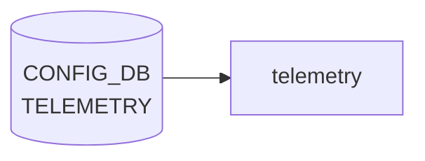

# TELEMETRY テーブル

## 概要

gRPC ストリーミングテレメトリ / [gNMI](../../reference/glossary.md#term-gnmi) サーバの設定。TLS 証明書パスと [gNMI](../../reference/glossary.md#term-gnmi) ランタイムオプションを保持する[^1]。`telemetry` コンテナ (`docker-telemetry`、`docker-gnmi`) が起動時に [CONFIG_DB](../../reference/glossary.md#term-config_db) を読み込む。

<!-- cdb-mermaid -->
### データフロー (自動生成)



!!! note "凡例"
    CONFIG_DB から SAI までの典型経路を `docs/reference/config-db-orch-map.md` から機械生成したミニ図。詳細・例外は本ページ本文と対応表を参照。
<!-- /cdb-mermaid -->

## key 構造

```text
TELEMETRY|certs        # TLS 証明書
TELEMETRY|gnmi         # gNMI サーバオプション
```

## TELEMETRY|certs

| フィールド | 型 | 説明 |
|-----------|----|------|
| `ca_crt` | string (`*.cer` パス) | CA 証明書のローカルパス |
| `server_crt` | string (`*.cer`) | サーバ証明書 |
| `server_key` | string (`*.key`) | サーバ秘密鍵 |

## TELEMETRY|gnmi

| フィールド | 型 | 説明 |
|-----------|----|------|
| `client_auth` | boolean | クライアント認証要求 |
| `log_level` | uint8 (0..100) | [gNMI](../../reference/glossary.md#term-gnmi) ログレベル |
| `port` | inet:port-number | gNMI 待受 TCP ポート |
| `save_on_set` | boolean | `Set` RPC 完了時に config 永続化 |
| `enable_crl` | boolean | CRL (Certificate Revocation List) 有効化 |
| `crl_expire_duration` | uint32 | CRL キャッシュ期限 [秒] |
| `user_auth` | string `password`/`jwt`/`cert`/`none` | ユーザ認証方式 |

## 購読者

- `telemetry` (`docker-telemetry`) / `gnmi` (`docker-gnmi`): プロセス起動時にこのテーブルを読む

## 関連 CONFIG_DB / YANG / CLI

- 関連 [CONFIG_DB](../../reference/glossary.md#term-config_db): `GNMI_CLIENT_CERT` (gNMI クライアント証明書 fingerprint)
- 関連 CLI: `config telemetry config-db`、`config telemetry server`、`gnoi-system reboot` 等
- 関連 [YANG](../../reference/glossary.md#term-yang): `sonic-telemetry`、`sonic-gnmi`

<!-- ref-triangle:start -->

## 関連リファレンス

- [YANG](../../reference/glossary.md#term-yang): `sonic-telemetry`
- CLI: `config telemetry`

<!-- ref-triangle:end -->

## 引用元

[^1]: [YANG](../../reference/glossary.md#term-yang) 定義: `sonic-telemetry.yang`. <https://github.com/sonic-net/sonic-buildimage/blob/9ea932ec2e18f35e58268ec2e4456b1d4afd65cd/src/sonic-yang-models/yang-models/sonic-telemetry.yang>

<!-- topics-back-ref -->
## 関連 Topics

- [Topics: Telemetry / SNMP / Observability](../../topics/09-telemetry-snmp/index.md)

<!-- /topics-back-ref -->

<!-- value-behavior -->
## 値依存挙動マトリクス

### `user_auth` (string pattern): `password` / `jwt` / `cert` / `none`

### `client_auth` (boolean): `true` / `false`

### `save_on_set` (boolean): `true` / `false`

### `enable_crl` (boolean): `true` / `false`

| フィールド | 値 | 挙動 |
|-----------|-----|-----|
| `user_auth` | `password` | ユーザ名/パスワード認証 |
| `user_auth` | `jwt` | JWT トークン認証 |
| `user_auth` | `cert` | クライアント証明書認証 |
| `user_auth` | `none` | 認証なし |
| `client_auth` | `true` | `ca_crt` 未設定/ファイル不在だとサーバ起動失敗 |
| `client_auth` | `false` | サーバ証明書のみで TLS 接続 |
| `save_on_set` | `true` | gNMI Set RPC 完了時に `config save` を実行 |
| `save_on_set` | `false` | Set は [CONFIG_DB](../../reference/glossary.md#term-config_db) のみに反映。永続化しない |
| `enable_crl` | `true` | CRL チェック有効化。`crl_expire_duration` も設定が必要 |
| `port` | 未設定 / `0` | `unix_socket` も未設定の場合サーバ起動失敗 |
| 全フィールド | 起動後変更 | コンテナ再起動 (`systemctl restart telemetry`) まで反映されない |

<!-- /value-behavior -->

<!-- cdb-exceptions -->
## 例外条件・特殊挙動

<!-- evidence: sonic-gnmi/gnmi_server/server.go@eb635b7679b260c3fd0786a6d0734fc8e82c9a22 L381-643 -->

- **起動時のみ参照**: `telemetry` コンテナは起動時に CONFIG_DB を一回読み込む。実行中の変更はコンテナ再起動（`systemctl restart telemetry`）なしには反映されない。
- **ポート未設定でサーバ不起動**: `port` が 0 以下かつ `unix_socket` も未設定の場合、`"no listener configured: port must be > 0 or unix_socket must be set"` を返してサーバが起動しない。
- **TCP / UDS リスナー失敗時の縮退動作**: TCP listen 失敗時は `"Failed to open listener port <port>: disabling TCP listener"` を Warningf し UDS のみで継続（その逆も同様）。両方失敗した場合はサーバ起動エラーになる。
- **TLS 証明書の不整合**: `server_crt` / `server_key` のいずれか一方のみ設定されていると `"server certificate or key file path is empty"` を返す。証明書ファイルが存在しない場合も stat エラーを返してサーバが起動しない。
- **CA 証明書ファイル不在**: mTLS 設定時に `ca_crt` パスが存在しない場合 `"CA certificate file not found"` を返す。

<!-- /cdb-exceptions -->

<!-- ops-hint -->
## 運用ヒント

### 典型値

- key 形式: `TELEMETRY|<key>` (`gnmi`, `certs` 等)`。
- `port`: `8080`/`50051`、`client_auth`: `true`、`log_level`: `2`。

### よくある誤設定

- client_auth=true なのに CA bundle 設定漏れで gNMI client が TLS handshake に失敗する。

### 確認コマンド

```bash
sonic-db-cli CONFIG_DB keys 'TELEMETRY|*'
systemctl status telemetry
```
<!-- /ops-hint -->


<!-- derivation -->
## 派生・条件付き登録 (Phase 6/7)

### Phase 6: 自動派生

telemetry サービスが `server_crt` / `server_key` フィールドの有無から TLS 有効/無効を自動決定する。`client_auth` フィールド値から認証モード（JWT / cert / なし）を自動設定する。

### Phase 7: 条件付き登録 (add_manager 条件)

telemetry サービスが有効の場合のみ `TELEMETRY` テーブルを消費する sonic-gnmi が動作する。`TELEMETRY|gnmi` エントリのみ処理するシングルトン制約あり（YANG で強制）。

<!-- /derivation -->

<!-- handler-branching -->
### Phase 8: Handler メソッド内分岐

| Handler | 分岐条件 | 効果 | evidence |
|---|---|---|---|
| `telemetry` | `server_crt` / `server_key` フィールドあり | TLS 有効で gNMI サーバー起動 | `telemetry` |
| `telemetry` | TLS 設定なし | 平文または insecure モードで起動 | `telemetry` |
| `telemetry` | `client_auth==jwt` | JWT 認証ミドルウェアを有効化 | `telemetry` |
| `telemetry` | `client_auth==cert` | クライアント証明書認証を有効化 | `telemetry` |
| `telemetry` | `allow_no_client_auth==true` | mTLS を強制しない | `telemetry` |
| `telemetry` | `log_level` 変化 | ランタイムログレベルを変更 | `telemetry` |

> **スキャン証跡**: `TELEMETRY` は gNMI/gRPC サーバー設定のシングルトン。TLS フィールド有無と `client_auth` 値が起動モードを決定する主要分岐。

<!-- /handler-branching -->

<!-- runtime-trace -->
## CDB → 実コンテナ動作トレース

### 段階 1: Consumer 登録

- **gnmi-telemetry / sonic-gnmi**: `TELEMETRY` テーブルを `ConfigDBConnector` で購読してグローバル設定を適用。

### 段階 2: CFG → APPL 翻訳

- gnmi-telemetry がサーバポート / TLS 証明書 / 認証設定を読み込みリッスンを開始。
- APP_DB への書き込みなし。

### 段階 3: APPL → SAI

- SAI 経由なし。gNMI サーバが DATA_DB / STATE_DB を購読してデータを提供。

### 段階 4: タイミング + 副作用

- 設定変更は gnmi-telemetry 再起動後に有効 (数秒)。クライアントは再接続が必要。

<!-- /runtime-trace -->
<!-- entry-points -->
## 書き込み入り口 (Direction A)

TELEMETRY テーブルへの書き込みが発生するコード経路を網羅的に調査した結果。

### CLI

  - 専用 CLI なし — minigraph または手動 `config load` 経由

### minigraph / sonic-cfggen

**minigraph.py** が TELEMETRY エントリを生成 (sonic-buildimage/src/sonic-config-engine/minigraph.py)

### REST / gNMI

REST/gNMI 書き込み経路なし

### db_migrator

db_migrator.py での TELEMETRY マイグレーションなし

### ビルド時デフォルト (build-time default)

**`dockers/docker-sonic-telemetry/telemetry_vars.j2`** が TELEMETRY テーブルを参照して設定を生成 (読み取り側)

### ハードコードデフォルト / ランタイム注入

なし

### 死活・デッドコード

なし
<!-- /entry-points -->

<!-- defaults -->
## フィールドデフォルト (コード由来)

### TELEMETRY|gnmi

| フィールド | デフォルト値 | 設定元 | 備考 |
|-----------|-------------|--------|------|
| `port` | `50051` (minigraph 注入) / `8080` (gnmi キー未存在時) | `minigraph.py` L2680; `telemetry.sh` L85 | gnmi キー自体が CONFIG_DB にない場合 `telemetry.sh` が `8080` にフォールバック |
| `client_auth` | `"true"` (minigraph 注入) / 未設定 → `false` 扱い | `minigraph.py` L2679; `telemetry.sh` L96 | 空または `"false"` のとき `--allow_no_client_auth` を付与して起動 |
| `log_level` | `2` | `minigraph.py` L2681; `telemetry.sh` L104 | 非数値 or 未設定なら `-v=2` にフォールバック |
| `save_on_set` | 未設定（= 無効） | `telemetry.sh` L107 コメント | 明示的に `"true"` を設定した場合のみ有効化 |
| `enable_crl` | 未設定（= 無効） | `telemetry.sh` L150 | `user_auth=cert` かつ `enable_crl=true` のときのみ `--enable_crl` フラグを渡す |
| `crl_expire_duration` | 未設定（gnmiサーバ組み込み値を使用） | `telemetry.sh` L155 | 値がある場合のみ `--crl_expire_duration` を渡す |
| `user_auth` | 未設定（= 認証なし） | `telemetry.sh` L142 | 未設定 / `null` のとき `--client_auth` 引数が渡されない |

> **隠れデフォルト（YANG 未定義）**: `threshold=100`、`idle_conn_duration=5`（秒）は YANG に定義がなく `telemetry.sh` のみで管理される（L121, L134）。

### TELEMETRY|certs

| フィールド | デフォルト値 | 設定元 |
|-----------|-------------|--------|
| `server_crt` | `/etc/sonic/telemetry/streamingtelemetryserver.cer` | `minigraph.py` L2684 |
| `server_key` | `/etc/sonic/telemetry/streamingtelemetryserver.key` | `minigraph.py` L2685 |
| `ca_crt` | `/etc/sonic/telemetry/dsmsroot.cer` | `minigraph.py` L2686 |

> YANG (`sonic-telemetry.yang`) には `default` 文が一切定義されていない。すべてのデフォルトはランタイム側（`telemetry.sh` / `minigraph.py`）で実装される。

<!-- /defaults -->

<!-- ordering -->
## 起動順序・順序依存 (Phase B)

### 前提: FEATURE テーブル有効化

`docker-telemetry-entry.sh` はコンテナ起動直後に `FEATURE|telemetry.state` を 10 秒ごとにポーリングし、`enabled` になるまで supervisord を起動しない。`TELEMETRY` テーブルを設定する前に `FEATURE|telemetry.state = "enabled"` が [CONFIG_DB](../../reference/glossary.md#term-config_db) に存在していること（minigraph.py による自動生成フローでは保証済み）。

> evidence: `dockers/docker-sonic-telemetry/docker-telemetry-entry.sh:39-48`

### systemd 依存順 (telemetry.service.j2)

```
database.service ──┐
swss.service ──────┤ After= / Requires=  →  telemetry.service 起動
syncd.service ──────┘
sonic.target ──────────────────────────────→  After=sonic.target
```

`database.service` (Redis / [CONFIG_DB](../../reference/glossary.md#term-config_db)) が Ready になった後に telemetry が起動するため、CONFIG_DB が未起動の状態で `TELEMETRY` テーブルを読もうとすることはない。

> evidence: `files/build_templates/telemetry.service.j2:3-4`

### supervisord 内部起動順 (supervisord.conf)

| 優先度 | プロセス | 待機条件 |
|--------|---------|---------|
| 1 | `rsyslogd` | — |
| 2 | `start` (`start.sh`) | `rsyslogd:running` |
| 3 | `telemetry` (`telemetry.sh`) | `start:exited` |
| 4 | `dialout` (`dialout.sh`) | `telemetry:running` |

`telemetry.sh` は `start.sh` の正常終了後に起動する。`dialout` (gRPC dial-out ストリーミング) はgNMI サーバが listen 状態になってから起動するため、`TELEMETRY` 設定不整合でサーバが起動失敗した場合 `dialout` も起動しない。

> evidence: `dockers/docker-sonic-telemetry/supervisord.conf:31-68`

### 起動時一括読み込み — runtime 変更は再起動まで無効

`telemetry.sh` は起動時に `sonic-cfggen -d -t telemetry_vars.j2` で `TELEMETRY|certs` / `TELEMETRY|gnmi` / `DEVICE_METADATA|x509` を**一括読み込み**し、起動引数として gnmi_server バイナリに渡す。起動後に [CONFIG_DB](../../reference/glossary.md#term-config_db) を変更しても gnmi_server プロセスには反映されない。

```bash
# 設定変更を反映させる場合
systemctl restart telemetry
```

> evidence: `dockers/docker-sonic-telemetry/telemetry.sh:40-43`

### TLS 証明書ファイルは起動前に配置必須

`gnmi_server/server.go` の `SrvAdvConfig()` は `os.Stat()` で `server_crt` / `server_key` / `ca_crt` の存在を確認し、ファイル不在ならサーバが起動しない。`TELEMETRY|certs` を設定する際は証明書ファイルの実ファイル配置も同時に行うこと。

> evidence: `gnmi_server/server.go:398-418` (`SrvAdvConfig`)

### cert 認証時: GNMI_CLIENT_CERT テーブルを先に書く

`user_auth=cert` を設定すると telemetry サーバは `GNMI_CLIENT_CERT` テーブルを参照してクライアント証明書の fingerprint チェックを行う。`GNMI_CLIENT_CERT` エントリが存在しない状態で `user_auth=cert` に切り替えると、サーバ起動後にすべての接続が認証失敗となる。設定変更の順序は `GNMI_CLIENT_CERT` → `TELEMETRY|gnmi.user_auth=cert` → サーバ再起動。

> evidence: `dockers/docker-sonic-telemetry/telemetry.sh:146-149`

### 順序依存サマリ

| # | 依存関係 | 方向 | 緩和策 |
|---|----------|------|--------|
| 1 | `FEATURE\|telemetry.state=enabled` → telemetry コンテナ起動 | 先行必須（未設定は 10s ポーリング） | minigraph フローでは自動保証 |
| 2 | `database.service` ready → telemetry.service 起動 | systemd `After=` 強制 | Redis 未起動での起動は不可 |
| 3 | `start.sh` 終了 → `telemetry.sh` 実行 | supervisord `dependent_startup` 強制 | FEATURE チェック完了が保証される |
| 4 | `TELEMETRY` 全設定書き込み → `telemetry.sh` 実行（一括読み込み） | 起動時一括読み込みのため先行必須 | runtime 変更は `systemctl restart telemetry` で反映 |
| 5 | TLS 証明書ファイル配置 → `server_crt`/`server_key`/`ca_crt` 設定 | ファイル存在確認が先行必須 | 空の場合は `--insecure` フォールバック |
| 6 | `GNMI_CLIENT_CERT` エントリ → `user_auth=cert` 設定 | 推奨先行（欠如時は接続認証失敗） | サーバ再起動必須 |
| 7 | `DEVICE_METADATA\|x509` → `TELEMETRY\|certs` 未設定時 legacy フォールバック | どちらも未設定なら `--noTLS` 起動 | 設計上の縮退動作 |

<!-- /ordering -->

<!-- glossary-links-injected: 896d391185a9 -->
