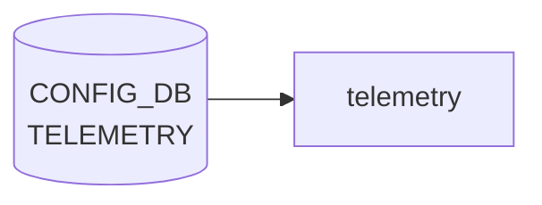

# TELEMETRY テーブル

## 概要

gRPC ストリーミングテレメトリ / [gNMI](../../reference/glossary.md#term-gnmi) サーバの設定。TLS 証明書パスと [gNMI](../../reference/glossary.md#term-gnmi) ランタイムオプションを保持する[^1]。`telemetry` コンテナ (`docker-telemetry`、`docker-gnmi`) が起動時に [CONFIG_DB](../../reference/glossary.md#term-config_db) を読み込む。

<!-- cdb-mermaid -->
### データフロー (自動生成)



!!! note "凡例"
    CONFIG_DB から SAI までの典型経路を `docs/reference/config-db-orch-map.md` から機械生成したミニ図。詳細・例外は本ページ本文と対応表を参照。
<!-- /cdb-mermaid -->

## key 構造

```text
TELEMETRY|certs        # TLS 証明書
TELEMETRY|gnmi         # gNMI サーバオプション
```

## TELEMETRY|certs

| フィールド | 型 | 説明 |
|-----------|----|------|
| `ca_crt` | string (`*.cer` パス) | CA 証明書のローカルパス |
| `server_crt` | string (`*.cer`) | サーバ証明書 |
| `server_key` | string (`*.key`) | サーバ秘密鍵 |

## TELEMETRY|gnmi

| フィールド | 型 | 説明 |
|-----------|----|------|
| `client_auth` | boolean | クライアント認証要求 |
| `log_level` | uint8 (0..100) | [gNMI](../../reference/glossary.md#term-gnmi) ログレベル |
| `port` | inet:port-number | gNMI 待受 TCP ポート |
| `save_on_set` | boolean | `Set` RPC 完了時に config 永続化 |
| `enable_crl` | boolean | CRL (Certificate Revocation List) 有効化 |
| `crl_expire_duration` | uint32 | CRL キャッシュ期限 [秒] |
| `user_auth` | string `password`/`jwt`/`cert`/`none` | ユーザ認証方式 |

## 購読者

- `telemetry` (`docker-telemetry`) / `gnmi` (`docker-gnmi`): プロセス起動時にこのテーブルを読む

## 関連 CONFIG_DB / YANG / CLI

- 関連 [CONFIG_DB](../../reference/glossary.md#term-config_db): `GNMI_CLIENT_CERT` (gNMI クライアント証明書 fingerprint)
- 関連 CLI: `config telemetry config-db`、`config telemetry server`、`gnoi-system reboot` 等
- 関連 [YANG](../../reference/glossary.md#term-yang): `sonic-telemetry`、`sonic-gnmi`

<!-- ref-triangle:start -->

## 関連リファレンス

- [YANG](../../reference/glossary.md#term-yang): `sonic-telemetry`
- CLI: `config telemetry`

<!-- ref-triangle:end -->

## 引用元

[^1]: [YANG](../../reference/glossary.md#term-yang) 定義: `sonic-telemetry.yang`. <https://github.com/sonic-net/sonic-buildimage/blob/9ea932ec2e18f35e58268ec2e4456b1d4afd65cd/src/sonic-yang-models/yang-models/sonic-telemetry.yang>

<!-- topics-back-ref -->
## 関連 Topics

- [Topics: Telemetry / SNMP / Observability](../../topics/09-telemetry-snmp/index.md)

<!-- /topics-back-ref -->

<!-- ops-hint -->
## 運用ヒント

### 典型値

- key 形式: `TELEMETRY|<key>` (`gnmi`, `certs` 等)`。
- `port`: `8080`/`50051`、`client_auth`: `true`、`log_level`: `2`。

### よくある誤設定

- client_auth=true なのに CA bundle 設定漏れで gNMI client が TLS handshake に失敗する。

### 確認コマンド

```bash
sonic-db-cli CONFIG_DB keys 'TELEMETRY|*'
systemctl status telemetry
```
<!-- /ops-hint -->

<!-- glossary-links-injected: 41d5238b3a97 -->
