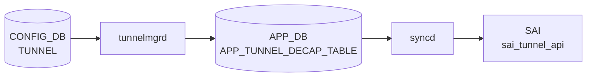

# TUNNEL_DECAP_TABLE

!!! warning "YANG 未定義"
    `TUNNEL_DECAP_TABLE` は CONFIG_DB ではなく **APPL_DB / STATE_DB** のテーブルであり、`sonic-yang-models` には対応モジュールが存在しない。本ページは `schema.h` のテーブル名定数と `tunneldecaporch.cpp` の実装からフィールドを起こしたもの。CONFIG_DB に同名テーブルを直接書くことは想定されていない。

## 概要

`tunneldecaporch` が消費する **アプリケーション層テーブル**。[CONFIG_DB](../../reference/glossary.md#term-config_db) の [`TUNNEL`](./tunnel.md) を `tunnelmgrd` が [APPL_DB](../../reference/glossary.md#term-appl_db) に投影する形で生成され、[SAI](../../reference/glossary.md#term-sai) tunnel/tunnel-term オブジェクトに反映される[^1]。[STATE_DB](../../reference/glossary.md#term-state_db) にも同名のミラーがある。

<!-- cdb-mermaid -->
### データフロー (自動生成)



!!! note "凡例"
    CONFIG_DB から SAI までの典型経路を `docs/reference/config-db-orch-map.md` から機械生成したミニ図。詳細・例外は本ページ本文と対応表を参照。
<!-- /cdb-mermaid -->

## DB / key

```
APPL_DB:   TUNNEL_DECAP_TABLE:<tunnel_name>
STATE_DB:  TUNNEL_DECAP_TABLE|<tunnel_name>
APPL_DB:   TUNNEL_DECAP_TERM_TABLE:<tunnel_name>:<dst_ip>   # 終端 IP の管理用 sub テーブル
```

テーブル名定数は `schema.h` の `APP_TUNNEL_DECAP_TABLE_NAME` / `APP_TUNNEL_DECAP_TERM_TABLE_NAME` / `STATE_TUNNEL_DECAP_TABLE_NAME` / `STATE_TUNNEL_DECAP_TERM_TABLE_NAME`[^2]。

## フィールド

| フィールド | 型 | 説明 |
|-----------|----|------|
| `tunnel_type` | string `IPINIP` | カプセル化種別。それ以外はエラー |
| `src_ip` | IPv4 アドレス | トンネル送信元 IP |
| `dst_ip` | IPv4 アドレスのカンマ区切りリスト | 終端 IP 群（`TUNNEL_DECAP_TERM_TABLE` で個別管理） |
| `dscp_mode` | string `uniform`/`pipe` | DSCP 継承 |
| `ecn_mode` | string `copy_from_outer`/`standard` | ECN モード（create-only） |
| `encap_ecn_mode` | string `standard` | カプセル時 ECN |
| `ttl_mode` | string `uniform`/`pipe` | TTL モード |
| `decap_dscp_to_tc_map` | string | DSCP→TC マップ名（OID 解決） |
| `decap_tc_to_pg_map` | string | TC→PG マップ名 |
| `encap_tc_to_dscp_map` | string | TC→DSCP マップ名 |
| `encap_tc_to_queue_map` | string | TC→Queue マップ名 |

## 制約

- `tunnel_type` は `IPINIP` のみ受け入れる（`tunneldecaporch.cpp` でハードコード）
- `ecn_mode` は [SAI](../../reference/glossary.md#term-sai) `SAI_TUNNEL_ATTR_DECAP_ECN_MODE` が create-only のため、生成後の更新はスキップされる旨が WARN ログで残る

## 購読者

- `tunneldecaporch` ([orchagent](../../reference/glossary.md#term-orchagent)): [SAI](../../reference/glossary.md#term-sai) tunnel / tunnel-term オブジェクト作成
- `STATE_DB` 側はモニタリング用ミラー

## 関連 CONFIG_DB / YANG / CLI

- 関連 [CONFIG_DB](../../reference/glossary.md#term-config_db): [`TUNNEL`](./tunnel.md)（[CONFIG_DB](../../reference/glossary.md#term-config_db) 側のソース）
- 関連 [YANG](../../reference/glossary.md#term-yang): なし
- 関連 CLI: なし（テーブルは内部）

<!-- ref-triangle:start -->

## 関連リファレンス

- (関連リンクなし)

<!-- ref-triangle:end -->

## 引用元

[^1]: tunneldecaporch 実装: `tunneldecaporch.cpp`. <https://github.com/sonic-net/sonic-swss/blob/4305596156d70e9797e8a881b3d19b46de0bce0d/orchagent/tunneldecaporch.cpp>
[^2]: テーブル名定数: `schema.h`. <https://github.com/sonic-net/sonic-swss-common/blob/158de8d3463ff4b841653f6d57190bb142b80d9c/common/schema.h#L49-L50>

<!-- ops-hint -->
## 運用ヒント

### 典型値

- key 形式: `TUNNEL_DECAP_TABLE|<tunnel-name>`。
- `tunnel_type`: `IPINIP` / `VXLAN`、`dst_ip`: 自 Loopback、`ttl_mode`/`dscp_mode`: `uniform`。

### よくある誤設定

- dst_ip を物理 IF アドレスに向けてしまい、IF down で decap も停止する。Loopback を使う。

### 確認コマンド

```bash
sonic-db-cli CONFIG_DB keys 'TUNNEL_DECAP_TABLE|*'
```
<!-- /ops-hint -->

<!-- glossary-links-injected: 6f36db8074ad -->
