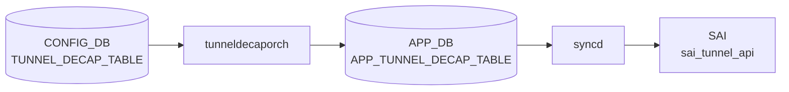
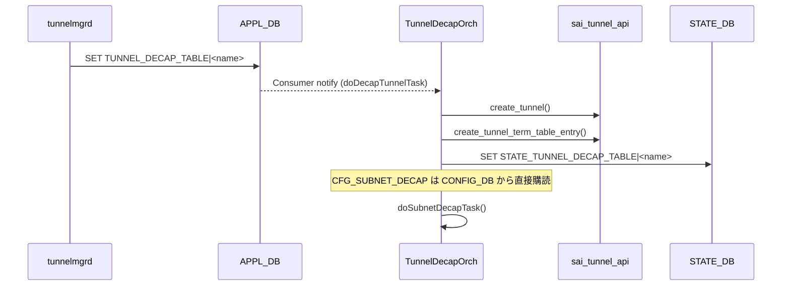

# TUNNEL_DECAP_TABLE

!!! warning "YANG 未定義"
    `TUNNEL_DECAP_TABLE` は CONFIG_DB ではなく **APPL_DB / STATE_DB** のテーブルであり、`sonic-yang-models` には対応モジュールが存在しない。本ページは `schema.h` のテーブル名定数と `tunneldecaporch.cpp` の実装からフィールドを起こしたもの。CONFIG_DB に同名テーブルを直接書くことは想定されていない。

## 概要

`tunneldecaporch` が消費する **アプリケーション層テーブル**。[CONFIG_DB](../../reference/glossary.md#term-config_db) の [`TUNNEL`](./tunnel.md) を `tunnelmgrd` が [APPL_DB](../../reference/glossary.md#term-appl_db) に投影する形で生成され、[SAI](../../reference/glossary.md#term-sai) tunnel/tunnel-term オブジェクトに反映される[^1]。[STATE_DB](../../reference/glossary.md#term-state_db) にも同名のミラーがある。

<!-- cdb-mermaid -->
### データフロー (自動生成)



!!! note "凡例"
    CONFIG_DB から SAI までの典型経路を `docs/reference/config-db-orch-map.md` から機械生成したミニ図。詳細・例外は本ページ本文と対応表を参照。
<!-- /cdb-mermaid -->

## DB / key

```yaml
APPL_DB:   TUNNEL_DECAP_TABLE:<tunnel_name>
STATE_DB:  TUNNEL_DECAP_TABLE|<tunnel_name>
APPL_DB:   TUNNEL_DECAP_TERM_TABLE:<tunnel_name>:<dst_ip>   # 終端 IP の管理用 sub テーブル
```

テーブル名定数は `schema.h` の `APP_TUNNEL_DECAP_TABLE_NAME` / `APP_TUNNEL_DECAP_TERM_TABLE_NAME` / `STATE_TUNNEL_DECAP_TABLE_NAME` / `STATE_TUNNEL_DECAP_TERM_TABLE_NAME`[^2]。

## フィールド

| フィールド | 型 | 説明 |
|-----------|----|------|
| `tunnel_type` | string `IPINIP` | カプセル化種別。それ以外はエラー |
| `src_ip` | IPv4 アドレス | トンネル送信元 IP |
| `dst_ip` | IPv4 アドレスのカンマ区切りリスト | 終端 IP 群（`TUNNEL_DECAP_TERM_TABLE` で個別管理） |
| `dscp_mode` | string `uniform`/`pipe` | [DSCP](../../reference/glossary.md#term-dscp) 継承 |
| `ecn_mode` | string `copy_from_outer`/`standard` | ECN モード（create-only） |
| `encap_ecn_mode` | string `standard` | カプセル時 ECN |
| `ttl_mode` | string `uniform`/`pipe` | TTL モード |
| `decap_dscp_to_tc_map` | string | [DSCP](../../reference/glossary.md#term-dscp)→TC マップ名（OID 解決） |
| `decap_tc_to_pg_map` | string | TC→PG マップ名 |
| `encap_tc_to_dscp_map` | string | TC→[DSCP](../../reference/glossary.md#term-dscp) マップ名 |
| `encap_tc_to_queue_map` | string | TC→Queue マップ名 |

## 制約

- `tunnel_type` は `IPINIP` のみ受け入れる（`tunneldecaporch.cpp` でハードコード）
- `ecn_mode` は [SAI](../../reference/glossary.md#term-sai) `SAI_TUNNEL_ATTR_DECAP_ECN_MODE` が create-only のため、生成後の更新はスキップされる旨が WARN ログで残る

## 購読者

- `tunneldecaporch` ([orchagent](../../reference/glossary.md#term-orchagent)): [SAI](../../reference/glossary.md#term-sai) tunnel / tunnel-term オブジェクト作成
- `STATE_DB` 側はモニタリング用ミラー

## 関連 CONFIG_DB / YANG / CLI

- 関連 [CONFIG_DB](../../reference/glossary.md#term-config_db): [`TUNNEL`](./tunnel.md)（[CONFIG_DB](../../reference/glossary.md#term-config_db) 側のソース）
- 関連 [YANG](../../reference/glossary.md#term-yang): なし
- 関連 CLI: なし（テーブルは内部）

<!-- ref-triangle:start -->

## 関連リファレンス

- (関連リンクなし)

<!-- ref-triangle:end -->

## 引用元

[^1]: tunneldecaporch 実装: `tunneldecaporch.cpp`. <https://github.com/sonic-net/sonic-swss/blob/4305596156d70e9797e8a881b3d19b46de0bce0d/orchagent/tunneldecaporch.cpp>
[^2]: テーブル名定数: `schema.h`. <https://github.com/sonic-net/sonic-swss-common/blob/158de8d3463ff4b841653f6d57190bb142b80d9c/common/schema.h#L49-L50>

<!-- value-behavior -->
## 値依存挙動マトリクス

`tunnel_type` / `dscp_mode` / `ecn_mode` / `ttl_mode` は [YANG](../../reference/glossary.md#term-yang) 未定義 ([APPL_DB](../../reference/glossary.md#term-appl_db) テーブル) のため string 型。制約は `tunneldecaporch.cpp` のコード判定。

| フィールド | 値 | 挙動 |
|-----------|-----|-----|
| `tunnel_type` | `IPINIP` | SAI tunnel + tunnel-term オブジェクトを作成 |
| `tunnel_type` | `IPINIP` 以外 | LOG_ERROR してエントリをスキップ |
| `dscp_mode` | `uniform` | 外側 DSCP を内側にコピー |
| `dscp_mode` | `pipe` | 内側 DSCP を保持 |
| `dscp_mode` | 上記以外 | LOG_ERROR してエントリをスキップ |
| `ecn_mode` | `copy_from_outer` | 外側 ECN を内側にコピー |
| `ecn_mode` | `standard` | RFC 6040 ECN 処理 |
| `encap_ecn_mode` | `standard` 以外 | LOG_ERROR して拒否 |
| `ecn_mode` | 作成後に変更 | SAI create-only 属性のため変更スキップ (WARN ログ) |
| `ttl_mode` | `uniform` | 外側 TTL を内側にコピー |
| `ttl_mode` | `pipe` | 内側 TTL を保持 |
| `src_ip` | 作成後に変更 | LOG_ERROR して拒否。削除→再作成が必要 |

<!-- /value-behavior -->

<!-- cdb-exceptions -->
## 例外条件・特殊挙動

<!-- evidence: sonic-swss/orchagent/tunneldecaporch.cpp@4305596156d70e9797e8a881b3d19b46de0bce0d L51-697 -->

- **`src_ip` の変更不可**: 既存トンネルの `src_ip` を変更しようとすると `"cannot modify src ip for existing tunnel"` を LOG_ERROR して拒否する。変更するにはトンネルを削除して再作成する必要がある。
- **無効な tunnel_type / dscp_mode / ecn_mode / ttl_mode**: 有効値以外の文字列が来ると `"Invalid tunnel type/dscp mode/ecn mode/ttl mode <value>"` を LOG_ERROR してエントリをスキップする。
- **encap_ecn_mode は `standard` のみ対応**: `ecn_mode` が `standard` 以外の場合 `"Only standard encap ecn mode is supported currently"` を LOG_ERROR して拒否。
- **存在しないトンネルの DEL**: 未作成のトンネルへの DEL は `"Tunnel <key> cannot be removed since it doesn't exist."` を LOG_ERROR する。
- **subnet decap 制約**: subnet decap の decap term は `MP2MP` タイプのトンネルにのみ許可される。`src_ip` / `src_ip_v6` なしで subnet decap term を追加しようとするとそれぞれ `"no source IP is provided."` を LOG_ERROR。
- **subnet decap 無効時の decap term**: `subnet_decap` が無効な状態で decap term を追加しようとすると `"subnet decap is disabled, ignored."` を LOG_ERROR してスキップ。
- **[ASIC_DB](../../reference/glossary.md#term-asic_db) 操作失敗**: トンネルや decap term の [ASIC_DB](../../reference/glossary.md#term-asic_db) 追加/削除が失敗するとそれぞれエラーを LOG_ERROR する。

<!-- /cdb-exceptions -->

<!-- ops-hint -->
## 運用ヒント

### 典型値

- key 形式: `TUNNEL_DECAP_TABLE|<tunnel-name>`。
- `tunnel_type`: `IPINIP` / `VXLAN`、`dst_ip`: 自 Loopback、`ttl_mode`/`dscp_mode`: `uniform`。

### よくある誤設定

- dst_ip を物理 IF アドレスに向けてしまい、IF down で decap も停止する。Loopback を使う。

### 確認コマンド

```bash
sonic-db-cli CONFIG_DB keys 'TUNNEL_DECAP_TABLE|*'
```
<!-- /ops-hint -->


<!-- derivation -->
## 派生・条件付き登録 (Phase 6/7)

### Phase 6: 自動派生

tunneldecaporch が `src_ip` フィールドの有無から SAI term entry type を自動決定する。`src_ip` あり → `SAI_TUNNEL_TERM_TABLE_ENTRY_TYPE_P2P`、なし → `SAI_TUNNEL_TERM_TABLE_ENTRY_TYPE_P2MP`。`dscp_mode` / `ttl_mode` の値が SAI enum に自動変換される。

### Phase 7: 条件付き登録 (add_manager 条件)

tunneldecaporch は常時登録し `TUNNEL_DECAP_TABLE` テーブルを無条件購読する。SAI tunnel capability 未サポートの場合は SAI 属性設定がエラーになるがログのみで継続。

<!-- /derivation -->

<!-- handler-branching -->
### Phase 8: Handler メソッド内分岐

| Handler | 分岐条件 | 効果 | evidence |
|---|---|---|---|
| `tunneldecaporch` | `tunnel_type==IPINIP` | SAI_TUNNEL_TYPE_IPINIP を使用 | `tunnelorch.cpp` |
| `tunneldecaporch` | `tunnel_type==VXLAN` | SAI_TUNNEL_TYPE_VXLAN を使用 | `tunnelorch.cpp` |
| `tunneldecaporch` | `dscp_mode==pipe` | pipe model で DSCP を設定 | `tunnelorch.cpp` |
| `tunneldecaporch` | `dscp_mode==uniform` | uniform model で DSCP を伝播 | `tunnelorch.cpp` |
| `tunneldecaporch` | `src_ip` あり | P2P term entry 作成 | `tunnelorch.cpp` |
| `tunneldecaporch` | `src_ip` なし | P2MP term entry 作成 (any source) | `tunnelorch.cpp` |
| `tunneldecaporch` | del_handler | SAI tunnel + term entry を削除 | `tunnelorch.cpp` |

> **スキャン証跡**: `TUNNEL_DECAP_TABLE` は IP-in-IP/VXLAN デカプセルトンネルの termination 設定。`src_ip` の有無が P2P/P2MP を自動決定する点が主要 Phase 6 派生。

<!-- /handler-branching -->

<!-- runtime-trace -->
## CDB → 実コンテナ動作トレース

### 段階 1: Consumer 登録

- **orchagent / TunnelDecapOrch** (`sonic-swss/orchagent/tunneldecaporch.cpp`): `TUNNEL_DECAP_TABLE` を `SubscriberStateTable` で購読。

### 段階 2: CFG → APPL 翻訳

- TunnelDecapOrch がトンネルタイプ (IPINIP) と内側/外側 IP 情報を解析。
- APP_DB への書き込みなし (orchagent → SAI 直接)。

### 段階 3: APPL → SAI

- TunnelDecapOrch が `sai_tunnel_api->create_tunnel()` / `create_tunnel_term_table_entry()` を呼び出し IP-in-IP デカプセルトンネルをハードウェアに設定。

### 段階 4: タイミング + 副作用

- トンネル作成は orchagent 処理後数 ms 以内。
- 副作用: 内側 IP アドレスの重複がある場合 SAI が resource エラーを返す。

<!-- /runtime-trace -->
<!-- entry-points -->
## 書き込み入り口 (Direction A)

TUNNEL_DECAP_TABLE テーブルへの書き込みが発生するコード経路を網羅的に調査した結果。

### CLI

  - 専用 CLI なし — `config load` または minigraph 経由

### minigraph / sonic-cfggen

minigraph.py に TUNNEL_DECAP_TABLE 直接生成なし

### REST / gNMI

REST/gNMI 書き込み経路なし

### db_migrator

**db_migrator.py** が TUNNEL_DECAP_TABLE のマイグレーション処理を実装 (sonic-utilities/scripts/db_migrator.py)

### ビルド時デフォルト (build-time default)

なし

### ハードコードデフォルト / ランタイム注入

なし

### 死活・デッドコード

なし
<!-- /entry-points -->

<!-- pubsub -->
## 通信メカニズム (Phase G)

### CONFIG_DB Consumer 登録

`TunnelDecapOrch` は `orchdaemon.cpp` の初期化フローで以下のように登録される。

```cpp
// orchdaemon.cpp
vector<string> tunnel_tables = {
    APP_TUNNEL_DECAP_TABLE_NAME,         // "TUNNEL_DECAP_TABLE"
    APP_TUNNEL_DECAP_TERM_TABLE_NAME     // "TUNNEL_DECAP_TERM_TABLE"
};
gTunneldecapOrch = new TunnelDecapOrch(m_applDb, m_stateDb, m_configDb, tunnel_tables);
```

コンストラクタ内部では `Orch(appDb, tableNames)` 基底クラスが各テーブルを `Consumer`（`SubscriberStateTable` ラッパー）として自動登録する。  
加えて `CFG_SUBNET_DECAP_TABLE_NAME` を **CONFIG_DB** から明示的に `SubscriberStateTable` + `addExecutor(new Consumer(...))` で購読する。

```cpp
// tunneldecaporch.cpp コンストラクタ
auto cfgSubnetDecapSubTable = new SubscriberStateTable(
    configDb, CFG_SUBNET_DECAP_TABLE_NAME,
    TableConsumable::DEFAULT_POP_BATCH_SIZE, 0);
Orch::addExecutor(new Consumer(cfgSubnetDecapSubTable, this, CFG_SUBNET_DECAP_TABLE_NAME));
```

### Observer / doTask ディスパッチ

`select()` ループが Consumer の通知を受け取ると `TunnelDecapOrch::doTask(Consumer &consumer)` が呼ばれ、テーブル名で分岐する。

| Consumer テーブル | ハンドラ | 購読 DB |
|---|---|---|
| `APP_TUNNEL_DECAP_TABLE_NAME` | `doDecapTunnelTask()` | APPL_DB |
| `APP_TUNNEL_DECAP_TERM_TABLE_NAME` | `doDecapTunnelTermTask()` | APPL_DB |
| `CFG_SUBNET_DECAP_TABLE_NAME` | `doSubnetDecapTask()` | CONFIG_DB |

### SAI tunnel_api 呼び出し

Consumer イベントを処理した後、`TunnelDecapOrch` は **SAI tunnel API** を直接呼び出してハードウェアに反映する。APPL_DB への中間書き込みは行わない（orchagent → SAI 直接経路）。

| SAI 関数 | 用途 |
|---|---|
| `sai_tunnel_api->create_tunnel()` | IP-in-IP デカプセルトンネルオブジェクト作成 |
| `sai_tunnel_api->remove_tunnel()` | トンネルオブジェクト削除 |
| `sai_tunnel_api->create_tunnel_term_table_entry()` | P2P / P2MP decap term エントリ作成 |
| `sai_tunnel_api->remove_tunnel_term_table_entry()` | decap term エントリ削除 |
| `sai_tunnel_api->set_tunnel_attribute()` | QoS マップ等の属性更新 |

### STATE_DB への通知

`TunnelDecapOrch` は SAI 操作成功後に `stateTunnelDecapTable` / `stateTunnelDecapTermTable`（`STATE_TUNNEL_DECAP_TABLE_NAME` / `STATE_TUNNEL_DECAP_TERM_TABLE_NAME`）へ状態を書き込む。これは読み取り専用のモニタリング用ミラーで、他 Orch へのイベント伝播は行わない。

### シーケンス図



> **ソース証跡**: `sonic-swss/orchagent/tunneldecaporch.cpp` L29-48, L51-80; `sonic-swss/orchagent/orchdaemon.cpp` L344-348

<!-- /pubsub -->

<!-- glossary-links-injected: 415c3a53ecc2 -->
