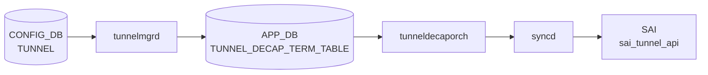

# TUNNEL_DECAP_TERM_TABLE

!!! warning "YANG 未定義"
    `TUNNEL_DECAP_TERM_TABLE` は CONFIG_DB ではなく **APPL_DB / STATE_DB** のテーブルであり、`sonic-yang-models` には対応モジュールが存在しない。本ページは `schema.h` のテーブル名定数と `tunneldecaporch.cpp` / `tunnelmgr.cpp` の実装からフィールドを起こしたもの。

## 概要

`tunneldecaporch` が消費する **アプリケーション層テーブル**。[CONFIG_DB](../../reference/glossary.md#term-config_db) の [`TUNNEL`](./tunnel.md) を `tunnelmgrd` が [APPL_DB](../../reference/glossary.md#term-appl_db) に投影する形で生成される[^1]。subnet decap 機能では `ipinip.json.j2` テンプレートから `swssconfig` が書き込む。`tunneldecaporch` ([orchagent](../../reference/glossary.md#term-orchagent)) が [SAI](../../reference/glossary.md#term-sai) `create_tunnel_term_table_entry()` を呼び出してハードウェアに設定する。

<!-- cdb-mermaid -->
### データフロー (自動生成)



!!! note "凡例"
    CONFIG_DB から SAI までの典型経路。subnet decap の場合は `ipinip.json.j2` → `swssconfig` → APPL_DB の経路も存在する。
<!-- /cdb-mermaid -->

## DB / key

```yaml
APPL_DB:   TUNNEL_DECAP_TERM_TABLE:<tunnel_name>:<dst_ip_prefix>
STATE_DB:  TUNNEL_DECAP_TERM_TABLE|<tunnel_name>|<dst_ip_prefix>
```

テーブル名定数は `schema.h` の `APP_TUNNEL_DECAP_TERM_TABLE_NAME` (L50) / `STATE_TUNNEL_DECAP_TERM_TABLE_NAME` (L489)[^2]。

## フィールド

| フィールド | 型 | 説明 |
|-----------|----|------|
| `term_type` | string `P2P`/`P2MP`/`MP2MP` | トンネル終端エントリのタイプ。省略時の暗黙値は `P2MP` |
| `src_ip` | IP prefix (IPv4/IPv6) | 送信元 IP prefix。`P2MP` では省略可、`P2P` と `MP2MP` (non-subnet) では必須 |
| `subnet_type` | string `vlan`/`vip` | サブネット decap term の種別。通常 P2P/P2MP term では省略する |

## 制約

- `term_type` は `P2P`, `P2MP`, `MP2MP` のいずれかのみ有効
- `P2P` では `src_ip` が必須。なければ `"no source IP is provided."` を LOG_ERROR してスキップ
- `MP2MP` (non-subnet-decap) も `src_ip` が必須
- `subnet_type` が存在する場合は `MP2MP` のみ許可
- subnet decap tunnel (`IPINIP_SUBNET`/`IPINIP_V6_SUBNET`) に対しては `MP2MP` のみ許可

<!-- defaults -->
## フィールドのコード由来デフォルト (Phase A)

### term_type

| 条件 | デフォルト値 | 由来 |
|------|------------|------|
| フィールド省略時 | `P2MP` | `tunneldecaporch.cpp` L361: `TunnelTermType term_type = TUNNEL_TERM_TYPE_P2MP;` |
| CONFIG_DB `TUNNEL` に `src_ip` あり | `P2P` (tunnelmgrd が書き込む) | `tunnelmgr.cpp` L283 |
| CONFIG_DB `TUNNEL` に `src_ip` なし | `P2MP` (tunnelmgrd が書き込む) | `tunnelmgr.cpp` L287 |
| subnet decap term | `MP2MP` (ipinip.json.j2 が書き込む) | `ipinip.json.j2` L117, L183 |

`tunnelmgrd` は常に `term_type` を明示的に書き込むため、省略されるケースは直接 APPL_DB を操作する場合のみ。

### src_ip

| 条件 | デフォルト値 | 由来 |
|------|------------|------|
| `P2MP` term | 省略（フィールドなし） | `tunnelmgr.cpp` L284-288: `src_ip` フィールドを追加しない |
| `P2P` term | 必須（省略不可） | `tunneldecaporch.cpp` L456-459 |
| `MP2MP` subnet decap term | `subnetDecapConfig.src_ip` / `src_ip_v6` から自動注入 | `tunneldecaporch.cpp` L478-500 |
| `MP2MP` non-subnet term | 必須（省略不可） | `tunneldecaporch.cpp` L461-464 |

`P2MP` では `src_ip` が省略されるため、SAI `SAI_TUNNEL_TERM_TABLE_ENTRY_ATTR_SRC_IP` は設定されない (tunneldecaporch.cpp L948-959)。

### subnet_type

| 条件 | デフォルト値 | 由来 |
|------|------------|------|
| 通常 P2P/P2MP term | 省略（フィールドなし） | `tunnelmgr.cpp` で書き込まない |
| VLAN subnet decap | `"vlan"` | `ipinip.json.j2` L119, L185 |
| VIP subnet decap | `"vip"` | `tunneldecaporch.cpp` L428-432 (有効値として定義) |

`subnet_type` は SAI 属性に直接マップされない。orchagent の内部ステート (`TunnelTermEntry.subnet_type`) と STATE_DB に記録される用途のみ。

### SAI 固定デフォルト (常にハードコード)

| SAI 属性 | 値 | 由来 |
|----------|-----|------|
| `SAI_TUNNEL_TERM_TABLE_ENTRY_ATTR_VR_ID` | `gVirtualRouterId` (デフォルト VRF) | `tunneldecaporch.cpp` L921-923 |
| `SAI_TUNNEL_TERM_TABLE_ENTRY_ATTR_TUNNEL_TYPE` | `SAI_TUNNEL_TYPE_IPINIP` | `tunneldecaporch.cpp` L940-942 |
| `SAI_TUNNEL_TERM_TABLE_ENTRY_ATTR_ACTION_TUNNEL_ID` | 対応するトンネルの OID | `tunneldecaporch.cpp` L944-946 |

<!-- /defaults -->

<!-- ordering -->
## 書込み順依存 (Phase B)

TUNNEL_DECAP_TERM_TABLE エントリを書き込む際に守るべき順序制約を実装から導出した。

### 全体ガード

`TunnelDecapOrch::doTask()` の先頭で `gPortsOrch->allPortsReady()` が false の場合、TUNNEL_DECAP_TABLE と TUNNEL_DECAP_TERM_TABLE の両方が即 return される。ports 初期化完了前のエントリはキューに留まり、初期化後に自動再処理される (`tunneldecaporch.cpp` L55-57)。

### 先行必須テーブル (SET 時)

| 依存テーブル / 条件 | 理由 | 緩和策 | evidence |
|---|---|---|---|
| PortsOrch 初期化完了 (`allPortsReady()`) | doTask() 先頭ガード — false なら TERM 処理もスキップ | なし（自動待機） | `tunneldecaporch.cpp` L55-57 |
| `TUNNEL_DECAP_TABLE:<tunnel_name>` SET 済み | `tunnel_exists` が false の場合 `addUnhandledDecapTunnelTerm()` に保留。トンネル本体作成成功後に `processUnhandledDecapTunnelTerms()` で一括再処理 | **前後逆でも自動調停** | `tunneldecaporch.cpp` L511-521, L1497-1520 |
| subnet decap term の場合: `SUBNET_DECAP` で `enable=true` + `src_ip`/`src_ip_v6` 設定済み | `subnetDecapConfig.enable` が false だとエントリを消費してスキップ。`src_ip` 未設定でも消費スキップ | TUNNEL_DECAP_TERM_TABLE SET 前に SUBNET_DECAP を先に SET する | `tunneldecaporch.cpp` L501-514 |

### SET / DEL の推奨順序

```
# SET 時 (推奨)
TUNNEL_DECAP_TABLE:<tunnel_name> SET   ← 先
TUNNEL_DECAP_TERM_TABLE:<tunnel_name>:<dst_ip> SET

# DEL 時 (必須)
TUNNEL_DECAP_TERM_TABLE:<tunnel_name>:<dst_ip> DEL   ← 先
TUNNEL_DECAP_TABLE:<tunnel_name> DEL
```

TERM が先に届いた場合: `unhandledDecapTerms` キューに積まれ (`"tunnel doesn't exist, added to unhandled list."` を LOG_NOTICE)、トンネル本体 SET 成功後の `processUnhandledDecapTunnelTerms()` で自動処理される。機能上の問題はないが、ログにエラーが残る。

DEL 時: `removeDecapTunnel()` は TERM エントリを自動削除しない。TERM が残存したままトンネル本体を DEL すると SAI リソースリークのリスクがある。**TERM を先に DEL すること**。

### TERM エントリの更新

`TUNNEL_DECAP_TERM_TABLE` は既存エントリの更新 (SET on existing key) を明示サポートしない。変更が必要な場合は DEL → SET の順で再作成すること。

!!! warning "subnet decap term の書き込み順"
    subnet decap 用の TERM (`IPINIP_SUBNET` / `IPINIP_SUBNET_V6`) を書き込む場合、
    `SUBNET_DECAP` テーブルで `enable=true` かつ `src_ip`/`src_ip_v6` が設定済みでないと
    エントリが消費されてスキップされる（リトライなし）。SUBNET_DECAP を先に SET すること。

> 詳細スキャンノート: `meta/_intermediate/cdb-flow/tunnel-decap-term-ordering.md`

<!-- /ordering -->

<!-- cross-refs -->
## 暗黙参照テーブル (Phase C)

`tunneldecaporch` / `routeorch` / `vnetorch` が TUNNEL_DECAP_TERM_TABLE の処理に際してコードレベルで参照・操作するテーブル一覧（YANG leafref 非対象、APPL_DB テーブルのため）。

| 参照先 | 方向 | 機構 | 条件 |
|--------|------|------|------|
| `APPL_DB.TUNNEL_DECAP_TABLE` | 読み取り | `tunnelTable` メモリキャッシュで親トンネル存在確認。不在なら `unhandledDecapTerms` に保留し、親トンネル作成後に `processUnhandledDecapTunnelTerms()` で自動フラッシュ | SET/DEL イベント処理毎 (`tunneldecaporch.cpp:392, 511-521`) |
| `STATE_DB.TUNNEL_DECAP_TERM_TABLE` | 書き込み | SAI `create_tunnel_term_table_entry()` 成功後に `setDecapTunnelTermStatus()` でミラー書き込み。`src_ip` / `subnet_type` は空でない場合のみ書き込む。DEL 時は `removeDecapTunnelTermStatus()` で削除 | SAI create/remove 成功時 (`tunneldecaporch.cpp:998, 1539-1567`) |
| `CONFIG_DB.SUBNET_DECAP`（`subnetDecapConfig` 経由） | 読み取り | subnet decap tunnel 名一致時に `subnetDecapConfig.enable` / `src_ip` / `src_ip_v6` を参照してエントリの採否を決定。`enable=false` または `src_ip` 未設定なら永続スキップ | `tunnel_name` が subnet decap tunnel に一致する term の処理時 (`tunneldecaporch.cpp:393-394, 472-509`) |
| `APPL_DB.TUNNEL_DECAP_TERM_TABLE`（書き込み元: RouteOrch） | 書き込み | VIP ルート追加時に `m_appTunnelDecapTermProducer.set(key, {{"term_type","MP2MP"},{"subnet_type","vip"}})` を直接書き込む。`getSubnetDecapConfig().enable` が false ならスキップ。`m_SubnetDecapTermsCreated` で重複防止 | VIP subnet decap ルート追加/削除時 (`routeorch.cpp:3220-3251`) |
| `APPL_DB.TUNNEL_DECAP_TERM_TABLE`（書き込み元: VNetRouteOrch） | 書き込み | VNet VIP ルート追加時に `app_tunnel_decap_term_producer_.set(key, {{"term_type","MP2MP"},{"subnet_type","vip"}})` を書き込む。RouteOrch と独立した `subnet_decap_terms_created_` で重複防止 | VNet VIP ルート追加/削除時 (`vnetorch.cpp:1563-1594`) |

!!! note "RouteOrch / VNetRouteOrch による自動書き込み"
    VIP subnet decap を有効化すると、RouteOrch または VNetRouteOrch が `SUBNET_DECAP.enable=true` を確認し、VIP prefix のルート追加時に TUNNEL_DECAP_TERM_TABLE へ `subnet_type=vip` の `MP2MP` term を自動的に書き込む。これらの term は `tunnelmgrd` や `swssconfig` ではなく orchagent 側から生成されるため、APPL_DB を直接監視しない限りトレースが難しい。

> **Evidence**: `tunneldecaporch.cpp:35,392-521,998,1539-1567`; `routeorch.cpp:53,3220-3251`; `vnetorch.cpp:734,1563-1594`
> 詳細スキャンノート: `meta/_intermediate/cdb-flow/tunnel-decap-term-cross-refs.md`
<!-- /cross-refs -->

<!-- failure -->
## 失敗挙動・リトライ・リカバリ (Phase D)

<!-- evidence: sonic-swss/orchagent/tunneldecaporch.cpp@4305596156d70e9797e8a881b3d19b46de0bce0d L338-545, L886-1000, L1131-1262 -->

### SET 失敗経路

| 失敗条件 | ログ / 動作 | リトライ |
|---------|-----------|--------|
| キー区切り文字 (`DEFAULT_KEY_SEPARATOR`) が欠落 | `LOG_ERROR("invalid tunnel decap term key")` → `valid=false`、エントリ消費 | なし |
| `dst_ip_prefix` が不正 IP prefix 文字列 | `LOG_ERROR("invalid destination IP prefix <e.what()>")` → `valid=false`、エントリ消費 | なし |
| `src_ip` が不正 IP prefix 文字列 | `LOG_ERROR("invalid source IP prefix <src_ip>")` → `valid=false`、エントリ消費 | なし |
| `term_type` が `P2P`/`P2MP`/`MP2MP` 以外 | `LOG_ERROR("invalid tunnel decap term type <value>")` → `valid=false`、エントリ消費 | なし |
| `subnet_type` が `vlan`/`vip` 以外 | `LOG_ERROR("invalid subnet type: <value>")` → `valid=false`、エントリ消費 | なし |
| 未知フィールド名 | `LOG_ERROR("unknown decap term table attribute '<field>'")` → `valid=false`、エントリ消費 | なし |
| subnet decap tunnel への term が `MP2MP` 以外 | `LOG_ERROR("only MP2MP tunnel decap term is allowed for subnet decap tunnel")` → `valid=false`、エントリ消費 | なし |
| `subnet_type` あり かつ `term_type` が `MP2MP` 以外 | `LOG_ERROR("only MP2MP is allowed for subnet decap term")` → `valid=false`、エントリ消費 | なし |
| `term_type==P2P` または `MP2MP`(non-subnet) かつ `src_ip` 未設定 | `LOG_ERROR("no source IP is provided.")` → `valid=false`、エントリ消費 | なし |
| subnet decap term で `src_ip`(IPv4) が `SUBNET_DECAP` 未設定 | `LOG_ERROR("source IP is not configured for subnet decap term, ignored.")` → エントリ消費（永続スキップ） | なし |
| subnet decap term で `src_ip_v6` が `SUBNET_DECAP` 未設定 | `LOG_ERROR("source IPv6 is not configured for subnet decap term, ignored.")` → エントリ消費（永続スキップ） | なし |
| `subnetDecapConfig.enable==false` + subnet term | `LOG_ERROR("subnet decap is disabled, ignored.")` → エントリ消費（永続スキップ） | なし |
| 親トンネルが未存在 (`tunnel_exists==false`) | `LOG_NOTICE("tunnel doesn't exist, added to unhandled list.")` → `unhandledDecapTerms` に保留、親トンネル作成後に `processUnhandledDecapTunnelTerms()` で自動フラッシュ | **自動リトライ** |
| `addDecapTunnelTermEntry()` 失敗 (SAI エラー) | `LOG_ERROR("failed to add tunnel decap term to ASIC_DB.")` → エントリ消費 | なし |
| term entry が既に存在 | `LOG_NOTICE("Tunnel decap term entry <dst_ip> already exists.")` → `true` 返却（重複無視） | — |

### DEL 失敗経路

| 失敗条件 | ログ / 動作 | リトライ |
|---------|-----------|--------|
| 親トンネルが存在しない (`tunnel_exists==false`) | `LOG_NOTICE("Tunnel for decap term <key> doesn't exist, removed from unhandled list.")` → `unhandledDecapTerms` から削除。ASIC_DB 操作なし | なし |
| DEL 対象 term entry が orchagent キャッシュに存在しない | `LOG_ERROR("Tunnel decap term entry <dst_ip> does not exist.")` → `false` 返却、DEL 失敗 | なし |
| SAI `remove_tunnel_term_table_entry()` 失敗 | `LOG_ERROR("Failed to remove tunnel table entry: <oid>")` → `handleSaiRemoveStatus()` 経由で処理 | 条件次第 |

### 重要な設計上の注意点

- **永続スキップ**: キー/フィールド不正・subnet decap 無効などによる `valid=false` はエントリを消費して再キューイングしない。修正するには正しい値で再 SET が必要。
- **subnet decap 有効化後の手動再投入**: `SUBNET_DECAP` の `enable` が後から変更されてもスキップ済みエントリは自動再処理されない。SUBNET_DECAP 変更後に term を再 SET すること。
- **親トンネル不在が唯一の自動リトライ**: 他の失敗条件はすべてエントリ消費（恒久スキップ）。親トンネル不在のみ `unhandledDecapTerms` 経由で自動回復する。

> 詳細スキャンノート: `meta/_intermediate/cdb-flow/tunnel-decap-term-failure.md`

<!-- /failure -->

## 購読者

- `tunneldecaporch` ([orchagent](../../reference/glossary.md#term-orchagent)): [SAI](../../reference/glossary.md#term-sai) `create_tunnel_term_table_entry()` / `remove_tunnel_term_table_entry()` を呼び出す
- `STATE_DB` 側はモニタリング用ミラー (`stateTunnelDecapTermTable`)

## 書き込み入り口

### tunnelmgrd

CONFIG_DB `TUNNEL` テーブルを購読し、`src_ip` の有無から自動的に `P2P`/`P2MP` を判定して APPL_DB へ書き込む (`tunnelmgr.cpp` L278-289)。

### swssconfig (ipinip.json.j2)

ビルド時テンプレートから生成。典型的な書き込みパターン:

```json
{
  "TUNNEL_DECAP_TERM_TABLE:IPINIP_TUNNEL:10.0.0.1": {
    "term_type": "P2MP"
  }
}
```

```json
{
  "TUNNEL_DECAP_TERM_TABLE:IPINIP_SUBNET:192.168.0.0/24": {
    "term_type": "MP2MP",
    "subnet_type": "vlan"
  }
}
```

### db_migrator

`db_migrator.py` に旧 `TUNNEL_DECAP_TABLE` から `TUNNEL_DECAP_TERM_TABLE` へのマイグレーションロジックが存在する。

## 関連 CONFIG_DB / YANG / CLI

- 関連 [CONFIG_DB](../../reference/glossary.md#term-config_db): [`TUNNEL`](./tunnel.md)（CONFIG_DB 側ソース）、[`SUBNET_DECAP`](./subnet-decap.md)（subnet decap 設定）
- 関連 [YANG](../../reference/glossary.md#term-yang): なし（APPL_DB テーブルのため）
- 関連 CLI: `show tunnel decap`（decap term の一覧表示）

<!-- ref-triangle:start -->

## 関連リファレンス

- [`TUNNEL_DECAP_TABLE`](./tunnel-decap-table.md) — 親トンネルの APPL_DB エントリ
- [`TUNNEL`](./tunnel.md) — CONFIG_DB 側のソーステーブル

<!-- ref-triangle:end -->

## 引用元

[^1]: tunnelmgrd 実装: `tunnelmgr.cpp`. <https://github.com/sonic-net/sonic-swss/blob/4305596156d70e9797e8a881b3d19b46de0bce0d/cfgmgr/tunnelmgr.cpp>
[^2]: テーブル名定数: `schema.h`. <https://github.com/sonic-net/sonic-swss-common/blob/158de8d3463ff4b841653f6d57190bb142b80d9c/common/schema.h#L50>
