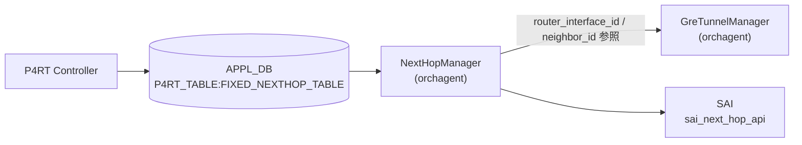

# FIXED_NEXTHOP_TABLE — set_p2p_tunnel_encap_nexthop アクション

!!! warning "YANG 未定義 / APPL_DB テーブル"
    `FIXED_NEXTHOP_TABLE` は CONFIG_DB ではなく **APPL_DB (P4RT_TABLE)** のテーブルであり、`sonic-yang-models` には対応モジュールが存在しない。本ページは `schema.h` の定数と `next_hop_manager.cpp` の実装からフィールドを起こしたもの。

## 概要

[P4RT](../../reference/glossary.md#term-p4rt) controller が **[APPL_DB](../../reference/glossary.md#term-appl_db) の `P4RT_TABLE:FIXED_NEXTHOP_TABLE`** に書き込む nexthop エントリ。[orchagent](../../reference/glossary.md#term-orchagent) の `NextHopManager` がこれを購読し、[SAI](../../reference/glossary.md#term-sai) `sai_next_hop_api->create_next_hops()` を呼び出してハードウェアに nexthop を設定する[^1]。

本ページは `FIXED_NEXTHOP_TABLE` 全体ではなく、**GRE IP-in-IP encap トンネルを使う `set_p2p_tunnel_encap_nexthop` アクション**にフォーカスする。他アクション (`set_ip_nexthop` / `set_nexthop` 等) は対象外。

テーブル名定数は `schema.h` の `APP_P4RT_NEXTHOP_TABLE_NAME = "FIXED_NEXTHOP_TABLE"`[^2]。

<!-- cdb-mermaid -->
### データフロー (自動生成)



!!! note "凡例"
    `set_p2p_tunnel_encap_nexthop` アクション時、NextHopManager は GreTunnelManager からアンダーレイ RIF および neighbor_id を自動解決した後、SAI Bulk API で nexthop を作成する。

<!-- /cdb-mermaid -->

## DB / key

```yaml
APPL_DB:   P4RT_TABLE:FIXED_NEXTHOP_TABLE:<json_key>
# json_key 例: {"match/nexthop_id":"nh-1"}
```

## フィールド (`set_p2p_tunnel_encap_nexthop` アクション)

| フィールド | 型 | 必須 | 説明 |
|-----------|----|------|------|
| `match/nexthop_id` (key) | string | ✅ | nexthop 識別子 |
| `action` | string `set_p2p_tunnel_encap_nexthop` | ✅ | アクション種別 |
| `param/tunnel_id` | string | ✅ | 参照する GRE トンネル識別子 (`FIXED_TUNNEL_TABLE` の `match/tunnel_id` と対応) |
| `controller_metadata` | string | - | コントローラメタデータ（無視される） |

!!! warning "禁止フィールド"
    `set_p2p_tunnel_encap_nexthop` アクションでは `param/router_interface_id` および `param/neighbor_id` は禁止フィールド。指定すると `INVALID_PARAM` エラーになる。

## 制約

- `action` は `set_p2p_tunnel_encap_nexthop` / `set_ip_nexthop` / `set_ip_nexthop_and_disable_rewrites` / `set_nexthop` の 4 値のみ受け入れる
- `set_p2p_tunnel_encap_nexthop` 時は `param/tunnel_id` が必須。省略すると `INVALID_PARAM` エラー
- `param/tunnel_id` が参照する GRE トンネルは `FIXED_TUNNEL_TABLE` に事前に存在している必要がある（存在しない場合は `NOT_FOUND` エラー）
- 既存エントリへの Update で `gre_tunnel_id` を変更しようとすると `INVALID_PARAM` エラー — 変更には DEL → SET が必要
- 未知フィールドは `INVALID_PARAM` エラー（`controller_metadata` を除くホワイトリスト方式）

## 購読者

- `NextHopManager` ([orchagent](../../reference/glossary.md#term-orchagent)): [SAI](../../reference/glossary.md#term-sai) `SAI_OBJECT_TYPE_NEXT_HOP` (TUNNEL_ENCAP タイプ) 作成/削除

<!-- ordering -->
## 書込み順依存 (Phase B)

`NextHopManager` (`validateAppDbEntry()`) は SET コマンド受信時に参照先オブジェクトの存在を即時チェックするため、書き込み順序が直結する。

### 検出された順序依存

| # | 依存関係 | 方向 | 緩和策 |
|---|----------|------|--------|
| 1 | `FIXED_TUNNEL_TABLE` (GRE トンネル本体) → `FIXED_NEXTHOP_TABLE` `set_p2p_tunnel_encap_nexthop` | **先行必須**（欠如時 `SWSS_RC_NOT_FOUND`） | [P4RT](../../reference/glossary.md#term-p4rt) controller がトンネル作成後に nexthop を書く順守 |
| 2 | GRE トンネル配下の [RIF](../../reference/glossary.md#term-rif)・neighbor → `FIXED_NEXTHOP_TABLE` | **先行必須**（BRCM [SAI](../../reference/glossary.md#term-sai) 要件: `next_hop_manager.cpp:144-158`） | [RIF](../../reference/glossary.md#term-rif) / neighbor は P4Orch 内で GRE より先順位に処理される |
| 3 | `FIXED_NEXTHOP_TABLE` エントリ → WCMP / Route 下流 | 先行必須（下流が nexthop OID を参照） | WCMP / Route は P4Orch 内で nexthop より後順位 |
| 4 | DEL 時: WCMP / Route → `FIXED_NEXTHOP_TABLE` | **先行必須**（`ref_count > 0` は `SWSS_RC_INVALID_PARAM`） | 上流の参照を先に削除してから nexthop DEL |
| 5 | GRE Tunnel ID 変更 UPDATE | **禁止**（`INVALID_PARAM` エラー） | 変更は DEL → SET の順で実施 |

### P4Orch 処理優先順 (ADD)

P4Orch 内部の `m_p4ManagerAddPrecedence` が以下の順でマネージャを drain する。これにより同一バッチ内の依存解決が自動化される。

```
RIF (2位) → Neighbor (3位) → GRE Tunnel (4位) → NextHop (5位) → WCMP (6位) → Route
```

[P4RT](../../reference/glossary.md#term-p4rt) controller が単一 WriteRequest でこれらを混在させた場合でも P4Orch がこの順に処理する。ただし `FIXED_TUNNEL_TABLE` 自体の依存（[RIF](../../reference/glossary.md#term-rif) / neighbor）が未作成の場合は GRE Tunnel SET が失敗し、後続の NextHop SET もキャンセルされる。

### Bulk SAI のキャンセル伝搬

`createNextHops()` は `SAI_BULK_OP_ERROR_MODE_STOP_ON_ERROR` で動作する。バッチ内の 1 件が SAI レベルで失敗すると後続エントリがすべてキャンセルされる（`next_hop_manager.cpp:527`）。

<!-- /ordering -->

<!-- cross-refs -->
## 暗黙参照テーブル (Phase C)

`set_p2p_tunnel_encap_nexthop` エントリが [APPL_DB](../../reference/glossary.md#term-appl_db) に書かれると `NextHopManager` が以下のテーブル・リソースを暗黙的に参照する。[YANG](../../reference/glossary.md#term-yang) 未定義テーブルのため、すべての依存はコードのみに現れる。

| 参照先テーブル / リソース | 参照方向 | 条件 | 不在時の挙動 | evidence |
|--------------------------|---------|------|------------|----------|
| `FIXED_TUNNEL_TABLE` (`param/tunnel_id`) | 先行必須 (GRE Tunnel Manager + P4OidMapper) | 常時。`gre_tunnel_id` が空でない場合に即時存在チェック | `SWSS_RC_NOT_FOUND` → SET 全体失敗 | `next_hop_manager.cpp` L124-137 |
| Router Interface (RIF) | 間接参照 (GRE Tunnel から自動取得) | GRE Tunnel エントリが保持する `router_interface_id` を自動コピー。コントローラは明示不可 (禁止フィールド) | GRE Tunnel が正常に作成されていれば問題なし | `next_hop_manager.cpp` L142-143 |
| Neighbor Entry (`encap_dst_ip` 由来) | P4OidMapper 照合 (必須) | GRE Tunnel の `neighbor_id`（= `encap_dst_ip`）で Neighbor を検索。BRCM SAI 要件から nexthop 作成前に存在が必要 | `SWSS_RC_NOT_FOUND` → SET 全体失敗 | `next_hop_manager.cpp` L147-168 |
| SAI Tunnel OID (P4OidMapper) | OID 解決 (`getOID`) | `prepareSaiAttrs()` 内で `SAI_NEXT_HOP_ATTR_TUNNEL_ID` に設定するため OID を取得 | GRE Tunnel 作成済みであれば自動解決 | `next_hop_manager.cpp` L210-221 |
| WCMP / Route (下流) — DEL 時 | ref_count ガード | nexthop の `ref_count > 0` 中は DEL 不可 | `SWSS_RC_INVALID_PARAM` → DEL 失敗。下流を先に DEL してから nexthop DEL | `next_hop_manager.cpp` L181-195 |

!!! note "GRE Tunnel 先行作成が前提"
    `FIXED_NEXTHOP_TABLE` のエントリは `FIXED_TUNNEL_TABLE` エントリなしでは常に失敗する。
    GRE Tunnel 作成が完了した後でなければ nexthop を書いてはならない。
    P4Orch 内部の優先順（GRE Tunnel 4位 → NextHop 5位）により、同一バッチ内でも自動的に
    GRE Tunnel が先処理される。

!!! warning "Neighbor の事前存在 (BRCM SAI 要件)"
    `encap_dst_ip` に対応する Neighbor エントリが P4OidMapper に登録されていない場合、
    nexthop の SAI 作成は BRCM SAI エラーとなる。
    GRE Tunnel 作成が正常に完了しているならば Neighbor も存在するはずだが、
    手動で APPL_DB を操作する場合は注意が必要。

> 詳細スキャンノート: `meta/_intermediate/cdb-flow/tunnel-encap-action-cross-refs.md`

<!-- /cross-refs -->

<!-- failure -->
## 失敗挙動 (Phase D)

`NextHopManager` (`next_hop_manager.cpp`) は失敗を即時 P4RT gRPC レスポンスに返す。自動リトライ機構はなく、失敗エントリは `Consumer::m_toSync` に残留しない。

### SET 失敗マトリクス

| 失敗条件 | 検出箇所 | エラーコード | evidence |
|---------|---------|-------------|----------|
| `action` が 4 値以外 | `validateAppDbEntry()` | `SWSS_RC_INVALID_PARAM` | `next_hop_manager.cpp:49-55` |
| `set_p2p_tunnel_encap_nexthop` で `param/router_interface_id` 指定 | `validateAppDbEntry()` | `SWSS_RC_INVALID_PARAM` | `next_hop_manager.cpp:86-93` |
| `set_p2p_tunnel_encap_nexthop` で `param/neighbor_id` 指定 | `validateAppDbEntry()` | `SWSS_RC_INVALID_PARAM` | `next_hop_manager.cpp:94-98` |
| `param/tunnel_id` 欠如 | `validateAppDbEntry()` | `SWSS_RC_INVALID_PARAM` | `next_hop_manager.cpp:85-98` |
| 未知フィールド (`controller_metadata` 以外) | フィールドパース時 | `SWSS_RC_INVALID_PARAM` | `next_hop_manager.cpp:482` |
| `FIXED_TUNNEL_TABLE` エントリ不在 (GreTunnelManager) | 依存チェック | `SWSS_RC_NOT_FOUND` | `next_hop_manager.cpp:126-131` |
| GRE トンネル OID が P4OidMapper に未登録 | 依存チェック | `SWSS_RC_NOT_FOUND` | `next_hop_manager.cpp:133-139` |
| Neighbor エントリ不在 (`encap_dst_ip` 由来) | 依存チェック | `SWSS_RC_NOT_FOUND` | `next_hop_manager.cpp:163-169` |
| SAI `create_next_hops()` 失敗 | `createNextHops()` Bulk SAI | `SWSS_RC_NOT_EXECUTED` (publisher publish) | `next_hop_manager.cpp:570-574` |
| 既存エントリへの SET (UPDATE) | drain ループ | `SWSS_RC_UNIMPLEMENTED` → `SWSS_RC_NOT_EXECUTED` publish | `next_hop_manager.cpp:373-381` |

### DEL 失敗マトリクス

| 失敗条件 | 検出箇所 | エラーコード | evidence |
|---------|---------|-------------|----------|
| エントリ不在 | `validateAppDbEntry()` DEL 分岐 | `SWSS_RC_NOT_FOUND` | `next_hop_manager.cpp:173-177` |
| `ref_count > 0`（下流 WCMP / Route が参照中） | `validateAppDbEntry()` DEL 分岐 | `SWSS_RC_INVALID_PARAM` | `next_hop_manager.cpp:188-194` |
| SAI `remove_next_hops()` 失敗 | `removeNextHops()` Bulk SAI | `SWSS_RC_NOT_EXECUTED` (publisher publish) | `next_hop_manager.cpp:603-609` |

### Bulk SAI エラー伝搬

`createNextHops()` / `removeNextHops()` は `SAI_BULK_OP_ERROR_MODE_STOP_ON_ERROR` を使用する。バッチ内で 1 件が SAI レベルで失敗すると**後続エントリがすべてキャンセル**され、各エントリのステータスが `SWSS_RC_NOT_EXECUTED` として P4RT gRPC レスポンスに返される (`next_hop_manager.cpp:529, 605`)。

!!! warning "自動リトライなし"
    P4Orch は失敗エントリを `Consumer::m_toSync` に残さない。P4RT controller 側で再試行を実装する必要がある。依存先 (`FIXED_TUNNEL_TABLE` / Neighbor) が未作成の状態でエントリを書いた場合は、依存先の作成後に controller が nexthop を再 SET しなければならない。

> 詳細スキャンノート: `meta/_intermediate/cdb-flow/tunnel-encap-action-failure.md`

<!-- /failure -->

<!-- constants -->
## ハードコード定数 (Phase E)

`FIXED_NEXTHOP_TABLE` の処理に使われる、DB フィールドではなくコード中にハードコードされた文字列定数・SAI 定数の一覧。

### アクション文字列定数 (`p4orch_util.h`)

| 定数名 | 値 | 用途 |
|--------|----|------|
| `kSetTunnelNexthop` | `"set_p2p_tunnel_encap_nexthop"` | 本ページ対象のアクション名。`validateAppDbEntry()` で比較 |
| `kSetIpNexthop` | `"set_ip_nexthop"` | 同テーブルの他アクション（許容値） |
| `kSetIpNexthopAndDisableRewrites` | `"set_ip_nexthop_and_disable_rewrites"` | 同テーブルの他アクション（許容値） |
| `kSetNexthop` | `"set_nexthop"` | 同テーブルの他アクション（許容値） |

`validateAppDbEntry()` はこの 4 値以外の `action` フィールドを即座に `SWSS_RC_INVALID_PARAM` で拒否する (`next_hop_manager.cpp:49-55`)。

### フィールド名定数 (`p4orch_util.h`)

| 定数名 | 値 | 役割 |
|--------|----|------|
| `kNexthopId` | `"nexthop_id"` | match フィールド名 |
| `kTunnelId` | `"tunnel_id"` | `param/tunnel_id` の末尾部分 |
| `kRouterInterfaceId` | `"router_interface_id"` | 禁止フィールド名（`set_p2p_tunnel_encap_nexthop` では拒否） |
| `kNeighborId` | `"neighbor_id"` | 禁止フィールド名（`set_p2p_tunnel_encap_nexthop` では拒否） |
| `kControllerMetadata` | `"controller_metadata"` | ホワイトリスト外だが例外的に無視 |
| `kMatchPrefix` | `"match"` | フィールド名プレフィックス（`match/nexthop_id` の `match` 部） |
| `kActionParamPrefix` | `"param"` | フィールド名プレフィックス（`param/tunnel_id` の `param` 部） |
| `kFieldDelimiter` | `'/'` | `match/`・`param/` のデリミタ文字 |

### テーブル名定数 (`schema.h`)

| 定数名 | 値 |
|--------|----|
| `APP_P4RT_TABLE_NAME` | `"P4RT_TABLE"` |
| `APP_P4RT_NEXTHOP_TABLE_NAME` | `"FIXED_NEXTHOP_TABLE"` |

完全な [APPL_DB](../../reference/glossary.md#term-appl_db) キーは `P4RT_TABLE:FIXED_NEXTHOP_TABLE:<json_key>` (`schema.h` L59, L63)[^2]。

### SAI 定数 (`next_hop_manager.cpp`, `next_hop_manager.h`)

| 定数 / 属性 | 値 | 根拠 |
|------------|-----|------|
| `SAI_NEXT_HOP_TYPE_TUNNEL_ENCAP` | SAI enum (ハードコード) | `set_p2p_tunnel_encap_nexthop` 時にのみ設定 (`next_hop_manager.cpp:215-216`) |
| `SAI_BULK_OP_ERROR_MODE_STOP_ON_ERROR` | SAI enum | `createNextHops()` / `removeNextHops()` のバルク操作モード (`next_hop_manager.cpp:529, 605`) |
| `P4NextHopEntry::disable_decrement_ttl` デフォルト | `false` | 構造体メンバー初期値 (`next_hop_manager.h:38`) |
| `P4NextHopEntry::disable_src_mac_rewrite` デフォルト | `false` | 同上 (`next_hop_manager.h:39`) |
| `P4NextHopEntry::disable_dst_mac_rewrite` デフォルト | `false` | 同上 (`next_hop_manager.h:40`) |
| `P4NextHopEntry::disable_vlan_rewrite` デフォルト | `false` | 同上 (`next_hop_manager.h:41`) |

!!! note "disable_* 属性は set_p2p_tunnel_encap_nexthop では非適用"
    `SAI_NEXT_HOP_ATTR_DISABLE_*` 属性 4 種は `prepareSaiAttrs()` の `gre_tunnel_id` 非空分岐では SAI に送出されない。
    これらは `set_ip_nexthop` / `set_ip_nexthop_and_disable_rewrites` / `set_nexthop` アクション専用定数であり、
    `set_p2p_tunnel_encap_nexthop` の SAI 属性リストには含まれない (`next_hop_manager.cpp:206-260`)。

> 詳細スキャンノート: `meta/_intermediate/cdb-flow/tunnel-encap-action-constants.md`

<!-- /constants -->

<!-- side-effects -->
## 副作用・他オブジェクトへの波及 (Phase F)

`NextHopManager` が `set_p2p_tunnel_encap_nexthop` エントリを **SET / DEL** した際に、nexthop 本体以外で変化するシステム状態を記す。

### SET 成功時の副作用

| 副作用 | 対象 | 変化 | evidence |
|--------|------|------|----------|
| P4OidMapper — GRE Tunnel の ref_count インクリメント | `SAI_OBJECT_TYPE_TUNNEL` | `increaseRefCount(TUNNEL, tunnel_key)` → トンネル DEL がブロックされる | `next_hop_manager.cpp:541-545` |
| P4OidMapper — Neighbor の ref_count インクリメント | `SAI_OBJECT_TYPE_NEIGHBOR_ENTRY` | `increaseRefCount(NEIGHBOR_ENTRY, neighbor_key)` → Neighbor DEL がブロックされる | `next_hop_manager.cpp:554-557` |
| [CRM](../../reference/glossary.md#term-crm) カウンタのインクリメント | `CrmOrch::CRM_IPV4_NEXTHOP` / `CRM_IPV6_NEXTHOP` | `gCrmOrch->incCrmResUsedCounter()` → `show crm resources nexthop` の使用量が増加 | `next_hop_manager.cpp:558-562` |
| P4OidMapper — nexthop OID の登録 | `SAI_OBJECT_TYPE_NEXT_HOP` | `setOID(NEXT_HOP, next_hop_key, oid)` → 下流 (WCMP / Route) が nexthop OID を参照可能になる | `next_hop_manager.cpp:568-569` |

### DEL 成功時の副作用

| 副作用 | 対象 | 変化 | evidence |
|--------|------|------|----------|
| P4OidMapper — GRE Tunnel の ref_count デクリメント | `SAI_OBJECT_TYPE_TUNNEL` | `decreaseRefCount(TUNNEL, tunnel_key)` → ref_count が 0 になるとトンネル DEL が可能になる | `next_hop_manager.cpp:613-616` |
| P4OidMapper — Neighbor の ref_count デクリメント | `SAI_OBJECT_TYPE_NEIGHBOR_ENTRY` | `decreaseRefCount(NEIGHBOR_ENTRY, neighbor_key)` — DEL 時は GRE Tunnel から router_interface_id を再解決 | `next_hop_manager.cpp:625-635` |
| [CRM](../../reference/glossary.md#term-crm) カウンタのデクリメント | `CrmOrch::CRM_IPV4_NEXTHOP` / `CRM_IPV6_NEXTHOP` | `gCrmOrch->decCrmResUsedCounter()` → `show crm resources nexthop` の使用量が減少 | `next_hop_manager.cpp:636-640` |
| P4OidMapper — nexthop OID の削除 | `SAI_OBJECT_TYPE_NEXT_HOP` | `eraseOID(NEXT_HOP, next_hop_key)` → 下流 (WCMP / Route) からの OID 参照が無効化 | `next_hop_manager.cpp:643` |

### 波及の連鎖

nexthop を作成すると GRE Tunnel の ref_count が増加し、nexthop を削除するまでトンネルの DEL が `SWSS_RC_INVALID_PARAM` で失敗する。削除の逆順制約は以下の通り:

```
削除順: (WCMP / Route) → FIXED_NEXTHOP_TABLE (nexthop DEL) → FIXED_TUNNEL_TABLE (tunnel DEL) → Neighbor → RIF
```

nexthop DEL が成功するまで、[CRM](../../reference/glossary.md#term-crm) カウンタは nexthop 1 件分の消費として計上され続ける。CRM しきい値超過アラートは nexthop が解放されるまでクリアされない。

> 詳細スキャンノート: `meta/_intermediate/cdb-flow/tunnel-encap-action-side.md`

<!-- /side-effects -->

<!-- pubsub -->
## 通信メカニズム (Phase G)

### 購読方式 — ZMQ ベース

`NextHopManager` は `P4Orch`（`ZmqOrch` サブクラス）に属するマネージャ。`FIXED_NEXTHOP_TABLE` を含む `P4RT_TABLE` への書き込みは P4RT gRPC サーバが **ZMQ IPC** 経由で [orchagent](../../reference/glossary.md#term-orchagent) に送信する（[Redis](../../reference/glossary.md#term-redis) [ProducerStateTable](../../reference/glossary.md#term-producerstatetable) channel や keyspace 通知は使わない）。

```cpp
// orchdaemon.cpp:847-849
vector<string> p4rt_tables = {APP_P4RT_TABLE_NAME};
m_p4OrchZmqServer = new swss::ZmqServer(m_p4OrchZmqServerEp, "", false, true);
gP4Orch = new P4Orch(m_applDb, p4rt_tables, m_p4OrchZmqServer, vrf_orch, gCoppOrch);

// orchdaemon.h:121
const std::string m_p4OrchZmqServerEp = "ipc:///zmq_swss/p4orch_zmq_swss_ep";
```

| 購読者 | 購読 API | 書き込み元 | ZMQ Endpoint |
|--------|---------|-----------|--------------|
| `P4Orch` / `NextHopManager` | `ZmqConsumerStateTable` | P4RT gRPC サーバ | `ipc:///zmq_swss/p4orch_zmq_swss_ep` |

### 応答 publish の流れ

各エントリの処理完了後、`m_publisher->publish(APP_P4RT_TABLE_NAME, key, fvs, status, /*replace=*/true)` が呼ばれる（`next_hop_manager.cpp:324, 342, 364, 378, 678`）。`ResponsePublisher::publish()` は以下を順に実行する:

| # | 宛先 | 内容 | 条件 |
|---|------|------|------|
| 1 | ZMQ 応答 (`ZmqServer::sendMsg`) | gRPC WriteResponse として P4RT サーバに返却 | 常時（`m_zmqServer != nullptr`） |
| 2 | [Redis](../../reference/glossary.md#term-redis) Notification Channel | `APPL_DB_P4RT_TABLE_RESPONSE_CHANNEL` に `PUBLISH` | 常時 (`NotificationProducer::send()`) |
| 3 | `APPL_STATE_DB:P4RT_TABLE:FIXED_NEXTHOP_TABLE:<key>` | SET 成功時: intent フィールドを state として書き込み。DEL 成功時: エントリ削除 | `status.ok()` 時のみ |

```
response_channel = "APPL_DB_P4RT_TABLE_RESPONSE_CHANNEL"
                  // response_publisher.cpp:104
```

### publish タイミング

| タイミング | コード箇所 | ステータス |
|-----------|-----------|-----------|
| deserialize 失敗 | `next_hop_manager.cpp:324-326` | エラーコード |
| `validateAppDbEntry` 失敗 | `next_hop_manager.cpp:342-344` | エラーコード |
| バッチ内先行失敗によるキャンセル | `next_hop_manager.cpp:364-367` | `SWSS_RC_NOT_EXECUTED` |
| UPDATE 試行（既存エントリへの SET） | `next_hop_manager.cpp:378-380` | `SWSS_RC_UNIMPLEMENTED` |
| Bulk SAI 処理完了後（SET / DEL） | `next_hop_manager.cpp:678-680` | 成功/失敗とも |

### APPL_STATE_DB エントリ形式

SET 成功時に書き込まれるエントリの例:

```
APPL_STATE_DB: P4RT_TABLE:FIXED_NEXTHOP_TABLE:{"match/nexthop_id":"nh-1"}
  action          = "set_p2p_tunnel_encap_nexthop"
  param/tunnel_id = "<tunnel_id>"
  err_str         = ""
```

DEL 成功時は当該エントリが APPL_STATE_DB から削除される。

### COUNTERS_DB / FLEX_COUNTER_DB

`next_hop_manager.cpp` は `gCrmOrch->incCrmResUsedCounter(CRM_IPV4_NEXTHOP)` / `decCrmResUsedCounter(CRM_IPV6_NEXTHOP)` を呼び出す（`:559-561, :637-639`）。これは CRM 内部使用量カウンタへの反映であり、**[COUNTERS_DB](../../reference/glossary.md#term-counters_db)・[FLEX_COUNTER_DB](../../reference/glossary.md#term-flex_counter_db) への書き込みは発生しない**。

### サービス再起動トリガー

なし。`NextHopManager` は orchagent プロセス内のハンドラであり、エントリの追加/削除は SAI nexthop オブジェクトのライブ操作のみで反映され、プロセス再起動を伴わない。

> 詳細スキャンノート: `meta/_intermediate/cdb-flow/tunnel-encap-action-pubsub.md`

<!-- /pubsub -->

<!-- defaults -->
## コード由来デフォルト・暗黙挙動

以下のデフォルト値は DB フィールドとして公開されず、`next_hop_manager.cpp` 内でハードコードまたは暗黙的に設定される。

| フィールド / SAI 属性 | デフォルト / 実挙動 | 根拠 |
|----------------------|--------------------|------|
| `neighbor_id` parse 初期値 | `0.0.0.0` (parse 前のゼロ初期値) | `next_hop_manager.cpp:420` |
| `neighbor_id` (実効値) | GRE トンネルの `encap_dst_ip` と同値 (GreTunnelManager から自動取得) | `next_hop_manager.cpp:147, 518` |
| `router_interface_id` (実効値) | GRE トンネルの `router_interface_id` (GreTunnelManager から自動取得) | `next_hop_manager.cpp:142, 514` |
| `SAI_NEXT_HOP_ATTR_TYPE` | `SAI_NEXT_HOP_TYPE_TUNNEL_ENCAP` ハードコード | `next_hop_manager.cpp:215-216` |
| `SAI_NEXT_HOP_ATTR_TUNNEL_ID` | GRE トンネル OID (セントラライズドマッパー経由で解決) | `next_hop_manager.cpp:210-221` |
| `disable_decrement_ttl` | `false` (P4NextHopEntry 構造体メンバーデフォルト) | `next_hop_manager.h:38` |
| `disable_src_mac_rewrite` | `false` (同上) | `next_hop_manager.h:39` |
| `disable_dst_mac_rewrite` | `false` (同上) | `next_hop_manager.h:40` |
| `disable_vlan_rewrite` | `false` (同上) | `next_hop_manager.h:41` |
| `SAI_NEXT_HOP_ATTR_DISABLE_*` | `set_p2p_tunnel_encap_nexthop` 時は SAI に設定されない (tunnel 分岐はこれらを送出しない) | `next_hop_manager.cpp:206-260` |
| SAI Bulk モード | `SAI_BULK_OP_ERROR_MODE_STOP_ON_ERROR` | `next_hop_manager.cpp:527` |
| `controller_metadata` | 無視 (ホワイトリスト外スキップ) | `next_hop_manager.cpp:480` |

### 詳細: `neighbor_id` の自動解決 (BRCM SAI 要件)

`set_p2p_tunnel_encap_nexthop` アクションでは `param/neighbor_id` フィールドをコントローラが明示指定することはできない。代わりに、NextHopManager が GreTunnelManager から参照先 GRE トンネルの `neighbor_id`（= `encap_dst_ip`）を取得して内部フィールドに設定する[^1]。

```
P4RT controller  →  param/tunnel_id = "tunnel-1"
NextHopManager   →  GreTunnelManager.getConstGreTunnelEntry("tunnel-1")
                 →  next_hop_entry.neighbor_id = gre_tunnel.neighbor_id  (= encap_dst_ip)
                 →  next_hop_entry.router_interface_id = gre_tunnel.router_interface_id
```

BRCM SAI の実装要件から、neighbor エントリは nexthop 作成前に存在している必要がある[^1]。

### 詳細: `SAI_NEXT_HOP_TYPE_TUNNEL_ENCAP` の決定

DB には SAI nexthop タイプを指定するフィールドがない。`prepareSaiAttrs` は `gre_tunnel_id` フィールドの非空/空で分岐する[^3]。

```
gre_tunnel_id 非空  →  SAI_NEXT_HOP_TYPE_TUNNEL_ENCAP + SAI_NEXT_HOP_ATTR_TUNNEL_ID
gre_tunnel_id 空    →  SAI_NEXT_HOP_TYPE_IP + SAI_NEXT_HOP_ATTR_ROUTER_INTERFACE_ID
```

### 詳細: `disable_*` 属性は tunnel nexthop に非適用

`SAI_NEXT_HOP_ATTR_DISABLE_DECREMENT_TTL` / `DISABLE_SRC_MAC_REWRITE` / `DISABLE_DST_MAC_REWRITE` / `DISABLE_VLAN_REWRITE` の 4 属性は `set_ip_nexthop` / `set_ip_nexthop_and_disable_rewrites` / `set_nexthop` アクション専用。`set_p2p_tunnel_encap_nexthop` 時は `prepareSaiAttrs` の gre_tunnel_id 分岐では送出されない[^3]。

### 詳細: 更新制限

GRE トンネル ID を変更する UPDATE は禁止されている。`validateAppDbEntry` は既存エントリと新エントリの `gre_tunnel_id` が異なる場合に `INVALID_PARAM` を返す[^1]。RIF / neighbor の変更も同様にエラー。実質的に変更はDEL → SET の順で行う必要がある。

<!-- /defaults -->

<!-- platform -->
## プラットフォーム / SAI Capability 差異 (Phase H)

`FIXED_NEXTHOP_TABLE` の `set_p2p_tunnel_encap_nexthop` アクションは P4RT gRPC サービスを持つプラットフォームでのみ機能する。`next_hop_manager.cpp` にはプラットフォーム分岐コード（`getenv("platform")` / `MLNX_PLATFORM_SUBSTRING` 等）は存在せず、差異は SAI 実装レベルで生じる。

### BRCM SAI 固有要件 — neighbor 事前生成

```cpp
// next_hop_manager.cpp:144, 515
// BRCM requires neighbor object to be created before GRE tunnel,
// referring to the one in GRE tunnel object when creating
// next_hop_entry_with setTunnelAction
```

`set_p2p_tunnel_encap_nexthop` 時、`NextHopManager` は `GreTunnelManager` から `neighbor_id`（= `encap_dst_ip`）を取得し、centralized mapper で neighbor エントリの存在を確認してから SAI nexthop を作成する。この順序制約は BRCM SAI 要件としてコードに明記されている[^1]。

### CRM カウンタ更新 (プラットフォーム非依存)

SET 成功時に `gCrmOrch->incCrmResUsedCounter()` が呼ばれる（`next_hop_manager.cpp:558-561`）:

- IPv4 nexthop: `CRM_IPV4_NEXTHOP` インクリメント
- IPv6 nexthop: `CRM_IPV6_NEXTHOP` インクリメント

`GreTunnelManager` が CRM カウンタを更新しないのと対照的。

### SAI next hop 対応の ASIC 依存性

`SAI_OBJECT_TYPE_NEXT_HOP` (TUNNEL_ENCAP タイプ) の実装状況はベンダー SAI によって異なる:

| プラットフォーム | 状況 |
|----------------|------|
| Broadcom (BRCM SAI) | 対応（neighbor 事前生成が必須要件） |
| VS / VPP (libsaivs / libsaivpp) | `create_next_hops` は `SAI_STATUS_SUCCESS` を返すがハードウェア転送なし。CI / テスト専用 |
| その他 [ASIC](../../reference/glossary.md#term-asic) | SAI 実装次第。`SAI_STATUS_NOT_SUPPORTED` 返却時は `SWSS_LOG_ERROR` のみ |

### SAI Bulk モード固定

`create_next_hops` / `remove_next_hops` は `SAI_BULK_OP_ERROR_MODE_STOP_ON_ERROR` 固定で呼ばれる（`next_hop_manager.cpp:527-530`）。部分成功モードは使用されない。

> 詳細スキャンノート: `meta/_intermediate/cdb-flow/tunnel-encap-action-platform.md`

<!-- /platform -->

## 関連 CONFIG_DB / YANG / CLI

- 関連 [CONFIG_DB](../../reference/glossary.md#term-config_db): [`TUNNEL_ENCAP_TABLE`](tunnel-encap-table.md)（GRE トンネルオブジェクト本体）
- 関連 [YANG](../../reference/glossary.md#term-yang): なし
- 関連 CLI: なし（P4RT controller が直接 APPL_DB に書き込む）

<!-- ref-triangle:start -->

## 関連リファレンス

- [CONFIG_DB](../../reference/glossary.md#term-config_db): [`TUNNEL_ENCAP_TABLE`](tunnel-encap-table.md)

<!-- ref-triangle:end -->

## 引用元

[^1]: NextHopManager 実装: `orchagent/p4orch/next_hop_manager.cpp`. <https://github.com/sonic-net/sonic-swss/blob/4305596156d70e9797e8a881b3d19b46de0bce0d/orchagent/p4orch/next_hop_manager.cpp>
[^2]: テーブル名定数: `schema.h`. <https://github.com/sonic-net/sonic-swss-common/blob/158de8d3463ff4b841653f6d57190bb142b80d9c/common/schema.h#L63>
[^3]: SAI 属性設定: `next_hop_manager.cpp` `prepareSaiAttrs()`. <https://github.com/sonic-net/sonic-swss/blob/4305596156d70e9797e8a881b3d19b46de0bce0d/orchagent/p4orch/next_hop_manager.cpp#L201-L261>

<!-- glossary-links-injected: a7a32c5af13d -->
