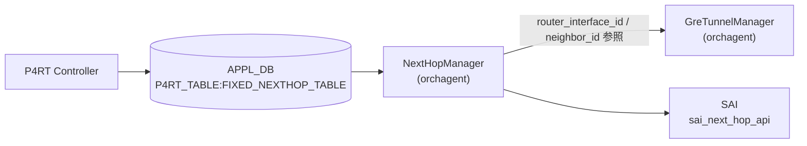

# FIXED_NEXTHOP_TABLE — set_p2p_tunnel_encap_nexthop アクション

!!! warning "YANG 未定義 / APPL_DB テーブル"
    `FIXED_NEXTHOP_TABLE` は CONFIG_DB ではなく **APPL_DB (P4RT_TABLE)** のテーブルであり、`sonic-yang-models` には対応モジュールが存在しない。本ページは `schema.h` の定数と `next_hop_manager.cpp` の実装からフィールドを起こしたもの。

## 概要

P4RT controller が **APPL_DB の `P4RT_TABLE:FIXED_NEXTHOP_TABLE`** に書き込む nexthop エントリ。[orchagent](../../reference/glossary.md#term-orchagent) の `NextHopManager` がこれを購読し、[SAI](../../reference/glossary.md#term-sai) `sai_next_hop_api->create_next_hops()` を呼び出してハードウェアに nexthop を設定する[^1]。

本ページは `FIXED_NEXTHOP_TABLE` 全体ではなく、**GRE IP-in-IP encap トンネルを使う `set_p2p_tunnel_encap_nexthop` アクション**にフォーカスする。他アクション (`set_ip_nexthop` / `set_nexthop` 等) は対象外。

テーブル名定数は `schema.h` の `APP_P4RT_NEXTHOP_TABLE_NAME = "FIXED_NEXTHOP_TABLE"`[^2]。

<!-- cdb-mermaid -->
### データフロー (自動生成)



!!! note "凡例"
    `set_p2p_tunnel_encap_nexthop` アクション時、NextHopManager は GreTunnelManager からアンダーレイ RIF および neighbor_id を自動解決した後、SAI Bulk API で nexthop を作成する。

<!-- /cdb-mermaid -->

## DB / key

```yaml
APPL_DB:   P4RT_TABLE:FIXED_NEXTHOP_TABLE:<json_key>
# json_key 例: {"match/nexthop_id":"nh-1"}
```

## フィールド (`set_p2p_tunnel_encap_nexthop` アクション)

| フィールド | 型 | 必須 | 説明 |
|-----------|----|------|------|
| `match/nexthop_id` (key) | string | ✅ | nexthop 識別子 |
| `action` | string `set_p2p_tunnel_encap_nexthop` | ✅ | アクション種別 |
| `param/tunnel_id` | string | ✅ | 参照する GRE トンネル識別子 (`FIXED_TUNNEL_TABLE` の `match/tunnel_id` と対応) |
| `controller_metadata` | string | - | コントローラメタデータ（無視される） |

!!! warning "禁止フィールド"
    `set_p2p_tunnel_encap_nexthop` アクションでは `param/router_interface_id` および `param/neighbor_id` は禁止フィールド。指定すると `INVALID_PARAM` エラーになる。

## 制約

- `action` は `set_p2p_tunnel_encap_nexthop` / `set_ip_nexthop` / `set_ip_nexthop_and_disable_rewrites` / `set_nexthop` の 4 値のみ受け入れる
- `set_p2p_tunnel_encap_nexthop` 時は `param/tunnel_id` が必須。省略すると `INVALID_PARAM` エラー
- `param/tunnel_id` が参照する GRE トンネルは `FIXED_TUNNEL_TABLE` に事前に存在している必要がある（存在しない場合は `NOT_FOUND` エラー）
- 既存エントリへの Update で `gre_tunnel_id` を変更しようとすると `INVALID_PARAM` エラー — 変更には DEL → SET が必要
- 未知フィールドは `INVALID_PARAM` エラー（`controller_metadata` を除くホワイトリスト方式）

## 購読者

- `NextHopManager` ([orchagent](../../reference/glossary.md#term-orchagent)): [SAI](../../reference/glossary.md#term-sai) `SAI_OBJECT_TYPE_NEXT_HOP` (TUNNEL_ENCAP タイプ) 作成/削除

<!-- defaults -->
## コード由来デフォルト・暗黙挙動

以下のデフォルト値は DB フィールドとして公開されず、`next_hop_manager.cpp` 内でハードコードまたは暗黙的に設定される。

| フィールド / SAI 属性 | デフォルト / 実挙動 | 根拠 |
|----------------------|--------------------|------|
| `neighbor_id` parse 初期値 | `0.0.0.0` (parse 前のゼロ初期値) | `next_hop_manager.cpp:420` |
| `neighbor_id` (実効値) | GRE トンネルの `encap_dst_ip` と同値 (GreTunnelManager から自動取得) | `next_hop_manager.cpp:147, 518` |
| `router_interface_id` (実効値) | GRE トンネルの `router_interface_id` (GreTunnelManager から自動取得) | `next_hop_manager.cpp:142, 514` |
| `SAI_NEXT_HOP_ATTR_TYPE` | `SAI_NEXT_HOP_TYPE_TUNNEL_ENCAP` ハードコード | `next_hop_manager.cpp:215-216` |
| `SAI_NEXT_HOP_ATTR_TUNNEL_ID` | GRE トンネル OID (セントラライズドマッパー経由で解決) | `next_hop_manager.cpp:210-221` |
| `disable_decrement_ttl` | `false` (P4NextHopEntry 構造体メンバーデフォルト) | `next_hop_manager.h:38` |
| `disable_src_mac_rewrite` | `false` (同上) | `next_hop_manager.h:39` |
| `disable_dst_mac_rewrite` | `false` (同上) | `next_hop_manager.h:40` |
| `disable_vlan_rewrite` | `false` (同上) | `next_hop_manager.h:41` |
| `SAI_NEXT_HOP_ATTR_DISABLE_*` | `set_p2p_tunnel_encap_nexthop` 時は SAI に設定されない (tunnel 分岐はこれらを送出しない) | `next_hop_manager.cpp:206-260` |
| SAI Bulk モード | `SAI_BULK_OP_ERROR_MODE_STOP_ON_ERROR` | `next_hop_manager.cpp:527` |
| `controller_metadata` | 無視 (ホワイトリスト外スキップ) | `next_hop_manager.cpp:480` |

### 詳細: `neighbor_id` の自動解決 (BRCM SAI 要件)

`set_p2p_tunnel_encap_nexthop` アクションでは `param/neighbor_id` フィールドをコントローラが明示指定することはできない。代わりに、NextHopManager が GreTunnelManager から参照先 GRE トンネルの `neighbor_id`（= `encap_dst_ip`）を取得して内部フィールドに設定する[^1]。

```
P4RT controller  →  param/tunnel_id = "tunnel-1"
NextHopManager   →  GreTunnelManager.getConstGreTunnelEntry("tunnel-1")
                 →  next_hop_entry.neighbor_id = gre_tunnel.neighbor_id  (= encap_dst_ip)
                 →  next_hop_entry.router_interface_id = gre_tunnel.router_interface_id
```

BRCM SAI の実装要件から、neighbor エントリは nexthop 作成前に存在している必要がある[^1]。

### 詳細: `SAI_NEXT_HOP_TYPE_TUNNEL_ENCAP` の決定

DB には SAI nexthop タイプを指定するフィールドがない。`prepareSaiAttrs` は `gre_tunnel_id` フィールドの非空/空で分岐する[^3]。

```
gre_tunnel_id 非空  →  SAI_NEXT_HOP_TYPE_TUNNEL_ENCAP + SAI_NEXT_HOP_ATTR_TUNNEL_ID
gre_tunnel_id 空    →  SAI_NEXT_HOP_TYPE_IP + SAI_NEXT_HOP_ATTR_ROUTER_INTERFACE_ID
```

### 詳細: `disable_*` 属性は tunnel nexthop に非適用

`SAI_NEXT_HOP_ATTR_DISABLE_DECREMENT_TTL` / `DISABLE_SRC_MAC_REWRITE` / `DISABLE_DST_MAC_REWRITE` / `DISABLE_VLAN_REWRITE` の 4 属性は `set_ip_nexthop` / `set_ip_nexthop_and_disable_rewrites` / `set_nexthop` アクション専用。`set_p2p_tunnel_encap_nexthop` 時は `prepareSaiAttrs` の gre_tunnel_id 分岐では送出されない[^3]。

### 詳細: 更新制限

GRE トンネル ID を変更する UPDATE は禁止されている。`validateAppDbEntry` は既存エントリと新エントリの `gre_tunnel_id` が異なる場合に `INVALID_PARAM` を返す[^1]。RIF / neighbor の変更も同様にエラー。実質的に変更はDEL → SET の順で行う必要がある。

<!-- /defaults -->

## 関連 CONFIG_DB / YANG / CLI

- 関連 CONFIG_DB: [`TUNNEL_ENCAP_TABLE`](tunnel-encap-table.md)（GRE トンネルオブジェクト本体）
- 関連 YANG: なし
- 関連 CLI: なし（P4RT controller が直接 APPL_DB に書き込む）

<!-- ref-triangle:start -->

## 関連リファレンス

- CONFIG_DB: [`TUNNEL_ENCAP_TABLE`](tunnel-encap-table.md)

<!-- ref-triangle:end -->

## 引用元

[^1]: NextHopManager 実装: `orchagent/p4orch/next_hop_manager.cpp`. <https://github.com/sonic-net/sonic-swss/blob/4305596156d70e9797e8a881b3d19b46de0bce0d/orchagent/p4orch/next_hop_manager.cpp>
[^2]: テーブル名定数: `schema.h`. <https://github.com/sonic-net/sonic-swss-common/blob/158de8d3463ff4b841653f6d57190bb142b80d9c/common/schema.h#L63>
[^3]: SAI 属性設定: `next_hop_manager.cpp` `prepareSaiAttrs()`. <https://github.com/sonic-net/sonic-swss/blob/4305596156d70e9797e8a881b3d19b46de0bce0d/orchagent/p4orch/next_hop_manager.cpp#L201-L261>
