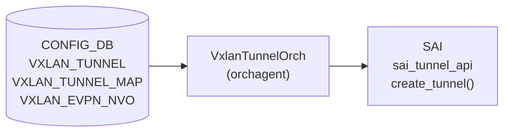
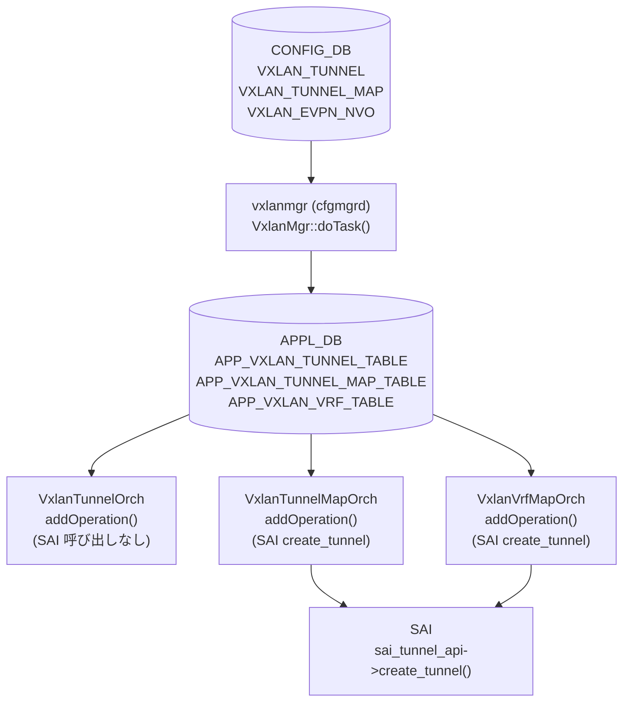

# VxlanTunnelOrch — encap 処理詳細

## 概要

`orchagent` の `VxlanTunnelOrch` / `VxlanTunnel` クラスが [CONFIG_DB](../../reference/glossary.md#term-config_db) の `VXLAN_TUNNEL`・`VXLAN_TUNNEL_MAP`・`VXLAN_EVPN_NVO` テーブルを受け取り、[SAI](../../reference/glossary.md#term-sai) `sai_tunnel_api->create_tunnel()` を呼び出してハードウェアに [VXLAN](../../reference/glossary.md#term-vxlan) encap トンネルを設定する実装詳細を解説するページ。

本ページは `VXLAN_TUNNEL` テーブルのフィールド仕様ではなく、**orchagent 側が付与する encap 関連のコード由来デフォルト**にフォーカスする[^1]。テーブル仕様は [`VXLAN_TUNNEL`](vxlan-tunnel.md) を参照。

<!-- cdb-mermaid -->
### データフロー



<!-- /cdb-mermaid -->

## encap トンネル生成タイミング

`VXLAN_TUNNEL` エントリの追加 (`VxlanTunnelOrch::addOperation`) では SAI トンネルオブジェクトを作成しない。オブジェクト作成は以下のいずれかが発生したときに遅延される[^1]。

| トリガー | 呼び出し元 |
|---------|-----------|
| `VXLAN_TUNNEL_MAP` エントリ追加 | `VxlanTunnelMapOrch::addOperation` (line 2069) |
| `VXLAN_VRF_MAP` エントリ追加 | `VxlanVrfMapOrch::addOperation` (line 2297) |
| `createVxlanTunnelMap` 呼び出し | `VxlanTunnelOrch::createVxlanTunnelMap` (line 1491, 1501) |

## encap mapper モード

encap mapper の生成方式は `tunnel_map_use_t` 列挙型で制御される[^1]。

| モード | 説明 | 使用場面 |
|-------|------|---------|
| `TUNNEL_MAP_USE_DEDICATED_ENCAP_DECAP` | encap / decap それぞれ専用 mapper を作成 | L3VNI (VRF) / Bridge VNI |
| `TUNNEL_MAP_USE_COMMON_ENCAP_DECAP` | src VTEP の encap / decap mapper を共有 | EVPN DIP トンネル |
| `TUNNEL_MAP_USE_COMMON_DECAP_DEDICATED_ENCAP` | decap は共有、encap は専用 | EVPN 混在構成 |
| `TUNNEL_MAP_USE_DECAP_ONLY` | decap のみ（encap mapper なし） | 特殊用途 |

## encap mapper タイプ対応

encap 方向の mapper タイプは以下の対応に従って SAI に設定される[^1]。

| `tunnel_map_type_t` | encap `MAP_T` (SAI) |
|--------------------|---------------------|
| `TUNNEL_MAP_T_VLAN` | `SAI_TUNNEL_MAP_TYPE_VLAN_ID_TO_VNI` |
| `TUNNEL_MAP_T_VIRTUAL_ROUTER` | `SAI_TUNNEL_MAP_TYPE_VIRTUAL_ROUTER_ID_TO_VNI` |
| `TUNNEL_MAP_T_BRIDGE` | `SAI_TUNNEL_MAP_TYPE_BRIDGE_IF_TO_VNI` |

<!-- ordering -->
## 処理順序・依存関係

VXLAN_TUNNEL エントリは CONFIG_DB → vxlanmgr (cfgmgrd) → APPL_DB → orchagent の順に処理される[^2]。



**処理の前提条件**:

| 依存 | 理由 |
|-----|------|
| `VXLAN_TUNNEL` エントリが先に存在すること | `VXLAN_TUNNEL_MAP` 追加時に `findTunnel()` を呼ぶ。存在しなければ処理失敗 (`vxlanorch.cpp:2030`) |
| `gUnderlayIfId` が初期化済みであること | SAI `create_tunnel()` でアンダーレイ RIF として参照 (`main.cpp:967`, `vxlanorch.cpp:907`) |
| `VxlanTunnelOrch` が `gDirectory` に登録済みであること | `VxlanTunnelMapOrch` / `VxlanVrfMapOrch` が `gDirectory.get<VxlanTunnelOrch*>()` で参照 (`orchdaemon.cpp:351,353,355`) |

**orchdaemon 登録順序** (`orchdaemon.cpp:350-355`):

1. `VxlanTunnelOrch` — line 350–351
2. `VxlanTunnelMapOrch` — line 352–353
3. `VxlanVrfMapOrch` — line 354–355

**SAI トンネル生成は遅延**: `VXLAN_TUNNEL` エントリ追加時は SAI 呼び出しなし。
実際の `sai_tunnel_api->create_tunnel()` は `VXLAN_TUNNEL_MAP` または `VRF_MAP` の追加時に初めて実行される[^2]。

<!-- /ordering -->

<!-- defaults -->
## コード由来デフォルト・暗黙挙動

以下のデフォルト値は DB フィールドとして公開されず、`vxlanorch.cpp` / `vxlanorch.h` 内でハードコードまたは暗黙的に設定される[^1]。

| フィールド / SAI 属性 | デフォルト / 実挙動 | 根拠 |
|----------------------|--------------------|------|
| `SAI_TUNNEL_ATTR_TYPE` | `SAI_TUNNEL_TYPE_VXLAN` ハードコード | `vxlanorch.cpp:303-304` |
| `SAI_TUNNEL_ATTR_ENCAP_TTL_MODE` | `encap_ttl != 0` の場合 `SAI_TUNNEL_TTL_MODE_PIPE_MODEL` を設定。`encap_ttl == 0` の場合は属性を SAI に渡さない → プラットフォーム依存 | `vxlanorch.cpp:385-393` |
| `SAI_TUNNEL_ATTR_ENCAP_TTL_VAL` | デフォルト引数 `DEFAULT_TUNNEL_ENCAP_TTL = 255` (YANG 未定義フィールド)。`encap_ttl` 省略呼び出しでは 255 が SAI に設定される | `vxlanorch.h:49`, `vxlanorch.h:207`, `vxlanorch.cpp:392` |
| `SAI_TUNNEL_ATTR_PEER_MODE` | CLI 作成 (`TNL_CREATION_SRC_CLI`) は常に `SAI_TUNNEL_PEER_MODE_P2MP`。EVPN DIP トンネル (`TNL_CREATION_SRC_EVPN`) は `SAI_TUNNEL_PEER_MODE_P2P` | `vxlanorch.cpp:358-369`, `vxlanorch.cpp:903` |
| `SAI_TUNNEL_ATTR_DECAP_TTL_MODE` | `ttl_mode` 省略時 (`VxlanTunnelTTLMode::NOT_SET`) は属性を SAI に渡さない → プラットフォーム依存デフォルト | `vxlanorch.cpp:372-383` |
| `SAI_TUNNEL_ATTR_UNDERLAY_INTERFACE` | `gUnderlayIfId`（グローバルアンダーレイ RIF）固定 | `vxlanorch.cpp:307-309` |
| encap mapper 共有/専用 | `TUNNEL_MAP_USE_DEDICATED_ENCAP_DECAP` (L3VNI/Bridge) / `TUNNEL_MAP_USE_COMMON_ENCAP_DECAP` (EVPN DIP) — DB に設定フィールドなし | `vxlanorch.cpp:1491`, `vxlanorch.cpp:1169` |
| SAI tunnel 生成タイミング | `VXLAN_TUNNEL` 追加時は SAI 呼び出しなし。`VXLAN_TUNNEL_MAP` / VRF map 追加時に遅延生成 | `vxlanorch.cpp:2063-2070`, `vxlanorch.cpp:2292-2297` |

### 詳細: `encap_ttl` デフォルトの実際のパス

`DEFAULT_TUNNEL_ENCAP_TTL = 255` は `vxlanorch.h:49` に定義されている。
`createTunnelHw` のシグネチャ (`vxlanorch.h:207`) でデフォルト引数として宣言されるが、
CONFIG_DB / YANG に対応フィールドは存在しない。

`VxlanTunnelMapOrch::addOperation` および `VxlanVrfMapOrch::addOperation` では
`createTunnelHw(mapper_list, TUNNEL_MAP_USE_DEDICATED_ENCAP_DECAP)` と `encap_ttl` を省略して呼ぶため、
内部で `255 → create_tunnel() → encap_ttl != 0 → PIPE_MODEL + TTL=255` の経路を辿る[^1]。

### 詳細: EVPN DIP トンネルの encap TTL

`VxlanTunnelOrch::addTunnelUser` 内の DIP トンネル生成 (`vxlanorch.cpp:1169`) では
`createTunnelHw(mapper_list, TUNNEL_MAP_USE_COMMON_ENCAP_DECAP, false)` を呼ぶ。
`encap_ttl` は省略 → デフォルト `255` → `PIPE_MODEL + TTL=255` が SAI に設定される[^1]。

### 詳細: Peer Mode の決定

```
src_creation_ == TNL_CREATION_SRC_EVPN  →  p2p = true  →  SAI_TUNNEL_PEER_MODE_P2P
src_creation_ == TNL_CREATION_SRC_CLI   →  p2p = false →  SAI_TUNNEL_PEER_MODE_P2MP (常に)
```

CLI (`config vxlan add`) で作成されたトンネルは `TNL_CREATION_SRC_CLI` で登録され、
`dst_ip` を明示指定しても SAI レイヤでは P2MP モードになる (`vxlanorch.cpp:903-904`)[^1]。

<!-- /defaults -->

## 関連 CONFIG_DB / YANG / CLI

- 関連 [CONFIG_DB](../../reference/glossary.md#term-config_db): [`VXLAN_TUNNEL`](vxlan-tunnel.md)、[`VXLAN_TUNNEL_MAP`](vxlan-tunnel-map.md)
- 関連 [YANG](../../reference/glossary.md#term-yang): `sonic-vxlan`
- 関連 CLI: [`config vxlan`](../cli/config-vxlan.md)

<!-- ref-triangle:start -->

## 関連リファレンス

- CONFIG_DB: [`VXLAN_TUNNEL`](vxlan-tunnel.md)
- CONFIG_DB: [`VXLAN_TUNNEL_MAP`](vxlan-tunnel-map.md)

<!-- ref-triangle:end -->

## 引用元

[^1]: VxlanTunnelOrch 実装: `orchagent/vxlanorch.cpp`, `orchagent/vxlanorch.h`. <https://github.com/sonic-net/sonic-swss/blob/4305596156d70e9797e8a881b3d19b46de0bce0d/orchagent/vxlanorch.cpp>
[^2]: orchdaemon 初期化順序 (`orchdaemon.cpp:350-590`), VxlanMgr::doTask() (`cfgmgr/vxlanmgr.cpp:213-262`). <https://github.com/sonic-net/sonic-swss/blob/4305596156d70e9797e8a881b3d19b46de0bce0d/orchagent/orchdaemon.cpp>
