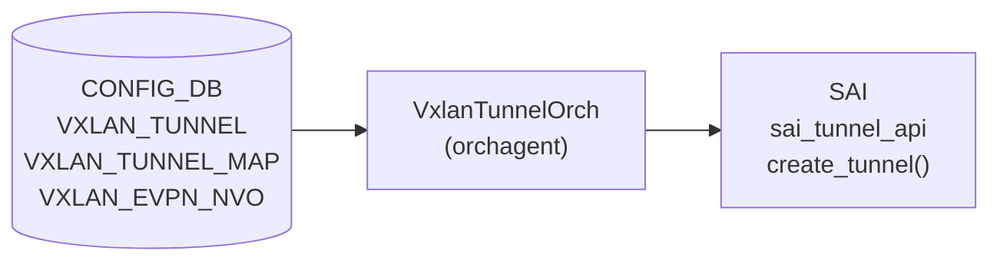
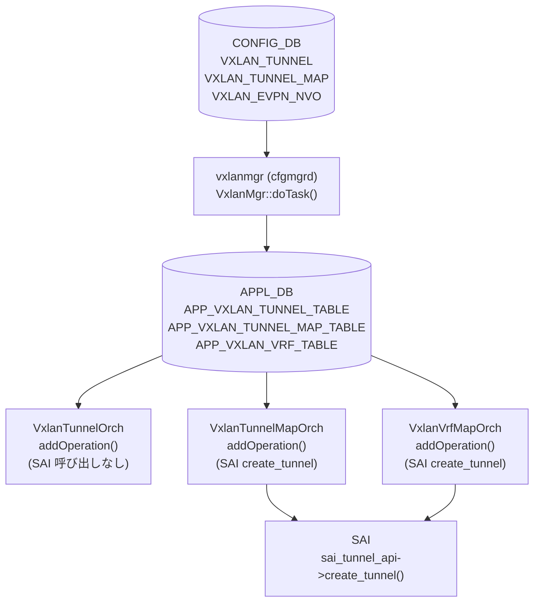

# VxlanTunnelOrch — encap 処理詳細

## 概要

`orchagent` の `VxlanTunnelOrch` / `VxlanTunnel` クラスが [CONFIG_DB](../../reference/glossary.md#term-config_db) の `VXLAN_TUNNEL`・`VXLAN_TUNNEL_MAP`・`VXLAN_EVPN_NVO` テーブルを受け取り、[SAI](../../reference/glossary.md#term-sai) `sai_tunnel_api->create_tunnel()` を呼び出してハードウェアに [VXLAN](../../reference/glossary.md#term-vxlan) encap トンネルを設定する実装詳細を解説するページ。

本ページは `VXLAN_TUNNEL` テーブルのフィールド仕様ではなく、**orchagent 側が付与する encap 関連のコード由来デフォルト**にフォーカスする[^1]。テーブル仕様は [`VXLAN_TUNNEL`](vxlan-tunnel.md) を参照。

<!-- cdb-mermaid -->
### データフロー



<!-- /cdb-mermaid -->

## encap トンネル生成タイミング

`VXLAN_TUNNEL` エントリの追加 (`VxlanTunnelOrch::addOperation`) では SAI トンネルオブジェクトを作成しない。オブジェクト作成は以下のいずれかが発生したときに遅延される[^1]。

| トリガー | 呼び出し元 |
|---------|-----------|
| `VXLAN_TUNNEL_MAP` エントリ追加 | `VxlanTunnelMapOrch::addOperation` (line 2069) |
| `VXLAN_VRF_MAP` エントリ追加 | `VxlanVrfMapOrch::addOperation` (line 2297) |
| `createVxlanTunnelMap` 呼び出し | `VxlanTunnelOrch::createVxlanTunnelMap` (line 1491, 1501) |

## encap mapper モード

encap mapper の生成方式は `tunnel_map_use_t` 列挙型で制御される[^1]。

| モード | 説明 | 使用場面 |
|-------|------|---------|
| `TUNNEL_MAP_USE_DEDICATED_ENCAP_DECAP` | encap / decap それぞれ専用 mapper を作成 | L3VNI (VRF) / Bridge VNI |
| `TUNNEL_MAP_USE_COMMON_ENCAP_DECAP` | src VTEP の encap / decap mapper を共有 | EVPN DIP トンネル |
| `TUNNEL_MAP_USE_COMMON_DECAP_DEDICATED_ENCAP` | decap は共有、encap は専用 | EVPN 混在構成 |
| `TUNNEL_MAP_USE_DECAP_ONLY` | decap のみ（encap mapper なし） | 特殊用途 |

## encap mapper タイプ対応

encap 方向の mapper タイプは以下の対応に従って SAI に設定される[^1]。

| `tunnel_map_type_t` | encap `MAP_T` (SAI) |
|--------------------|---------------------|
| `TUNNEL_MAP_T_VLAN` | `SAI_TUNNEL_MAP_TYPE_VLAN_ID_TO_VNI` |
| `TUNNEL_MAP_T_VIRTUAL_ROUTER` | `SAI_TUNNEL_MAP_TYPE_VIRTUAL_ROUTER_ID_TO_VNI` |
| `TUNNEL_MAP_T_BRIDGE` | `SAI_TUNNEL_MAP_TYPE_BRIDGE_IF_TO_VNI` |

<!-- ordering -->
## 処理順序・依存関係

VXLAN_TUNNEL エントリは CONFIG_DB → vxlanmgr (cfgmgrd) → APPL_DB → orchagent の順に処理される[^2]。



**処理の前提条件**:

| 依存 | 理由 |
|-----|------|
| `VXLAN_TUNNEL` エントリが先に存在すること | `VXLAN_TUNNEL_MAP` 追加時に `findTunnel()` を呼ぶ。存在しなければ処理失敗 (`vxlanorch.cpp:2030`) |
| `gUnderlayIfId` が初期化済みであること | SAI `create_tunnel()` でアンダーレイ RIF として参照 (`main.cpp:967`, `vxlanorch.cpp:907`) |
| `VxlanTunnelOrch` が `gDirectory` に登録済みであること | `VxlanTunnelMapOrch` / `VxlanVrfMapOrch` が `gDirectory.get<VxlanTunnelOrch*>()` で参照 (`orchdaemon.cpp:351,353,355`) |

**orchdaemon 登録順序** (`orchdaemon.cpp:350-355`):

1. `VxlanTunnelOrch` — line 350–351
2. `VxlanTunnelMapOrch` — line 352–353
3. `VxlanVrfMapOrch` — line 354–355

**SAI トンネル生成は遅延**: `VXLAN_TUNNEL` エントリ追加時は SAI 呼び出しなし。
実際の `sai_tunnel_api->create_tunnel()` は `VXLAN_TUNNEL_MAP` または `VRF_MAP` の追加時に初めて実行される[^2]。

<!-- /ordering -->

<!-- cross-refs -->
## 暗黙参照テーブル (Phase C)

`VxlanTunnelOrch` / `VxlanTunnelMapOrch` / `VxlanVrfMapOrch` が処理を行う際に
CONFIG_DB フィールドとして公開されずコード内で暗黙的に参照されるリソース・テーブル。

| 参照先 | 参照方向 | 条件 | 参照元 evidence |
|--------|---------|------|----------------|
| `gUnderlayIfId`（グローバル underlay RIF） | 読み取り（`SAI_TUNNEL_ATTR_UNDERLAY_INTERFACE`） | `VXLAN_TUNNEL_MAP` または `VRF_MAP` 追加時の `createTunnelHw()` 呼び出し。`main.cpp:967` で初期化されていない場合は SAI create_tunnel 失敗 | `vxlanorch.cpp:907` |
| `VxlanTunnelOrch`（via `gDirectory`） | 読み取り（`findTunnel()` / `getDecapMapId()` 等） | `VxlanTunnelMapOrch::addOperation` / `VxlanVrfMapOrch::addOperation` が親トンネルオブジェクトを取得するとき。`VXLAN_TUNNEL` が先に存在しない場合は処理失敗 | `vxlanorch.cpp:2046, 2260` |
| `VRFOrch`（via `gDirectory`） | 読み取り（`isL3VniVlan(vni_id)`） | `VxlanTunnelMapOrch::addOperation` で L3VNI 判定時。VRF が存在しない場合は `isL3Vni = false` として処理される（エラーではなく条件分岐） | `vxlanorch.cpp:2095` |
| `EvpnNvoOrch`（via `gDirectory`） | 読み取り・通知 | `addTunnelUser()` / `delTunnelUser()` / `deleteTunnelPort()` が EVPN DIP トンネルを操作するとき | `vxlanorch.cpp:1678, 1733, 1795` |
| `STATE_VXLAN_TUNNEL_TABLE`（STATE_DB） | 書き込み | トンネル作成時（`operstatus=down`, `src_ip`, `dst_ip`, `tnl_src`）および oper-status 変化時 | `vxlanorch.cpp:1910, 1943, 1953` |

!!! note "orchdaemon 登録順序が前提"
    `VxlanTunnelMapOrch` / `VxlanVrfMapOrch` は `gDirectory.get<VxlanTunnelOrch*>()` で
    `VxlanTunnelOrch` を取得する。`orchdaemon.cpp:350-355` での登録順序
    （`VxlanTunnelOrch` → `VxlanTunnelMapOrch` → `VxlanVrfMapOrch`）が
    正しくないと `gDirectory` からの取得に失敗して実行時エラーとなる。

!!! note "VXLAN_TUNNEL エントリの事前存在が必須"
    `VxlanTunnelMapOrch::addOperation`（line 2030）は `findTunnel()` で対応する
    `VXLAN_TUNNEL` エントリを検索する。エントリが存在しない場合は処理失敗となる。
    `VXLAN_TUNNEL` → `VXLAN_TUNNEL_MAP` の順序で投入すること。

> 詳細スキャンノート: `meta/_intermediate/cdb-flow/tunnel-encap-orch-cross-refs.md`

<!-- /cross-refs -->

<!-- defaults -->
## コード由来デフォルト・暗黙挙動

以下のデフォルト値は DB フィールドとして公開されず、`vxlanorch.cpp` / `vxlanorch.h` 内でハードコードまたは暗黙的に設定される[^1]。

| フィールド / SAI 属性 | デフォルト / 実挙動 | 根拠 |
|----------------------|--------------------|------|
| `SAI_TUNNEL_ATTR_TYPE` | `SAI_TUNNEL_TYPE_VXLAN` ハードコード | `vxlanorch.cpp:303-304` |
| `SAI_TUNNEL_ATTR_ENCAP_TTL_MODE` | `encap_ttl != 0` の場合 `SAI_TUNNEL_TTL_MODE_PIPE_MODEL` を設定。`encap_ttl == 0` の場合は属性を SAI に渡さない → プラットフォーム依存 | `vxlanorch.cpp:385-393` |
| `SAI_TUNNEL_ATTR_ENCAP_TTL_VAL` | デフォルト引数 `DEFAULT_TUNNEL_ENCAP_TTL = 255` (YANG 未定義フィールド)。`encap_ttl` 省略呼び出しでは 255 が SAI に設定される | `vxlanorch.h:49`, `vxlanorch.h:207`, `vxlanorch.cpp:392` |
| `SAI_TUNNEL_ATTR_PEER_MODE` | CLI 作成 (`TNL_CREATION_SRC_CLI`) は常に `SAI_TUNNEL_PEER_MODE_P2MP`。EVPN DIP トンネル (`TNL_CREATION_SRC_EVPN`) は `SAI_TUNNEL_PEER_MODE_P2P` | `vxlanorch.cpp:358-369`, `vxlanorch.cpp:903` |
| `SAI_TUNNEL_ATTR_DECAP_TTL_MODE` | `ttl_mode` 省略時 (`VxlanTunnelTTLMode::NOT_SET`) は属性を SAI に渡さない → プラットフォーム依存デフォルト | `vxlanorch.cpp:372-383` |
| `SAI_TUNNEL_ATTR_UNDERLAY_INTERFACE` | `gUnderlayIfId`（グローバルアンダーレイ RIF）固定 | `vxlanorch.cpp:307-309` |
| encap mapper 共有/専用 | `TUNNEL_MAP_USE_DEDICATED_ENCAP_DECAP` (L3VNI/Bridge) / `TUNNEL_MAP_USE_COMMON_ENCAP_DECAP` (EVPN DIP) — DB に設定フィールドなし | `vxlanorch.cpp:1491`, `vxlanorch.cpp:1169` |
| SAI tunnel 生成タイミング | `VXLAN_TUNNEL` 追加時は SAI 呼び出しなし。`VXLAN_TUNNEL_MAP` / VRF map 追加時に遅延生成 | `vxlanorch.cpp:2063-2070`, `vxlanorch.cpp:2292-2297` |

### 詳細: `encap_ttl` デフォルトの実際のパス

`DEFAULT_TUNNEL_ENCAP_TTL = 255` は `vxlanorch.h:49` に定義されている。
`createTunnelHw` のシグネチャ (`vxlanorch.h:207`) でデフォルト引数として宣言されるが、
CONFIG_DB / YANG に対応フィールドは存在しない。

`VxlanTunnelMapOrch::addOperation` および `VxlanVrfMapOrch::addOperation` では
`createTunnelHw(mapper_list, TUNNEL_MAP_USE_DEDICATED_ENCAP_DECAP)` と `encap_ttl` を省略して呼ぶため、
内部で `255 → create_tunnel() → encap_ttl != 0 → PIPE_MODEL + TTL=255` の経路を辿る[^1]。

### 詳細: EVPN DIP トンネルの encap TTL

`VxlanTunnelOrch::addTunnelUser` 内の DIP トンネル生成 (`vxlanorch.cpp:1169`) では
`createTunnelHw(mapper_list, TUNNEL_MAP_USE_COMMON_ENCAP_DECAP, false)` を呼ぶ。
`encap_ttl` は省略 → デフォルト `255` → `PIPE_MODEL + TTL=255` が SAI に設定される[^1]。

### 詳細: Peer Mode の決定

```
src_creation_ == TNL_CREATION_SRC_EVPN  →  p2p = true  →  SAI_TUNNEL_PEER_MODE_P2P
src_creation_ == TNL_CREATION_SRC_CLI   →  p2p = false →  SAI_TUNNEL_PEER_MODE_P2MP (常に)
```

CLI (`config vxlan add`) で作成されたトンネルは `TNL_CREATION_SRC_CLI` で登録され、
`dst_ip` を明示指定しても SAI レイヤでは P2MP モードになる (`vxlanorch.cpp:903-904`)[^1]。

<!-- /defaults -->

<!-- failure -->
## 失敗時の挙動 (Phase D)

| 失敗ケース | 挙動 | リトライ | evidence |
|-----------|------|---------|----------|
| `sai_tunnel_api->create_tunnel()` 失敗 | `deleteMapperHw()` で mapper をロールバック後 `active_=false`、`createTunnelHw()` が `false` 返却 → `VxlanTunnelMapOrch::addOperation` が `return false` してキュー保留 | 自動リトライ | `vxlanorch.cpp:908-920` |
| `create_tunnel_termination()` 失敗 (`with_term=true`) | `remove_tunnel()` + `deleteMapperHw()` で完全ロールバック後 `active_=false` | 自動リトライ | `vxlanorch.cpp:925-934` |
| `VXLAN_TUNNEL_MAP` 追加時に対象 VLAN が未存在 | `SWSS_LOG_WARN` + `return false` → キュー保留。VLAN 作成後に自動収束 | 自動リトライ | `vxlanorch.cpp:2030-2033` |
| `VXLAN_TUNNEL_MAP` 追加時に `VXLAN_TUNNEL` 未存在 | `SWSS_LOG_WARN` + `return false` → キュー保留。`VXLAN_TUNNEL` 投入後に自動収束 | 自動リトライ | `vxlanorch.cpp:2047-2050` |
| `del_tnl_hw_pending` フラグが立っている間の操作 | `SWSS_LOG_WARN` + `return false` → 保留。HW 削除完了後に自動収束 | 自動リトライ | `vxlanorch.cpp:2057-2060` |

!!! warning "SAI 失敗時のロールバック"
    `create_tunnel()` が失敗した場合、直前に作成した mapper オブジェクト (`createMapperHw`) が
    自動的にロールバックされる。部分的な SAI オブジェクトが残存しないよう設計されている
    (`vxlanorch.cpp:913-920`)。

!!! note "return false = リトライ"
    swss の Consumer フレームワークでは `addOperation` / `delOperation` が `false` を返すと
    エントリがキューに残り、次の doTask() サイクルで再処理される。依存リソース（VLAN / TUNNEL）が
    後から投入されれば自動的に収束する。

<!-- /failure -->

<!-- constants -->
## ハードコード定数 (Phase E)

CONFIG_DB フィールドとして公開されず `vxlanorch.h` / `vxlanorch.cpp` にハードコードされている定数。`config_db.json` での設定変更は効果なく、変更にはコードのリコンパイルが必要。

### SAI トンネル属性のハードコード値

| 定数 / 値 | SAI 属性 | 定義場所 | 備考 |
|-----------|---------|---------|------|
| `SAI_TUNNEL_TYPE_VXLAN` | `SAI_TUNNEL_ATTR_TYPE` | `vxlanorch.cpp:304` | トンネルタイプは常に VXLAN 固定。IP-in-IP 等への変更不可 |
| `SAI_TUNNEL_PEER_MODE_P2MP` | `SAI_TUNNEL_ATTR_PEER_MODE` | `vxlanorch.cpp:368` | CLI 作成 (`TNL_CREATION_SRC_CLI`) のトンネルは常に P2MP。`dst_ip` を指定しても変わらない |
| `SAI_TUNNEL_PEER_MODE_P2P` | `SAI_TUNNEL_ATTR_PEER_MODE` | `vxlanorch.cpp:359` | EVPN DIP トンネル (`TNL_CREATION_SRC_EVPN`) のみ P2P |
| `SAI_TUNNEL_TTL_MODE_PIPE_MODEL` | `SAI_TUNNEL_ATTR_ENCAP_TTL_MODE` | `vxlanorch.cpp:388` | `encap_ttl != 0` 時に自動設定。フィールドで選択不可 |
| `gUnderlayIfId` | `SAI_TUNNEL_ATTR_UNDERLAY_INTERFACE` | `vxlanorch.cpp:307-309` | orchagent 起動時に `main.cpp` で設定されるグローバル RIF を固定使用 |

### encap TTL・VNI 境界値

| 定数名 | 値 | 定義場所 | 用途 |
|--------|----|---------|------|
| `DEFAULT_TUNNEL_ENCAP_TTL` | `255` | `vxlanorch.h:49` | `createTunnelHw()` のデフォルト引数。YANG / CONFIG_DB に対応フィールドなし |
| `MAX_VNI_ID` | `16777215` | `vxlanorch.h:48` | VNI 上限 (2^24 − 1)。超過は `SWSS_LOG_ERROR` + `return true` で恒久エラー（リトライなし） |

### FlexCounter 関連定数

| 定数名 | 値 | 定義場所 | 用途 |
|--------|----|---------|------|
| `TUNNEL_STAT_COUNTER_FLEX_COUNTER_GROUP` | `"TUNNEL_STAT_COUNTER"` | `vxlanorch.h:39` | FlexCounterManager に登録するカウンタグループ名 |
| `TUNNEL_STAT_FLEX_COUNTER_POLLING_INTERVAL_MS` | `10000` | `vxlanorch.h:40` | FlexCounter ポーリング間隔 (ms)。10 秒固定。CONFIG_DB から変更不可 |
| `FLEX_COUNTER_UPD_INTERVAL` | `1` | `vxlanorch.cpp:36` | FlexCounter 更新タイマー秒数（1 秒固定） |

### mapper モード定数

`tunnel_map_use_t` 列挙型の値はコードに固定されており、CONFIG_DB フィールドで選択できない。

| 値 | 割り当て条件 | evidence |
|----|------------|---------|
| `TUNNEL_MAP_USE_DEDICATED_ENCAP_DECAP` | L3VNI / Bridge VNI の MAP 追加時 | `vxlanorch.cpp:2067` |
| `TUNNEL_MAP_USE_COMMON_ENCAP_DECAP` | EVPN DIP トンネル (`addTunnelUser`) | `vxlanorch.cpp:1169` |
| `TUNNEL_MAP_USE_DECAP_ONLY` | VLAN MAP で L3VNI フラグなし（decap のみ許可） | `vxlanorch.cpp:2060-2066` のコメント |

> 詳細スキャンノート: `meta/_intermediate/cdb-flow/tunnel-encap-orch-ordering.md`

<!-- /constants -->

<!-- side-effects -->
## 副次 DB 書込 (Phase F)

`VxlanTunnelOrch` / `VxlanTunnel` がトンネル生成・削除時に引き起こす副次的な DB 書込とシステム副作用[^4]。

| 副次 DB | テーブル / キー | トリガ | タイミング |
|---------|--------------|--------|----------|
| STATE_DB | `VXLAN_TUNNEL_TABLE\|<tunnel_name>` (`src_ip`, `dst_ip`, `tnl_src`, `operstatus=down`) | EVPN 作成トンネルのコンストラクタ → `addRemoveStateTableEntry(add=true)` (`vxlanorch.cpp:537`) | `createTunnelHw()` / コンストラクタと同期 |
| STATE_DB | `VXLAN_TUNNEL_TABLE\|<tunnel_name>` (`operstatus`: `up`/`down`) | SAI ポートステータス変化 → `updateDbTunnelOperStatus()` (`vxlanorch.cpp:1893`) | アンダーレイ経路確立時に非同期 |
| COUNTERS_DB | `COUNTERS_TUNNEL_NAME_MAP` / `COUNTERS_TUNNEL_TYPE_MAP` | `addTunnelToFlexCounter()` → `doTask(SelectableTimer)` (`vxlanorch.cpp:1322-1335`) | SAI create_tunnel 成功後、最大 1 秒遅延 |
| FLEX_COUNTER_DB | FlexCounter エントリ | `tunnel_stat_manager->setCounterIdList()` | COUNTERS_DB 書込と同タイミング |
| APPL_DB | なし | 書戻しなし | — |
| CONFIG_DB | なし | 読取専用 | — |

### 詳細: STATE_DB 書込対象

CLI 作成トンネル (`TNL_CREATION_SRC_CLI`) のコンストラクタは `addVTEP()` を呼ぶのみで
`addRemoveStateTableEntry()` を呼ばない。STATE_DB への初期書込は **EVPN 作成トンネルのみ**。
ただし `updateDbTunnelOperStatus()` はトンネル種別に関わらず oper-status 変化時に STATE_DB を更新する。

```
VxlanTunnel ctor (TNL_CREATION_SRC_EVPN)
  → addRemoveStateTableEntry(add=true)
    → STATE_VXLAN_TUNNEL_TABLE|<name> = {src_ip, dst_ip, tnl_src="EVPN", operstatus="down"}

VxlanTunnel dtor
  → addRemoveStateTableEntry(add=false)
    → STATE_VXLAN_TUNNEL_TABLE|<name> DEL
```

### 詳細: FlexCounter 登録フロー

SAI `create_tunnel()` 成功 (`vxlanorch.cpp:911`) → `addTunnelToFlexCounter(oid, name)` →
`m_pendingAddToFlexCntr[oid] = name` に追加。実際の COUNTERS_DB 書込は
`FLEX_COUNTER_UPD_INTERVAL=1` 秒タイマー発火時に行われる。
対象は SAI tunnel_id OID（ブリッジポート OID ではない）。

### 詳細: in-memory マップ更新

`VxlanTunnelMapOrch::addOperation` (`vxlanorch.cpp:2120`) は処理完了後
`addVlanMappedToVni(vni_id, vlan_id)` を呼び `vxlan_vni_vlan_map_table_[vni] = vlan_id` を更新する。
この in-memory マップは `EvpnRemoteVnip2pOrch` / `EvpnRemoteVnip2mpOrch` が EVPN
リモート VNI 解決時に参照する。**DB への書込はない**。

> 詳細スキャンノート: `meta/_intermediate/cdb-flow/tunnel-encap-orch-side-effects.md`

<!-- /side-effects -->

<!-- pubsub -->
## 通信メカニズム (Phase G)

### Consumer 登録経路 — 二段階パイプライン

`VXLAN_TUNNEL` / `VXLAN_TUNNEL_MAP` / `VXLAN_EVPN_NVO` の変更は **vxlanmgrd → orchagent** の 2 段階で処理される。

```cpp
// vxlanmgrd.cpp:44-58
vector<std::string> cfg_vnet_tables = {
    CFG_VXLAN_TUNNEL_TABLE_NAME,      // "VXLAN_TUNNEL"
    CFG_VXLAN_TUNNEL_MAP_TABLE_NAME,  // "VXLAN_TUNNEL_MAP"
    CFG_VXLAN_EVPN_NVO_TABLE_NAME,   // "VXLAN_EVPN_NVO"
};
VxlanMgr vxlanmgr(&cfgDb, &appDb, &stateDb, cfg_vnet_tables);

// orchdaemon.cpp:350-358
VxlanTunnelOrch *vxlan_tunnel_orch =
    new VxlanTunnelOrch(m_stateDb, m_applDb, APP_VXLAN_TUNNEL_TABLE_NAME);
VxlanTunnelMapOrch *vxlan_tunnel_map_orch =
    new VxlanTunnelMapOrch(m_applDb, APP_VXLAN_TUNNEL_MAP_TABLE_NAME);
VxlanVrfMapOrch *vxlan_vrf_orch =
    new VxlanVrfMapOrch(m_applDb, APP_VXLAN_VRF_TABLE_NAME);
EvpnNvoOrch* evpn_nvo_orch =
    new EvpnNvoOrch(m_applDb, APP_VXLAN_EVPN_NVO_TABLE_NAME);
```

`vxlanmgrd` は `SubscriberStateTable`（Redis keyspace notification ベース）で CONFIG_DB を購読する。`orchagent` 側の各 Orch は `ConsumerStateTable`（Redis PUBLISH/SUBSCRIBE channel ベース）で APPL_DB を購読する。

### 購読テーブルと API 種別

| 購読者プロセス | 購読 API | 購読テーブル (DB) | ハンドラ |
|--------------|---------|-------------------|---------|
| `vxlanmgrd` (`VxlanMgr`) | `SubscriberStateTable` | `VXLAN_TUNNEL` (CONFIG_DB) | `doVxlanTunnelCreateTask()` / `doVxlanTunnelDeleteTask()` |
| `vxlanmgrd` (`VxlanMgr`) | `SubscriberStateTable` | `VXLAN_TUNNEL_MAP` (CONFIG_DB) | `doVxlanTunnelMapCreateTask()` / `doVxlanTunnelMapDeleteTask()` |
| `vxlanmgrd` (`VxlanMgr`) | `SubscriberStateTable` | `VXLAN_EVPN_NVO` (CONFIG_DB) | `doVxlanEvpnNvoCreateTask()` / `doVxlanEvpnNvoDeleteTask()` |
| `orchagent` (`VxlanTunnelOrch`) | `ConsumerStateTable` | `VXLAN_TUNNEL_TABLE` (APPL_DB) | `addOperation()` / `delOperation()` |
| `orchagent` (`VxlanTunnelMapOrch`) | `ConsumerStateTable` | `VXLAN_TUNNEL_MAP_TABLE` (APPL_DB) | `addOperation()` / `delOperation()` |
| `orchagent` (`VxlanVrfMapOrch`) | `ConsumerStateTable` | `VXLAN_VRF_TABLE` (APPL_DB) | `addOperation()` / `delOperation()` |
| `orchagent` (`EvpnNvoOrch`) | `ConsumerStateTable` | `VXLAN_EVPN_NVO_TABLE` (APPL_DB) | `addOperation()` / `delOperation()` |

### gDirectory を介した Observer 連携

`VxlanTunnelOrch` は伝統的な Observer インタフェース（`attach()`/`notify()`）を持たず、`gDirectory` グローバルレジストリ経由で他の Orch が直接参照を取得する。

| 呼び出し元 | 呼び出し先 | 契機 | evidence |
|-----------|-----------|------|---------|
| `VxlanTunnelOrch` | `EvpnNvoOrch` | `addTunnelUser()` / `delTunnelUser()` 時にリモート VTEP エンドポイント処理 | `vxlanorch.cpp:1678,1733,1795` |
| `VxlanTunnelMapOrch` | `VxlanTunnelOrch` | `addOperation()` 時にトンネル存在確認 + tunnel OID 取得 | `vxlanorch.cpp:2046` |
| `VxlanVrfMapOrch` | `VxlanTunnelOrch` + `VxlanTunnelMapOrch` | VRF-VNI マッピング生成時 | `vxlanorch.cpp:2260-2261` |

### FlexCounter タイマー（非通知パス）

`VxlanTunnelOrch` コンストラクタで `SelectableTimer`（`FLEX_COUNTER_UPD_INTERVAL=1` 秒）を登録し、COUNTERS_DB の `COUNTERS_TUNNEL_NAME_MAP` / `COUNTERS_TUNNEL_TYPE_MAP` を更新する。これは CONFIG_DB 通知経路とは独立した周期ポーリングパスである（`vxlanorch.cpp:1303-1340`）。

### STATE_DB 書き戻し（Observer 逆方向）

`m_stateVxlanTable`（`STATE_DB:VXLAN_TUNNEL_TABLE`）への書き込みは `Table` 型（非 ProducerStateTable）のため Redis `hset`/`del` を直接発行する。NotificationProducer / Consumer 型のチャンネル通知は使用しない。

> 詳細スキャンノート: `meta/_intermediate/cdb-flow/tunnel-encap-orch-pubsub.md`

<!-- /pubsub -->

## 関連 CONFIG_DB / YANG / CLI

- 関連 [CONFIG_DB](../../reference/glossary.md#term-config_db): [`VXLAN_TUNNEL`](vxlan-tunnel.md)、[`VXLAN_TUNNEL_MAP`](vxlan-tunnel-map.md)
- 関連 [YANG](../../reference/glossary.md#term-yang): `sonic-vxlan`
- 関連 CLI: [`config vxlan`](../cli/config-vxlan.md)

<!-- ref-triangle:start -->

## 関連リファレンス

- CONFIG_DB: [`VXLAN_TUNNEL`](vxlan-tunnel.md)
- CONFIG_DB: [`VXLAN_TUNNEL_MAP`](vxlan-tunnel-map.md)

<!-- ref-triangle:end -->

## 引用元

[^1]: VxlanTunnelOrch 実装: `orchagent/vxlanorch.cpp`, `orchagent/vxlanorch.h`. <https://github.com/sonic-net/sonic-swss/blob/4305596156d70e9797e8a881b3d19b46de0bce0d/orchagent/vxlanorch.cpp>
[^2]: orchdaemon 初期化順序 (`orchdaemon.cpp:350-590`), VxlanMgr::doTask() (`cfgmgr/vxlanmgr.cpp:213-262`). <https://github.com/sonic-net/sonic-swss/blob/4305596156d70e9797e8a881b3d19b46de0bce0d/orchagent/orchdaemon.cpp>
[^3]: VxlanTunnel::createTunnelHw() ロールバック (`vxlanorch.cpp:895-940`), VxlanTunnelMapOrch::addOperation() 依存チェック (`vxlanorch.cpp:2012-2090`). <https://github.com/sonic-net/sonic-swss/blob/4305596156d70e9797e8a881b3d19b46de0bce0d/orchagent/vxlanorch.cpp#L895>
[^4]: VxlanTunnel ctor/dtor/addRemoveStateTableEntry (`vxlanorch.cpp:537,545,1913`), addTunnelToFlexCounter (`vxlanorch.cpp:911,1342`), addVlanMappedToVni (`vxlanorch.cpp:2120`, `vxlanorch.h:354`). <https://github.com/sonic-net/sonic-swss/blob/4305596156d70e9797e8a881b3d19b46de0bce0d/orchagent/vxlanorch.cpp>
