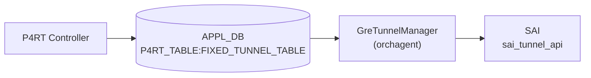

# TUNNEL_ENCAP_TABLE

!!! warning "YANG 未定義 / APPL_DB テーブル"
    `FIXED_TUNNEL_TABLE` は CONFIG_DB ではなく **APPL_DB (P4RT_TABLE)** のテーブルであり、`sonic-yang-models` には対応モジュールが存在しない。本ページは `schema.h` の定数と `gre_tunnel_manager.cpp` の実装からフィールドを起こしたもの。

## 概要

P4RT controller が **APPL_DB の `P4RT_TABLE:FIXED_TUNNEL_TABLE`** に書き込む GRE IP-in-IP encap トンネルエントリ。[orchagent](../../reference/glossary.md#term-orchagent) の `GreTunnelManager` がこれを購読し、[SAI](../../reference/glossary.md#term-sai) `sai_tunnel_api->create_tunnels()` を呼び出してハードウェアに GRE トンネルを設定する[^1]。

テーブル名定数は `schema.h` の `APP_P4RT_TUNNEL_TABLE_NAME = "FIXED_TUNNEL_TABLE"`[^2]。

<!-- cdb-mermaid -->
### データフロー (自動生成)



!!! note "凡例"
    P4RT controller から SAI までの典型経路。CONFIG_DB を経由しない点が他のトンネルテーブルと異なる。

<!-- /cdb-mermaid -->

## DB / key

```yaml
APPL_DB:   P4RT_TABLE:FIXED_TUNNEL_TABLE:<json_key>
# json_key 例: {"match/tunnel_id":"tunnel-1"}
```

## フィールド

| フィールド | 型 | 必須 | 説明 |
|-----------|----|------|------|
| `match/tunnel_id` (key) | string | ✅ | トンネル識別子 |
| `action` | string `mark_for_p2p_tunnel_encap` | ✅ | アクション種別（固定値のみ受け入れ） |
| `param/router_interface_id` | string | ✅ | アンダーレイ RIF ID |
| `param/encap_src_ip` | IPv4/IPv6 アドレス | ✅ | GRE encap 送信元 IP |
| `param/encap_dst_ip` | IPv4/IPv6 アドレス | ✅ | GRE encap 宛先 IP（neighbor_id を兼ねる） |
| `controller_metadata` | string | - | コントローラメタデータ（無視される） |

## 制約

- `action` は `"mark_for_p2p_tunnel_encap"` のみ受け入れる（他の値は `INVALID_PARAM` エラー）
- `encap_src_ip` / `encap_dst_ip` はゼロ IP (0.0.0.0 / ::) を渡すと `INVALID_PARAM` エラー
- 既存エントリへの Update (再 SET) は `SWSS_RC_UNIMPLEMENTED` — 変更には DEL → SET が必要
- 未知フィールドは `INVALID_PARAM` エラー（`controller_metadata` を除くホワイトリスト方式）

## 購読者

- `GreTunnelManager` ([orchagent](../../reference/glossary.md#term-orchagent)): [SAI](../../reference/glossary.md#term-sai) `SAI_OBJECT_TYPE_TUNNEL` (IP-in-IP GRE) 作成/削除

<!-- defaults -->
## コード由来デフォルト・暗黙挙動

以下のデフォルト値は DB フィールドとして公開されず、`gre_tunnel_manager.cpp` 内でハードコードまたは暗黙的に設定される。

| フィールド / SAI 属性 | デフォルト / 実挙動 | 根拠 |
|----------------------|--------------------|------|
| `action` | `mark_for_p2p_tunnel_encap` 固定 | `p4orch_util.h:111` `kTunnelAction` |
| `encap_src_ip` parse 初期値 | `0.0.0.0` (省略時は `INVALID_PARAM` エラー) | `gre_tunnel_manager.cpp:326` |
| `encap_dst_ip` parse 初期値 | `0.0.0.0` (省略時は `INVALID_PARAM` エラー) | `gre_tunnel_manager.cpp:327` |
| `SAI_TUNNEL_ATTR_TYPE` | `SAI_TUNNEL_TYPE_IPINIP_GRE` ハードコード | `gre_tunnel_manager.cpp:42` |
| `SAI_TUNNEL_ATTR_PEER_MODE` | `SAI_TUNNEL_PEER_MODE_P2P` ハードコード | `gre_tunnel_manager.cpp:46` |
| `SAI_TUNNEL_ATTR_OVERLAY_INTERFACE` | `gUnderlayIfId` (グローバルループバック RIF を代用) | `gre_tunnel_manager.cpp:420` |
| `neighbor_id` | `encap_dst_ip` と同値 (BRCM SAI 要件) | `gre_tunnel_manager.h:44`, `gre_tunnel_manager.cpp:406` |
| Update (SET on existing) | `SWSS_RC_UNIMPLEMENTED` エラー | `gre_tunnel_manager.cpp:280` |
| `controller_metadata` | 無視 (ホワイトリスト外スキップ) | `gre_tunnel_manager.cpp:371-375` |

### 詳細

**SAI トンネルタイプ (`SAI_TUNNEL_TYPE_IPINIP_GRE`)**: DB にトンネル種別フィールドはなく、`prepareSaiAttrs()` が常に `SAI_TUNNEL_TYPE_IPINIP_GRE` をセットする[^3]。

**SAI ピアモード (`SAI_TUNNEL_PEER_MODE_P2P`)**: `action` 名の `mark_for_p2p_tunnel_encap` が示す通り、P4 GRE encap トンネルは常に P2P モードで動作する[^3]。

**`overlay_if_oid` = `gUnderlayIfId`**: SAI `SAI_TUNNEL_ATTR_OVERLAY_INTERFACE` は必須属性だが、専用オーバーレイ RIF を作成せずグローバルアンダーレイ RIF を代用する。コード内に `TODO: Remove when SAI_TUNNEL_ATTR_OVERLAY_INTERFACE is not mandatory` と明記されており将来修正予定[^4]。

**`neighbor_id` = `encap_dst_ip`**: BRCM SAI の実装要件から `neighbor_id` は `encap_dst_ip` と同値に固定される。GRE トンネルを作成する前に、該当 neighbor エントリが存在している必要がある[^4]。

<!-- /defaults -->

## 関連 CONFIG_DB / YANG / CLI

- 関連 CONFIG_DB: なし（P4RT は CONFIG_DB を経由しない）
- 関連 YANG: なし
- 関連 CLI: なし（P4RT controller が直接 APPL_DB に書き込む）

<!-- ordering -->
## 処理順序・依存関係・Warm-reboot 挙動

### P4Orch 内の ADD 優先順位

`p4orch.cpp` の `m_p4ManagerAddPrecedence` リスト（`p4orch.cpp:88-102`）により、`FIXED_TUNNEL_TABLE` は **4 番目** に処理される[^5]:

| 優先順位 | マネージャ | テーブル |
|---------|-----------|---------|
| 1 | TablesDefnManager | TABLE_DEFINITION |
| 2 | RouterInterfaceManager | ROUTER_INTERFACE |
| 3 | NeighborManager | NEIGHBOR |
| **4** | **GreTunnelManager** | **FIXED_TUNNEL_TABLE** |
| 5 | NextHopManager | NEXTHOP |
| 6 | WcmpManager | WCMP_GROUP |
| ... | ... | ... |

### SET の依存前提条件

`validateGreTunnelAppDbEntry()` が SET 操作時に以下を強制チェックする（`gre_tunnel_manager.cpp:106-177`）:

1. `router_interface_id` に対応する `SAI_OBJECT_TYPE_ROUTER_INTERFACE` が P4OidMapper に存在すること
2. `(router_interface_id, encap_dst_ip)` の neighbor エントリ (`SAI_OBJECT_TYPE_NEIGHBOR_ENTRY`) が存在すること

いずれかが欠けると `SWSS_RC_NOT_FOUND` エラーとなりエントリは作成されない。

### DEL の依存チェック（参照カウント）

DEL 操作では `m_p4OidMapper->getRefCount(SAI_OBJECT_TYPE_TUNNEL, ...)` で参照カウントを確認し、`ref_count > 0` の場合は `SWSS_RC_INVALID_PARAM` エラーを返す（`gre_tunnel_manager.cpp:161-173`）。GRE tunnel を参照するオブジェクト（NextHop 等）を先に削除しないと消せない。

推奨削除順: (NextHop など上流) → **GRE Tunnel** → Neighbor / RIF

### Warm-reboot 復元挙動

`P4Orch::doTask()` は `consumer.m_toSync` が空でない場合を warm-boot 復元フェーズとみなす（`p4orch.cpp:142-152`）:

1. `m_publisher.setEnableDbWriteAndNotify(false)` — DB への書き戻しを無効化
2. 残留エントリを全件 enqueue
3. `P4Orch::drain()` を呼び出し — `m_p4ManagerAddPrecedence` 順に各マネージャの `drain()` を実行
4. 完了後 `setEnableDbWriteAndNotify(true)` に復帰

GRE tunnel は warm-reboot 後に P4RT controller が APPL_DB に再書き込みを行い、orchagent が SAI 状態を再作成する。重複 SET (既存エントリへの再設定) は `SWSS_RC_UNIMPLEMENTED` を返すため、controller は DEL → SET で再構築する必要がある（`gre_tunnel_manager.cpp:278-281`）。

### Bulk SAI 呼び出しモード

`createGreTunnels()` は `SAI_BULK_OP_ERROR_MODE_STOP_ON_ERROR` で `sai_tunnel_api->create_tunnels()` を呼び出す（`gre_tunnel_manager.cpp:429`）。バッチ内で 1 件でも失敗すると後続エントリはすべてキャンセルされ `SWSS_RC_NOT_EXECUTED` が返る。

<!-- /ordering -->

<!-- ref-triangle:start -->

## 関連リファレンス

- (関連リンクなし)

<!-- ref-triangle:end -->

## 引用元

[^1]: GreTunnelManager 実装: `gre_tunnel_manager.cpp`. <https://github.com/sonic-net/sonic-swss/blob/4305596156d70e9797e8a881b3d19b46de0bce0d/orchagent/p4orch/gre_tunnel_manager.cpp>
[^2]: テーブル名定数: `schema.h`. <https://github.com/sonic-net/sonic-swss-common/blob/158de8d3463ff4b841653f6d57190bb142b80d9c/common/schema.h#L72>
[^3]: SAI 属性設定: `gre_tunnel_manager.cpp` `prepareSaiAttrs()`. <https://github.com/sonic-net/sonic-swss/blob/4305596156d70e9797e8a881b3d19b46de0bce0d/orchagent/p4orch/gre_tunnel_manager.cpp#L37-L65>
[^4]: `createGreTunnels()` overlay_if / neighbor_id: `gre_tunnel_manager.cpp`. <https://github.com/sonic-net/sonic-swss/blob/4305596156d70e9797e8a881b3d19b46de0bce0d/orchagent/p4orch/gre_tunnel_manager.cpp#L400-L425>
[^5]: P4Orch マネージャ ADD 優先順位 (`m_p4ManagerAddPrecedence`): `p4orch.cpp`. <https://github.com/sonic-net/sonic-swss/blob/4305596156d70e9797e8a881b3d19b46de0bce0d/orchagent/p4orch/p4orch.cpp#L88-L102>
