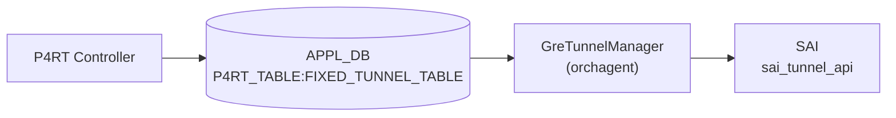

# TUNNEL_ENCAP_TABLE

!!! warning "YANG 未定義 / APPL_DB テーブル"
    `FIXED_TUNNEL_TABLE` は CONFIG_DB ではなく **APPL_DB (P4RT_TABLE)** のテーブルであり、`sonic-yang-models` には対応モジュールが存在しない。本ページは `schema.h` の定数と `gre_tunnel_manager.cpp` の実装からフィールドを起こしたもの。

## 概要

[P4RT](../../reference/glossary.md#term-p4rt) controller が **[APPL_DB](../../reference/glossary.md#term-appl_db) の `P4RT_TABLE:FIXED_TUNNEL_TABLE`** に書き込む GRE IP-in-IP encap トンネルエントリ。[orchagent](../../reference/glossary.md#term-orchagent) の `GreTunnelManager` がこれを購読し、[SAI](../../reference/glossary.md#term-sai) `sai_tunnel_api->create_tunnels()` を呼び出してハードウェアに GRE トンネルを設定する[^1]。

テーブル名定数は `schema.h` の `APP_P4RT_TUNNEL_TABLE_NAME = "FIXED_TUNNEL_TABLE"`[^2]。

<!-- cdb-mermaid -->
### データフロー (自動生成)



!!! note "凡例"
    P4RT controller から SAI までの典型経路。CONFIG_DB を経由しない点が他のトンネルテーブルと異なる。

<!-- /cdb-mermaid -->

## DB / key

```yaml
APPL_DB:   P4RT_TABLE:FIXED_TUNNEL_TABLE:<json_key>
# json_key 例: {"match/tunnel_id":"tunnel-1"}
```

## フィールド

| フィールド | 型 | 必須 | 説明 |
|-----------|----|------|------|
| `match/tunnel_id` (key) | string | ✅ | トンネル識別子 |
| `action` | string `mark_for_p2p_tunnel_encap` | ✅ | アクション種別（固定値のみ受け入れ） |
| `param/router_interface_id` | string | ✅ | アンダーレイ [RIF](../../reference/glossary.md#term-rif) ID |
| `param/encap_src_ip` | IPv4/IPv6 アドレス | ✅ | GRE encap 送信元 IP |
| `param/encap_dst_ip` | IPv4/IPv6 アドレス | ✅ | GRE encap 宛先 IP（neighbor_id を兼ねる） |
| `controller_metadata` | string | - | コントローラメタデータ（無視される） |

## 制約

- `action` は `"mark_for_p2p_tunnel_encap"` のみ受け入れる（他の値は `INVALID_PARAM` エラー）
- `encap_src_ip` / `encap_dst_ip` はゼロ IP (0.0.0.0 / ::) を渡すと `INVALID_PARAM` エラー
- 既存エントリへの Update (再 SET) は `SWSS_RC_UNIMPLEMENTED` — 変更には DEL → SET が必要
- 未知フィールドは `INVALID_PARAM` エラー（`controller_metadata` を除くホワイトリスト方式）

## 購読者

- `GreTunnelManager` ([orchagent](../../reference/glossary.md#term-orchagent)): [SAI](../../reference/glossary.md#term-sai) `SAI_OBJECT_TYPE_TUNNEL` (IP-in-IP GRE) 作成/削除

<!-- defaults -->
## コード由来デフォルト・暗黙挙動

以下のデフォルト値は DB フィールドとして公開されず、`gre_tunnel_manager.cpp` 内でハードコードまたは暗黙的に設定される。

| フィールド / [SAI](../../reference/glossary.md#term-sai) 属性 | デフォルト / 実挙動 | 根拠 |
|----------------------|--------------------|------|
| `action` | `mark_for_p2p_tunnel_encap` 固定 | `p4orch_util.h:111` `kTunnelAction` |
| `encap_src_ip` parse 初期値 | `0.0.0.0` (省略時は `INVALID_PARAM` エラー) | `gre_tunnel_manager.cpp:326` |
| `encap_dst_ip` parse 初期値 | `0.0.0.0` (省略時は `INVALID_PARAM` エラー) | `gre_tunnel_manager.cpp:327` |
| `SAI_TUNNEL_ATTR_TYPE` | `SAI_TUNNEL_TYPE_IPINIP_GRE` ハードコード | `gre_tunnel_manager.cpp:42` |
| `SAI_TUNNEL_ATTR_PEER_MODE` | `SAI_TUNNEL_PEER_MODE_P2P` ハードコード | `gre_tunnel_manager.cpp:46` |
| `SAI_TUNNEL_ATTR_OVERLAY_INTERFACE` | `gUnderlayIfId` (グローバルループバック [RIF](../../reference/glossary.md#term-rif) を代用) | `gre_tunnel_manager.cpp:420` |
| `neighbor_id` | `encap_dst_ip` と同値 (BRCM SAI 要件) | `gre_tunnel_manager.h:44`, `gre_tunnel_manager.cpp:406` |
| Update (SET on existing) | `SWSS_RC_UNIMPLEMENTED` エラー | `gre_tunnel_manager.cpp:280` |
| `controller_metadata` | 無視 (ホワイトリスト外スキップ) | `gre_tunnel_manager.cpp:371-375` |

### 詳細

**SAI トンネルタイプ (`SAI_TUNNEL_TYPE_IPINIP_GRE`)**: DB にトンネル種別フィールドはなく、`prepareSaiAttrs()` が常に `SAI_TUNNEL_TYPE_IPINIP_GRE` をセットする[^3]。

**SAI ピアモード (`SAI_TUNNEL_PEER_MODE_P2P`)**: `action` 名の `mark_for_p2p_tunnel_encap` が示す通り、P4 GRE encap トンネルは常に P2P モードで動作する[^3]。

**`overlay_if_oid` = `gUnderlayIfId`**: SAI `SAI_TUNNEL_ATTR_OVERLAY_INTERFACE` は必須属性だが、専用オーバーレイ [RIF](../../reference/glossary.md#term-rif) を作成せずグローバルアンダーレイ RIF を代用する。コード内に `TODO: Remove when SAI_TUNNEL_ATTR_OVERLAY_INTERFACE is not mandatory` と明記されており将来修正予定[^4]。

**`neighbor_id` = `encap_dst_ip`**: BRCM SAI の実装要件から `neighbor_id` は `encap_dst_ip` と同値に固定される。GRE トンネルを作成する前に、該当 neighbor エントリが存在している必要がある[^4]。

<!-- /defaults -->

## 関連 CONFIG_DB / YANG / CLI

- 関連 [CONFIG_DB](../../reference/glossary.md#term-config_db): なし（[P4RT](../../reference/glossary.md#term-p4rt) は [CONFIG_DB](../../reference/glossary.md#term-config_db) を経由しない）
- 関連 [YANG](../../reference/glossary.md#term-yang): なし
- 関連 CLI: なし（[P4RT](../../reference/glossary.md#term-p4rt) controller が直接 [APPL_DB](../../reference/glossary.md#term-appl_db) に書き込む）

<!-- ordering -->
## 処理順序・依存関係・Warm-reboot 挙動

### P4Orch 内の ADD 優先順位

`p4orch.cpp` の `m_p4ManagerAddPrecedence` リスト（`p4orch.cpp:88-102`）により、`FIXED_TUNNEL_TABLE` は **4 番目** に処理される[^5]:

| 優先順位 | マネージャ | テーブル |
|---------|-----------|---------|
| 1 | TablesDefnManager | TABLE_DEFINITION |
| 2 | RouterInterfaceManager | ROUTER_INTERFACE |
| 3 | NeighborManager | NEIGHBOR |
| **4** | **GreTunnelManager** | **FIXED_TUNNEL_TABLE** |
| 5 | NextHopManager | NEXTHOP |
| 6 | WcmpManager | WCMP_GROUP |
| ... | ... | ... |

### SET の依存前提条件

`validateGreTunnelAppDbEntry()` が SET 操作時に以下を強制チェックする（`gre_tunnel_manager.cpp:106-177`）:

1. `router_interface_id` に対応する `SAI_OBJECT_TYPE_ROUTER_INTERFACE` が P4OidMapper に存在すること
2. `(router_interface_id, encap_dst_ip)` の neighbor エントリ (`SAI_OBJECT_TYPE_NEIGHBOR_ENTRY`) が存在すること

いずれかが欠けると `SWSS_RC_NOT_FOUND` エラーとなりエントリは作成されない。

### DEL の依存チェック（参照カウント）

DEL 操作では `m_p4OidMapper->getRefCount(SAI_OBJECT_TYPE_TUNNEL, ...)` で参照カウントを確認し、`ref_count > 0` の場合は `SWSS_RC_INVALID_PARAM` エラーを返す（`gre_tunnel_manager.cpp:161-173`）。GRE tunnel を参照するオブジェクト（NextHop 等）を先に削除しないと消せない。

推奨削除順: (NextHop など上流) → **GRE Tunnel** → Neighbor / RIF

### Warm-reboot 復元挙動

`P4Orch::doTask()` は `consumer.m_toSync` が空でない場合を warm-boot 復元フェーズとみなす（`p4orch.cpp:142-152`）:

1. `m_publisher.setEnableDbWriteAndNotify(false)` — DB への書き戻しを無効化
2. 残留エントリを全件 enqueue
3. `P4Orch::drain()` を呼び出し — `m_p4ManagerAddPrecedence` 順に各マネージャの `drain()` を実行
4. 完了後 `setEnableDbWriteAndNotify(true)` に復帰

GRE tunnel は warm-reboot 後に P4RT controller が [APPL_DB](../../reference/glossary.md#term-appl_db) に再書き込みを行い、[orchagent](../../reference/glossary.md#term-orchagent) が SAI 状態を再作成する。重複 SET (既存エントリへの再設定) は `SWSS_RC_UNIMPLEMENTED` を返すため、controller は DEL → SET で再構築する必要がある（`gre_tunnel_manager.cpp:278-281`）。

### Bulk SAI 呼び出しモード

`createGreTunnels()` は `SAI_BULK_OP_ERROR_MODE_STOP_ON_ERROR` で `sai_tunnel_api->create_tunnels()` を呼び出す（`gre_tunnel_manager.cpp:429`）。バッチ内で 1 件でも失敗すると後続エントリはすべてキャンセルされ `SWSS_RC_NOT_EXECUTED` が返る。

<!-- /ordering -->

<!-- cross-refs -->
## 暗黙参照テーブル (Phase C)

`GreTunnelManager` が `FIXED_TUNNEL_TABLE` エントリを SET / DEL する際、APPL_DB フィールドには現れないが処理上で参照・更新されるテーブル・リソースを列挙する。

| 参照先テーブル / リソース | 参照方向 | 条件 | 不在時の挙動 | evidence |
|--------------------------|---------|------|------------|----------|
| `FIXED_ROUTER_INTERFACE_TABLE` (`param/router_interface_id`) | **先行必須** (P4OidMapper `getOID(ROUTER_INTERFACE, ...)`) | SET 操作時に常時チェック。`router_interface_id` 省略時も `INVALID_PARAM` で拒否される | `SWSS_RC_NOT_FOUND` → SET 全体失敗 | `gre_tunnel_manager.cpp:129-134` |
| Neighbor エントリ (`encap_dst_ip` + `router_interface_id`) | **先行必須** (P4OidMapper `existsOID(NEIGHBOR_ENTRY, ...)`) | SET 操作時。 `neighbor_key = {router_interface_id}:{encap_dst_ip}` で照合 (BRCM SAI 要件) | `SWSS_RC_NOT_FOUND` → SET 全体失敗 | `gre_tunnel_manager.cpp:139-149` |
| `FIXED_NEXTHOP_TABLE` — `set_p2p_tunnel_encap_nexthop` で参照するエントリ (下流) | **DEL ブロック** (P4OidMapper `getRefCount(TUNNEL, ...)`) | DEL 操作時に `ref_count > 0` を確認。nexthop が本トンネルを参照中は DEL 不可 | `SWSS_RC_INVALID_PARAM` → DEL 失敗。nexthop を先に DEL すること | `gre_tunnel_manager.cpp:162-169` |
| P4OidMapper (`SAI_OBJECT_TYPE_ROUTER_INTERFACE` ref_count) | **副作用** — SET 成功時にインクリメント / DEL 成功時にデクリメント | 常時 | - (内部管理) | `gre_tunnel_manager.cpp:445-446, 505-506` |
| P4OidMapper (`SAI_OBJECT_TYPE_NEIGHBOR_ENTRY` ref_count) | **副作用** — SET 成功時にインクリメント / DEL 成功時にデクリメント | 常時 | - (内部管理) | `gre_tunnel_manager.cpp:448-452, 508-511` |

!!! note "RIF / Neighbor の P4Orch 内処理優先順"
    `m_p4ManagerAddPrecedence` により RouterInterfaceManager (2位) → NeighborManager (3位) → GreTunnelManager (4位) の順に処理される。P4RT controller が同一 WriteRequest でこれらを混在させた場合でも、P4Orch が自動的に正しい順序で処理する。

!!! warning "DEL 逆順制約"
    下流の `FIXED_NEXTHOP_TABLE` エントリが本トンネルを参照している間は `FIXED_TUNNEL_TABLE` を削除できない。削除順は必ず **(nexthop など上流参照) → FIXED_TUNNEL_TABLE → Neighbor → RIF** の順にすること。

<!-- /cross-refs -->

<!-- failure -->
## 失敗挙動 (Phase D)

`GreTunnelManager` (`gre_tunnel_manager.cpp`) は失敗を即時 P4RT gRPC レスポンスに返す。自動リトライ機構はなく、失敗エントリは `Consumer::m_toSync` に残留しない。

### SET 失敗マトリクス

| 失敗条件 | 検出箇所 | エラーコード | evidence |
|---------|---------|-------------|----------|
| JSON キー (`match/tunnel_id`) パース失敗 | `deserializeP4GreTunnelAppDbEntry()` | `SWSS_RC_INVALID_PARAM` | `gre_tunnel_manager.cpp:336` |
| `param/encap_src_ip` / `param/encap_dst_ip` 不正 IP | `deserializeP4GreTunnelAppDbEntry()` | `SWSS_RC_INVALID_PARAM` | `gre_tunnel_manager.cpp:355-369` |
| 未知フィールド (`controller_metadata` を除く) | `deserializeP4GreTunnelAppDbEntry()` | `SWSS_RC_INVALID_PARAM` | `gre_tunnel_manager.cpp:377-379` |
| `action` が `mark_for_p2p_tunnel_encap` 以外 | `validateGreTunnelAppDbEntry()` | `SWSS_RC_INVALID_PARAM` | `gre_tunnel_manager.cpp:83-87` |
| `param/router_interface_id` 欠如 | `validateGreTunnelAppDbEntry()` | `SWSS_RC_INVALID_PARAM` | `gre_tunnel_manager.cpp:88-92` |
| `param/encap_src_ip` / `param/encap_dst_ip` がゼロ IP | `validateGreTunnelAppDbEntry()` | `SWSS_RC_INVALID_PARAM` | `gre_tunnel_manager.cpp:93-102` |
| `router_interface_id` が P4OidMapper に未登録 | `validateGreTunnelAppDbEntry()` SET 分岐 | `SWSS_RC_NOT_FOUND` | `gre_tunnel_manager.cpp:129-135` |
| Neighbor (`router_interface_id` + `encap_dst_ip`) が未登録 | `validateGreTunnelAppDbEntry()` SET 分岐 | `SWSS_RC_NOT_FOUND` | `gre_tunnel_manager.cpp:139-149` |
| 既存エントリへの SET (UPDATE) | drain ループ | `SWSS_RC_UNIMPLEMENTED` | `gre_tunnel_manager.cpp:279-281` |
| バッチ内先行エントリ失敗による後続キャンセル | drain ループ | `SWSS_RC_NOT_EXECUTED` | `gre_tunnel_manager.cpp:269-275` |
| `sai_tunnel_api->create_tunnels()` SAI 失敗 | `createGreTunnels()` | SAI status ラップ | `gre_tunnel_manager.cpp:461-465` |

### DEL 失敗マトリクス

| 失敗条件 | 検出箇所 | エラーコード | evidence |
|---------|---------|-------------|----------|
| 対象トンネルが未登録 | `validateGreTunnelAppDbEntry()` DEL 分岐 | `SWSS_RC_NOT_FOUND` | `gre_tunnel_manager.cpp:153-158` |
| `ref_count > 0`（nexthop 等が参照中） | `validateGreTunnelAppDbEntry()` DEL 分岐 | `SWSS_RC_INVALID_PARAM` | `gre_tunnel_manager.cpp:168-172` |
| `sai_tunnel_api->remove_tunnels()` SAI 失敗 | `removeGreTunnels()` | SAI status ラップ | `gre_tunnel_manager.cpp:518-522` |

### Bulk SAI エラー伝搬

`createGreTunnels()` / `removeGreTunnels()` は `SAI_BULK_OP_ERROR_MODE_STOP_ON_ERROR` で動作する。バッチ内で 1 件が SAI レベルで失敗すると**後続エントリがすべてキャンセル**される (`gre_tunnel_manager.cpp:429-432`, `491-493`)。

!!! warning "自動リトライなし"
    P4Orch は失敗エントリを `Consumer::m_toSync` に残さない。P4RT controller 側で再試行を実装する必要がある。RIF / Neighbor が未登録の状態でエントリを書いた場合は、依存先を作成した後に controller が GRE tunnel を再 SET しなければならない。

> 詳細スキャンノート: `meta/_intermediate/cdb-flow/tunnel-encap-table-failure.md`

<!-- /failure -->

<!-- constants -->
## ハードコード定数 (Phase E)

`FIXED_TUNNEL_TABLE` の処理に使われる、DB フィールドではなくコード中にハードコードされた文字列定数・SAI 定数の一覧。

### アクション文字列定数 (`p4orch_util.h:111`)

| 定数名 | 値 | 用途 |
|--------|----|------|
| `kTunnelAction` | `"mark_for_p2p_tunnel_encap"` | 唯一受け入れられるアクション名。`validateGreTunnelAppDbEntry()` (`gre_tunnel_manager.cpp:83-87`) で比較。不一致は即 `SWSS_RC_INVALID_PARAM` |

### フィールド名定数 (`p4orch_util.h`)

| 定数名 | 値 | 役割 |
|--------|----|------|
| `kTunnelId` | `"tunnel_id"` | `match/tunnel_id` の末尾部分 |
| `kRouterInterfaceId` | `"router_interface_id"` | `param/router_interface_id` の末尾部分 |
| `kEncapSrcIp` | `"encap_src_ip"` | `param/encap_src_ip` の末尾部分 |
| `kEncapDstIp` | `"encap_dst_ip"` | `param/encap_dst_ip` の末尾部分 |
| `kControllerMetadata` | `"controller_metadata"` | ホワイトリスト外だが例外的に無視されるフィールド |
| `kMatchPrefix` | `"match"` | フィールド名プレフィックス（`match/tunnel_id` の `match` 部） |
| `kActionParamPrefix` | `"param"` | フィールド名プレフィックス（`param/router_interface_id` 等の `param` 部） |
| `kFieldDelimiter` | `'/'` | `match/`・`param/` のデリミタ文字 |

### テーブル名定数 (`schema.h:72`)

| 定数名 | 値 |
|--------|----|
| `APP_P4RT_TABLE_NAME` | `"P4RT_TABLE"` |
| `APP_P4RT_TUNNEL_TABLE_NAME` | `"FIXED_TUNNEL_TABLE"` |

完全な APPL_DB キーは `P4RT_TABLE:FIXED_TUNNEL_TABLE:<json_key>`[^2]。

### SAI ハードコード定数 (`gre_tunnel_manager.cpp`)

| 定数 / 属性 | 値 | 適用箇所 |
|------------|-----|---------|
| `SAI_TUNNEL_ATTR_TYPE` | `SAI_TUNNEL_TYPE_IPINIP_GRE` | `prepareSaiAttrs()` (`gre_tunnel_manager.cpp:42`) でハードコード |
| `SAI_TUNNEL_ATTR_PEER_MODE` | `SAI_TUNNEL_PEER_MODE_P2P` | `prepareSaiAttrs()` (`gre_tunnel_manager.cpp:46`) でハードコード |
| `SAI_BULK_OP_ERROR_MODE` | `SAI_BULK_OP_ERROR_MODE_STOP_ON_ERROR` | `createGreTunnels()` / `removeGreTunnels()` (`gre_tunnel_manager.cpp:431, 493`) |
| `SAI_TUNNEL_ATTR_OVERLAY_INTERFACE` | `gUnderlayIfId`（グローバルループバック RIF） | `createGreTunnels()` (`gre_tunnel_manager.cpp:420`) で代用。将来削除予定の TODO あり |

> 詳細スキャンノート: `meta/_intermediate/cdb-flow/tunnel-encap-table-constants.md`

<!-- /constants -->

<!-- side-effects -->
## 副作用・他オブジェクトへの波及 (Phase F)

`GreTunnelManager` が `FIXED_TUNNEL_TABLE` エントリを **SET / DEL** した際に、GRE tunnel 本体の SAI 操作以外で変化するシステム状態を記す。

### SET 成功時の副作用

| 副作用 | 対象 | 変化 | evidence |
|--------|------|------|----------|
| P4OidMapper — RIF の ref_count インクリメント | `SAI_OBJECT_TYPE_ROUTER_INTERFACE` | `increaseRefCount(ROUTER_INTERFACE, router_interface_key)` → RIF DEL が `SWSS_RC_INVALID_PARAM` でブロックされる | `gre_tunnel_manager.cpp:445-447` |
| P4OidMapper — Neighbor の ref_count インクリメント | `SAI_OBJECT_TYPE_NEIGHBOR_ENTRY` | `increaseRefCount(NEIGHBOR_ENTRY, {router_interface_id}:{encap_dst_ip})` → Neighbor DEL がブロックされる | `gre_tunnel_manager.cpp:449-452` |
| P4OidMapper — GRE Tunnel OID 登録 | `SAI_OBJECT_TYPE_TUNNEL` | `setOID(TUNNEL, tunnel_key, oid)` → 下流 NextHopManager が `getOID(TUNNEL, ...)` で OID を参照可能になる | `gre_tunnel_manager.cpp:458-459` |
| 内部テーブル `m_greTunnelTable` への登録 | orchagent 内部 | `emplace(tunnel_key, entry)` → NextHopManager の `getConstGreTunnelEntry()` が tunnel 情報を返せるようになる | `gre_tunnel_manager.cpp:456` |

### DEL 成功時の副作用

| 副作用 | 対象 | 変化 | evidence |
|--------|------|------|----------|
| P4OidMapper — RIF の ref_count デクリメント | `SAI_OBJECT_TYPE_ROUTER_INTERFACE` | `decreaseRefCount(ROUTER_INTERFACE, ...)` → ref_count が 0 になれば RIF DEL が可能になる | `gre_tunnel_manager.cpp:504-506` |
| P4OidMapper — Neighbor の ref_count デクリメント | `SAI_OBJECT_TYPE_NEIGHBOR_ENTRY` | `decreaseRefCount(NEIGHBOR_ENTRY, neighbor_key)` → ref_count が 0 になれば Neighbor DEL が可能になる | `gre_tunnel_manager.cpp:508-511` |
| P4OidMapper — GRE Tunnel OID 削除 | `SAI_OBJECT_TYPE_TUNNEL` | `eraseOID(TUNNEL, tunnel_key)` → 下流 NextHopManager からの OID 参照が無効化される | `gre_tunnel_manager.cpp:514` |
| 内部テーブル `m_greTunnelTable` からの削除 | orchagent 内部 | `erase(tunnel_key)` → NextHopManager の `getConstGreTunnelEntry()` が nullptr を返す | `gre_tunnel_manager.cpp:517` |

### 副作用の連鎖

GRE Tunnel を SET すると RIF / Neighbor の ref_count が増加し、Tunnel を DEL するまでこれらを削除できない。また、Tunnel が存在する間は NextHopManager が tunnel 情報を参照可能となり、nexthop エントリの作成が可能になる。その nexthop が Tunnel の ref_count を増加させるため、削除の逆順制約は以下の通り:

```
削除順: (WCMP / Route) → FIXED_NEXTHOP_TABLE → FIXED_TUNNEL_TABLE → Neighbor → RIF
```

!!! note "CRM カウンタは非対象"
    `gre_tunnel_manager.cpp` は `crmorch.h` をインクルードし `extern CrmOrch *gCrmOrch` を宣言するが、実際には `gCrmOrch->incCrmResUsedCounter()` / `decCrmResUsedCounter()` を呼び出していない。GRE tunnel オブジェクトは CRM カウンタの対象外であり、COUNTERS_DB / FLEX_COUNTER_DB への書込みは一切発生しない。

> 詳細スキャンノート: `meta/_intermediate/cdb-flow/tunnel-encap-table-side.md`

<!-- /side-effects -->

<!-- pubsub -->
## 通信メカニズム (Phase G)

### 購読方式 — ZMQ ベース

`P4Orch` は標準 `Orch` サブクラスではなく **`ZmqOrch`** サブクラスとして実装される。`FIXED_TUNNEL_TABLE` を含む `P4RT_TABLE` の書き込みは P4RT gRPC サーバが **ZMQ IPC** 経由で orchagent に送信する（[Redis](../../reference/glossary.md#term-redis) [ProducerStateTable](../../reference/glossary.md#term-producerstatetable) channel や keyspace 通知は使わない）。

```cpp
// orchdaemon.cpp:847-849
vector<string> p4rt_tables = {APP_P4RT_TABLE_NAME};
m_p4OrchZmqServer = new swss::ZmqServer(m_p4OrchZmqServerEp, "", false, true);
gP4Orch = new P4Orch(m_applDb, p4rt_tables, m_p4OrchZmqServer, vrf_orch, gCoppOrch);

// orchdaemon.h:121
const std::string m_p4OrchZmqServerEp = "ipc:///zmq_swss/p4orch_zmq_swss_ep";
```

P4RT gRPC サーバ（`p4rt` コンテナ内）は `ipc:///zmq_swss/p4orch_zmq_swss_ep` の ZMQ socket に WriteRequest を送り、orchagent 内の `ZmqConsumerStateTable` がこれを受信して `GreTunnelManager::drain()` に渡す[^5]。

| 購読者 | 購読 API | 書き込み元 | ZMQ Endpoint |
|--------|---------|-----------|--------------|
| `P4Orch` / `GreTunnelManager` | `ZmqConsumerStateTable` | P4RT gRPC サーバ | `ipc:///zmq_swss/p4orch_zmq_swss_ep` |

### 応答 publish の流れ

各エントリの処理完了後、`m_publisher->publish(APP_P4RT_TABLE_NAME, key, fvs, status)` が呼ばれる（`gre_tunnel_manager.cpp:230-284, 551`）。`ResponsePublisher::publish()` は以下を順に実行する:

| # | 宛先 | 内容 | 条件 |
|---|------|------|------|
| 1 | ZMQ 応答 (`ZmqServer::sendMsg`) | gRPC WriteResponse として P4RT サーバに返却 | 常時（`m_zmqServer != nullptr`） |
| 2 | [Redis](../../reference/glossary.md#term-redis) Notification Channel | `APPL_DB_P4RT_TABLE_RESPONSE_CHANNEL` に `PUBLISH` | 常時 (`NotificationProducer::send()`) |
| 3 | `APPL_STATE_DB:P4RT_TABLE:FIXED_TUNNEL_TABLE:<key>` | SET 成功時: intent フィールドを state として書き込み。DEL 成功時: エントリ削除 | `status.ok()` 時のみ |

```
response_channel = "APPL_DB_P4RT_TABLE_RESPONSE_CHANNEL"
                  // response_publisher.cpp:104
```

### APPL_STATE_DB エントリ形式

SET 成功時に書き込まれるエントリの例:

```
APPL_STATE_DB: P4RT_TABLE:FIXED_TUNNEL_TABLE:{"match/tunnel_id":"tunnel-1"}
  action                    = "mark_for_p2p_tunnel_encap"
  param/router_interface_id = "<rif_id>"
  param/encap_src_ip        = "<src_ip>"
  param/encap_dst_ip        = "<dst_ip>"
  err_str                   = ""
```

DEL 成功時は当該エントリが APPL_STATE_DB から削除される。

### COUNTERS_DB / FLEX_COUNTER_DB

`gre_tunnel_manager.cpp` は `crmorch.h` をインクルードするが `gCrmOrch->incCrmResUsedCounter()` を呼び出していない。GRE tunnel エントリは **[CRM](../../reference/glossary.md#term-crm) カウンタ・[COUNTERS_DB](../../reference/glossary.md#term-counters_db)・[FLEX_COUNTER_DB](../../reference/glossary.md#term-flex_counter_db) のいずれにも書き込まない**。

### サービス再起動トリガー

なし。`GreTunnelManager` は orchagent プロセス内のハンドラであり、エントリの追加/削除は SAI GRE トンネルオブジェクトのライブ操作のみで反映され、プロセス再起動を伴わない。

> 詳細スキャンノート: `meta/_intermediate/cdb-flow/tunnel-encap-table-pubsub.md`

<!-- /pubsub -->

<!-- platform -->
## プラットフォーム / SAI Capability 差異 (Phase H)

`FIXED_TUNNEL_TABLE` は P4RT gRPC サービスを持つプラットフォームでのみ機能する。`gre_tunnel_manager.cpp` にはプラットフォーム分岐コード（`getenv("platform")` / `MLNX_PLATFORM_SUBSTRING` 等）は存在せず、差異は SAI 実装レベルで生じる。

### BRCM SAI 固有要件 — neighbor 事前生成

```cpp
// gre_tunnel_manager.h:42-44
// neighbor_id is required to be equal to encap_dst_ip by BRCM. And the
// neighbor entry needs to be created before GRE tunnel object
swss::IpAddress neighbor_id;
```

`neighbor_id = encap_dst_ip` の拘束はコード内に BRCM SAI 要件として明記されている[^6]。他のベンダー SAI では本制約が不要な場合があるが、`GreTunnelManager` はすべてのプラットフォームで同一ロジックを適用する。

### `SAI_TUNNEL_ATTR_OVERLAY_INTERFACE` — 暫定ワークアラウンド

`SAI_TUNNEL_ATTR_OVERLAY_INTERFACE` は SAI 仕様上必須属性だが、P4RT GRE encap トンネルには専用の overlay RIF は存在しない。`createGreTunnels()` はグローバルループバック RIF (`gUnderlayIfId`) を代用する:

```cpp
// gre_tunnel_manager.cpp:417-420
// TODO: Remove when SAI_TUNNEL_ATTR_OVERLAY_INTERFACE is not mandatory
// Use gUnderlayIfId, a shared global loopback rif, for encap tunnels
entries[i].overlay_if_oid = gUnderlayIfId;
```

将来 SAI 仕様変更でこの属性が任意になれば本ワークアラウンドは削除される予定[^4]。

### SAI GRE Tunnel 対応の ASIC 依存性

`SAI_TUNNEL_TYPE_IPINIP_GRE` の実装状況はベンダー SAI によって異なる:

| プラットフォーム | 状況 |
|----------------|------|
| Broadcom (BRCM SAI) | 対応（`neighbor_id = encap_dst_ip` の事前生成が必要） |
| VS / VPP (libsaivs / libsaivpp) | create_tunnels が `SAI_STATUS_SUCCESS` を返すがハードウェア転送なし。CI / テスト専用 |
| その他 [ASIC](../../reference/glossary.md#term-asic) | SAI 実装次第。`SAI_STATUS_NOT_SUPPORTED` 返却時は `SWSS_LOG_ERROR` のみでロールバック不可 |

### SAI Bulk モード固定

`create_tunnels` / `remove_tunnels` は `SAI_BULK_OP_ERROR_MODE_STOP_ON_ERROR` 固定で呼ばれる（`gre_tunnel_manager.cpp:431, 493`）。部分成功モードは使用されない。

> 詳細スキャンノート: `meta/_intermediate/cdb-flow/tunnel-encap-table-platform.md`

<!-- /platform -->

<!-- ref-triangle:start -->

## 関連リファレンス

- (関連リンクなし)

<!-- ref-triangle:end -->

## 引用元

[^1]: GreTunnelManager 実装: `gre_tunnel_manager.cpp`. <https://github.com/sonic-net/sonic-swss/blob/4305596156d70e9797e8a881b3d19b46de0bce0d/orchagent/p4orch/gre_tunnel_manager.cpp>
[^2]: テーブル名定数: `schema.h`. <https://github.com/sonic-net/sonic-swss-common/blob/158de8d3463ff4b841653f6d57190bb142b80d9c/common/schema.h#L72>
[^3]: SAI 属性設定: `gre_tunnel_manager.cpp` `prepareSaiAttrs()`. <https://github.com/sonic-net/sonic-swss/blob/4305596156d70e9797e8a881b3d19b46de0bce0d/orchagent/p4orch/gre_tunnel_manager.cpp#L37-L65>
[^4]: `createGreTunnels()` overlay_if / neighbor_id: `gre_tunnel_manager.cpp`. <https://github.com/sonic-net/sonic-swss/blob/4305596156d70e9797e8a881b3d19b46de0bce0d/orchagent/p4orch/gre_tunnel_manager.cpp#L400-L425>
[^5]: P4Orch マネージャ ADD 優先順位 (`m_p4ManagerAddPrecedence`): `p4orch.cpp`. <https://github.com/sonic-net/sonic-swss/blob/4305596156d70e9797e8a881b3d19b46de0bce0d/orchagent/p4orch/p4orch.cpp#L88-L102>

<!-- glossary-links-injected: a7a32c5af13d -->
