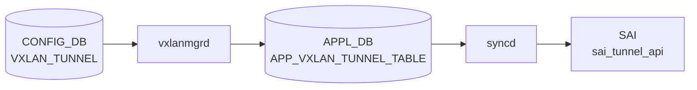

# VXLAN トンネルポート (Port::TUNNEL)

!!! warning "CONFIG_DB テーブルではない"
    VXLAN トンネルポートは [CONFIG_DB](../../reference/glossary.md#term-config_db) のテーブルではなく、`orchagent` 内の `PortsOrch` が `m_portList` に保持するランタイムオブジェクト。`sonic-yang-models` に対応 [YANG](../../reference/glossary.md#term-yang) モジュールは存在しない。本ページは `PortsOrch::addTunnel()` / `addBridgePort()` のコード由来デフォルトを解説する。

## 概要

[VXLAN](../../reference/glossary.md#term-vxlan) トンネルポートは `Port::TUNNEL` 型の `Port` 構造体として `orchagent` 内部に保持される。[CONFIG_DB](../../reference/glossary.md#term-config_db) の `VXLAN_TUNNEL_MAP` または `EVPN_REMOTE_VNI_TABLE` の処理結果として動的生成されるものであり、オペレータが直接設定する対象ではない[^1]。

トンネルポートには 2 種類ある。

| 種別 | 名前形式 | 生成トリガー |
|------|---------|------------|
| Local SRC [VTEP](../../reference/glossary.md#term-vtep) ポート | `Port_SRC_VTEP_<src_ip>` | `VXLAN_TUNNEL_MAP` 処理 (DIP トンネル非サポート時) |
| [EVPN](../../reference/glossary.md#term-evpn) DIP トンネルポート | `Port_EVPN_<remote_vtep_ip>` | `addTunnelUser()` ([EVPN](../../reference/glossary.md#term-evpn) リモート [VTEP](../../reference/glossary.md#term-vtep) 学習時) |

<!-- cdb-mermaid -->
### データフロー (自動生成)



!!! note "凡例"
    CONFIG_DB から SAI までの典型経路を `docs/reference/config-db-orch-map.md` から機械生成したミニ図。詳細・例外は本ページ本文と対応表を参照。
<!-- /cdb-mermaid -->

## 命名規則

| プレフィックス定数 | 値 | 場所 |
|-----------------|-----|------|
| `LOCAL_TUNNEL_PORT_PREFIX` | `"Port_SRC_VTEP_"` | `vxlanorch.h:41` |
| `EVPN_TUNNEL_PORT_PREFIX` | `"Port_EVPN_"` | `vxlanorch.h:42` |

命名は `getTunnelPortName(vtep, local)` が `local=true` の場合に `LOCAL_TUNNEL_PORT_PREFIX`、`false` の場合に `EVPN_TUNNEL_PORT_PREFIX` を vtep IP に連結して生成する[^1]。

## 生成フロー

### EVPN DIP トンネルポート (DIP トンネルサポート有り)

```
addTunnelUser(remote_vtep, vni_id, ...) [vxlanorch.cpp:1674]
  → createDynamicDIPTunnel(remote_vtep) [vxlanorch.cpp:1707]
  → getTunnelPort(remote_vtep) が false の場合のみ新規生成
  → gPortsOrch->addTunnel("Port_EVPN_<vtep>", tunnel_id, hwlearning=false)
  → gPortsOrch->addBridgePort(tunnelPort)
```

### Local SRC VTEP ポート (DIP トンネル非サポート時)

```
VxlanTunnelMapOrch::addOperation [vxlanorch.cpp:2079]
  → getTunnelPort(src_vtep, local=true) が false の場合のみ新規生成
  → gPortsOrch->addTunnel("Port_SRC_VTEP_<src_ip>", tunnel_id, hwlearning=false)
  → gPortsOrch->addBridgePort(tunPort)
```

## 購読者

- `VxlanTunnelOrch::addTunnelUser()`: [EVPN](../../reference/glossary.md#term-evpn) DIP トンネルポートを生成
- `VxlanTunnelMapOrch::addOperation()`: Local SRC [VTEP](../../reference/glossary.md#term-vtep) ポートを生成 (DIP 非サポート時)
- `VxlanTunnelOrch::deleteTunnelPort()`: [FDB](../../reference/glossary.md#term-fdb) カウントが 0 の場合にポートを削除
- `VxlanTunnelOrch::updateDbTunnelOperStatus()`: [STATE_DB](../../reference/glossary.md#term-state_db) の oper status を更新

<!-- defaults -->
## コード由来の暗黙デフォルト (Phase A)

以下のデフォルト値は DB フィールドとして公開されず、`portsorch.cpp` / `vxlanorch.cpp` 内でハードコードまたは暗黙的に設定される[^1]。

| フィールド / [SAI](../../reference/glossary.md#term-sai) 属性 | デフォルト / 実挙動 | 分類 | 根拠 |
|----------------------|--------------------|------|------|
| `m_type` | 常に `Port::TUNNEL` ハードコード | ハードコード | `portsorch.cpp:8362` |
| `m_learn_mode` ([FDB](../../reference/glossary.md#term-fdb) 学習) | 常に `SAI_BRIDGE_PORT_FDB_LEARNING_MODE_DISABLE` — `hwlearning=false` が固定で渡される | ハードコード | `vxlanorch.cpp:1719`, `vxlanorch.cpp:2082`, `portsorch.cpp:8370` |
| `m_oper_status` 初期値 | `SAI_PORT_OPER_STATUS_DOWN` — トンネルポート作成直後は常に DOWN | ハードコード初期値 | `portsorch.cpp:8372` |
| [SAI](../../reference/glossary.md#term-sai) bridge type | `SAI_BRIDGE_PORT_TYPE_TUNNEL` ハードコード | ハードコード | `portsorch.cpp:7230` |
| [SAI](../../reference/glossary.md#term-sai) bridge | `m_default1QBridge` (デフォルト 1Q ブリッジ固定) | ハードコード | `portsorch.cpp:7238` |
| SAI admin state | `true` (UP) — ブリッジポート作成時に常に UP | ハードコード | `portsorch.cpp:7250` |
| `m_fdb_count` 初期値 | `0` | ハードコード初期値 | `port.h:234` |
| CONFIG_DB フィールド | なし — 全属性がコード内で固定 | CONFIG_DB 非連動 | [YANG](../../reference/glossary.md#term-yang) 定義なし |

### 詳細: FDB 学習の無効化

`VxlanTunnelOrch::addTunnelUser()` (vxlanorch.cpp:1719) および
`VxlanTunnelMapOrch::addOperation()` (vxlanorch.cpp:2082) はどちらも
`gPortsOrch->addTunnel(name, id, false)` を呼ぶ。`hwlearning=false` により
`PortsOrch::addTunnel()` 内で `m_learn_mode = SAI_BRIDGE_PORT_FDB_LEARNING_MODE_DISABLE` が設定され、
後続の `addBridgePort()` で SAI ブリッジポートの `FDB_LEARNING_MODE` 属性として渡される。
結果として、すべての [VXLAN](../../reference/glossary.md#term-vxlan) トンネルポートで HW [FDB](../../reference/glossary.md#term-fdb) 学習は **常に無効**。CONFIG_DB から
この挙動を変更する手段はない[^1]。

### 詳細: 削除ガード

`deleteTunnelPort()` (vxlanorch.cpp:1792) および `delTunnelUser()` は
`tunnelPort.m_fdb_count != 0` を確認し、FDB エントリが残存する間は
`removeBridgePort()` を呼ばない。削除は FDB エージング後まで遅延する。

<!-- /defaults -->

<!-- ordering -->
## 書込み順依存 (Phase B)

`VxlanTunnelOrch` / `VxlanTunnelMapOrch` / `EvpnNvoOrch` はトンネルポート生成前に複数の前提条件を確認する。各ガードが失敗すると `return false` で再試行キューに戻るため、順序が逆になっても最終的には収束するが、中間状態でトンネルポートが存在しない期間が生じる[^1]。

### 検出された順序依存

| # | 先行必須 | 後続処理 | 違反時の動作 | 自動回復 |
|---|----------|----------|-------------|---------|
| 1 | `VXLAN_TUNNEL` が CONFIG_DB に存在 | `VXLAN_TUNNEL_MAP` が [orchagent](../../reference/glossary.md#term-orchagent) に処理される | `tunnel_obj` null → `return false` → 再試行 | あり |
| 2 | `VXLAN_EVPN_NVO` が [orchagent](../../reference/glossary.md#term-orchagent) に処理済み | `addTunnelUser` による `Port_EVPN_*` 生成 | `getEVPNVtep()==NULL` → WARN + `return false` | あり |
| 3 | `VXLAN_TUNNEL_MAP` 処理で `active_=true` | `addTunnelUser` の `isActive()` ガード通過 | `isActive()==false` → WARN + `return false` | あり |
| 4 | `VXLAN_TUNNEL_MAP` が存在 | `Port_SRC_VTEP_*` 生成 (DIP 非サポート時) | 生成トリガーが存在しない（永続的） | なし |

### 主要な制約詳細

**VXLAN_EVPN_NVO 先行必須 (依存 #2)**: `addTunnelUser` (vxlanorch.cpp:1685) は `evpn_orch->getEVPNVtep()` を呼ぶ。`VXLAN_EVPN_NVO` エントリが CONFIG_DB に書かれ `EvpnNvoOrch::addOperation` (vxlanorch.cpp:2776) が実行されることで `source_vtep_ptr` が設定される。それ以前は `getEVPNVtep()` が `NULL` を返し、`SWSS_LOG_WARN("Unable to find EVPN VTEP")` が記録されてトンネルポートは生成されない。[BGP](../../reference/glossary.md#term-bgp) が EVPN リモート VTEP を学習しても `VXLAN_EVPN_NVO` が未設定なら `Port_EVPN_*` は作られない。

**VTEP isActive() ガード (依存 #3)**: `vtep_ptr->isActive()` (vxlanorch.cpp:1694) は `createTunnelHw()` が SAI `create_tunnel()` を成功させた後に `active_ = true` となる (vxlanorch.cpp:939)。`VXLAN_TUNNEL_MAP` または `VXLAN_VRF_MAP` の追加処理が完了していなければ `active_=false` のままであり、`addTunnelUser` は `SWSS_LOG_WARN("VTEP not yet active")` を出力して失敗する。

**DIP 非サポート時の恒久的依存 (依存 #4)**: `isDipTunnelsSupported() == false` の環境では `Port_SRC_VTEP_*` ポートは `VxlanTunnelMapOrch::addOperation` の内部でのみ生成される。`VXLAN_TUNNEL_MAP` エントリが存在しない限り生成トリガーがなく、自動回復しない。

<!-- /ordering -->

<!-- cross-refs -->
## 暗黙参照テーブル (Phase C)

[VXLAN](../../reference/glossary.md#term-vxlan) トンネルポートオブジェクト (`Port::TUNNEL`) は CONFIG_DB テーブルを直接購読しないが、生成・削除・状態更新の各フェーズで以下のオブジェクト / テーブルを暗黙的に参照する。

| 参照先テーブル / リソース | 参照方向 | 条件 | 参照元 evidence |
|--------------------------|---------|------|----------------|
| `VXLAN_EVPN_NVO` (CONFIG_DB) | 読み取り (`gDirectory.get<EvpnNvoOrch*>()`) | `addTunnelUser()` 呼び出し時に `evpn_orch->getEVPNVtep()` を取得。未設定なら `Port_EVPN_*` 生成不可 | `vxlanorch.cpp:1678`, `vxlanorch.cpp:1685-1692` |
| `VXLAN_TUNNEL` (CONFIG_DB) | 読み取り (SAI トンネル OID) | `addTunnel(port_name, tunnel_id, ...)` の `tunnel_id` 引数は SIP トンネルの SAI OID。`isActive()` が `false` なら生成ブロック | `vxlanorch.cpp:1694-1699`, `vxlanorch.cpp:1719` |
| `VXLAN_TUNNEL_MAP` (CONFIG_DB) | 読み取り (生成トリガー) | DIP 非サポート環境では `VxlanTunnelMapOrch::addOperation` からのみ `Port_SRC_VTEP_*` が生成される | `vxlanorch.cpp:2079-2082` |
| `STATE_DB:VXLAN_TUNNEL_TABLE` | 書き込み | `updateDbTunnelOperStatus()` がトンネルポートの `operstatus`（`up`/`down`）を [STATE_DB](../../reference/glossary.md#term-state_db) に反映 | `vxlanorch.cpp:1893-1912` |
| `PortsOrch::m_portList` (内部) | 書き込み / 読み取り | `addTunnel()` がポートオブジェクトを登録。`getTunnelPort()` が名前で検索して重複防止 | `portsorch.cpp:8362`, `vxlanorch.cpp:1715`, `vxlanorch.cpp:1957-1966` |
| `PortsOrch::m_default1QBridge` (内部) | 読み取り (ハードコード) | `addBridgePort()` が SAI `SAI_BRIDGE_PORT_ATTR_BRIDGE_ID` にデフォルト 1Q ブリッジ OID を使用 | `portsorch.cpp:7238` |
| `FdbOrch` (間接) | 参照カウント | `m_fdb_count` が 0 になるまでブリッジポート削除がブロックされる。FDB エントリの追加・削除は FdbOrch が管理 | `vxlanorch.cpp:1770-1776`, `port.h:234` |

!!! note "STATE_DB への operstatus 書き込み"
    `updateDbTunnelOperStatus()` (vxlanorch.cpp:1893) は `STATE_DB:VXLAN_TUNNEL_TABLE` の `operstatus` フィールドを `"up"` / `"down"` で更新する。初期値は `"down"` で、アンダーレイルートが確立されて SAI ポートイベントが `UP` を通知した時点で `"up"` に遷移する。

> 詳細スキャンノート: `meta/_intermediate/cdb-flow/tunnel-port-ordering.md`

<!-- /cross-refs -->

<!-- failure -->
## 失敗挙動マトリクス (Phase D)

### SET 処理 (addTunnelUser / VxlanTunnelMapOrch::addOperation) における失敗経路

| 失敗条件 | 検出箇所 | 結果 | ログ出力 | evidence |
|---|---|---|---|---|
| `evpn_orch->getEVPNVtep()` が NULL (`VXLAN_EVPN_NVO` 未設定) | `addTunnelUser()` | `return false` → Orch 再試行キューへ。`Port_EVPN_*` は生成されない | `SWSS_LOG_WARN("Unable to find EVPN VTEP. user=%d remote_vtep=%s")` | `vxlanorch.cpp:1689-1692` |
| `vtep_ptr->isActive()` が false (SIP トンネル HW 未作成) | `addTunnelUser()` | `return false` → Orch 再試行キューへ。`Port_EVPN_*` は生成されない | `SWSS_LOG_WARN("VTEP not yet active.user=%d remote_vtep=%s")` | `vxlanorch.cpp:1696-1699` |
| `sai_bridge_api->create_bridge_port()` が SAI_STATUS_SUCCESS 以外を返す | `PortsOrch::addBridgePort()` | `handleSaiCreateStatus()` を実行。`task_success` 以外なら `parseHandleSaiStatusFailure()` が呼ばれ `return false` | `SWSS_LOG_ERROR("Failed to add bridge port %s to default 1Q bridge, rv:%d")` | `portsorch.cpp:7261-7265` |
| `setHostIntfsStripTag()` が false を返す (hostif [VLAN](../../reference/glossary.md#term-vlan) タグ設定失敗) | `PortsOrch::addBridgePort()` 末尾 | `return false` — `bridge_port_id` は設定済みだが `m_portList` 更新・通知がスキップされる | `SWSS_LOG_ERROR("Failed to set %s for hostif of port %s")` | `portsorch.cpp:7272-7274` |
| [VLAN](../../reference/glossary.md#term-vlan) ID が [VLAN](../../reference/glossary.md#term-vlan) テーブルに存在しない (DIP 非サポート時) | `VxlanTunnelMapOrch::addOperation()` | `return false` — Local SRC VTEP ポートも生成されない | `SWSS_LOG_WARN("Vxlan tunnel map vlan id doesn't exist: %d")` | `vxlanorch.cpp:2032` |
| VNI ID が最大値超過 (`vni_id >= (1 << 24)`) | `VxlanTunnelMapOrch::addOperation()` | `return false` — 恒久エラー | `SWSS_LOG_ERROR("Vxlan tunnel map vni id is too big: %d")` | `vxlanorch.cpp:2039` |
| `VXLAN_TUNNEL` が CONFIG_DB に存在しない | `VxlanTunnelMapOrch::addOperation()` | `return false` → Orch 再試行キューへ | `SWSS_LOG_WARN("Vxlan tunnel '%s' doesn't exist")` | `vxlanorch.cpp:2049` |

### DEL 処理 (delTunnelUser / deleteTunnelPort) における失敗経路

| 失敗条件 | 検出箇所 | 結果 | ログ出力 | evidence |
|---|---|---|---|---|
| `evpn_orch->getEVPNVtep()` が NULL (削除時) | `delTunnelUser()` | `return true` (操作完了扱い) — ポート削除はスキップされ SAI リソースが残留する可能性 | `SWSS_LOG_WARN("Unable to find VTEP. remote=%s vlan=%d usr=%d")` | `vxlanorch.cpp:1738-1741` |
| `sai_bridge_api->set_bridge_port_attribute(ADMIN_STATE=DOWN)` 失敗 | `PortsOrch::removeBridgePort()` | `parseHandleSaiStatusFailure()` → `return false` — 削除処理が中断し SAI bridge port が残留 | `SWSS_LOG_ERROR("Failed to set bridge port %s admin status to DOWN, rv:%d")` | `portsorch.cpp:7303-7308` |
| `sai_bridge_api->remove_bridge_port()` 失敗 | `PortsOrch::removeBridgePort()` | `parseHandleSaiStatusFailure()` → `return false` | `SWSS_LOG_ERROR("Failed to remove bridge port %s from default 1Q bridge, rv:%d")` | `portsorch.cpp:7327-7332` |
| `deleteTunnelPort()` 時に `evpn_orch->getEVPNVtep()` が NULL | `deleteTunnelPort()` | `return` — ブリッジポート・トンネルポートが削除されずに処理終了 | `SWSS_LOG_WARN("Unable to find VTEP. tunnelPort=%s")` | `vxlanorch.cpp:1803` |
| DIP サポート有り環境で `refcnt > 0` (IMR/IP ルートが残存) | `deleteTunnelPort()` | ブリッジポート削除をスキップ — 意図的なガード。ルート削除後に再呼び出しが必要 | `SWSS_LOG_INFO("Tunnel bridge port not removed. remote = %s refcnt = %d")` | `vxlanorch.cpp:1826-1829` |
| `m_fdb_count != 0` の状態で削除試行 | `delTunnelUser()` / `deleteTunnelPort()` | `removeBridgePort()` は実行されるが SAI がエラーを返す場合あり。呼出し元は `return true` で完了扱い | `SWSS_LOG_ERROR("Remove Bridge port failed for remote = %s fdbcount = %d")` | `vxlanorch.cpp:1775, 1839` |

### 失敗時の自動回復動作

| 失敗パターン | 自動回復 | 回復条件 |
|---|---|---|
| `getEVPNVtep()` NULL → `addTunnelUser()` 失敗 | あり | `VXLAN_EVPN_NVO` が CONFIG_DB に書き込まれると次の SET イベントで成功する |
| `isActive()` false → `addTunnelUser()` 失敗 | あり | `VXLAN_TUNNEL_MAP` 処理完了で `active_=true` となり、次の SET で成功する |
| VLAN 未設定 → `addOperation()` 失敗 | あり | VLAN が作成されると Orch が再実行される |
| SAI `create_bridge_port()` 失敗 | SAI 依存 | SAI がリトライ可能ステータスを返せば `handleSaiCreateStatus` がキューに戻す |
| `m_fdb_count != 0` でブリッジポート削除ブロック | あり | FDB エントリがエージング後に `deleteTunnelPort()` が再呼び出しされると削除が進行する |

> スキャンノート: `meta/_intermediate/cdb-flow/tunnel-port-failure.md`

<!-- /failure -->

<!-- constants -->
## ハードコード定数 (Phase E)

CONFIG_DB の VXLAN_TUNNEL_MAP / VXLAN_EVPN_NVO テーブルから読み込まれず、コードに直書きされている定数。`config_db.json` での設定変更は効果なく、変更にはコードのリコンパイルが必要。

### ポート名プレフィックス

| 定数名 | 値 | 定義場所 | 用途 |
|--------|----|---------|------|
| `LOCAL_TUNNEL_PORT_PREFIX` | `"Port_SRC_VTEP_"` | `vxlanorch.h:41` | Local SRC VTEP ポート名の先頭文字列。`getTunnelPortName(vtep, local=true)` が vtep IP と連結して `"Port_SRC_VTEP_<vtep_ip>"` を生成 |
| `EVPN_TUNNEL_PORT_PREFIX` | `"Port_EVPN_"` | `vxlanorch.h:42` | EVPN DIP トンネルポート名の先頭文字列。`getTunnelPortName(vtep, local=false)` が vtep IP と連結 |
| `EVPN_TUNNEL_NAME_PREFIX` | `"EVPN_"` | `vxlanorch.h:43` | EVPN DIP トンネルオブジェクト (`VxlanTunnel` インスタンス) の名前プレフィックス。ポート名 (`Port_EVPN_*`) とは別オブジェクト |

### VNI / VLAN 検証境界値

| 定数名 | 値 | 定義場所 | 用途 |
|--------|----|---------|------|
| `MIN_VLAN_ID` | `1` | `vxlanorch.h:45` | VLAN ID 下限。`to_uint<sai_vlan_id_t>()` の範囲チェックで使用 |
| `MAX_VLAN_ID` | `4095` | `vxlanorch.h:46` | VLAN ID 上限。超過は parse 時にエラー |
| `MAX_VNI_ID` | `16777215` | `vxlanorch.h:48` | VNI 上限 (2^24 − 1)。`vni_id >= MAX_VNI_ID` の場合 `SWSS_LOG_ERROR` を出力し `return true`（恒久エラー）でリトライされない |

### encap TTL・FlexCounter

| 定数名 | 値 | 定義場所 | 用途 |
|--------|----|---------|------|
| `DEFAULT_TUNNEL_ENCAP_TTL` | `255` | `vxlanorch.h:49` | VXLAN encap パケットの TTL デフォルト値。YANG / CONFIG_DB に対応フィールドなし |
| `TUNNEL_STAT_COUNTER_FLEX_COUNTER_GROUP` | `"TUNNEL_STAT_COUNTER"` | `vxlanorch.h:39` | FlexCounterManager に登録するカウンタグループ名 |
| `TUNNEL_STAT_FLEX_COUNTER_POLLING_INTERVAL_MS` | `10000` | `vxlanorch.h:40` | [FlexCounter](../../reference/glossary.md#term-flexcounter) のポーリング間隔 (ms)。10 秒固定。CONFIG_DB から変更不可 |
| `FLEX_COUNTER_UPD_INTERVAL` | `1` | `vxlanorch.cpp:36` | [FlexCounter](../../reference/glossary.md#term-flexcounter) 更新タイマーの秒数 |

### SAI 属性のハードコード値

`PortsOrch::addTunnel()` / `PortsOrch::addBridgePort()` 内に直書きされた SAI 属性値。CONFIG_DB フィールドに対応しない。

| SAI 属性 | 値 | 定義箇所 |
|----------|----|---------|
| `SAI_BRIDGE_PORT_ATTR_TYPE` | `SAI_BRIDGE_PORT_TYPE_TUNNEL` | `portsorch.cpp:7230` |
| `SAI_BRIDGE_PORT_ATTR_BRIDGE_ID` | `m_default1QBridge` (デフォルト 1Q ブリッジ固定) | `portsorch.cpp:7238` |
| `SAI_BRIDGE_PORT_ATTR_ADMIN_STATE` | `true` (UP) | `portsorch.cpp:7250` |
| `SAI_BRIDGE_PORT_ATTR_FDB_LEARNING_MODE` | `SAI_BRIDGE_PORT_FDB_LEARNING_MODE_DISABLE` (`hwlearning=false` 固定) | `portsorch.cpp:8370` |
| `m_oper_status` 初期値 | `SAI_PORT_OPER_STATUS_DOWN` | `portsorch.cpp:8373` |

!!! warning "MAX_VNI_ID 超過は恒久エラー"
    `vni_id >= MAX_VNI_ID` (≥ 2^24) のエントリは `VxlanTunnelMapOrch::addOperation()` が
    `return true` を返すため、Orch の再試行キューに戻されない。
    設定値の誤りは再起動してエントリを修正するまで回復しない。

> 詳細スキャンノート: `meta/_intermediate/cdb-flow/tunnel-port-constants.md`

<!-- /constants -->

<!-- side-effects -->
## 副次 DB 書込 (Phase F)

`PortsOrch::addTunnel()` / `addBridgePort()` / `VxlanTunnelOrch` がトンネルポート生成・削除時に引き起こす副次的な DB 書込とシステム副作用。

| 副次 DB | テーブル / キー | トリガ | タイミング |
|---------|--------------|--------|----------|
| [STATE_DB](../../reference/glossary.md#term-state_db) | `VXLAN_TUNNEL_TABLE\|<tunnel_name>` (`operstatus`: `up`/`down`) | SAI ポートステータス変化イベント → `updateDbTunnelOperStatus()` (vxlanorch.cpp:1893) | トンネルポート生成後、アンダーレイ経路確立時に非同期 |
| [COUNTERS_DB](../../reference/glossary.md#term-counters_db) | `COUNTERS_TUNNEL_NAME_MAP` / `COUNTERS_TUNNEL_TYPE_MAP` | `doTask(SelectableTimer)` → `m_tunnelNameTable->set()` / `m_tunnelTypeTable->set()` (vxlanorch.cpp:1322–1335) | `addTunnelToFlexCounter()` 登録後、最大 1 秒遅延 (SelectableTimer 発火まで) |
| [ASIC_DB](../../reference/glossary.md#term-asic_db) (SAI) | `SAI_OBJECT_TYPE_BRIDGE_PORT:<oid>` | `sai_bridge_api->create_bridge_port()` via `addBridgePort()` ([portsorch](../../reference/glossary.md#term-portsorch).cpp:7258) | `addBridgePort()` 呼出と同期 |
| [APPL_DB](../../reference/glossary.md#term-appl_db) | なし | `VxlanTunnelOrch` / `PortsOrch` の `addTunnel()` / `addBridgePort()` に [APPL_DB](../../reference/glossary.md#term-appl_db) 書込なし | — |
| CONFIG_DB | なし | 読取専用。書戻しなし | — |

### 詳細: STATE_DB 書込シーケンス

`addTunnel()` / `addBridgePort()` 自体は STATE_DB を触らない。STATE_DB への `operstatus` 書込は下記の経路で非同期に発生する:

```
SAI ポートステータス変化イベント
  → VxlanTunnelOrch::updateDbTunnelOperStatus(tunnel_portname, status)
  → getTunnelNameFromPort(tunnel_portname, tunnel_name)  ← Port_EVPN_* → EVPN_* へ変換
  → m_stateVxlanTable.set(tunnel_name, [{"operstatus", "up"|"down"}])
  → STATE_DB::VXLAN_TUNNEL_TABLE|<tunnel_name>
```

トンネルポート生成直後は常に `SAI_PORT_OPER_STATUS_DOWN` 初期値（`portsorch.cpp:8373`）で始まり、アンダーレイの [BGP](../../reference/glossary.md#term-bgp)/IGP ルートが到達可能になった時点で `up` に遷移する[^1]。

### 詳細: COUNTERS_DB 書込と FlexCounter

`addTunnelToFlexCounter(oid, name)` (vxlanorch.cpp:1342) は `m_pendingAddToFlexCntr[oid] = name` に追加するのみ。実際の [COUNTERS_DB](../../reference/glossary.md#term-counters_db) 書込は `doTask(SelectableTimer)` が `FLEX_COUNTER_UPD_INTERVAL` (1 秒) ごとに発火した際に行われる:

- `COUNTERS_DB::COUNTERS_TUNNEL_NAME_MAP`: `{tunnel_name → sai_oid}` マッピング追加
- `COUNTERS_DB::COUNTERS_TUNNEL_TYPE_MAP`: `{sai_oid → "SAI_TUNNEL_TYPE_VXLAN"}` 追加
- `tunnel_stat_manager->setCounterIdList(oid, CounterType::TUNNEL, stats)`: [FLEX_COUNTER_DB](../../reference/glossary.md#term-flex_counter_db) 登録

対象は **VxlanTunnel SAI オブジェクト OID** (tunnel_id) であり、Port::TUNNEL ブリッジポート OID (bridge_port_id) ではない。

### 詳細: Observer 通知

`addBridgePort()` 終端 ([portsorch](../../reference/glossary.md#term-portsorch).cpp:7280–7281) が `SUBJECT_TYPE_BRIDGE_PORT_CHANGE` 通知を発行する。購読者は `IsolationGroupOrch` のみ (isolationgrouporch.cpp:233)。`IsolationGroupOrch` は Port::TUNNEL 型を特別扱いしないため、通知は到達するが実質的な副作用は発生しない。

> 詳細スキャンノート: `meta/_intermediate/cdb-flow/tunnel-port-side.md`

<!-- /side-effects -->

<!-- pubsub -->
## 通信メカニズム (Phase G)

`Port::TUNNEL` は CONFIG_DB / [APPL_DB](../../reference/glossary.md#term-appl_db) テーブルを直接購読しない。親テーブル (`VXLAN_TUNNEL_MAP` / `VXLAN_EVPN_NVO`) の処理結果として動的生成されるオブジェクトであり、pubsub の観点では「PortsOrch が内部 API 経由で生成し、STATE_DB / [COUNTERS_DB](../../reference/glossary.md#term-counters_db) を書く」構造である[^1]。

### 書き込みパス

| 宛先 DB / API | 経路 | タイプ | タイミング |
|--------------|------|--------|----------|
| STATE_DB `VXLAN_TUNNEL_TABLE\|<name>` (`operstatus`) | SAI ポートイベント → `updateDbTunnelOperStatus()` (vxlanorch.cpp:1893) → `Table::set()` | [Redis](../../reference/glossary.md#term-redis) `HSET` 直接発行（[ProducerStateTable](../../reference/glossary.md#term-producerstatetable) ではない） | アンダーレイルート確立後、非同期 |
| COUNTERS_DB `COUNTERS_TUNNEL_NAME_MAP` / `COUNTERS_TUNNEL_TYPE_MAP` | `addTunnelToFlexCounter()` → `SelectableTimer` 発火 (vxlanorch.cpp:1322–1335) | `Table::set()` | 最大 1 秒遅延 (タイマー発火まで) |
| [ASIC_DB](../../reference/glossary.md#term-asic_db) (SAI) | `create_bridge_port()` 直接呼び出し via `addBridgePort()` ([portsorch](../../reference/glossary.md#term-portsorch).cpp:7258) | SAI API 同期呼び出し | `addBridgePort()` と同期 |

### in-process Observer 通知

`PortsOrch::addBridgePort()` / `removeBridgePort()` 末尾 (portsorch.cpp:7280–7281) が `SUBJECT_TYPE_BRIDGE_PORT_CHANGE` を in-process Observer パターンで発行する。購読者は `IsolationGroupOrch` のみ (isolationgrouporch.cpp:233)。`Port::TUNNEL` 型に対する特別処理はなく、実質的な副作用は発生しない。この通知は [Redis](../../reference/glossary.md#term-redis) Pub/Sub チャンネルではなく、`m_observers` 経由のプロセス内通知である。

!!! note "Redis Pub/Sub は使用しない"
    `Port::TUNNEL` の生成・削除は `ProducerStateTable` / `ConsumerStateTable` 型の Redis Pub/Sub を介さない。STATE_DB / COUNTERS_DB への書込は `Table` 型 (`HSET` 直接発行) であり、外部プロセスへの通知チャンネルは発生しない。VXLAN_TUNNEL_TABLE の変化を知るためには STATE_DB をポーリングするか keyspace notification を利用する必要がある。

> 詳細スキャンノート: `meta/_intermediate/cdb-flow/tunnel-port-pubsub.md`

<!-- /pubsub -->

<!-- platform -->
## プラットフォーム差異 (Phase H)

VXLAN トンネルポートの生成モデルはプラットフォームの SAI 実装が `SAI_TUNNEL_ATTR_PEER_MODE` として `SAI_TUNNEL_PEER_MODE_P2P` をサポートするかどうかで二分される。この違いは `VxlanTunnelOrch` コンストラクタが SAI ケイパビリティクエリを実行することで起動時に確定し、以後 `isDipTunnelsSupported()` フラグで全処理パスを切り替える[^1]。

### SAI ケイパビリティクエリ（起動時決定）

```
VxlanTunnelOrch::VxlanTunnelOrch() [vxlanorch.cpp:1245]
  → sai_query_attribute_enum_values_capability(
        gSwitchId,
        SAI_OBJECT_TYPE_TUNNEL,
        SAI_TUNNEL_ATTR_PEER_MODE,
        &values)
  → SAI_STATUS_SUCCESS かつ P2P を含む → is_dip_tunnel_supported = true
  → それ以外 (失敗 / P2P 未含) → is_dip_tunnel_supported = false
```

`sai_query_attribute_enum_values_capability` が `SAI_STATUS_SUCCESS` 以外を返す場合はデフォルトで `true`（P2P サポートあり）とみなされる (`vxlanorch.cpp:1261`)。

### プラットフォームモード別の挙動差異

| 項目 | DIP サポートあり (`isDipTunnelsSupported() == true`) | DIP サポートなし (`isDipTunnelsSupported() == false`) |
|------|------------------------------------------------------|------------------------------------------------------|
| EVPN DIP トンネルポート (`Port_EVPN_*`) | リモート VTEP ごとに P2P SAI トンネルと個別ブリッジポートを生成 | 生成されない (`addTunnelUser()` が `return false` で終了) |
| Local SRC VTEP ポート (`Port_SRC_VTEP_*`) | 使用しない (`VxlanTunnelMapOrch::addOperation` では `getTunnelPort` 呼び出しをスキップ) | `VXLAN_TUNNEL_MAP` 処理時に単一ポートを生成し、全リモート VTEP を共用 |
| SAI トンネル `PEER_MODE` | `SAI_TUNNEL_PEER_MODE_P2P` (DIP ごと) | `SAI_TUNNEL_PEER_MODE_P2MP` (共用) |
| `EvpnRemoteVni` Orch 登録 | `EvpnRemoteVnip2pOrch` (p2p) | `EvpnRemoteVnip2mpOrch` (p2mp) |
| orchdaemon での Orch 選択 | `orchdaemon.cpp:577` | `orchdaemon.cpp:582` |

### プラットフォームモードの確認方法

```bash
# orchagent 起動ログで確認
journalctl -u swss | grep -E "dip_tunnel|DIP"

# STATE_DB に Port_EVPN_* が存在すれば DIP サポートあり
sonic-db-cli STATE_DB keys 'VXLAN_TUNNEL_TABLE|*'
```

!!! warning "DIP サポートなし環境での EVPN 制限"
    `isDipTunnelsSupported() == false` の環境では `Port_EVPN_*` が生成されず、すべてのリモート VTEP が単一の `Port_SRC_VTEP_*` ポートを共用する。この場合、リモート VTEP ごとの FlexCounter 統計が取れず、リモート VTEP 単位のトラフィック分離もハードウェアレベルでは不可能となる。

> 詳細スキャンノート: `meta/_intermediate/cdb-flow/tunnel-port-platform.md`

<!-- /platform -->

## 例外条件・特殊挙動

- **二重生成の防止**: `getTunnelPort()` が既存エントリを発見した場合 `addTunnel()` を呼ばない。ポートは 1 remote VTEP につき 1 つのみ存在する (`vxlanorch.cpp:1715`)。
- **DIP トンネル非サポート時の縮退**: `isDipTunnelsSupported()` が `false` の場合、EVPN DIP トンネルポートは生成されず、Local SRC VTEP ポート 1 つがすべてのリモート VTEP を共用する (`vxlanorch.cpp:1701-1704`)。
- **FDB カウント残留による削除ブロック**: `m_fdb_count != 0` の間はブリッジポート削除がスキップされ `SWSS_LOG_ERROR` が記録される。FDB エントリのエージングが必要 (`vxlanorch.cpp:1770-1776`)。
- **STATE_DB oper status**: `updateDbTunnelOperStatus()` (vxlanorch.cpp:1893) が `SAI_PORT_OPER_STATUS_UP` / `DOWN` を STATE_DB の `VXLAN_TUNNEL_TABLE` に書き込む。初期は `DOWN` で始まり、アンダーレイルートが確立されると `UP` に遷移。

## 関連 CONFIG_DB / YANG / CLI

- 関連 [CONFIG_DB](../../reference/glossary.md#term-config_db): [`VXLAN_TUNNEL`](vxlan-tunnel.md)、[`VXLAN_TUNNEL_MAP`](vxlan-tunnel-map.md)、[`VXLAN_EVPN_NVO`](vxlan-evpn-nvo.md)
- 関連 [YANG](../../reference/glossary.md#term-yang): `sonic-vxlan` (tunnel port エントリなし)
- 関連 CLI: [`config vxlan`](../cli/config-vxlan.md)

<!-- ref-triangle:start -->

## 関連リファレンス

- CONFIG_DB: [`VXLAN_TUNNEL`](vxlan-tunnel.md)
- CONFIG_DB: [`VXLAN_TUNNEL_MAP`](vxlan-tunnel-map.md)
- CONFIG_DB: [EVPN DIP トンネル](vxlan-evpn-tunnel.md)
- CONFIG_DB: [VxlanTunnelOrch encap 処理詳細](tunnel-encap-orch.md)

<!-- ref-triangle:end -->

## 引用元

[^1]: VxlanTunnelOrch / PortsOrch 実装: `orchagent/vxlanorch.cpp`, `orchagent/portsorch.cpp`. <https://github.com/sonic-net/sonic-swss/blob/4305596156d70e9797e8a881b3d19b46de0bce0d/orchagent/vxlanorch.cpp>

## 関連ページ

- [HLD: VXLAN / VNet 全体設計](../../overlay/vxlan-sonic.md)
- [CONFIG_DB: VXLAN_TUNNEL](vxlan-tunnel.md)
- [CONFIG_DB: VXLAN_TUNNEL_MAP](vxlan-tunnel-map.md)
- [CONFIG_DB: EVPN DIP トンネル](vxlan-evpn-tunnel.md)
- [CONFIG_DB: VxlanTunnelOrch encap 処理詳細](tunnel-encap-orch.md)

<!-- ops-hint -->
## 運用ヒント

### トンネルポートの確認

```bash
# EVPN DIP トンネルポートは STATE_DB で確認
sonic-db-cli STATE_DB keys 'VXLAN_TUNNEL_TABLE|*'

# 個別トンネルの oper status
sonic-db-cli STATE_DB hgetall 'VXLAN_TUNNEL_TABLE|EVPN_<remote_vtep_ip>'

# show コマンド
show vxlan tunnel
show vxlan remotevtep
```

### よくある問題

- **FDB 残留でトンネルポート削除されない**: `m_fdb_count != 0` の間はブリッジポートが削除されない。`show vxlan remotevtep` でリモート VTEP が消えない場合は FDB エージングを待つ。
- **DIP トンネル非サポートプラットフォーム**: `isDipTunnelsSupported() = false` の場合は Local SRC VTEP ポートが 1 つだけ生成される。`Port_EVPN_*` は存在しない。
- **トンネルポート oper DOWN 継続**: アンダーレイルートが未到達の場合は oper status が `DOWN` のまま。[BGP](../../reference/glossary.md#term-bgp)/IGP のアンダーレイ経路を確認する。
<!-- /ops-hint -->

<!-- glossary-links-injected: 25d850426048 -->
