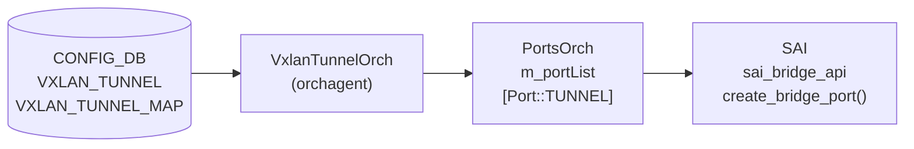

# VXLAN トンネルポート (Port::TUNNEL)

!!! warning "CONFIG_DB テーブルではない"
    VXLAN トンネルポートは [CONFIG_DB](../../reference/glossary.md#term-config_db) のテーブルではなく、`orchagent` 内の `PortsOrch` が `m_portList` に保持するランタイムオブジェクト。`sonic-yang-models` に対応 [YANG](../../reference/glossary.md#term-yang) モジュールは存在しない。本ページは `PortsOrch::addTunnel()` / `addBridgePort()` のコード由来デフォルトを解説する。

## 概要

[VXLAN](../../reference/glossary.md#term-vxlan) トンネルポートは `Port::TUNNEL` 型の `Port` 構造体として `orchagent` 内部に保持される。[CONFIG_DB](../../reference/glossary.md#term-config_db) の `VXLAN_TUNNEL_MAP` または `EVPN_REMOTE_VNI_TABLE` の処理結果として動的生成されるものであり、オペレータが直接設定する対象ではない[^1]。

トンネルポートには 2 種類ある。

| 種別 | 名前形式 | 生成トリガー |
|------|---------|------------|
| Local SRC VTEP ポート | `Port_SRC_VTEP_<src_ip>` | `VXLAN_TUNNEL_MAP` 処理 (DIP トンネル非サポート時) |
| EVPN DIP トンネルポート | `Port_EVPN_<remote_vtep_ip>` | `addTunnelUser()` (EVPN リモート VTEP 学習時) |

<!-- cdb-mermaid -->
### データフロー



<!-- /cdb-mermaid -->

## 命名規則

| プレフィックス定数 | 値 | 場所 |
|-----------------|-----|------|
| `LOCAL_TUNNEL_PORT_PREFIX` | `"Port_SRC_VTEP_"` | `vxlanorch.h:41` |
| `EVPN_TUNNEL_PORT_PREFIX` | `"Port_EVPN_"` | `vxlanorch.h:42` |

命名は `getTunnelPortName(vtep, local)` が `local=true` の場合に `LOCAL_TUNNEL_PORT_PREFIX`、`false` の場合に `EVPN_TUNNEL_PORT_PREFIX` を vtep IP に連結して生成する[^1]。

## 生成フロー

### EVPN DIP トンネルポート (DIP トンネルサポート有り)

```
addTunnelUser(remote_vtep, vni_id, ...) [vxlanorch.cpp:1674]
  → createDynamicDIPTunnel(remote_vtep) [vxlanorch.cpp:1707]
  → getTunnelPort(remote_vtep) が false の場合のみ新規生成
  → gPortsOrch->addTunnel("Port_EVPN_<vtep>", tunnel_id, hwlearning=false)
  → gPortsOrch->addBridgePort(tunnelPort)
```

### Local SRC VTEP ポート (DIP トンネル非サポート時)

```
VxlanTunnelMapOrch::addOperation [vxlanorch.cpp:2079]
  → getTunnelPort(src_vtep, local=true) が false の場合のみ新規生成
  → gPortsOrch->addTunnel("Port_SRC_VTEP_<src_ip>", tunnel_id, hwlearning=false)
  → gPortsOrch->addBridgePort(tunPort)
```

## 購読者

- `VxlanTunnelOrch::addTunnelUser()`: EVPN DIP トンネルポートを生成
- `VxlanTunnelMapOrch::addOperation()`: Local SRC VTEP ポートを生成 (DIP 非サポート時)
- `VxlanTunnelOrch::deleteTunnelPort()`: FDB カウントが 0 の場合にポートを削除
- `VxlanTunnelOrch::updateDbTunnelOperStatus()`: STATE_DB の oper status を更新

<!-- defaults -->
## コード由来の暗黙デフォルト (Phase A)

以下のデフォルト値は DB フィールドとして公開されず、`portsorch.cpp` / `vxlanorch.cpp` 内でハードコードまたは暗黙的に設定される[^1]。

| フィールド / SAI 属性 | デフォルト / 実挙動 | 分類 | 根拠 |
|----------------------|--------------------|------|------|
| `m_type` | 常に `Port::TUNNEL` ハードコード | ハードコード | `portsorch.cpp:8362` |
| `m_learn_mode` (FDB 学習) | 常に `SAI_BRIDGE_PORT_FDB_LEARNING_MODE_DISABLE` — `hwlearning=false` が固定で渡される | ハードコード | `vxlanorch.cpp:1719`, `vxlanorch.cpp:2082`, `portsorch.cpp:8370` |
| `m_oper_status` 初期値 | `SAI_PORT_OPER_STATUS_DOWN` — トンネルポート作成直後は常に DOWN | ハードコード初期値 | `portsorch.cpp:8372` |
| SAI bridge type | `SAI_BRIDGE_PORT_TYPE_TUNNEL` ハードコード | ハードコード | `portsorch.cpp:7230` |
| SAI bridge | `m_default1QBridge` (デフォルト 1Q ブリッジ固定) | ハードコード | `portsorch.cpp:7238` |
| SAI admin state | `true` (UP) — ブリッジポート作成時に常に UP | ハードコード | `portsorch.cpp:7250` |
| `m_fdb_count` 初期値 | `0` | ハードコード初期値 | `port.h:234` |
| CONFIG_DB フィールド | なし — 全属性がコード内で固定 | CONFIG_DB 非連動 | YANG 定義なし |

### 詳細: FDB 学習の無効化

`VxlanTunnelOrch::addTunnelUser()` (vxlanorch.cpp:1719) および
`VxlanTunnelMapOrch::addOperation()` (vxlanorch.cpp:2082) はどちらも
`gPortsOrch->addTunnel(name, id, false)` を呼ぶ。`hwlearning=false` により
`PortsOrch::addTunnel()` 内で `m_learn_mode = SAI_BRIDGE_PORT_FDB_LEARNING_MODE_DISABLE` が設定され、
後続の `addBridgePort()` で SAI ブリッジポートの `FDB_LEARNING_MODE` 属性として渡される。
結果として、すべての VXLAN トンネルポートで HW FDB 学習は **常に無効**。CONFIG_DB から
この挙動を変更する手段はない[^1]。

### 詳細: 削除ガード

`deleteTunnelPort()` (vxlanorch.cpp:1792) および `delTunnelUser()` は
`tunnelPort.m_fdb_count != 0` を確認し、FDB エントリが残存する間は
`removeBridgePort()` を呼ばない。削除は FDB エージング後まで遅延する。

<!-- /defaults -->

<!-- ordering -->
## 書込み順依存 (Phase B)

`VxlanTunnelOrch` / `VxlanTunnelMapOrch` / `EvpnNvoOrch` はトンネルポート生成前に複数の前提条件を確認する。各ガードが失敗すると `return false` で再試行キューに戻るため、順序が逆になっても最終的には収束するが、中間状態でトンネルポートが存在しない期間が生じる[^1]。

### 検出された順序依存

| # | 先行必須 | 後続処理 | 違反時の動作 | 自動回復 |
|---|----------|----------|-------------|---------|
| 1 | `VXLAN_TUNNEL` が CONFIG_DB に存在 | `VXLAN_TUNNEL_MAP` が orchagent に処理される | `tunnel_obj` null → `return false` → 再試行 | あり |
| 2 | `VXLAN_EVPN_NVO` が orchagent に処理済み | `addTunnelUser` による `Port_EVPN_*` 生成 | `getEVPNVtep()==NULL` → WARN + `return false` | あり |
| 3 | `VXLAN_TUNNEL_MAP` 処理で `active_=true` | `addTunnelUser` の `isActive()` ガード通過 | `isActive()==false` → WARN + `return false` | あり |
| 4 | `VXLAN_TUNNEL_MAP` が存在 | `Port_SRC_VTEP_*` 生成 (DIP 非サポート時) | 生成トリガーが存在しない（永続的） | なし |

### 主要な制約詳細

**VXLAN_EVPN_NVO 先行必須 (依存 #2)**: `addTunnelUser` (vxlanorch.cpp:1685) は `evpn_orch->getEVPNVtep()` を呼ぶ。`VXLAN_EVPN_NVO` エントリが CONFIG_DB に書かれ `EvpnNvoOrch::addOperation` (vxlanorch.cpp:2776) が実行されることで `source_vtep_ptr` が設定される。それ以前は `getEVPNVtep()` が `NULL` を返し、`SWSS_LOG_WARN("Unable to find EVPN VTEP")` が記録されてトンネルポートは生成されない。BGP が EVPN リモート VTEP を学習しても `VXLAN_EVPN_NVO` が未設定なら `Port_EVPN_*` は作られない。

**VTEP isActive() ガード (依存 #3)**: `vtep_ptr->isActive()` (vxlanorch.cpp:1694) は `createTunnelHw()` が SAI `create_tunnel()` を成功させた後に `active_ = true` となる (vxlanorch.cpp:939)。`VXLAN_TUNNEL_MAP` または `VXLAN_VRF_MAP` の追加処理が完了していなければ `active_=false` のままであり、`addTunnelUser` は `SWSS_LOG_WARN("VTEP not yet active")` を出力して失敗する。

**DIP 非サポート時の恒久的依存 (依存 #4)**: `isDipTunnelsSupported() == false` の環境では `Port_SRC_VTEP_*` ポートは `VxlanTunnelMapOrch::addOperation` の内部でのみ生成される。`VXLAN_TUNNEL_MAP` エントリが存在しない限り生成トリガーがなく、自動回復しない。

<!-- /ordering -->

<!-- cross-refs -->
## 暗黙参照テーブル (Phase C)

VXLAN トンネルポートオブジェクト (`Port::TUNNEL`) は CONFIG_DB テーブルを直接購読しないが、生成・削除・状態更新の各フェーズで以下のオブジェクト / テーブルを暗黙的に参照する。

| 参照先テーブル / リソース | 参照方向 | 条件 | 参照元 evidence |
|--------------------------|---------|------|----------------|
| `VXLAN_EVPN_NVO` (CONFIG_DB) | 読み取り (`gDirectory.get<EvpnNvoOrch*>()`) | `addTunnelUser()` 呼び出し時に `evpn_orch->getEVPNVtep()` を取得。未設定なら `Port_EVPN_*` 生成不可 | `vxlanorch.cpp:1678`, `vxlanorch.cpp:1685-1692` |
| `VXLAN_TUNNEL` (CONFIG_DB) | 読み取り (SAI トンネル OID) | `addTunnel(port_name, tunnel_id, ...)` の `tunnel_id` 引数は SIP トンネルの SAI OID。`isActive()` が `false` なら生成ブロック | `vxlanorch.cpp:1694-1699`, `vxlanorch.cpp:1719` |
| `VXLAN_TUNNEL_MAP` (CONFIG_DB) | 読み取り (生成トリガー) | DIP 非サポート環境では `VxlanTunnelMapOrch::addOperation` からのみ `Port_SRC_VTEP_*` が生成される | `vxlanorch.cpp:2079-2082` |
| `STATE_DB:VXLAN_TUNNEL_TABLE` | 書き込み | `updateDbTunnelOperStatus()` がトンネルポートの `operstatus`（`up`/`down`）を STATE_DB に反映 | `vxlanorch.cpp:1893-1912` |
| `PortsOrch::m_portList` (内部) | 書き込み / 読み取り | `addTunnel()` がポートオブジェクトを登録。`getTunnelPort()` が名前で検索して重複防止 | `portsorch.cpp:8362`, `vxlanorch.cpp:1715`, `vxlanorch.cpp:1957-1966` |
| `PortsOrch::m_default1QBridge` (内部) | 読み取り (ハードコード) | `addBridgePort()` が SAI `SAI_BRIDGE_PORT_ATTR_BRIDGE_ID` にデフォルト 1Q ブリッジ OID を使用 | `portsorch.cpp:7238` |
| `FdbOrch` (間接) | 参照カウント | `m_fdb_count` が 0 になるまでブリッジポート削除がブロックされる。FDB エントリの追加・削除は FdbOrch が管理 | `vxlanorch.cpp:1770-1776`, `port.h:234` |

!!! note "STATE_DB への operstatus 書き込み"
    `updateDbTunnelOperStatus()` (vxlanorch.cpp:1893) は `STATE_DB:VXLAN_TUNNEL_TABLE` の `operstatus` フィールドを `"up"` / `"down"` で更新する。初期値は `"down"` で、アンダーレイルートが確立されて SAI ポートイベントが `UP` を通知した時点で `"up"` に遷移する。

> 詳細スキャンノート: `meta/_intermediate/cdb-flow/tunnel-port-ordering.md`

<!-- /cross-refs -->

## 例外条件・特殊挙動

- **二重生成の防止**: `getTunnelPort()` が既存エントリを発見した場合 `addTunnel()` を呼ばない。ポートは 1 remote VTEP につき 1 つのみ存在する (`vxlanorch.cpp:1715`)。
- **DIP トンネル非サポート時の縮退**: `isDipTunnelsSupported()` が `false` の場合、EVPN DIP トンネルポートは生成されず、Local SRC VTEP ポート 1 つがすべてのリモート VTEP を共用する (`vxlanorch.cpp:1701-1704`)。
- **FDB カウント残留による削除ブロック**: `m_fdb_count != 0` の間はブリッジポート削除がスキップされ `SWSS_LOG_ERROR` が記録される。FDB エントリのエージングが必要 (`vxlanorch.cpp:1770-1776`)。
- **STATE_DB oper status**: `updateDbTunnelOperStatus()` (vxlanorch.cpp:1893) が `SAI_PORT_OPER_STATUS_UP` / `DOWN` を STATE_DB の `VXLAN_TUNNEL_TABLE` に書き込む。初期は `DOWN` で始まり、アンダーレイルートが確立されると `UP` に遷移。

## 関連 CONFIG_DB / YANG / CLI

- 関連 [CONFIG_DB](../../reference/glossary.md#term-config_db): [`VXLAN_TUNNEL`](vxlan-tunnel.md)、[`VXLAN_TUNNEL_MAP`](vxlan-tunnel-map.md)、[`VXLAN_EVPN_NVO`](vxlan-evpn-nvo.md)
- 関連 [YANG](../../reference/glossary.md#term-yang): `sonic-vxlan` (tunnel port エントリなし)
- 関連 CLI: [`config vxlan`](../cli/config-vxlan.md)

<!-- ref-triangle:start -->

## 関連リファレンス

- CONFIG_DB: [`VXLAN_TUNNEL`](vxlan-tunnel.md)
- CONFIG_DB: [`VXLAN_TUNNEL_MAP`](vxlan-tunnel-map.md)
- CONFIG_DB: [EVPN DIP トンネル](vxlan-evpn-tunnel.md)
- CONFIG_DB: [VxlanTunnelOrch encap 処理詳細](tunnel-encap-orch.md)

<!-- ref-triangle:end -->

## 引用元

[^1]: VxlanTunnelOrch / PortsOrch 実装: `orchagent/vxlanorch.cpp`, `orchagent/portsorch.cpp`. <https://github.com/sonic-net/sonic-swss/blob/4305596156d70e9797e8a881b3d19b46de0bce0d/orchagent/vxlanorch.cpp>

## 関連ページ

- [HLD: VXLAN / VNet 全体設計](../../overlay/vxlan-sonic.md)
- [CONFIG_DB: VXLAN_TUNNEL](vxlan-tunnel.md)
- [CONFIG_DB: VXLAN_TUNNEL_MAP](vxlan-tunnel-map.md)
- [CONFIG_DB: EVPN DIP トンネル](vxlan-evpn-tunnel.md)
- [CONFIG_DB: VxlanTunnelOrch encap 処理詳細](tunnel-encap-orch.md)

<!-- ops-hint -->
## 運用ヒント

### トンネルポートの確認

```bash
# EVPN DIP トンネルポートは STATE_DB で確認
sonic-db-cli STATE_DB keys 'VXLAN_TUNNEL_TABLE|*'

# 個別トンネルの oper status
sonic-db-cli STATE_DB hgetall 'VXLAN_TUNNEL_TABLE|EVPN_<remote_vtep_ip>'

# show コマンド
show vxlan tunnel
show vxlan remotevtep
```

### よくある問題

- **FDB 残留でトンネルポート削除されない**: `m_fdb_count != 0` の間はブリッジポートが削除されない。`show vxlan remotevtep` でリモート VTEP が消えない場合は FDB エージングを待つ。
- **DIP トンネル非サポートプラットフォーム**: `isDipTunnelsSupported() = false` の場合は Local SRC VTEP ポートが 1 つだけ生成される。`Port_EVPN_*` は存在しない。
- **トンネルポート oper DOWN 継続**: アンダーレイルートが未到達の場合は oper status が `DOWN` のまま。BGP/IGP のアンダーレイ経路を確認する。
<!-- /ops-hint -->
