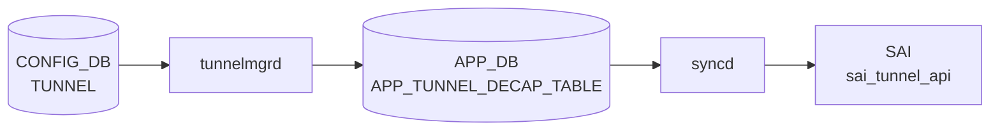

# TUNNEL テーブル

## 概要

SONiC Dual-ToR (Active-Standby) 構成で、ToR スイッチ間に張る [IPinIP](../../reference/glossary.md#term-ipinip) トンネルを定義するテーブル[^1]。`tunnelmgrd` が [CONFIG_DB](../../reference/glossary.md#term-config_db) の本テーブルを購読し、[APPL_DB](../../reference/glossary.md#term-appl_db) `TUNNEL_DECAP_TABLE` を生成。`tunneldecaporch` ([orchagent](../../reference/glossary.md#term-orchagent)) が [SAI](../../reference/glossary.md#term-sai) tunnel オブジェクトを作成する。

<!-- cdb-mermaid -->
### データフロー (自動生成)



!!! note "凡例"
    CONFIG_DB から SAI までの典型経路を `docs/reference/config-db-orch-map.md` から機械生成したミニ図。詳細・例外は本ページ本文と対応表を参照。
<!-- /cdb-mermaid -->

## key 構造

```text
TUNNEL|<mux_tunnel>
```

- `<mux_tunnel>`: `MuxTunnel<n>` の文字列パターン（[YANG](../../reference/glossary.md#term-yang) `pattern "MuxTunnel[0-9]+"`）

## フィールド

| フィールド | 型 | 説明 |
|-----------|----|------|
| `tunnel_type` | enum `IPINIP` | カプセル化方式。Dual-ToR では [IPinIP](../../reference/glossary.md#term-ipinip) 固定 |
| `src_ip` | leafref → `PEER_SWITCH.address_ipv4` | トンネル送信元 (= peer ToR の IPv4) |
| `dst_ip` | inet:ipv4-address | トンネル宛先 (自スイッチの IPv4) |
| `dscp_mode` | string `uniform`/`pipe` | [DSCP](../../reference/glossary.md#term-dscp) 継承モード |
| `ecn_mode` | string `copy_from_outer`/`standard` | デカプセル時 ECN 処理 |
| `encap_ecn_mode` | string `standard` | カプセル時 ECN マーキング |
| `ttl_mode` | string `uniform`/`pipe` | TTL 継承モード |
| `decap_dscp_to_tc_map` | string | デカプセル時 [DSCP](../../reference/glossary.md#term-dscp)→TC マップ名 |
| `decap_tc_to_pg_map` | string | デカプセル時 TC→PG マップ名 |
| `encap_tc_to_dscp_map` | string | カプセル時 TC→[DSCP](../../reference/glossary.md#term-dscp) マップ名 |
| `encap_tc_to_queue_map` | string | カプセル時 TC→Queue マップ名 |

## 制約

- `src_ip` は `PEER_SWITCH_LIST.address_ipv4` への leafref で、PEER_SWITCH に登録された IPv4 のみ使える
- `tunnel_type` は IPINIP のみ。`tunneldecaporch.cpp` も `tunnel_type != "IPINIP"` をエラーとする

## 購読者

- `tunnelmgrd` (cfgmgr): [CONFIG_DB](../../reference/glossary.md#term-config_db)→[APPL_DB](../../reference/glossary.md#term-appl_db) へ橋渡し
- `tunneldecaporch` ([orchagent](../../reference/glossary.md#term-orchagent)): [APPL_DB](../../reference/glossary.md#term-appl_db) `TUNNEL_DECAP_TABLE` 経由で [SAI](../../reference/glossary.md#term-sai) へ反映

## 関連 CONFIG_DB / YANG / CLI

- 関連 [CONFIG_DB](../../reference/glossary.md#term-config_db): `PEER_SWITCH`、`MUX_CABLE`、`TUNNEL_DECAP_TABLE` (派生は `docs/reference/config-db/tunnel-decap-table.md`)
- 関連 CLI: 直接の CLI は無く `config_db.json` で投入
- 関連 [YANG](../../reference/glossary.md#term-yang): `sonic-tunnel`、`sonic-peer-switch`

<!-- ref-triangle:start -->

## 関連リファレンス

- [YANG](../../reference/glossary.md#term-yang): [`sonic-tunnel`](../yang/sonic-tunnel.md) / `sonic-peer-switch`

<!-- ref-triangle:end -->

## 引用元

[^1]: YANG 定義: `sonic-tunnel.yang`. <https://github.com/sonic-net/sonic-buildimage/blob/9ea932ec2e18f35e58268ec2e4456b1d4afd65cd/src/sonic-yang-models/yang-models/sonic-tunnel.yang>; [orchagent](../../reference/glossary.md#term-orchagent) 側パース: `tunneldecaporch.cpp`. <https://github.com/sonic-net/sonic-swss/blob/4305596156d70e9797e8a881b3d19b46de0bce0d/orchagent/tunneldecaporch.cpp>

<!-- cdb-exceptions -->
## 例外条件・特殊挙動

<!-- evidence: sonic-swss/cfgmgr/tunnelmgr.cpp@4305596156d70e9797e8a881b3d19b46de0bce0d L160-315 -->

- **Peer IP 未設定時はトンネル未作成**: `PEER_SWITCH` テーブルから `m_peerIp` が取得できない場合、`"Peer/Remote IP not configured"` を LOG_NOTICE して APPL_DB への書き込みをスキップする。Peer IP 設定後に再処理される。
- **存在しないトンネルの DEL**: キャッシュに存在しないトンネルへの DEL は `"Tunnel <name> not found"` を LOG_ERROR し `return true`（タスクは消費され再試行なし）。
- **IPINIP 以外は APPL_DB 不通知**: `tunnel_type` が `IPINIP` 以外の場合、キャッシュには追加されるが orchagent への APPL_DB 通知は行われない。
- **Warm reboot 時の重複防止**: `m_tunnelReplay` にエントリが存在する場合（ウォームリブート時）は APPL_DB への書き込みをスキップして orchagent クラッシュを防ぐ。
- **`src_ip` 未設定で P2MP decap**: `src_ip` が空のまま SET すると `P2MP`（ワイルドカード）タイプの decap term が作成される。意図せず全 IPinIP トンネルパケットを受け入れる設定になる点に注意。
- **カーネル `ip tunnel add` 失敗**: コマンド実行失敗で `configIpTunnel()` が `false` を返すとタスクがキューに戻されリトライされる。

<!-- /cdb-exceptions -->

<!-- ops-hint -->
## 運用ヒント

### 典型値

- key 形式: `TUNNEL|<tunnel-name>`。
- `tunnel_type`: `IPINIP` 等。
- `src_ip` / `dst_ip`、`encap_ecn_mode`、`ttl_mode`。

### よくある誤設定

- dual-ToR で `tunnel_type` を両 ToR で揃えないと MUX_CABLE 経由のトラフィックが片方向 drop。

### 確認コマンド

```bash
sonic-db-cli CONFIG_DB keys 'TUNNEL|*'
show tunnel
```
<!-- /ops-hint -->

<!-- glossary-links-injected: b4c5898e0257 -->
